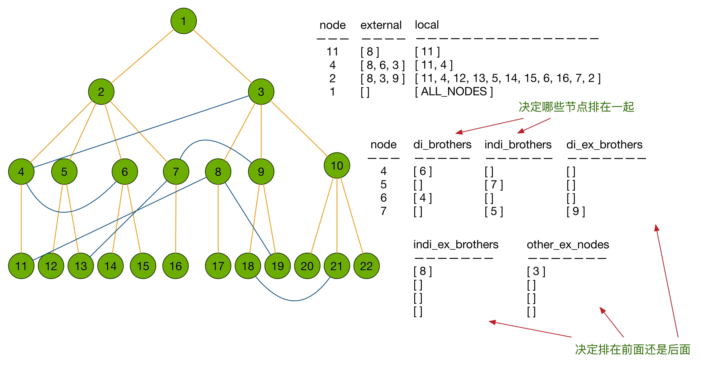
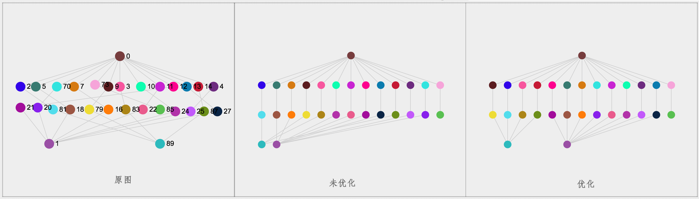
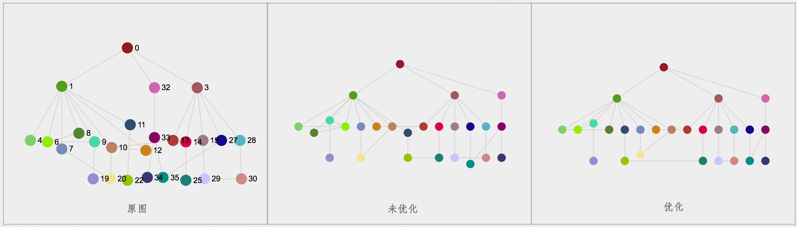
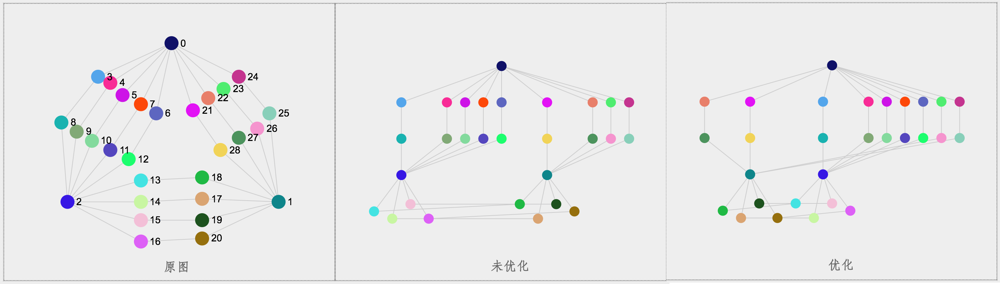
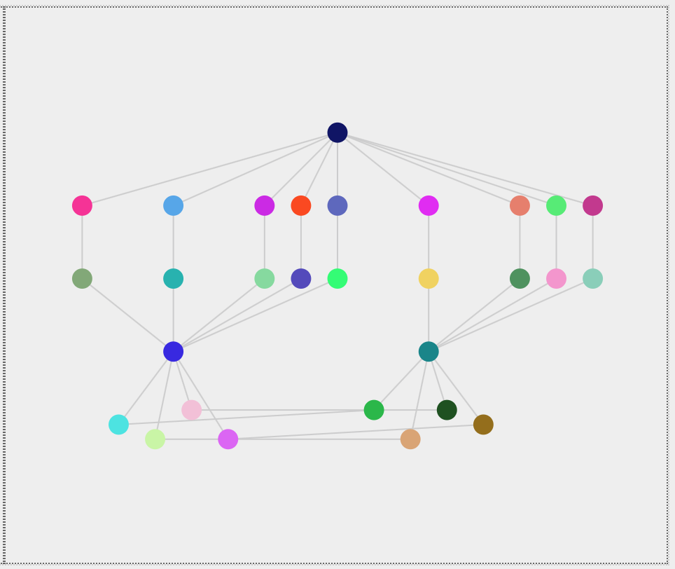
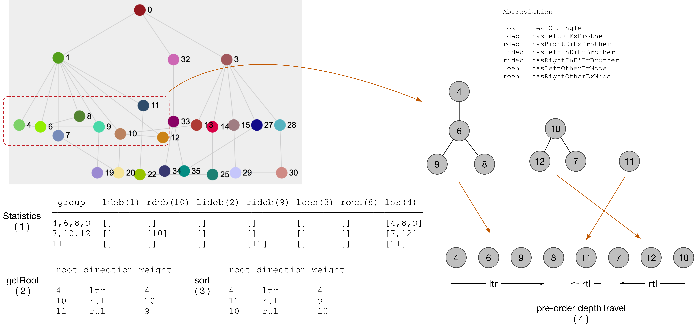

# Hierarchy layout

> 层次布局算法研究和实践

> 信赖和善于利用经时间证明的智慧

## 算法描述

`相关概念`：

1. 选定一个`中心`节点，对图进行`广度遍历`，形成一片`遍历森林`（或者叫做`布局森林`）
2. `布局森林`中每个节点在以它为根的子树上拥有的`叶子节点数`(`node._wt_leaves`)，决定其在层次布局中的`宽度`；每个节点在遍历树中的`层级`(`node._wt_level`)，决定其在层次布局中的`层次`。
3. `布局森林`包含一到多棵`布局树`，对于每棵`布局树`，其`根节点`的`叶子节点数`为`leaves`，其节点的`最大层级`为`level`，在布局的时候将该布局树在尺寸为`leaves*level`的`网格`上进行`均衡`分布。 

`优化策略`：

1. `同层`兄弟节点有边，通过调整让`有边`的兄弟节点`靠近`
2. 避免`同层`其他边`穿过`节点`中心`
3. 两个`上层`节点同时与一个`下层`节点`有边`，通过调整让有边的兄弟节点`靠近`
4. `大量`同层`叶子型`节点，形成矩阵
5. 支持`横向`布局
6. `层高`与同层`邻接`节点`距离`可独立`配置`，特别对于同层孩子节点较多的情况，加大层高效果更明显
7. 综合考虑与`兄弟`节点关系、与`堂兄弟`节点关系以及其他`外部`节点关系，使得有关联的节点相互靠近，获得较优排布。已`包含3`的优化
8. 直接兄弟、间接兄弟、直接堂兄弟、间接堂兄弟按`子树大小`排序，能解决兄弟排序算法的bad case（虽不一定是普遍最优，但能有效解决目前发现的问题）。

`适用场景`：

1. 边数`不大于`节点数的图形。
2. `树状`图

## 工具方法

### getAdjacentNodes

`getAdjacentNodes(node, edges)`：获取节点node的`邻接`节点。

    @[data-script="javascript"]sigma.utils.getAdjacentNodes
        = function( node, nodes, edges ) {
        var retNodes = [];

        if ( !node || !nodes || !edges ) {
            return retNodes;
        }

        edges.forEach(function(edge){
            var adjNodeId, adjNode;

            if(edge.source == node.id){
                adjNodeId = edge.target;
            }

            if(edge.target == node.id){
                adjNodeId = edge.source;
            }

            if(!adjNodeId){
                return;
            }

            if(adjNodeId != node.id){
                if(nodes.map(function(node){return node.id;})
                    .indexOf(adjNodeId) >= 0){
                    adjNode = sigma.utils.getNodeById(nodes, adjNodeId);
                    retNodes.push(adjNode);
                }
            }
        });

        return retNodes;
    };

### adjustSiblingsOrder

`adjustSiblingsOrder(parent, edges)`：`层次`布局中，`同层次`的`兄弟`节点之间如果存在边，则调整`有边`的兄弟节点`靠近`。

    @[data-script="javascript"]sigma.utils.adjustSiblingsOrder
        = function(parentNode, edges) {

        if(!parentNode || !parentNode._wt_children){
            console.log(arguments.callee
                , 'parentNode is null or parentNode._wt_children is not existed');
            return;
        }
        
        var nodes = parentNode._wt_children
            , edges = edges || []
            , visitedNodes = {}
            , node
            , index
            , len = nodes.length
            , j
            , adjacentNodes
            , flagLeft
            , flagRight
            , _getAdjacentNodes = sigma.utils.getAdjacentNodes
            ;

        while((index = _hasMoreIndex()) >= 0){
            node = nodes[index];
            visitedNodes[node.id] = 1;
            adjacentNodes = _getAdjacentNodes(node, nodes, edges);
            flagLeft = 0;
            flagRight = 0;
            if(adjacentNodes && adjacentNodes.length){

                if(index>0 && adjacentNodes.indexOf(nodes[index-1]) < 0){
                    for(j=index-1; j>=0; j--){
                        if(adjacentNodes.indexOf(nodes[j]) >= 0){
                            nodes.splice(index, 1);
                            nodes.splice(j, 0, node);
                            flagLeft = 1;
                            break;
                        }
                    }
                } 

                if(flagLeft){
                    continue;
                }

                if(index<len - 1 && adjacentNodes.indexOf(nodes[index+1]) < 0){
                    for(j=index+1; j<len; j++){
                        if(adjacentNodes.indexOf(nodes[j]) >= 0){
                            nodes.splice(j-1, 0, node);
                            nodes.splice(index, 1);
                            break;
                        }
                    }
                } 

            }
        }

        function _hasMoreIndex(){
            for(var i=0; i<len; i++){
                var _node = nodes[i];
                if(!visitedNodes[_node.id]){
                    return i;            
                }
            }
            return -1;
        }

    };

### avoidSameLevelTravelThrough

`avoidSameLevelTravelThrough(nodesOfSameLevel, edges)`：层次布局中，属于`同一层级`的所有节点中，`非靠近`节点之间存在边相连，调整中间节点的`上下位置`，`避免`边`穿过`中间节点，造成不直观的效果。

    @[data-script="javascript"]sigma.utils.avoidSameLevelTravelThrough
        = function(nodesOfSameLevel, edges) {

        if(!nodesOfSameLevel){
            console.log(arguments.callee
                , 'nodesOfSameLevel is null');
            return;
        }

        var nodes = nodesOfSameLevel 
            , edges = edges || []
            , unit = unit || 1
            , node, fromNode, toNode
            , len = nodes.length
            , i, j, k
            ;

        nodes.forEach(function(node){
            delete node._wt_dy;
        });

        for(i=0; i<len; i++){
            fromNode = nodes[i];
            for(j=i+2; j<len; j++){
                toNode = nodes[j];
                if(_isConnected(fromNode, toNode)){
                    for(k=i+1; k<j; k++){
                        node = nodes[k];     
                        // adjust once
                        if(node._wt_dy) {
                            continue;
                        }
                        node._wt_dy = ( k % 2 == 0 ? -1 : 1 );
                    }
                }
            }
        } 

        function _isConnected(fromNode, toNode){
            for(var i=0; i<edges.length; i++){
                var edge = edges[i];
                if(edge.source == fromNode.id
                        && edge.target == toNode.id
                    || edge.source == toNode.id
                        && edge.target == fromNode.id) {
                    return 1;
                } 
            }
            return 0;
        }

    };

### avoidChildrenTravelThrough

`avoidChildrenTravelThrough(parent, edges)`：层次布局中，属于`同一父节点`的所有`兄弟`节点中，`非靠近`节点之间存在边相连，调整中间节点的`上下位置`，`避免`边`穿过`中间节点，造成不直观的效果。

    @[data-script="javascript"]sigma.utils.avoidChildrenTravelThrough
        = function(parentNode, edges) {

        if(!parentNode || !parentNode._wt_children){
            console.log(arguments.callee
                , 'parentNode is null or parentNode._wt_children is not existed');
            return;
        }

        sigma.utils.avoidSameLevelTravelThrough(
            parentNode._wt_children
            , edges
        );
    };

### 阶段性方法验证

验证`adjustSiblingsOrder`, `avoidChildrenTravelThrough`等方法。

    @[data-script="javascript editable"]
    (function(){

        var s = fly.createShow('#test_37');
        var g1 = getRandomGraph(10, 10, 1);
        var g1 = networkGraph_edges_between_the_same_level_nodes_2;
        var g2 = networkGraph_edges_between_the_same_level_nodes;
        var containerId = 'test_37_graph';
        var rendererSettings = {
                // captors settings
                doubleClickEnabled: true
                , mouseWheelEnabled: false

                // rescale settings
                , minEdgeSize: 0.5
                , maxEdgeSize: 1
                , minNodeSize: 1 
                , maxNodeSize: 5

                // renderer settings
                , edgeHoverColor: fly.randomColor() 
                , edgeHoverSizeRatio: 1
                , edgeHoverExtremities: true
            };
        var sigmaSettings = {
                // rescale settings 
                sideMargin: 5 

                // instance global settings
                , enableEdgeHovering: true
                , edgeHoverPrecision: 5
            };

        var sm1, sm2;

        if((sm1 = isSigmaInstanceExisted('test_37_left'))
            && (sm2 = isSigmaInstanceExisted('test_37_right'))){
            sm1.kill();
            sm2.kill();
        };

        sm1 = getUniqueSigmaInstance(
                    'test_37_left'
                    , {
                        settings: sigmaSettings 
                        , graph: g1
                        , renderers: [
                            {
                                type: 'canvas' 
                                , container: $('#' + containerId + ' .test-graph-left')[0]
                                , settings: rendererSettings
                            }
                        ]
                    }
                ); 

        sm2 = getUniqueSigmaInstance(
                    'test_37_right'
                    , {
                        settings: sigmaSettings 
                        , graph: g2
                        , renderers: [
                            {
                                type: 'canvas' 
                                , container: $('#' + containerId + ' .test-graph-right')[0]
                                , settings: rendererSettings
                            }
                        ]
                    }
                ); 

        var forest = sm1.graph.getLayoutForest()
            ;

        forest.forEach(function(tree){

            s.show('before order adjusting:');
            s.append_show(
                tree._wt_children.map(function(node){
                    return node.id;
                })
            );
    
            sigma.utils.adjustSiblingsOrder(tree, sm1.graph.edges());

            s.append_show('after order adjusting:');
            s.append_show(
                tree._wt_children.map(function(node){
                    return node.id;
                })
            );

            tree = sm1.graph.nodes('n3'); 
            s.append_show('before order adjusting:');
            s.append_show(
                tree._wt_children.map(function(node){
                    return node.id;
                })
            );
    
            sigma.utils.adjustSiblingsOrder(tree, sm1.graph.edges());

            s.append_show('after order adjusting:');
            s.append_show(
                tree._wt_children.map(function(node){
                    return node.id;
                })
            );
        });

        sm1.refresh();

        forest = sm2.graph.getLayoutForest();
        
        forest.forEach(function(tree){

            tree = sm2.graph.nodes('n0'); 
            s.append_show('\nbefore travel through adjusting:');
            s.append_show(
                tree._wt_children.map(function(node){
                    return node.id + ':' + ( node._wt_dy || 0 );
                })
            );
    
            sigma.utils.avoidChildrenTravelThrough(tree, sm2.graph.edges());

            s.append_show('after travel through adjusting:');
            s.append_show(
                tree._wt_children.map(function(node){
                    return node.id + ':' + ( node._wt_dy || 0 );
                })
            );
        });

        sm2.refresh();

    })();

### getNodesFromTree

#### 实现

`getNodesFromTree(tree)`：从树结构中获取相关节点集合。

    @[data-script="javascript"]sigma.utils.getNodesFromTree
        = function( tree ) {
        var nodes = [];

        depthTravel( tree );
        return nodes;

        function depthTravel( node ) {
            nodes.push( node );
            if ( node._wt_children ) {
                node._wt_children.forEach( function( child ) {
                    depthTravel( child );
                } );
            }
        }
    };

#### 验证

    @[data-script="javascript editable"]
    (function(){

        var s = fly.createShow('#test_get_nodes_from_tree');
        var g1 = getRandomGraph(10, 10, 10);
        var g1 = networkGraph_complex_hier_160817; 
        var containerId = 'test_get_nodes_from_tree_graph';
        var rendererSettings = {
                // captors settings
                doubleClickEnabled: true
                , mouseWheelEnabled: false

                // rescale settings
                , minEdgeSize: 0.5
                , maxEdgeSize: 1
                , minNodeSize: 1 
                , maxNodeSize: 5

                // renderer settings
                , edgeHoverColor: fly.randomColor() 
                , edgeHoverSizeRatio: 1
                , edgeHoverExtremities: true
            };
        var sigmaSettings = {
                // rescale settings 
                sideMargin: 5 

                // instance global settings
                , enableEdgeHovering: true
                , edgeHoverPrecision: 5
                , autoRescale: 0
            };

        var sm1;

        if((sm1 = isSigmaInstanceExisted('test_get_nodes_from_tree'))){
            sm1.kill();
        };

        sm1 = getUniqueSigmaInstance(
                    'test_get_nodes_from_tree'
                    , {
                        settings: sigmaSettings 
                        , graph: g1
                        , renderers: [
                            {
                                type: 'canvas' 
                                , container: $('#' + containerId)[0]
                                , settings: rendererSettings
                            }
                        ]
                    }
                ); 

        sm1
            .alignCenter({rescaleToViewport: 1})
            .refresh()
            ;

        var forest = sm1.graph.getLayoutForest()
            ;

        s.show('get nodes: ');
        var id = 1;
        forest.forEach(function(tree){

            var nodes = sigma.utils.getNodesFromTree( tree );
            s.append_show(
                'tree ' + id++
                , nodes.map( function( node ) {
                    return node.id;
                } )
            );
        });

    })();

### computeLocalAndExternalNodes

#### 算法说明

`computeLocalAndExternalNodes(subGraph, root, options)`：计算root为根的`树结构`中，以每个节点为根的子树的`本地`节点和`外部`节点，并将它们以`_wt_lenodes`字段保存。

1. 每个节点都有`_wt_lenodes`字段
2. 子节点的外部节点不一定属于父节点外部节点
3. `tree root`不存在外部节点
4. `祖先`节点、当前`本地`节点都不属于当前节点的外部节点集合

#### lenodes结构说明

该数据结构用于`同层`节点位置调整时的重要判断信息。包含以下字段：

    {
        // 本地节点，包含以当前节点为根的子树的所有节点，以及当前节点本身
        local: { ... }

        // 外部节点，与本地节点相连的除本地节点、祖先节点外的节点
        , external: { ... }

        // 当前节点的直接兄弟节点
        , di_brothers: [ ... ]

        // 当前节点的间接兄弟节点
        , indi_brothers: [ ... ]

        // 当前节点的直接堂兄弟节点
        , di_ex_brothers: [ ... ]

        // 当前节点的间接堂兄弟节点
        , indi_ex_brothers: [ ... ]

        // 其他外部节点，是外部节点的子集，不包括前四种节点，同时不包含兄弟和堂兄弟节点的子孙节点
        , other_ex_nodes: [ ... ]
    }

 

#### 兄弟&堂兄弟算法

`特征`：

1. `di_brothers`和`indi_brothers`可能有`交集`，也即节点B既是A的直接兄弟，同时还是间接兄弟 
2. `di_ex_brothers`和`indi_ex_brothers`也可能有`交集`，也即节点B既是A的直接堂兄弟，同时还是间接堂兄弟

`算法`：todo

#### 代码实现

    @[data-script="javascript"]sigma.utils.computeLocalAndExternalNodes
        = function( subGraph, root, options ) {
        var opt = options || {}
            , subGraph = subGraph || { nodes: [], edges: [] }
            , nodes = subGraph.nodes
            , edges = subGraph.edges
            , nodesHash = {}
            , ancestorNodes = {}
            // local and external nodes
            , leNodes 
            , getAdjacentNodes = sigma.utils.getAdjacentNodes
            , nodeIdsOfSameLevel = {}
            ;

        if ( !root ) {
            return;
        }

        nodes.forEach( function( node ) { 
            nodesHash[ node.id ] = node;
        } );

        _sameLevelNodes( root );
        leNodes = _leNodes( root );
        _brothers ( root );
        return;

        function _leNodes( node ) {
            var localNodes = {}
                , externalNodes = {}
                , tmpNodes
                , adjacentNodes = {}
                , children = node._wt_children
                , id = node.id
                , _le_nodes
                ;

            if ( children ) {
                ancestorNodes[ id ] = 1;
                children.forEach( function( child ) {
                    var le = _leNodes( child );

                    _extend( localNodes, le.local );
                    _extend( externalNodes, le.external );
                } );
                delete ancestorNodes[ id ];
            }

            localNodes[ id ] = 1;
            tmpNodes = getAdjacentNodes( node, nodes, edges );
            if ( tmpNodes ) {
                for ( var i = 0; i < tmpNodes.length; i++ ) {
                    adjacentNodes[ tmpNodes[ i ].id ] = 1;
                }
            }
            _extend( externalNodes, adjacentNodes );
            for ( var i in ancestorNodes ) {
                delete externalNodes[ i ];
            }
            for ( var i in localNodes ) {
                delete externalNodes[ i ];
            }

            _le_nodes = {
                local: localNodes
                , external: externalNodes
                , adj: adjacentNodes
            };
            node._wt_lenodes = _le_nodes;
            return _le_nodes;
        }

        function _extend( dest, src ) {
            for( var i in src ) {
                dest[ i ] = src[ i ];
            }
        }

        function _sameLevelNodes( node ) {
            var children = node._wt_children
                , idArr = nodeIdsOfSameLevel[ node._wt_level ]
                ;

            if ( !idArr ) {
                idArr = nodeIdsOfSameLevel[ node._wt_level ]  = [];
            }
            idArr.push( node.id );

            if ( children ) {
                children.forEach( function( child ) {
                    _sameLevelNodes( child ); 
                } );
            }
        }

        function _brothers ( node, siblingIds ) {
            var level = node._wt_level
                , children = node._wt_children
                , sameLevelIds = nodeIdsOfSameLevel[ level ]
                , id = node.id
                , leNodes = node._wt_lenodes
                , siblingIds = siblingIds || []
                , childIds

                // hash objects
                , localNodes = leNodes.local
                , externalNodes = leNodes.external
                , adjacentNodes = leNodes.adj

                , _di_brothers = {}
                , _indi_brothers = {}
                , _di_ex_brothers = {}
                , _indi_ex_brothers = {}
                , _other_ex_nodes = {}
                , _tmp
                ;

            if ( children ) {
                childIds = children.map( function( child ) { return child.id; } );
                children.forEach( function ( child ) {
                    _brothers( child, childIds );
                } );
            }

            var flag
                , _id
                , _node
                , _localNodes
                , _tmpExternalNodes = {}
                ;

            _extend( _tmpExternalNodes, externalNodes );
            for( var j = siblingIds.length - 1; j >= 0; j-- ) {
                _id = siblingIds[ j ];
                if ( _id == id ) {
                    continue;
                }

                if ( adjacentNodes[ _id ] ) {
                    _di_brothers[ _id ] = 1;
                    delete _tmpExternalNodes[ _id ];
                }
            } 

            for( j = sameLevelIds.length - 1; j >= 0; j-- ) {
                _id = sameLevelIds[ j ];
                if ( siblingIds.indexOf( _id ) >= 0 ) {
                    continue;
                }
                
                if ( adjacentNodes[ _id ] ) {
                    _di_ex_brothers[ _id ] = 1;
                    delete _tmpExternalNodes[ _id ];
                }
                else if ( _tmpExternalNodes[ _id ] ) {
                    _indi_ex_brothers[ _id ] = 1;
                    delete _tmpExternalNodes[ _id ];
                }
            }

            for ( var i in _tmpExternalNodes ) {

                flag = 0;

                for( var j = siblingIds.length - 1; j >= 0; j-- ) {
                    _id = siblingIds[ j ];

                    // siblingIds contain node itself
                    if ( _id == id ) {
                        continue;
                    }

                    _node = nodesHash[ _id ];
                    _localNodes = _node._wt_lenodes.local;

                    // B's localNodes contain `B`, eg. `AabB`, `AaB`
                    if ( _localNodes[ i ] ) {
                        _indi_brothers[ _id ] = 1;
                        flag = 1;
                        delete _tmpExternalNodes[ i ];
                    }
                } 
                
                // one external node produce one brother, that's enough.
                if ( flag ) {
                    continue;
                }

                for( j = sameLevelIds.length - 1; j >= 0; j-- ) {
                    _id = sameLevelIds[ j ];

                    if ( siblingIds.indexOf( _id ) >= 0 ) {
                        continue;
                    }

                    _node = nodesHash[ _id ];
                    _localNodes = _node._wt_lenodes.local;

                    if ( _localNodes[ i ] ) {
                        _indi_ex_brothers[ _id ] = 1;
                        delete _tmpExternalNodes[ i ];
                    }
                }

            }

            _extend( _other_ex_nodes, _tmpExternalNodes );

            _extend(
                node._wt_lenodes
                , {
                    di_brothers: _transformToNodes( _di_brothers ) 
                    , indi_brothers: _transformToNodes( _indi_brothers )
                    , di_ex_brothers: _transformToNodes( _di_ex_brothers )
                    , indi_ex_brothers: _transformToNodes( _indi_ex_brothers )
                    , other_ex_nodes: _transformToNodes( _other_ex_nodes )
                }
            )

        }

        function _transformToNodes( obj ) {
            var nodes = [], node;
            for ( var i in obj ) {
                if ( node = nodesHash[ i ] ) {
                    nodes.push( node );
                }
            }
            if( opt.sortBySubTreeSize ) {
                nodes.sort( function( a, b ) {
                    // siblings those have a shorter and smaller subtree
                    // are close to each other
                    return ( 
                        a._wt_height + a._wt_leaves
                            - b._wt_height - b._wt_leaves
                    );
                } );
            }
            return nodes;
        }

    };

#### 验证

运算量较大，1000个节点，1000条边的图，运算完需要大概`30s`左右。需要使用`开关`或者添加`loading`。

    @[data-script="javascript editable"]
    (function(){

        var s = fly.createShow('#test_getLocalAndExternalNodes');
        var optSortBySubTreeSize = 0;
        // var g1 = getRandomGraph(10, 10, 10);
        // var g1 = networkGraph_complex_hier_160817; 
        var g1 = networkGraph_complex_hier_160823; 
        // var g1 = networkGraph_complex_hier_160816;
        // var g1 = networkGraph_edges_between_the_same_level_nodes_3;
        // var g1 = networkGraph_edges_between_the_same_level_nodes;
        // var g1 = networkGraph_edges_between_the_same_level_nodes_2;
        // var g1 = networkGraph_triangle_0801_2;
        var containerId = 'test_getLocalAndExternalNodes_graph';
        var rendererSettings = {
                // captors settings
                doubleClickEnabled: true
                , mouseWheelEnabled: false

                // rescale settings
                , minEdgeSize: 0.5
                , maxEdgeSize: 1
                , minNodeSize: 1 
                , maxNodeSize: 5

                // renderer settings
                , edgeHoverColor: fly.randomColor() 
                , edgeHoverSizeRatio: 1
                , edgeHoverExtremities: true
            };
        var sigmaSettings = {
                // rescale settings 
                sideMargin: 5 

                // instance global settings
                , enableEdgeHovering: true
                , edgeHoverPrecision: 5
                , autoRescale: 0
            };

        var sm1;

        if((sm1 = isSigmaInstanceExisted('test_getLocalAndExternalNodes'))){
            sm1.kill();
        };

        sm1 = getUniqueSigmaInstance(
                    'test_getLocalAndExternalNodes'
                    , {
                        settings: sigmaSettings 
                        , graph: g1
                        , renderers: [
                            {
                                type: 'canvas' 
                                , container: $('#' + containerId)[0]
                                , settings: rendererSettings
                            }
                        ]
                    }
                ); 

        sm1
            .normalizeSophonNodes()
            .alignCenter({rescaleToViewport: 1})
            .refresh()
            ;

        sigmaEnableNodeDrag( sm1 );

        var forest = sm1.graph.getLayoutForest()
            ;

        if ( optSortBySubTreeSize ) {
            sigma.utils.computeHeight( forest );
        }

        s.show('show nodes\' `_wt_lenodes`: ');
        var id = 1;
        forest.forEach(function(tree){

            var nodes = sigma.utils.getNodesFromTree( tree )
                , nodeIds = nodes.map( function( node ) {
                    return node.id;
                } )
                , subGraph = sm1.graph.getSubGraph({
                    filter: function( node ) {
                        return nodeIds.indexOf( node.id ) >= 0;
                    }
                })
                ;
            sigma.utils.computeLocalAndExternalNodes( 
                subGraph
                , tree
                , { sortBySubTreeSize: optSortBySubTreeSize } 
            );
            s.append_show(
                'tree ' + id++
            );
            _depthTravel( tree );
        });

        function _depthTravel( node ){
            var le = node._wt_lenodes
                , local = []
                , external = []
                ;

            for ( var i in le.local ) {
                local.push( i );
            }
            for ( var i in le.external ) {
                external.push( i );
            }

            s.append_show(
                node.id
                , { 
                    local: local
                    , external: external
                    , di_brothers: le.di_brothers.map( function( node ) { return node.id; } )
                    , indi_brothers: le.indi_brothers.map( function( node ) { return node.id; } )
                    , di_ex_brothers: le.di_ex_brothers.map( function( node ) { return node.id; } )
                    , indi_ex_brothers: le.indi_ex_brothers.map( function( node ) { return node.id; } )
                    , other_ex_nodes: le.other_ex_nodes.map( function( node ) { return node.id; } )
                }
            ); 
            node._wt_children.forEach( function( child ) {
                _depthTravel( child );
            } );
        }

    })();

### clearLocalAndExternalNodes

`clearLocalAndExternalNodes( tree )`：清理`_wt_lenodes`数据结构，避免循环引用，无法对节点数据进行序列化等操作。

    @[data-script="javascript"]sigma.utils.clearLocalAndExternalNodes
        = function( tree ) {
        if ( !tree ) {
            return;
        }

        _depthTravel( tree );

        function _depthTravel( tree ) {
            var children = tree._wt_children;

            delete tree._wt_lenodes;
            children.forEach( function( child ) {
                _depthTravel( child );
            } );
        }
    };

### adjustSiblingsOrder2

`adjustSiblingsOrder2()`：调整`兄弟`节点间的排布顺序。综合考虑`di_brothers`, `indi_brothers`, `di_ex_brothers`, `indi_ex_brothers`, `other_ex_nodes`，得出一个`较优`排布方案。

#### 效果图

以下是一些`good case`，能将关联的节点靠近排布。

 

 

也存在一些`bad case`，如下图所示，主要是对间接兄弟节点一视同仁，没有做细化分析，反而导致更多的边交叉：

 

这个bad case可以通过对兄弟节点进行按`子树大小排序`来解决，对应`sortBySubTreeSize`选项。再次优化后的效果如下：

  

#### 算法描述

 

`前置说明`：

1. 算法依赖前文`computeLocalAndExternalNodes()`方法所获得的数据结构
2. 该算法用于调整`兄弟`节点间的先后顺序，以较优的排布，保持与`兄弟`节点、`堂兄弟`节点、`堂子孙`节点之间的空间关系
3. 综合考虑`直接兄弟`关系、`间接兄弟`关系、`直接堂兄弟`关系、`间接堂兄弟`关系，以及与`其他外部`节点关系。
    在`排布`节点时，`优先级`排序为：`直接`兄弟关系 `>` `间接`兄弟关系；堂兄弟关系以及外部节点关系决定`靠左`还是`靠右`。
4. 兄弟节点也看成多棵树，使用树的相关算法获得排布序列。树的相关理论贯穿其中

`算法步骤`：

1. 根据`children = di_brothers + indi_brothers`，对同层兄弟节点进行`深度`遍历，获得`森林`。
    遍历过程中，收集上图所示的每棵树的统计信息：`los`, `ldeb`, `lideb`, `rideb`, `loen`, `roen`
2. 针对`森林`的每一棵tree的统计信息，获得合适的根节点，方法为：

    * 有`左直接`堂兄弟，则以第一个拥有左直接堂兄弟的节点为根，排布方向为`ltr`，排序权重为`1`
    * 有`右直接`堂兄弟，则以第一个拥有右直接堂兄弟的节点为根，排布方向为`rtl`，排序权重为`10`
    * 有`左间接`堂兄弟，则以第一个拥有左间接堂兄弟的节点为根，排布方向为`ltr`，排序权重为`2`
    * 有`右间接`堂兄弟，则以第一个拥有右间接堂兄弟的节点为根，排布方向为`rtl`，排序权重为`9`
    * 有`左外部`节点，则以第一个拥有左外部节点的节点为根，排布方向为`ltr`，排序权重为`3`
    * 有`右外部`节点，则以第一个拥有右外部节点的节点为根，排布方向为`rtl`，排序权重为`8`
    * `无外连`节点（无直接堂兄弟、间接堂兄弟和其他外部节点），选树中一度节点或者零度节点为根，排布方向为`ltr`，排序权重为`4`

3. 针对`森林`的每一棵tree，根据排序`权重`从小到大`排序`
4. 根据排序后的顺序，对每一棵树进行`前序深度`遍历，得到遍历序列，若当前树的排布方向为`rtl`，则将遍历序列进行`逆序`。然后将每棵树的最终遍历序列顺次从左到右添加到最终序列中

#### 代码实现

    @[data-script="javascript"]sigma.utils.adjustSiblingsOrder2
        = function( parentNode, options ) {
        if ( !parentNode ) {
            throw new Error('sigma.utils.adjustSiblingsOrder2: no parentNode');
        }

        var opt = options || {}
            , siblings = parentNode._wt_children
            , siblingGroups
            , newSiblings = []
            ;

        siblingGroups = _getGroups( siblings );
        siblingGroups.sort( function( a, b ) {
            return a.weight - b.weight;
        } );
        _layoutGroups( siblingGroups );
        parentNode._wt_children = newSiblings;
        return { 
            siblingGroups: siblingGroups 
            , newSiblings: newSiblings
        };

        function _layoutGroups( groups ) {
            groups.forEach( function( group ) {
                var root = group.root
                    , visitedNodes = {}
                    , groupNodes = []
                    ;

                _travel( root );
                if ( group.direction == 'rtl' ) {
                    groupNodes.reverse();
                }
                newSiblings = newSiblings.concat( groupNodes );

                // pre-order depth travel
                function _travel( node ) {
                    // must check first if node has been visited
                    if ( visitedNodes[ node.id ] ) {
                        return;
                    }
                    visitedNodes[ node.id ] = 1;
                    groupNodes.push( node );

                    var leNodes = node._wt_lenodes 
                        // may have duplicated items in `children` array
                        , children = leNodes.di_brothers.concat( leNodes.indi_brothers )
                        ;

                    _uniq( children );
                    // drop out visited nodes
                    for ( var i = children.length - 1; i >= 0; i-- ) {
                        if ( visitedNodes[ children[ i ].id ] ) {
                            children.splice( i, 1 );
                        }
                    }

                    children.forEach( function( child ) {
                        _travel( child );
                    } );
                }
            } );
        }

        // divide into groups or trees
        function _getGroups( siblings ) {
            var groups = []
                , group
                , visitedNodes = {} 
                , node
                , info
                ;

            while ( ( node = _hasMore() ) ) {
                info = _depthTravel( node );
                group = _getRoot( info );
                if ( !group.root ) {
                    group = { root: node, direction: 'ltr', weight: 4 };
                }
                groups.push( group );
            }
            return groups;

            function _getRoot( info ) {
                var root
                    , direction = 'ltr'
                    , weight = 4
                    ;

                if ( ( root = info.hasLeftDiExBrother[ 0 ] ) ) {
                    weight = 1;
                }
                else if ( ( root = info.hasRightDiExBrother[ 0 ] ) ) {
                    direction = 'rtl';
                    weight = 10;
                }
                else if ( ( root = info.hasLeftInDiExBrother[ 0 ] ) ) {
                    weight = 2;
                }
                else if ( ( root = info.hasRightInDiExBrother[ 0 ] ) ) {
                    direction = 'rtl';
                    weight = 9;
                }
                else if ( ( root = info.hasLeftOtherExNode[ 0 ] ) ) {
                    weight = 3;
                }
                else if ( ( root = info.hasRightOtherExNode[ 0 ] ) ) {
                    direction = 'rtl';
                    weight = 8;
                }
                else if ( ( root = info.leafOrSingle[ 0 ] ) ) {}
                else {
                    root = null;
                }

                return {
                    root: root
                    , direction: direction
                    , weight: weight 
                };
            }

            function _depthTravel( node ) {
                var leNodes = node._wt_lenodes 
                    // may have duplicated items in `children` array
                    , children = leNodes.di_brothers.concat( leNodes.indi_brothers )
                    , di_ex_brothers = leNodes.di_ex_brothers
                    , indi_ex_brothers = leNodes.indi_ex_brothers
                    , other_ex_nodes = leNodes.other_ex_nodes
                    , exNode
                    , info = {
                        leafOrSingle: []
                        , hasLeftDiExBrother: []
                        , hasLeftInDiExBrother: []
                        , hasRightDiExBrother: []
                        , hasRightInDiExBrother: []
                        , hasLeftOtherExNode: []
                        , hasRightOtherExNode: []
                    }
                    ;
                
                _uniq( children );
                if ( children.length <= 1 ) {
                    info.leafOrSingle.push( node );
                }

                for ( var i = 0; i < di_ex_brothers.length; i++ ) {
                    exNode = di_ex_brothers[ i ];
                    if ( typeof exNode.hier_x != 'undefined' ) {
                        info.hasLeftDiExBrother.push( node );
                        break;
                    }
                    else {
                        info.hasRightDiExBrother.push( node );
                        break;
                    }
                }

                for ( var i = 0; i < indi_ex_brothers.length; i++ ) {
                    exNode = indi_ex_brothers[ i ];
                    if ( typeof exNode.hier_x != 'undefined' ) {
                        info.hasLeftInDiExBrother.push( node );
                        break;
                    }
                    else {
                        info.hasRightInDiExBrother.push( node );
                        break;
                    }
                }

                for ( var i = 0; i < other_ex_nodes.length; i++ ) {
                    exNode = other_ex_nodes[ i ];
                    if ( typeof exNode.hier_x != 'undefined' ) {
                        info.hasLeftOtherExNode.push( node );
                        break;
                    }
                    else {
                        info.hasRightOtherExNode.push( node );
                        break;
                    }
                }

                // drop out visited nodes
                for ( var i = children.length - 1; i >= 0; i-- ) {
                    if ( visitedNodes[ children[ i ].id ] ) {
                        children.splice( i, 1 );
                    }
                }

                visitedNodes[ node.id ] = 1;
                children.forEach( function( child ) {
                    var _info = _depthTravel( child );
                    for ( var i in info ) {
                        info[ i ] = info[ i ].concat( _info[ i ] );
                    }
                } );

                return info;
            }

            function _hasMore() {
                for ( var i = 0; i < siblings.length; i++ ) {
                    if ( !visitedNodes[ siblings[ i ].id ] ) {
                        return siblings[ i ];
                    }
                }
                return null;
            }
        }

        function _uniq( nodesArray ) {
            var _visitedNodes = {}
                , _duplicatedIndexes = []
                , _node
                , _index
                ;

            for ( var i = 0; i < nodesArray.length; i++ ) {
                _node = nodesArray[ i ];
                if ( _visitedNodes[ _node.id ] ) {
                    _duplicatedIndexes.push( i ); 
                }
                _visitedNodes[ _node.id ] = 1;
            }

            for ( i = _duplicatedIndexes.length - 1; i >= 0; i-- ) {
                _index = _duplicatedIndexes[ i ];
                nodesArray.splice( _index, 1 );
            }

            return nodesArray;
        }

    };

#### 验证

    @[data-script="javascript editable"]
    (function(){

        var s = fly.createShow('#test_adjustSiblingsOrder2');
        var g1 = getRandomGraph(10, 10, 10);
        var g1 = networkGraph_complex_hier_160817; 
        // var g1 = networkGraph_complex_hier_160816;
        var g1 = networkGraph_complex_hier_160820; 
        // var g1 = networkGraph_edges_between_the_same_level_nodes_3;
        // var g1 = networkGraph_edges_between_the_same_level_nodes;
        // var g1 = networkGraph_edges_between_the_same_level_nodes_2;
        // var g1 = networkGraph_person_event_event_person_0729;
        // var g1 = networkGraph_person_event_event_person_0801;
        var g1 = networkGraph_triangle_0801_2;
        var containerId = 'test_adjustSiblingsOrder2_graph';
        var rendererSettings = {
                // captors settings
                doubleClickEnabled: true
                , mouseWheelEnabled: false

                // rescale settings
                , minEdgeSize: 0.5
                , maxEdgeSize: 1
                , minNodeSize: 1 
                , maxNodeSize: 5

                // renderer settings
                , edgeHoverColor: fly.randomColor() 
                , edgeHoverSizeRatio: 1
                , edgeHoverExtremities: true
            };
        var sigmaSettings = {
                // rescale settings 
                sideMargin: 5 

                // instance global settings
                , enableEdgeHovering: true
                , edgeHoverPrecision: 5
                , autoRescale: 0
            };

        var sm1;

        if((sm1 = isSigmaInstanceExisted('test_adjustSiblingsOrder2'))){
            sm1.kill();
        };

        sm1 = getUniqueSigmaInstance(
                    'test_adjustSiblingsOrder2'
                    , {
                        settings: sigmaSettings 
                        , graph: g1
                        , renderers: [
                            {
                                type: 'canvas' 
                                , container: $('#' + containerId)[0]
                                , settings: rendererSettings
                            }
                        ]
                    }
                ); 

        sm1
            .normalizeSophonNodes()
            .alignCenter({rescaleToViewport: 1})
            .refresh()
            ;

        sigmaEnableNodeDrag( sm1 );

        var forest = sm1.graph.getLayoutForest()
            ;

        s.show('show nodes: ');
        var id = 1;
        forest.forEach(function(tree){

            var nodes = sigma.utils.getNodesFromTree( tree )
                , nodeIds = nodes.map( function( node ) {
                    return node.id;
                } )
                , subGraph = sm1.graph.getSubGraph({
                    filter: function( node ) {
                        return nodeIds.indexOf( node.id ) >= 0;
                    }
                })
                , nodesOfSameLevel = {}
                ;

            _sameLevelNodes( tree );
            s.append_show( '\nnodes of level: ' );
            for ( var i in nodesOfSameLevel ) {
                s.append_show(
                    'level ' + i
                    , nodesOfSameLevel[ i ].map( function( node ) {
                        return node.id;
                    } )
                );
            }

            s.append_show('\nadjusting sibling order:');

            sigma.utils.computeLocalAndExternalNodes( subGraph, tree );
            _depthTravel( tree );

            function _depthTravel( node ) {
                var children = node._wt_children
                    , info = sigma.utils.adjustSiblingsOrder2( node )
                    ;

                s.append_show(
                    'old _wt_children of ' + node.id
                    , children.map( function( child ) {
                        return child.id;
                    } )
                );

                // mock
                node.hier_x = 1;

                s.append_show(
                    'group info'
                    , info.siblingGroups.map( function( group ) {
                        return [
                            group.root.id
                            , group.direction
                            , group.weight
                        ].join(' - ');
                    } ) 
                );

                children = node._wt_children;
                s.append_show(
                    'new _wt_children of ' + node.id
                    , children.map( function( child ) {
                        return child.id;
                    } )
                    , '\n'
                );

                children.forEach( function( child ) {
                    _depthTravel( child );
                } );
            }

            function _sameLevelNodes( node ) {
                var _nodes
                    , _level = node._wt_level
                    , _children = node._wt_children
                    ;

                _nodes = nodesOfSameLevel[ _level ] = nodesOfSameLevel[ _level ] || []; 
                _nodes.push( node );
                if ( _children ) {
                    _children.forEach( function( child ) {
                        _sameLevelNodes( child );
                    } );
                }
            }
        });

    })();

## 算法实现

`层次布局算法`(`无优化`)：

    @[data-script="javascript"]sigma.prototype.layoutHierarchy
        = function(options){
        var me = this;
        me.initializeLayout();

        var opt = options || {} 
            , forest = me.graph.getLayoutForest(opt)
            , treeOffsetX = 0
            , unit = opt.unit || 1
            ;

        sigma.utils.computeLeaves(forest);

        forest.forEach(function(tree){

            depthTravel(tree, treeOffsetX);
            treeOffsetX += unit * tree._wt_leaves;

            function depthTravel(node, parentX){
                var children = node._wt_children
                    , leaves = node._wt_leaves
                    , level = node._wt_level - 1
                    , parentX = parentX || 0
                    , currentX = 0
                    ;

                node.hier_x = parentX + unit * leaves / 2;
                node.hier_y = unit * level;

                if(children.length > 0){
                    children.forEach(function(child){
                        depthTravel(child, parentX + currentX);
                        currentX += unit * child._wt_leaves;
                    }); 
                }
                delete node._wt_children;
            }

        });

        return this;
    };

`层次布局算法`(`使用均衡优化`、`优化策略1`、`优化策略2`、`优化策略5`、`优化策略6`、`优化策略3`、`优化策略7`、`优化策略8`)：

    @[data-script="javascript"]sigma.prototype.layoutHierarchy2
        = function(options){
        var me = this;
        me.initializeLayout();

        var opt = options || {} 
            , forest = me.graph.getLayoutForest(opt)
            , treeOffsetX = 0
            , spaceGrid = opt.spaceGrid || {xSize: 40, ySize: 40}

            // compatible with old versions
            , unit = opt.unit || opt.xUnit || opt.yUnit || 1

            , xUnit = opt.xUnit || unit
            , yUnit = opt.yUnit || unit
            , gridUnit = Math.min( xUnit, yUnit )
            , edges = me.graph.getSubGraph(options).edges
            , layoutHorizontal = opt.layoutHorizontal || 0
            ;

        sigma.utils.computeLeaves(forest);
        sigma.utils.computeHeight(forest);

        // if `heightLimit`, computes yUnit again
        if ( opt.heightLimit 
            && 1 == forest.length 
            && forest[ 0 ]._wt_maxlevel
            ) {
            /**
             * yUnit = opt.heightLimit / ( forest[ 0 ]._wt_maxlevel - 1 );
             * modified for edge collapsing
             */
            yUnit = opt.heightLimit / forest[ 0 ]._wt_maxlevel;
        }

        forest.forEach(function(tree){

            var maxLevel = 1
                , nodesOfSameLevel = {}
                , avoidSameLevelTravelThrough = opt.avoidSameLevelTravelThrough
                , delta = opt.avoidSameLevelTravelThroughDelta || 0.2
                ;

            if(opt.perfectAdjustSiblingsOrder){
                computeLENodes(tree);
            }
            depthTravel(tree, treeOffsetX * xUnit);
            tree._wt_maxlevel = maxLevel;
            tree._hier_offsetx = treeOffsetX;
            treeOffsetX += tree._wt_leaves;
            if(avoidSameLevelTravelThrough){
                for(var i in nodesOfSameLevel){
                    sigma.utils.avoidSameLevelTravelThrough(
                        nodesOfSameLevel[i]
                        , edges
                    );
                    nodesOfSameLevel[i].forEach(function(node){
                        if(layoutHorizontal){
                            node.hier_x += 
                                ( node._wt_dy || 0 ) * ( delta || 0.2 ) * yUnit;
                        }
                        else {
                            node.hier_y += 
                                ( node._wt_dy || 0 ) * ( delta || 0.2 ) * yUnit;
                        }
                        delete node._wt_dy;
                    });
                }
            }

            function computeLENodes(tree){
                var nodes = sigma.utils.getNodesFromTree( tree )
                    , nodeIds = nodes.map( function( node ) {
                        return node.id;
                    } )
                    , subGraph = me.graph.getSubGraph({
                        filter: function( node ) {
                            return nodeIds.indexOf( node.id ) >= 0;
                        }
                    })
                    ;
                sigma.utils.computeLocalAndExternalNodes( 
                    subGraph
                    , tree 
                    , {
                        sortBySubTreeSize: !opt.noSortBySubTreeSize
                    }
                );
            }

            function depthTravel(node, parentX){
                // note: should be called before getting `node._wt_children` 
                if(opt.perfectAdjustSiblingsOrder){
                    sigma.utils.adjustSiblingsOrder2(node);
                }
                else if(opt.adjustSiblingsOrder){
                    sigma.utils.adjustSiblingsOrder(node, edges);
                }

                var children = node._wt_children
                    , leaves = node._wt_leaves
                    , level = node._wt_level
                    , parentX = parentX || 0
                    , currentX = 0
                    ;

                if(avoidSameLevelTravelThrough){
                    ( nodesOfSameLevel[level] 
                        = nodesOfSameLevel[level] || [] )
                        .push(node);
                }

                if(level > maxLevel) {
                    maxLevel = level;
                }

                if(layoutHorizontal){
                    node.hier_y = parentX + xUnit * leaves / 2;
                    node.hier_x = yUnit * ( level - 1 ); 
                }
                else {
                    node.hier_x = parentX + xUnit * leaves / 2;
                    node.hier_y = yUnit * ( level - 1 ); 
                }

                if(children.length > 0){
                    children.forEach(function(child){
                        depthTravel(child, parentX + currentX);
                        currentX += xUnit * child._wt_leaves;
                    }); 
                }
            }

        });

        sigma.utils.layoutTreesByGrid( 
            forest
            , {
                spaceGrid: spaceGrid
                , optimalDistance: gridUnit
                , readPrefix: 'hier_'
            } 
        ); 

        return this;
    };

## 算法演示

以下示例展示树状`层次`布局算法：

    @[data-script="javascript editable"]
    (function(){

        var s = fly.createShow('#test_50');
        var partialLayout = 0;
        var layoutHorizontal = 0;
        var perfectAdjustSiblingsOrder = 1;
        var noSortBySubTreeSize = 1;
        // var g1 = getRandomGraph(20, 18, 8);
        // var g1 = getLineGraph(20, 18, {nodeSize: 8});
        var g1 = networkGraph_edges_between_the_same_level_nodes_3;
        // var g1 = networkGraph_circle_0628;
        // var g1 = networkGraph_mesh_0628;
        // var g1 = networkGraph_FR;
        // var g1 = networkGraph_ForceAtlas2;
        // var g1 = networkGraph_grid_0521; 
        // var g1 = networkGraph_tree_0521;
        // var g1 = networkGraph_2circles_0523;
        // var g1 = networkGraph_edges_between_the_same_level_nodes;
        // var g1 = networkGraph_edges_between_the_same_level_nodes_2;
        // var g1 = networkGraph_tree_0524;
        // var g1 = networkGraph_many_children_0526;
        // var g1 = networkGraph_forest_0527;
        // var g1 = networkGraph_person_event_event_person_0729;
        // var g1 = networkGraph_person_event_event_person_0801;
        // var g1 = networkGraph_triangle_0801;
        var g1 = networkGraph_triangle_0801_2;
        // var g1 = networkGraph_complex_hier_160816; 
        // var g1 = networkGraph_complex_hier_160817; 
        // var g1 = networkGraph_complex_hier_160820; 
        // var g1 = networkGraph_complex_hier_160823; 

        if(partialLayout){
            g1.nodes.forEach(function(node){
                node.color = node.oldColor || node.color;
                delete node.oldColor;
                delete node.selected;
                if(Math.random() > 0.5){
                    node.selected = 1;
                    node.oldColor = node.color;
                    node.color = '#1f77b4';
                }
            });
        }

        var g2 = {
                nodes: g1.nodes.slice()
                , edges: g1.edges.slice()
            }
            , g3 = {
                nodes: g1.nodes.slice()
                , edges: [] 
            }
            ;
        var containerId = 'test_50_graph';
        var rendererSettings = {
                // captors settings
                doubleClickEnabled: true
                , mouseWheelEnabled: false

                // rescale settings
                , minEdgeSize: 0.5
                , maxEdgeSize: 1
                , minNodeSize: 1 
                , maxNodeSize: 5

                // renderer settings
                , edgeHoverColor: fly.randomColor() 
                , edgeHoverSizeRatio: 1
                , edgeHoverExtremities: true
            };
        var sigmaSettings = {
                // rescale settings 
                sideMargin: 0.1 

                // instance global settings
                , enableEdgeHovering: true
                , edgeHoverPrecision: 5
                , autoRescale: 0
            };

        var sm1, sm2;

        if((sm1 = isSigmaInstanceExisted('test_50_left'))
            && (sm2 = isSigmaInstanceExisted('test_50_right'))){
            sm1.kill();
            sm2.kill();
        };

        sm1 = getUniqueSigmaInstance(
                    'test_50_left'
                    , {
                        settings: sigmaSettings 
                        , graph: g1
                        , renderers: [
                            {
                                type: 'canvas' 
                                , container: $('#' + containerId + ' .test-graph-left')[0]
                                , settings: rendererSettings
                            }
                        ]
                    }
                ); 

        sm2 = getUniqueSigmaInstance(
                    'test_50_right'
                    , {
                        settings: sigmaSettings 
                        , graph: g2
                        , renderers: [
                            {
                                type: 'canvas' 
                                , container: $('#' + containerId + ' .test-graph-right')[0]
                                , settings: rendererSettings
                            }
                        ]
                    }
                ); 

        sigmaEnableNodeDrag(sm2);

        sm1
            .normalizeSophonNodes()
            .alignCenter({rescaleToViewport: 1})
            .refresh()
            ;

        sm2
            .normalizeSophonNodes()
            .alignCenter({rescaleToViewport:1})
            .refresh() // note: must invoke `refresh()` to update coordinates

            .layoutHierarchy2({
                xUnit: 50
                , yUnit: 100
                // , heightLimit: 2000
                // unit: 50
                , adjustSiblingsOrder: 1
                , perfectAdjustSiblingsOrder: perfectAdjustSiblingsOrder
                , noSortBySubTreeSize: noSortBySubTreeSize
                , avoidSameLevelTravelThrough: 1
                , avoidSameLevelTravelThroughDelta: 0.2
                , layoutHorizontal: layoutHorizontal
                , filter: partialLayout
                    ? function(node){return node.selected;}
                    : null
            })
            .normalizeSophonNodes({
                readPrefix: 'hier_'
                , filter: partialLayout
                    ? function(node){return node.selected;}
                    : null
            })
            ;

        if(!partialLayout){
            sm2
            .alignCenter({
                wholeView: 1
                , readPrefix: 'hier_'
                , writePrefix: 'hier_'
            })
            ;
        }

        sm2
            .prepareAnimation({
                readPrefix: 'hier_'
            });

        setTimeout(function(){
            sigma.plugins.animate(
                sm2
                , {
                    x: 'hier_x'
                    , y: 'hier_y'
                }
                , {
                    duration: 1000
                }
            );

        }, 500);

    })();

