# YifanHu layout

> `自停止`、`收敛快`的图布局算法。

`FR`, `ForceAtlas2`等`连续型`布局算法，需要人为停止。`自停止`、`收敛快`正是我们需要的。

## YifanHu布局算法主要思路

* Multilevel approach： 多级`粒度`布局，解决`局部最小`的问题
* Barnes and Hut octree technique： 兼顾`长距离`作用力，简化`斥力`的计算
* An adaptive cooling scheme：加快`收敛`速度
* A general repulsize force model

算法适用： `无向图`，`直线边`，`力导向算法`

## 布局算法概述

### 算法分类

直线边布局算法主要分类：`力导向`法，`光谱法`，`高维嵌入法`

### 力导向算法

建模成一个存在相互作用力的球体物理系统

通过`最小化系统能量`找到一种较好的球体放置方法

循环迭代地将节点沿力的方向移动来达到系统能量的`最小化`，系统能量一开始比较大，但是基于`降温策略`慢慢降低。

### 力导向算法的变种

1. `Fruchterman and Reigold`算法：邻接节点间的弹簧系统，互相拉近；库仑斥力同时存在于不同节点之间，使它们互相远离。
2. `Kamada and Kawai`算法：所有节点间都有弹簧弹力，弹力与节点间的距离成比例。 

### 传统算法的局限

传统力导向布局在处理`大型图布局`时存在`两大局限`因素：

1. 大型图存在很多的`本地最小化`，最终达到的可能只是本地最小化。虽然某些程度上可以通过使用更多迭代次数的`慢速降温`策略来改善，但实践看来，不太可能为大型图找到较好的布局结果。

2. 计算`复杂度`问题。

### 传统算法改进方案

1. `multilevel`方法，能较好解决`本地最小化`问题。
2. 计算复杂度问题，常用方法是只在邻接点间计算作用力。这种方法的缺陷是忽略了相隔较远的节点的作用力。
3. `sprint-electrical`模型中，节点间的斥力是全局的，大小与距离成反比。斥力的计算形成了物理上的`n-body`问题。
4. 有一种广泛采用的算法，在`O(nlog(n))`复杂度下计算斥力，并且考虑了相隔较远的节点，方法是将相隔较远的节点组作为`超级节点`。正如Barnes and Hut算法一样。但这种方法对大型图来说，仍然不理想。

### YifanHu算法改进

`YifanHu`提出了一种既`高效`又`高质量`的算法。在`Mathematica 5.1`中查看。
1. 结合了`Multilevel`方法解决`本地最小化`的优势，以及Barnes and Hut的`octree`算法同时满足短距离和长距离作用力，又兼具`高效性`。
2. 还提出了`自适应降温`策略，以及选择最适宜的`octree/quadtree深度`的策略。

## 定义和符号表示

* `无向图`表示：`G = {V, E}`，其中`V`为节点集合，`E`为边集合。
* `邻接`关系：节点`i`和`j`有边相连，或`i`和`j`是`邻接`节点，用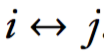表示。
* `图距离`：节点`i`到`j`的`空间`距离，用`d(i, j)`表示。对于`二维图`来说，等于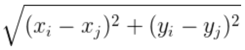。
* `2-norm`距离：，对于`1维`向量来说，实际上就是`绝对值`，`|Xi - Xj|`，而对于`2维`向量来说(x1, x2)，则是`Math.sqrt(x1^2, x2^2)`。
    p-norm: 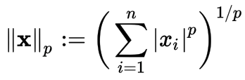 

    (参考: <https://en.wikipedia.org/wiki/Norm_(mathematics)#p-norm>)

## 力导向模型

主要两类模型，`spring-electron model`和`spring model`。

分析基础的力导向算法，提出通用斥力模型以及一个适应性的步骤控制策略。

### spring-electron model

`引力`、`斥力`公式：

 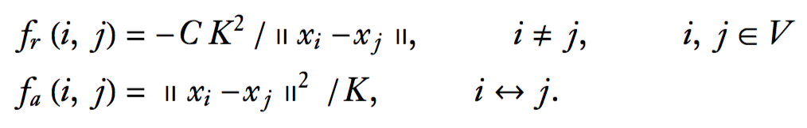

`斥力`与距离成`反比`，`引力`与距离成`正比`。`K`, `C`为`正实数`。

* `K` 最适宜距离，或者正常弹簧长度。
* `C` 斥力与引力的相对强度

`K`可以自行设定或者按以下公式计算：

    K = C^(1/3) * averageEdgeLength

`改变`K和C，并不会改变图的最小能量布局，只是缩放了布局。

#### 边缘效应

力导向`本质特性`： `边缘效应`（peripheral effect)，边缘节点倾向于更加靠近。

 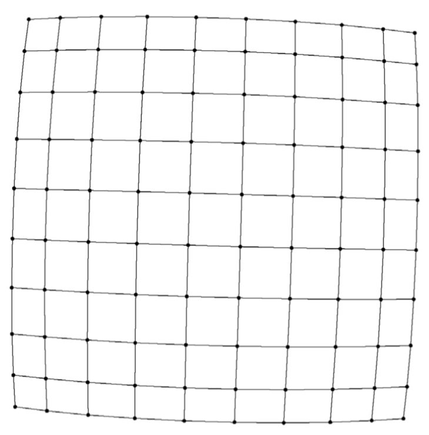

随着图的`直径`的变大，这种效应更加明显。特别极端的情况，比如100个节点的`直线图`，99条边的长度分布中，最中间的边长是最两边的变长的`2.72`倍。

原因是随着距离的增长，`长距离`作用力的衰减`变慢`了。这种边缘效应对不普通图影响不是很大，但是对`树形图`影响较大。

#### 解决边缘效应

解决方案是`修正`斥力模型：

 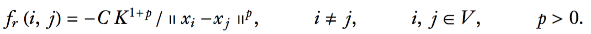

`p`越大，长距离作用力越弱，但也不能太大，太弱的长距离作用力会导致出现`皱褶图`。实验证明`p = 2`是比较理想的。

### spring model

`Kamada and Kawait`提出，`任意`两个节点间都存在弹簧弹力，正常弹簧长度与两个节点间的距离成正比。只有弹簧系统的情况下，引力和斥力的表达是一样的，因为要么有引力要么有斥力。

 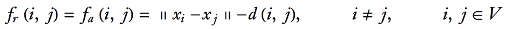

弹簧系统`总能量`：

 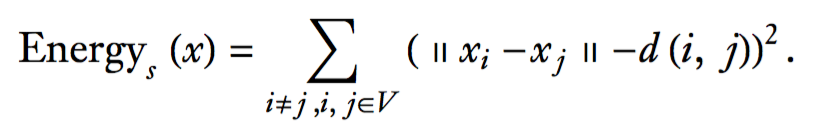

弹簧模型`不存在`边缘效应。但由于相对较弱的斥力，也会导致问题。

## 力导向算法

### 算法描述

`力导向`算法如下：

 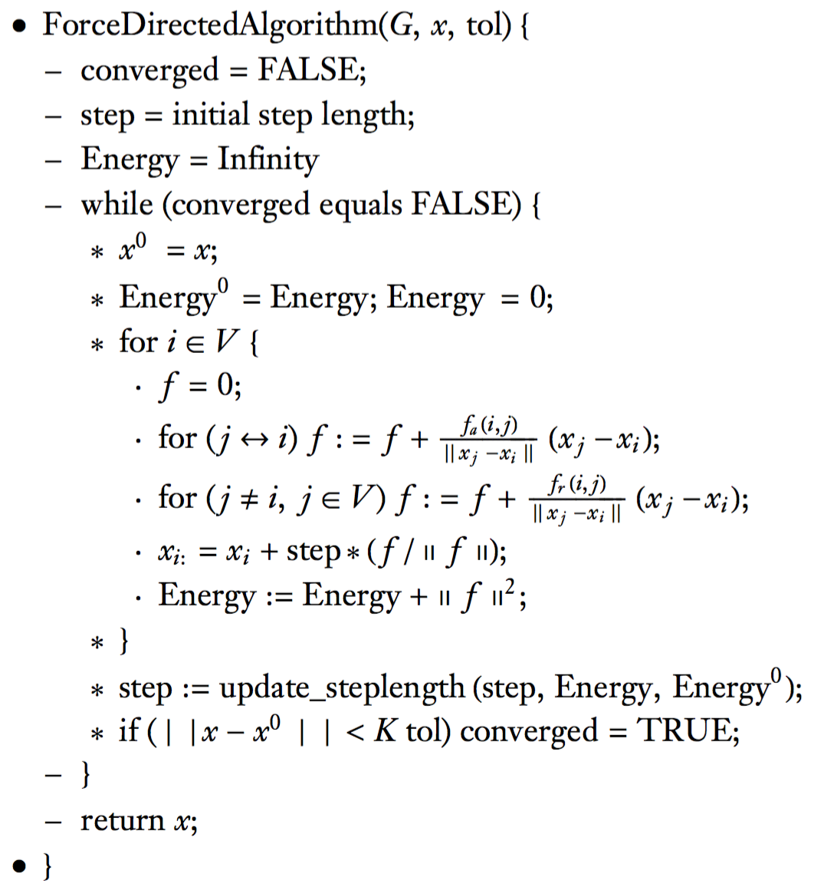

`tol > 0`为终止收敛阈值。`合力`计算使用了物理上的`n-body`算法。

算法复杂度：`O(|V|^2)`

### 简单降温策略

降温策略取决于`update_steplength()`。`Walshaw`使用了`简单`的降温策略：

    step = 0.9 * step;

这种`简单策略`对于进入提炼阶段来说是足够的，但是对于随机初始布局和人为指定布局来说，不一定能很好满足。

### 自适应降温

`自适应`表现在算法会根据当前系统的`能量`变化情况来调整step，可能`变大`也可能`变小`。`目的`是`加快`收敛速度。算法如下：

 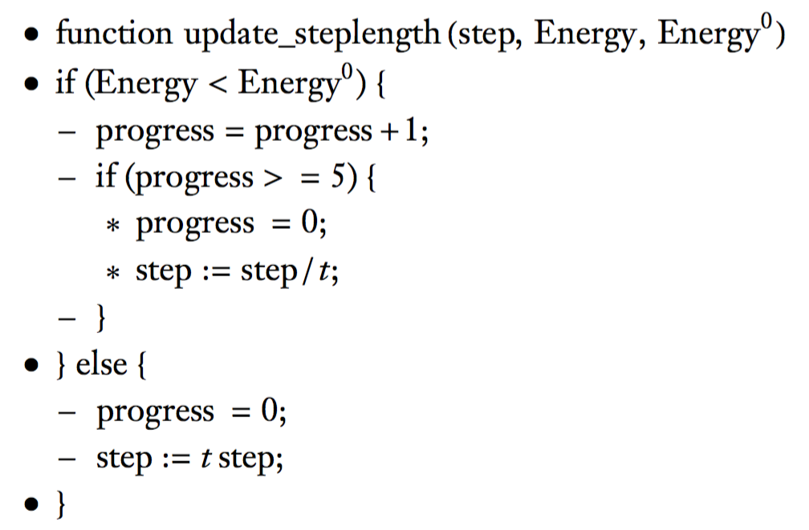

`progress`是一个静态变量，`t = 0.9`，`仅当`能量变大，才减小step；如果系统能量`累积`达到`5次`减少，则增大step。初始`step`可以设置为`step = K / 5`

 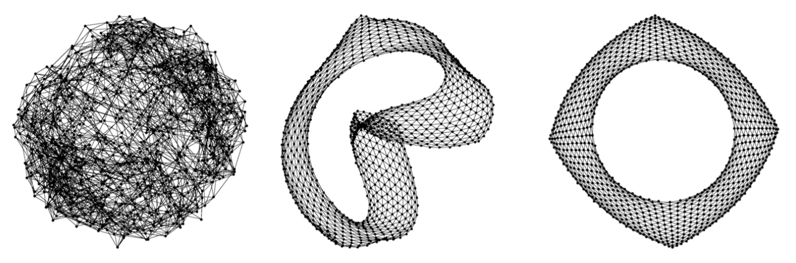

左图为`简单降温`策略70次循环的效果，中图为`自适应降温`策略70次循环的效果，右图为`最终`效果。

## Barnes Hut Force

### 概述

`思路`：使用适合的数据结构，将与当前节点`距离较远`的`节点组`作为一个`超级节点`来计算`斥力`。

`目的`：近似计算了`长距离`作用力，并且将斥力的计算从`O(|V|^2)`降到`O(n logn)`。

`数据结构`：使用`octree`或者`quadtree`数据结构。

### 具体算法

在计算`节点i`的`斥力`时，如果一个属于相同quadtree区块的`节点集`与节点i的`距离较远`，则将该节点集作为`超级节点`来计算斥力。

节点`i`与超级节点`S`的`斥力`公式如下：

 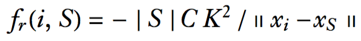

其中，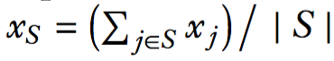，也即节点集的`中心点`。

### 如何定义距离较远？

 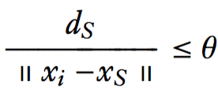

其中，验证比较理想的`𝞱 = 1.2`。

> 每次迭代，octree`只构建一次`。因为实际经验来看，即使内部循环会使节点的位置发生改变，也没什么影响。

### 自适应octree层数

需要对`octree`的层数增加限制，否则可能构建出极其不均衡的octree结构，某些分支深度非常大。需要花大量时间用于查找`超级节点`。

引入`max_tree_level`，即使层数为`max_tree_level`的节点仍然存在多个节点，也不再进行分解。以下为目标函数：

    h(max_tree_level) = counts + a * ns

其中`counts`为访问过的octree区块数，`ns`为一次迭代中找到的所有超级节点数，`a`为CPU参数。

通过定量实验，`a = 1.7`, 初始`max_tree_level = 8`，完成一次迭代后，将`max_tree_level`设置为9，后续根据估算的CPU时间的增大或减小，用更小或更大的深度值。如果调整过程中，再次到达一个使用过的深度值，则停止自适应过程，选用对应最小CPU估计值的那个深度值，不再改变。

实验显示，通过`3-4`次迭代后，`max_tree_level`就能非常接近最优值。对于`几千个`节点的图，`max_tree_level`的值一般为`8`，而对于`非常大`的图，`max_tree_level`的值能达到`11`。

    

## Multilevel算法

### 算法目的

`Barnes Hut octree`虽然较好的近似计算了`长距离`的作用力，并且降低了计算复杂度。但是仍然是每次只移动一个节点，而`不是整块区域`作为一个单元移动。大图通常会出现很多局部最小能量，这种算法很可能只达到局部最小能量。

前文引入的`自适应降温`策略虽然在某种程度上改善布局质量，但它仍然不足以达到`全局最小能量`。

`Multilevel`算法`目的`就是解决局部最小能量带来的问题，使最终布局达到`全局最小能量`。

一些新的词汇：

* `coarsen`: 使...变粗
* `coarse`: 粗的
* `coalesce`: 合并

### 算法描述

Multilevel算法包含`三个`阶段：

1. coarsening（`粗粒度化`）：产生一系列`越来越粗粒度`的图，G1, G2, ..., Gn。
2. coarsest graph layout：粗粒度化结束后得到`最粗粒度`图布局
3. prolongation and refinement：延伸和精炼

#### 粗粒度化(coarsening)

有多种粗粒度化的方法，`edge collapsing` ( EC )方法，称为`边坍塌`方法。以及`MIVS`方法。

使用`maximal matching`方法选择用于`坍塌`的`边集合`。(参考：<http://www.slideshare.net/akhayyat/maximum-matching-in-general-graphs>)

`YifanHu`算法实现了两种方法，`EC`和`MIVS`方法。

`EC`方法介绍：

1. 邻接节点`合并`成新的节点，新节点的权重为它代表的原始节点的个数
2. 粗粒度图的边也有权重，权重值为它所替换掉的原始边的条数。边的`初始`权重为`1`。
3. 用于坍塌的边集合使用`最大匹配`方式获得(参考上方)，集合中任意两条边都不指向同一节点。

坍塌过程中，如果`至少`满足以下两个条件之一，就`停止`坍塌过程。

1. 粗粒度图只包含`两个`节点
2. `|V(i+1)| / |V(i)| > p`, `p = 0.75`。也即粗粒度化带来的节点数的减少`不大于25%`。

`YifanHu`算法使用了`混合`（HYBRID）策略，在可能的情况下都使用`EC`，但是当以上阈值达到以后，使用`MIVS`。

#### 最粗粒度图布局(coarsest graph layout)

粗粒度化`停止`后，我们在`最粗粒度`图上应用`力导向布局`算法，辅以`自适应降温`策略。

对于`MIVS`和`HYBRID`两种坍塌策略来说，最粗粒度图只有两个节点，因此给这两个节点随机位置就足够了。 

#### refinement step 

 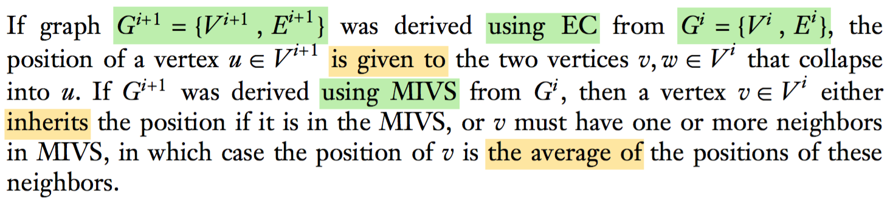

`i+1`级从`i`级`演化`而来，演化结果与采用的演化方法有关：

* `EC`法： i+1级节点`u`的坐标赋给i级节点`v`，`w`。其中v，w在坍塌过程中合并成u
* `MIVS`法：i级节点`v`，如果在MIVS中，则继承`MIVS`的坐标；如果有`1或多个`邻接点，则`v`的坐标为这些邻接点的`平均坐标`。

> 尚未完全理解？

坐标`转化`：

 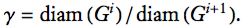

 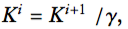  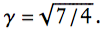

todo

#### 算法描述

`多层`布局算法如下：

 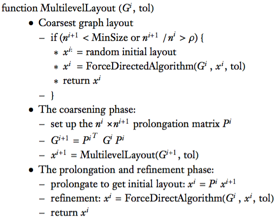

它是一个`递归`过程。

从`i`级到`i+1`级的`粗粒度化`(coarsening)，从`i+1`级到`i`级的`延伸`(prolongation)。其中矩阵`Pi`表示从`i+1`级到`i`级的`延伸`操作，它的维度为`N_i * N_i+1`。

## Gephi实现

### 算法默认参数

* stepRatio ( t ): `0.95`
* relativeStrength ( C ): `0.2 `
* optimalDistance ( K ): `Math.pow(getRelativeStrength(), 1.0 / 3) * getAverageEdgeLength(graph)`
* initialStep ( step ): 
* quadTreeMaxLevel ( max_tree_level ): `10`
* barnesHutTheta ( 𝞱 ): `1.2`
* convergenceThreshold ( tol ): `1e-4f`

### 代码实现

#### YifanHuLayout.java

`YifanHuLayout`: <https://github.com/gephi/gephi/blob/42c003ea958a3a6dcfc232c8addb612de32193cd/modules/LayoutPlugin/src/main/java/org/gephi/layout/plugin/force/yifanHu/YifanHuLayout.java>

`Gephi`版本的`YifanHu`算法并`没有`实现`Multilevel`。

    ...
    public void goAlgo() {
        graph = graphModel.getGraphVisible();
        graph.readLock();
        Node[] nodes = graph.getNodes().toArray();
        for (Node n : nodes) {
            if (n.getLayoutData() == null || !(n.getLayoutData() instanceof ForceVector)) {
                n.setLayoutData(new ForceVector());
            }
        }

        // Evaluates n^2 inter node forces using BarnesHut.
        QuadTree tree = QuadTree.buildTree(graph, getQuadTreeMaxLevel());

        BarnesHut barnes = new BarnesHut(getNodeForce());
        barnes.setTheta(getBarnesHutTheta());
        for (Node node : nodes) {
            ForceVector layoutData = node.getLayoutData();

            ForceVector f = barnes.calculateForce(node, tree);
            layoutData.add(f);
        }

        // Apply edge forces.
        for (Edge e : graph.getEdges()) {
            if (!e.getSource().equals(e.getTarget())) {
                Node n1 = e.getSource();
                Node n2 = e.getTarget();
                ForceVector f1 = n1.getLayoutData();
                ForceVector f2 = n2.getLayoutData();

                ForceVector f = getEdgeForce().calculateForce(n1, n2);
                f1.add(f);
                f2.subtract(f);
            }
        }

        // Calculate energy and max force.
        energy0 = energy;
        energy = 0;
        double maxForce = 1;
        for (Node n : nodes) {
            ForceVector force = n.getLayoutData();

            energy += force.getNorm();
            maxForce = Math.max(maxForce, force.getNorm());
        }

        // Apply displacements on nodes.
        for (Node n : nodes) {
            if (!n.isFixed()) {
                ForceVector force = n.getLayoutData();

                force.multiply((float) (1.0 / maxForce));
                getDisplacement().moveNode(n, force);
            }
        }
        postAlgo();
        graph.readUnlock();
    }

    ...

    /**
     * Fa = (n2 - n1) * ||n2 - n1|| / K
     *
     * @author Helder Suzuki <heldersuzuki@gephi.org>
     */
    public class SpringForce extends AbstractForce {

        private float optimalDistance;

        public SpringForce(float optimalDistance) {
            this.optimalDistance = optimalDistance;
        }

        @Override
        public ForceVector calculateForce(Node node1, Node node2,
                float distance) {
            ForceVector f = new ForceVector(node2.x() - node1.x(),
                    node2.y() - node1.y());
            f.multiply(distance / optimalDistance);
            return f;
        }

        public void setOptimalDistance(Float optimalDistance) {
            this.optimalDistance = optimalDistance;
        }

        public Float getOptimalDistance() {
            return optimalDistance;
        }
    }

    /**
     * Fr = -C*K*K*(n2-n1)/||n2-n1||
     *
     * @author Helder Suzuki <heldersuzuki@gephi.org>
     */
    public class ElectricalForce extends AbstractForce {

        private float relativeStrength;
        private float optimalDistance;

        public ElectricalForce(float relativeStrength, float optimalDistance) {
            this.relativeStrength = relativeStrength;
            this.optimalDistance = optimalDistance;
        }

        @Override
        public ForceVector calculateForce(Node node1, Node node2,
                float distance) {
            ForceVector f = new ForceVector(node2.x() - node1.x(),
                    node2.y() - node1.y());
            float scale = -relativeStrength * optimalDistance * optimalDistance / (distance * distance);
            if (Float.isNaN(scale) || Float.isInfinite(scale)) {
                scale = -1;
            }

            f.multiply(scale);
            return f;
        }
    }
    

#### BarnesHut.java

`BarnesHut`: <https://github.com/gephi/gephi/blob/42c003ea958a3a6dcfc232c8addb612de32193cd/modules/LayoutPlugin/src/main/java/org/gephi/layout/plugin/force/quadtree/BarnesHut.java>

    ...
    public class BarnesHut {

        /* theta is the parameter for Barnes-Hut opening criteria
         */
        private float theta = (float) 1.2;
        private AbstractForce force;

        public BarnesHut(AbstractForce force) {
            this.force = force;
        }

        /* Calculates the ForceVector on node against every other node represented
         * in the tree with respect to force.
         */
        public ForceVector calculateForce(Node node, QuadTree tree) {
            if (tree.mass() <= 0) {
                return null;
            }

            float distance = ForceVectorUtils.distance(node, tree);

            if (tree.isIsLeaf() || tree.mass() == 1) {
                // this is probably the case where tree has only the node.
                if (distance < 1e-8) {
                    return null;
                }
                return force.calculateForce(node, tree);
            }

            if (distance * theta > tree.size()) {
                ForceVector f = force.calculateForce(node, tree, distance);
                f.multiply(tree.mass());
                return f;
            }

            ForceVector f = new ForceVector();
            for (QuadTree child : tree.getChildren()) {
                f.add(calculateForce(node, child));
            }
            return f;
        }

        ...
    }

## js实现

### 前置布局

实际实现过程中，需要做一些判断，比如`前置布局`的判断，目的是解决布局算法的`适用性`等问题。

前置布局`主要`存在`两类`布局，使得力导向布局出现不理想的效果：

1. `直线布局`或者`类线性`布局（使用`isLinelikeLayout()`判断），这类前置布局使用
    力导向布局时，引力与斥力都在同一直线上，无法将节点打散，很难获得理想布局
2. 存在`完全重叠`的节点的布局（使用`hasWhollyOverlayedNodes()`判断），由于力导向布局
    对于重合节点无效，所以这类前置布局也是需要排除的布局

对于这类前置布局，需要提前判断，并在开始YifanHu布局前，先做一次`矩阵`布局。

### 单节点问题 

当参与布局的节点集合只有`一个`节点的时候，计算会出现`异常`问题，主要表现在以下代码中

    ...
    scale = Math.sqrt(e);
    energy += e;
    if(!node.fixed){
        // normalized vector
        node.dx /= scale; 
        node.dy /= scale;
    ...

此时`scale`是0，标准化时作为`分母`，导致后续计算出现异常。

所以，对于单节点图，直接`跳过`YifanHu布局。

### 零修正

`注`：力导向布局对坐标非常敏感，对于x或y属性为`null`或者`undefined`的情况，`不做0修正`。原因很简单，举个例子，如果所有节点的x和y属性都为null，那么即使做了0修正，仍然得不到理想布局。

所以，在进行YifanHu布局前，需要`保证`x, y属性是`合法`的值。

### getDistance

`getDistance()`：获取两个节点之间的平面距离。

    @[data-script="javascript"]function getDistance(node1, node2, options){
        var opt = options || {}
            , prefix = opt.readPrefix || ''
            , tip;

        if(!node1
            || !node2
            || isNaN(node1[prefix + 'x']) 
            || isNaN(node1[prefix + 'y'])
            || isNaN(node2[prefix + 'x'])
            || isNaN(node2[prefix + 'y'])
            ){
            tip = 'getDistance: nodes not exist or have no coordinates';
            if('function' == typeof opt.debugShow){
                opt.debugShow(tip, node1, node2);
            }
            else{
                throw new Error(tip);
            }
        }

        return Math.sqrt(
            Math.pow(node1[prefix + 'x'] - node2[prefix + 'x'], 2)
            + Math.pow(node1[prefix + 'y'] - node2[prefix + 'y'], 2)
        );
    }

    @[data-script="javascript editable"](function(){

        var s = fly.createShow('#test_100');
        var node1 = {x: 100, y: 0}
            , node2 = {x: 70, y: -40}
            ;

        s.show(1, getDistance(node1, node2));
        s.append_show(2, getDistance(node1, {}, {debugShow: s.append_show}));
    })();

### isLinelikeLayout

`isLinelikeLayout()`，判断布局是否类似`线型`布局。

    @[data-script="javascript"]function isLinelikeLayout(nodes, options){
        var nodes = nodes || []
            , opt = options || {}
            , rect = sigma.utils.getNodesRect(nodes, opt)
            , threshold = opt.threshold || 20
            , debugShow = opt.debugShow
            ;
        
        if(nodes.length <= 2){
            return 0;
        }
        
        if('function' == typeof debugShow){
            debugShow('rect w,h', rect.w, rect.h);
        }

        if(rect.w / rect.h > threshold
            || rect.h / rect.w > threshold){
            return 1;
        }
        return 0;
    }

    @[data-script="javascript editable"](function(){

        var s = fly.createShow('#test_105');
        var g1 = getLineGraph(20, 18, {nodeSize: 8});
        var g2 = getRandomGraph(100, 0, 5);

        s.show('testing isLinelikeLayout');
        s.append_show(1, isLinelikeLayout(g1.nodes, {debugShow: s.append_show}));
        s.append_show(2, isLinelikeLayout(g2.nodes, {debugShow: s.append_show}));
    })();

### hasWhollyOverlayedNodes

`hasWhollyOverlayedNodes()`，判断是否存在`完全重叠`的节点。

    @[data-script="javascript"]function hasWhollyOverlayedNodes(nodes, options) {
        var opt = options || {}
            , nodes = nodes || []
            , prefix = opt.readPrefix || ''
            , len = nodes.length
            , i, j, n1, n2
            ;

        for(i=0; i<len; i++){
            n1 = nodes[i];
            for(j=i+1; j<len; j++){
                n2 = nodes[j]; 
                if(n1[prefix + 'x'] == n2[prefix + 'x']
                    && n1[prefix + 'y'] == n2[prefix + 'y']){
                    return true;
                }
            }
        } 
        return false;
    }

    @[data-script="javascript editable"](function(){

        var s = fly.createShow('#test_107');
        var g1 = getLineGraph(20, 18, {nodeSize: 8});
        var g2 = getRandomGraph(100, 0, 5);
        var g3 = createRawGraphData(20, 18);

        s.show('testing hasWhollyOverlayedNodes');
        s.append_show(1, hasWhollyOverlayedNodes(g1.nodes, {debugShow: s.append_show}));
        s.append_show(2, hasWhollyOverlayedNodes(g2.nodes, {debugShow: s.append_show}));
        s.append_show(3, hasWhollyOverlayedNodes(g3.nodes, {debugShow: s.append_show}));
    })();

### hasInvalidValues

`hasInvalidValues()`，判断是否存在`不合法`属性值。

    @[data-script="javascript"]function hasInvalidValues(nodes, options) {
        var opt = options || {}
            , nodes = nodes || []
            , prefix = opt.readPrefix || ''
            , len = nodes.length
            , i, n1
            ;

        for(i=0; i<len; i++){
            n1 = nodes[i];
            if(n1[prefix + 'x'] !== +n1[prefix + 'x']
                || n1[prefix + 'y'] !== +n1[prefix + 'y']){
                return true;
            }
        } 
        return false;
    }

    @[data-script="javascript editable"](function(){

        var s = fly.createShow('#test_108');
        var g1 = createRawGraphData(20, 18);
        var g2 = getRandomGraph(100, 0, 5);

        s.show('testing hasWhollyOverlayedNodes');
        s.append_show(1, hasInvalidValues(g1.nodes, {debugShow: s.append_show}));
        s.append_show(2, hasInvalidValues(g2.nodes, {debugShow: s.append_show}));
    })();

### computeElectricalForce

`computeElectricalForce()`，计算两个节点的`库仑`斥力。

    @[data-script="javascript"]function computeElectricalForce(
        node1, node2, distance, options){

        var opt = options || {}
            , relativeStrength = opt.relativeStrength
            , optimalDistance = opt.optimalDistance 
            , prefix = opt.readPrefix || ''
            , force = {
                dx: node2[prefix + 'x'] - node1[prefix + 'x']
                , dy: node2[prefix + 'y'] - node1[prefix + 'y']
            }
            , scale
            , zeroForce = {dx:0, dy:0}
            , tip
            ;

        if(optimalDistance !== +optimalDistance
            || relativeStrength !== +relativeStrength){
            tip = 'computeElectricalForce: optimalDistance or relativeStrength error';
            if('function' == typeof opt.debugShow){
                opt.debugShow(tip);
            }
            else{
                throw new Error(tip);
            }
            return zeroForce; 
        }
         
        scale = -relativeStrength * optimalDistance * optimalDistance
            / distance / distance;

        if(isNaN(scale) || Infinity == scale){
            tip = 'computeElectricalForce: NaN or Infinity scale';
            if('function' == typeof opt.debugShow){
                opt.debugShow(tip, 'scale: ' + scale);
            }
            else{
                console.log(tip, 'scale: ' + scale);
            }
            scale = -1;
        }

        force.dx *= scale;
        force.dy *= scale;

        return force;
    }

    @[data-script="javascript editable"](function(){

        var s = fly.createShow('#test_110');
        var node1 = {x: 100, y: 0}
            , node2 = {x: 70, y: -40}
            , distance = getDistance(node1, node2)
            ;

        s.show('start testing\n');
        s.append_show(1, computeElectricalForce(node1, node2, distance, {debugShow: s.append_show}));
        s.append_show(2, computeElectricalForce(node1, node2, distance
            , {
                debugShow: s.append_show
                , optimalDistance: 100
                , relativeStrength: 0.2
            }
        ));

    })();

### computeRepulsionForce

`computeRepulsionForce(node, tree, options)`：计算节点间`斥力`，使用`Barnes-Hut`算法。

    @[data-script="javascript"]function computeRepulsionForce(
        node, quadTree, options) {

        var opt = options
            , zeroForce = {dx:0, dy:0, num:0}
            , distance
            , tree = quadTree
            , force
            , tip
            ;

        if(tree.mass <= 0){
            return zeroForce;
        }

        distance = getDistance(node, tree, opt);

        if(!opt || isNaN(opt.barnesHutTheta)){
            tip = 'computeRepulsionForce: options error!';
            if('function' == typeof opt.debugShow){
                opt.debugShow(tip, opt);
            }
            else {
                throw new Error(tip);
            }
        }

        if(tree.isLeaf || tree.mass == 1){
            if(distance < 1e-8){
                force = zeroForce;
            }
            else {
                force = computeElectricalForce(node, tree, distance, opt);  
            }
            force.num = 1;
        }
        else if(distance * opt.barnesHutTheta > tree.size){
            force = computeElectricalForce(node, tree, distance, opt); 
            force.dx *= tree.mass;
            force.dy *= tree.mass;
            force.num = 1;
        }
        else {
            force = zeroForce;
            force.num = 0;
            tree.children.forEach(function(child){
                var f = computeRepulsionForce(node, child, options);
                force.dx += f.dx;
                force.dy += f.dy;
                force.num += f.num;
            });
        }

        return force;
    }

使用`Barnes-Hut`算法，`10000`个节点中，单个节点的斥力计算只需进行`40`次左右，大大节省计算时间。

    @[data-script="javascript editable"](function(){

        var s = fly.createShow('#test_120');
        var graph = getRandomGraph(10000, 0, 5);
        var node = graph.nodes[0]; 

        graph.nodes.forEach(function(node){
            node.x *= 100;
            node.y *= 100;
        });

        var tree = buildBHQuadTree(graph, 8);

        s.show('start testing\n');
        s.append_show(1, computeRepulsionForce(
            node
            , tree
            , {
                debugShow: s.append_show
                , optimalDistance: 20
                , relativeStrength: 0.2
                , barnesHutTheta: 1.2
            }
        ));

    })();

### computeAttractionForce

`computeAttractionForce(node1, node2, options)`：计算`边连接`的两个节点间的`引力`。

    @[data-script="javascript"]function computeAttractionForce(
        node1, node2, options){

        var opt = options || {}
            , optimalDistance = opt.optimalDistance
            , prefix = opt.readPrefix || ''
            , force = {
                dx: node2[prefix + 'x'] - node1[prefix + 'x']
                , dy: node2[prefix + 'y'] - node1[prefix + 'y']
            }
            , distance = getDistance(node1, node2, opt)
            ;

        if(opt.optimalDistance == undefined){
            throw new Error('computeAttractionForce: optimalDistance not specified!');
        }

        force.dx *= distance / optimalDistance; 
        force.dy *= distance / optimalDistance;
        return force;
    }

    

    @[data-script="javascript editable"](function(){

        var s = fly.createShow('#test_130');
        var node1 = {x: 100, y: 0}
            , node2 = {x: 70, y: -40}
            ;

        s.show('start testing\n');
        s.append_show(1, computeAttractionForce(
            node1
            , node2
            , {
                debugShow: s.append_show
                , optimalDistance: 20
            }
        ));

    })();

### layoutYifanHu

#### 扩展prototype

扩展`sigma.prototype`，使其支持对当前graph进行`YifanHu`布局。

    @[data-script="javascript"]sigma.prototype.layoutYifanHu
        = function(options){
        var me = this;
        me.initializeLayout();

        var opt = options || {}
            , subGraph = me.graph.getSubGraph(opt)
            , nodes = subGraph.nodes
            , edges = subGraph.edges
            , newOpt = Object.assign({}, opt, {readPrefix: ''})
            ;

        if(isLinelikeLayout(nodes, {
                threshold: 10
            })
            || hasWhollyOverlayedNodes(nodes)
            || hasInvalidValues(nodes)
            ){
            // note: `opt.readPrefix` must be ''
            me.layoutGrid(newOpt)
                .applyLayoutInstantly({
                    readPrefix: 'grid_'
                    , clearOld: 1
                });
        }

        sigma.utils.layoutYifanHu(nodes, edges, opt);
        return me;
    };

#### utils实现

    @[data-script="javascript"]sigma.utils.layoutYifanHu
        = function(nodes, edges, options){
        
        var opt = options || {}
            , nodes = nodes || [] 
            , edges = edges || [] 
            , prefix
            
            , quadTree
            , energyPrev = 0
            , energy = 0
            , step
            , isConverged = 0
            , progress = 0
            , iterations
            , energyChangeRatio

            , forest
            , layoutBalanced = opt.layoutBalanced || 0
            , spaceGrid = opt.spaceGrid || {
                xSize: 50
                , ySize: 50
            }
            ;

        // options
        opt.stepRatio = opt.stepRatio || 0.95;
        opt.relativeStrength = opt.relativeStrength || 0.2;
        opt.optimalDistance = opt.optimalDistance 
            || getOptimalDistance();
        opt.layoutBalancedSpace = opt.layoutBalancedSpace
            || opt.optimalDistance;
        opt.initialStep = opt.initialStep 
            || opt.optimalDistance / 5; 
        opt.quadTreeMaxLevel = opt.quadTreeMaxLevel || 8;
        opt.barnesHutTheta = opt.barnesHutTheta || 1.2;
        opt.convergenceThreshold = opt.convergenceThreshold || 1e-4;
        opt.maxIterations = opt.maxIterations || 2;

        prefix = opt.readPrefix || opt.writePrefix || '';
        step = opt.initialStep;
        iterations = opt.maxIterations; 

        debugShow('options', opt, '\n');

        // prepare prefix access
        nodes.forEach(function(node){
            node[prefix + 'x'] = node.x;
            node[prefix + 'y'] = node.y;
        });

        if(nodes.length <= 1){
            return {
                isConverged: 1
                , iterations: 0
            };
        }

        do {

            quadTree = buildBHQuadTree({nodes: nodes}
                , opt.quadTreeMaxLevel
                , {readPrefix: prefix}
            );

            nodes.forEach(function(node){
                node.dx = node.dy = 0;
            });

            nodes.forEach(function(node){
                var f = computeRepulsionForce(node, quadTree, opt);
                node.dx += f.dx;
                node.dy += f.dy;
            });

            // debugShow(1, nodes.map(function(node){
            //     return node.dx + ',' + node.dy
            // }), '\n');

            edges.forEach(function(edge){
                var n1 = sigma.utils.getNodeById(nodes, edge.source)
                    , n2 = sigma.utils.getNodeById(nodes, edge.target)
                    , f
                    ;

                if(n1.id != n2.id){
                    f = computeAttractionForce(n1, n2, opt);
                    // debugShow('1.x', force);
                    n1.dx += f.dx;
                    n1.dy += f.dy;
                    n2.dx -= f.dx;
                    n2.dy -= f.dy;
                }
            });

            // debugShow(2, nodes.map(function(node){
            //     return node.dx + ',' + node.dy
            // }), '\n');

            // compute energy and move nodes according to force
            energyPrev = energy;
            energy = 0;
            nodes.forEach(function(node){
                var e, scale;

                e = node.dx * node.dx + node.dy * node.dy;
                scale = Math.sqrt(e);

                energy += e;

                if(!node.fixed){
                    // normalized vector
                    node.dx /= scale; 
                    node.dy /= scale;

                    node[prefix + 'x'] += step * node.dx;
                    node[prefix + 'y'] += step * node.dy;
                }

                delete node.dx;
                delete node.dy;
            });

            // debugShow(3, nodes.map(function(node){
            //     return '[' + node.x 
            //         + ',' + node.y
            //         + '] => [' + node[prefix + 'x'] 
            //         + ',' + node[prefix + 'y'] 
            //         + ']'
            //         ;
            // }), '\n');

            // update step -- adaptive cooling
            updateStep();

            // check if converged
            energyChangeRatio = Math.abs(energy - energyPrev) / energy; 
            debugShow('energyChangeRatio', energyChangeRatio, energy, energyPrev);
            if(energyChangeRatio < opt.convergenceThreshold){
                isConverged = 1;
                debugShow('\n' + 4, 'converged!');
            }

        } while (!isConverged && --iterations);

        if(layoutBalanced){
            forest = sigma.utils.getLayoutForest(
                nodes
                , edges
            );
            sigma.utils.layoutTreesByGrid(
                forest
                , {
                    optimalDistance: opt.layoutBalancedSpace
                    , readPrefix: 'yfh_'
                    , spaceGrid: spaceGrid 
                }
            );
        }

        return {
            isConverged: isConverged
            , iterations: opt.maxIterations - iterations
        };

        // optimalDistance = C^(1/3) * averageEdgeLength
        function getOptimalDistance(){
            var edgeLength = 0
                , len = edges.length
                , avgLength
                ;

            edges.forEach(function(edge){
                edgeLength += getDistance(
                    sigma.utils.getNodeById(nodes, edge.source)
                    , sigma.utils.getNodeById(nodes, edge.target)
                    , {
                        readPrefix: prefix
                    }
                );
            });
            avgLength = edgeLength / len;
            return Math.pow(opt.relativeStrength, 1/3) * avgLength;
        }

        function updateStep(){
            if( energy < energyPrev){
                progress++;
                if(progress >= 5){
                    progress = 0;
                    step /= opt.stepRatio;
                }
            }
            else{
                progress = 0;
                step *= opt.stepRatio;
            }
            debugShow('step', step);
        }

        function debugShow(){
            if('function' == typeof opt.debugShow){
                opt.debugShow.apply(window, arguments);
            }
        }
    
    };

    @[data-script="javascript editable"](function(){

        var s = fly.createShow('#test_150');
        var graph = getRandomGraph(10, 10, 5)
            , status
            , prefix = 'yfh_'
            ;

        s.show('start testing\n');
        status = sigma.utils.layoutYifanHu(
            graph.nodes
            , graph.edges
            , {
                optimalDistance: 20
                , debugShow: s.append_show
                , maxIterations: 5
                , readPrefix: prefix 
            }
        );

        s.append_show('finished'
            , graph.nodes.map(function(node){
                return '[' + node.x 
                    + ',' + node.y
                    + '] => [' + node[prefix + 'x'] 
                    + ',' + node[prefix + 'y'] 
                    + ']'
                    ;
            })
        );
        s.append_show('status', status);

    })();

## 算法验证

以下示例展示`YifanHu`布局算法：

    @[data-script="javascript editable"]
    (function(){

        var s = fly.createShow('#test_200');
        var maxIterations = 50;
        var partialLayout = 0;
        var fixedNodes = 0;
        var layoutBalanced = 1;
        var g1 = getRandomGraph(50, 60, 8);
        var g1 = networkGraph_circle_0628;
        var g1 = networkGraph_mesh_0628;
        // var g1 = createRawGraphData(30, 50);
        // var g1 = getClusterGraph(100, {xMax: 200, yMax: 200, nodeSize: 8});
        // var g1 = getLineGraph(20, 18, {nodeSize: 8});
        // var g1 = networkGraph_FR;
        // var g1 = networkGraph_ForceAtlas2;
        // var g1 = networkGraph_grid_0521; 
        // var g1 = networkGraph_tree_0521;
        // var g1 = networkGraph_2circles_0523;
        // var g1 = networkGraph_edges_between_the_same_level_nodes;
        // var g1 = networkGraph_edges_between_the_same_level_nodes_2;
        // var g1 = networkGraph_tree_0524;
        // var g1 = networkGraph_many_children_0526;
        // var g1 = networkGraph_edges_between_the_same_level_nodes_3;
        // var g1 = networkGraph_person_event_event_person_0729;;
        // var g1 = networkGraph_person_event_event_person_0801;;
        // var g1 = networkGraph_triangle_0801;;
        // var g1 = networkGraph_triangle_0801_2;;

        fixedNodes && g1.nodes.forEach(function(node){
            if(Math.random() < 0.1){
                node.fixed = 1;
                node.color = '#000';
            }
        });

        partialLayout && g1.nodes.forEach(function(node){
            if(Math.random() < 0.5){
                node.color = node.oldColor || node.color;
                delete node.oldColor;
                delete node.selected;
                if(Math.random() > 0.5){
                    node.selected = 1;
                    node.oldColor = node.color;
                    node.color = '#1f77b4';
                }
            }
        });

        var g2 = {
                nodes: g1.nodes.slice()
                , edges: g1.edges.slice()
            }
            , g3 = {
                nodes: g1.nodes.slice()
                , edges: [] 
            }
            ;
        var containerId = 'test_200_graph';
        var rendererSettings = {
                // captors settings
                doubleClickEnabled: true
                , mouseWheelEnabled: false

                // rescale settings
                , minEdgeSize: 0.5
                , maxEdgeSize: 1
                , minNodeSize: 1 
                , maxNodeSize: 5

                // renderer settings
                , edgeHoverColor: fly.randomColor() 
                , edgeHoverSizeRatio: 1
                , edgeHoverExtremities: true
            };
        var sigmaSettings = {
                // rescale settings 
                sideMargin: 0.1 

                // instance global settings
                , enableEdgeHovering: true
                , edgeHoverPrecision: 5
                , autoRescale: 0
            };

        var sm1, sm2;

        if((sm1 = isSigmaInstanceExisted('test_200_left'))
            && (sm2 = isSigmaInstanceExisted('test_200_right'))){
            sm1.kill();
            sm2.kill();
        };

        sm1 = getUniqueSigmaInstance(
                    'test_200_left'
                    , {
                        settings: sigmaSettings 
                        , graph: g1
                        , renderers: [
                            {
                                type: 'canvas' 
                                , container: $('#' + containerId + ' .test-graph-left')[0]
                                , settings: rendererSettings
                            }
                        ]
                    }
                ); 

        sm2 = getUniqueSigmaInstance(
                    'test_200_right'
                    , {
                        settings: sigmaSettings 
                        , graph: g2
                        , renderers: [
                            {
                                type: 'canvas' 
                                , container: $('#' + containerId + ' .test-graph-right')[0]
                                , settings: rendererSettings
                            }
                        ]
                    }
                ); 

        sm1
            .normalizeSophonNodes()
            .alignCenter({rescaleToViewport: 1})
            .refresh()
            ;

        sm2
            .normalizeSophonNodes()
            .alignCenter({rescaleToViewport:1})
            .refresh() // note: must invoke `refresh()` to update coordinates

            .layoutYifanHu({
                optimalDistance: 100
                , readPrefix: 'yfh_'
                , maxIterations: maxIterations 
                , relativeStrength: 0.2
                , layoutBalanced: layoutBalanced
                , filter: partialLayout
                    ? function(node){return node.selected;}
                    : null
            })
            .normalizeSophonNodes({
                readPrefix: 'yfh_'
                , filter: partialLayout
                    ? function(node){return node.selected;}
                    : null
            })
            ;

        if(!partialLayout){
            sm2
            .alignCenter({
                wholeView: 1
                , readPrefix: 'yfh_'
                , writePrefix: 'yfh_'
            })
            ;
        }

        sm2
            .prepareAnimation({
                readPrefix: 'yfh_'
            });

        setTimeout(function(){
            sigma.plugins.animate(
                sm2
                , {
                    x: 'yfh_x'
                    , y: 'yfh_y'
                }
                , {
                    duration: 1000
                }
            );

        }, 500);

    })();

## 其他

`YifanHu`就职于wolfram公司：<http://www.wolfram.com>，<http://www.wolframalpha.com>

