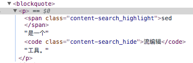

# bom-full-text-search

## 需求描述

todo

## 180408

根结点进行统一innerHTML替换，再对子孙节点进行判断，若不包含指定模式，则隐藏该子孙节点
    * 统一innerHTML替换时，确保不对属性进行替换，比如a标签的href属性包含特定模式，也不能替换
    * script, style, iframe, input, textarea等不作替换

浏览器提供的文本查找模式都是采用不对DOM进行修改的操作

希望使用对DOM进行简单修改，更好的高亮展示查找内容

指定类型的标签才进行模式查找

使用class来设置DOM样式，使用span标签来圈定关键词
    content-search_highlight
    content-search_hide

纯DOM节点操作，针对text节点进行内容匹配，圈定匹配的关键词

    前序深度遍历DOM树，当前遍历节点为node
        若node的类型为文本节点
            若node的文本内容t包含指定模式p
                记t=t1,p,t2,p,t3,...,tn
                记parent为node的父节点
                newNodes=[
                    createTextNode( t1 )
                    , p
                    , createTextNode( t2 )
                    , p
                    , createTextNode( t3 )
                    , ...
                ]
                针对newNodes的每个节点n
                    document.insertBefore( n, node ) 
                parent.removeChild( node )

* #text节点总是叶子节点

## 180409

* DOM树遍历，通过class selector对不包含关键词的节点进行隐藏操作
* 为保持文档的可读性，支持针对某些特定标签不作隐藏操作
* 过滤状态下，支持操作文本段，将其上下文节点显示出来
* 使用`innerHTML`进行字符串过滤不是一个好方法
* 正则表达式`modifier`使用心得：

        var r = /abc/i;
        r.test( str )
        r.exec( str ) !== null

        var r = /abc/ig;
        r.test( str )
        r.exec( str ) !== null

* 无匹配提示
* 自动跳至第一个匹配处
* 支持`n`和`N`上下切换关键词
* 形成开源小项目

* `restore()`，恢复搜索前状态，以下为算法实现：

    恢复到原始状态，需要执行以下`两个步骤`：

    * 将`content-search_highlight`的span标签替换成#text节点，并与前后的#text节点合并成一个#text节点
            
            前序深度遍历DOM树，当前遍历节点为node
                若node的标签为span，且包含content-search_highlight类
                    记node的唯一#text类型子节点t1
                    记node前的#text类型子节点t2
                    记node后的#text类型子节点t3
                    t2.nodeValue += t1.nodeValue + t3.nodeValue
                    移除node( 包含t1 )以及t3
        
    * 将`content-search_hide`类全部清空

            $( '.content-search_hide' )
                .removeClass( 'content-search_hide' );

* bug 1:

    

    

    以上问题，在隐藏阶段，会把同关键词同级别的包含在其他标签内的文本隐藏掉，会影响段落可读性。

    `解决方案`：highlight以后进行节点隐藏时，如果某个节点的所有子节点都为#text类型节点，且该节点为`inline`或`inline-block`，则即使其不包含搜索关键词，也不隐藏该节点。

