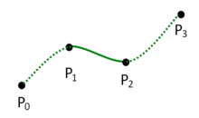

# catmull-rom

> 获得经过控制点的平滑曲线

## Overview

 

四个控制点P0, P1, P2, P3，获得`连接P1, P2`的`光滑曲线`。常见应用于`曲线差值`。

## Resources
* wikipedia: <https://en.wikipedia.org/wiki/Centripetal_Catmull–Rom_spline>
* Catmull_Rom算法的实现：<http://blog.csdn.net/swety_gxy/article/details/53236311>
* 手指划痕的实现和catmull rom算法： <http://blog.csdn.net/korekara88730/article/details/8544686>

