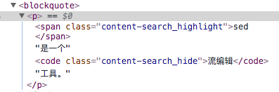

# dom-text-search

## 需求描述

> todo changelog: 180409, 180410, 180413

* 具体需求和交互设计：todo
    * 全文文本搜索

            awk

    * 全文文本正则搜索

            \$ awk.*
            for\([^)]+\) 
            sed .+

    * 选择器搜索

            h2
            img
            .info
            .text

* 与浏览器自带的搜索功能的比较: todo
        简化内容，且尽可能保留上下文可读性
        word搜索与字符串搜索

## 测试用例

> changlog: 180411

    按/，发起文本搜索
    按Ctrl+/，发起选择器搜索
        占位符为%:
    按Shift+/，发起基于正则表达式的文本搜索
        占位符为%/
    搜索状态下按shift-click，可以显示兄弟节点
    按ESC，退出搜索状态，页面恢复搜索前状态
    二次搜索效果
        在上一次搜索的基础上展示搜索结果
        隐藏节点中的搜索结果不展示
    无结果效果
    vim-like操作是否正常
        j k n N gg G ctrl-d ctrl-u
    包含svg元素的页面

## 180408

根结点进行统一innerHTML替换，再对子孙节点进行判断，若不包含指定模式，则隐藏该子孙节点
    * 统一innerHTML替换时，确保不对属性进行替换，比如a标签的href属性包含特定模式，也不能替换
    * script, style, iframe, input, textarea等不作替换

浏览器提供的文本查找模式都是采用不对DOM进行修改的操作

希望使用对DOM进行简单修改，更好的高亮展示查找内容

指定类型的标签才进行模式查找

使用class来设置DOM样式，使用span标签来圈定关键词
    content-search_highlight
    content-search_hide

纯DOM节点操作，针对text节点进行内容匹配，圈定匹配的关键词

    前序深度遍历DOM树，当前遍历节点为node
        若node的类型为文本节点
            若node的文本内容t包含指定模式p
                记t=t1,p,t2,p,t3,...,tn
                记parent为node的父节点
                newNodes=[
                    createTextNode( t1 )
                    , p
                    , createTextNode( t2 )
                    , p
                    , createTextNode( t3 )
                    , ...
                ]
                针对newNodes的每个节点n
                    document.insertBefore( n, node ) 
                parent.removeChild( node )

* #text节点总是叶子节点

## 180409

> changelog: 180427, 180409, 180410, 180411

* √ DOM树遍历，通过class selector对不包含关键词的节点进行隐藏操作
* √ 为保持文档的可读性，支持针对某些特定标签不作隐藏操作
* 使用`innerHTML`进行字符串过滤不是一个好方法
* 正则表达式`modifier`使用心得：

        var r = /abc/i;
        r.test( str )
        r.exec( str ) !== null

        var r = /abc/ig;
        r.test( str )
        r.exec( str ) !== null

* √ 无匹配提示
* √ 自动跳至第一个匹配处
* √ 支持`n`和`N`上下切换高亮关键词，步长为1
* 支持`步长为10%`的高亮关键词切换
* 到达最后一个匹配处给予提示 - 到底提示或到顶提示
* √ 简单的vim导航操作，支持行( j, k )、页滚动( ctrl-u, ctrl-d )
* √ 显示当前所处的结果位置和结果数目
* √ 过滤状态下，支持操作（比如双击，`Alt+Click`）节点，将其上下文节点显示出来
* √ 支持`gg`, `Shift+G`进行首尾跳转
* √ 支持`按selector过滤`的搜索语法，特殊前缀语法（ `%:` ），可配置
* √ 支持`快捷调起`选择器搜索，比如`Ctrl+/`
* √ 支持正则表达式搜索，比如`Shift+/`或`//`
* 支持历史搜索记录，类似命令行，通过向上/向下箭头可切换历史记录
* √ 形成开源小项目
* 支持API输出
* 支持suggestion，来源于历史和当前页面的即时匹配结果
* 支持将高亮结果统一输出，用textarea展示或者可下载

* `restore()`，恢复搜索前状态，以下为算法实现：

    恢复到原始状态，需要执行以下`两个步骤`：

    * 将`content-search_highlight`的span标签替换成#text节点，并与前后的#text节点合并成一个#text节点
            
            前序深度遍历DOM树，当前遍历节点为node
                若node的标签为span，且包含content-search_highlight类
                    记node的唯一#text类型子节点t1
                    记node前的#text类型子节点t2
                    记node后的#text类型子节点t3
                    t2.nodeValue += t1.nodeValue + t3.nodeValue
                    移除node( 包含t1 )以及t3
        
    * 将`content-search_hide`类全部清空

            $( '.content-search_hide' )
                .removeClass( 'content-search_hide' );

* bug 1:

    

    

    以上问题，在隐藏阶段，会把同关键词同级别的包含在其他标签内的文本隐藏掉，会影响段落可读性。

    `解决方案`：highlight以后进行节点隐藏时，如果某个节点的所有子节点都为#text类型节点，且该节点为`inline`或`inline-block`，则即使其不包含搜索关键词，也不隐藏该节点。

* 一些可能的options:

    iframe是否参与隐藏
    是否支持结果中搜索( search in results )
    是否压缩展现结果，比如把`<h1>-<h7>`标签也隐藏
    特殊搜索语法，前缀可配置

* 判断元素是否可见的方法（元素`可见性`判断）：

        // 通过自身的display属性来判断可见性，但如果祖先点隐藏，该返回值就无法准确判断
        $( '#test' ).css( 'display' )

        // 即使祖先节点隐藏，仍能准确判断
        $( '#test' ).is( ':visible' )
        $( '#test' ).is( ':hidden' )

* `选择器搜索`算法，相比比文本搜索算法更简单一些，主要在于highlight阶段比较简单

        // highlight阶段
        获取包含selector的所有元素集合N
        针对N的每一个元素，添加`content_search__hilight`

        // hide阶段，与文本搜索的hide算法类似，但稍有不同
        前序深度遍历DOM树，当前遍历节点为node
            如果node匹配了忽略选择器，则跳过该节点（包括子孙节点）
            如果node是#text节点，也跳过该节点
            如果node本身及子孙都不包含hilight class
                隐藏并跳过node节点
            如果node本身包含hilight class
                跳过node节点
        

    * 选择器搜索算法，支持通用的css selector语法
    * 使用`%:`作为选择器输入的`前缀`
    * 选择器为源码输入，除了简单的`trim`外，不作其他转换

* bug: `空文本`不发起搜索
* 注意：
    * `span.content-search_highlight`专门用于文本高亮，在restore的时候会进行#text节点合并，不要用于其他地方，比如选择器搜索时，`%:span`，对特定元素高亮时，不要使用`content-search_highlight`类名
    * 选择器搜索，元素高亮使用`content-search_element-highlight`样式类

## Resources

### Related Repos

* `hilitor` <https://github.com/GerHobbelt/hilitor> <iframe src="http://258i.com/gbtn.html?user=GerHobbelt&repo=hilitor&type=star&count=true" frameborder="0" scrolling="0" width="105px" height="20px"></iframe>
* JavaScript: Search Keyword Highlighting <https://www.the-art-of-web.com/javascript/search-highlight/>
* jqueryhighlight <https://github.com/FWeinb/jqueryhighlight> <iframe src="http://258i.com/gbtn.html?user=FWeinb&repo=jqueryhighlight&type=star&count=true" frameborder="0" scrolling="0" width="105px" height="20px"></iframe>
* jquery.textSearch <https://github.com/qur2/jquery.textSearch> <iframe src="http://258i.com/gbtn.html?user=qur2&repo=jquery.textSearch&type=star&count=true" frameborder="0" scrolling="0" width="105px" height="20px"></iframe>
* text-node-searcher <https://github.com/clehner/text-node-searcher> <iframe src="http://258i.com/gbtn.html?user=clehner&repo=text-node-searcher&type=star&count=true" frameborder="0" scrolling="0" width="105px" height="20px"></iframe>

### Features

* 相关的在DOM中搜索和高亮文本的开源项目也不少，基本上是国外的人在搞
* 大多是提供API并且和jQuery结合，作为`jQuery plugin`存在
* Star数都还不高，最高为15 ( 截至180411 )
* 形成`解决方案`的还没有

