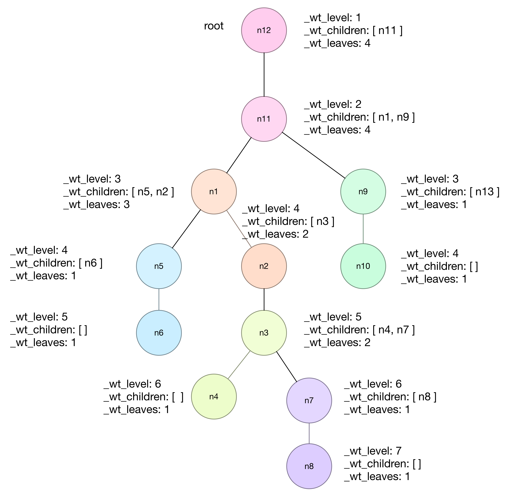

# graph layout

> 网络拓扑图布局算法研究

## 综述

### 参考资料

`Github`：
1. <https://github.com/jacomyal/sigma.js>
2. <https://github.com/anvaka/VivaGraphJS>
3. <https://github.com/anvaka/ngraph.forcelayout>
4. <https://github.com/dhotson/springy>

`其他`：
1. ForceAtlas2, a Continuous Graph Layout Algorithm for Handy Network Visualization Designed for the Gephi Software; <http://journals.plos.org/plosone/article?id=10.1371/journal.pone.0098679>
2. 一种改进的可视化布局算法IGVA; 徐红云,陈志锋
3. VERVIEW OF ALGORITHMS FOR GRAPH DRAWING; Pajntar B.; <http://ailab.ijs.si/dunja/SiKDD2006/Papers/Pajntar.pdf>
4. <http://cs.brown.edu/~rt/gdhandbook/>
5. <http://www.ogdf.net/doku.php>

### 评价标准

评价标准：`性能`、`美观`并重

`美学标准`：

1. `边交叉`数量最小原则。
2. `直线边`原则。曲边会增加图的复杂度。
3. `邻接点`空间位置接近原则。这样可以减小边的长度。
4. `边平衡`布局原则。以相同节点为出发点的多条边应尽量以该节点为中心平衡布局。
5. 节点`层次`布局原则。引入层的概念，将节点尽量布局在水平或竖直的不同层上。

`前置布局`的依赖：受`直线`布局等前置布局的影响程度。 

## 快速启动

### getUniqueSigmaInstance

以下代码提供`sigma`实例的生成器，根据`实例ID`在上下文中只保持一个实例，即使`多次调用`也是如此。

    @[data-script="javascript editable"]
    function getUniqueSigmaInstance(instId, config, isSearch){

        var instances = (
                arguments.callee.__instances
                    || ( arguments.callee.__instances = [] )
            )
            ;

        if(!instances[instId]) {
            if(isSearch){
                return false;
            }

            if(!config) {
                instances[instId] = new sigma();
            }
            else {
                instances[instId] = new sigma(
                    $.extend(
                        {}
                        , config
                    ) 
                );
            }
        }
        else {
            if(isSearch == 2) {
                var ret = instances[instId];
                delete instances[instId];
                return ret;
            }
        }

        return instances[instId];
    }

    function isSigmaInstanceExisted(instId){
        return getUniqueSigmaInstance(instId, null, 2);
    }

### getRandomGraph()

`getRandomGraph()`：获取随机生成的图形数据。

    @[data-script="javascript editable"]function getRandomGraph(numOfNodes, numOfEdges, fixSize){

        var i
            , s
            , N = numOfNodes
            , E = numOfEdges
            , g = { nodes: [], edges: [] }
            ;

        for(i=0; i<N; i++){
            g.nodes.push({
                id: 'n' + i
                , label: '' + i
                , x: Math.random()
                , y: Math.random()
                , size: fixSize || Math.random()
                , color: fly.randomColor() 
            });
        }

        for(i=0; i<E; i++){
            var edge = {
                id: 'e' + i
                , source: 'n' + (Math.random() * N | 0) 
                , target: 'n' + (Math.random() * N | 0) 
                , size: fixSize ? 1 : 1 * Math.random()
                // , type: 'curve'
                // , color: fly.randomColor() 
                , color: '#ccc'
                , hover_color: '#f00'
            };
            
            if(edgeExists(edge)){
                continue;
            }
            else {
                g.edges.push(edge);
            }
            
        }

        function edgeExists(edge){
            for(var i=0; i<g.edges.length; i++){
                if(g.edges[i].source == edge.source
                    && g.edges[i].target == edge.target) {
                    return true;
                }
            }
            return false;
        }

        return g;
    }

### getClusterGraph()

`getClusterGraph()`：获取簇图形数据。

    @[data-script="javascript editable"]function getClusterGraph(
        numOfNodes
        , options){

        var opt = options || {} 
            , graph = {nodes: [], edges: []}
            , nid = 1
            , eid = 1
            , xMax = opt.xMax || 300
            , yMax = opt.yMax || 200
            , nodeSize = opt.nodeSize || 1
            ;

        for(var i=0; i<numOfNodes; i++){
            graph.nodes.push({
                id: 'n' + nid
                , label: 'n' + nid++
                , x: xMax * Math.random() 
                , y: yMax * Math.random() 
                , size: nodeSize
                , color: fly.randomColor()
            }); 
        }

        for(i=1; i<numOfNodes; i++){
            graph.edges.push({
                id: 'e' + eid++
                , source: 'n1'
                , target: graph.nodes[i].id
                , color: '#ccc'
                , hoverColor: '#f00'
            });
        }

        return graph;
    }

    // console.log(getClusterGraph(30, {xMax: 300, yMax: 200, nodeSize: 10}));

### getLineGraph

`getLineGraph()`：获取直线图数据。

    @[data-script="javascript editable"]function getLineGraph(
        numOfNodes
        , numOfEdges
        , options){

        var opt = options || {} 
            , graph = {nodes: [], edges: []}
            , nid = 1
            , eid = 1
            , xOffset = opt.xOffset || 0
            , yOffset = opt.yOffset || 0
            , xMax = opt.xMax || 300
            , yMax = opt.yMax || 200
            , nodeSize = opt.nodeSize || 1
            , i
            ;

        for(var i=0; i<numOfNodes; i++){
            graph.nodes.push({
                id: 'n' + nid
                , label: 'n' + nid++
                , x: opt.vertical ? xOffset : xMax * Math.random() 
                , y: opt.vertical ? yMax * Math.random() : yOffset
                , size: nodeSize
                , color: fly.randomColor()
            }); 
        }

        for(i=0; i<numOfEdges; i++){
            var edge = {
                id: 'e' + i
                , source: graph.nodes[Math.random() * numOfNodes | 0].id 
                , target: graph.nodes[Math.random() * numOfNodes | 0].id 
                , size: opt.fixSize ? 1 : 1 * Math.random()
                // , type: 'curve'
                // , color: fly.randomColor() 
                , color: '#ccc'
                , hover_color: '#f00'
            };
            
            if(edgeExists(edge)){
                continue;
            }
            else {
                graph.edges.push(edge);
            }
            
        }

        function edgeExists(edge){
            for(var i=0; i<graph.edges.length; i++){
                if(graph.edges[i].source == edge.source
                    && graph.edges[i].target == edge.target) {
                    return true;
                }
            }
            return false;
        }

        return graph;
    }

    // console.log(getLineGraph(10, 10, {yOffset: 100, nodeSize: 10}));

## 自动布局

### Noverlap算法

静态布局，计算好目标位置后，再进行渲染。可能最终渲染时会添加部分补间动画，但能很快到达目标状态。有稳定的感觉。

擅长解决`节点重叠`的问题。

`无法`达到边的长度均衡，交叉边最少的要求。

以下例子使用sigmajs自带的`noverlap`插件来实现。

    @[data-script="javascript editable"]
    (function(){

        var s = fly.createShow('#test_10');
        var g1 = getRandomGraph(200, 200, 1);
        // var g1 = getLineGraph(20, 20, {nodeSize: 1});
        var g2 = {
                nodes: g1.nodes.slice()
                , edges: g1.edges.slice() 
            };
        var containerId = 'test_10_graph';
        var rendererSettings = {
                // captors settings
                doubleClickEnabled: true
                , mouseWheelEnabled: false

                // rescale settings
                , minEdgeSize: 0.5
                , maxEdgeSize: 1
                , minNodeSize: 1 
                , maxNodeSize: 5

                // renderer settings
                , edgeHoverColor: fly.randomColor() 
                , edgeHoverSizeRatio: 1
                , edgeHoverExtremities: true
                , drawLabels: false
            };
        var sigmaSettings = {
                // rescale settings 
                sideMargin: 0.1 

                // instance global settings
                , enableEdgeHovering: true
                , edgeHoverPrecision: 5
            };

        var sm1, sm2;

        if((sm1 = isSigmaInstanceExisted('test_10_left'))
            && (sm2 = isSigmaInstanceExisted('test_10_right'))){
            sm1.kill();
            sm2.kill();
        };

        sm1 = getUniqueSigmaInstance(
                    'test_10_left'
                    , {
                        settings: sigmaSettings 
                        , graph: g1
                        , renderers: [
                            {
                                type: 'canvas' 
                                , container: $('#' + containerId + ' .test-graph-left')[0]
                                , settings: rendererSettings
                            }
                        ]
                    }
                ); 

        sm2 = getUniqueSigmaInstance(
                    'test_10_right'
                    , {
                        settings: sigmaSettings 
                        , graph: g2
                        , renderers: [
                            {
                                type: 'canvas' 
                                , container: $('#' + containerId + ' .test-graph-right')[0]
                                , settings: rendererSettings
                            }
                        ]
                    }
                ); 

        sm1.refresh();
        var noverlapListener = sm2.configNoverlap({
                nodeMargin: 0.1,
                scaleNodes: 1.05,
                gridSize: 20,
                easing: 'quadraticInOut',
                duration: 5000
            });

        sm2.startNoverlap();

    })();

### FDA算法

`FDA`(Force-directed Algorithm)是图布局研究中的重要研究成果，也是最知名的图布局算法之一，在网络
节点布局中占据了主导地位，该算法也称为`弹性模型(Sprint Embedded Model)`。FDA算法中另一个比较著名
的算法是`GVA(Grid Variant Algorithm)`，也叫做`FR算法`。

`动态`布局，计算过程与渲染同时进行。动态效果好，但有不稳定的感觉。

最终布局效果（`依赖`收敛时间）：
1. 每条边`长度`趋于`一致`。
2. 节点`不重合`。

依赖收敛时间，如果收敛时间太长，图形会一直跳动，有种`不稳定`的感觉。

以下例子使用vivagraph来实现，使用了`Viva.Graph.Layout.forceDirected`布局算法。 

相关： 
* <https://github.com/anvaka/ngraph.physics.simulator>
* <https://github.com/anvaka/ngraph.forcelayout>

    @[data-script="javascript editable"]
    (function(){

        var s = fly.createShow('#test_20');
        var g = getRandomGraph(20, 40, 1);
        // var g = getLineGraph(20, 40, {nodeSize: 1});
        var containerId = 'test_20_graph';
        var graph, renderer;

        if($('#' + containerId).data('viva-graph')){
            graph = $('#' + containerId).data('viva-graph'); 
        }
        else {
            var graphGenerator = Viva.Graph.generator();
            graph = graphGenerator.grid(8, 8);
            // graph = Viva.Graph.graph();
            $('#' + containerId).data('viva-graph', graph); 
        }

        /*
        graph.clear();
        g.nodes.forEach(function(node){
            graph.addNode(node.id, {x: node.x, y: node.y});
        });
        g.edges.forEach(function(edge){
            graph.addLink(edge.source, edge.target);
        });
        */

        renderer = $('#' + containerId).data('viva-renderer'); 
        renderer && renderer.dispose();

        var layout = Viva.Graph.Layout.forceDirected(
            graph
            , {
                springLength: 10
                , springCoeff: 0.0005
                , dragCoeff: 0.02
                , gravity: -1.2
            }
        );

        // https://github.com/anvaka/VivaGraphJS/blob/master/src/View/renderer.js
        renderer = Viva.Graph.View.renderer(
            graph
            , {
                container: $('#' + containerId)[0]
                , layout: layout
                , interactive: false
            }
        );
        $('#' + containerId).data('viva-renderer', renderer); 

        renderer.run();

        setTimeout(function(){
            renderer.pause();
        }, 5000);

    })();

### forceAtlas2算法

> `ForceAtlas2`, a `continuous graph layout` algorithm for handy network visualization designed for the `Gephi` software.

`参考`：<http://journals.plos.org/plosone/article?id=10.1371/journal.pone.0098679>

`相连`节点间有`胡克引力`，会互相`吸引`；`不相连`节点有`库仑斥力`，会互相`远离`。以及所有节点都有`重力`，会向中心靠拢。

* 对于`森林`的展示，效果不是很好。先进行节点`归类`比较好
* `收敛`速度慢，或者`长久无法`收敛，导致某些交互效果无法响应，比如hover。这时调用

        sigmaInst.killForceAtlas2();

    可能是一个好办法。

整个算法以一个`模拟``物理系统`的方式进行多次迭代，需要配置`合适`的`参数`来获得较好的布局效果。这个可能比较费时间。目前比较有效的几个参数如下：

    {
        worker: true
        , barnesHutOptimize: false
        , scalingRatio: 260
        , slowDown: 3
        , outboundAttractionDistribution: 1
        , gravity: 15
    }

另外，`整个`系统能量的最小化比较容易达到，但是`局部`能量的最小化却比较不确定，容易出现`局部`节点`抖动`的情况。不过节点抖动也有一定的`规律`可循，通过增加新的优化选项字段`preventShaking`来避免。

    {
        preventShaking: true
    }

相关代码如下，思路为发现抖动的节点，则将其`设为静止`不再参与物理系统的运行：

    ...
    var shakingThreshold = W.settings.shakingThreshold || 0.05;
    var dx = NodeMatrix[np(n, 'dx')];
    var oldDx = NodeMatrix[np(n, 'old_dx')];
    var dy = NodeMatrix[np(n, 'dy')];
    var oldDy = NodeMatrix[np(n, 'old_dy')];

    if(W.settings.preventShaking){
      if(Math.abs(Math.abs(dx) - Math.abs(oldDx)) / Math.abs(dx) < shakingThreshold
          && Math.abs(dx - oldDx) / ( 2 * Math.abs(dx) ) > 1 - shakingThreshold
        || Math.abs(Math.abs(dy) - Math.abs(oldDy)) / Math.abs(dy) < shakingThreshold
          && Math.abs(dy - oldDy) / ( 2 * Math.abs(dy) ) > 1 - shakingThreshold) {
        NodeMatrix[np(n, 'fixed')] = 1;
      }
    }
    ...

在项目中，我们将这种算法获得的布局称为`Organic layout`（`有机体布局`）。该布局显示出一种`内在`的`平衡感`、`簇布局`、`少交叉边`等特点。本质上还是`力导向`布局算法的衍生。

<http://docs.yworks.com/yfiles/doc/demo/layout/module/SmartOrganicLayoutModule.java.html>

以下例子使用sigmajs自带的`forceAtlas2`算法来实现。

    @[data-script="javascript editable"]
    (function(){

        var s = fly.createShow('#test_30');
        // var g1 = getRandomGraph(80, 200, 1);
        // var g1 = getLineGraph(80, 200, {nodeSize: 1});
        // var g1 = networkGraph_FR;
        // var g1 = networkGraph_ForceAtlas2;
        var g1 = networkGraph0520_allEdges;
        // var g1 = networkGraph_circle_0628;
        // var g1 = networkGraph_mesh_0628;
        // var g1 = networkGraph_grid_0521; 
        // var g1 = networkGraph_tree_0521;
        // var g1 = networkGraph_2circles_0523;
        // var g1 = networkGraph_edges_between_the_same_level_nodes;
        // var g1 = networkGraph_edges_between_the_same_level_nodes_2;
        // var g1 = networkGraph_many_children_0526;
        // var g1 = networkGraph_simple_0604_1;
        var g2 = {
                nodes: g1.nodes.slice()
                , edges: g1.edges.slice() 
            };
        var clusterPreprocessing = 0;
        var containerId = 'test_30_graph';
        var rendererSettings = {
                // captors settings
                doubleClickEnabled: true
                , mouseWheelEnabled: false

                // rescale settings
                , minEdgeSize: 0.5
                , maxEdgeSize: 1
                , minNodeSize: 1 
                , maxNodeSize: 5

                // renderer settings
                , edgeHoverColor: fly.randomColor() 
                , edgeHoverSizeRatio: 1
                , edgeHoverExtremities: true
                , drawEdges: true
                , drawLabels: false
            };
        var sigmaSettings = {
                // rescale settings 
                sideMargin: 0.1 

                // instance global settings
                , enableEdgeHovering: true
                , edgeHoverPrecision: 5
            };

        var sm1, sm2;

        if((sm1 = isSigmaInstanceExisted('test_30_left'))
            && (sm2 = isSigmaInstanceExisted('test_30_right'))){
            sm1.kill();
            sm2.kill();
        };

        sm1 = getUniqueSigmaInstance(
                    'test_30_left'
                    , {
                        settings: sigmaSettings 
                        , graph: g1
                        , renderers: [
                            {
                                type: 'canvas' 
                                , container: $('#' + containerId + ' .test-graph-left')[0]
                                , settings: rendererSettings
                            }
                        ]
                    }
                ); 

        sm2 = getUniqueSigmaInstance(
                    'test_30_right'
                    , {
                        settings: sigmaSettings 
                        , graph: g2
                        , renderers: [
                            {
                                type: 'canvas' 
                                , container: $('#' + containerId + ' .test-graph-right')[0]
                                , settings: rendererSettings
                            }
                        ]
                    }
                ); 

        sm1.refresh();

        clusterPreprocessing && sm2.layoutCluster({
                distanceCoefficient: 1.1
                , radiusStep: 50
                , randomRadius: 1
            })
            .applyLayoutInstantly({
                readPrefix: 'cluster_'
            })
            ;
        sm2.startForceAtlas2({
            worker: true
            , barnesHutOptimize: false
            , scalingRatio: 260
            , slowDown: 1
            , outboundAttractionDistribution: 1
            , gravity: 15
            , preventShaking: 1
            , shakingThreshold: 0.1
        }); 

        setTimeout(function(){
            sm2.killForceAtlas2();
            var noverlapListener = sm2.configNoverlap({
                    nodeMargin: 5,
                    scaleNodes: 1.05,
                    gridSize: 20,
                    easing: 'quadraticInOut',
                    duration: 1000
                });
            sm2.startNoverlap();
        }, 5000);

    })();

### Yifan Hu算法

使用`Edge Bundling`（边捆绑技术）。Todo

在这里：<a href="./YifanHu-layout.md.preview.html">YifanHu layout</a>

## 固定布局

### 新增常用方法

#### sortByNodesDegree

`sortByNodesDegree()`：按节点度进行排序。

    @[data-script="javascript"]sigma.classes.graph.addMethod(
        'sortByNodesDegree'
        , function(reverse){
        var nodes = this.nodesArray
            , me = this
            ;

        nodes.forEach(function(node){
            node.degree = me.degree(node.id);
        });
        nodes.sort(function(a, b){
            return reverse 
                ? b.degree - a.degree
                : a.degree - b.degree;
        });
    
        return this;
    });

#### getNodeById

`getNodeById()`：根据`节点id`获取节点`对象`。

    @[data-script="javascript"]sigma.utils.getNodeById
        = function(nodes, id){
            if(!nodes) {
                return null;
            }
            for(var i=0; i<nodes.length; i++){
                if(nodes[i].id == id){
                    return nodes[i];
                }
            }
            return null;
        }

#### widthTravel

`widthTravel(root)`：从root节点开始对图进行广度遍历，遍历过程中`忽略``父节点`和`兄弟`节点。

`广度`遍历过程可以形成`树形`结构。如下图所示：

@[style="text-align:center"]

    @[data-script="javascript"]sigma.utils.widthTravel
        = function(nodes, edges, root, callbacks, excludes) {

        if(!nodes || !nodes.length){
            return;
        }
    
        var cbs = callbacks || {}
            , edges = edges || []
            , queue = []
            , parentAndSiblingNodes = excludes || {}
            , node = root || nodes[0]
            , children
            ;

        node._wt_level = 1;
        queue.push(node);
        parentAndSiblingNodes[node.id] = 1;

        while((node = queue.splice(0, 1)).length > 0){
            node = node[0];
            children = getChildren(node); 
            node._wt_children = children;
            queue = queue.concat(children);

            if(typeof cbs['onNode'] == 'function'){
                cbs['onNode'](node);
            }
        }

        function getChildren(node){
            var id = node.id
                , children = []
                , childId
                , child
                ;
            edges.forEach(function(edge){
                if(
                    edge.source == id
                    || edge.target == id
                  ){
                    childId = edge.source;
                    if(childId == id){
                        childId = edge.target;
                    }
                    if(!parentAndSiblingNodes[childId]){
                        parentAndSiblingNodes[childId] = 1;
                        child = sigma.utils.getNodeById(nodes, childId);
                        child._wt_level = node._wt_level + 1;
                        children.push(child);
                    }
                }
            });
            return children;
        }

    };

    sigma.classes.graph.addMethod(
        'widthTravel'
        , function(root, callbacks, excludes){

        var me = this
            , nodes = me.nodesArray
            , edges = me.edgesArray
            , root = root || nodes[0]
            , cbs = callbacks || {}
            ;

        sigma.utils.widthTravel(
            nodes     
            , edges
            , root
            , cbs
            , excludes
        );

        return me;

    });

#### getSubGraph

`getSubGraph()`：根据指定`过滤`条件获取`子图`（subgraph)。

    @[data-script="javascript"]sigma.classes.graph.addMethod(
        'getSubGraph'
        , function(options){
        var opt = options || {}
            , me = this
            , filter = opt.filter
            , nodes = me.nodesArray
            , edges = me.edgesArray
            , _node_ids
            ;

        if('function' == typeof filter){
            nodes = [];
            edges = [];
            me.nodesArray.forEach(function(node){
                if(filter(node)){
                    nodes.push(node);
                }
            });
            
            _node_ids = nodes.map(function(node){return node.id;});
            me.edgesArray.forEach(function(edge){
                if(_node_ids.indexOf(edge.source) >= 0 
                    && _node_ids.indexOf(edge.target) >= 0){
                    edges.push(edge);
                }
            });
        }

        return {
            nodes: nodes
            , edges: edges
        };
    });

#### getLayoutForest

`getLayoutForest()`：生成布局森林。对图进行`广度`遍历，获得其`遍历树`。

    @[data-script="javascript"]sigma.utils.getLayoutForest
        = function(nodes, edges, options){

        var opt = options || {}
            , nodesVisited = {}
            , forest = []
            , node = opt.root || nodes[0]
            , excludes = opt.excludes
            ;

        do {
            sigma.utils.widthTravel(
                nodes
                , edges
                , node
                , {
                    onNode: function(node){
                        nodesVisited[node.id] = true;
                    }
                } 
                , excludes
            )
            forest.push(node);
            ;
        } while((node = hasMore()));

        function hasMore(){
            for(var i=0; i<nodes.length; i++){
                if(!nodesVisited[nodes[i].id]){
                    return nodes[i];
                }
            }
            return 0;
        }

        return forest;
    };

    sigma.classes.graph.addMethod(
        'getLayoutForest'
        , function(options){
        var me = this
            , g = me.getSubGraph(options)
            ;

        return sigma.utils.getLayoutForest(
            g.nodes
            , g.edges
            , options
        ); 
    });

#### computeLeaves

`computeLeaves()`：计算布局森林每个节点包含的叶子节点数。

    @[data-script="javascript editable"]sigma.utils.computeLeaves
        = function(forest){
        
        forest.forEach(function(tree){

            // if there is a circuit
            if(tree._circuit){
                tree._circuit.forEach(function(node){
                    depthTravel(node);
                });
            }
            else {
                depthTravel(tree);

            }

            function depthTravel(node){
                var children = node._wt_children
                    , _leaves
                    , leaves = 0
                    ;
                if(children.length == 0){
                    _leaves = [1];
                }
                else {
                    _leaves = children.map(function(node){
                        return depthTravel(node);
                    }); 
                }

                _leaves.forEach(function(item){
                    leaves += item;
                });

                return ( node._wt_leaves = leaves );
            }

        });

    }

#### depthTravel

`depthTravel()`：从`root`节点开始对图进行深度遍历，遍历过程忽略已经访问过的节点。

    @[data-script="javascript"]sigma.utils.depthTravel
        = function(nodes, edges, root, callbacks) {

        if(!nodes || !nodes.length){
            return;
        }
    
        var cbs = callbacks || {}
            , visitedNodes = {}
            , node = root || nodes[0]
            , children
            ;

        edges = edges || [];

        node._dt_level = 1;
        _depthTravel(node);

        function _depthTravel(node){
            if(visitedNodes[node.id]){
                return;
            }
            visitedNodes[node.id] = 1;

            if(typeof cbs['onNode'] == 'function'){
                cbs['onNode'](node);
            }

            var children = getChildren(node); 
            if(children.length > 0){
                children.forEach(function(child){
                    _depthTravel(child);
                });
            }
        }

        function getChildren(node){
            var id = node.id
                , children = []
                , childId
                , child
                ;
            edges.forEach(function(edge){
                if(
                    edge.source == id
                    || edge.target == id
                  ){
                    childId = edge.source;
                    if(childId == id){
                        childId = edge.target;
                    }
                    if(!visitedNodes[childId]){
                        child = sigma.utils.getNodeById(nodes, childId);
                        child._dt_level = node._dt_level + 1;
                        children.push(child);
                    }
                }
            });
            return children;
        }

    };

    @[data-script="javascript"]sigma.classes.graph.addMethod(
        'depthTravel'
        , function(root, callbacks){

        var me = this 
            , nodes = me.nodesArray
            , edges = me.edgesArray
            ;

        sigma.utils.depthTravel(
            nodes
            , edges
            , root 
            , callbacks
        );

        return me;

    });

#### getCircuits

`getCircuits()`：从root节点开始，寻找所有回路。`方式`为对图进行`深度`遍历，当`root`的一个`非邻接`节点有一条到root的边，则构成一条`回路`。

`注意`：

1. 这个算法需要找出从root开始的`所有`回路，所以算法中使用的深度遍历，`不完全``等同于``depthTravel`，一个节点只访问一次。该算法中，`节点`可能被`多次`访问。
2. 需要`排除`这种回路： `n1` -> `n2` -> `n1`

代码如下：

    @[data-script="javascript"]sigma.utils.getCircuits
        = function(nodes, edges, root) {

        var nLen = nodes.length || 1
            , eLen = edges.length || 1
            ;

        if(eLen <= 50 && eLen / nLen <= 1.25){
            return sigma.utils.getCircuitsSlow(nodes, edges, root); 
        }
        else { 
            return sigma.utils.getCircuitsFast(nodes, edges, root); 
        }
        
    };

    sigma.classes.graph.addMethod(
        'getCircuits'
        , function(root){

        var me = this
            , nodes = me.nodesArray
            , edges = me.edgesArray
            , root = root || nodes[0]
            ;

        return sigma.utils.getCircuits(nodes, edges, root);

    });

提供了两个算法，`getCircuitsSlow`与`getCircuitsFast`，前者速度`快`，但`不一定`找出`所有`回路；后者速度`慢`，能找出`所有`回路。`getCircuits`方法根据`边的数目`来决定使用哪个算法。

    @[data-script="javascript"]sigma.utils.getCircuitsSlow
        = function(nodes, edges, root) {

        if(!nodes || !nodes.length){
            return;
        }

        var me = this
            , root = root || nodes[0]
            , children
            , path = []
            , circuits = []
            , isStop = 0
            ;

        edges = edges || [];

        root._dt_level = 1;
        _depthTravel(root);
        return circuits;

        function _depthTravel(node){
            if(isStop){
                return;
            }

            if(!isNodeInPath(node)){
                path.push(node);

                var children = getChildren(node); 
                if(children.length > 0){
                    children.forEach(function(child){
                        _depthTravel(child);
                    });
                }

                path.pop(node);
            }
            else if(node.id == root.id
                && path.length > 2){
                circuits.push(path.slice());  
                if(circuits.length >= 20){
                    isStop = 1;
                }
            }
        }

        function isNodeInPath(node){
            return path.map(function(_node){return _node.id;})
                .indexOf(node.id)
                != -1
                ;
        }

        function getChildren(node){
            var id = node.id
                , children = []
                , childId
                , child
                ;

            if(node._tmp_children){
                return node._tmp_children; 
            }

            edges.forEach(function(edge){
                if(
                    edge.source == id
                    || edge.target == id
                  ){
                    childId = edge.source;
                    if(childId == id){
                        childId = edge.target;
                    }

                    child = sigma.utils.getNodeById(nodes, childId);
                    children.push(child);
                }
            });

            return (node._tmp_children = children);
        }

    };

    @[data-script="javascript"]sigma.utils.getCircuitsFast
        = function(nodes, edges, root) {

        if(!nodes || !nodes.length){
            return;
        }

        var me = this
            , root = root || nodes[0]
            , visitedNodes = {}
            , children
            , path = []
            , circuits = []
            ;

        edges = edges || [];

        _depthTravel(root);
        return circuits;

        function _depthTravel(node){
            if(visitedNodes[node.id]){
                return;
            }
            visitedNodes[node.id] = 1;
            path.push(node);

            var children = getChildren(node); 
            if(children.length > 0){
                children.forEach(function(child){
                    _depthTravel(child);
                });
            }
            path.pop(node);
        }

        function getChildren(node){
            var id = node.id
                , children = []
                , childId
                , child
                ;
            edges.forEach(function(edge){
                if(
                    edge.source == id
                    || edge.target == id
                  ){
                    childId = edge.source;
                    if(childId == id){
                        childId = edge.target;
                    }

                    if(childId == root.id && path.length > 2){
                        circuits.push(path.slice());  
                    }                        

                    if(!visitedNodes[childId]){
                        child = sigma.utils.getNodeById(nodes, childId);
                        children.push(child);
                    }

                }
            });
            return children;
        }

    };

#### getMaxDegreeNode

`getMaxDegreeNode()`：获得图形最大度数节点。

    @[data-script="javascript"]sigma.utils.getMaxDegreeNode
        = function(nodes, edges){

        if(!nodes || !edges) {
            return null;
        }

        var degreeArr = [] 
            , degree
            , node, edge, i, j
            ;
        
        for(i=0; i<nodes.length; i++){
            node = nodes[i];
            degree = {
                id: node.id
                , data: 0
            };
            degreeArr.push(degree);

            for(j=0; j<edges.length; j++){
                edge = edges[j]; 
                if(
                    edge.source  == node.id
                    || edge.target  == node.id
                ){
                    degree.data++;
                }
            }
        }
        degreeArr.sort(function(a, b){
            return b.data - a.data;
        });

        return degreeArr.length
            ? sigma.utils.getNodeById(nodes, degreeArr[0].id)
            : null;

    };

    @[data-script="javascript"]sigma.classes.graph.addMethod(
        'getMaxDegreeNode'
        , function(){

        var nodes = nodes || this.nodesArray
            , edges = edges || this.edgesArray
            , me = this
            ;
        
        return sigma.utils.getMaxDegreeNode(nodes, edges);        
    });

#### getCircleForest

`getCircleForest()`：获得`环形`布局`森林`。

    @[data-script="javascript"]sigma.utils.getCircleForest
        = function(nodes, edges, options){

        var opt = options || {} 
            , circuits
            , circuit
            , tree = opt.root 
                || ( opt.makeMaxDegreeNodeRoot 
                    ? sigma.utils.getMaxDegreeNode(nodes, edges) : null )
                || nodes[0]
            , excludes
            , nodesVisited = {}
            , forest = []
            ;
    
        edges = edges || [];

        do {
            circuits = sigma.utils.getCircuits(nodes, edges, tree);
            excludes = {};

            if(circuits.length > 0){
                circuits.sort(function(a, b){
                    return b.length - a.length;
                });

                // the longest circuit
                tree._circuit = circuit = circuits[0]; 

                circuit.forEach(function(_node){
                    excludes[_node.id] = 1;
                });

                circuit.forEach(function(_node){
                    sigma.utils.widthTravel(
                        nodes
                        , edges
                        , _node
                        , {
                            onNode: function(__node){
                                nodesVisited[__node.id] = 1;
                            }
                        }
                        , excludes
                    );
                });
            }
            else {
                sigma.utils.widthTravel(
                    nodes
                    , edges
                    , tree
                    , {
                        onNode: function(__node){
                            nodesVisited[__node.id] = 1;
                        }
                    }
                );
            }

            forest.push(tree);

        } while((tree = hasMore()));

        function hasMore(){
            for(var i=0; i<nodes.length; i++){
                if(!nodesVisited[nodes[i].id]){
                    return nodes[i];
                }
            }
            return 0;
        } 

        return forest;

    };

    @[data-script="javascript"]sigma.classes.graph.addMethod(
        'getCircleForest'
        , function(options){

        var me = this
            , nodes = me.nodesArray
            , edges = me.edgesArray
            ;

        return sigma.utils.getCircleForest(nodes, edges, options);
    });

#### computeCircleTreeRect

`computeCircleTreeRect()`：获取`环形布局树`的`空间`占用，用`矩形`表示。

    @[data-script="javascript"]sigma.utils.computeCircleTreeRect
        = function(tree){

        var maxLevel = tree._wt_maxlevel
            , hasCircuit = tree._circuit ? 1 : 0
            , width = hasCircuit ? 2 * maxLevel : maxLevel
            ;

        if(maxLevel){
            return {
                x: 0
                , y: 0 
                , w: width 
                , h: width 
            };
        }

        return null;
    }

#### computeHierarchyTreeRect

`computeHierarchyTreeRect()`：获取`层次布局树`的`空间`占用，用`矩形`表示。

    @[data-script="javascript"]sigma.utils.computeHierarchyTreeRect
        = function(tree, offsetX){

        var maxLevel = tree._wt_maxlevel
            , leaves = tree._wt_leaves
            , height = maxLevel || 1
            , width = leaves || 1
            ;

        if(maxLevel){
            return {
                x: offsetX || 0
                , y: 0 
                , w: width 
                , h: height 
            };
        }

        return null;
    }

#### getNodesRect 

`getNodesRect()`：获取`节点集合`的`空间`占用，用`矩形`表示。

    @[data-script="javascript"]sigma.utils.getNodesRect
        = function(nodes, options){

        var opt = options || {}
            , xMin = Infinity
            , yMin = Infinity
            , xMax = -Infinity
            , yMax = -Infinity
            , readPrefix = opt.readPrefix || ''
            , ignoreNodeSize = typeof opt.ignoreNodeSize == 'undefined'
                ? true : opt.ignoreNodeSize
            , node, i, x, y, size
            ;

        i = nodes.length - 1;
        while(i >= 0){
            node = nodes[i];
            x = node[readPrefix + 'x'] || 0;
            y = node[readPrefix + 'y'] || 0;
            size = ignoreNodeSize 
                ? 0 : node[readPrefix + 'size'] || node['size'] || 0.2;
            if(x - size < xMin){
                xMin = x - size;
            }
            if(x + size > xMax){
                xMax = x + size;
            }
            if(y - size < yMin){
                yMin = y - size;
            }
            if(y + size > yMax){
                yMax = y + size;
            }
            i--;
        }

        if(nodes.length == 0){
            xMin = 0;
            yMin = 0;
            xMax = 0;
            yMax = 0;
        }

        return {
            x: xMin
            , y: yMin
            , w: xMax - xMin
            , h: yMax - yMin
        };
    }

#### normailizeSophonNodes 

`normalizeSophonNodes()`：标准化节点。

    @[data-script="javascript"]sigma.utils.normalizeSophonNodes
        = function(nodes, options){

        if(!nodes){
            return null;
        }

        var opt = options || {} 
            , center = opt.center || {x:0, y:0}
            // , size = opt.size || 10
            , prefix = opt.readPrefix || ''
            , rect = sigma.utils.getNodesRect(nodes, opt) 
            , nodesCenter = {
                x: rect.x + rect.w / 2
                , y: rect.y + rect.h / 2
            }
            , dx = center.x - nodesCenter.x
            , dy = center.y - nodesCenter.y
            ;

        nodes.forEach(function(node){
            node[prefix + 'x'] += dx;
            node[prefix + 'y'] += dy;
            // node.size = size;
        });

        return nodes;
    }

    sigma.prototype.normalizeSophonNodes
        = function(options){

        var opt = options || {}
            , me = this
            , filter = opt.filter
            , g = me.graph.getSubGraph(opt)
            , oldSubCenter
            , oldRect
            ;

        if('function' == typeof filter && !opt.center){
            oldRect = sigma.utils.getNodesRect(g.nodes);
            oldSubCenter = {
                x: oldRect.x + oldRect.w / 2
                , y: oldRect.y + oldRect.h / 2
            };
            opt.center = oldSubCenter;
        }

        sigma.utils.normalizeSophonNodes(
            g.nodes
            , opt
        );

        return me;
    };

#### alignCenter

`alignCenter()`：对图形进行`居中全景`布局。

    @[data-script="javascript editable"]sigma.prototype.alignCenter = function(options){
        var opt = options || {} 
            , me = this
            , rect = sigma.utils.getNodesRect(me.graph.nodes(), opt) 
            , cameras = me.cameras
            , camera
            , renderer
            , readPrefix = opt.readPrefix || ''
            , writePrefix = opt.writePrefix || ''
            , ratio
            , height
            , width
            , i
            ;

        for(i in cameras){
            camera = cameras[i];
            renderer = me.renderersPerCamera[camera.id][0];
            ratio = camera.ratio;
            height = renderer.height;
            width = renderer.width;

            // wholeview mode by setting an appropriate camera ratio
            if(opt.wholeView){
                ratio = Math.max(rect.w / width, rect.h / height) * 1.3;
            }
            // another wholeview mode by rescaling coordinates 
            else if(opt.rescaleToViewport){
                sigma.middlewares.rescale.call(
                    me
                    , readPrefix
                    , writePrefix
                    , {
                        width: width
                        , height: height
                        , autoRescale: ['nodePosition']
                        , scalingMode: 'inside'
                        , rescaleIgnoreSize: 1
                        , sideMargin: Math.min(rect.h, rect.w) * 0.2 
                    }
                );
                ratio = 1;
            }

            camera.goTo({
                x: rect.x + rect.w / 2
                , y: rect.y + rect.h / 2
                // prevents `ratio = 0`
                , ratio: ratio || 1
            });
        }

        return me;
    }

#### Grid类

`Grid工具类`：均衡布局所使用的`空间管理`工具类。

    @[data-script="javascript editable"](function(){

        function Grid(xSize, ySize){
            var me = this;

            me.xSize = xSize || 10;
            me.ySize = ySize || 10;
            me.grid = [];
            me.blockList = {};

            me.init();
        }

        var prototype = {

            init: function(){
                var me = this
                    , grid = me.grid
                    ; 

                for(var i=0; i<me.ySize; i++){
                    grid.push([]);
                    for(var j=0; j<me.xSize; j++){
                        grid[i].push(0);
                    }
                }
            }

            , getBlockRect: function(id){
                return this.blockList[id];
            }

            , getMinRect: function(){
                var me = this
                    , rect = null
                    , grid = me.grid
                    , i, j
                    , wMax = 0
                    , hMax = 0
                    ;

                for(i=0; i<me.ySize; i++){
                    for(j=0; j<me.xSize; j++){
                        if(grid[i][j]){
                            wMax = Math.max(j + 1, wMax);
                            hMax = Math.max(i + 1, hMax);
                        }
                    }
                } 

                if(wMax > 0 && hMax > 0){
                    rect = {
                        x: 0
                        , y: 0
                        , w: wMax
                        , h: hMax
                    }
                }

                return rect;
            }

            , getMaxSpareRect: function(minRect){
                var me = this
                    , grid = me.grid
                    , minRect = minRect || me.getMinRect()
                    , rect
                    , iStart, jStart
                    , i, j
                    , expandDirection
                    , xRatio, yRatio
                    ; 

                if(!minRect){
                    rect = {
                        x: 0 
                        , y: 0
                        , w: me.xSize
                        , h: me.ySize
                    };
                } 
                else {
                    jStart = minRect.x + minRect.w - 1;
                    iStart = minRect.y + minRect.h - 1;

                    xRatio = minRect.w / me.xSize;
                    yRatio = minRect.h / me.ySize;

                    if(xRatio < yRatio){
                        expandDirection = 'X';
                    }
                    else if(yRatio < xRatio){
                        expandDirection = 'Y';
                    }
                    else {
                        expandDirection = 'XY';
                    }

                    if(grid[iStart][jStart]){
                        if(iStart < me.ySize - 1 && expandDirection != 'X'){
                            iStart++;
                        }

                        if(jStart < me.xSize - 1 && expandDirection != 'Y'){
                            jStart++;
                        }

                        if(iStart == me.ySize - 1 && jStart == me.xSize - 1) {
                            rect = null;
                        }
                    }

                    var w
                        , h
                        , wMax = Infinity
                        , areas = [];

                    h = 0;

                    for(i=iStart; i >= 0; i--){
                        h++;
                        w = 0;
                        for(j=jStart; j>=0; j--){
                            w++; 
                            if(grid[i][j]){
                                wMax = Math.min(w - 1, wMax);
                                areas.push({
                                    x: jStart - wMax + 1 
                                    , y: i 
                                    , w: wMax
                                    , h: h
                                    , area: wMax * h  
                                });
                                break;
                            }
                        }
                        if(j < 0){
                            wMax = Math.min(w, wMax);
                            areas.push({
                                x: 0
                                , y: i 
                                , w: wMax
                                , h: h
                                , area: wMax * h  
                            });
                        }
                    }

                    if(rect !== null){
                        areas.sort(function(a, b){
                            return b.area - a.area;
                        });
                        rect = areas[0];
                    }
                }

                return rect;
            }

            , placeBlock: function(id, block, debug){
                var me = this
                    , minRect = me.getMinRect()
                    , maxSpareRect
                    , pos = {x: 0, y: 0}
                    ;

                if(!minRect){
                    pos.x = 0;
                    pos.y = 0;
                }
                else {
                    maxSpareRect = me.getMaxSpareRect(minRect);
                    if(!maxSpareRect) {
                        pos.x = minRect.x + minRect.w;
                        pos.y = 0;
                    }
                    else {
                        pos.x = maxSpareRect.x;
                        pos.y = maxSpareRect.y;
                    }
                }

                me.addBlock(id, pos, block, debug); 
            } 

            , addBlock: function(id, pos, block, debug){
                var me = this
                    , grid = me.grid
                    ;

                for(var i=pos.y; i<pos.y + block.h && i<me.ySize; i++){
                    for(var j=pos.x; j<pos.x + block.w && j<me.xSize; j++){
                        if(!grid[i][j]){
                            grid[i][j] = debug ? id : 1;
                        }
                        else {
                            throw new Error('grid[' + i + '][' + j + '] is occupied!');
                        }
                    }
                }     
                block.gridPos = pos;
                me.blockList[id] = block; 
            }

        };

        function extend(dest, src){
            for(var i in src){
                dest[i] = src[i];
            }
        }

        extend(Grid.prototype, prototype);

        window.Grid = Grid;

    })(); 

#### layoutTreesByGrid

对`布局森林`中的树进行`网格`布局，使之`平均`分布。 

    @[data-script="javascript"]sigma.utils.layoutTreesByGrid
        = function(forest, options){

        var opt = options || {}
            , spaceGrid = opt.spaceGrid || {xSize: 40, ySize: 40}
            , grid = new Grid(spaceGrid.xSize, spaceGrid.ySize)
            , unit = opt.optimalDistance || 100 
            , prefix = opt.readPrefix || opt.writePrefix || ''
            , debug = opt.debug || 0
            ;

        forest.forEach(function(tree){
            _computeTreeRect(tree);
        });

        // sort by tree's area in decreasing order
        forest.sort(function(a, b){
            return b._tmp_rect.w * b._tmp_rect.h
                - a._tmp_rect.w * a._tmp_rect.h
                ;
        });

        forest.forEach(function(tree){
            var spaceBlock = _normalizeTreeRect(tree, unit) 
                ;

            grid.placeBlock(tree.id, spaceBlock, debug);
        });

        forest.forEach(function(tree){
            var spaceBlock = grid.getBlockRect(tree.id) 
                , hasCircuit = tree._circuit ? 1 : 0
                , dx = spaceBlock.gridPos.x * unit - spaceBlock.x
                , dy = spaceBlock.gridPos.y * unit - spaceBlock.y
                ;

            debug && console.log(tree.id, spaceBlock);

            // clear temporary attribures
            if(tree._tmp_rect){
                delete tree._tmp_rect;
            }

            // if there is a circuit
            if(tree._circuit){
                tree._circuit.forEach(function(node){
                    __depthTravel(node);
                });
                delete tree._circuit;
            }
            else {
                __depthTravel(tree);
            }

            function __depthTravel(node){
                var children = node._wt_children
                    ;

                node[prefix + 'x'] += dx;
                node[prefix + 'y'] += dy;

                if(children.length > 0){
                    children.forEach(function(child){
                        __depthTravel(child);
                    }); 
                    delete node._wt_children;
                }
            }
        });

        function _computeTreeRect(tree){
            var nodes = []
                , circuit = tree._circuit
                , rect
                ; 

            if(circuit){
                circuit.forEach(function(node){
                    __depthTravel(node);
                });
            }
            else {
                __depthTravel(tree);
            }

            rect = sigma.utils.getNodesRect(
                nodes
                , {
                    readPrefix: prefix
                    , ignoreNodeSize: 0
                }
            );
            tree._tmp_rect = rect; 
            tree._node_count = nodes.length;
            nodes.length = 0;
            return rect;

            function __depthTravel(node){
                var children = node._wt_children
                    , len = children.length
                    ;

                nodes.push(node);
                if(len > 0){
                    children.forEach(function(child){
                        __depthTravel(child); 
                    });
                }
            }
        }

        function _normalizeTreeRect(tree, unit){
            var rect = tree._tmp_rect
                , spaceBlock = {}
                , extendRatio = 1
                ;

            spaceBlock.x = rect.x;
            spaceBlock.y = rect.y;
            if(tree._node_count > 1){
                extendRatio = 1.2;
            }

            // `extendRatio` is for reserved space for node-collision on boundaris
            spaceBlock.w = Math.ceil(rect.w * extendRatio / unit);
            spaceBlock.h = Math.ceil(rect.h * extendRatio / unit);

            return spaceBlock;
        }

    };

#### adjustSiblingsOrder

`adjustSiblingsOrder(parent, edges)`：`层次`布局中，`同层次`的`兄弟`节点之间如果存在边，则调整`有边`的兄弟节点`靠近`。

    @[data-script="javascript"]sigma.utils.adjustSiblingsOrder
        = function(parentNode, edges) {

        if(!parentNode || !parentNode._wt_children){
            console.log(arguments.callee
                , 'parentNode is null or parentNode._wt_children is not existed');
            return;
        }
        
        var nodes = parentNode._wt_children
            , edges = edges || []
            , visitedNodes = {}
            , node
            , index
            , len = nodes.length
            , j
            , adjacentNodes
            , flagLeft
            , flagRight
            ;

        while((index = _hasMoreIndex()) >= 0){
            node = nodes[index];
            visitedNodes[node.id] = 1;
            adjacentNodes = _getAdjacentNodes(node, nodes);
            flagLeft = 0;
            flagRight = 0;
            if(adjacentNodes && adjacentNodes.length){

                if(index>0 && adjacentNodes.indexOf(nodes[index-1]) < 0){
                    for(j=index-1; j>=0; j--){
                        if(adjacentNodes.indexOf(nodes[j]) >= 0){
                            nodes.splice(index, 1);
                            nodes.splice(j, 0, node);
                            flagLeft = 1;
                            break;
                        }
                    }
                } 

                if(flagLeft){
                    continue;
                }

                if(index<len - 1 && adjacentNodes.indexOf(nodes[index+1]) < 0){
                    for(j=index+1; j<len; j++){
                        if(adjacentNodes.indexOf(nodes[j]) >= 0){
                            nodes.splice(j-1, 0, node);
                            nodes.splice(index, 1);
                            break;
                        }
                    }
                } 

            }
        }

        function _hasMoreIndex(){
            for(var i=0; i<len; i++){
                var _node = nodes[i];
                if(!visitedNodes[_node.id]){
                    return i;            
                }
            }
            return -1;
        }

        function _getAdjacentNodes(node) {
            var retNodes = [];
            edges.forEach(function(edge){
                var adjNodeId, adjNode;

                if(edge.source == node.id){
                    adjNodeId = edge.target;
                }

                if(edge.target == node.id){
                    adjNodeId = edge.source;
                }

                if(!adjNodeId){
                    return;
                }

                if(adjNodeId != node.id){
                    if(nodes.map(function(node){return node.id;})
                        .indexOf(adjNodeId) >= 0){
                        adjNode = sigma.utils.getNodeById(nodes, adjNodeId);
                        retNodes.push(adjNode);
                    }
                }
            });
            return retNodes;
        }

    };

#### avoidSameLevelTravelThrough

`avoidSameLevelTravelThrough(nodesOfSameLevel, edges)`：层次布局中，属于`同一层级`的所有节点中，`非靠近`节点之间存在边相连，调整中间节点的`上下位置`，`避免`边`穿过`中间节点，造成不直观的效果。

    @[data-script="javascript"]sigma.utils.avoidSameLevelTravelThrough
        = function(nodesOfSameLevel, edges) {

        if(!nodesOfSameLevel){
            console.log(arguments.callee
                , 'nodesOfSameLevel is null');
            return;
        }

        var nodes = nodesOfSameLevel 
            , edges = edges || []
            , unit = unit || 1
            , node, fromNode, toNode
            , len = nodes.length
            , i, j, k
            ;

        nodes.forEach(function(node){
            delete node._wt_dy;
        });

        for(i=0; i<len; i++){
            fromNode = nodes[i];
            for(j=i+2; j<len; j++){
                toNode = nodes[j];
                if(_isConnected(fromNode, toNode)){
                    for(k=i+1; k<j; k++){
                        node = nodes[k];     
                        // adjust once
                        if(node._wt_dy) {
                            continue;
                        }
                        node._wt_dy = ( k % 2 == 0 ? -1 : 1 );
                    }
                }
            }
        } 

        function _isConnected(fromNode, toNode){
            for(var i=0; i<edges.length; i++){
                var edge = edges[i];
                if(edge.source == fromNode.id
                        && edge.target == toNode.id
                    || edge.source == toNode.id
                        && edge.target == fromNode.id) {
                    return 1;
                } 
            }
            return 0;
        }

    };

#### avoidChildrenTravelThrough

`avoidChildrenTravelThrough(parent, edges)`：层次布局中，属于`同一父节点`的所有`兄弟`节点中，`非靠近`节点之间存在边相连，调整中间节点的`上下位置`，`避免`边`穿过`中间节点，造成不直观的效果。

    @[data-script="javascript"]sigma.utils.avoidChildrenTravelThrough
        = function(parentNode, edges) {

        if(!parentNode || !parentNode._wt_children){
            console.log(arguments.callee
                , 'parentNode is null or parentNode._wt_children is not existed');
            return;
        }

        sigma.utils.avoidSameLevelTravelThrough(
            parentNode._wt_children
            , edges
        );
    };

#### prepareAnimation

`prepareAnimation(options)`：完成`动画`开始执行前的`准备`工作，比如坐标的`标准化`等。

    @[data-script="javascript"]sigma.prototype.prepareAnimation
        = function(options){
        var me = this
            , opt = options || {}
            , prefix = opt.readPrefix || ''
            ;

        me.graph.nodes().forEach(function(node){
            if('undefined' == typeof node[prefix + 'x']){
                node[prefix + 'x'] = node.x;
                node[prefix + 'y'] = node.y;
            }
        });

        return me;
    };

### 常用方法验证 

#### 验证一

以下验证`sortByNodesDegree`, `getLayoutForest`, `computeLeaves`, `widthTravel`以及`depthTravel`等方法：

    @[data-script="javascript editable"](function(){

        var s = fly.createShow('#test_35');
        var g = getRandomGraph(5, 10, 18);
        // var g = getLineGraph(5, 10, {nodeSize: 18});
        var g = networkGraph_simpletree_0528;
        var color = fly.randomColor();
        var g1 = {
                nodes: [
                    {id: 'n2', x: 0.1, y: -0.1, size: 1, label: '(1000, -1000)', color: color}
                    , {id: 'n0', x: 0, y: 0, size: 1, label: '(0, 0)', color: color}
                    , {id: 'n1', x: 0.1, y: 0.1, size: 1, label: '(1000, 1000)', color: color}
                    , {id: 'n3', x: 0.2, y: 0, size: 1, label: '(2000, 0)', color: color}
                    , {id: 'n4', x: 0.1, y: 0, size: 1, label: '(1000, 0)', color: color}
                ]
                , edges: [
                    { id: 'e0', source: 'n0', target: 'n2' }
                    , { id: 'e1', source: 'n1', target: 'n3' }
                ]
            };
        var containerId = 'test_35_graph';
        var rendererSettings = {
                // captors settings
                doubleClickEnabled: true
                , mouseWheelEnabled: false

                // rescale settings
                , minEdgeSize: 0.5
                , maxEdgeSize: 1
                , minNodeSize: 1 
                , maxNodeSize: 5

                // renderer settings
                , edgeHoverColor: fly.randomColor() 
                , edgeHoverSizeRatio: 1
                , edgeHoverExtremities: true
            };
        var sigmaSettings = {
                // rescale settings 
                sideMargin: 0.1 

                // instance global settings
                , enableEdgeHovering: true
                , edgeHoverPrecision: 5
                , autoRescale: false
            };
        var sm;
        if((sm = isSigmaInstanceExisted('test_35'))){
            sm.kill();
        };
    
        sm = getUniqueSigmaInstance(
                'test_35'
                , {
                    settings: sigmaSettings 
                    , graph: g
                    , renderers: [
                        {
                            type: 'canvas' 
                            , container: $('#' + containerId)[0]
                            , settings: rendererSettings
                        }
                    ]
                }
            );

        sm.graph
            .clear()
            .read(g)
            ;
        sm.refresh();

        s.show('start sortByNodesDegree: ');
        s.append_show('Input: ', sm.graph.nodes().map(function(node){return { id: node.id };}));
        sm.graph
            .sortByNodesDegree(1)
            ;
        s.append_show('Output: ', sm.graph.nodes().map(
                function(node){return { id: node.id, degree: node.degree };}
            )
        );

        s.append_show('');
        s.append_show('start getLayoutForest: ');
        var forest = sm.graph
            .getLayoutForest({root: sm.graph.nodes('n0')})
            ;
        s.append_show(
            'layout forest has ' + forest.length + ' trees'
            , forest
        );

        s.append_show('');
        s.append_show('start computeLeaves: ');
        sigma.utils.computeLeaves(forest);
        s.append_show('tree width', forest.map(function(tree){return tree._wt_leaves;}));

        s.append_show('');
        s.append_show('start widthTravel: ');
        forest.forEach(function(tree){
            sm.graph
                .widthTravel(
                    tree
                    , {
                        onNode: function(node){
                            s.append_show(
                                'visit', node.id
                                , 'level: ' + node._wt_level
                                , 'leaves: ' + node._wt_leaves
                                , 'children: ' 
                                    + ( 
                                        node._wt_children
                                        ? node._wt_children.map(function(_node){
                                            return _node.id;
                                        }).join(', ')
                                        : ''
                                    )
                            );
                        }
                    }
                )
                ;
        });
        
        s.append_show('');
        s.append_show('start depthTravel: ');
        sm.graph
            .depthTravel(
                sm.graph.nodes('n0')
                , {
                    onNode: function(node){
                        s.append_show(
                            'visit', node.id
                            , 'level: ' + node._dt_level
                        );
                    }
                }
            )
            ;

        var cam0 = sm.cameras[0];
        // solution 1
        // cam0.settings('autoRescale', true);
        // solution 2
        sigma.middlewares.rescale.call(
            sm
            , ''
            , ''
            , {
                width: sm.renderersPerCamera[cam0.id][0].width
                , height: sm.renderersPerCamera[cam0.id][0].height
                , autoRescale: ['nodePosition']
                , scalingMode: 'inside'
                , rescaleIgnoreSize: 0
            }
        );
        sm.refresh();

    })();

#### 验证二

以下验证`getMaxDegreeNode`, `getCircleForest`等方法：

    @[data-script="javascript editable"](function(){

        var s = fly.createShow('#test_35_5');
        var g = getRandomGraph(5, 10, 1);
        var g = networkGraph_2circles_0523;
        var containerId = 'test_35_5_graph';
        var rendererSettings = {
                // captors settings
                doubleClickEnabled: true
                , mouseWheelEnabled: false

                // rescale settings
                , minEdgeSize: 0.5
                , maxEdgeSize: 1
                , minNodeSize: 1 
                , maxNodeSize: 5

                // renderer settings
                , edgeHoverColor: fly.randomColor() 
                , edgeHoverSizeRatio: 1
                , edgeHoverExtremities: true
            };
        var sigmaSettings = {
                // rescale settings 
                sideMargin: 0.1 

                // instance global settings
                , enableEdgeHovering: true
                , edgeHoverPrecision: 5
            };
        var sm;
        if((sm = isSigmaInstanceExisted('test_35_5'))){
            sm.kill();
        };
    
        sm = getUniqueSigmaInstance(
                'test_35_5'
                , {
                    settings: sigmaSettings 
                    , graph: g
                    , renderers: [
                        {
                            type: 'canvas' 
                            , container: $('#' + containerId)[0]
                            , settings: rendererSettings
                        }
                    ]
                }
            );

        sm.graph
            .clear()
            .read(g)
            ;
        sm.refresh();

        var circuits 
                = sm.graph
                    .getCircuits(sm.graph.nodes('n0'));

        s.show('start getCircuits: ');
        s.append_show(circuits.length + ' circuits.'); 
        circuits.forEach(function(circuit){
            s.append_show(
                circuit.map(
                    function(node){
                        return node.id;
                    }
                )
            );
        });

        var forest = sm.graph.getCircleForest();
        sigma.utils.computeLeaves(forest);

        // 控制台中验证
        // console.log(forest);

        s.append_show('start getMaxDegreeNode:');
        var maxDegreeNode = sm.graph.getMaxDegreeNode();
        s.append_show(maxDegreeNode.id);

    })();

#### 验证三

图形化展示，验证从`图形`获得`遍历森林`的过程：

    @[data-script="javascript editable"]
    (function(){

        var s = fly.createShow('#test_36');
        var g1 = getRandomGraph(10, 10, 1);
        var g1 = networkGraph_FR;
        // var g1 = networkGraph_ForceAtlas2;
        var g2 = {
                nodes: g1.nodes.slice()
                , edges: g1.edges.slice()
            }
            , g3 = {
                nodes: g1.nodes.slice()
                , edges: [] 
            }
            ;
        var containerId = 'test_36_graph';
        var rendererSettings = {
                // captors settings
                doubleClickEnabled: true
                , mouseWheelEnabled: false

                // rescale settings
                , minEdgeSize: 0.5
                , maxEdgeSize: 1
                , minNodeSize: 1 
                , maxNodeSize: 5

                // renderer settings
                , edgeHoverColor: fly.randomColor() 
                , edgeHoverSizeRatio: 1
                , edgeHoverExtremities: true
            };
        var sigmaSettings = {
                // rescale settings 
                sideMargin: 0.1 

                // instance global settings
                , enableEdgeHovering: true
                , edgeHoverPrecision: 5
            };

        var sm1, sm2;

        if((sm1 = isSigmaInstanceExisted('test_36_left'))
            && (sm2 = isSigmaInstanceExisted('test_36_right'))){
            sm1.kill();
            sm2.kill();
        };

        sm1 = getUniqueSigmaInstance(
                    'test_36_left'
                    , {
                        settings: sigmaSettings 
                        , graph: g1
                        , renderers: [
                            {
                                type: 'canvas' 
                                , container: $('#' + containerId + ' .test-graph-left')[0]
                                , settings: rendererSettings
                            }
                        ]
                    }
                ); 

        sm2 = getUniqueSigmaInstance(
                    'test_36_right'
                    , {
                        settings: sigmaSettings 
                        , graph: g2
                        , renderers: [
                            {
                                type: 'canvas' 
                                , container: $('#' + containerId + ' .test-graph-right')[0]
                                , settings: rendererSettings
                            }
                        ]
                    }
                ); 

        sm1.refresh();

        var forest = sm2.graph.getLayoutForest()
            , index = 0
            ;

        sigma.utils.computeLeaves(forest);
        forest.forEach(function(tree){

            depthTravel(tree);

            function depthTravel(node){
                var children = node._wt_children
                    ;
                if(children.length > 0){
                    children.forEach(function(child){
                        depthTravel(child);
                        g3.edges.push({
                            id: 'e' + index++ 
                            , source: node.id
                            , target: child.id
                            , color: '#ccc'
                        });
                    }); 
                }
            }

        });

        s.show('遍历森林结果：');
        s.append_show(
            forest.length + '棵树'
            , forest.map(function(tree){return tree.id;})
            , '树宽', forest.map(function(tree){return tree._wt_leaves;})
        );

        sm2.graph
            .clear()
            .read(g3)
            ;
        sm2.refresh();

    })();

#### 验证四

验证`adjustSiblingsOrder`, `avoidChildrenTravelThrough`等方法。

    @[data-script="javascript editable"]
    (function(){

        var s = fly.createShow('#test_37');
        var g1 = getRandomGraph(10, 10, 1);
        var g1 = networkGraph_edges_between_the_same_level_nodes_2;
        var g2 = networkGraph_edges_between_the_same_level_nodes;
        var containerId = 'test_37_graph';
        var rendererSettings = {
                // captors settings
                doubleClickEnabled: true
                , mouseWheelEnabled: false

                // rescale settings
                , minEdgeSize: 0.5
                , maxEdgeSize: 1
                , minNodeSize: 1 
                , maxNodeSize: 5

                // renderer settings
                , edgeHoverColor: fly.randomColor() 
                , edgeHoverSizeRatio: 1
                , edgeHoverExtremities: true
            };
        var sigmaSettings = {
                // rescale settings 
                sideMargin: 5 

                // instance global settings
                , enableEdgeHovering: true
                , edgeHoverPrecision: 5
            };

        var sm1, sm2;

        if((sm1 = isSigmaInstanceExisted('test_37_left'))
            && (sm2 = isSigmaInstanceExisted('test_37_right'))){
            sm1.kill();
            sm2.kill();
        };

        sm1 = getUniqueSigmaInstance(
                    'test_37_left'
                    , {
                        settings: sigmaSettings 
                        , graph: g1
                        , renderers: [
                            {
                                type: 'canvas' 
                                , container: $('#' + containerId + ' .test-graph-left')[0]
                                , settings: rendererSettings
                            }
                        ]
                    }
                ); 

        sm2 = getUniqueSigmaInstance(
                    'test_37_right'
                    , {
                        settings: sigmaSettings 
                        , graph: g2
                        , renderers: [
                            {
                                type: 'canvas' 
                                , container: $('#' + containerId + ' .test-graph-right')[0]
                                , settings: rendererSettings
                            }
                        ]
                    }
                ); 

        var forest = sm1.graph.getLayoutForest()
            ;

        forest.forEach(function(tree){

            s.show('before order adjusting:');
            s.append_show(
                tree._wt_children.map(function(node){
                    return node.id;
                })
            );
    
            sigma.utils.adjustSiblingsOrder(tree, sm1.graph.edges());

            s.append_show('after order adjusting:');
            s.append_show(
                tree._wt_children.map(function(node){
                    return node.id;
                })
            );

            tree = sm1.graph.nodes('n3'); 
            s.append_show('before order adjusting:');
            s.append_show(
                tree._wt_children.map(function(node){
                    return node.id;
                })
            );
    
            sigma.utils.adjustSiblingsOrder(tree, sm1.graph.edges());

            s.append_show('after order adjusting:');
            s.append_show(
                tree._wt_children.map(function(node){
                    return node.id;
                })
            );
        });

        sm1.refresh();

        forest = sm2.graph.getLayoutForest();
        
        forest.forEach(function(tree){

            tree = sm2.graph.nodes('n0'); 
            s.append_show('\nbefore travel through adjusting:');
            s.append_show(
                tree._wt_children.map(function(node){
                    return node.id + ':' + ( node._wt_dy || 0 );
                })
            );
    
            sigma.utils.avoidChildrenTravelThrough(tree, sm2.graph.edges());

            s.append_show('after travel through adjusting:');
            s.append_show(
                tree._wt_children.map(function(node){
                    return node.id + ':' + ( node._wt_dy || 0 );
                })
            );
        });

        sm2.refresh();

    })();

### 矩阵布局

#### 算法描述

将节点按`方阵`排列。

todo:

1. `部分`节点按方阵排列
2. 对于`新加入`的节点按方阵排列

#### 算法实现

`矩阵布局`算法：

    @[data-script="javascript"]sigma.utils.getGridLayout
        = function(nodes, options){

        if(!nodes || !nodes.length){
            return;
        }

        var opt = options || {}
            , r = Math.ceil(Math.sqrt(nodes.length))
            , i = 0
            , j = 0
            , nodeSize = nodes[0].size || 1
            , step = opt.space || nodeSize  * 3 
            , center = opt.center
            , rect
            , ltPoint
            ;

        if(!center){
            rect = sigma.utils.getNodesRect(nodes, opt);
            center = {
                x: rect.x + rect.w / 2
                , y: rect.y + rect.h / 2
            };
        }

        ltPoint = {
            x: center.x - step * ( r - 1 ) / 2
            , y: center.y - step * ( r - 1 ) / 2
        };

        nodes.forEach(function(node){
            node.grid_x = j * step + ltPoint.x;
            node.grid_y = i * step + ltPoint.y; 
            j++;
            if(j >= r) {
                j = 0;
                i++;
            }
        });

        return nodes;
    };

    sigma.prototype.layoutGrid = function(options){
        var me = this
            , g = me.graph.getSubGraph(options)
            ;

        sigma.utils.getGridLayout(
            g.nodes 
            , options
        );

        return me;
    }

    @[data-script="javascript editable"](function(){

        var s = fly.createShow('#test_39');
        var g = getRandomGraph(4, 0, 1);
        // var g = getLineGraph(4, 0, {nodeSize: 1});
        // var g = networkGraph_forest_0527;
        var sm = getUniqueSigmaInstance('test_39');
        sm.graph
            .clear()
            .read(g)
            ;
        sm
            .layoutGrid({
                center: {x:100, y:100}
                , space: 10
            })
            ;
        s.show(sm.graph.nodes());

    })();

#### 算法演示

以下为演示区：

    @[data-script="javascript editable"]
    (function(){

        var s = fly.createShow('#test_40');
        var g1 = getRandomGraph(49, 100, 1);
        // var g1 = getLineGraph(49, 100, {nodeSize: 1});
        // var g1 = networkGraph_FR;
        // var g1 = networkGraph_ForceAtlas2;
        // var g1 = networkGraph_grid_0521; 
        // var g1 = networkGraph_tree_0521;
        // var g1 = networkGraph_2circles_0523;
        // var g1 = networkGraph_edges_between_the_same_level_nodes;
        // var g1 = networkGraph_edges_between_the_same_level_nodes_2;
        // var g1 = networkGraph_many_children_0526;
        // var g1 = networkGraph_forest_0527;
        var g2 = {
                nodes: g1.nodes.slice()
                , edges: g1.edges.slice() 
            };
        var containerId = 'test_40_graph';
        var rendererSettings = {
                // captors settings
                doubleClickEnabled: true
                , mouseWheelEnabled: false

                // rescale settings
                , minEdgeSize: 0.5
                , maxEdgeSize: 1
                , minNodeSize: 1 
                , maxNodeSize: 5

                // renderer settings
                , edgeHoverColor: fly.randomColor() 
                , edgeHoverSizeRatio: 1
                , edgeHoverExtremities: true
                , drawLabels: false
            };
        var sigmaSettings = {
                // rescale settings 
                sideMargin: 10 

                // instance global settings
                , enableEdgeHovering: true
                , edgeHoverPrecision: 5
            };

        var sm1, sm2;

        if((sm1 = isSigmaInstanceExisted('test_40_left'))
            && (sm2 = isSigmaInstanceExisted('test_40_right'))){
            sm1.kill();
            sm2.kill();
        };

        sm1 = getUniqueSigmaInstance(
                    'test_40_left'
                    , {
                        settings: sigmaSettings 
                        , graph: g1
                        , renderers: [
                            {
                                type: 'canvas' 
                                , container: $('#' + containerId + ' .test-graph-left')[0]
                                , settings: rendererSettings
                            }
                        ]
                    }
                ); 

        sm2 = getUniqueSigmaInstance(
                    'test_40_right'
                    , {
                        settings: sigmaSettings 
                        , graph: g2
                        , renderers: [
                            {
                                type: 'canvas' 
                                , container: $('#' + containerId + ' .test-graph-right')[0]
                                , settings: rendererSettings
                            }
                        ]
                    }
                ); 

        sm1.refresh();
        sm2.layoutGrid();
        sm2.refresh();

        setTimeout(function(){
            sigma.plugins.animate(
                sm2
                , {
                    x: 'grid_x'
                    , y: 'grid_y'
                }
                , {
                    duration: 1000
                }
            );

        }, 500);

    })();

### 层次布局

#### 算法描述

`相关概念`：

1. 选定一个`中心`节点，对图进行`广度遍历`，形成一片`遍历森林`（或者叫做`布局森林`）
2. `布局森林`中每个节点在以它为根的子树上拥有的`叶子节点数`(`node._wt_leaves`)，决定其在层次布局中的`宽度`；每个节点在遍历树中的`层级`(`node._wt_level`)，决定其在层次布局中的`层次`。
3. `布局森林`包含一到多棵`布局树`，对于每棵`布局树`，其`根节点`的`叶子节点数`为`leaves`，其节点的`最大层级`为`level`，在布局的时候将该布局树在尺寸为`leaves*level`的`网格`上进行`均衡`分布。 

`优化策略`：

1. `同层`兄弟节点有边，通过调整让`有边`的兄弟节点`靠近`
2. 避免`同层`其他边`穿过`节点`中心`
3. 两个`上层`节点同时与一个`下层`节点`有边`，通过调整让有边的兄弟节点`靠近`
4. `大量`同层`叶子型`节点，形成矩阵

`适用场景`：

1. 边数`不大于`节点数的图形。
2. `树状`图

#### 算法实现

`层次布局算法`(`无优化`)：

    @[data-script="javascript"]sigma.prototype.layoutHierarchy
        = function(options){

        var opt = options || {} 
            , forest = this.graph.getLayoutForest(opt)
            , treeOffsetX = 0
            , unit = opt.unit || 1
            ;

        sigma.utils.computeLeaves(forest);

        forest.forEach(function(tree){

            depthTravel(tree, treeOffsetX);
            treeOffsetX += unit * tree._wt_leaves;

            function depthTravel(node, parentX){
                var children = node._wt_children
                    , leaves = node._wt_leaves
                    , level = node._wt_level - 1
                    , parentX = parentX || 0
                    , currentX = 0
                    ;

                node.hier_x = parentX + unit * leaves / 2;
                node.hier_y = unit * level;

                if(children.length > 0){
                    children.forEach(function(child){
                        depthTravel(child, parentX + currentX);
                        currentX += unit * child._wt_leaves;
                    }); 
                }
                delete node._wt_children;
            }

        });

        return this;
    };

`层次布局算法`(`使用均衡优化`、`优化策略1`、`优化策略2`)：

    @[data-script="javascript"]sigma.prototype.layoutHierarchy2
        = function(options){

        var opt = options || {} 
            , me = this
            , forest = me.graph.getLayoutForest(opt)
            , treeOffsetX = 0
            , spaceGrid = opt.spaceGrid || {xSize: 40, ySize: 40}
            , unit = opt.unit || 1
            , edges = me.graph.getSubGraph(options).edges
            ;

        sigma.utils.computeLeaves(forest);

        forest.forEach(function(tree){

            var maxLevel = 1
                , nodesOfSameLevel = {}
                , avoidSameLevelTravelThrough = opt.avoidSameLevelTravelThrough
                , delta = opt.avoidSameLevelTravelThroughDelta || 0.2
                ;

            depthTravel(tree, treeOffsetX * unit);
            tree._wt_maxlevel = maxLevel;
            tree._hier_offsetx = treeOffsetX;
            treeOffsetX += tree._wt_leaves;
            if(avoidSameLevelTravelThrough){
                for(var i in nodesOfSameLevel){
                    sigma.utils.avoidSameLevelTravelThrough(
                        nodesOfSameLevel[i]
                        , edges
                    );
                    nodesOfSameLevel[i].forEach(function(node){
                        node.hier_y += 
                            ( node._wt_dy || 0 ) * ( delta || 0.2 ) * unit;
                        delete node._wt_dy;
                    });
                }
            }

            function depthTravel(node, parentX){
                var children = node._wt_children
                    , leaves = node._wt_leaves
                    , level = node._wt_level
                    , parentX = parentX || 0
                    , currentX = 0
                    ;

                if(opt.adjustSiblingsOrder){
                    sigma.utils.adjustSiblingsOrder(node, edges);
                }

                if(avoidSameLevelTravelThrough){
                    ( nodesOfSameLevel[level] 
                        = nodesOfSameLevel[level] || [] )
                        .push(node);
                }

                if(level > maxLevel) {
                    maxLevel = level;
                }

                node.hier_x = parentX + unit * leaves / 2;
                node.hier_y = unit * ( level - 1 ); 

                if(children.length > 0){
                    children.forEach(function(child){
                        depthTravel(child, parentX + currentX);
                        currentX += unit * child._wt_leaves;
                    }); 
                }
            }

        });

        var grid = new Grid(spaceGrid.xSize, spaceGrid.ySize)
            , debug = 0
            ;

        forest.sort(function(a, b){
            return Math.max(b._wt_leaves, b._wt_maxlevel)
                - Math.max(a._wt_leaves, a._wt_maxlevel);
        });

        forest.forEach(function(tree){
            var spaceBlock = sigma.utils.computeHierarchyTreeRect(
                    tree
                    , tree._hier_offsetx
                )
                ;

            grid.placeBlock(tree.id, spaceBlock, debug);
        });

        var output = grid.grid.map(
                function(row){
                    return row.join('  ');
                }
            ).join('\n');

        debug && console.log(output);

        forest.forEach(function(tree){
            var spaceBlock = grid.getBlockRect(tree.id)
                , dx = ( spaceBlock.gridPos.x - spaceBlock.x ) * unit
                , dy = ( spaceBlock.gridPos.y - spaceBlock.y ) * unit
                ;

            _depthTravel(tree);

            function _depthTravel(node){
                var children = node._wt_children
                    ;

                node.hier_x += dx;
                node.hier_y += dy;

                if(children.length > 0){
                    children.forEach(function(child){
                        _depthTravel(child);
                    });
                    delete node._wt_children;
                }
            }
        });

        return this;
    };

#### 算法演示

以下示例展示树状`层次`布局算法：

    @[data-script="javascript editable"]
    (function(){

        var s = fly.createShow('#test_50');
        var partialLayout = 0;
        // var g1 = getRandomGraph(20, 18, 8);
        // var g1 = getLineGraph(20, 18, {nodeSize: 8});
        var g1 = networkGraph_edges_between_the_same_level_nodes_3;
        // var g1 = networkGraph_circle_0628;
        // var g1 = networkGraph_mesh_0628;
        // var g1 = networkGraph_FR;
        // var g1 = networkGraph_ForceAtlas2;
        // var g1 = networkGraph_grid_0521; 
        // var g1 = networkGraph_tree_0521;
        // var g1 = networkGraph_2circles_0523;
        // var g1 = networkGraph_edges_between_the_same_level_nodes;
        // var g1 = networkGraph_edges_between_the_same_level_nodes_2;
        // var g1 = networkGraph_tree_0524;
        // var g1 = networkGraph_many_children_0526;

        if(partialLayout){
            g1.nodes.forEach(function(node){
                node.color = node.oldColor || node.color;
                delete node.oldColor;
                delete node.selected;
                if(Math.random() > 0.5){
                    node.selected = 1;
                    node.oldColor = node.color;
                    node.color = '#1f77b4';
                }
            });
        }

        var g2 = {
                nodes: g1.nodes.slice()
                , edges: g1.edges.slice()
            }
            , g3 = {
                nodes: g1.nodes.slice()
                , edges: [] 
            }
            ;
        var containerId = 'test_50_graph';
        var rendererSettings = {
                // captors settings
                doubleClickEnabled: true
                , mouseWheelEnabled: false

                // rescale settings
                , minEdgeSize: 0.5
                , maxEdgeSize: 1
                , minNodeSize: 1 
                , maxNodeSize: 5

                // renderer settings
                , edgeHoverColor: fly.randomColor() 
                , edgeHoverSizeRatio: 1
                , edgeHoverExtremities: true
            };
        var sigmaSettings = {
                // rescale settings 
                sideMargin: 0.1 

                // instance global settings
                , enableEdgeHovering: true
                , edgeHoverPrecision: 5
                , autoRescale: 0
            };

        var sm1, sm2;

        if((sm1 = isSigmaInstanceExisted('test_50_left'))
            && (sm2 = isSigmaInstanceExisted('test_50_right'))){
            sm1.kill();
            sm2.kill();
        };

        sm1 = getUniqueSigmaInstance(
                    'test_50_left'
                    , {
                        settings: sigmaSettings 
                        , graph: g1
                        , renderers: [
                            {
                                type: 'canvas' 
                                , container: $('#' + containerId + ' .test-graph-left')[0]
                                , settings: rendererSettings
                            }
                        ]
                    }
                ); 

        sm2 = getUniqueSigmaInstance(
                    'test_50_right'
                    , {
                        settings: sigmaSettings 
                        , graph: g2
                        , renderers: [
                            {
                                type: 'canvas' 
                                , container: $('#' + containerId + ' .test-graph-right')[0]
                                , settings: rendererSettings
                            }
                        ]
                    }
                ); 

        sm1
            .normalizeSophonNodes()
            .alignCenter({rescaleToViewport: 1})
            .refresh()
            ;

        sm2
            .normalizeSophonNodes()
            .alignCenter({rescaleToViewport:1})
            .refresh() // note: must invoke `refresh()` to update coordinates

            .layoutHierarchy2({
                unit: 50
                , adjustSiblingsOrder: 1
                , avoidSameLevelTravelThrough: 1
                , avoidSameLevelTravelThroughDelta: 0.2
                , filter: partialLayout
                    ? function(node){return node.selected;}
                    : null
            })
            .normalizeSophonNodes({
                readPrefix: 'hier_'
                , filter: partialLayout
                    ? function(node){return node.selected;}
                    : null
            })
            ;

        if(!partialLayout){
            sm2
            .alignCenter({
                wholeView: 1
                , readPrefix: 'hier_'
                , writePrefix: 'hier_'
            })
            ;
        }

        sm2
            .prepareAnimation({
                readPrefix: 'hier_'
            });

        setTimeout(function(){
            sigma.plugins.animate(
                sm2
                , {
                    x: 'hier_x'
                    , y: 'hier_y'
                }
                , {
                    duration: 1000
                }
            );

        }, 500);

    })();

### 块布局

todo

### 环形布局

#### 算法描述

`环形布局算法`：

从`中心点`root开始，对图进行`环形`布局。

1. 从`中心点`开始，获取图的`环形广度遍历森林`。可能包含`多棵`遍历树。
2. 针对每棵遍历树`tree`，计算中心点的`回路`，若`有回路`，`goto 3`，`无回路`，`goto 4`
3. 若`中心点`在一个`回路`中，则选取包含中心点的`最长回路`，将该回路的所有节点分布在`第一层`圆环上，然后将以每个节点为根的`布局树``按层次`排布在`外面`的`圆环`上
4. 若中心点`不在`任何回路中，则中心点放置在图形`中点`，然后将以中心点为根的`布局树`按`层次`排布在`外面`的`圆环`上

`参数`：

* `angleStep`，在圆环上排布节点时的角度增量，该值对于不同层次的圆环不能一致，一般与半径成反比

`优化`：

* `root`选取，以`最大度数`节点作为获取遍历森林时的起点，可以一定程度上避免`边交叉`以及`树状`布局
* `无回路`情况的tree，将根节点放置在`圆环中心`

#### 算法实现

`环形布局`简版算法如下，`未做``均衡`算法，多棵`树`之间会产生`重叠`：

    @[data-script="javascript"]sigma.classes.graph.addMethod(
        'layoutCircleSimple'
        , function(){

        var forest = this.getCircleForest()
            , treeOffsetX = 0
            , PI = Math.PI
            , radius = 0.5 
            , radiusStep = radius 
            , initialAngleStep = 20 * PI / 180
            , angleStep = initialAngleStep
            ;

        sigma.utils.computeLeaves(forest);

        forest.forEach(function(tree){
            var circuit
                , angle = 0
                , maxLevel = 1
                ; 

            // if there is a circuit, layout it with a circle
            if(tree._circuit){
                circuit = tree._circuit;     
                angleStep = 2 * PI / circuit.length;
                circuit.forEach(function(node){
                    depthTravel(node, angle, radius);
                    angle += angleStep; 
                });
            }
            else {
                depthTravel(tree, angle, 0);
            }
            tree._wt_maxlevel = maxLevel;

            // depthTravel(tree, treeOffsetX);
            // treeOffsetX += tree._wt_leaves;

            function depthTravel(node, angle, radius){
                var children = node._wt_children
                    , leaves = node._wt_leaves
                    , level = node._wt_level
                    , len = children.length
                    , circleX
                    , circleY
                    , angleStep = initialAngleStep / level
                    , angleStart = angle - len * angleStep / 2
                    , _angle = angleStart + angleStep / 2
                    ;

                if(level > maxLevel) {
                    maxLevel = level;
                }

                circleX = radius * Math.cos(angle);
                circleY = radius * Math.sin(angle); 

                node.circle_x = circleX;
                node.circle_y = circleY;

                // console.log(radius, angle, circleX, circleY, angleStep);

                if(len > 0){
                    children.forEach(function(child){
                        depthTravel(child, _angle, radius + radiusStep);
                        _angle += angleStep;
                    }); 
                }
            }

        });

        // console.log(forest);

        return this;
    });

使用`均衡布局`优化的`环形布局`算法如下：

    @[data-script="javascript"]sigma.prototype.layoutCircle
        = function(options){

        var opt = options || {}
            , forest = this.graph.getCircleForest(opt)
            , treeOffsetX = 0
            , PI = Math.PI
            , radius = opt.radius || 1 
            , radiusStep = radius 
            , initialAngleStep = 15 * PI / 180
            , angleStep = initialAngleStep
            , spaceGrid = opt.spaceGrid || {xSize: 40, ySize: 40}
            // for tendency
            , angleOffset = 20 * PI / 180
            ;

        sigma.utils.computeLeaves(forest);

        var a = forest.map(function(tree){
            return tree.id 
        }).join(', ');
        // console.log(a);

        forest.forEach(function(tree){
            var circuit
                , angle = PI / 2 
                , maxLevel = 1
                , hasCircuit = tree._circuit ? 1 : 0
                ; 

            // if there is a circuit, layout it with a circle
            if(hasCircuit){
                circuit = tree._circuit;     
                angleStep = 2 * PI / circuit.length;
                circuit.forEach(function(node){
                    depthTravel(node, angle, radius);
                    angle += angleStep; 
                });
            }
            else {
                depthTravel(tree, angle, 0);
            }
            tree._wt_maxlevel = maxLevel;

            // depthTravel(tree, treeOffsetX);
            // treeOffsetX += tree._wt_leaves;

            function depthTravel(node, angle, radius, tendency){
                var children = node._wt_children
                    , leaves = node._wt_leaves
                    , level = node._wt_level
                    , len = children.length
                    , circleX
                    , circleY
                    , angleStep = initialAngleStep / level
                    , angleStart = angle - len * angleStep / 2
                    , _angle = angleStart + angleStep / 2
                    , tendency = tendency || 1
                    ;

                if(level > maxLevel) {
                    maxLevel = level;
                }

                circleX = radius * Math.cos(angle);
                circleY = radius * Math.sin(angle); 

                node.circle_x = circleX;
                node.circle_y = circleY;

                // console.log(radius, angle, circleX, circleY, angleStep);

                if(len > 0){

                    if(!hasCircuit && level == 1 && opt.makeRootCenter){
                        angleStep = 2 * PI / len;  
                    }

                    if(len == 1) {
                        // _angle = angleStart + ( tendency ? 1 : -1 ) * level * angleOffset;
                    }
                    children.forEach(function(child){
                        depthTravel(child, _angle, radius + radiusStep, 1 - tendency);
                        _angle += angleStep;
                    }); 
                }
            }

        });

        var grid = new Grid(spaceGrid.xSize, spaceGrid.ySize)
            , debug = 0
            , id = 2
            ;

        forest.sort(function(a, b){
            return b._wt_maxlevel - a._wt_maxlevel;
        });

        forest.forEach(function(tree){
            var spaceBlock = sigma.utils.computeCircleTreeRect(tree)
                ;

            grid.placeBlock(tree.id, spaceBlock, debug);
        });

        var output = grid.grid.map(
                function(row){
                    return row.join('  ');
                }
            ).join('\n');

        // console.log(output);

        forest.forEach(function(tree){
            var spaceBlock = grid.getBlockRect(tree.id) 
                , hasCircuit = tree._circuit ? 1 : 0
                , dx = ( 
                        spaceBlock.gridPos.x 
                        + ( hasCircuit ? spaceBlock.w / 2 : 0 ) 
                    ) * radius
                , dy = ( 
                        spaceBlock.gridPos.y 
                        + ( hasCircuit ? spaceBlock.h / 2 : 0 ) 
                    ) * radius
                ;

            // if there is a circuit
            if(tree._circuit){
                tree._circuit.forEach(function(node){
                    depthTravel(node);
                });
                delete tree._circuit;
            }
            else {
                depthTravel(tree);
            }

            function depthTravel(node){
                var children = node._wt_children
                    ;

                node.circle_x += dx;
                node.circle_y += dy;

                if(children.length > 0){
                    children.forEach(function(child){
                        depthTravel(child);
                    }); 
                    delete node._wt_children;
                }
            }
        });

        return this;
    };

使用`均衡布局`、`自适应半径`优化的`环形布局`算法：

* options.nodeSize，与`node.size`不完全等同，可以认为nodeSize是你希望给一个节点的空间占用，而不是节点本身的尺寸
* options.radiusStep
* options.initialAngleRange

算法实现如下：

    @[data-script="javascript"]sigma.prototype.layoutCircle2
        = function(options){

        var opt = options || {}
            , forest = this.graph.getCircleForest(opt)
            , treeOffsetX = 0
            , PI = Math.PI
            // `nodeSize` is not exactly `node.size`
            , nodeSize = opt.nodeSize || 0.2
            , radiusStep = opt.radiusStep || 2 
            , initialAngleRange = opt.initialAngleRange || PI 
            , spaceGrid = opt.spaceGrid || {xSize: 40, ySize: 40}
            , radius
            ;

        sigma.utils.computeLeaves(forest);

        var a = forest.map(function(tree){
            return tree.id 
        }).join(', ');
        // console.log(a);

        forest.forEach(function(tree){
            var circuit
                , angle = PI / 2 
                , maxLevel = 1
                , hasCircuit = tree._circuit ? 1 : 0
                , angleStep
                , config
                ; 

            // if there is a circuit, layout it with a circle
            if(hasCircuit){
                circuit = tree._circuit;     
                config = _getAngleStepAndRadius(
                    2 * PI // layout the circuit with a circle
                    , nodeSize
                    , circuit.length 
                    , radiusStep
                    , 0
                );
                angleStep = config.angleStep;
                radius = config.radius; 
                circuit.forEach(function(node){
                    depthTravel(node, angle, radius);
                    angle += angleStep; 
                });
            }
            else {
                depthTravel(tree, angle, 0);
            }
            tree._wt_maxlevel = maxLevel;

            function depthTravel(node, angle, radius){
                var children = node._wt_children
                    , leaves = node._wt_leaves
                    , level = node._wt_level
                    , len = children.length
                    , circleX
                    , circleY
                    , angleRange = initialAngleRange / level
                    , config = _getAngleStepAndRadius(
                        angleRange
                        , nodeSize
                        , len || 1
                        , radiusStep
                        , radius
                    )
                    , _angleStep = config.angleStep 
                    , _radius = config.radius
                    , angleStart = angle - angleRange / 2
                    , _angle = angleStart + _angleStep / 2
                    ;

                if(level > maxLevel) {
                    maxLevel = level;
                }

                circleX = radius * Math.cos(angle);
                circleY = radius * Math.sin(angle); 

                node.circle_x = circleX;
                node.circle_y = circleY;

                // console.log(radius, angle, circleX, circleY, _angleStep);

                if(len > 0){

                    if(!hasCircuit && level == 1 && opt.makeRootCenter){
                        _angleStep = 2 * PI / len;  
                    }

                    children.forEach(function(child){
                        depthTravel(child, _angle, _radius);
                        _angle += _angleStep;
                    }); 
                }
            }

        });

        function _getAngleStepAndRadius(
            angleRange, nodeSize, nodeCount, radiusStep, radiusStart){

            var radius
                , angleStep
                , i = 0
                ;

            while(1){
                i++;
                radius = radiusStart + i * radiusStep;
                if(radius * angleRange / ( nodeSize * 3 ) >= nodeCount){
                    break;
                } 
            }
            angleStep = angleRange / nodeCount;
            return {
                radius: radius
                , angleStep: angleStep
            };
        }

        sigma.utils.layoutTreesByGrid(
            forest
            , {
                spaceGrid: spaceGrid
                , optimalDistance: radiusStep
                , readPrefix: 'circle_'
            }
        );

        return this;

    };

#### 算法演示

以下示例展示`环形`布局算法：

    @[data-script="javascript editable"]
    (function(){

        var s = fly.createShow('#test_60');
        var g1 = getRandomGraph(16, 20, 8);
        // var g1 = networkGraph_circle_0628;
        // var g1 = networkGraph_mesh_0628;
        // var g1 = getLineGraph(16, 20, {nodeSize: 8});
        // var g1 = networkGraph_FR;
        // var g1 = networkGraph_ForceAtlas2;
        // var g1 = networkGraph0520;
        // var g1 = networkGraph_grid_0521; 
        // var g1 = networkGraph_tree_0521;
        // var g1 = networkGraph_2circles_0523;
        // var g1 = networkGraph_edges_between_the_same_level_nodes;
        // var g1 = networkGraph_edges_between_the_same_level_nodes_2;
        // var g1 = networkGraph_tree_0524;
        // var g1 = networkGraph_many_children_0526;

        var g2 = {
                nodes: g1.nodes.slice()
                , edges: g1.edges.slice()
            }
            , g3 = {
                nodes: g1.nodes.slice()
                , edges: g1.edges.slice()
            }
            , g4 = {
                nodes: g1.nodes.slice()
                , edges: g1.edges.slice()
            }
            ;
        var containerId = 'test_60_graph';
        var rendererSettings = {
                // captors settings
                doubleClickEnabled: true
                , mouseWheelEnabled: false

                // rescale settings
                , minEdgeSize: 0.5
                , maxEdgeSize: 1
                , minNodeSize: 1 
                , maxNodeSize: 5

                // renderer settings
                , edgeHoverColor: fly.randomColor() 
                , edgeHoverSizeRatio: 1
                , edgeHoverExtremities: true
                , drawLabels: false
            };
        var sigmaSettings = {
                // rescale settings 
                sideMargin: 0.1 

                // instance global settings
                , enableEdgeHovering: true
                , edgeHoverPrecision: 5
                , autoRescale: false
                , zoomMin: 0.01
                , zoomMax: 100
            };

        var sm1, sm2, sm3, sm4;

        if((sm1 = isSigmaInstanceExisted('test_60_left_top'))
            && (sm2 = isSigmaInstanceExisted('test_60_right_top'))
            && (sm3 = isSigmaInstanceExisted('test_60_left_bottom'))
            && (sm4 = isSigmaInstanceExisted('test_60_right_bottom'))){
            sm1.kill();
            sm2.kill();
            sm3.kill();
            sm4.kill();
        };

        sm1 = getUniqueSigmaInstance(
                    'test_60_left_top'
                    , {
                        settings: sigmaSettings 
                        , graph: g1
                        , renderers: [
                            {
                                type: 'canvas' 
                                , container: $('#' + containerId + ' .test-graph-left-top')[0]
                                , settings: rendererSettings
                            }
                        ]
                    }
                ); 

        sm2 = getUniqueSigmaInstance(
                    'test_60_right_top'
                    , {
                        settings: sigmaSettings 
                        , graph: g2
                        , renderers: [
                            {
                                type: 'canvas' 
                                , container: $('#' + containerId + ' .test-graph-right-top')[0]
                                , settings: rendererSettings
                            }
                        ]
                    }
                ); 

        sm3 = getUniqueSigmaInstance(
                    'test_60_left_bottom'
                    , {
                        settings: sigmaSettings 
                        , graph: g3
                        , renderers: [
                            {
                                type: 'canvas' 
                                , container: $('#' + containerId + ' .test-graph-left-bottom')[0]
                                , settings: rendererSettings
                            }
                        ]
                    }
                ); 

        sm4 = getUniqueSigmaInstance(
                    'test_60_right_bottom'
                    , {
                        settings: sigmaSettings 
                        , graph: g4
                        , renderers: [
                            {
                                type: 'canvas' 
                                , container: $('#' + containerId + ' .test-graph-right-bottom')[0]
                                , settings: rendererSettings
                            }
                        ]
                    }
                ); 

        

        sm1
            .normalizeSophonNodes()
            .alignCenter({rescaleToViewport: 1})
            .refresh()
            ;

        sm2
            .normalizeSophonNodes()
            .alignCenter({
                rescaleToViewport: 1
            })
            .refresh()
            .layoutCircle()
            .normalizeSophonNodes({
                readPrefix: 'circle_'
            })
            .alignCenter({
                rescaleToViewport: 1
                , readPrefix: 'circle_'
                , writePrefix: 'circle_'
            })
            ;

        var useNoverlap = 0;
        setTimeout(function(){
            sigma.plugins.animate(
                sm2
                , {
                    x: 'circle_x'
                    , y: 'circle_y'
                }
                , {
                    duration: 1000
                    , onComplete: function(){
                        if(!useNoverlap) return;
                        var noverlapListener = sm2.configNoverlap({
                                nodeMargin: 0.1,
                                scaleNodes: 1.05,
                                gridSize: 20,
                                easing: 'quadraticInOut',
                                duration: 5000
                            });
                        sm2.startNoverlap();
                    }
                }
            );

        }, 500);

        sm3
            .normalizeSophonNodes()
            .alignCenter({
                rescaleToViewport: 1
            })
            .refresh()
            .layoutCircle({
                makeRootCenter: 1
                , makeMaxDegreeNodeRoot: 1
            })
            .normalizeSophonNodes({
                readPrefix: 'circle_'
            })
            .alignCenter({
                rescaleToViewport: 1
                , readPrefix: 'circle_'
                , writePrefix: 'circle_'
            })
            ;

        setTimeout(function(){
            sigma.plugins.animate(
                sm3
                , {
                    x: 'circle_x'
                    , y: 'circle_y'
                }
                , {
                    duration: 1000
                }
            );

        }, 500);

        
        /*
        sm4
            .normalizeSophonNodes()
            .alignCenter({
                rescaleToViewport: 1
            })
            .refresh()
            .layoutCircle({
                makeRootCenter: 1
                , makeMaxDegreeNodeRoot: 1
            })
            .normalizeSophonNodes({
                readPrefix: 'circle_'
            })
            .alignCenter({
                rescaleToViewport: 1
                , readPrefix: 'circle_'
                , writePrefix: 'circle_'
            })
            ;
        */

        sm4
            .normalizeSophonNodes()
            .alignCenter({
                rescaleToViewport: 1
            })
            .refresh()
            .layoutCircle2({
                makeRootCenter: 1
                , makeMaxDegreeNodeRoot: 1
                // 设置该值来影响布局，不一定等同于node.size
                , nodeSize: 30
                , radiusStep: 180
                , initialAngleRange: Math.PI / 3
            })
            .normalizeSophonNodes({
                readPrefix: 'circle_'
            })
            .alignCenter({
                wholeView: 1
                , readPrefix: 'circle_'
                , writePrefix: 'circle_'
            })
            ;

        var useLayoutHierarchy = 0;
        setTimeout(function(){
            sigma.plugins.animate(
                sm4
                , {
                    x: 'circle_x'
                    , y: 'circle_y'
                }
                , {
                    duration: 1000
                    , onComplete: function(){
                        if(!useLayoutHierarchy) return;
                        setTimeout(function(){
                            sm4
                                .layoutHierarchy()
                                .normalizeSophonNodes({readPrefix: 'hier_'})
                                .alignCenter({
                                    rescaleToViewport: 1
                                    , readPrefix: 'hier_'
                                    , writePrefix: 'hier_'
                                })
                                .refresh()
                                ;

                            sigma.plugins.animate(
                                sm4
                                , {
                                    x: 'hier_x'
                                    , y: 'hier_y'
                                }
                               , {duration: 1000}
                            ); 
                        }, 1000);
                    }

                }
            );

        }, 500);

    })();

## 增量布局

见`graph layout2`

<a href="./graph-layout2.md.preview.html">graph layout2</a>

