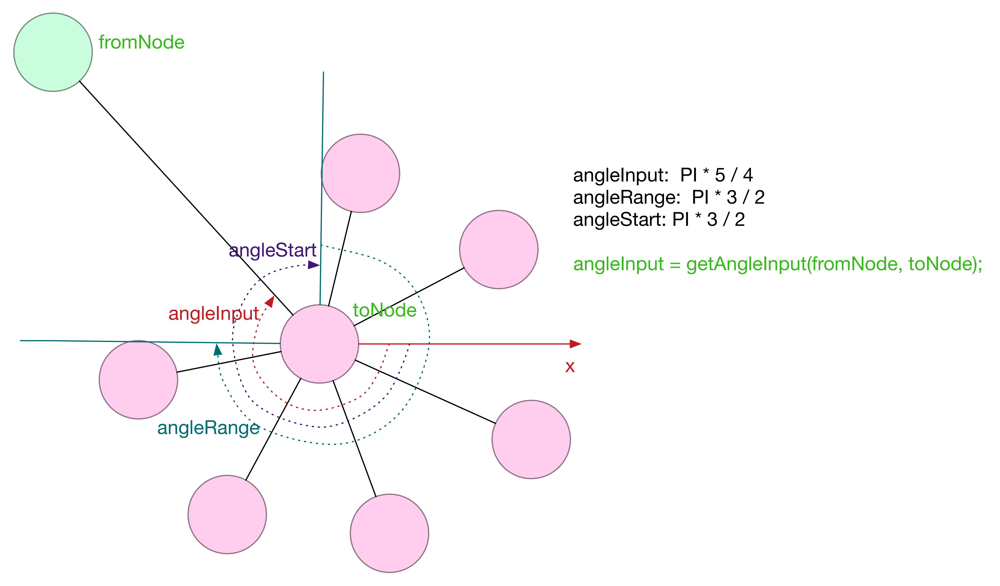
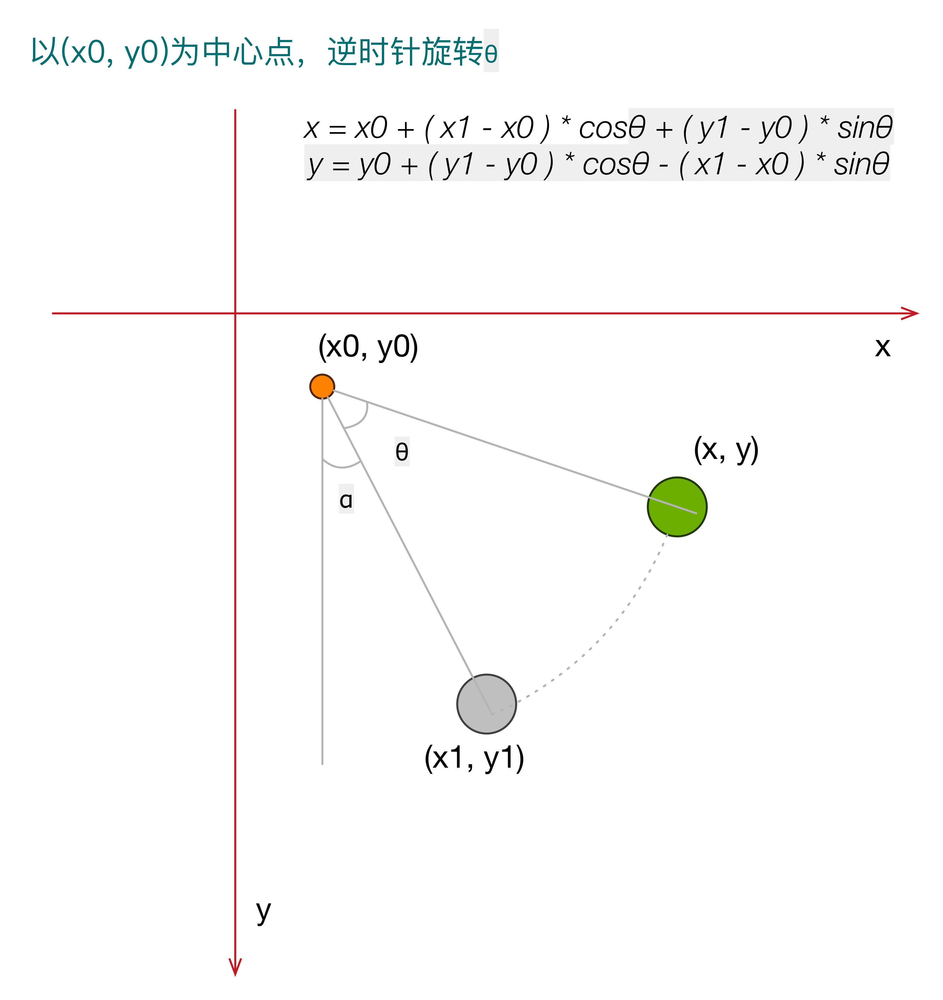
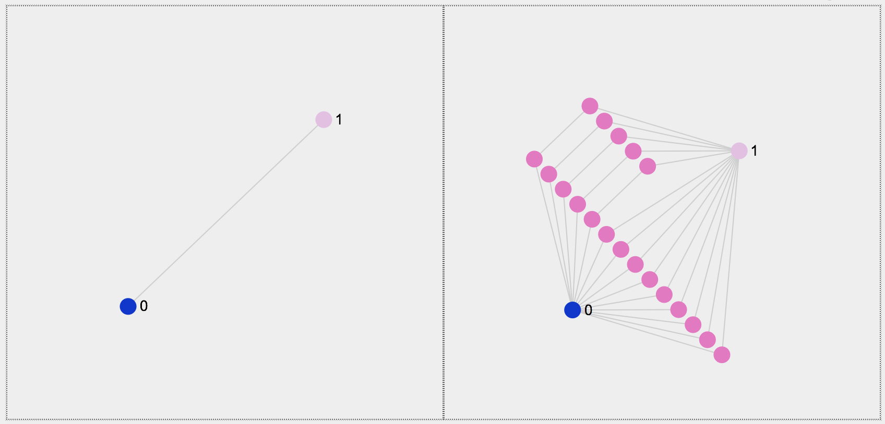
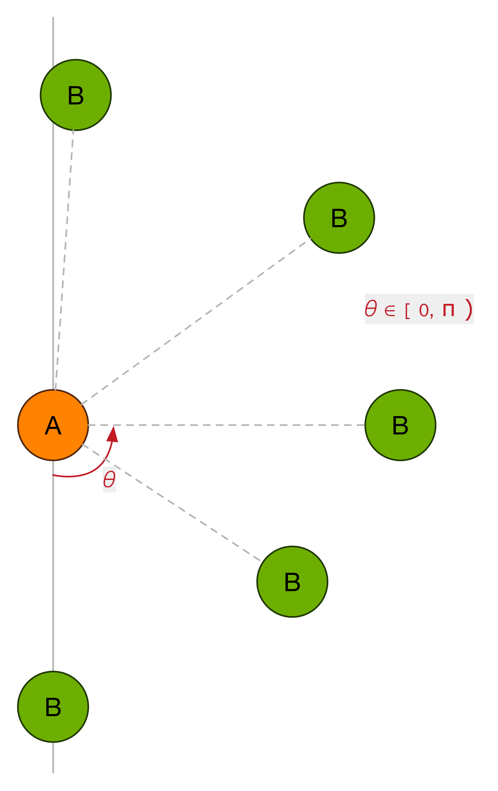
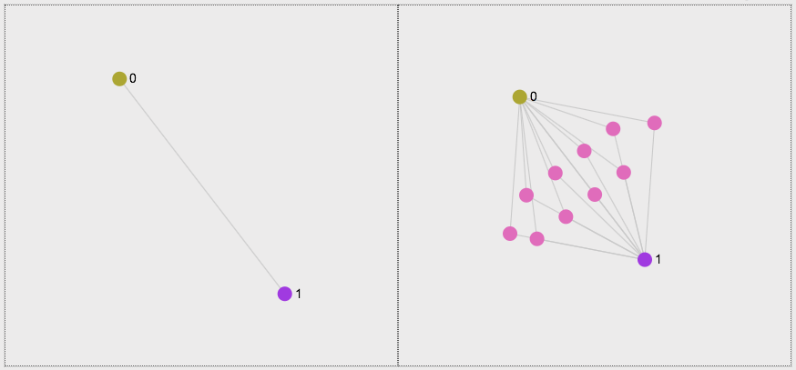
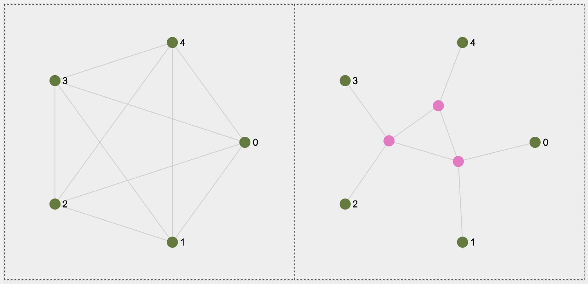

# graph layout 2

> 网络拓扑图布局算法研究2

## 增量布局

### 构建新节点

新节点的`特点`是`x`, `y`, `size`未设置确定的值，但不是`undefined`。

    @[data-script="javascript editable"]function createRawGraphData(
        nodeCount
        , existedNodes
        ){

        var graph = {nodes: [], edges: []}
            , nodeIds = []
            , len1, len2
            , idSeed = 100000
            , existedNodes = existedNodes || []
            , _nodes = []
            ;

        for(var i=0; i<nodeCount; i++){
            var id = 'n' + idSeed++;
            nodeIds.push(id);
            graph.nodes.push({
                id: id 
                , label: id
                , newAdded: true
                , x: null
                , y: null
                , size: 10
                // , color: fly.randomColor()
                // , color: '#ff7f0e' 
                , color: '#74c476' 
            });
        }

        _nodes = _nodes.concat(graph.nodes, existedNodes); 
        len1 = graph.nodes.length;
        len2 = _nodes.length;
        for(i=0; i<len1; i++){
            id = 'e' + idSeed++;
            graph.edges.push({
                id: id 
                , source: graph.nodes[ i ].id
                , target: _nodes[len2 * Math.random() | 0].id
                , color: '#cedb9c' 
                , hoverColor: '#c00'
            });
        }

        return graph;
    }

### 矩阵增量布局

`incLayoutGrid()`：矩阵增量布局，或者叫做网格增量布局。需提供参数：

* `nodes`：原有节点数组
* `newNodes`：新增节点数组。新节点需要确保`x, y`字段`存在`，即使其值是null
* `selectedNodes`：`选中`节点数组。新增节点初始会出现在选中节点的`中心处`。
* `options`：其他选项，同`getGridLayout()`方法的options

算法实现如下：

    @[data-script="javascript editable"]sigma.utils.incLayoutGrid
        = function(nodes, newNodes, selectedNodes, options){

        if(!newNodes || !newNodes.length
            || !nodes || !nodes.length){
            return;
        }

        var opt = options || {} 
            , rect
            , oldRect
            , oldCenter
            , selectedCenter
            , selectedRect
            , newCenter
            , newLen = newNodes.length
            , newWidth = ( Math.ceil(Math.sqrt(newNodes.length)) - 1 ) * ( opt.space || 50 ) 
                + ( newNodes[0].size || + 20 ) 
                + ( newLen < 2 ? ( opt.space || 50 ) : 0 )
            , gnr = sigma.utils.getNodesRect
            ;

        selectedNodes = selectedNodes || [];
        if(!selectedNodes.length){
            selectedNodes = nodes;
        }
        oldRect = rect = gnr(nodes, opt);
        oldCenter = {
            x: rect.x + rect.w / 2
            , y: rect.y + rect.h / 2
        };

        selectedRect = rect = gnr(selectedNodes, opt);
        selectedCenter = {
            x: rect.x + rect.w / 2
            , y: rect.y + rect.h / 2
        };

        newCenter = _getNewCenter(oldRect, selectedRect, newWidth);

        // from selected nodes' center point 
        newNodes.forEach(function(node){
            node.x = selectedCenter.x; 
            node.y = selectedCenter.y;
        });

        // prepare for the next animation, preventing `undefined node.grid_*`
        nodes.forEach(function(node){
            node.grid_x = node.x;
            node.grid_y = node.y;
        });

        opt.center = newCenter;
        sigma.utils.getGridLayout(newNodes, opt);

        function _getNewCenter(oldRect, selectedRect, newSize){
            var x0 = oldRect.x + oldRect.w / 2
                , y0 = oldRect.y + oldRect.h / 2
                , w0 = oldRect.w
                , h0 = oldRect.h
                , x1 = selectedRect.x + selectedRect.w / 2
                , y1 = selectedRect.y + selectedRect.h / 2
                , k
                , x, y
                ;

            if(x1 - x0 != 0 && y1 - y0 != 0){
                k = (y1 - y0) / (x1 - x0);
                if(Math.abs(k) >= 1){
                    if(y1 - y0 > 0){
                        y = y0 + h0 / 2 + newSize; 
                    }
                    else{
                        y = y0 - h0 / 2 - newSize; 
                    }
                    x = (y - y0) / k + x0;
                }
                else {
                    if(x1 - x0 > 0){
                        x = x0 + w0 / 2 + newSize;
                    }
                    else {
                        x = x0 - w0 / 2 - newSize;
                    }
                    y = (x - x0) * k + y0;
                }
            }
            else if(x1 - x0 == 0 && y1 - y0 != 0){
                x = x0;
                if(y1 - y0 > 0){
                    y = y0 + h0 / 2 + newSize; 
                }
                else {
                    y = y0 - h0 / 2 - newSize; 
                }
            }
            else if(y1 - y0 == 0 && x1 - x0 != 0){
                y = y0;
                if(x1 - x0 > 0){
                    x = x0 + w0 / 2 + newSize;
                }
                else {
                    x = x0 - w0 / 2 - newSize;
                }
            }
            else {
                x = x0 + w0 / 2 + newSize;
                y = y0 + h0 / 3;
            }

            return {
                x: x
                , y: y
            };
        }
    };

    sigma.prototype.incLayoutGrid = function(
        newNodes, selectedNodes, options) {
        var me = this
            , nodes = me.graph.nodes()
            ;

        me.initializeLayout();

        sigma.utils.incLayoutGrid(
            nodes
            , newNodes
            , selectedNodes
            , options
        );

        return me;
    };

    @[data-script="javascript editable"](function(){

        var s = fly.createShow('#test_10');
        // var g1 = getRandomGraph(200, 200, 1);
        // var g1 = networkGraph_circle_0628;
        // var g1 = networkGraph_FR;
        // var g1 = networkGraph_ForceAtlas2;
        // var g1 = networkGraph0520_allEdges;
        // var g1 = networkGraph_grid_0521; 
        // var g1 = networkGraph_tree_0521;
        // var g1 = networkGraph_2circles_0523;
        // var g1 = networkGraph_edges_between_the_same_level_nodes;
        var g1 = networkGraph_edges_between_the_same_level_nodes_2;
        // var g1 = networkGraph_many_children_0526;
        // var g1 = networkGraph_grid_0612; 
        var containerId = 'test_10_graph';
        var rendererSettings = {
                // captors settings
                doubleClickEnabled: true
                , mouseWheelEnabled: false

                // rescale settings
                , minEdgeSize: 0.5
                , maxEdgeSize: 1
                , minNodeSize: 1 
                , maxNodeSize: 5

                // renderer settings
                , edgeHoverColor: fly.randomColor() 
                , edgeHoverSizeRatio: 1
                , edgeHoverExtremities: true
                , drawLabels: false
            };
        var sigmaSettings = {
                // rescale settings 
                sideMargin: 10 

                // instance global settings
                , enableEdgeHovering: true
                , edgeHoverPrecision: 5
            };

        var sm;

        g1.nodes.forEach(function(node){
            node.color = '#aaa';
        });

        if((sm = isSigmaInstanceExisted(containerId))){
            sm.kill();
        };

        sm = getUniqueSigmaInstance(
                    containerId
                    , {
                        settings: sigmaSettings 
                        , graph: g1
                        , renderers: [
                            {
                                type: 'canvas' 
                                , container: containerId
                                , settings: rendererSettings
                            }
                        ]
                    }
                ); 

        sm.refresh();

        setTimeout(function(){
            var newData = createRawGraphData(
                    18
                    , sm.graph.nodes()
                )
                , newNodes = newData.nodes
                , newEdges = newData.edges
                ; 

            function getRandomSelectedNodes(){
                var _nodes = sm.graph.nodes()
                    , len = _nodes.length
                    , retNodes = []
                    ;

                _nodes.forEach(function(_node){
                    if(Math.random() > 0.8){
                        _node.color = '#e6550d';
                        retNodes.push(_node);
                    }
                });
                return retNodes;
            }

            sm.incLayoutGrid(
                newNodes
                , getRandomSelectedNodes()
                , {
                    space: 10
                }
            )
            ;

            newNodes.forEach(function(node){
                sm.graph.addNode(node);
            });

            newEdges.forEach(function(edge){
                sm.graph.addEdge(edge);
            });

            sm.refresh();

            setTimeout(function(){
                sigma.plugins.animate(
                    sm
                    , {
                        x: 'grid_x'
                        , y: 'grid_y'
                    }
                    , {
                        duration: 500
                        , onComplete: function(){
                            sm.graph.nodes().forEach(function(node){
                                delete node.grid_x;
                                delete node.grid_y;
                            });
                        }
                    }
                );
            }, 1000);

        }, 1000);

    })();

### 增量簇布局 

#### interpolatesAngle()

    @[data-script="javascript editable"]sigma.utils.interpolatesAngle
        = function(
            angleRange
            , numOfFirstLevel
            , levels
            , angleStart
        ) {
        var retArr = []
            , angleStart = angleStart || 0
            , numOfCurrentLevel
            , anglesOfCurrentLevel
            , stepOfCurrentLevel
            , angleOffset
            , i, j
            ;

        for(i=0; i<levels; i++){
            numOfCurrentLevel = ( i + 1 ) * numOfFirstLevel;
            anglesOfCurrentLevel = [];
            stepOfCurrentLevel = angleRange / numOfCurrentLevel;
            angleOffset = stepOfCurrentLevel * ( i == 0 ? 0 : 0.5 );
            angleOffset += angleStart;
                
            retArr.push(anglesOfCurrentLevel);
            for(j=0; j<numOfCurrentLevel; j++){
                anglesOfCurrentLevel.push(
                    stepOfCurrentLevel * j + angleOffset
                );
            }
        }

        return retArr;
    };

#### clustersNodes()

参数示意图：

以下为实现代码：

    @[data-script="javascript editable"]sigma.utils.clustersNodes
        = function(
            nodes
            , options
        ) {

        var opt = options || {}
            , root = opt.root || {x: 0, y: 0}
            , len 
            , numOfFirstLevel
            , clusterLevels
            , angleRange = opt.angleRange || 2 * Math.PI
            , radiusStep = opt.radiusStep || 100
            , angleInput = opt.angleInput || 0
            , angleStart = angleInput
            , writePrefix = opt.writePrefix || ''
            , readPrefix = opt.readPrefix || ''
            , randomRadius = opt.randomRadius
            , radius = 0, _r
            , _rx, _ry 
            , i, j, k
            , angles
            , PI = Math.PI
            , alen, mid, left, right
            , retObj = null 
            ;

        if(!nodes || !nodes.length){
            return retObj;
        }

        len = nodes.length; 
        numOfFirstLevel = opt.numOfFirstLevel 
            || sigma.utils.getNumOfFirstClusterLevel(len, 15, 1);
        clusterLevels = sigma.utils.getClusterLevels(numOfFirstLevel, len); 

        if(angleRange < PI * 2){
            angleStart = ( 2 * PI - angleRange ) / 2 + angleInput;
        }

        retObj = {
            numOfFirstLevel: numOfFirstLevel
            , numOfNodes: len
            , clusterLevels: clusterLevels
            , angleInput: angleInput
            , angleRange: angleRange
            , angleStart: angleStart
            , radiusStep: radiusStep
        };

        angles = sigma.utils.interpolatesAngle(
            angleRange
            , numOfFirstLevel
            , clusterLevels 
            , angleStart
        );

        if(typeof root[writePrefix + 'x'] == 'undefined'){
            root[writePrefix + 'x'] = root.x;
            root[writePrefix + 'y'] = root.y;
        }

        k = 0;
        _rx = root[readPrefix + 'x'];
        _ry = root[readPrefix + 'y'];

        if(opt.centerFirst){
            for(i=0; i<angles.length && k < len; i++){
                radius += radiusStep;
                alen = angles[i].length;
                mid = Math.floor(alen / 2);
                for(j=0; j<=mid && k<len; j++, k++){
                    _r = _getRadius(radius);
                    nodes[k][writePrefix + 'x'] = _rx + _r * Math.cos(angles[i][mid - j]);
                    nodes[k][writePrefix + 'y'] = _ry + _r * Math.sin(angles[i][mid - j]);

                    _r = _getRadius(radius);
                    if(k + 1 < len && mid + j < alen && j != 0){
                        k++;
                        nodes[k][writePrefix + 'x'] = _rx + _r * Math.cos(angles[i][mid + j]);
                        nodes[k][writePrefix + 'y'] = _ry + _r * Math.sin(angles[i][mid + j]);
                    }
                }
            }
        }
        else if(opt.sidesFirst){
            for(i=0; i<angles.length && k < len; i++){
                radius += radiusStep;
                alen = angles[i].length;
                mid = Math.floor(alen / 2);
                for(j=0; j<=mid && k<len; j++, k++){
                    _r = _getRadius(radius);
                    left = j;
                    right = alen - 1 - j;
                    if(left > right) {
                        break;
                    }

                    nodes[k][writePrefix + 'x'] = _rx + _r * Math.cos(angles[i][left]);
                    nodes[k][writePrefix + 'y'] = _ry + _r * Math.sin(angles[i][left]);

                    if(k + 1 < len && left < right){
                        k++;
                        _r = _getRadius(radius);
                        nodes[k][writePrefix + 'x'] = _rx + _r * Math.cos(angles[i][right]);
                        nodes[k][writePrefix + 'y'] = _ry + _r * Math.sin(angles[i][right]);
                    }
                }
            }
        }
        else {
            for(i=0; i<angles.length && k < len; i++){
                radius += radiusStep;
                alen = angles[i].length;
                for(j=0; j<alen && k<len; j++, k++){
                    _r = _getRadius(radius);
                    nodes[k][writePrefix + 'x'] = _rx + _r * Math.cos(angles[i][j]);
                    nodes[k][writePrefix + 'y'] = _ry + _r * Math.sin(angles[i][j]);
                }
            }
        }

        return retObj;

        function _getRadius(radius){
            return radius 
                + ( randomRadius ? 0.5 * radiusStep * Math.random() : 0 );
        }

    };

#### getAngleInput()

`getAngleInput(fromNode, toNode, options)`：获取簇布局输入节点的角度。

    @[data-script="javascript"]sigma.utils.getAngleInput
        = function(fromNode, toNode, options){

        var opt = options || {} 
            , readPrefix = opt.readPrefix || ''
            , dy = fromNode[readPrefix + 'y'] - toNode[readPrefix + 'y']
            , dx = fromNode[readPrefix + 'x'] - toNode[readPrefix + 'x']
            , angleInput
            ;
        sin = dy / Math.sqrt( 
                Math.pow(dx, 2) + Math.pow(dy, 2) 
            );
        cos = dx / Math.sqrt(
                Math.pow(dx, 2) + Math.pow(dy, 2) 
            );

        if( sin >= 0 ) {
            angleInput = Math.acos(cos);
        }
        else {
            angleInput = 2 * Math.PI - Math.acos(cos);
        }

        return angleInput;
    };

#### getClusterLevels()

`getClusterLevels(numOfFirstLevel, totalNum)`：计算簇布局的最大层数。

    @[data-script="javascript"]sigma.utils.getClusterLevels
        = function(numOfFirstLevel, totalNum){

        var i = 1
            , step = numOfFirstLevel
            , all = 0
            ;

        do {
            all += i * step;
            i++;
        }
        while(all < totalNum);
        return i - 1; 
    }

#### getNumOfFirstClusterLevel()

`getNumOfFirstClusterLevel(totalNum, max, min)`：计算簇布局最里层节点数目。

    @[data-script="javascript"]sigma.utils.getNumOfFirstClusterLevel
        = function(totalNum, max, min){

        var max = max || 18 
            , min = min || 1
            , i = 1
            , t = 0
            , m
            ;
        while(1){
            t += i; 
            m = Math.ceil(totalNum / t);
            if(m >= min && m <= max){
                return m;
            }
            i++;
        }
    }

    @[data-script="javascript editable"](function(){

        var s = fly.createShow('#test_30');
        var g1 = getClusterGraph(20, {xMax: 200, yMax: 200, nodeSize: 10});
        var root = g1.nodes[0];
        var fromNode = {
                id: 'n0'
                , label: '0'
                , x: 100
                , y: 100
                , size: 10
                , cluster_x: 100
                , cluster_y: 100
                , color: fly.randomColor()
            };
        var g2 = {
                nodes: [fromNode, root] 
                , edges: [{
                    id: 'e0'
                    , source: fromNode.id 
                    , target: root.id 
                    , color: '#ccc'
                }]
            };
        var g3 = {
                nodes: g1.nodes.slice(1)
                , edges: g1.edges
            };
        var containerId = 'test_30_graph';
        var rendererSettings = {
                // captors settings
                doubleClickEnabled: true
                , mouseWheelEnabled: false

                // rescale settings
                , minEdgeSize: 0.5
                , maxEdgeSize: 1
                , minNodeSize: 1 
                , maxNodeSize: 5

                // renderer settings
                , edgeHoverColor: fly.randomColor() 
                , edgeHoverSizeRatio: 1
                , edgeHoverExtremities: true
                , drawLabels: false
            };
        var sigmaSettings = {
                // rescale settings 
                sideMargin: 10 

                // instance global settings
                , enableEdgeHovering: true
                , edgeHoverPrecision: 5
                , autoRescale: false
            };

        var sm;

        if((sm = isSigmaInstanceExisted(containerId))){
            sm.kill();
        };

        root.cluster_x = root.x;
        root.cluster_y = root.y;
        root.x = fromNode.x;
        root.y = fromNode.y;

        angleInput = sigma.utils.getAngleInput(
            {x: root.x, y: root.y}
            , {x: root.cluster_x, y: root.cluster_y}
        );

        sm = getUniqueSigmaInstance(
                    containerId
                    , {
                        settings: sigmaSettings 
                        , graph: g2
                        , renderers: [
                            {
                                type: 'canvas' 
                                , container: containerId
                                , settings: rendererSettings
                            }
                        ]
                    }
                ); 

        sm.refresh();
        sm.camera.goTo({
            x: 100
            , y: 100
        });

        sigma.plugins.animate(
            sm
            , {
                x: 'cluster_x'
                , y: 'cluster_y'
            }
            , {
                duration: 500
                , onComplete: function(){
                    root = sm.graph.nodes('n1');

                    g3.nodes.forEach(function(node){
                        node.x = root.x;
                        node.y = root.y;
                    });

                    sigma.utils.clustersNodes(
                        g3.nodes 
                        , {
                            root: root  
                            , angleRange: 3 * Math.PI / 2
                            // , numOfFirstLevel: 8
                            , radiusStep: 60
                            , randomRadius: 1
                            // , angleInput: 3 * Math.PI / 2
                            , angleInput: angleInput 
                            , writePrefix: 'cluster_'
                            , centerFirst: 1
                        }
                    );

                    sm.graph
                        .read(g3)
                        ;

                    sm.refresh();

                    setTimeout(function(){
                        sigma.plugins.animate(
                            sm
                            , {
                                x: 'cluster_x'
                                , y: 'cluster_y'
                            }
                            , {
                                duration: 500
                        }
                        );
                    }, 500);
                }
            }
        );

    })();

### 增量力导向布局

#### 算法描述

`incLayoutYifanHu()`：YifanHu增量布局，需提供参数：
* `nodes`：原有节点数组
* `newNodes`：新增节点数组。新节点需要确保。。。
* `selectedNodes`：...
* `options`：...

todo

## 边展开布局

### 工具方法

#### rotateGraph()

对图进行`逆时针`旋转操作。

 

    @[data-script="javascript"]sigma.utils.rotateGraph = function( nodes, options ) {
        var nodes = nodes || [] 
            , opt = options || []
            , radian = opt.radian || 0
            , center = opt.center
            , readPrefix = opt.readPrefix || ''
            , writePrefix = opt.writePrefix || ''
            , rect
            , x0, y0, x1, y1
            ;

        if ( !center ) {
            rect = sigma.utils.getNodesRect( nodes, opt );
            center = {
                x: rect.x + rect.w / 2
                , y: rect.y + rect.h / 2
            };
        }

        x0 = center.x;
        y0 = center.y;
        nodes.forEach( function( node ) {
            x1 = node[ readPrefix + 'x' ]; 
            y1 = node[ readPrefix + 'y' ];
            node[ writePrefix + 'x' ] = x0 
                + ( x1 - x0 ) * Math.cos( radian ) 
                + ( y1 - y0 ) * Math.sin( radian )
                ;
            node[ writePrefix + 'y' ] = y0 
                + ( y1 - y0 ) * Math.cos( radian ) 
                - ( x1 - x0 ) * Math.sin( radian )
                ;
        } );

        return nodes;
    };

    sigma.prototype.rotateGraph = function( options ) {
        var me = this
            , opt = options || {}
            , subGraph = me.graph.getSubGraph( opt )  
            , nodes = subGraph.nodes
            ;

        nodes = sigma.utils.rotateGraph( nodes, opt );
        return me;
    };

`验证：`

    @[data-script="javascript editable"]
    (function(){

        var s = fly.createShow('#test_rotate_graph');
        var g1 = getRandomGraph(2, 1, 8);
        var g1 = getLineGraph(20, 18, {nodeSize: 8});
        // var g1 = getClusterGraph(20, {xMax: 200, yMax: 200, nodeSize: 10});
        // var g1 = networkGraph_edges_between_the_same_level_nodes_3;
        // var g1 = networkGraph_FR;
        // var g1 = networkGraph_ForceAtlas2;
        // var g1 = networkGraph0520_allEdges;
        // var g1 = networkGraph_grid_0521; 
        // var g1 = networkGraph_tree_0521;
        // var g1 = networkGraph_2circles_0523;
        // var g1 = networkGraph_edges_between_the_same_level_nodes;
        // var g1 = networkGraph_edges_between_the_same_level_nodes_2;
        // var g1 = networkGraph_many_children_0526;

        var g2 = {
                nodes: g1.nodes.slice()
                , edges: g1.edges.slice()
            }
            ;
        var containerId = 'test_rotate_graph_graph';
        var rendererSettings = {
                // captors settings
                doubleClickEnabled: true
                , mouseWheelEnabled: false

                // rescale settings
                , minEdgeSize: 0.5
                , maxEdgeSize: 1
                , minNodeSize: 1 
                , maxNodeSize: 5

                // renderer settings
                , edgeHoverColor: fly.randomColor() 
                , edgeHoverSizeRatio: 1
                , edgeHoverExtremities: true
            };
        var sigmaSettings = {
                // rescale settings 
                sideMargin: 0.1 

                // instance global settings
                , enableEdgeHovering: true
                , edgeHoverPrecision: 5
                , autoRescale: 0
            };

        var sm1, sm2;

        if((sm1 = isSigmaInstanceExisted('test_rotate_graph_left'))
            && (sm2 = isSigmaInstanceExisted('test_rotate_graph_right'))){
            sm1.kill();
            sm2.kill();
        };

        sm1 = getUniqueSigmaInstance(
                    'test_rotate_graph_left'
                    , {
                        settings: sigmaSettings 
                        , graph: g1
                        , renderers: [
                            {
                                type: 'canvas' 
                                , container: $('#' + containerId + ' .test-graph-left')[0]
                                , settings: rendererSettings
                            }
                        ]
                    }
                ); 

        sm2 = getUniqueSigmaInstance(
                    'test_rotate_graph_right'
                    , {
                        settings: sigmaSettings 
                        , graph: g2
                        , renderers: [
                            {
                                type: 'canvas' 
                                , container: $('#' + containerId + ' .test-graph-right')[0]
                                , settings: rendererSettings
                            }
                        ]
                    }
                ); 

        sm1
            .normalizeSophonNodes()
            .alignCenter({rescaleToViewport: 1})
            .refresh()
            ;

        sm2
            .normalizeSophonNodes()
            .alignCenter({rescaleToViewport:1})
            .refresh() // note: must invoke `refresh()` to update coordinates
            .rotateGraph( {
                radian: Math.PI / 4
                , writePrefix: 'rotate_'
            } )
            ;

        setTimeout(function(){
            sigma.plugins.animate(
                sm2
                , {
                    x: 'rotate_x'
                    , y: 'rotate_y'
                }
                , {
                    duration: 1000
                }
            );

        }, 500);

    })();

#### getABEdgeInfo()

`getABEdgeInfo(node1, node2)`：给定端点，获得`满足边展开`算法定义的边AB及其相关信息，其中
关于`AB edge`的定义可参考下方单边展开`算法描述`部分。

    @[data-script="javascript"]sigma.utils.getABEdgeInfo
        = function( node1, node2, options ) {

        if ( !node1 || !node2 ) {
            throw new Error('sigma.utils.getABEdgeInfo: node1 or node2 not specified');
        }

        var opt = options || {}
            , prefix = opt.readPrefix || ''
            , x1 = node1[ prefix + 'x' ]
            , y1 = node1[ prefix + 'y' ]
            , x2 = node2[ prefix + 'x' ]
            , y2 = node2[ prefix + 'y' ]
            , dx, dy
            , A, B
            , cos, theta
            ;

        if ( x1 < x2 ) {
            A = node1;
            B = node2;
        }
        else if ( x1 == x2 ) {
            if ( y1 < y2 ) {
                A = node1;
                B = node2;
            }
            else if ( y1 == y2 ) {
                throw new Error('sigma.utils.getABEdgeInfo: the same coordinates');
            }
            else {
                A = node2;
                B = node1;
            }
        }
        else {
            A = node2;
            B = node1;
        }

        dx = B[ prefix + 'x' ] - A[ prefix + 'x' ];
        dy = B[ prefix + 'y' ] - A[ prefix + 'y' ];
        cos = dy / Math.sqrt(
                Math.pow( dx, 2 ) + Math.pow( dy, 2 )
            );
        theta = Math.acos( cos );

        return {
            A: A
            , B: B
            , theta: theta
        };
    };

    @[data-script="javascript"](function(){

        var s = fly.createShow('#test_getABEdgeInfo');
        var items = [
                [   { x: 10, y: 10}, { x: 10,  y: 100 } ]
                , [ { x: 10, y: 10}, { x: 50,  y: 50  } ]
                , [ { x: 10, y: 10}, { x: 100, y: 10  } ]
                , [ { x: 10, y: 10}, { x: 30,  y: -50 } ]
                , [ { x: 10, y: 10}, { x: -30, y: -50 } ]
            ];

        s.show('Start testing ...');
        items.forEach( function( item ) {
            s.append_show( 
                item[ 0 ]
                , item[ 1 ]
                , sigma.utils.getABEdgeInfo( item[ 0 ], item[ 1 ] ) 
            );
        } );

    })();

边展开算法分两种情况，单展开一条边，以及同时展开多条边。

### 单边展开算法

单边展开，保持端点不动，新节点按层次布局排布在端点中间。

 

#### 算法描述

边`AB`，`起点`为节点A，`终点`为节点B。
`展开`边AB，在节点A和B中间布局一个`网络图`，同时保持A、B的`位置`不变。

记展开的新节点集合为`M`，单边展开，是一棵树，所以可以使用层次布局。

1. 定义`边AB`：起点A和终点B的坐标分别为(x1, y1), (x2, y2)，需满足以下条件：

        x1 < x2
        || x1 == x2 && y1 < y2

    定义边AB的`偏角θ`，当AB为一条`竖直线`时，`θ = 0`。满足`0 ≤ θ < π`。

    

2. 定义`子图G`：`节点集`为`A ∪ M`，`边集`由仅包含节点集的节点的边组成。
    对子图G进行`高度受限`、root为A的层次布局，获得临时布局L。

    `注意`：子图G不包含节点B，是个`关键`的`优化`，B的存在会对最终布局造成很多干扰。

3. 对临时布局L，排除节点A和B后剩余的节点集，也即`M`，先进行以`直线`AB`中点`为中心的`标准化`操作
    ，再进行以直线AB`中点`为中心，角度为θ的旋转操作。

#### 优化策略

1. 节点`归类`，使满足相同类型，或时间接近的节点靠近。使用`childrenSort` option。
    这需要节点提供足够的信息用于归类。

2. 新子图若`包含B`，同时`AB`间也存在边，则可能出现以下布局效果：

    

    解决方案，已经在算法中，`将B`从子图G`剔除`。

#### 算法实现

    @[data-script="javascript"]sigma.prototype.collapseEdge
        = function( node1, node2, options ) {
        var me = this;
        me.initializeLayout();

        var opt = options || {}
            , extend = sigma.utils.extend
            , readPrefix = opt.readPrefix || ''
            , eInfo = sigma.utils.getABEdgeInfo( node1, node2 )
            , filter1 = function( node ) {
                return node.id == eInfo.A.id
                    || node.newAdded
                    ;
            }
            , filter2 = function( node ) {
                return node.newAdded;
            }
            , subGraph = me.graph.getSubGraph( { filter: filter2 } )
            , rect = sigma.utils.getNodesRect( [ node1, node2 ], opt )
            , distance = Math.sqrt(
                Math.pow( eInfo.A[ readPrefix + 'x' ] - eInfo.B[ readPrefix + 'x' ], 2 )
                + Math.pow( eInfo.A[ readPrefix + 'y' ] - eInfo.B[ readPrefix + 'y' ], 2 )
            )
            , ABCenter = {
                x: rect.x + rect.w / 2
                , y: rect.y + rect.h / 2
            }
            ;

        subGraph.nodes.forEach( function( node ) {
            node.x = ABCenter.x;
            node.y = ABCenter.y;
        } );

        me
            .layoutHierarchy2( sigma.utils.extend(
                {
                    root: eInfo.A
                    , filter: filter1
                } 
                , opt
                , { 
                    xUnit: 50 
                    , heightLimit: distance
                }
            ) )
            .normalizeSophonNodes( {
                readPrefix: 'hier_'
                , filter: filter2
                , center: ABCenter
            } )  
            .rotateGraph( {
                readPrefix: 'hier_'
                , writePrefix: 'hier_'
                , filter: filter2
                , center: ABCenter
                , radian: eInfo.theta
            } )
            ;

        me.graph.nodes().forEach( function( node ) {
            if ( node.id == eInfo.A.id ) { 
                delete node.hier_x;
                delete node.hier_y;
            }
        } );

        return me;
    };

#### 算法验证

`insertSubGraph()`：两个节点间插入指定数目的路径，模拟边展开的效果。

    @[data-script="javascript editable"]function insertSubGraph( 
        graph, fromNode, toNode, options ) {

        var opt = options || {}
            , nodeColor = opt.nodeColor || '#e377c2'
            , nodeSize = opt.nodeSize || 8
            , edgeColor = opt.edgeColor || '#ccc'
            , edgeHoverColor = opt.edgeHoverColor || '#f00'
            , nodes = graph.nodes
            , edges = graph.edges
            ;

        function _createNode( type ) {
            return {
                id: 'n_' + new Date().getTime() + ( 1000 * Math.random() )
                , type: type
                , x: null
                , y: null
                , newAdded: true
                , color: nodeColor
                , size: nodeSize
            };
        }

        function _createEdge( fromNode, toNode ) {
            return {
                id: 'e_' + new Date().getTime() + ( 1000 * Math.random() )
                , source: fromNode.id
                , target: toNode.id
                , color: edgeColor
                , hoverColor: edgeHoverColor
            };
        }

        function _insertOne() {
            var n = _createNode( 'typeA' );
            nodes.push( n );
            edges.push( _createEdge( fromNode, n ) );
            edges.push( _createEdge( n, toNode ) );
        }

        function _insertTwo() {
            var n1 = _createNode( 'typeB' ), n2 = _createNode( 'typeB' );
            nodes.push( n1 );
            nodes.push( n2 );
            edges.push( _createEdge( fromNode, n1 ) );
            edges.push( _createEdge( n1, n2 ) );
            edges.push( _createEdge( n2, toNode ) );
        }

        function _insertThree() {
            var n1 = _createNode( 'typeC' )
                , n2 = _createNode( 'typeC' )
                , n3 = _createNode( 'typeC' )
                ;
            nodes.push( n1 );
            nodes.push( n2 );
            nodes.push( n3 );
            edges.push( _createEdge( fromNode, n1 ) );
            edges.push( _createEdge( n1, n2 ) );
            edges.push( _createEdge( n2, n3 ) );
            edges.push( _createEdge( n3, toNode ) );
        }

        var count = opt.count || 10;
        while ( count-- > 0 ) {
            var r = Math.random();
            if ( r > 0.6 ) {
                _insertOne();
            }
            else if ( r > 0.3 ) {
                _insertTwo();
            }
            else {
                _insertThree();
            }
        }

        // delete original edge
        for ( var i = edges.length - 1; i >= 0; i-- ) {
            var edge = edges[ i ];
            if ( edge.source == fromNode.id && edge.target == toNode.id
                || edge.target == fromNode.id && edge.source == toNode.id ) {
                edges.splice( i, 1 );
            }
        }

        // maybe new graph also contains edge `AB`
        if ( Math.random() > 0.5 ) {
            edges.push( _createEdge( fromNode, toNode ) ); 
        }

        return {
            nodes: nodes
            , edges: edges
        };
    }

    @[data-script="javascript editable"]
    (function(){

        var s = fly.createShow('#test_edge_collapse');
        var g1 = getRandomGraph(2, 4, 8);
        var g2 = {
                nodes: g1.nodes.slice()
                , edges: g1.edges.slice()
            }
            ;
        var containerId = 'test_edge_collapse_graph';
        var rendererSettings = {
                // captors settings
                doubleClickEnabled: true
                , mouseWheelEnabled: false

                // rescale settings
                , minEdgeSize: 0.5
                , maxEdgeSize: 1
                , minNodeSize: 1 
                , maxNodeSize: 5

                // renderer settings
                , edgeHoverColor: fly.randomColor() 
                , edgeHoverSizeRatio: 1
                , edgeHoverExtremities: true
            };
        var sigmaSettings = {
                // rescale settings 
                sideMargin: 0.1 

                // instance global settings
                , enableEdgeHovering: true
                , edgeHoverPrecision: 5
                , autoRescale: 0
            };

        var sm1, sm2;

        if((sm1 = isSigmaInstanceExisted('test_edge_collapse_left'))
            && (sm2 = isSigmaInstanceExisted('test_edge_collapse_right'))){
            sm1.kill();
            sm2.kill();
        };

        sm1 = getUniqueSigmaInstance(
                    'test_edge_collapse_left'
                    , {
                        settings: sigmaSettings 
                        , graph: g1
                        , renderers: [
                            {
                                type: 'canvas' 
                                , container: $('#' + containerId + ' .test-graph-left')[0]
                                , settings: rendererSettings
                            }
                        ]
                    }
                ); 

        g2 = insertSubGraph( g2, g2.nodes[0], g2.nodes[1], { count: 10 } );
        sm2 = getUniqueSigmaInstance(
                    'test_edge_collapse_right'
                    , {
                        settings: sigmaSettings 
                        , graph: g2
                        , renderers: [
                            {
                                type: 'canvas' 
                                , container: $('#' + containerId + ' .test-graph-right')[0]
                                , settings: rendererSettings
                            }
                        ]
                    }
                ); 

        sigmaEnableNodeDrag(sm2);

        sm1
            .normalizeSophonNodes()
            .alignCenter({rescaleToViewport: 1})
            .refresh()
            ;

        sm2
            .normalizeSophonNodes()
            .alignCenter({rescaleToViewport:1})
            .collapseEdge(
                sigma.utils.getNodeById( sm2.graph.nodes(),  g2.nodes[ 0 ].id )
                , sigma.utils.getNodeById( sm2.graph.nodes(), g2.nodes[ 1 ].id )
                , {
                    xUnit: 20
                    , childrenSort: function( childA, childB ) {
                        if ( !childA.type || !childB.type ) {
                            return 0;
                        }
                        return childA.type.localeCompare( childB.type );
                    }
                    , adjustSiblingsOrder: 1
                    , avoidSameLevelTravelThrough: 1
                    , avoidSameLevelTravelThroughDelta: 0.2
                }
            )
            .refresh() // note: must invoke `refresh()` to update coordinates
            .prepareAnimation( {
                readPrefix: 'hier_'
            } )
            ;

        setTimeout(function(){
            sigma.plugins.animate(
                sm2
                , {
                    x: 'hier_x'
                    , y: 'hier_y'
                }
                , {
                    duration: 1000
                }
            );

        }, 500);

    })();

### 多边展开算法

多边展开，可能是`复杂`布局，使用`力导向`布局来排布节点。

 

#### 算法描述

记需展开的边集合为`E`，边集合E相关的节点集为`N`，展开后新增节点集合为`M`。

1. 定义`子图G`：节点集为`N ∪ M`，边集由仅包含节点集的节点的边组成。 
2. 对子图G进行`节点集N固定`的`YifanHu`布局。

#### 算法实现

    @[data-script="javascript"]sigma.prototype.collapseMultiEdges
        = function( originalNodes, options ) {
        var me = this;
        me.initializeLayout();

        var opt = options || {}
            , extend = sigma.utils.extend
            , nodeIndexes = originalNodes.map( function( node ) {
                return node.id;
            } )
            , readPrefix = opt.readPrefix || ''
            , filter1 = function( node ) {
                return nodeIndexes.indexOf( node.id ) >= 0 
                    || node.newAdded
                    ;
            }
            , filter2 = function( node ) {
                return node.newAdded;
            }
            , subGraph = me.graph.getSubGraph( { filter: filter2 } )
            , rect = sigma.utils.getNodesRect( originalNodes)
            , ABCenter = {
                x: rect.x + rect.w / 2
                , y: rect.y + rect.h / 2
            }
            ;

        subGraph.nodes.forEach( function( node ) {
            // avoid duplicated coordinates
            node.x = ABCenter.x + 0.1 * Math.random();
            node.y = ABCenter.y + 0.1 * Math.random();
        } );

        me.graph.nodes().forEach( function( node ) {
            if ( nodeIndexes.indexOf ( node.id ) >= 0 ) {
                node.fixed = true;
            }
        } );

        me.layoutYifanHu( {
            skipInitialization: true
            , optimalDistance: opt.optimalDistance || 100
            , readPrefix: opt.readPrefix || 'yfh_'
            , maxIterations: opt.maxIterations || 50
            , relativeStrength: opt.relativeStrength || 0.2
            , filter: opt.filter || filter1
        } );

        me.graph.nodes().forEach( function( node ) {
            if ( nodeIndexes.indexOf ( node.id ) >= 0 ) {
                delete node.fixed;
            }
        } );

        return me;
    };

#### 算法验证

`getFullConnectedGraph()`：获得全连通图，节点两两连通。

    @[data-script="javascript"]function getFullConnectedGraph( numOfNodes, fixSize ) {
        var g = { nodes: [], edges: [] }
            , n = 0
            , e = 0
            ;

        function _createNode( x, y ) {
            g.nodes.push( {
                id: 'n' + n
                , label: '' + n
                , x: x
                , y: y
                , size: fixSize || 8
                , color: '#637939'
            } );
            n++;
        }

        function _createEdge( fromNode, toNode ) {
            g.edges.push( {
                id: 'e' + e
                , source: fromNode.id
                , target: toNode.id
                , size: 1
                , color: '#ccc'
            } );
            e++;
        }

        var radian, radius = 100;
        for ( var i = 0; i < numOfNodes; i++ ) {
            radian = i * 2 * Math.PI / numOfNodes; 
            _createNode( radius * Math.cos( radian ), radius * Math.sin( radian ) );
        }

        for ( var i = 0; i < numOfNodes; i++ ) {
            for ( var j = i + 1; j < numOfNodes; j++ ) {
                _createEdge( g.nodes[ i ], g.nodes[ j ] );
            }
        }

        return g;
    }

`insertSubGraph2()`：在`多个`节点间插入子图，使这些节点`两两`连通。

    @[data-script="javascript"]function insertSubGraph2( graph, numOfNodes, options ) {
        var opt = options || {}
            , nodeColor = opt.nodeColor || '#e377c2'
            , nodeSize = opt.nodeSize || 8
            , edgeColor = opt.edgeColor || '#ccc'
            , edgeHoverColor = opt.edgeHoverColor || '#f00'
            , nodes = graph.nodes
            , edges = graph.edges
            , newNodes = []
            ;

        function _createNode( type ) {
            return {
                id: 'n_' + new Date().getTime() + ( 1000 * Math.random() )
                , type: type
                , x: null
                , y: null
                , newAdded: true
                , color: nodeColor
                , size: nodeSize
            };
        }

        function _createEdge( fromNode, toNode ) {
            return {
                id: 'e_' + new Date().getTime() + ( 1000 * Math.random() )
                , source: fromNode.id
                , target: toNode.id
                , color: edgeColor
                , hoverColor: edgeHoverColor
            };
        }

        for ( var i = 0; i < numOfNodes; i++ ) {
            newNodes.push( _createNode( 1 ) );
        }

        edges.length = 0;
        for ( var i = 0; i < numOfNodes; i++ ) {
            for ( var j = i + 1; j < numOfNodes; j++ ) {
                edges.push( _createEdge( newNodes[ i ], newNodes[ j ] ) ); 
            }
        }

        for ( var i = 0; i < nodes.length; i++ ) {
            var j = Math.random() * numOfNodes | 0;
            edges.push( _createEdge( nodes[ i ], newNodes[ j ] ) );
        }

        graph.nodes = graph.nodes.concat( newNodes );

        return graph;
    }

    @[data-script="javascript editable"]
    (function(){

        var s = fly.createShow('#test_multiedge_collapse');
        var g1 = getFullConnectedGraph( 5 );
        var g2 = {
                nodes: g1.nodes.slice()
                , edges: g1.edges.slice()
            }
            ;
        var originalNodes = g1.nodes.slice();
        var containerId = 'test_multiedge_collapse_graph';
        var rendererSettings = {
                // captors settings
                doubleClickEnabled: true
                , mouseWheelEnabled: false

                // rescale settings
                , minEdgeSize: 0.5
                , maxEdgeSize: 1
                , minNodeSize: 1 
                , maxNodeSize: 5

                // renderer settings
                , edgeHoverColor: fly.randomColor() 
                , edgeHoverSizeRatio: 1
                , edgeHoverExtremities: true
            };
        var sigmaSettings = {
                // rescale settings 
                sideMargin: 0.1 

                // instance global settings
                , enableEdgeHovering: true
                , edgeHoverPrecision: 5
                , autoRescale: 0
            };

        var sm1, sm2;

        if((sm1 = isSigmaInstanceExisted('test_multiedge_collapse_left'))
            && (sm2 = isSigmaInstanceExisted('test_multiedge_collapse_right'))){
            sm1.kill();
            sm2.kill();
        };

        sm1 = getUniqueSigmaInstance(
                    'test_multiedge_collapse_left'
                    , {
                        settings: sigmaSettings 
                        , graph: g1
                        , renderers: [
                            {
                                type: 'canvas' 
                                , container: $('#' + containerId + ' .test-graph-left')[0]
                                , settings: rendererSettings
                            }
                        ]
                    }
                ); 

        g2 = insertSubGraph2( g2, 3);
        sm2 = getUniqueSigmaInstance(
                    'test_multiedge_collapse_right'
                    , {
                        settings: sigmaSettings 
                        , graph: g2
                        , renderers: [
                            {
                                type: 'canvas' 
                                , container: $('#' + containerId + ' .test-graph-right')[0]
                                , settings: rendererSettings
                            }
                        ]
                    }
                ); 

        sigmaEnableNodeDrag(sm2);

        sm1
            .normalizeSophonNodes()
            .alignCenter({rescaleToViewport: 1})
            .refresh()
            ;

        sm2
            .normalizeSophonNodes()
            .alignCenter({rescaleToViewport:1})
            .collapseMultiEdges(
                originalNodes
                , {
                    optimalDistance: 100
                    , maxIterations: 50
                }
            )
            .refresh() // note: must invoke `refresh()` to update coordinates
            .prepareAnimation( {
                readPrefix: 'yfh_'
            } )
            ;

        setTimeout(function(){
            sigma.plugins.animate(
                sm2
                , {
                    x: 'yfh_x'
                    , y: 'yfh_y'
                }
                , {
                    duration: 1000
                }
            );

        }, 500);

    })();

## 节点尺寸非线性变化

### 描述

`边长`与`缩放比例(ratio)`成正比例变化，节点尺寸变化要快于边长变化，可能是`线性`或`二次方`变化。

* `ratio`: camera缩放比例，不同graph有不同的ratio范围，记为`[ratioMin, ratioMax]`
* `expandRatio`: 节点size变化比率，在camera计算得到的size基础上进行调整时的比率，随着ratio的变化呈`二次方`变化，其变化区间为：`[1, expandRatioMax]`
* `二次`变化函数：`f(t) = at^2 + b`
* `线性`变化函数：`f(t) = kt + c`

需要计算参数`a`, `b`以及`k`, `c`。如下所示：

 

### 实现

`sigma.utils.nodeSizeExpandRatio()`实现了这种变化速率的匹配：

    @[data-script="javascript"]sigma.utils.nodeSizeExpandRatio =
        function(sigInst, ratio, options){
        var opt = options || {} 
            , ratioMax = sigInst.settings('zoomMax')
            , ratioMin = sigInst.settings('zoomMin')
            , sizeExpandRatioMax = opt.sizeExpandRatioMax || 2.5
            , argA
            , argB
            , sizeExpandRatio
            ;

        if(!sigInst|| !ratioMax || !ratioMin || !ratio){
            sizeExpandRatio = 1;
        }
        else if(opt.type == 'ease-in'){
            argA = ( sizeExpandRatioMax - 1 ) 
                / ( Math.pow(ratioMax - ratioMin + 1, 2) - 1 )
                ;
            argB = 1 - argA;
            sizeExpandRatio
                = argA * Math.pow( ratioMax - ratio + 1, 2 ) + argB;
        }
        else if(opt.type == 'linear'){
            argA = (sizeExpandRatioMax - 1) / (ratioMax - ratioMin); 
            argB = 1 - argA;
            sizeExpandRatio = argA * ( ratioMax - ratio + 1 ) + argB;
        }
        else {
            sizeExpandRatio = 1;
        }
        return sizeExpandRatio;
    }

### 验证

    @[data-script="javascript editable"](function(){

        var s = fly.createShow('#test_60');
        var sigInst = {
                settings: function(name){
                    switch(name){
                        case 'zoomMax':
                            return 20;
                        case 'zoomMin':
                            return 0.125;
                    }
                }
            }
            , sizeExpandRatioMax = 3
            , testItems = [
                sigInst.settings('zoomMax')
                , 19
                , 18
                , 15
                , 10
                , 5
                , 2
                , 1
                , 0.5 
                , 0.1
                , sigInst.settings('zoomMin')
            ]
            ;
        s.show('start testing...');
        testItems.forEach(function(item){
            (function(types){
                types.forEach(function(type){
                    s.append_show(
                        'ratio ' + item
                        , 'type ' + type
                        , sigma.utils.nodeSizeExpandRatio(
                            sigInst
                            , item 
                            , {
                                sizeExpandRatioMax: sizeExpandRatioMax
                                , type: type 
                            }
                        )
                    );
                });
            })(['linear', 'ease-in']);
        });

    })();

