# graph layout 3

> 网络拓扑图布局算法研究3，续`graph layout 2`

## 固定布局-续

### 环形布局

#### 算法描述

`环形布局算法`：

从`中心点`root开始，对图进行`环形`布局。

1. 从`中心点`开始，获取图的`环形广度遍历森林`。可能包含`多棵`遍历树。
2. 针对每棵遍历树`tree`，计算中心点的`回路`，若`有回路`，`goto 3`，`无回路`，`goto 4`
3. 若`中心点`在一个`回路`中，则选取包含中心点的`最长回路`，将该回路的所有节点分布在`第一层`圆环上，然后将以每个节点为根的`布局树``按层次`排布在`外面`的`圆环`上
4. 若中心点`不在`任何回路中，则中心点放置在图形`中点`，然后将以中心点为根的`布局树`按`层次`排布在`外面`的`圆环`上

`参数`：

* `angleStep`，在圆环上排布节点时的角度增量，该值对于不同层次的圆环不能一致，一般与半径成反比

`优化`：

* `root`选取，以`最大度数`节点作为获取遍历森林时的起点，可以一定程度上避免`边交叉`以及`树状`布局
* `无回路`情况的tree，将根节点放置在`圆环中心`

#### 算法实现

`环形布局`简版算法如下，`未做``均衡`算法，多棵`树`之间会产生`重叠`：

    @[data-script="javascript"]sigma.classes.graph.addMethod(
        'layoutCircleSimple'
        , function(){

        var forest = this.getCircleForest()
            , treeOffsetX = 0
            , PI = Math.PI
            , radius = 0.5 
            , radiusStep = radius 
            , initialAngleStep = 20 * PI / 180
            , angleStep = initialAngleStep
            ;

        sigma.utils.computeLeaves(forest);

        forest.forEach(function(tree){
            var circuit
                , angle = 0
                , maxLevel = 1
                ; 

            // if there is a circuit, layout it with a circle
            if(tree._circuit){
                circuit = tree._circuit;     
                angleStep = 2 * PI / circuit.length;
                circuit.forEach(function(node){
                    depthTravel(node, angle, radius);
                    angle += angleStep; 
                });
            }
            else {
                depthTravel(tree, angle, 0);
            }
            tree._wt_maxlevel = maxLevel;

            // depthTravel(tree, treeOffsetX);
            // treeOffsetX += tree._wt_leaves;

            function depthTravel(node, angle, radius){
                var children = node._wt_children
                    , leaves = node._wt_leaves
                    , level = node._wt_level
                    , len = children.length
                    , circleX
                    , circleY
                    , angleStep = initialAngleStep / level
                    , angleStart = angle - len * angleStep / 2
                    , _angle = angleStart + angleStep / 2
                    ;

                if(level > maxLevel) {
                    maxLevel = level;
                }

                circleX = radius * Math.cos(angle);
                circleY = radius * Math.sin(angle); 

                node.circle_x = circleX;
                node.circle_y = circleY;

                // console.log(radius, angle, circleX, circleY, angleStep);

                if(len > 0){
                    children.forEach(function(child){
                        depthTravel(child, _angle, radius + radiusStep);
                        _angle += angleStep;
                    }); 
                }
            }

        });

        // console.log(forest);

        return this;
    });

使用`均衡布局`优化的`环形布局`算法如下：

    @[data-script="javascript"]sigma.prototype.layoutCircle
        = function(options){
        var me = this;
        me.initializeLayout();

        var opt = options || {}
            , forest = me.graph.getCircleForest(opt)
            , treeOffsetX = 0
            , PI = Math.PI
            , radius = opt.radius || 1 
            , radiusStep = radius 
            , initialAngleStep = 15 * PI / 180
            , angleStep = initialAngleStep
            , spaceGrid = opt.spaceGrid || {xSize: 40, ySize: 40}
            // for tendency
            , angleOffset = 20 * PI / 180
            ;

        sigma.utils.computeLeaves(forest);

        var a = forest.map(function(tree){
            return tree.id 
        }).join(', ');
        // console.log(a);

        forest.forEach(function(tree){
            var circuit
                , angle = PI / 2 
                , maxLevel = 1
                , hasCircuit = tree._circuit ? 1 : 0
                ; 

            // if there is a circuit, layout it with a circle
            if(hasCircuit){
                circuit = tree._circuit;     
                angleStep = 2 * PI / circuit.length;
                circuit.forEach(function(node){
                    depthTravel(node, angle, radius);
                    angle += angleStep; 
                });
            }
            else {
                depthTravel(tree, angle, 0);
            }
            tree._wt_maxlevel = maxLevel;

            // depthTravel(tree, treeOffsetX);
            // treeOffsetX += tree._wt_leaves;

            function depthTravel(node, angle, radius, tendency){
                var children = node._wt_children
                    , leaves = node._wt_leaves
                    , level = node._wt_level
                    , len = children.length
                    , circleX
                    , circleY
                    , angleStep = initialAngleStep / level
                    , angleStart = angle - len * angleStep / 2
                    , _angle = angleStart + angleStep / 2
                    , tendency = tendency || 1
                    ;

                if(level > maxLevel) {
                    maxLevel = level;
                }

                circleX = radius * Math.cos(angle);
                circleY = radius * Math.sin(angle); 

                node.circle_x = circleX;
                node.circle_y = circleY;

                // console.log(radius, angle, circleX, circleY, angleStep);

                if(len > 0){

                    if(!hasCircuit && level == 1 && opt.makeRootCenter){
                        angleStep = 2 * PI / len;  
                    }

                    if(len == 1) {
                        // _angle = angleStart + ( tendency ? 1 : -1 ) * level * angleOffset;
                    }
                    children.forEach(function(child){
                        depthTravel(child, _angle, radius + radiusStep, 1 - tendency);
                        _angle += angleStep;
                    }); 
                }
            }

        });

        var grid = new Grid(spaceGrid.xSize, spaceGrid.ySize)
            , debug = 0
            , id = 2
            ;

        forest.sort(function(a, b){
            return b._wt_maxlevel - a._wt_maxlevel;
        });

        forest.forEach(function(tree){
            var spaceBlock = sigma.utils.computeCircleTreeRect(tree)
                ;

            grid.placeBlock(tree.id, spaceBlock, debug);
        });

        var output = grid.grid.map(
                function(row){
                    return row.join('  ');
                }
            ).join('\n');

        // console.log(output);

        forest.forEach(function(tree){
            var spaceBlock = grid.getBlockRect(tree.id) 
                , hasCircuit = tree._circuit ? 1 : 0
                , dx = ( 
                        spaceBlock.gridPos.x 
                        + ( hasCircuit ? spaceBlock.w / 2 : 0 ) 
                    ) * radius
                , dy = ( 
                        spaceBlock.gridPos.y 
                        + ( hasCircuit ? spaceBlock.h / 2 : 0 ) 
                    ) * radius
                ;

            // if there is a circuit
            if(tree._circuit){
                tree._circuit.forEach(function(node){
                    depthTravel(node);
                });
                delete tree._circuit;
            }
            else {
                depthTravel(tree);
            }

            function depthTravel(node){
                var children = node._wt_children
                    ;

                node.circle_x += dx;
                node.circle_y += dy;

                if(children.length > 0){
                    children.forEach(function(child){
                        depthTravel(child);
                    }); 
                    delete node._wt_children;
                }
            }
        });

        return this;
    };

使用`均衡布局`、`自适应半径`优化的`环形布局`算法：

* options.nodeSize，与`node.size`不完全等同，可以认为nodeSize是你希望给一个节点的空间占用，而不是节点本身的尺寸
* options.radiusStep
* options.initialAngleRange

算法实现如下：

    @[data-script="javascript"]sigma.prototype.layoutCircle2
        = function(options){
        var me = this;
        me.initializeLayout();

        var opt = options || {}
            , forest = this.graph.getCircleForest(opt)
            , treeOffsetX = 0
            , PI = Math.PI
            // `nodeSize` is not exactly `node.size`
            , nodeSize = opt.nodeSize || 0.2
            , radiusStep = opt.radiusStep || 2 
            , initialAngleRange = opt.initialAngleRange || PI 
            , spaceGrid = opt.spaceGrid || {xSize: 40, ySize: 40}
            , radius
            ;

        sigma.utils.computeLeaves(forest);

        var a = forest.map(function(tree){
            return tree.id 
        }).join(', ');
        // console.log(a);

        forest.forEach(function(tree){
            var circuit
                , angle = PI / 2 
                , maxLevel = 1
                , hasCircuit = tree._circuit ? 1 : 0
                , angleStep
                , config
                ; 

            // if there is a circuit, layout it with a circle
            if(hasCircuit){
                circuit = tree._circuit;     
                config = _getAngleStepAndRadius(
                    2 * PI // layout the circuit with a circle
                    , nodeSize
                    , circuit.length 
                    , radiusStep
                    , 0
                );
                angleStep = config.angleStep;
                radius = config.radius; 
                circuit.forEach(function(node){
                    depthTravel(node, angle, radius);
                    angle += angleStep; 
                });
            }
            else {
                depthTravel(tree, angle, 0);
            }
            tree._wt_maxlevel = maxLevel;

            function depthTravel(node, angle, radius){
                var children = node._wt_children
                    , leaves = node._wt_leaves
                    , level = node._wt_level
                    , len = children.length
                    , circleX
                    , circleY
                    , angleRange = initialAngleRange / level
                    , config = _getAngleStepAndRadius(
                        angleRange
                        , nodeSize
                        , len || 1
                        , radiusStep
                        , radius
                    )
                    , _angleStep = config.angleStep 
                    , _radius = config.radius
                    , angleStart = angle - angleRange / 2
                    , _angle = angleStart + _angleStep / 2
                    ;

                if(level > maxLevel) {
                    maxLevel = level;
                }

                circleX = radius * Math.cos(angle);
                circleY = radius * Math.sin(angle); 

                node.circle_x = circleX;
                node.circle_y = circleY;

                // console.log(radius, angle, circleX, circleY, _angleStep);

                if(len > 0){

                    if(!hasCircuit && level == 1 && opt.makeRootCenter){
                        _angleStep = 2 * PI / len;  
                    }

                    children.forEach(function(child){
                        depthTravel(child, _angle, _radius);
                        _angle += _angleStep;
                    }); 
                }
            }

        });

        function _getAngleStepAndRadius(
            angleRange, nodeSize, nodeCount, radiusStep, radiusStart){

            var radius
                , angleStep
                , i = 0
                ;

            while(1){
                i++;
                radius = radiusStart + i * radiusStep;
                if(radius * angleRange / ( nodeSize * 3 ) >= nodeCount){
                    break;
                } 
            }
            angleStep = angleRange / nodeCount;
            return {
                radius: radius
                , angleStep: angleStep
            };
        }

        sigma.utils.layoutTreesByGrid(
            forest
            , {
                spaceGrid: spaceGrid
                , optimalDistance: radiusStep
                , readPrefix: 'circle_'
            }
        );

        return this;

    };

#### 算法演示

以下示例展示`环形`布局算法：

    @[data-script="javascript editable"]
    (function(){

        var s = fly.createShow('#test_5');
        var g1 = getRandomGraph(16, 20, 8);
        // var g1 = networkGraph_circle_0628;
        // var g1 = networkGraph_mesh_0628;
        // var g1 = getLineGraph(16, 20, {nodeSize: 8});
        // var g1 = networkGraph_FR;
        // var g1 = networkGraph_ForceAtlas2;
        // var g1 = networkGraph0520;
        // var g1 = networkGraph_grid_0521; 
        // var g1 = networkGraph_tree_0521;
        // var g1 = networkGraph_2circles_0523;
        // var g1 = networkGraph_edges_between_the_same_level_nodes;
        // var g1 = networkGraph_edges_between_the_same_level_nodes_2;
        // var g1 = networkGraph_tree_0524;
        // var g1 = networkGraph_many_children_0526;

        var g2 = {
                nodes: g1.nodes.slice()
                , edges: g1.edges.slice()
            }
            , g3 = {
                nodes: g1.nodes.slice()
                , edges: g1.edges.slice()
            }
            , g4 = {
                nodes: g1.nodes.slice()
                , edges: g1.edges.slice()
            }
            ;
        var containerId = 'test_5_graph';
        var rendererSettings = {
                // captors settings
                doubleClickEnabled: true
                , mouseWheelEnabled: false

                // rescale settings
                , minEdgeSize: 0.5
                , maxEdgeSize: 1
                , minNodeSize: 1 
                , maxNodeSize: 5

                // renderer settings
                , edgeHoverColor: fly.randomColor() 
                , edgeHoverSizeRatio: 1
                , edgeHoverExtremities: true
                , drawLabels: false
            };
        var sigmaSettings = {
                // rescale settings 
                sideMargin: 0.1 

                // instance global settings
                , enableEdgeHovering: true
                , edgeHoverPrecision: 5
                , autoRescale: false
                , zoomMin: 0.01
                , zoomMax: 100
            };

        var sm1, sm2, sm3, sm4;

        if((sm1 = isSigmaInstanceExisted('test_5_left_top'))
            && (sm2 = isSigmaInstanceExisted('test_5_right_top'))
            && (sm3 = isSigmaInstanceExisted('test_5_left_bottom'))
            && (sm4 = isSigmaInstanceExisted('test_5_right_bottom'))){
            sm1.kill();
            sm2.kill();
            sm3.kill();
            sm4.kill();
        };

        sm1 = getUniqueSigmaInstance(
                    'test_5_left_top'
                    , {
                        settings: sigmaSettings 
                        , graph: g1
                        , renderers: [
                            {
                                type: 'canvas' 
                                , container: $('#' + containerId + ' .test-graph-left-top')[0]
                                , settings: rendererSettings
                            }
                        ]
                    }
                ); 

        sm2 = getUniqueSigmaInstance(
                    'test_5_right_top'
                    , {
                        settings: sigmaSettings 
                        , graph: g2
                        , renderers: [
                            {
                                type: 'canvas' 
                                , container: $('#' + containerId + ' .test-graph-right-top')[0]
                                , settings: rendererSettings
                            }
                        ]
                    }
                ); 

        sm3 = getUniqueSigmaInstance(
                    'test_5_left_bottom'
                    , {
                        settings: sigmaSettings 
                        , graph: g3
                        , renderers: [
                            {
                                type: 'canvas' 
                                , container: $('#' + containerId + ' .test-graph-left-bottom')[0]
                                , settings: rendererSettings
                            }
                        ]
                    }
                ); 

        sm4 = getUniqueSigmaInstance(
                    'test_5_right_bottom'
                    , {
                        settings: sigmaSettings 
                        , graph: g4
                        , renderers: [
                            {
                                type: 'canvas' 
                                , container: $('#' + containerId + ' .test-graph-right-bottom')[0]
                                , settings: rendererSettings
                            }
                        ]
                    }
                ); 

        

        sm1
            .normalizeSophonNodes()
            .alignCenter({rescaleToViewport: 1})
            .refresh()
            ;

        sm2
            .normalizeSophonNodes()
            .alignCenter({
                rescaleToViewport: 1
            })
            .refresh()
            .layoutCircle()
            .normalizeSophonNodes({
                readPrefix: 'circle_'
            })
            .alignCenter({
                rescaleToViewport: 1
                , readPrefix: 'circle_'
                , writePrefix: 'circle_'
            })
            ;

        var useNoverlap = 0;
        setTimeout(function(){
            sigma.plugins.animate(
                sm2
                , {
                    x: 'circle_x'
                    , y: 'circle_y'
                }
                , {
                    duration: 1000
                    , onComplete: function(){
                        if(!useNoverlap) return;
                        var noverlapListener = sm2.configNoverlap({
                                nodeMargin: 0.1,
                                scaleNodes: 1.05,
                                gridSize: 20,
                                easing: 'quadraticInOut',
                                duration: 5000
                            });
                        sm2.startNoverlap();
                    }
                }
            );

        }, 500);

        sm3
            .normalizeSophonNodes()
            .alignCenter({
                rescaleToViewport: 1
            })
            .refresh()
            .layoutCircle({
                makeRootCenter: 1
                , makeMaxDegreeNodeRoot: 1
            })
            .normalizeSophonNodes({
                readPrefix: 'circle_'
            })
            .alignCenter({
                rescaleToViewport: 1
                , readPrefix: 'circle_'
                , writePrefix: 'circle_'
            })
            ;

        setTimeout(function(){
            sigma.plugins.animate(
                sm3
                , {
                    x: 'circle_x'
                    , y: 'circle_y'
                }
                , {
                    duration: 1000
                }
            );

        }, 500);

        
        /*
        sm4
            .normalizeSophonNodes()
            .alignCenter({
                rescaleToViewport: 1
            })
            .refresh()
            .layoutCircle({
                makeRootCenter: 1
                , makeMaxDegreeNodeRoot: 1
            })
            .normalizeSophonNodes({
                readPrefix: 'circle_'
            })
            .alignCenter({
                rescaleToViewport: 1
                , readPrefix: 'circle_'
                , writePrefix: 'circle_'
            })
            ;
        */

        sm4
            .normalizeSophonNodes()
            .alignCenter({
                rescaleToViewport: 1
            })
            .refresh()
            .layoutCircle2({
                makeRootCenter: 1
                , makeMaxDegreeNodeRoot: 1
                // 设置该值来影响布局，不一定等同于node.size
                , nodeSize: 30
                , radiusStep: 180
                , initialAngleRange: Math.PI / 3
            })
            .normalizeSophonNodes({
                readPrefix: 'circle_'
            })
            .alignCenter({
                wholeView: 1
                , readPrefix: 'circle_'
                , writePrefix: 'circle_'
            })
            ;

        var useLayoutHierarchy = 0;
        setTimeout(function(){
            sigma.plugins.animate(
                sm4
                , {
                    x: 'circle_x'
                    , y: 'circle_y'
                }
                , {
                    duration: 1000
                    , onComplete: function(){
                        if(!useLayoutHierarchy) return;
                        setTimeout(function(){
                            sm4
                                .layoutHierarchy()
                                .normalizeSophonNodes({readPrefix: 'hier_'})
                                .alignCenter({
                                    rescaleToViewport: 1
                                    , readPrefix: 'hier_'
                                    , writePrefix: 'hier_'
                                })
                                .refresh()
                                ;

                            sigma.plugins.animate(
                                sm4
                                , {
                                    x: 'hier_x'
                                    , y: 'hier_y'
                                }
                               , {duration: 1000}
                            ); 
                        }, 1000);
                    }

                }
            );

        }, 500);

    })();

## 布局方案比较

> 没有普遍适用的布局，只有合适的布局

### 层次布局

`层次`布局适合树状结构的布局，`层次感`很清晰。

 

 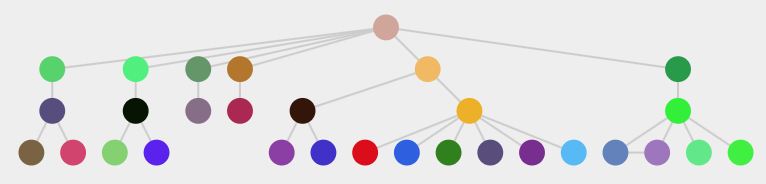

但以下情况效果不好：

* `同层`孩子节点较多，但是总层次不多的情况，会出现`矮胖图`，两侧的子节点和父节点形成`超长边`；这种问题尚无较好解决办法，`块布局`可能解决方案，但它实现方案复杂，而且容易出现边和第三方节点交叉的问题。

    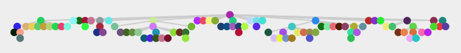

    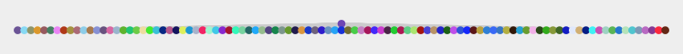

    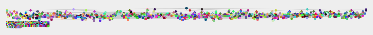

    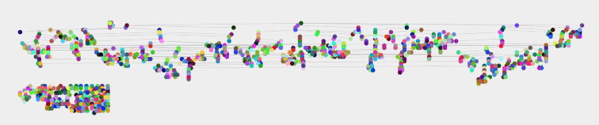

* `边数`大于`节点数`的图，展示也不清晰

    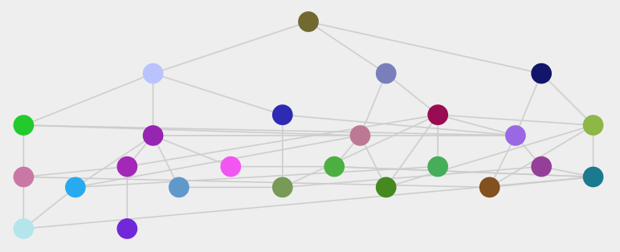

* 同层非相邻孩子节点间存在边的情况，容易出现连线穿过`第三个`节点的情况。不过这种问题也可以优化，调整节点顺序或者上下位置微调。

    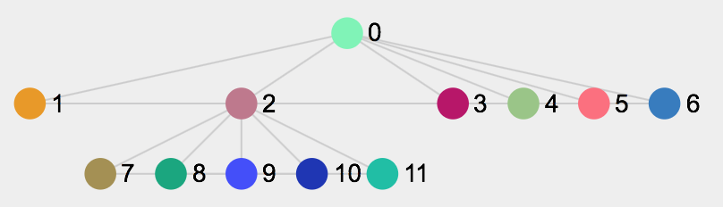

* `网状`布局图显示不直观[`右侧`为布局结果]：

    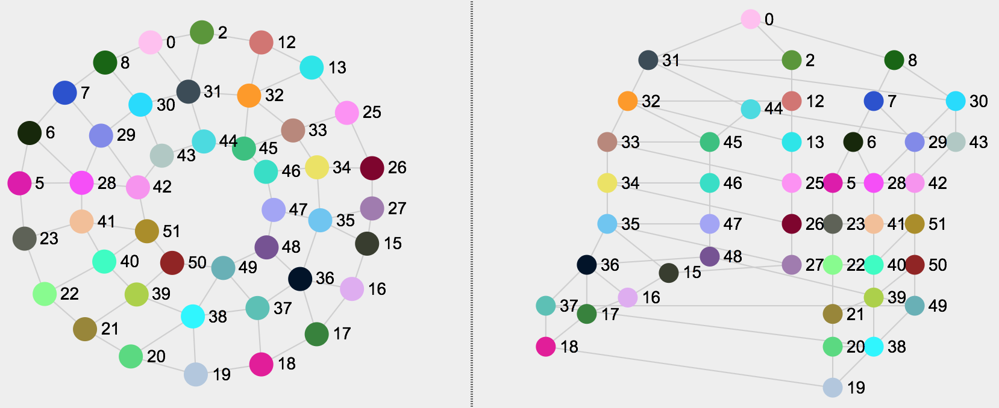

### 力导向布局

`力导向`能`均衡`边的长度，整体形成`簇`的布局。整体形成舒展的布局。
对于层次布局遇到的问题，`力导向`布局能有更好的展现。

孩子节点数很多的情况：

 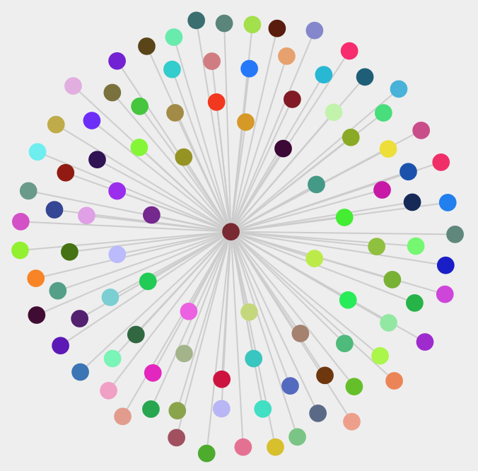

 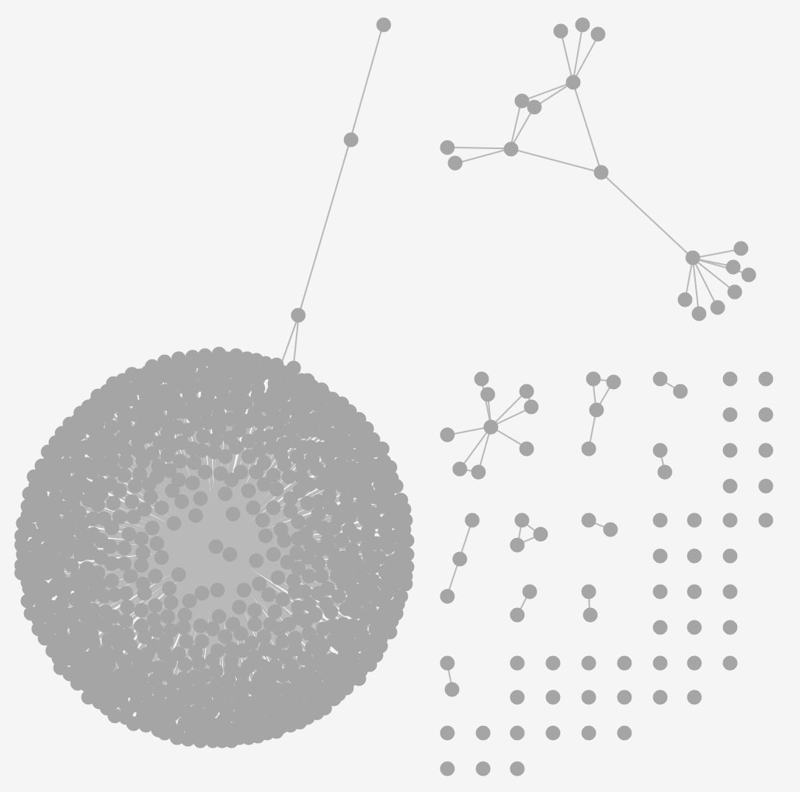

节点和边都很多的情况：

 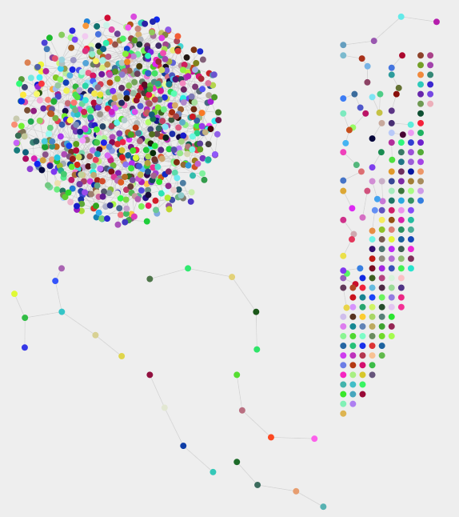

 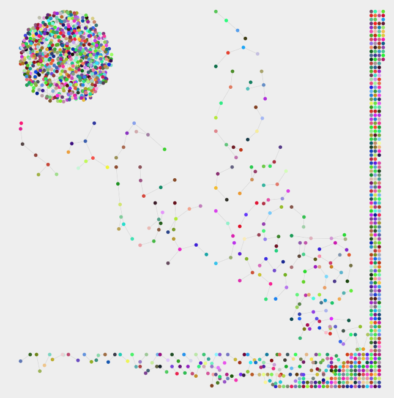

其他情况：

 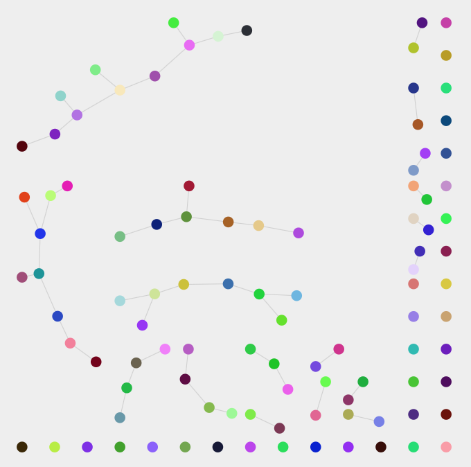

 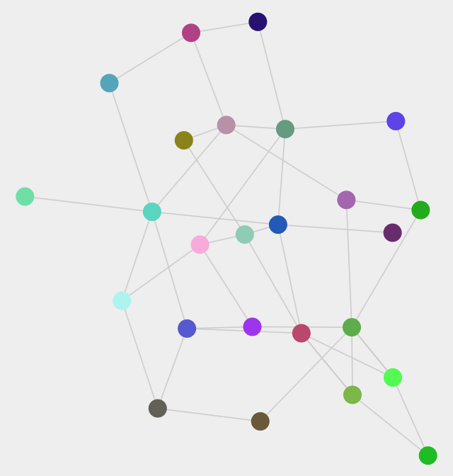

 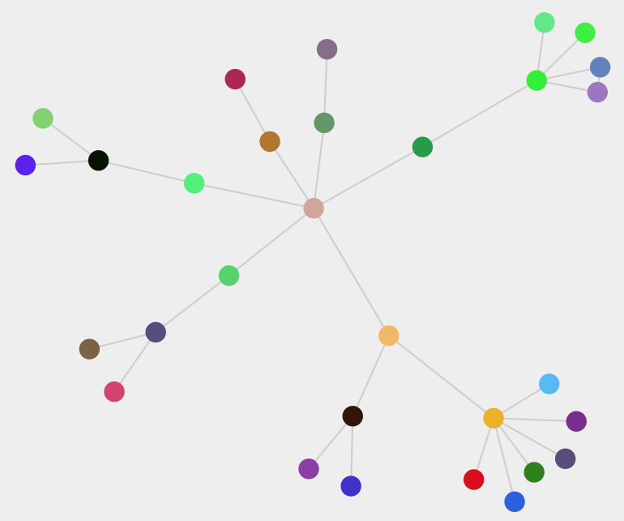

 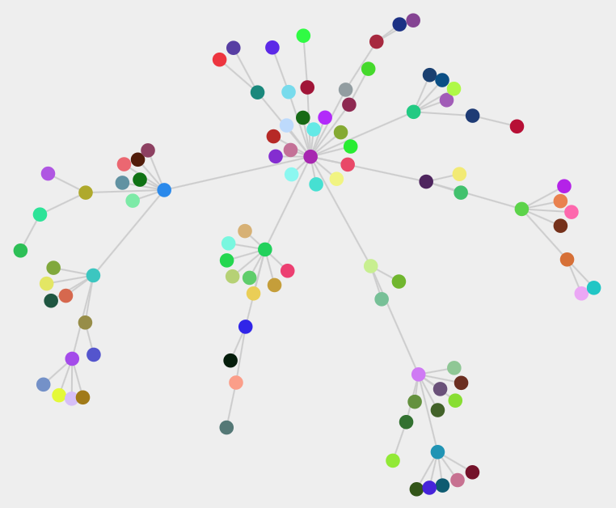

`劣势`为计算量较大。

也有一些情况效果不好：

* `孤立节点`与其他簇或节点会`不断远离`，形成的整体效果空间上不均衡，如下所示。这种问题可以通过辅以`grid空间均衡`算法解决。

    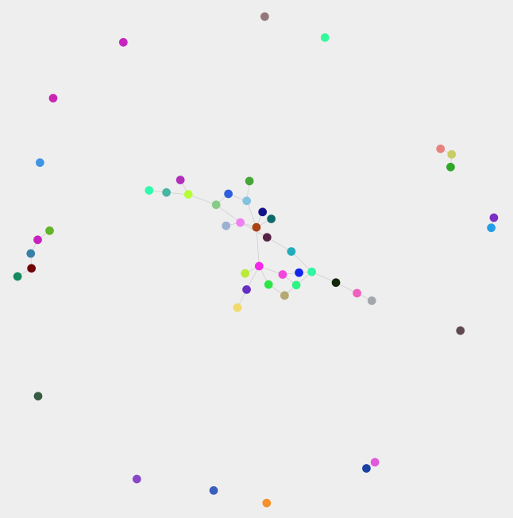

* 受`前置布局`影响很大。特别是当前置布局为`线性`布局时，力导向布局表现就很差。这时可以通过修改`前置`布局来避免。 
    1. 比较理想的`前置`布局是`矩阵`布局
    2. `环形`前置布局也不是理想前置布局，因为存在不少距离很远的边，需要较长`演化`时间来拉近
    3. `完全重合点`无法使用力导向布局进行分离，如果前置布局存在完全重合点，也需要重置前置布局

* 某些类型的复杂网络图，比如`双核`图。可能`层次布局 ＋ 手工`的效果更好

    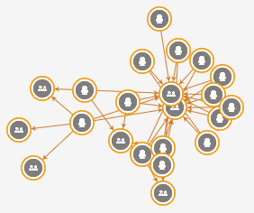
    
    双核图

    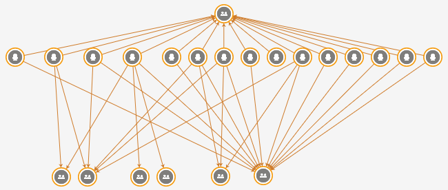

    层次布局 ＋ 手工

### 有普适布局吗？

目前而言，`没有`一种布局是`普适性`的。根据场景的不同，对同一图的展示要求也会不同。
以下展示某一网络图使用`层次`布局、`力导向`布局，以及基于层次布局的`手工`布局的比较。

 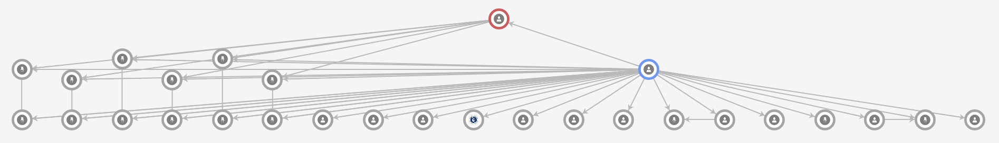

 层次布局效果。
 
 

 力导向布局效果。

 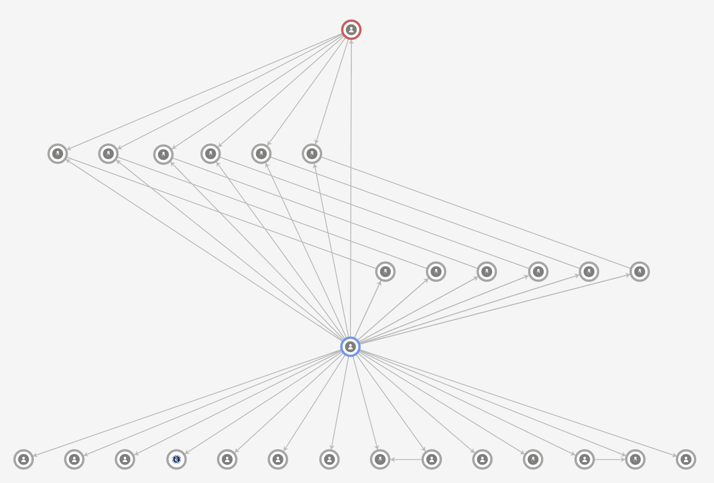

 基于层次布局的手工布局效果。

