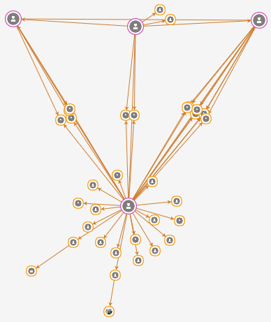
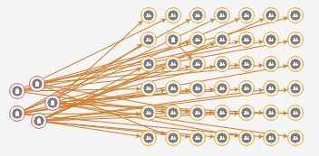
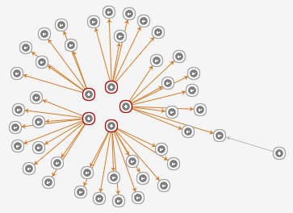

# graph layout 4

> 网络拓扑图布局算法研究4

> 要循序渐进！我走过的道路，就是一条循序渐进的道路。—— 华罗庚

## 就近布局

`layoutNearby()`：将`选中`节点排布到相邻节点`附近`，而`保持`非选中节点位置`不变`。

使用案例1，用于解`复杂多核`图。

使用案例2，多个核`环形`布局，其余节点`就近`布局。这实际上提供了`复合布局`的思路，可以`扩展`出多种类型的布局。
[todo]

由于就近布局同多边展开布局算法本质相同，所以可以用于`多边展开`布局的`调优`。

### 算法描述

1. 定义：`选中`节点集为`E`，`未选中`节点集为`N`
2. 若E为`空集`，`goto 5`
3. 若N为空集，相当于`全选`，则对全图进行`YifanHu`布局，`goto 5`
4. 若E和N均为`非空集`，则执行N固定的`YifanHu`布局，`goto 5`
5. 完成布局

使用的`YifanHu`布局，`不开启均衡`选项。

### 算法实现

> @param {object} [options]

    {
        filter: function( node ) { ... }
        , ...YifanHu Layout Options
    }

以下是代码实现：

    @[data-script="javascript"]sigma.prototype.layoutNearby
        = function( options ) {
        var me = this
            , opt = options || {}
            , selectedFilter = opt.filter || function( node ) {
                return node.selected;
            }
            , nonselectedFilter = function( node ) { 
                return !selectedFilter( node ); 
            }
            , selectedGraph = me.graph.getSubGraph( { filter: selectedFilter } )
            , nonselectedGraph = me.graph.getSubGraph( { filter: nonselectedFilter } )
            ;

        if ( selectedGraph.nodes.length == 0 ) {
            return me;
        }

        me.initializeLayout();
        nonselectedGraph.nodes.forEach( function( node ) {
            node.fixed = true;
        } );

        return me.layoutYifanHu( {
            skipInitialization: 1
            , skipPreLayoutCheck: opt.skipPreLayoutCheck || 0
            , optimalDistance: opt.optimalDistance || 500
            , readPrefix: opt.readPrefix || 'yfh_'
            , maxIterations: opt.maxIterations || 50
            , relativeStrength: 0.2
            , layoutBalanced: opt.layoutBalanced || 0
            , layoutBalancedSpace: opt.layoutBalancedSpace || 300
            , spaceGrid: opt.spaceGrid || { xSize: 50, ySize: 50 }  
        } );
    };

### 算法验证

    @[data-script="javascript editable"](function(){

        var s = fly.createShow('#test_nearbylayout');
        var g1 = getRandomGraph(200, 200, 1);
        // var g1 = networkGraph_circle_0628;
        // var g1 = networkGraph_FR;
        // var g1 = networkGraph_ForceAtlas2;
        // var g1 = networkGraph0520_allEdges;
        // var g1 = networkGraph_grid_0521; 
        // var g1 = networkGraph_tree_0521;
        // var g1 = networkGraph_2circles_0523;
        // var g1 = networkGraph_edges_between_the_same_level_nodes;
        // var g1 = networkGraph_edges_between_the_same_level_nodes_2;
        // var g1 = networkGraph_many_children_0526;
        // var g1 = networkGraph_grid_0612; 
        // var g1 = networkGraph_mesh_0628;
        // var g1 = networkGraph_person_event_event_person_0729;;
        // var g1 = networkGraph_person_event_event_person_0801;;
        var g1 = networkGraph_triangle_0801;;
        // var g1 = networkGraph_triangle_0801_2;;
        var containerId = 'test_nearbylayout_graph';
        var rendererSettings = {
                // captors settings
                doubleClickEnabled: true
                , mouseWheelEnabled: false

                // rescale settings
                , minEdgeSize: 0.5
                , maxEdgeSize: 1
                , minNodeSize: 1 
                , maxNodeSize: 5

                // renderer settings
                , edgeHoverColor: fly.randomColor() 
                , edgeHoverSizeRatio: 1
                , edgeHoverExtremities: true
                , drawLabels: false
            };
        var sigmaSettings = {
                // rescale settings 
                sideMargin: 10 

                // instance global settings
                , enableEdgeHovering: true
                , edgeHoverPrecision: 5
            };

        var sm;

        g1.nodes.forEach(function(node){
            node.color = '#aaa';
        });

        if((sm = isSigmaInstanceExisted(containerId))){
            sm.kill();
        };

        sm = getUniqueSigmaInstance(
                    containerId
                    , {
                        settings: sigmaSettings 
                        , graph: g1
                        , renderers: [
                            {
                                type: 'canvas' 
                                , container: containerId
                                , settings: rendererSettings
                            }
                        ]
                    }
                ); 

        sm.refresh();

        setTimeout(function(){
            var newData = createRawGraphData(
                    10
                    , sm.graph.nodes()
                )
                , newNodes = newData.nodes
                , newEdges = newData.edges
                ; 

            function getRandomSelectedNodes(){
                var _nodes = sm.graph.nodes()
                    , len = _nodes.length
                    , retNodes = []
                    ;

                _nodes.forEach(function(_node){
                    if(Math.random() > 0.8){
                        _node.color = '#e6550d';
                        retNodes.push(_node);
                    }
                });
                return retNodes;
            }

            sm.incLayoutGrid(
                newNodes
                , getRandomSelectedNodes()
                , {
                    space: 10
                }
            )
            ;

            newNodes.forEach(function(node){
                sm.graph.addNode(node);
            });

            newEdges.forEach(function(edge){
                sm.graph.addEdge(edge);
            });

            sm.refresh();

            setTimeout(function(){
                sigma.plugins.animate(
                    sm
                    , {
                        x: 'grid_x'
                        , y: 'grid_y'
                    }
                    , {
                        duration: 500
                        , onComplete: function(){
                            sm.layoutNearby( {
                                optimalDistance: 10
                                , layoutBalancedSpace: 10
                                , spaceGrid: { xSize: 40, ySize: 40 }
                                , filter: function( node ) {
                                    return node.newAdded;
                                }
                            } );
                            sigma.plugins.animate(
                                sm
                                , {
                                    x: 'yfh_x'
                                    , y: 'yfh_y'
                                }
                                , {
                                    duration: 500
                                }
                            );
                        }
                    }
                );
            }, 1000);

        }, 1000);

    })();

## 复合布局

综合使用多种布局，以达到更好的布局效果。

### 工具方法

以下提供一些方法，支持`复合`布局。

#### applyLayoutInstantly

`applyLayoutInstantly(options)`：立即应用新布局坐标。

    @[data-script="javascript"]sigma.utils.applyLayoutInstantly
        = function(nodes, options){
        var opt = options || {}
            , readPrefix = opt.readPrefix || ''
            , writePrefix = opt.writePrefix || ''
            , clearOld = opt.clearOld || 0
            ;

        if(!nodes || !nodes.length){
            return;
        }
        nodes.forEach(function(node){
            if(undefined !== node[readPrefix + 'x']){
                node[writePrefix + 'x'] = node[readPrefix + 'x'];
                node[writePrefix + 'y'] = node[readPrefix + 'y'];
                if(clearOld){
                    delete node[readPrefix + 'x'];
                    delete node[readPrefix + 'y'];
                }
            }
            else {
                node[writePrefix + 'x'] = node.x;
                node[writePrefix + 'y'] = node.y;
            }
        });
    };

    sigma.prototype.applyLayoutInstantly
        = function(options){
        sigma.utils.applyLayoutInstantly(
            this.graph.nodes()
            , options
        );
        return this;
    };

### 弧形＋就近布局

选中节点集合为`S`，与S相关的边集合为`E`。
记中心节点为`c`，与中心节点c相连的节点为`A`，其他节点为`M`。

#### 算法描述

1. 将`A`以`c`为中点进行`弧形`布局，支持90度、180度、270度、360度弧。
    弧形布局是`半径固定`、`单层`的簇布局。
2. 将`M`进行`就近`布局

#### 算法实现

    @[data-script="javascript"]sigma.prototype.layoutArcAndNearby
        = function( options ) {
        var me = this
            , opt = options || {}
            ;
    };

### 环形＋就近布局

1. `环形`布局能完美`避免边重叠`，`就近`布局通过引力原则将节点分布在相邻节点周边，形成`簇`。
2. 两者结合，将`高度数`节点使用足够大的半径进行`环形`布局，环形布局能避免边重叠，高度数节点间的关系能清晰表示
3. `低度数`节点使用`就近`布局，分布在高度数节点周边，形成簇。

两者结合的功能通过`一键整理`菜单提供给使用者，能快速梳理清晰网络图关系。

#### 算法描述

全图为`G(N, E)`，高度数节点集为`H`，低度数节点集为`L`。

1. 高度数节点集`H`选取：
    * 先选取度数大于2的节点，形成集合h
    * 若h元素个数大于10，则按度数从高到低选取前10个元素 

2. 计算环形布局半径`r`
3. 对高度数节点集H进行`环形`布局
4. 对低度数节点集L进行`就近`布局

### 簇布局

`簇布局`作为一种`人工`布局，完全模拟力导向布局的效果还是有点困难。但是可以作为力导向布局的`前置`布局。

将簇布局作为力导向布局的前置布局，目前实验结果`未显示`明显优化。

#### 算法描述

1. 获取布局`森林`
2. 针对森林中的每一棵树`tree`，进行深度遍历，遍历过程中对每个节点`node`的处理如下：
    * 如果不存在孩子节点，不作处理
    * 如果存在孩子节点，则以`node`为中心，将孩子节点进行`簇布局`；并对`非叶子`的孩子节点进行`延伸`

#### 算法实现

> @param {object} options

    {
        distanceCoefficient: 1.5
        , radiusStep: ...
        , randomRadius: ...
        , spaceGrid: ...
        , gridUnit: ...
    }

`簇布局算法`：

    @[data-script="javascript"]sigma.prototype.layoutCluster
        = function(options){
        var me = this;
        me.initializeLayout();

        var opt = options || {} 
            , distanceCoefficient = opt.distanceCoefficient || 1.5 
		    , spaceGrid = opt.spaceGrid || {xSize: 40, ySize: 40}	
            , gridUnit = opt.gridUnit || 10
            , forest = me.graph.getLayoutForest(opt)
            , edges = me.graph.edges()
            ;

        forest.forEach(function(tree){

            // temp
            tree.cluster_x = tree.x;
            tree.cluster_y = tree.y;

            depthTravel(tree);

            function depthTravel(node, angleInput){
                var children = node._wt_children
                    , len = children.length
                    , angleInput = angleInput || Math.PI * 3 / 2
                    , nonLeafChildren
                    , clusterConfig
                    , ai
                    , distance
                    , angleRange = opt.angleRange 
                        || _getAngleRange(len) 
                        || Math.PI / 2
                    ;

                clusterConfig = sigma.utils.clustersNodes(
                    children
                    , {
                        angleInput: angleInput
                        , root: node
                        , readPrefix: 'cluster_'
                        , writePrefix: 'cluster_'
                        , angleRange: angleRange 
                        , radiusStep: opt.radiusStep
                        , randomRadius: opt.randomRadius || 0
                        , centerFirst: 1
                    }
                );

                // children.forEach(function(child){
                //     console.log(child.cluster_x + ', ' + child.cluster_y);
                // });

                nonLeafChildren = _getNonLeafChildren(children);

                if(nonLeafChildren.length > 0){
                    nonLeafChildren.forEach(function(child){
                        distance = _getDistance(clusterConfig, child);
                        _stretchNode(child, node, distance);
                        ai = sigma.utils.getAngleInput(
                            node
                            , child
                            , {
                                readPrefix: 'cluster_'
                            }
                        );
                        depthTravel(child, ai);
                    }); 
                }
            }

        });

		sigma.utils.layoutTreesByGrid( 
			forest
			, {
				spaceGrid: spaceGrid
				, optimalDistance: gridUnit
				, readPrefix: 'cluster_'
			} 
		); 

        return me;

        function _getAngleRange(totalNum){
            var ret = 1;
            if(totalNum <= 2){
                ret = 0.5;
            }
            else if(totalNum <= 5){
                ret = 1;
            }
            else if(totalNum <= 8){
                ret = 1.5;
            }
            else {
                ret = 2;
            }
            return Math.PI * ret;
        }

        function _getDistance(clusterConfig, node){
            var c = clusterConfig
                , cl = c.clusterLevels
                , rs = c.radiusStep
                , distance
                , childrenCount = cl.numOfNodes
                , grandChildrenCount = node._wt_children.length
                , childrenRadius
                , grandChildrenRadius
                ;

            childrenRadius = rs * cl;
            if(c.randomRadius){
                childrenRadius += radiusStep;
            }
            grandChildrenRadius = _getRadius(grandChildrenCount, rs); 

            if( grandChildrenCount <= 1 ) {
                distance = childrenRadius;
            }
            else {
                distance = ( childrenRadius + grandChildrenRadius ) 
                    * distanceCoefficient;
            }

            return distance;
        }

        function _getRadius(nodesCount, radiusStep){
            var numOfFirstLevel = sigma.utils.getNumOfFirstClusterLevel(
                    nodesCount
                    , 15
                    , 1
                )
                , clusterLevels = sigma.utils.getClusterLevels(
                    numOfFirstLevel
                    , nodesCount
                ) 
                ;

            return radiusStep * clusterLevels;
        }

        function _stretchNode(node, fromNode, distance){
            var d = Math.sqrt(
                    Math.pow(node.cluster_x - fromNode.cluster_x, 2)
                    + Math.pow(node.cluster_y - fromNode.cluster_y, 2)
                )
                , scale = distance / d
                , newX, newY
                ;

            // do stretching
            newX = fromNode.cluster_x 
                + scale * ( node.cluster_x - fromNode.cluster_x );
            newY = fromNode.cluster_y 
                + scale * ( node.cluster_y - fromNode.cluster_y );

            node.cluster_x = newX;
            node.cluster_y = newY;
        }

        function _getNonLeafChildren(children){
            var ret = [];
            children.forEach(function(child){
                if(child._wt_children
                    && child._wt_children.length > 0){
                    ret.push(child);
                }
            });
            return ret;
        }

    };

#### 算法演示

    @[data-script="javascript editable"]
    (function(){

        var s = fly.createShow('#test_50');
        var g1 = getRandomGraph(20, 18, 8);
        // var g1 = getClusterGraph(20, {xMax: 200, yMax: 200, nodeSize: 10});
        // var g1 = networkGraph_edges_between_the_same_level_nodes_3;
        // var g1 = networkGraph_FR;
        // var g1 = networkGraph_ForceAtlas2;
        // var g1 = networkGraph0520_allEdges;
        // var g1 = networkGraph_grid_0521; 
        // var g1 = networkGraph_tree_0521;
        // var g1 = networkGraph_2circles_0523;
        // var g1 = networkGraph_edges_between_the_same_level_nodes;
        // var g1 = networkGraph_edges_between_the_same_level_nodes_2;
        // var g1 = networkGraph_many_children_0526;
        // var g1 = networkGraph_star_161017;;

        var g2 = {
                nodes: g1.nodes.slice()
                , edges: g1.edges.slice()
            }
            ;
        var containerId = 'test_50_graph';
        var rendererSettings = {
                // captors settings
                doubleClickEnabled: true
                , mouseWheelEnabled: false

                // rescale settings
                , minEdgeSize: 0.5
                , maxEdgeSize: 1
                , minNodeSize: 1 
                , maxNodeSize: 5

                // renderer settings
                , edgeHoverColor: fly.randomColor() 
                , edgeHoverSizeRatio: 1
                , edgeHoverExtremities: true
            };
        var sigmaSettings = {
                // rescale settings 
                sideMargin: 0.1 

                // instance global settings
                , enableEdgeHovering: true
                , edgeHoverPrecision: 5
                , autoRescale: 0
            };

        var sm1, sm2;

        if((sm1 = isSigmaInstanceExisted('test_50_left'))
            && (sm2 = isSigmaInstanceExisted('test_50_right'))){
            sm1.kill();
            sm2.kill();
        };

        sm1 = getUniqueSigmaInstance(
                    'test_50_left'
                    , {
                        settings: sigmaSettings 
                        , graph: g1
                        , renderers: [
                            {
                                type: 'canvas' 
                                , container: $('#' + containerId + ' .test-graph-left')[0]
                                , settings: rendererSettings
                            }
                        ]
                    }
                ); 

        sm2 = getUniqueSigmaInstance(
                    'test_50_right'
                    , {
                        settings: sigmaSettings 
                        , graph: g2
                        , renderers: [
                            {
                                type: 'canvas' 
                                , container: $('#' + containerId + ' .test-graph-right')[0]
                                , settings: rendererSettings
                            }
                        ]
                    }
                ); 

        sm1
            .normalizeSophonNodes()
            .alignCenter({rescaleToViewport: 1})
            .refresh()
            ;

        sigmaEnableNodeDrag( sm2 );

        sm2
            .normalizeSophonNodes()
            .alignCenter({rescaleToViewport:1})
            .refresh() // note: must invoke `refresh()` to update coordinates

            .layoutCluster({
                distanceCoefficient: 1.1
                , radiusStep: 50
                , randomRadius: 1
                , gridUnit: 50
            })
            .normalizeSophonNodes({
                readPrefix: 'cluster_'
            })
            .alignCenter({
                wholeView: 1
                , readPrefix: 'cluster_'
                , writePrefix: 'cluster_'
            })
            ;

        setTimeout(function(){
            sigma.plugins.animate(
                sm2
                , {
                    x: 'cluster_x'
                    , y: 'cluster_y'
                }
                , {
                    duration: 1000
                }
            );

        }, 500);

    })();

