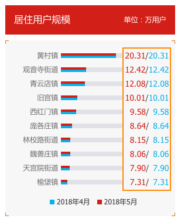

# histogram

> 直方图统计信息计算和渲染

todo

## 右侧文本特殊对齐

要求：比例条右侧对齐；文本右对齐；分隔符`/`竖直对齐

 

* `flex`布局，右侧数据字段可以根据内容自动扩展宽度
        .container {
            display: flex;
            flex-flow: row nowrap;
        }
        .left {
            flex: 0 0 80px;
        }
        .center {
            flex: 1 1;
        }
        .right {
            flex: 0 1 40px;
        }

* 动态计算文本宽度，使用`&ensp;`填充；文本父容器设置pre样式：

        .right {
            white-space: pre;
        }

* 填充字符使用`&ensp;`，如果不满足可以尝试`&emsp;`

