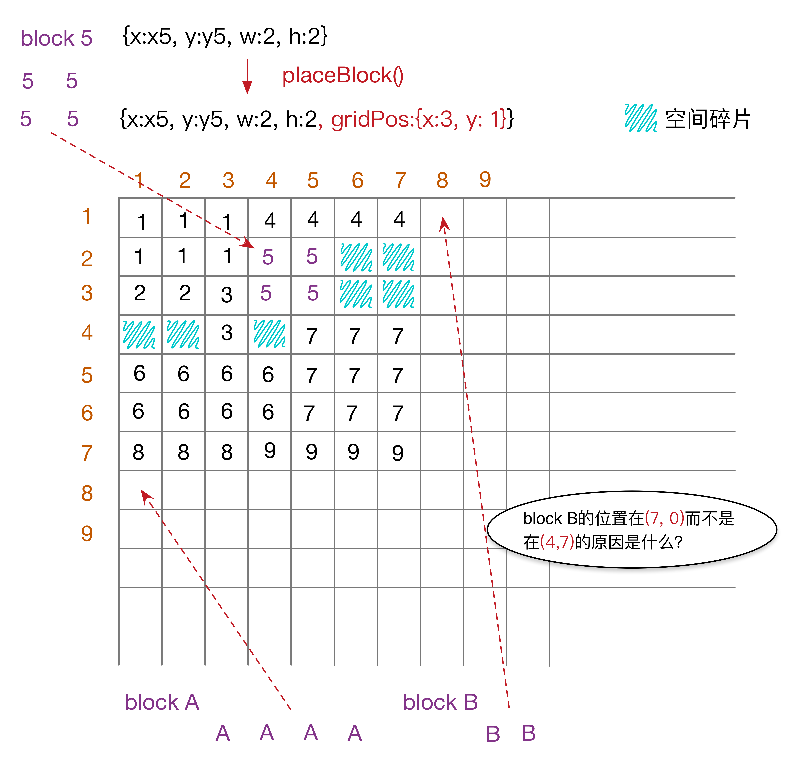

# layout grid

> 布局网格，实现用于管理空间均衡的网格算法

## 一、算法描述

### 1.1 特征

* 会形成`空间碎片`，优化空间碎片的一些方案，可以先将block按`面积`大小排序，再由大到小的顺序调用`placeBlock`

* block在放入网格之前，需要进行`标准化`，适合网格的`非负整数`表达方式

### 1.2 选择可用空间算法

1. 先获取现有空间占用的最小矩阵`rect`
2. 若`rect`的`右下角`未被占用，则从右下角开始寻找可用空间
3. 若`rect`的右下角已被占用，则将rect的尺寸进行`适当(会使用一些简单算法)`扩大，得到`新的``rect`，`goto 2`

## 二、算法实现

`Grid工具类`：

    @[data-script="javascript editable"](function(){

        function Grid(xSize, ySize){
            var me = this;

            me.xSize = xSize || 10;
            me.ySize = ySize || 10;
            me.grid = [];
            me.blockList = {};

            me.init();
        }

        var prototype = {

            init: function(){
                var me = this
                    , grid = me.grid
                    ; 

                for(var i=0; i<me.ySize; i++){
                    grid.push([]);
                    for(var j=0; j<me.xSize; j++){
                        grid[i].push(0);
                    }
                }
            }

            , getBlockRect: function(id){
                return this.blockList[id];
            }

            , getMinRect: function(){
                var me = this
                    , rect = null
                    , grid = me.grid
                    , i, j
                    , wMax = 0
                    , hMax = 0
                    ;
                
                for(i=0; i<me.ySize; i++){
                    for(j=0; j<me.xSize; j++){
                        if(grid[i][j]){
                            wMax = Math.max(j + 1, wMax);
                            hMax = Math.max(i + 1, hMax);
                        }
                    }
                } 

                if(wMax > 0 && hMax > 0){
                    rect = {
                        x: 0
                        , y: 0
                        , w: wMax
                        , h: hMax
                    }
                }

                return rect;
            }

            , getMaxSpareRect: function(minRect){
                var me = this
                    , grid = me.grid
                    , minRect = minRect || me.getMinRect()
                    , rect
                    , iStart, jStart
                    , i, j
                    , expandDirection
                    , xRatio, yRatio
                    ; 
               
                if(!minRect){
                    rect = {
                        x: 0 
                        , y: 0
                        , w: me.xSize
                        , h: me.ySize
                    };
                } 
                else {
                    jStart = minRect.x + minRect.w - 1;
                    iStart = minRect.y + minRect.h - 1;

                    xRatio = minRect.w / me.xSize;
                    yRatio = minRect.h / me.ySize;

                    if(xRatio < yRatio){
                        expandDirection = 'X';
                    }
                    else if(yRatio < xRatio){
                        expandDirection = 'Y';
                    }
                    else {
                        expandDirection = 'XY';
                    }

                    if(grid[iStart][jStart]){
                        if(iStart < me.ySize - 1 && expandDirection != 'X'){
                            iStart++;
                        }

                        if(jStart < me.xSize - 1 && expandDirection != 'Y'){
                            jStart++;
                        }

                        if(iStart == me.ySize - 1 && jStart == me.xSize - 1) {
                            rect = null;
                        }
                    }

                    var w
                        , h
                        , wMax = Infinity
                        , areas = [];
                   
                    h = 0;

                    for(i=iStart; i >= 0; i--){
                        h++;
                        w = 0;
                        for(j=jStart; j>=0; j--){
                            w++; 
                            if(grid[i][j]){
                                wMax = Math.min(w - 1, wMax);
                                areas.push({
                                    x: jStart - wMax + 1 
                                    , y: i 
                                    , w: wMax
                                    , h: h
                                    , area: wMax * h  
                                });
                                break;
                            }
                        }
                        if(j < 0){
                            wMax = Math.min(w, wMax);
                            areas.push({
                                x: 0
                                , y: i 
                                , w: wMax
                                , h: h
                                , area: wMax * h  
                            });
                        }
                    }

                    if(rect !== null){
                        areas.sort(function(a, b){
                            return b.area - a.area;
                        });
                        rect = areas[0];
                    }
                }
                
                return rect;
            }

            , placeBlock: function(id, block, debug){
                var me = this
                    , minRect = me.getMinRect()
                    , maxSpareRect
                    , pos = {x: 0, y: 0}
                    ;

                s.append_show('\nblock id: ' + id);
                s.append_show('min rect', minRect);
                if(!minRect){
                    pos.x = 0;
                    pos.y = 0;
                }
                else {
                    maxSpareRect = me.getMaxSpareRect(minRect);
                    s.append_show('max spare rect', maxSpareRect);
                    if(!maxSpareRect) {
                        pos.x = minRect.x + minRect.w;
                        pos.y = 0;
                    }
                    else {
                        pos.x = maxSpareRect.x;
                        pos.y = maxSpareRect.y;
                    }
                }
                s.append_show('pos', pos);
                
                me.addBlock(id, pos, block, debug); 
            } 

            , addBlock: function(id, pos, block, debug){
                var me = this
                    , grid = me.grid
                    ;

                for(var i=pos.y; i<pos.y + block.h && i<me.ySize; i++){
                    for(var j=pos.x; j<pos.x + block.w && j<me.xSize; j++){
                        if(!grid[i][j]){
                            grid[i][j] = debug ? id : 1;
                        }
                        else {
                            throw new Error('grid[' + i + '][' + j + '] is occupied!');
                        }
                    }
                }     
                block.gridPos = pos;
                me.blockList[id] = block; 
            }

        };

        function extend(dest, src){
            for(var i in src){
                dest[i] = src[i];
            }
        }

        extend(Grid.prototype, prototype);

        window.Grid = Grid;
    
    })();

## 三、算法验证 

以下验证`Grid类`及其相关方法：

    @[data-script="javascript editable"](function(){

        var s = fly.createShow('#test_10');
        window.s = s;
        var grid = new Grid(20, 7);
        var debug = 1;
        var blocks = [
            {id: 1, data: {w: 4, h: 3}}
            , {id: 2, data: {w: 2, h: 3}}
            , {id: 3, data: {w: 2, h: 2}}
            , {id: 4, data: {w: 2, h: 1}}
            , {id: 5, data: {w: 2, h: 2}}
            , {id: 6, data: {w: 1, h: 3}}
            , {id: 7, data: {w: 1, h: 3}}
            , {id: 8, data: {w: 1, h: 3}}
            , {id: 9, data: {w: 1, h: 3}}
            , {id: 'A', data: {w: 2, h: 3}}
            , {id: 'B', data: {w: 4, h: 3}}
            , {id: 'C', data: {w: 3, h: 2}}
            , {id: 'D', data: {w: 3, h: 2}}
            , {id: 'E', data: {w: 3, h: 2}}
        ];
        s.show('start place block:');
        blocks.forEach(function(block){
            grid.placeBlock(block.id, block.data, debug);
        });
        s.append_show('\ngrid occupied states:');
        s.append_show(
            grid.grid.map(function(row){
                return row.join('  ');
            })
            .join('\n')
        );

    })();

> 勤勉而顽强地钻研，永远可以使你百尺竿头更进一步。—— 德国心理学家 舒曼

