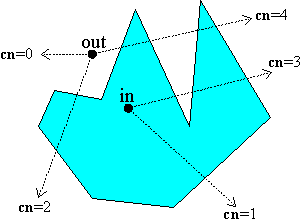
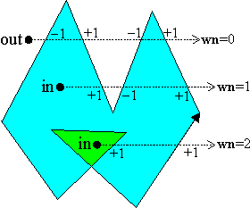
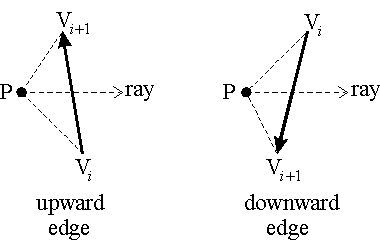
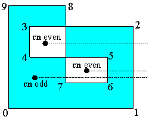
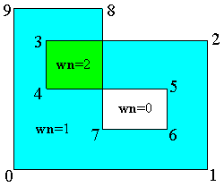

# point-in-polygon

## Algorithm

### 交叉数法( CN )

> `思路`：内部点发出的射线与多边形的交点总是奇数；外部点发出射线与多边形的交点总是偶数。

 

* 计算测试点的y坐标所在扫描行与多边形边的交点个数，扫描行穿过顶点，认为该顶点在扫描行上方
* 如果在测试点左右两边的交点个数都为奇数，则测试点在多边形内
* 否则测试点在多边形外

### 绕数法( WN )

> `思路`：多边形对内部点的绕数不为0；对外部点的绕数总为0。

 

* 找一条以测试点为起点的水平射线
* 以水平射线作为辅助（如下图所示），计算每条边对测试点的绕数的总和

     

* 若绕数总和为0，则为外部测试点；否则为内部测试点

### 比较

* 对于`简单多边形`（无自交叉），两者判断结果一致
* 对于`复杂多边形`（有自交叉），两者的判断结果可能不一致，WN返回的结果更加直观

    
    

* `zrender`使用了WN方法（<ref://../graphics/zrender-insights.md.html>）

## Resources

* `计算几何算法3. 包含于多边形内的点的快速绕数` <http://www.everyinch.net/index.php/computergeometry3/>
* 点在多边形内算法 —— 判断一个点是否在一个复杂多边形的内部 <http://blog.csdn.net/hjh2005/article/details/9246967>
* 判断点在多边形内的多种写法 <http://blog.csdn.net/hgl868/article/details/7947272>

