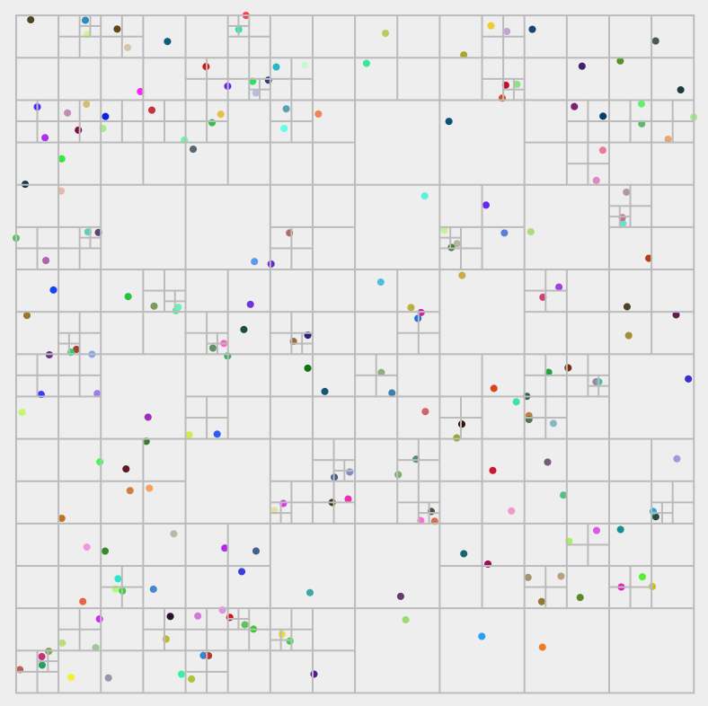
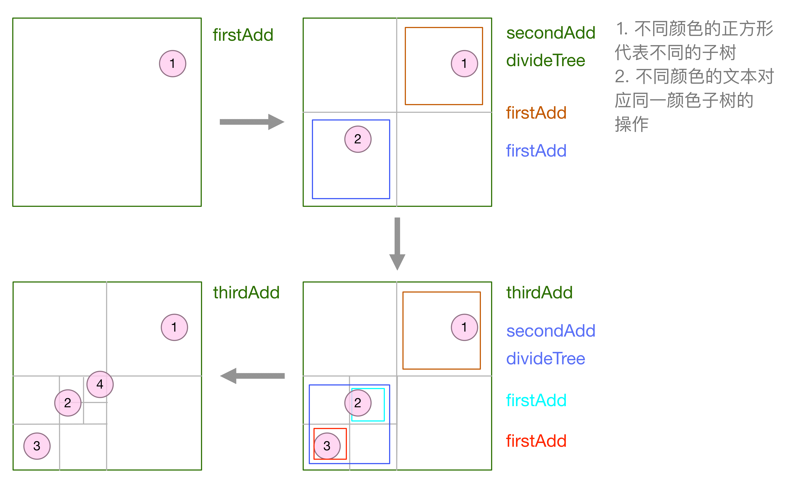
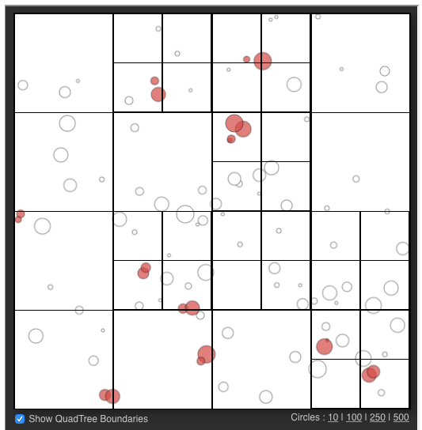
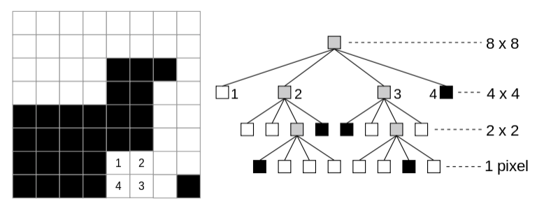

# quadtree

> A `QuadTree` is a data structure in which the coordinate space is broken up into `regions / nodes` that contain items. If `too many items` are added into a node, then that node is `divided into` `4 sub-nodes`. This can provide very `fast lookup` of items based on the coordinates and coordinates and dimensions.

> 结构之法，算法之道。多一种数据结构就多一种解决问题的方法，多一种方法就多一种思维模式。

## Features

* 一种基于`空间索引`的数据结构
* 利用将`空间`进行`四等分`的思想，对一组空间对象建立`空间索引`。
* 在需要的时候能`快速`找出与给定空间参数相关的对象集合。`避免`总是进行全局查找带来的性能`消耗`。

## Resources

`keywords`：`quadtree`(四叉树), `octree`(八叉树，用于3D): 3D quadtree

* `wikipedia`: <https://en.wikipedia.org/wiki/Quadtree>
* Quick Tip: Use Quadtrees to Detect Likely Collisions in 2D Space: <http://gamedevelopment.tutsplus.com/tutorials/quick-tip-use-quadtrees-to-detect-likely-collisions-in-2d-space--gamedev-374>
* js quadtree: <https://github.com/timohausmann/quadtree-js/>
* javascript quadtree implementation: <http://www.mikechambers.com/blog/2011/03/21/javascript-quadtree-implementation/>
* Python quadtree: <https://github.com/fogleman/Quads>
* quadtree web demos: <https://www.michaelfogleman.com/static/quads/>
* HT for Web可视化QuadTree四叉树碰撞检测：<http://my.oschina.net/xhload3d/blog/353020>
* `四叉树与八叉树`：<http://blog.csdn.net/zhanxinhang/article/details/6706217>

## BarnesHut quadtree

### 算法描述

1. 节点总是添加到`叶子型`子树
2. 除了最底层子树，四叉树的划分能确保每一个子树包含`至多`一个节点
3. 每棵子树封装了整棵子树的`总质量(mass)`以及`重心(centerMass)`，极大方便了`超级节点(supernode)`的查找
4. 以所有节点所在的最小矩形范围的较大边，作为`正方形`空间区域的边
5. 子树`分裂`是一个`按需`进行的过程

以下是一个`Barnes-Hut`四叉树：
 
 

节点`插入`生成`四叉树`的过程：

 

### 算法实现

子树的`三个`阶段：

1. `创建`阶段：此时添加新节点，使用`firstAdd`，只是将节点`暂存`在当前子树中
2. 添加过`一次`节点：此时添加新节点使用`secondAdd`，将会进行`子树分裂`，先将`暂存`的节点添加到下级子树中，再将要添加的节点存入下级子树。
3. 添加过`两次`及`两次以上`节点：使用`thirdAdd`，将节点添加到子节点中

    @[data-script="javascript editable"](function(){

        var _id = 1;

        function quadTree(topX, topY, size, maxLevel, options){
            var me = this;

            me.topX = topX;
            me.topY = topY;
            me.size = size;
            me.maxLevel = maxLevel;
            me.opt = options || {};
            me.prefix = me.opt.readPrefix 
                || me.opt.writePrefix || '';

            me.isLeaf = true;
            me.mass = 0;

            me._id = _id++;
            me._addStatus = 0;
        }

        quadTree.prototype.addNode = function(node){
            var me = this
                , prefix = me.prefix
                , addStatus
                ;

            if(me.topX > node[prefix + 'x'] || node[prefix + 'x'] > me.topX + me.size
                || me.topY > node[prefix + 'y'] || node[prefix + 'y'] > me.topY + me.size){
                return false;
            }

            addStatus = ++me._addStatus;
            // console.log('addNode: addStatus ' + addStatus + ', id: ' + me._id);
            switch( addStatus ) {
                case 1:
                    return me.firstAdd(node);
                case 2:
                    return me.secondAdd(node);
                default:
                    return me.thirdAdd(node);
            }
        };

        // When first add, there is no division.
        quadTree.prototype.firstAdd = function(node){
            var me = this
                , prefix = me.prefix
                ;
            me.mass = 1;
            me[prefix + 'x'] = me.centerMassX = node[prefix + 'x'];
            me[prefix + 'y'] = me.centerMassY = node[prefix + 'y'];

            // console.log('firstAdd: addStatus ' + me._addStatus + ', id: ' + me._id);

            return true;
        };

        quadTree.prototype.secondAdd = function(node){
            var me = this
                ;

            // console.log('secondAdd: addStatus ' + me._addStatus + ', id: ' + me._id);

            if(0 == me.maxLevel) {
                return me.leafAdd(node);
            }
            else {
                me.divideTree();

                // This quadTree also represents a node, add it to a child accordingly
                me.addToChildren(me);

                return me.rootAdd(node);
            }
        };

        quadTree.prototype.thirdAdd = function(node){
            var me = this
                ;

            // console.log('thirdAdd: maxLevel ' + me.maxLevel + ' , id: ' + me._id);

            if(0 == me.maxLevel) {
                return me.leafAdd(node);
            }
            else {
                return me.rootAdd(node);
            }
        };

        quadTree.prototype.rootAdd = function(node){
            var me = this
                ;

            // console.log('rootAdd: addStatus ' + me._addStatus + ', id: ' + me._id);

            me.assimilateNode(node);
            return me.addToChildren(node);
        };

        quadTree.prototype.leafAdd = function(node){
            var me = this
                ;

            // console.log('leafAdd: addStatus ' + me._addStatus + ', id: ' + me._id);

            me.assimilateNode(node);
            return true;
        };

        quadTree.prototype.assimilateNode = function(node){
            var me = this
                , prefix = me.prefix
                ;
            me[prefix + 'x'] = me.centerMassX 
                = (me.mass * me.centerMassX + node[prefix + 'x']) / (me.mass + 1);
            me[prefix + 'y'] = me.centerMassY 
                = (me.mass * me.centerMassY + node[prefix + 'y']) / (me.mass + 1);
            me.mass++;
        };

        quadTree.prototype.divideTree = function(){
            var me = this
                , _size = me.size
                , _childSize = _size / 2
                , _children
                , _topX = me.topX
                , _topY = me.topY
                , _maxLevel = me.maxLevel - 1
                , _top = [
                    [ _topX + _childSize  , _topY + _childSize ]
                    , [ _topX             , _topY + _childSize ]
                    , [ _topX             , _topY              ]
                    , [ _topX + _childSize, _topY              ]
                ]
                , i
                ;

            _children = me.children = [];
            for(i=0; i<_top.length; i++){
                _children.push(
                    new quadTree(
                        _top[i][0]
                        , _top[i][1]
                        , _childSize
                        , _maxLevel
                        , me.opt
                    )
                );
            }
            me.isLeaf = false;

            if('function' == typeof me.opt.ondivision){
                me.opt.ondivision(_topX, _topY, _size);
            }
        };

        quadTree.prototype.addToChildren = function(node){
            var me = this, i;

            for(i=0; i<me.children.length; i++){
                if(me.children[i].addNode(node)){
                    return true;
                }
            }

            return false;
        };

        function buildBHQuadTree(graph, maxLevel, options){
            var nodes = graph.nodes || [] 
                , opt = options || {}
                , prefix = opt.readPrefix || opt.writePrefix || ''
                , xMin = Infinity
                , yMin = Infinity
                , xMax = -Infinity
                , yMax = -Infinity
                , size
                , tree
                ;

            _id = 1;

            nodes.forEach(function(node){
                xMin = Math.min(xMin, node[prefix + 'x']);
                yMin = Math.min(yMin, node[prefix + 'y']);
                xMax = Math.max(xMax, node[prefix + 'x']);
                yMax = Math.max(yMax, node[prefix + 'y']);
            });

            size = Math.max(yMax - yMin, xMax - xMin);
            tree = new quadTree(xMin, yMin, size, maxLevel, options); 

            nodes.forEach(function(node){
                tree.addNode(node);
            });

            return tree;
        }

        window.buildBHQuadTree = buildBHQuadTree;;

    })();

### 算法验证

以下验证的可视区展示了节点组成的盘面被`切割`的过程。

并不是展示根据节点的插入，四叉树`生成`的过程。

<svg width="100%" height="400"></svg>

    @[data-script="javascript editable"](function(){

        var s = fly.createShow('#test_110');
        var svg = d3.select('#test_110 svg')
            , sel
            , graph = getRandomGraph(200, 0, 5)
            // , graph = getLineGraph(30, 0, {xMax: 1, yOffset: 0.1, nodeSize: 3})
            // , graph = getLineGraph(30, 0, {yMax: 1, vertical: 1,  nodeSize: 3})
            , width = parseInt(d3.select('#test_110').style('width'))
            , height = 380
            , xOffset = (width - height) / 2
            , paths = []
            , isFirstDivision = 1
            , textArr
            , tree
            , maxQuadTreeLevel = 5
            , tmpMaxLevel
            , showNodeLabels = 0
            , showNodeCoords = 0
            , showTreeMassCenter = 0
            , showTreeMass = 0
            ;

        s.show('building Barnes-Hut quadtree');

        graph.nodes.forEach(function(node){
            node.x *= height;
            node.x += xOffset;
            node.y *= height;
            node.y += 10;
        });

        // circle
        function showCircle(sel){
            sel.attr('r', function(d){return d.size;})
                .attr('cx', function(d){return d.x;})
                .attr('cy', function(d){return d.y;})
                .style('fill', function(d){return d.color;})
                ;
        }

        sel = svg.selectAll('circle')
            .data(graph.nodes)
            ;
        showCircle(sel);

        sel.enter()
            .append('circle')
            ;
        showCircle(sel);
        
        sel.exit().remove();

        // text
        function showText(sel){
            sel.attr('x', function(d){return d.x + d.size;})
                .attr('y', function(d){return d.y + 6;})
                .text(function(d){
                    return ( showNodeLabels ? d.label : '' )
                        + ( 
                            showNodeCoords 
                            ? (
                                '[' + Math.floor(d.x)
                                + ',' + Math.floor(d.y) 
                                + ']'
                            ) 
                            : ''
                        )
                        ; 
                })
                .style({
                    fill: function(d){return d.color;}
                    , 'font-size': '12px'
                })
                ;
        }

        sel = svg.selectAll('text')
            .data(graph.nodes)
            ;
        showText(sel);

        sel.enter()
            .append('text')
            ;
        showText(sel);

        sel.exit().remove();

        // build tree
        tree = buildBHQuadTree(
            graph
            , maxQuadTreeLevel
            , {
                ondivision: function(topX, topY, size){
                    // s.append_show(topX, topY, size)
                    var line = d3.svg.line()
                        ;

                    if(isFirstDivision){
                        paths.push(
                            line([
                                [topX, topY]
                                , [topX, topY + size]
                                , [topX + size, topY + size]
                                , [topX + size, topY]
                            ]) 
                            + 'Z'
                        );
                        isFirstDivision = 0;
                    }

                    paths.push(
                        line([
                            [topX, topY + size / 2]
                            , [topX + size, topY + size / 2]
                        ])
                    );
                    paths.push(
                        line([
                            [topX + size / 2, topY]
                            , [topX + size / 2, topY + size]
                        ])
                    );

                }
            }
        );

        // random graph data
        function getRandomGraph(numOfNodes, numOfEdges, fixSize){

            var i
                , s
                , N = numOfNodes
                , E = numOfEdges
                , g = { nodes: [], edges: [] }
                ;

            for(i=0; i<N; i++){
                g.nodes.push({
                    id: 'n' + i
                    , label: '' + i
                    , x: Math.random()
                    , y: Math.random()
                    , size: fixSize || Math.random()
                    , color: fly.randomColor() 
                });
            }

            for(i=0; i<E; i++){
                var edge = {
                    id: 'e' + i
                    , source: 'n' + (Math.random() * N | 0) 
                    , target: 'n' + (Math.random() * N | 0) 
                    , size: fixSize ? 1 : 1 * Math.random()
                    , label: 'e' + i
                    // , type: 'curve'
                    // , color: fly.randomColor() 
                    , color: '#ccc'
                    , hover_color: '#f00'
                };

                if(edgeExists(edge)){
                    continue;
                }
                else {
                    g.edges.push(edge);
                }

            }

            function edgeExists(edge){
                for(var i=0; i<g.edges.length; i++){
                    if(g.edges[i].source == edge.source
                        && g.edges[i].target == edge.target) {
                        return true;
                    }
                }
                return false;
            }

            return g;
        }

        // show divisions
        function showDivisions(index){
            var sel
                , step = isFirstDivision ? 3 : 2
                , data = paths.slice(0, index + step )
                ;

            sel = svg.selectAll('path')
                .data(data)
                .attr('d', function(d){return d;})
                ;

            sel.enter()
                .append('path')
                .attr('d', function(d){return d;})
                .style({
                    'fill': 'transparent'
                    , 'stroke': '#bbb'
                    , 'stroke-width': '1'
                })
                ;

            sel.exit()
                .remove()
                ;

            if(index + step + 1 < paths.length){
                setTimeout(function(){
                        showDivisions(index + step );
                }, 200);
            }
            isFirstDivision = 0;
        }

        isFirstDivision = 1;

        // clear path to prevent display of old paths before display of new paths
        svg.selectAll('path').remove();
        setTimeout(function(){
            showDivisions(0);
        }, 1000);

        // traverse quadTree
        function traverse(tree, options){

            var opt = options || {}
                ;
            
            if('function' == typeof opt.onvisit){
                opt.onvisit(tree);
            }

            if(tree.isLeaf){
                return;
            }

            tree.children.forEach(function(child){
                traverse(child, options);
            });
        }

        textArr = graph.nodes;
        tmpMaxLevel = tree.maxLevel;
        traverse(tree, {
            onvisit: function(_tree){
                var sel;

                if(showTreeMassCenter){
                    textArr = textArr.concat([_tree]);

                    // update
                    sel = svg.selectAll('text')
                        .data(textArr)
                        ;

                    // append
                    sel.enter()
                        .append('text')
                        .attr('x', function(d){return d.topX;})
                        .attr('y', function(d){
                            return d.topY + 14
                                + ( tmpMaxLevel - d.maxLevel ) * 14;
                        })
                        .text(function(d){
                            return d._id + '[' 
                                + Math.floor( d.centerMassX || 0 )  + ',' 
                                + Math.floor( d.centerMassY || 0 )  + ']' 
                                ;
                        })
                        .style({
                            'font-size': '12px'
                            , 'fill': 'red'
                            , 'stroke-width': '1'
                        })
                        ;

                    sel.exit().remove();
                }

                if(showTreeMass){
                    s.append_show('tree ' + _tree._id, 'mass ' + _tree.mass);
                }
            }
        });

    })();

## Sigmajs quadTree

### 原理解析

以边四叉树为例，将边转换成矩形（`axis-aligned对象`），构建一个四叉树。在点与边的碰撞过程中，可以先从
四叉树中`快速`选出可能发生碰撞的边集合，而这些边是否真正与点发生碰撞，则交由调用者提供`自定义`函数来
判断。

`两点`思想：

1. `粗粒度`构建四叉树，也就是所谓的转换成矩形来构建四叉树
2. `自定义`碰撞函数

### github代码

* <https://github.com/jacomyal/sigma.js/blob/master/src/classes/sigma.classes.quad.js>
* <https://github.com/jacomyal/sigma.js/blob/master/src/classes/sigma.classes.edgequad.js>
* <https://github.com/jacomyal/sigma.js/blob/master/src/sigma.core.js#L479>

## 碰撞检测

todo: 碰撞应用 ＋ 碰撞检测

quadtree-js: <https://github.com/timohausmann/quadtree-js/>

## 应用

1. 图布局：BarnesHut quadtree

2. 碰撞检测

    
    
3. 图片存储

    

## 箴言附送

> 递归算法的一行不起眼的代码，可能包含极大的`信息量`。这是其难懂的地方，也是魅力所在。

> 需要注意`属性`及其`同名函数`的区别，`for`与`forEach`的区别。

