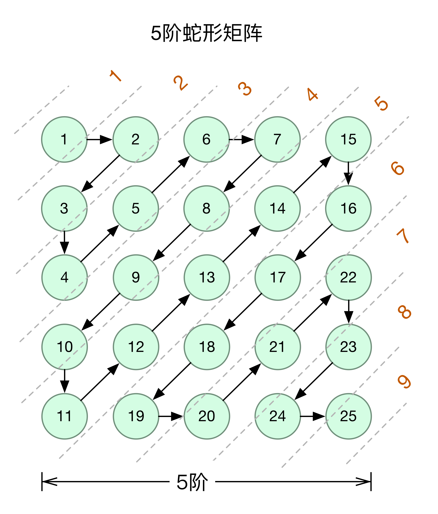
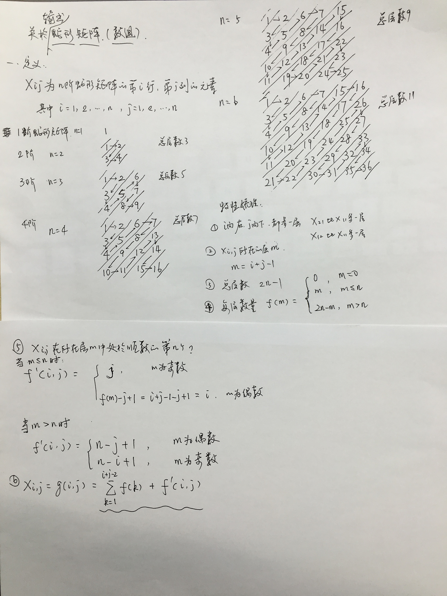

# serpentine matrix

> 蛇形矩阵

## 一、初识

### 1.1 概貌

S形增长的自然数，是一个方矩阵。如下图为5阶蛇形矩阵：

### 1.2 定义和特征

`n阶`蛇形矩阵`x(i, j)`, i=1..n, j=1..n

`特征`：

1. i向右增长或者j向下增长，层数都多1 
2. x(i, j)所在层m，则：

        m = i + j - 1

3. n阶蛇形矩阵的总层数为： `2n - 1`
4. 第m层的项数f(m)：

        f(m) = 0,       m = 0
             = m,       m <= n
             = 2n - m,  m > n

5. x(i, j)在所在层m中处于顺数的第几位？

    当m <= n：

        h(i, j) = j,                                    m为奇数
                = f(m) - j + 1 = i + j - 1 -j + 1 = i,  m为偶数

    当m > n： 

        h(i, j) = n - j + 1,                            m为偶数
                = n - i + 1,                            m为奇数 

6. x(i, j)对应的值：

        x(i, j) = f(1) + f(2) + ... + f(i + j - 2) + h(i, j)
    
具体还可以查看附录手稿。

`6阶`蛇形矩阵如下所示

    1  2  6  7  15 16
    3  5  8  14 17 26
    4  9  13 18 25 27
    10 12 19 24 28 33
    11 20 23 29 32 34
    21 22 30 31 35 36

## 二、serpentineMatrix(level)

生成serpentine matrix的js实现：

    @[data-script="javascript"]function serpentineMatrix(level, callbacks){

        var n = level || 4
            , i
            , j
            , value
            , m
            , k
            , countInLastLayer
            , countInCurrentLayer
            , indexInCurrentLayer
            , countInLayers = {}
            , line = []
            , matrix = []
            , callbacks = callbacks || {}
            ;

        function getCountInLayer(layer, level) {
            if(layer == 0) return 0;
            else if(layer <= level) return layer;
            else return 2 * level - layer;
        }

        for(i=1; i<=n; i++){
            line.length = 0;
            for(j=1; j<=n; j++){
                m = i + j - 1;
                if(typeof countInLayers[m - 1] == 'undefined') {
                    countInLastLayer = getCountInLayer(m - 1, n);
                    if(m - 1 > 0) {
                        countInLayers[m - 1] = countInLastLayer + countInLayers[m - 2]; 
                    }
                    else {
                        countInLayers[m - 1] = 0;
                    }
                } 
                countInCurrentLayer = getCountInLayer(m, n); 
                if(m <= n){
                    if(countInCurrentLayer % 2 == 0){
                        indexInCurrentLayer = i;
                    }
                    else {
                        indexInCurrentLayer = j;
                    }
                }
                else {
                    if(countInCurrentLayer % 2 == 0){
                        indexInCurrentLayer = n - j + 1;
                    }
                    else {
                        indexInCurrentLayer = n - i + 1;
                    }
                }
                value = countInLayers[m - 1] + indexInCurrentLayer;
                line.push(value);
                if(callbacks.onitemcreated){
                    callbacks.onitemcreated(value, i, j);
                }
            }

            if(callbacks.onlinecreated){
                callbacks.onlinecreated(line);
            }
            matrix.push(line.slice(0));
        }

        return matrix;
    }

## 三、生成蛇形矩阵

    
    @[data-script="javascript editable"](function(){

        var s = fly.createShow('#test_10')
            , level = 5
            ;

        s.show('serpentine matrix ' + level + ':');

        var matrix = serpentineMatrix(
            level
            , {
                onlinecreated: function(line){
                    s.append_show(line);
                }
            }
        );

    })();

## 四、绘制过程演示

以下展示使用`sigma.js`动态绘制的过程。

    @[data-script="javascript editable"](function(){

        var s = fly.createShow('#test_20');

        var graph = {}
            , level = 5
            , fps = 10
            , sm = getUniqueSigmaInstance(
                'test_20'
                , {
                    settings: {
                        sideMargin: 1
                        , mouseWheelEnabled: false
                    }
                    , renderers: [
                        {
                            type: 'canvas'
                            , container: 'test_20_graph'
                        }
                    ]
                }
            )
            , matrix = serpentineMatrix(level)
            ;

        graph.nodes = [];
        graph.edges = [];

        function findNode(value) {
            for(var i=0; i<level; i++){
                for(var j=0; j<level; j++){
                    if(matrix[i][j] == value){
                        return {
                            x: j
                            , y: i
                        };
                    }
                }
            }
            return null;
        }

        var current = 1;
        s.show('painting ...');
        function render(){
            var index = null;
            if(current <= level * level){
                index = findNode(current);
                if(index) {
                    graph.nodes.push({
                        id: 'n_' + index.x + '_' + index.y 
                        , x: index.x
                        , y: index.y
                        , size: 1
                        , label: current + ''
                        , color: fly.randomColor() 
                    });
                    if(graph.nodes.length > 1){
                        var lastNode = graph.nodes[graph.nodes.length - 2];
                        graph.edges.push({
                            id: 'e_' + lastNode.x + '_' + lastNode.y 
                                + '_' + index.x + '_' + index.y
                            , source: 'n_' + lastNode.x + '_' + lastNode.y
                            , target: 'n_' + index.x + '_' + index.y
                            , color: '#ccc' 
                        });
                    }
                    sm.graph
                        .clear()
                        .read(graph)
                        ;

                    sm.refresh();
                    current++;
                    setTimeout(render, 1000 / fps);
                }
            }
        }

        render();

    })();

## 五、附：算法推演过程

