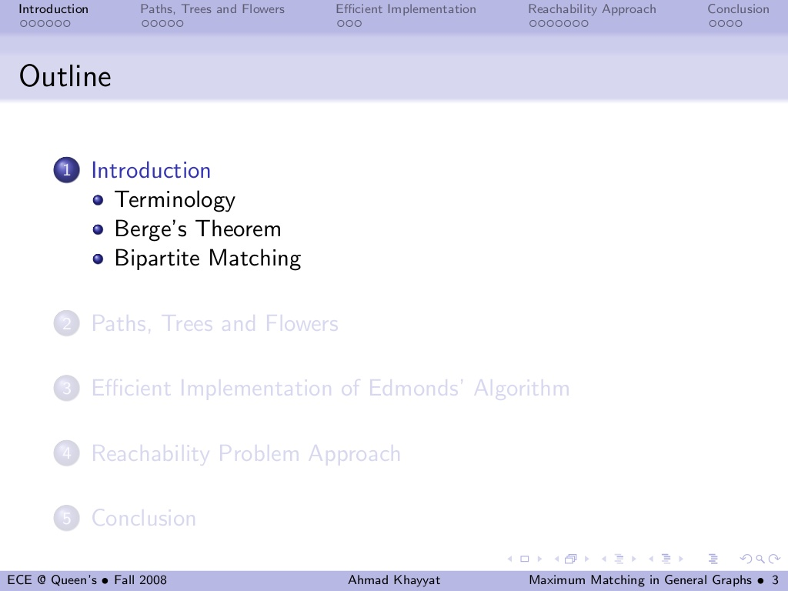
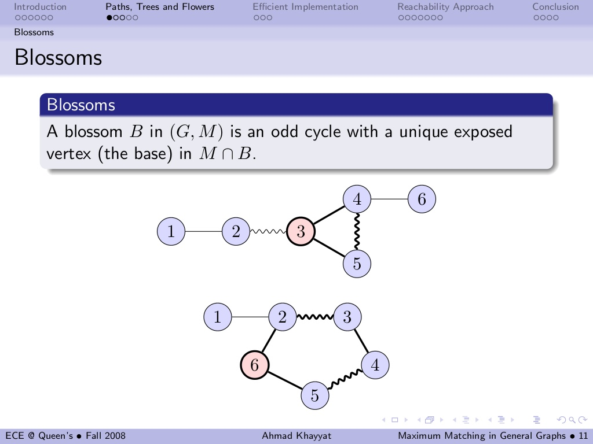
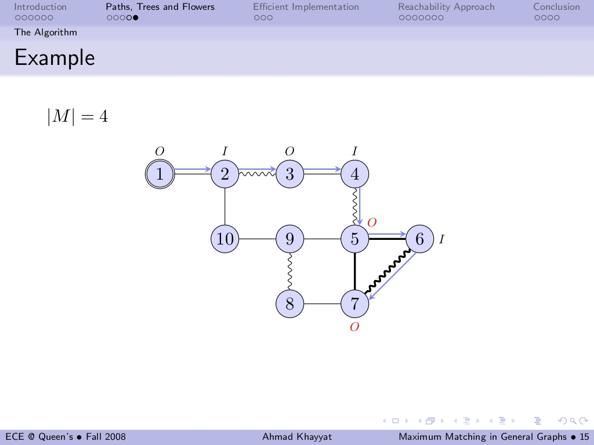
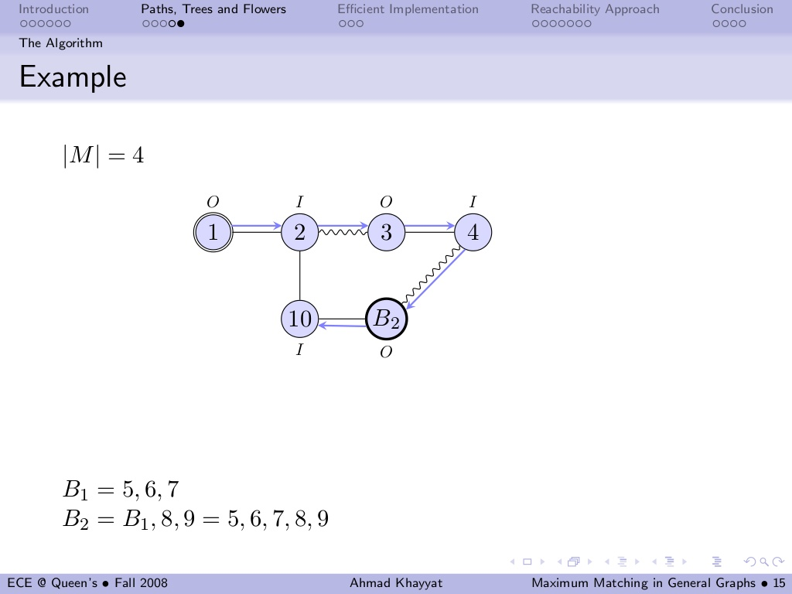

# maximum-matching-in-general-graphs

> 通用图的最大匹配算法

## Desc

* from: <https://www.slideshare.net/akhayyat/maximum-matching-in-general-graphs>
* author: `Ahmad Khayyat` @Queue's University
* date: 2008-11-19

## Keywords

* 通用图( General Graphs )
* 二分图( Bipartite Graphs )，非二分图( Non-Bipartite Graphs )
* 交替路径( alternating path )
* 增广路径( agumenting path )

## Slides

