# component-system

> 组件系统设计

 

## Records

### 171103

> changelog: 171104

* 组件布局系统
        组件定位由布局模块统筹计算
        尺寸支持决定尺寸与相对尺寸
        布局方式支持层叠、平铺
* 每个组件都具有布局能力，布局能力作为所有组件的基本功能之一
* 在组件布局系统上构建应用层
* 应用组件的各个抽象层，同样作为基本应用功能来实现
* 先设计并实现组件布局系统
* `阶段一目标`：拖放增加／删除组件，移动组件，拖动边角调整尺寸，配置面板等
* 使用组件`组合`而不是`继承`来复用组件UI
* 复用非UI功能，可以将该功能封装到函数或对象，由其他组件`import`后使用；当然也可以封装到`非UI基类`中作为父类被继承；不推荐`组件类`的继承。

### 171114

* Box组件
* 既可以作为容器包含其他Box，自身同时也可以放到其他容器中
* 边框可拖动，以调整尺寸x或y方向的尺寸
* 边框交叉处可拖动，以同时调整x, y方向的尺寸
* 有标题栏，可点击标题栏拖动整个Box
* 同级Box之间的相对位置关系有两种模式，`平铺`和`层叠`。平铺时，Box不能重叠，也不能移出容器范围；层叠时，Box可以相互重叠，有图层关系，且可部分移出容器范围
* 支持`最小高度、宽度`设置；平铺模式下，一个Box的尺寸改变可影响其他相邻Box的尺寸改变，但不能超过设定的最小值，如果同时达到最小值，容器宽度还不够，则可以按最小值等比例缩小；

* 常用拖动功能实现
    * 两个对象：`handler`, `box`。handler为启动拖动的dom；box为接受拖动行为产生副作用的目标dom
    * 三个事件：`mousedown`, `mousemove`, `mouseup`

            Event       Target      Action
            ================================================================================
            mousedown   handler     初始化，包含注册mousemove, mouseup事件
                                    记录按下时鼠标位置( vx, vy )、容器位置( ox, oy )
            mousemove   document    鼠标移动处理函数，计算鼠标相对于( vx, vy )的变化量( dx, dy )
                                    再根据( ox, oy )计算新的容器位置( nx, ny )，并应用到容器DOM 
            mouseup     document    结束拖动，解绑mousemove, mouseup事件

    * `mousemove`注册到`document`上，避免鼠标快速移动使鼠标移出handler，从而不再响应mousemove事件；以及由此带来的其他不好的交互体验
    * `mouseup`注册到`document`，确保即使鼠标移出当前window，也能能捕获鼠标mouseup事件，及时解绑定事件函数，保持轮转状态一致性

### 171116

* 事件处理函数命名规则：
        React事件       onClick, onMouseDown, onDragStart, ...
        其他事件        on_click, on_mousedown, on_dragstart, ...
* `focus`状态，`mousedown`事件触发focus状态的变化，mousedown事件注册在`document`上，每个Box组件判断target是否为`dom子树`上的节点来决定focus状态的切换
* 边框拖动功能
    * hover阶段，展示可启动功能，通过鼠标cursor的类型来提示
    * `hover算法`：只针对处于focus状态的box，判断鼠标是否位于边框位置，hover也绑定在document上，确保能在边框之外小范围区域开启拖动
    * mousedown事件，启动拖动
* DOM坐标系：
        viewport坐标系      vx, vy
        content坐标系       cx, cy

### 171117

* `document`的`mousemove`事件需要处理`多种状态`下的移动响应

        State       Start               Moving                  End                 Action      
        ===============================================================================================
        drag        header mousedown    document mousemove      document mouseup    拖动        
        resize      border mousedown    document mousemove      document mouseup    缩放        
        hover       border near by      box mousemove           border far away     切换可执行缩放操作
        capture-    when not in drag    box mousemove           when turns into 
         hover      , hover or resize                           drag, hover or 
                                                                 resize

* `drag`状态由header的mousedown事件触发，由document的mouseup事件终结
* `drag`状态用于「`box整体拖动`」；`capture-hover`, `hover`, `resize`三个状态用于「`box边框拖动`」；两种拖动操作需`独立响应`mousemove事件
* `resize`状态由Focused的box边框附近的mousedown事件触发，由document的mouseup事件终结
* `capture-hover`状态下会判断鼠标是否移动到Focused的box边框附近，如果是的话，则进入hover状态。它是优先级最低的状态，只要不是drag, hover或resize状态，都处在capture-hover状态中，当drag,hover或resize的触发条件发生，即刻取消当前状态进入对应状态。
* `hover`状态下，根据鼠标与border的相对位置，鼠标`cursor`在以下状态间切换，处于下方列出状态下触发的`mousedown`，将会使状态进入`resize`状态：

        e-resize, s-resize, se-resize, w-resize, sw-resize

* `capture-hover`和`hover`状态都只局限于box之上的`mousemove`，而不是document的mousemove，使用后者的话，在计算鼠标样式以及后续点击操作的处理都会遇到困难。这种实现方案的缺憾为只能在`边框内边缘`显示resize鼠标样式。
* 如果鼠标悬停在header，且离border很近的地方，这时如果触发mousedown，则可能进入dragging也可能进入resize，程序需要避免这种`歧义性`。我们采用的办法是，header区域的border不参与hover状态判断。

### 171118

* `hover`状态下，<s>box上的`mousedown`事件，需要`阻止冒泡`，避免触发document的mousedown，从而响应focus处理</s>，需要阻止`默认行为`，主要避免后续的mousemove触发图片或文本等的选中或拖放行为
* `resize`过程的状态流转：

                           ======================               
                                  disabled                      
                           ======================
                            |                 ^             
        enable hover        |                 |    disable hover            
                            v                 |             
                           ======================               
                                capture_hover                      
                           ======================
                            |         ^       ^              
        border near by      |         | border| far away    
                            v         |       |              
                           =============      |             
                               hover          |                    
                           =============      |             
                            |                 |             
        box mousedown       |                 |    
                            v                 |             
                           =============      |             
                               resize         |                     
                           =============      |             
                            |                 |             
        document mousemove  |                 | document mouseup
                            v                 |             
                           =====================                    
                                  resizing                              
                           =====================                    

* `todo`： `drag`、`focus`、`resize`这三种操作需要独立开，同时将它们之间需要一并考虑的地方理清楚。目前实现还有一些小bug

### 171121

* `focus`, `drag`, `resize`三种操作对应的事件处理函数，需要有`命名规则`：

        on_focus

        on_header_drag_start
        on_header_dragging
        on_header_drag_end

        on_capture_hover
        on_border_resize_start
        on_border_resizing
        on_border_resize_end

### 171122

* 两种布局模式，`平铺`与`层叠`
* box负责`下一级`子box的`尺寸仲裁`

### 171123

* arbitrate, arbitration - 仲裁
* Box接收子Box的size变化请求，仲裁计算后，下发给子Box
* Box自身size变化，仲裁计算后，下发给子Box
* 父子Box存在`耦合交互`，须同React-Router实现类似，使用`context`进行父子通信

### 171124

* `arbitrator`类，管理多个内含矩形的布局，( x, y, w, h )
* 层叠排布
        初始布局，确保不完全重叠 
        初始尺寸，按设置尺寸设置宽高，若未提供尺寸参数，则使用默认宽高
* 平铺排布
        初始布局
        box必须所有边都贴壁
        传入配置添加、人工拖动添加
        人工拖动还是需要转换成配置

        包含子box数，及对应的默认布局：
            L x C

            L * ( L - 1 ).x     ->      L x ( L + 1 ), L >= 1
            ===================================================
            1 * 1               ->      1 x 2
            2 * 1.x             ->      2 x 3
            3 * 2.x             ->      3 x 4
            4 * 3.x             ->      4 x 5
            
        1个box，则4边贴壁
        2个box，默认为左右布局
        3个box，默认为上下布局，上2下1
        4个box，默认为上下布局，上2下2
        5个box，默认为上下布局，上3下2
        6个box，默认为上下布局，上3下3
        7个box，默认为上中下布局，上3中2下2
        8个box，默认为上中下布局，上3中3下2
        9个box，默认为上中下布局，上3中3下3
        10个box，默认为上中下布局，上4中3下3
        11个box，默认为上中下布局，上4中4下3
        12个box，默认为上中下布局，上4中4下4
        13个box，默认为4行布局，上4中上3中下3下3
        14个box，默认为4行布局，上4中上4中下3下3
        15个box，默认为4行布局，上4中上4中下4下3
        16个box，默认为4行布局，上4中上4中下4下4
        17个box，默认为4行布局，上5中上4中下4下4
        18个box，默认为4行布局，上5中上5中下4下4
        19个box，默认为4行布局，上5中上5中下5下4
        20个box，默认为4行布局，上5中上5中下5下5
        ...

*  拖放响应区域计算
        人工拖动，即时预览，根据不同响应区域出不同的即时预览效果

*  尺寸仲裁中心
        拖动的边有哪些？
        这些边与哪些子box关联？
        计算新的子box尺寸，并下发给子box
        用什么方式来表示子box的相对位置？貌似二维数组还不足以表达

* 同级box的层叠顺序，须引入z-index，获得focus的box是否需要拉到最前面？

### 171125 - adjBoxes

* `resize`事件响应，需触发box及子孙box的尺寸重计算
* `arbitrator`需要管理子box列表，每个列表项包含：
        box: { left: ..., top: ..., width: ..., height: ... }
        , adjBoxes: {
            e: [ box1, ... ]
            , s: [ box1, ... ]
            , w: [ box1, ... ]
            , n: [ box1, ... ]
            , se: [ box1, ... ]
            , sw: [ box1, ... ]
        }

### 171128

* box的resize可能触发`兄弟box`的resize，以及`子box`的resize，但不能触发`父box`的resize；父box充当尺寸仲裁
* `Arbitrator.onResize()` - 对应的box发生size变化时调用
* `Arbitrator.onSubBoxResize()` - 子box发生size变化时调用
* `Arbitrator.resize()` - 对子box进行尺寸仲裁
* 在`box-a`上操作边的拖动，以进行resize，此时的响应过程：
    * box-a若存在`parentAribitrator`，由box-a调用`parentArbitrator.onSubBoxResize()`；若box不存在parentArbitrator，则不响应
    * `parentArbitrator`计算获得新的size后，通过触发子box的`Arbitrator.onResize()`派发给所有子box，其间，`box-a`作为子box之一，也用新的size调用`Arbitrator.onResize()`，若box-a包含子box，arbitrator将根据新的size计算所有子box的新size，并派发给所有子box

* `resize`调用过程：

        resize
            parentArbitrator.onSubBoxResize()
                parentArbitrator.resize()
                    subBox1.arbitrator.onResize()
                    subBox2.arbitrator.onResize()
                        subBox2.arbitrator.resize()
                            subBox2_1.arbitrator.onResize()
                            subBox2_2.arbitrator.onResize()
                            ...
                            subBox2_n.arbitrator.onResize()
                    ...
                    subBoxn.arbitrator.onResize()

* `初始化`调用过程：

        rootArbitrator.onResize()
            rootArbitrator.resize()
                subBox1.arbitrator.onResize()
                subBox2.arbitrator.onResize()
                    subBox2.arbitrator.resize()
                        subBox2_1.arbitrator.onResize()
                        subBox2_2.arbitrator.onResize()
                        ...
                        subBox2_n.arbitrator.onResize()
                ...
                subBoxn.arbitrator.onResize()

### 171129

* `window.resize`事件响应，确保box的size属性与DOM相匹配
* 初始化布局逻辑
    * 先获取`subBoxGrid`结构
    * 计算每个subBox的`left, top, width, height`属性
    * 触发每个subBox的`onResize()`
* box content高度获取及更新
* `平铺`模式下，header的drag需要disable掉 

### 171130

* `resize`逻辑开发及调试
* 限制：`border`本身不作为元素的`响应区`，`padding`会作为响应区
* `!重要`：box`不设置border`样式，一律使用`border: none;`，另外的角度将，box作为`framebox`，无外边距、边框、内边距是合适的。
* `resize`的鼠标样式若只是设置在box上，若box内部有其他元素，且有默认`鼠标样式`，则无法显示正确鼠标样式。所以需要使用`设置class`的方式，不仅设置box本身，还设置box的`子孙元素`，比如：

        .box_w-resize {
            cursor: w-resize;
        }
        .box_w-resize * {
            cursor: w-resize;
        }

### 171201

* 如何保存子box的layout？需要满足即使容器尺寸变化，也能按某种规则还原。`四元组` ( top, left, width, height )
    * 每个box保存自身的四元组
    * arbitrator根据子box的四元组列表获取adjBoxes，使用`Arbitrator.getAdjInfoForSubBoxes()`实现
    * 在新的父容器尺寸下，计算并更新四元组；或接收子box的变化请求，计算并更新四元组

* 如何表达resize请求？

### 171205

* 新的box尺寸，根据当前子box四元组列表与新box尺寸的相对关系，重新计算新的子box四元组列表，并更新

        记新的box尺寸为( w', h' )
        从子box四元组列表获取所占区域尺寸，记为( w, h )
        若w' > w，则将子box的宽度进行等比例放大
        若h' > h，则将子box的高度进行等比例放大
        若w' < w，则将子box的宽度进行等比例缩小
        若h' < h，则将子box的高度进行等比例缩小

* 接收到子box的尺寸变化请求`R( target, type, dx, dy )`，计算其相邻box以及受影响box的新四元组，并更新
        direction       dx      dy      desc
        =============================================================================
        e               5       0       东向变化，变宽5px
        e               -5      0       东向变化，变窄5px
        w               5       0       西向变化，变宽5px，位置左移5px
        w               -5      0       西向变化，变窄5px，位置右移5px
        s               0       5       南向变化，变高5px
        s               0       -5      南向变化，变矮5px
        se              5       5       东南向变化，变宽5px，变高5px
        se              -5      -5      东南向变化，变窄5px，变矮5px
        se              -5      5       东南向变化，变窄5px，变高5px
        se              5       -5      东南向变化，变宽5px，变矮5px
        sw              5       5       东西向变化，变宽5px，位置左移5px，变高5px
        sw              -5      -5      东西向变化，变窄5px，位置右移5px，变矮5px
        sw              -5      5       东西向变化，变窄5px，位置右移5px，变高5px
        sw              5       -5      东西向变化，变宽5px，位置左移5px，变矮5px

* 尺寸请求可能失败

### 171206

> changelog: 171208, 171207

* resize过程中，确保`鼠标样式`不发生改变，比如当前正处于`se方向`的resize，resize过程中鼠标移到了`下边框`，这时鼠标样式仍然是se-resize，而不是s-resize

* `resizeType` - 当前尺寸变化类型，有5种，包括：`e-resize, s-resize, w-resize, sw-resize, se-resize`
* `arbitrateSubBoxLayout()` - 对子box的尺寸进行仲裁

    * `父box`尺寸发生变化时，对`子box树`进行`等比例缩放`：若成功执行`probeRatioResize( box )`，表明可以等比例缩放，此时可以触发`实际更新`，如下：

            调用p = probeRatioResize( box )
            若p == true
                box.arbitrator.onResize( { useTobe: 1 } ) 

        以下为`probeRatioResize算法描述`：

            probeRatioResize( box )
                记box的tobe尺寸为S
                执行c = box.checkParams( S )，若c == false，则返回false

                记子box的现实总占用空间为S'
                若S == S'，返回true

                记缩放比例ratio = S / S'
                记子box列表为L
                针对列表L的每一个元素b
                    计算b的tobe尺寸，S_tobe = S_now * ratio
                    执行p = probeRatioResize( b )
                    若p == false
                        退出并返回false
                返回true

        `一些Tips`:
            a. tobe尺寸计算，使用`tobe_`前缀的四元组进行计算，若不存在，则使用不带前缀的四元组
            b. 关于等比例缩放的ratio，它是一个`二维向量`，分为`xRatio`和`yRatio`

    * 若有一个`子box`发起了resize请求`R`，需判断该resize请求引发的`兄弟box及子孙box`的resize能否满足：先执行`probeResizeRequest( R )`，若执行成功，则触发`实际更新`，如下：

            调用p = probeResizeRequest( R )
            若p == true
                this.box.arbitrator.onResize( { useTobe: 1 } ) 

        以下为`probeResizeRequest算法描述`：
             
            probeResizeRequest( R, resizedBoxes )
                记box = getBoxFromRequest( R )
                根据R计算box的tobe尺寸: s = getTobeSize( R )
                若s为null
                    退出并返回false
                计算p = probeRatioResize( box )
                若p == false
                    退出并返回false
                将box记入已计算过新尺寸的集合resizedBoxes
                获取直接受影响且未计算过新尺寸的相邻子box集合B
                将集合B的每个相邻子box记入resizedBoxes
                针对B集合的每一个元素b
                    计算针对b的resize请求R'
                    调用s' = probeResizeRequest( R', resizedBoxes )
                    若s'为false
                        退出并返回false
                返回true

                
        `一些Tips`:
            a. 分为两阶段，第一阶段为试探阶段，使用`tobe_`前缀记录新四元组；第二阶段为应用
                阶段，将tobe尺寸变为真实尺寸
            b. resize请求传递路径较短的优先，以上集合B获取以后，立即将其内含子box添加入resizedBoxes
                ，能确保请求传递路径短的请求被执行

* 关于`probeRatioResize( box )`和`probeResizeRequest( R )`：
    * `前者`针对box尺寸变化，需要对其`子box树`进行调整的情况
    * `后者`针对box有尺寸变化请求，需要对其兄弟box尺寸进行仲裁的情况 
    * `前者`在初次渲染，根box尺寸与子box不匹配时；以及resize请求过程中，box变化需要子box树统一变化时都会调用
    * `后者`主要在box发起resize请求时，对其兄弟box之间的尺寸进行仲裁时调用。后者执行过程中会调用前者

### 171207

* `getTotalSpace()` - 获取子box所占的空间`S( left, top, width, height )`

        right_max = Max( left_1 + width_1, left_2 + width_2, ..., left_n + width_n )
        bottom_max = Max( top_1 + height_1, top_2 + height_2, ..., top_n + height_n )
        left = Min( left_1, left_2, ..., left_n )
        top = Min( top_1, top_2, ..., top_n )
        width = right_max - left
        height = bottom_max - top

* `probeRatioResize()` - 执行子box的`等比例`缩放，先计算出`ratio`，再将所有子box的四元组同时`乘以ratio`，具体执行过程见前文所述

* resize请求的`传递`，比如：子box 1发出`e-resize`的请求，在处理该请求的时候，其在`e方向`上的相邻box的`w方向`都会受该resize请求的影响并作出调整，同时发出`w-resize`的请求。这个过程就完成了resize请求的传递。

* 等比例缩放，用户resize请求都有可能`不成功`

* 使用`tobe_`前缀作为新尺寸的`暂存`，以便针对尺寸的更新进行测试，若更新失败，可以取消当前更新请求；是否接受新的尺寸更新，由`box自身提供判断逻辑`（ checkParams() ），并通过`返回值`来表达是否更新成功。

*  `父子重叠边`的resize，应直接触发`父box`的resize，表现在代码里，主要有以下几处`特殊实现`：

        enableResize = ( type ) => {
            ...

            // capture phase
            box.addEventListener(
                'mousedown'
                , me.on_border_resize_start
                , true
            );
        }

        disableResize = () => {
            ...

            // capture phase
            box.removeEventListener(
                'mousedown'
                , this.on_border_resize_start
                , true
            );
        }

        on_border_resize_start = ( e ) => {
            ...
            // only triggered on the parent box
            // make sure resizing be on the border of the most bottom box 
            e.stopPropagation();
            ...
        }

### 171208

* 调整并完善`arbitrateSubBoxLayout()`算法逻辑的描述，开始代码实现
* 包含以下方法的实现：

        Arbitrator.arbitrateSubBoxLayout()
        Arbitrator.probeRatioResize()
        Arbitrator.probeResizeRequest()
        Arbitrator.getBoxFromRequest( request )
        Arbitrator.getTobeSize( request )
        Arbitrator.getTotalSpace( options )

* 如何发现代码的不合理？ 比如`Arbitrator.onSubBoxResize()`内部调用了`Arbitrator.resize()`
* `复杂代码逻辑`的实现方法，先通过`伪代码`详细`描述及论证`好算法逻辑，再`自顶向下`实现代码，过程中可使用`函数桩`代替下级方法。从程序骨架逐步完善，最终行程最终完整代码。
* `while循环`的编写容易漏掉`自变量`的变化，导致首次运行出现`死循环`，而for循环的`固有编写格式`包含自变量的变化，能更好避免初次死循环

### 171211

* `getTobeSize( request )` - 根据resize请求的描述，获得对应box的新尺寸

        type            dx      dy      tobe-size
        =============================================================================
        e-resize        5       0       width += 5 
        e-resize        -5      0       width += -5
        w-resize        5       0       left -= 5, width += 5
        w-resize        -5      0       left -= -5, width += -5
        s-resize        0       5       height += 5
        s-resize        0       -5      height += -5
        se-resize       5       5       width += 5, height += 5
        se-resize       -5      -5      width += -5, height += -5
        se-resize       -5      5       width += -5, height += 5
        se-resize       5       -5      width += 5, height += -5
        sw-resize       5       5       left -= 5, width += 5, height += 5
        sw-resize       -5      -5      left -= -5, width += -5, height += -5
        sw-resize       -5      5       left -= -5, width += -5, height += 5
        sw-resize       5       -5      left -= 5, width += 5, height += -5

    综上，计算公式为：

        type            tobe-size
        =============================================================================
        e-resize        width += dx        
        s-resize        height += dy
        se-resize       width += dx, height += dy
        w-resize        left -= dx, width += dx
        sw-resize       left -= dx, width += dx, height += dy

* `getAffectedBoxes( request, resizedBoxes )` - 根据resize请求的描述，获得对应的`受影响的且未resize过`的邻接box集合

### 171212

* 更名：`getAdjBoxes()` -> `getAdjInfoForSubBoxes()`，因为`getAdjBoxes()`容易理解成获取当前Arbitrator对应的box的邻接box

* `getTransferedRequest( request, direction, transferedBox )` - 获取传递的resize请求

        initial request     transfered requests         extra requests
        ================================================================================
        e( dx, 0 )          w( -dx, 0 ) 
        w( dx, 0 )          e( -dx, 0 )
        s( 0, dy )          n( 0, -dy )
        n( 0, dy )          s( 0, -dy )
        se( dx, dy )        n( 0, -dy ), w( -dx, 0 )    ne( dx, -dy ), sw( -dx, dy )
        sw( dx, dy )        n( 0, -dy ), e( -dx, 0 )    nw( dx, -dy ), se( -dx, dy ) 
        ne( dx, dy )        s( 0, -dy ), w( -dx, 0 )    se( dx, -dy ), nw( -dx, dy )
        nw( dx, dy )        s( 0, -dy ), e( -dx, 0 )    sw( dx, -dy ), ne( -dx, dy )

    `Tips:`
    * `单字母`request，表示由边触发的resize请求；`双字母`request，表示由顶点触发的resize请求
    * 单字母request，只能传递一种request；而双字母request，可以传递多种request，根据顶点拖动所影响的边的情况传递不同种类的request

* `se-resize`、`sw-resize`，实际上是对一个`顶点拖动`，该顶点`最多涉及4条边`的变化
* `se-resize`, `sw-resize`, `ne-resize`, `nw-resize`都属于`顶点拖动`，前两者能通过`手动拖动`触发，后两者只能通过`resize请求传递`获得

## utils

    @[data-script="babel-loose"]var utils = ( function() {

        function extend( target, ...sources ) {
            for ( let i = 0; i < sources.length; i++ ) {
                let source = sources[ i ];
                for ( let key in source ) {
                    if ( source.hasOwnProperty( key ) ) {
                        target[ key ] = source[ key ];
                    }
                }
            }
            return target;
        }

        function extendOnly( target, ...others ) {
            let len = others.length 
                , sources = [].slice.call( others, 0, len - 1 )
                , keys = others[ len - 1 ] 
                ;
            for ( let i = 0; i < sources.length; i++ ) {
                let source = sources[ i ];
                for ( let key in source ) {
                    if ( source.hasOwnProperty( key ) && keys.indexOf( key ) >= 0 ) {
                        target[ key ] = source[ key ];
                    }
                }
            }
            return target;
        }

        function defaults( target, ...sources ) {
            for ( let i = 0; i < sources.length; i++ ) {
                let source = sources[ i ];
                for ( let key in source ) {
                    if ( source.hasOwnProperty( key ) && target[ key ] == undefined ) {
                        target[ key ] = source[ key ];
                    }
                }
            }
            return target;
        }

        return {
            extend
            , extendOnly
            , defaults
        };

    } )();

    function assert( expr ) {
        if ( ! expr ) {
            alert( 'assertion failed' );
        }
        return expr;
    }

## Arbitrator

> box尺寸仲裁中心

* 通过`arbitrator.register()`方法注册子box，内部使用数据结构保存对子box的引用
* componentDidMount事件中，由`root box`调用其对应`arbitrator.initializeSubBoxLayout()`执行子box的布局初始化
* box支持`props.isRootBox`属性，声明当前box为root box；通过root box特性，可以中断context中的`arbitrator链`

### 代码实现

    @[data-script="babel"]class Arbitrator {
        constructor( box, options ) {
            let me = this;
            me.opt = options || {};
            if ( ! me.opt.debug && ! box instanceof Box ) {
                throw Error( 'Arbitrator constructor: box must be instance of Box' );
            }
            me.box = me.opt.debug 
                ? { width: 300, height: 320, contentHeight: 300, left: 0 } : box;
            me.subBoxLayoutInitialized = false;
            me.subBoxes = [];
            me.adjBoxes = {};
        }

        register( subBox ) {
            if ( ! subBox instanceof Box ) {
                throw Error( 'Arbitrator register(): subBox must be instance of Box' );
            }
            console.log( 'register ' + subBox._uuid );
            this.subBoxes.push( subBox );
        }

        initializeSubBoxLayout() {
            let me = this;
            if ( me.subBoxes.length ) {
                console.log( 
                    'initializeSubBoxLayout: '
                    + me.subBoxes.map( ( box ) => 'box ' + box._uuid )
                        .join( '; ' )
                );
            }
            
            me.getDefaultLayout();
            me.subBoxLayoutInitialized = true;
        }

        getDefaultLayout( total ) {
            let me = this;
            total = total || me.subBoxes.length;

            let grid = me.getSubBoxGrid( total );
            let lineCount = grid.length;
            let contWidth = me.box.width;
            let contHeight = me.box.contentHeight;
            let lineHeight = contHeight / lineCount;
            let j = 0;
            let layoutData = [];

            console.log( 'Arbitrator.getDefaultLayout(): on box ' + me.box._uuid );

            if ( me.opt.debug ) {
                while( j < total ) {
                    let coords = getCoords( j );
                    let params = getBoxParams( coords );
                    layoutData.push( params );
                    j++;
                } 
            }
            else {
                me.subBoxes.forEach( ( box, index ) => {
                    let coords = getCoords( index );
                    let params = getBoxParams( coords );
                    layoutData.push( params );
                    utils.extend( box, params );
                } );
            }

            return layoutData;

            function getBoxParams( coords ) {
                let { ln, col } = coords;
                let left, top, width, height;
                let colWidth = contWidth / grid[ ln ];  
                left = colWidth * col;
                top = lineHeight * ln;
                width = colWidth;
                height = lineHeight;
                return { left, top, width, height };
            }
            
            function getCoords( index ) {
                let ln = 0, col = 0;
                let i = 0, colsOfLine;
                while ( ln < lineCount && i <= index ) {
                    colsOfLine = grid[ ln ];
                    col = 0;
                    while( col < colsOfLine && i <= index ) {
                        if( i == index ) {
                            return { ln, col };
                        }
                        i++;
                        col++;
                    }
                    ln++;
                }
            }
        }

        getSubBoxGrid( total ) {
            let me = this;
            total = total || me.subBoxes.length;
            let lineCount = Math.floor( Math.sqrt( total ) );
            if ( lineCount * ( lineCount + 1 ) < total ) {
                lineCount++;
            }
            let lines = [];
            let i = lineCount;
            while( i > 0 ) {
                lines.push( lineCount - 1 );
                i--;
            }
            let j = lineCount * ( lineCount - 1 ) + 1;
            while ( j++ <= total ) {
                lines[ i ]++;
                i = ( i + 1 ) % lineCount;
            }
            return lines;
        }

        arbitrateSubBoxLayout( params ) {
            let me = this;
            console.log(
                'arbitrateSubBoxLayout on box [ ' + this.box._uuid + ' ]: '
                + this.subBoxes.map( ( box ) => 'box ' + box._uuid )
                    .join( '; ' )
            );

            let resizedBoxes = {};
            resizedBoxes.__version = Date.now();
            if ( me.probeResizeRequest( params, resizedBoxes ) ) {
                // me.box.arbitrator.onResize( { useTobe: 1 } );
            }
        }

        getAdjInfoForSubBoxes( subBoxes ) {
            let me = this;
            let adjBoxes = {};
            subBoxes = subBoxes || me.subBoxes;

            if ( me.opt.debug ) {
                let _uuid = 1;
                subBoxes.forEach( box => {
                    box._uuid = _uuid++;
                } );
            }

            subBoxes.forEach( ( box ) => {
                let _uuid = box._uuid;
                let { top, left, width, height } = box;
                let abs = adjBoxes[ _uuid ] = {};

                subBoxes.forEach( ( subBox ) => {

                    if ( _uuid == subBox ) { return; }
                    let { top: sTop, left: sLeft, width: sWidth, height: sHeight } = subBox;

                    // console.log( { top, left, width, height, sTop, sLeft, sWidth, sHeight } );

                    if ( sLeft == left + width 
                            && ! (
                                sTop >= top + height
                                || sTop + sHeight <= top
                            )
                        ) {
                        abs[ 'e' ] = abs[ 'e' ] || [];
                        abs[ 'e' ].push( subBox );
                    } 
                    else if ( sLeft + sWidth == left
                            && ! (
                                sTop >= top + height
                                || sTop + sHeight <= top
                            )
                        ) {
                        abs[ 'w' ] = abs[ 'w' ] || [];
                        abs[ 'w' ].push( subBox );
                    }
                    else if ( sTop == top + height
                            && ! (
                                sLeft >= left + width
                                || sLeft + sWidth <= left
                            )
                        ) {
                        abs[ 's' ] = abs[ 's' ] || [];
                        abs[ 's' ].push( subBox );
                    }
                    else if ( sTop + sHeight == top
                            && ! (
                                sLeft >= left + width
                                || sLeft + sWidth <= left
                            )
                        ) {
                        abs[ 'n' ] = abs[ 'n' ] || [];
                        abs[ 'n' ].push( subBox );
                    }

                } );

            } );

            return adjBoxes;
        }

        getAffectedBoxes( request, resizedBoxes ) {
            if ( !resizedBoxes ) {
                throw Error( 'getAffectedBoxes: resizedBoxes not defined' );
            }
            let me = this;
            let boxId = request.target;
            let adjBoxes = me.getAdjInfoForSubBoxes();
            let boxes = [];
            switch( request.type ) {
                case 'e-resize':
                    _addBoxes( 'e' );
                    break;
                case 's-resize':
                    _addBoxes( 's' );
                    break;
                case 'w-resize':
                    _addBoxes( 'w' );
                    break;
                case 'n-resize':
                    _addBoxes( 'n' );
                    break;
                case 'se-resize':
                    _addBoxes( 's' );
                    _addBoxes( 'e' );
                    break;
                case 'sw-resize':
                    _addBoxes( 's' );
                    _addBoxes( 'w' );
                    break;
                case 'ne-resize':
                    _addBoxes( 'n' );
                    _addBoxes( 'e' );
                    break;
                case 'nw-resize':
                    _addBoxes( 'n' );
                    _addBoxes( 'w' );
                    break;
            }

            function _addBoxes( type ) {
                ( adjBoxes[ boxId ][ type ] || [] ).forEach( box => {
                    if ( !resizedBoxes[ box._uuid ] ) {
                        boxes.push( { type, box } );
                    }
                } );
            }

            return boxes;
        }

        probeResizeRequest( request, resizedBoxes ) {
            if ( !resizedBoxes ) {
                throw Error( 'probeResizeRequest: resizedBoxes not defined' );
            }

            resizedBoxes[ request.target ] = 1;

            let me = this;
            let box = me.getBoxFromRequest( request ); 
            let tobeSize = me.getTobeSize( request );
            console.log( 'probeResizeRequest from box ' + box._uuid );
            if ( !tobeSize ) {
                return false;
            }

            let p = me.probeRatioResize( box );
            if ( !p ) {
                return false;
            }
            let affectedBoxes = me.getAffectedBoxes( request, resizedBoxes );

            console.log( 'affectedBoxes: ' + affectedBoxes.map( box => box.type + '|' + box.box._uuid ).join( ', ' ) );

            affectedBoxes.forEach( item => resizedBoxes[ item.box._uuid ] = 1 );

            let i = 0, item, transferedRequest;
            while( i < affectedBoxes.length ) {
                item = affectedBoxes[ i ];
                console.log( item.type + '|' + item.box._uuid );
                transferedRequest = me.getTransferedRequest( request, item.type, item.box );
                if ( ! me.probeResizeRequest( transferedRequest, resizedBoxes ) ) {
                    return false;    
                }
                i++;
            } 

            return true;
        }

        getTransferedRequest( request, direction, transferedBox ) {
            let box = this.getBoxFromRequest( request );
            let r, transferedRequest;

            r = utils.extend( {}, request );
            r.target = transferedBox._uuid;

            switch( request.type ) {
                case 'e-resize': 
                    if ( 'e' == direction ) {
                        r.type = 'w-resize';
                        r.dx = -r.dx;
                        transferedRequest = r;
                    }
                    break;
                case 'w-resize': 
                    if ( 'w' == direction ) {
                        r.type = 'e-resize';
                        r.dx = -r.dx;
                        transferedRequest = r;
                    }
                    break;
                case 's-resize': 
                    if ( 's' == direction ) {
                        r.type = 'n-resize';
                        r.dy = -r.dy;
                        transferedRequest = r;
                    }
                    break;
                case 'n-resize': 
                    if ( 'n' == direction ) {
                        r.type = 's-resize';
                        r.dy = -r.dy;
                        transferedRequest = r;
                    }
                    break;
                case 'se-resize':
                    if ( 'e' == direction ) {
                        if ( box.top + box.height == transferedBox.top + transferedBox.height ) {
                            r.type = 'sw-resize';
                            r.dx = -r.dx;
                        }
                        else {
                            r.type = 'w-resize';
                            r.dx = -r.dx;
                            r.dy = 0;
                        }
                        transferedRequest = r;
                    }
                    if ( 's' == direction ) {
                        if ( box.left + box.width == transferedBox.left + transferedBox.width ) {
                            r.type = 'ne-resize';
                            r.dy = -r.dy;
                        }
                        else {
                            r.type = 'n-resize';
                            r.dx = 0;
                            r.dy = -r.dy;
                        }
                        transferedRequest = r;
                    }
                    break;
                case 'sw-resize':
                    if ( 'w' == direction ) {
                        if ( box.top + box.height == transferedBox.top + transferedBox.height ) {
                            r.type = 'se-resize';
                            r.dx = -r.dx;
                        }
                        else {
                            r.type = 'e-resize';
                            r.dx = -r.dx;
                            r.dy = 0;
                        }
                        transferedRequest = r;
                    }
                    if ( 's' == direction ) {
                        if ( box.left == transferedBox.left ) {
                            r.type = 'nw-resize';
                            r.dy = -r.dy;
                        }
                        else {
                            r.type = 'n-resize';
                            r.dx = 0;
                            r.dy = -r.dy;
                        }
                        transferedRequest = r;
                    }
                    break;
                case 'ne-resize':
                    if ( 'e' == direction ) {
                        if ( box.top == transferedBox.top ) {
                            r.type = 'nw-resize';
                            r.dx = -r.dx;
                        }
                        else {
                            r.type = 'w-resize';
                            r.dx = -r.dx;
                            r.dy = 0;
                        }
                        transferedRequest = r;
                    }
                    if ( 'n' == direction ) {
                        if ( box.left + box.width == transferedBox.left + transferedBox.width ) {
                            r.type = 'se-resize';
                            r.dy = -r.dy;
                        }
                        else {
                            r.type = 's-resize';
                            r.dx = 0;
                            r.dy = -r.dy;
                        }
                        transferedRequest = r;
                    }
                    break;
                case 'nw-resize':
                    if ( 'w' == direction ) {
                        if ( box.top == transferedBox.top ) {
                            r.type = 'ne-resize';
                            r.dx = -r.dx;
                        }
                        else {
                            r.type = 'e-resize';
                            r.dx = -r.dx;
                            r.dy = 0;
                        }
                        transferedRequest = r;
                    }
                    if ( 'n' == direction ) {
                        if ( box.left == transferedBox.left ) {
                            r.type = 'sw-resize';
                            r.dy = -r.dy;
                        }
                        else {
                            r.type = 's-resize';
                            r.dx = 0;
                            r.dy = -r.dy;
                        }
                        transferedRequest = r;
                    }
                    break;
            }

            return transferedRequest;
        }

        probeRatioResize() {
            return true;
        }

        getBoxFromRequest( request ) {
            let i = 0;
            let boxes = this.subBoxes;
            while( i < boxes.length ) {
                if ( boxes[ i ]._uuid == request.target ) {
                    return boxes[ i ];
                }
                i++;
            }
            return false;
        }

        getTobeSize( request ) {
            let me = this;
            let box = me.getBoxFromRequest( request ); 
            console.log( request );

            box.tobe_left = box.left;
            box.tobe_top = box.top;
            box.tobe_width = box.width;
            box.tobe_height = box.height;
            switch( request.type ) {
                case 'e-resize':
                    box.tobe_width = box.width + request.dx;
                    break;
                case 's-resize':
                    box.tobe_height = box.height + request.dy;
                    break;
                case 'se-resize':
                    box.tobe_width = box.width + request.dx;
                    box.tobe_height = box.height + request.dy;
                    break;
                case 'w-resize':
                    box.tobe_width = box.width + request.dx;
                    box.tobe_left = box.left - request.dx;
                    break;
                case 'sw-resize':
                    box.tobe_width = box.width + request.dx;
                    box.tobe_height = box.height + request.dy;
                    box.tobe_left = box.left - request.dx;
                    break;
            }

            let { left, top, width, height
                , tobe_left, tobe_top, tobe_width, tobe_height } = box;

            return { left, top, width, height
                , tobe_left, tobe_top, tobe_width, tobe_height };
        }

        getTotalSpace( options ) {}

        resize( options ) {
            var opt = options || {};

            if ( opt.useTobe ) {
                console.log( 'resize subboxes using tobe-size' );
            }
            else if ( !this.subBoxLayoutInitialized ) {
                this.initializeSubBoxLayout( options );
            }

            this.subBoxes.forEach( ( box ) => {
                box.arbitrator.onResize( options );
            } );
        }

        onResize( options ) {
            let me = this;
            console.log( 'onResize: on box ' + me.box._uuid );
            // update box params
            me.box.updateParams( options );
            me.resize( options );
        }

        onSubBoxResize( params ) {
            // console.log( 'onSubBoxResize: from box ' + this.box._uuid );
            // console.log( params );
            if ( !params ) {
                throw Error( 'onSubBoxResize( params ): params undefined' );
            }
            this.arbitrateSubBoxLayout( params );
        }

    }

    window.Arbitrator = Arbitrator;

### ut

    @[data-script="babel editable"](function(){

        var s = fly.createShow('#test_ut_arbitrator');
        var ar = new Arbitrator( null, { debug: 1 } );
        s.show( 'testing getSubBoxGrid():' );

        var cases = [
                "ar.getSubBoxGrid( 1 ).join( ',' ) == '1'" 
                , "ar.getSubBoxGrid( 2 ).join( ',' ) == '2'" 
                , "ar.getSubBoxGrid( 3 ).join( ',' ) == '2,1'" 
                , "ar.getSubBoxGrid( 4 ).join( ',' ) == '2,2'" 
                , "ar.getSubBoxGrid( 5 ).join( ',' ) == '3,2'" 
                , "ar.getSubBoxGrid( 6 ).join( ',' ) == '3,3'" 
                , "ar.getSubBoxGrid( 7 ).join( ',' ) == '3,2,2'" 
                , "ar.getSubBoxGrid( 8 ).join( ',' ) == '3,3,2'" 
                , "ar.getSubBoxGrid( 9 ).join( ',' ) == '3,3,3'" 
                , "ar.getSubBoxGrid( 12 ).join( ',' ) == '4,4,4'" 
                , "ar.getSubBoxGrid( 18 ).join( ',' ) == '5,5,4,4'" 
                , "ar.getSubBoxGrid( 28 ).join( ',' ) == '6,6,6,5,5'" 
            ];

        cases.forEach( ( kase ) => {
            s.append_show( eval( 'assert( ' + kase  + ' )' ), kase );
        } );

        s.append_show( '\ntesting getDefaultLayout():' );
        var layout = ar.getDefaultLayout( 5 );
        s.append_show( assert( layout.length == 5 ), 'layout.length == 5' );
        s.append_show( assert( layout[ 0 ].left === 0 && layout[ 0 ].top === 0 )
                , 'item 0: left == 0 && top == 0' );
        s.append_show( assert( layout[ 0 ].width === 100 && layout[ 0 ].height === 150 )
                , 'item 0: width == 100 && height == 150' );
        s.append_show( assert( layout[ 3 ].left === 0 && layout[ 3 ].top === 150 )
                , 'item 3: left == 0 && top == 150' );

        s.append_show( '\ntesting getAdjInfoForSubBoxes():' );
        var adjBoxes = ar.getAdjInfoForSubBoxes( layout );
        s.append_show( assert( adjBoxes[ '1' ][ 'e' ].length == 1 )
                , 'adjBoxes[ "1" ][ "e" ].length == 1' );
        s.append_show( assert( adjBoxes[ '4' ][ 'n' ].length == 2 )
                , 'adjBoxes[ "4" ][ "n" ].length == 2' );

    })();

## Box

### css

    @[data-script="html"]

### js

    @[data-script="babel"]/**
     * state                desc 
     * =================================
     * DISABLED             disabled
     * CAPTURE_HOVER        捕获hover
     * HOVER                进入响应区
     * RESIZABLE            可缩放状态   
     * RESIZING             正在缩放
     */
    const RESIZE_STATE_DISTABLED = 1;
    const RESIZE_STATE_CAPTURE_HOVER = 2;
    const RESIZE_STATE_HOVER = 3;
    const RESIZE_STATE_RESIZABLE = 4;
    const RESIZE_STATE_RESIZING = 5;
    let _uuid = 1;

    class Box extends React.Component {

        constructor( props, context ) {
            super( props );
            let  me = this;

            me._uuid = _uuid++;
            me.top = props.top || 0;
            me.left = props.left || 0;
            me.width = props.width || 100;
            me.height = props.height || 50;
            me.styles = {
                top: me.top + 'px'
                , left: me.left + 'px'
                , width: me.width + 'px'
                , height: me.height + 'px'
            };
            me.isRootBox = props.isRootBox || 0;

            me.isFocused = 0;
            me.isDragging = 0;
            me.resizeState = RESIZE_STATE_DISTABLED;

            me.arbitrator = new Arbitrator( me );
            if ( ! me.isRootBox ) {
                me.parentArbitrator = context.arbitrator;
            }

            if ( me.parentArbitrator ) {
                me.parentArbitrator.register( me );
            }

            // console.log( context.arbitrator );
        }

        getChildContext() {
            return { arbitrator: this.arbitrator };
        }

        render() {
            return (
                

                    
Title

                    

                        { this.props.children }
                    

                

            );
        }

        componentDidMount() {
            let me = this;

            // initialize
            if ( me.isRootBox ) {
                me.arbitrator.onResize();
            }
            me.enableDraggable();
            me.enableFocus();
            me.enableHover();
        }

        componentWillUnmount() {
        }

        checkParams() {
            console.log( 'checkParams' );
            return true;
        }

        updateParams( options ) {
            let me = this;
            let opt = options || {};
            console.log( 'Box.updateParams(): on box ' + me._uuid );
            let box = me.refs.box;
            let content = me.refs.content;

            if ( opt.useTobe ) {
                // even if useTobe is set, maybe there is no tobe-size
                me.left = me.tobe_left || me.left;
                me.top = me.tobe_top || me.top;
                me.width = me.tobe_width || me.width;
                me.height = me.tobe_height || me.height;
            }

            box.style.left = me.left + 'px';
            box.style.top = me.top + 'px';
            box.style.width = me.width + 'px';
            box.style.height = me.height + 'px';

            me.contentHeight = content.offsetHeight; 
        }

        enableFocus = () => {
            document.addEventListener(
                'mousedown'
                , this.on_focus
                , false
            );
        }

        enableDraggable = () => {
            let log = this.props.log;
            let header = this.refs.header;

            header.addEventListener(
                'mousedown'
                , this.on_header_drag_start
                , false
            );
        }

        enableHover = () => {
            let box = this.refs.box;

            this.resizeState = RESIZE_STATE_CAPTURE_HOVER;

            document.addEventListener(
                'mousemove'
                , this.on_capture_hover
                , false
            );
        }

        enableResize = ( type ) => {
            let me = this;
            let box = me.refs.box;

            me.resizeState = RESIZE_STATE_HOVER;
            me.resizeType = type;

            box.addEventListener(
                'mousedown'
                , me.on_border_resize_start
                , true
            );
        }

        disableResize = () => {
            let box = this.refs.box;

            this.resizeState = RESIZE_STATE_CAPTURE_HOVER;

            box.removeEventListener(
                'mousedown'
                , this.on_border_resize_start
                , true
            );
        }

        /***********************************************
         * handlers for focus
         */
        on_focus = ( e ) => {
            let target = e.target;
            let box = this.refs.box;
            let curElement = target;

            while( curElement
                && curElement.parentNode != box ) {
                curElement = curElement.parentNode;
            }

            if ( !curElement ) {
                $( box ).removeClass( 'box_focus' );
                this.isFocused = 0;
            }
            else {
                $( box ).addClass( 'box_focus' );
                this.isFocused = 1;
                console.log( 'mousedown on box: ' + this._uuid );
            }
        }

        /***********************************************
         * handlers for drag
         */
        on_header_drag_start = ( e ) => {
            let log = this.props.log;
            let box = this.refs.box;
            let parentBox = box.parentNode;
            let header = this.refs.header;

            this.isDragging = 1;

            this._dragParams = {
                vx: e.clientX
                , vy: e.clientY
                , ox: parseFloat( box.style.left ) || 0
                , oy: parseFloat( box.style.top ) || 0
            };

            document.addEventListener(
                'mousemove'
                , this.on_header_dragging
                , false
            );

            document.addEventListener(
                'mouseup'
                , this.on_header_drag_end
                , false
            );
        }

        on_header_dragging  = ( e ) => {
            let log = this.props.log;
            let box = this.refs.box;
            let parentBox = box.parentNode;
            let header = this.refs.header;
            let _p = this._dragParams;
            let dx = e.clientX - _p.vx;
            let dy = e.clientY - _p.vy;
            let nx = _p.ox + dx;
            let ny = _p.oy + dy;

            let pComputedStyle = getComputedStyle( parentBox );
            let pw = parseFloat( pComputedStyle[ 'width' ] );
            let ph = parseFloat( pComputedStyle[ 'height' ] );
            let boxSizing = pComputedStyle[ 'box-sizing' ];
            let pBorderLeftWidth = parseFloat( pComputedStyle[ 'border-left-width' ] );
            let pBorderRightWidth = parseFloat( pComputedStyle[ 'border-right-width' ] );
            let pBorderTopWidth = parseFloat( pComputedStyle[ 'border-top-width' ] );
            let pBorderBottomWidth = parseFloat( pComputedStyle[ 'border-bottom-width' ] );
            let pPaddingLeft = parseFloat( pComputedStyle[ 'padding-left' ] );
            let pPaddingRight = parseFloat( pComputedStyle[ 'padding-right' ] );
            let pPaddingBottom = parseFloat( pComputedStyle[ 'padding-bottom' ] );
            let pPaddingTop = parseFloat( pComputedStyle[ 'padding-top' ] );
            let pContentWidth = boxSizing == 'content-box' 
                    ? pw 
                    : pw - pPaddingLeft - pPaddingRight - pBorderLeftWidth - pBorderRightWidth; 
            let pContentHeight = boxSizing == 'content-box' 
                    ? ph 
                    : ph - pPaddingTop - pPaddingBottom - pBorderTopWidth - pBorderBottomWidth; 
            
            if ( nx < 0 ) nx = 0;
            if ( ny < 0 ) ny = 0;
            if ( nx > pContentWidth - 10 ) nx = pContentWidth - 10;
            if ( ny > pContentHeight - 10 ) ny = pContentHeight - 10;

            this.left = nx;
            this.top = ny;
            box.style.left = nx + 'px';
            box.style.top = ny + 'px';
        }

        on_header_drag_end = ( e ) => {
            let log = this.props.log;
            let header = this.refs.header;
            let box = this.refs.box;
            let parentBox = box.parentNode;

            document.removeEventListener(
                'mousemove'
                , this.on_header_dragging
                , false
            );

            document.removeEventListener(
                'mouseup'
                , this.on_header_drag_end
                , false
            );

            this.isDragging = 0;
        }

        /***********************************************
         * handlers for resize
         */
        on_capture_hover = ( e ) => {
            let box = this.refs.box;

            if ( 

                !this.isFocused 
                || this.isDragging 
                || ( 
                    this.resizeState != RESIZE_STATE_CAPTURE_HOVER 
                    && this.resizeState != RESIZE_STATE_HOVER 
                )
                
                ) {
            
                if ( this.resizeState != RESIZE_STATE_RESIZING 
                    && this.resizeState != RESIZE_STATE_RESIZABLE ) {
                    _resetDefault();
                }
                return;
            }

            let header = this.refs.header;
            let parentBox = box.parentNode;
            let headerRect = header.getBoundingClientRect();
            let boxRect = box.getBoundingClientRect();
            // viewport coords
            let vx = e.clientX;
            let vy = e.clientY;
            // content coords
            let cx = vx - boxRect.left;
            let cy = vy - boxRect.top;

            let threshold = 10;
            let xRightHit = Math.abs( cx - boxRect.width ) < threshold;
            // let xRightInnerHit = xRightHit && cx <= boxRect.width;
            // let xRightOuterHit = xRightHit && cx > boxRect.width;
            let xLeftHit = Math.abs( cx ) < threshold;
            // let xLeftInnerHit = xLeftHit && cx >= 0;
            // let xLeftOuterHit = xLeftHit && cx < 0;
            let yBottomHit = Math.abs( cy - boxRect.height ) < threshold;
            // let yBottomInnerHit = yBottomHit && cy <= boxRect.height;
            // let yBottomOuterHit = yBottomHit && cy > boxRect.height;
            let yTopHit = Math.abs( cy ) < threshold;
            // let yTopInnerHit = yTopHit && cy >= 0;
            // let yTopOuterHit = yTopHit && cy < 0;
            let onHeader = cy >= 0 && cy <= headerRect.height
                    && cx >=0 && cx <= boxRect.width;

            let resizeType;
            if ( !onHeader ) {
                if ( xRightHit && yBottomHit ){
                    resizeType = 'se-resize';
                }
                else if ( xLeftHit && yBottomHit ) {
                    resizeType = 'sw-resize';
                }
                else if ( xRightHit ) {
                    resizeType = 'e-resize';
                } 
                else if ( yBottomHit ) {
                    resizeType = 's-resize';
                } 
                else if ( xLeftHit ) {
                    resizeType = 'w-resize';
                }
                else {
                    resizeType = null;
                }
            }
            else {
                resizeType = null;
            }

            if ( !resizeType ) {
                _resetDefault();
                this.disableResize();
            }
            else {
                _resetDefault();
                $( box ).addClass( 'box_' + resizeType );
                this.enableResize( resizeType );
            }

            function _resetDefault() {
                [ 
                    'se-resize', 'e-resize'
                    , 's-resize', 'sw-resize', 'w-resize'
                ]
                .map( item => 'box_' + item ) 
                .forEach( item => $( box ).removeClass( item ) )
                ;
            }
        }

        on_border_resize_start = ( e ) => {
            let me = this;

            me.resizeState = RESIZE_STATE_RESIZABLE; 
            // offset: [0, 10]
            me._resizeParams = { offsetX: 0, offsetY: 0 };

            let vx = e.clientX;
            let vy = e.clientY;
            let boundingRect = me.refs.box.getBoundingClientRect();
            let cx = vx - boundingRect.left;
            let cy = vy - boundingRect.top;
            switch( me.resizeType ) {
                case 'e-resize': 
                    me._resizeParams.offsetX = boundingRect.width - cx; 
                    break;
                case 's-resize': 
                    me._resizeParams.offsetY = boundingRect.height - cy; 
                    break;
                case 'w-resize': 
                    me._resizeParams.offsetX = cx; 
                    break;
                case 'se-resize': 
                    me._resizeParams.offsetX = boundingRect.width - cx; 
                    me._resizeParams.offsetY = boundingRect.height - cy; 
                    break;
                case 'sw-resize': 
                    me._resizeParams.offsetX = cx; 
                    me._resizeParams.offsetY = boundingRect.height - cy; 
                    break;
            }

            document.addEventListener(
                'mousemove'
                , this.on_border_resizing
                , false
            );

            document.addEventListener(
                'mouseup'
                , this.on_border_resize_end
                , false
            );

            console.log( 'mousedown on box: ' + me._uuid )

            // prevent selection of text or image triggered by mousemove
            e.preventDefault(); 

            // make sure resizing be on the border of the most bottom box 
            e.stopPropagation();
        }

        on_border_resizing = ( e ) => {
            let me = this;

            let boundingRect = me.refs.box.getBoundingClientRect();
            let vx = e.clientX;
            let vy = e.clientY;
            let vTop = boundingRect[ 'top' ];
            let vLeft = boundingRect[ 'left' ];
            let cx = vx - vLeft; 
            let cy = vy - vTop;
            let dx = cx - me.width;
            let dy = cy - me.height;

            me.resizeState = RESIZE_STATE_RESIZING;

            switch( me.resizeType ) {
                case 'e-resize':
                    dx += me._resizeParams.offsetX;
                    dy = 0;
                    break;
                case 's-resize':
                    dy += me._resizeParams.offsetY;
                    dx = 0;
                    break;
                case 'w-resize':
                    dx = -cx;
                    dx += me._resizeParams.offsetX;
                    dy = 0;
                    break;
                case 'se-resize':
                    dx += me._resizeParams.offsetX;
                    dy += me._resizeParams.offsetY;
                    break;
                case 'sw-resize':
                    dx = -cx;
                    dx += me._resizeParams.offsetX;
                    dy += me._resizeParams.offsetY;
                    break;
            }

            console.log( 'resizing on box: ' + me._uuid );

            me.parentArbitrator 
                && me.parentArbitrator.onSubBoxResize( {
                    target: me._uuid
                    , type: me.resizeType
                    , dx: dx
                    , dy: dy
                } );
        }

        on_border_resize_end = ( e ) => {

            // this.resizeState = RESIZE_STATE_CAPTURE_HOVER;
            this.disableResize();

            document.removeEventListener(
                'mousemove'
                , this.on_border_resizing
                , false
            );

            document.removeEventListener(
                'mouseup'
                , this.on_border_resize_end
                , false
            );

        }

    }
    
    Box.defaultProps = {
        log: console.log
    };

    Box.contextTypes = {
        arbitrator: React.PropTypes.instanceOf( Arbitrator )
    };

    Box.childContextTypes = {
        arbitrator: React.PropTypes.instanceOf( Arbitrator )
    };

    window.Box = Box;

### test

    @[data-script="babel"](function(){

        var s = fly.createShow('#test_Box');
        s.show( 'testing' );

        ReactDOM.render( 
            <Box height="400" width="600" isRootBox>
                <Box>        
                    <Box>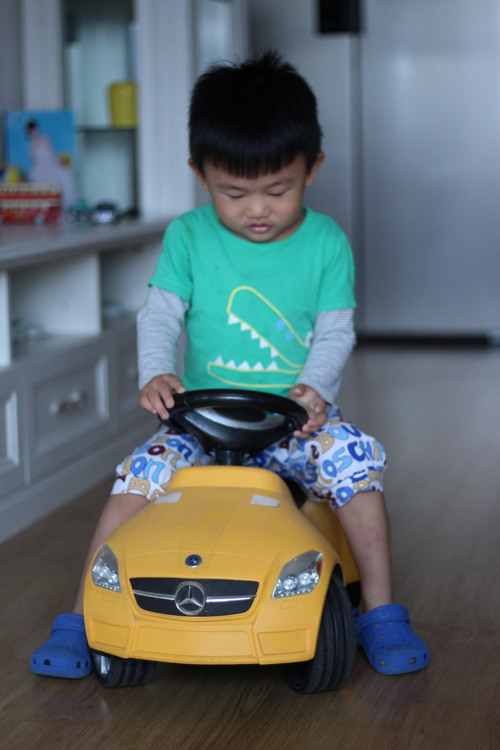</Box>
                    <Box>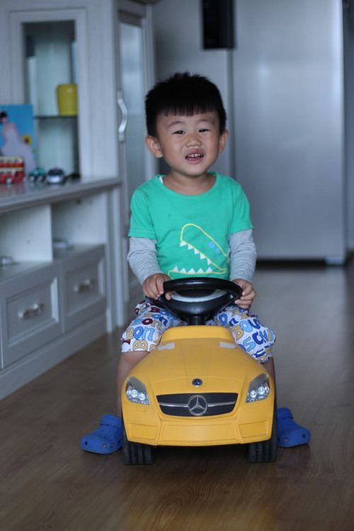</Box>
                </Box>
                <Box>   
                    <Box>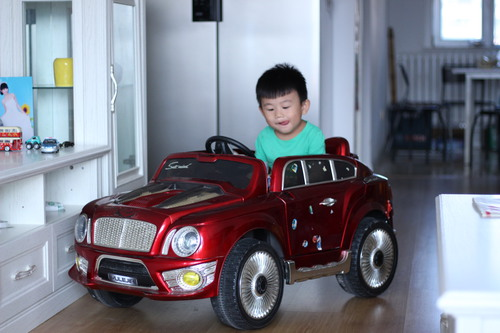</Box>
                    <Box>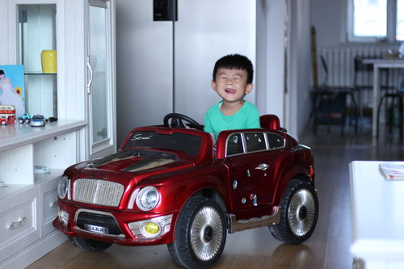</Box>
                    <Box>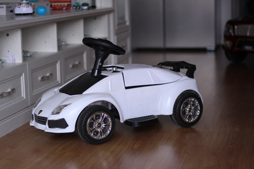</Box>
                </Box>
                <Box>   
                    <Box>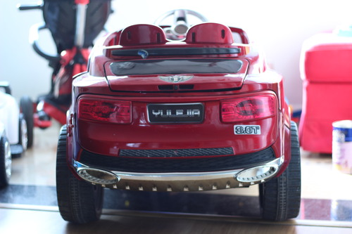</Box>
                    <Box>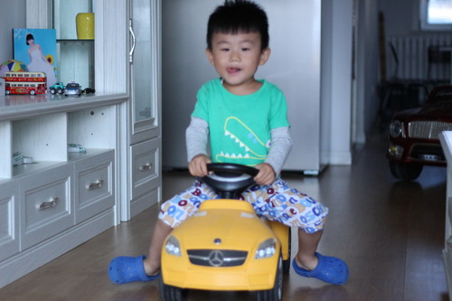</Box>
                    <Box>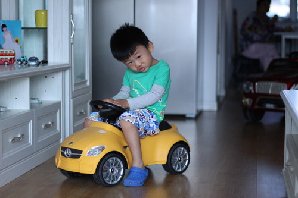</Box>
                    <Box>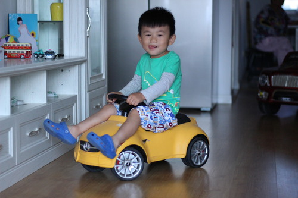</Box>
                    <Box>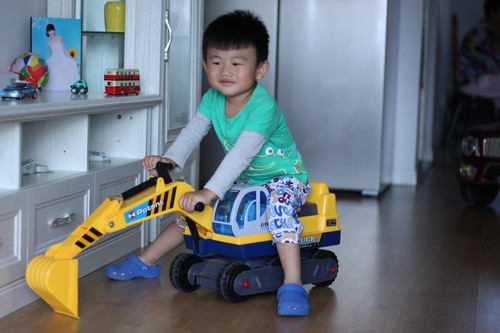</Box>
                    <Box>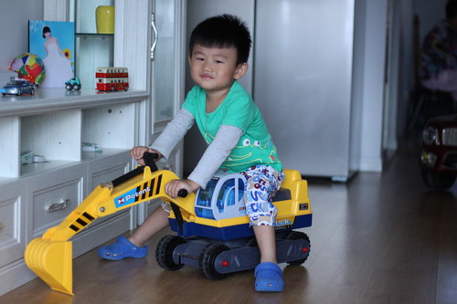</Box>
                </Box>
            </Box>
            , document.querySelector( '#test_Box .test-panel' ) 
        );

    })();

