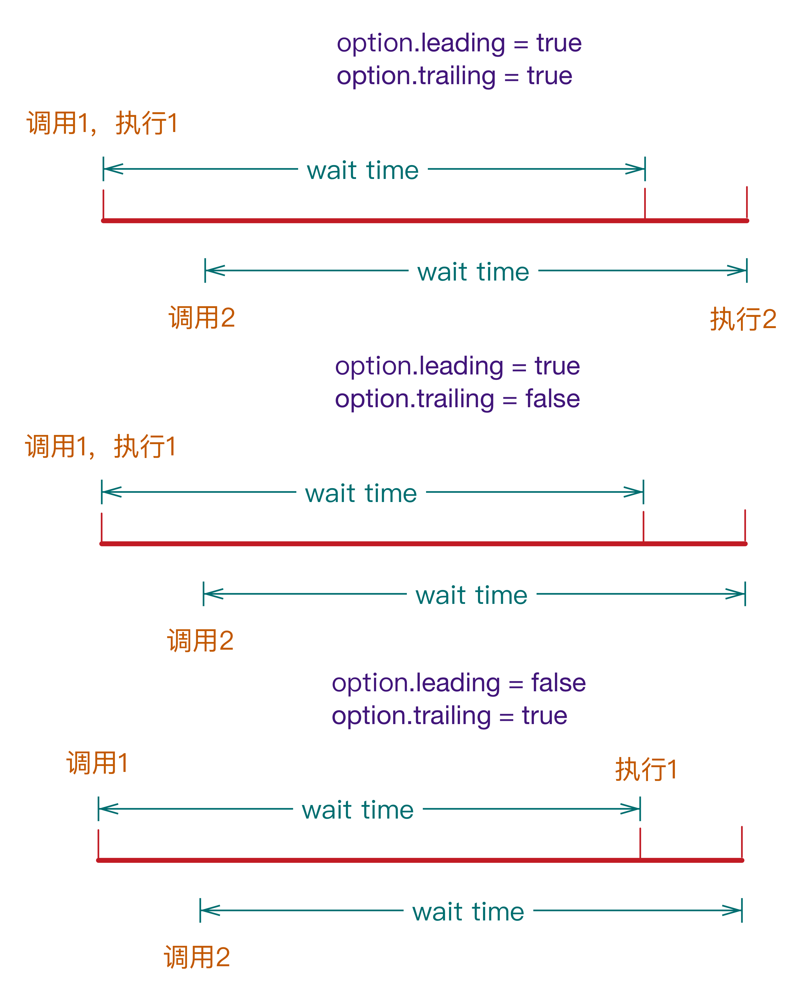

# lodash

> A modern JavaScript utility library delivering modularity, performance, & extras. 

<https://lodash.com>

<https://github.com/lodash/lodash/>

<https://lodash.com/docs>

数组，集合，日期，常用函数，类型，数学，字符串等常用操作的封装。

和underscore定位类似。

<http://www.infoq.com/cn/news/2015/06/underscore-lodash-merging?utm_campaign=infoq_content&>

## 二、Collection操作

### 2.1 _.countBy()

    @[data-script="javascript"]
    (function(){

        var s = createShow('#test_10');
        var rslt = _.countBy([6.1, 4.2, 6.3], Math.floor);
        s.show(1, rslt);

        rslt = _.countBy(['one', 'two', 'three'], 'length');
        s.append_show(2, rslt);

    })();

### 2.2 _.every()

    _.every(collection [, predicate=_.identity])

验证集合中所有元素对于`predicate`断言是否都返回true。是则true，否则false。

    @[data-script="javascript"]
    (function(){

        var s = createShow('#test_20');
        var rslt;

        var users = [
            { 'user': 'barney', 'age': 36, 'active': false }
            , { 'user': 'fred',   'age': 40, 'active': false }
        ];

        rslt = _.every([true, 1, null, 'yes'], Boolean);
        s.show(3, rslt);

        rslt = _.every(users, {user: 'barney', 'active': false});
        s.append_show(4, rslt);

        rslt = _.every(users, ['active', false]);
        s.append_show(5, rslt);

    })();

### 2.3 _.filter()

    _.filter(collection [, predicate=_.identity])

对集合的每个元素使用断言`predicate`进行过滤，返回true的元素放入返回数组中。返回值为一个数组。

    @[data-script="javascript"]
    (function(){

        var s = createShow('#test_30');

        var rslt;

        var users = [
            { 'user': 'barney', 'age': 36, 'active': false }
            , { 'user': 'fred',   'age': 40, 'active': false }
        ];

        rslt = _.filter(users, function(o) { return !o.active; });
        s.show(6, rslt);

        rslt = _.filter(users, {'age': 36, 'active': false});
        s.append_show(7, rslt);

        rslt = _.filter(users, ['active', false]);
        s.append_show(8, rslt);

        rslt = _.filter(users, 'age');
        s.append_show(9, rslt);

    })();

### 2.4 _.partition()

    _.partition(collection [, predicate=_.identity])

将集合进行分区，分为两个区，每个区用数组表示。第一个区的元素对断言返回true，第二个区为false。

    @[data-script="javascript"]
    (function(){

        var s = createShow('#test_40');

        var rslt;

        var users = [
            { 'user': 'barney',  'age': 36, 'active': false }
            , { 'user': 'fred',    'age': 40, 'active': true }
            , { 'user': 'pebbles', 'age': 1,  'active': false }
        ];

        rslt = _.filter(users, function(o) { return !o.active; });
        s.show(1, rslt);

        rslt = _.filter(users, {'age': 1, 'active': false});
        s.append_show(2, rslt);

        rslt = _.filter(users, ['active', false]);
        s.append_show(3, rslt);

        rslt = _.filter(users, 'active');
        s.append_show(4, rslt);

    })();

### 2.5 _.reduce()

    _.reduce(collection [, iteratee=_.identity [, accumulator]])

将集合元素归约为一个值，每个元素都执行iteratee，前一次执行的结果通过accumulator传递给下一次执行。

    @[data-script="javascript"]
    (function(){

        var s = createShow('#test_50');

        var rslt;

        rslt = _.reduce(
                [1, 2, 3, 4, 5]
                , function(sum, n) { return sum + n; }
                , 0
            );
        s.show(1, rslt);

        rslt = _.reduce(
                {michael:10, even:20, karen:10}
                , function(result, value, key) { 
                    (result[value] || (result[value] = [])).push(key);
                    return result;
                }
                , {} 
            );
        s.append_show(2, rslt);

    })();

### 2.6 _.sortBy()

    _.sortBy(collection [,iteratees=_.identity [, ...]])

`稳定排序`。所有元素逐次运行iteratees（`支持多级排序`），根据返回值进行排序。iteratees只接收一个参数，value字段。

    @[data-script="javascript"]
    (function(){

        var s = createShow('#test_60');

        var rslt;

        var users = [
            { 'user': 'fred',   'age': 48 }
            , { 'user': 'barney', 'age': 36 }
            , { 'user': 'fred',   'age': 40 }
            , { 'user': 'barney', 'age': 34 }
        ];

        rslt = _.sortBy(users, function(o){ return o.user; });
        s.show(1, rslt);

        rslt = _.sortBy(users, ['user', 'age']);
        s.append_show(2, rslt);

        rslt = _.sortBy(users, 'user', 'age');
        s.append_show(3, rslt);

        rslt = _.sortBy(users, 'user', function(o){
            return Math.floor(o.age / 10);
        });
        s.append_show(4, rslt);

    })();

## 三、Function工具

### 3.1 _.throttle()

    _.throttle(func [, wait=0 [, options={} ]])

    _.throttle(func, [wait=0], [options={}], [options.leading=true], [options.trailing=true])

> 在设置的超时时间内，最多执行一次。

疑问：
1. 第4和第5个参数貌似设置后不生效
2. 最后的多余参数会作为func的参数，貌似也不生效

    @[data-script="javascript"]
    (function(){

        var s = createShow('#test_70');

        var i = 1
            , j = 1
            , timer1 = null
            , timer2 = null
            , step = 100
            , throttled = 
                _.throttle(
                    function(info){
                        s.append_show('called ' + (j++) + ' times ' + info); 
                    }
                    , step * 3
                    , {
                        leading: false
                        , trailing: true
                    }
                    // arguments below take no effects
                    , true 
                    , true 
                    , 'abc'
                )
            ;

        s.show('start ...');
        timer1 = setInterval(function(){
            s.append_show(step * (i++) + ' ms elapsed' ); 
            if(i > 7) {
                clearInterval(timer1);
                clearInterval(timer2);
            }
            // throttled.cancel();
            // s.append_show('throttled.cancel()');
        }, step);        

        timer2 = setInterval(throttled, step);        

    })();

> leading和trailing都为true的时候，两次间隔小于wait的调用，能触发两次func的执行。 

    @[data-script="javascript"]
    (function(){

        var s = createShow('#test_80');

        $('#test_80_btn_10').on(
            'click'
            , _.throttle(
                function(){
                    s.append_show('按钮响应，3s内最多响应一次，前、后边界');
                }
                , 3000
            ) 
        );

        $('#test_80_btn_20').on(
            'click'
            , _.throttle(
                function(){
                    s.append_show('按钮响应，3s内最多响应一次，前边界');
                }
                , 3000
                , {
                    leading: true
                    , trailing: false
                }
            ) 
        );

        $('#test_80_btn_30').on(
            'click'
            , _.throttle(
                function(){
                    s.append_show('按钮响应，3s内最多响应一次，后边界');
                }
                , 3000
                , {
                    leading: false
                    , trailing: true
                }
            ) 
        );
    })();

<button id="test_80_btn_10">3s响应一次（前、后边界）</button>
<button id="test_80_btn_20">3s响应一次（前边界）</button>
<button id="test_80_btn_30">3s响应一次（后边界）</button>

