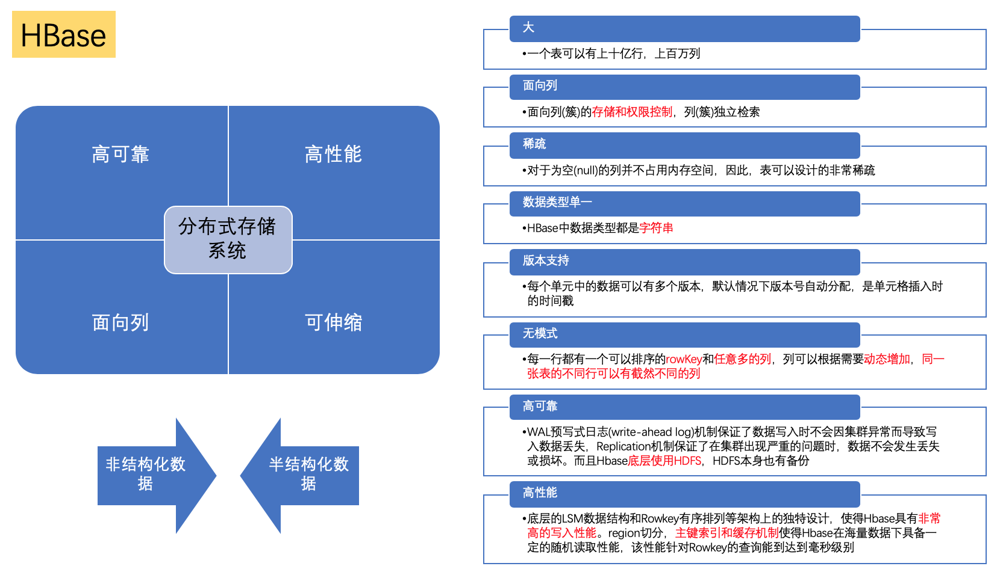

# hbase

* **列式**存储
* 类似于Google的BigTable
* 用于存储**数十亿行 * 数百万列**的超级大表

> 是一个**高可靠性、高性能、面向列、可伸缩**的分布式存储系统，主要用来存储**非结构化和半结构化的松散数据**。HBase可以通过**水平扩展**的方式，利用**廉价计算机集群**处理由**超过10亿行**数据和数百万列元素组成的数据表。

## 图解

* 

## HBase的优点

* (1)大：一个表可以有上十亿行，上百万列。
* (2)面向列：面向列(簇)的存储和权限控制，列(簇)独立检索。
* (3)稀疏：对于为空(null)的列并不占用内存空间，因此，表可以设计的非常稀疏。
* (4)多版本：每个单元中的数据可以有多个版本，默认情况下版本号自动分配，是单元格插入时的时间戳。
* (5)数据类型单一：HBase中数据类型都是字符串。
* (6)无模式：每一行都有一个可以排序的rowKey和任意多的列，列可以根据需要动态增加，同一张表的不同行可以有截然不同的列。
* (7)高可靠性：WAL预写式日志(write-ahead log)机制保证了数据写入时不会因集群异常而导致写入数据丢失，Replication机制保证了在集群出现严重的问题时，数据不会发生丢失或损坏。而且Hbase底层使用HDFS，HDFS本身也有备份。
* (8)高性能：底层的LSM数据结构和Rowkey有序排列等架构上的独特设计，使得Hbase具有非常高的写入性能。region切分，主键索引和缓存机制使得Hbase在海量数据下具备一定的随机读取性能，该性能针对Rowkey的查询能到达到毫秒级别。

现场的数据特点是：数据量比较大，数据列比较稀疏，并且**字段级别加密存储**，使用Hbase进行存储能保证数据不容易发生丢失或者损坏，保证高速的数据写入和读取，机器和存储空间占用低，同时还能兼顾后期的数据挖掘分析等的方便调用。

