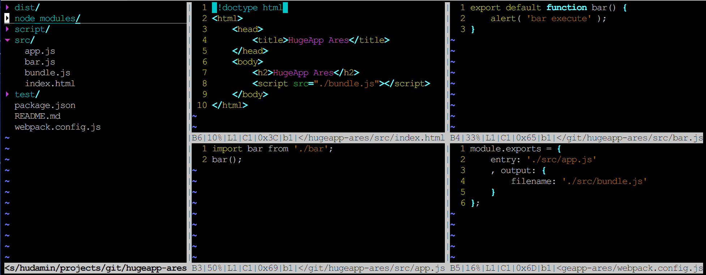

# webpack

>  CommonJS Module Bundler。智能的`模块打包器`。但不仅仅是一个打包器。

`天生`对`SPA`有很好的支持，但是也支持`AMD`。通过复用模块拆分，也能很好的支持`MP`。

> 注：编写此篇文档的时候，`webpack 2`尚未正式发布。`webpack 2`相关内容移步<ref://./webpack2.md.html>

## Resources

* site: <https://webpack.github.io>
* docs: <http://webpack.github.io/docs/>
* get started: <http://webpack.github.io/docs/tutorials/getting-started/>
* 相关: `Browserify` - <ref://./browserify.md.html>
* 「 入门 Webpack，看这篇就够了 」 - <https://segmentfault.com/a/1190000006178770>

## Features

* 模块`打包`，可以将`css`甚至`image`文件都以`js`的方式打包。
* `依赖分析`获得依赖图谱( `dependency graph` )
* 通过`loader`可以支持`各种`前端中间`文件类型`：.jade, .coffee, .less, .sass, .jsx等
* 两个很关键的抽象：`loader`, `plugin`
* `loader`是一个输出一个`函数`的node模块，`plugin`是符合特定接口的类（比如`.apply()`方法，在install时被调用一次），它可以使用webpack引擎提供的功能，可以使用`compiler`和`compilation`对象。
* `loader`的使用，需要了解清楚其`输入输出`，了解清楚了就不会迷惑了
* `loader`和`plugin`很丰富，还支持自行扩展。有些功能是重叠的，不同配置可能达到同样的效果。
* js模块`复用`，`自动`支持复用模块提取
* `SPA`和`MP`有对应的适合的loader或plugin，建议项目更加`纯粹`，要么都使用SPA，要么就是用MP，因为混合容易造成冲突。
* webpack对inline require的解析是`右结合`的，你会在输出中看到`__webpack_require( N )`的形式

 

最基本的使用方式——`pack(打包)`：
 

## 常用loaders/plugins

### loaders

    babel-loader
    vue-loader

    less-loader
    sass-loader
    css-loader
    style-loader
    bootstrap-sass-loader

    html-loader

    extract-loader
    file-loader
    url-loader

    bundle-loader

### internal plugins

    webpack.BannerPlugin
    webpack.optimize.UglifyJsPlugin
    webpack.optimize.OccurenceOrderPlugin
    webpack.optimize.CommonsChunkPlugin

### third plugins

    html-webpack-plugin
    extract-text-webpack-plugin
    copy-webpack-plugin

## 安装

### 版本

> 版本1和后续版本在配置文件格式上有`较大差异`

1. webpack 1.x
2. webpack 2.x
3. webpack 3.x

### webpack

安装`webpack`主程序。

    npm install -g webpack
    npm install webpack

### loaders

`npm@3.x`开始，`npm install`不会自动安装依赖，所以在新版中以下安装时需要写全。

#### babel-loader

    npm install --save-dev babel-loader babel-core babel-preset-es2015 babel-preset-react

解析`es2015`, `react`等新式语法。

#### style/css loader

    npm install --save-dev style-loader css-loader

* `css-loader`: 对css文件的`@import`， `url(...)`等进行require解析，返回字符串形式的CSS内容。与`import`配合使用，可以将`local化`的selector通过对象返回，方便在js中使用。
* `style-loader`: 将css文件添加至Document

#### css preprocessor loader

    npm install --save-dev sass-loader less less-loader

css预处理语法解析。

#### file-loader

    npm install --save-dev file-loader

文件`打包`发送至输出目录。

#### url-loader

    npm install --save-dev url-loader

同file-loader，同时还新增支持`Data URI`功能，适合图片资源的处理。

#### html-loader

    npm install --save-dev html-loader

html文件的解析，输出为`字符串`。它能对`html`文件的`标签属性`进行`require`解析。
还可以对输出做html`压缩`。

#### extract-loader

    npm install --save-dev extract-loader

提取功能。从`bundle`中将require请求的`css`提取出来；从`html`中将`img`，`css`引用提取出来。适合用于发布版本的优化处理。

#### bundle-loader

    npm install --save bundle-loader

封装`require.ensure()`，使代码懒加载的实现逻辑更简单。<https://github.com/webpack-contrib/bundle-loader> <iframe src="http://258i.com/gbtn.html?user=webpack-contrib&repo=bundle-loader&type=star&count=true" frameborder="0" scrolling="0" width="105px" height="20px"></iframe>

* React-Router 4建议的`代码分割`( code splitting )方式：<https://reacttraining.com/react-router/web/guides/code-splitting>，它推荐使用`bundle-loader`，其star数相比react-loadable较少。
* 另外，`react-lodable`组件直接从组件级别，而不是loader级别来解决问题，提供更强大的扩展功能，应该是更好的选择。<ref://../react/react-loadable.md.html>

#### vue-loader

    npm install --save-dev vue-loader

* github: <https://github.com/vuejs/vue-loader>
* docs: <https://vue-loader.vuejs.org/zh-cn/start/spec.html>

versions:

    8.x： webpack 1
    9.x:  webpack 2+

`vue-cli`创建项目：

    npm install -g vue-cli
    vue init webpack-simple hello-vue
    cd hello-vue
    npm install
    npm run dev

css`作用域`支持：

    

    <template>
        
hi

    </template>

转换成：

    

    <template>
        
hi

    </template>

> `vue-loader`提供的css作用域的`优势`：

* 组件内编写的内容不会影响其他组件以及全局
* 但提供了`全局`更改某个类，来`影响`组件的样式

### internal plugins

在`webpack.*`命名空间下，可以直接通过new关键字创建实例。比如：

	new webpack.BannerPlugin
    new webpack.optimize.UglifyJsPlugin
    new webpack.optimize.OccurenceOrderPlugin

等。

### third plugins

> `第三方插件`都通过`github + npm`的方式发布。可以通过npm install安装

插件列表：<https://webpack.github.io/docs/list-of-plugins.html>

#### html-webpack-plugin

github: <https://github.com/ampedandwired/html-webpack-plugin> <iframe src="http://258i.com/gbtn.html?user=jantimon&repo=html-webpack-plugin&type=star&count=true" frameborder="0" scrolling="0" width="105px" height="20px"></iframe>

    npm install --save-dev html-webpack-plugin

html文件自动生成，或者按模板生成。简化创建一个html文件来调用webpack生成的bundle文件的过程，该插件会为你自动生成对应的html文件。

基于`html-webpack-plugin`插件扩展的其他插件：
* `html-webpack-inline-source-plugin`，支持将`资源内联化`: <https://github.com/DustinJackson/html-webpack-inline-source-plugin>
* `html-webpack-inline-svg-plugin`，支持svg内联化: <https://github.com/thegc/html-webpack-inline-svg-plugin>
* ... todo

#### extract-text-webpack-plugin

> Extract text from bundle into a file.

> webpack团队提供的一款插件，用于将文本`提取`出来`放入`另外一个文件中。

github: <https://github.com/webpack/extract-text-webpack-plugin>

    npm install --save-dev extract-text-webpack-plugin

提取插件。有`extract-loader`的功能，同时还会将提取的文件`追加`到HTML文件中 `[ important ]`。 

#### copy-webpack-plugin

> Copy files and directories in webpack.

github: <https://github.com/kevlened/copy-webpack-plugin>

## 命令行使用

参考：<https://webpack.github.io/docs/cli.html>

    webpack ./entry.js bundle.js

### loader相关命令行参数 

`global`安装的webpack会存在找不到`preset`的问题，解决方案是将webpack安装在`当前项目`。

`babel-loader`: <https://github.com/babel/babel-loader>

    npm install webpack
    ../node_modules/webpack/bin/webpack.js \
        --module-bind 'js=babel?presets[]=react,presets[]=es2015' \
        --progress --colors \
        ./index.js bundle.js

### 带进度条，颜色

    webpack --progress --colors ./entry.js bundle.js

### 伺服模式

    webpack --progress --colors --watch ./entry.js bundle.js

### Library输出

共有`6种`库输出方式，分别为：`var`, `this`, `commonjs`, `commonjs2`, `amd`, `umd`
，使用`--output-library-target`选项。

<https://webpack.github.io/docs/configuration.html#output-library>

    
#### var方式

    webpack --output-library leafletImage --output-library-target var index.js leaflet-image.js

输出为：

    var leafletImage = xxx;

#### cmd package

    webpack --output-library-target cmd index.js projzh.js

输出为：

    define(...);

#### umd package

    webpack --output-library-target umd index.js projzh.js

#### this package

    webpack --output-library-target this index.js projzh.js

输出为：

    this["Library"] = xxx;

## 使用配置文件

使用配置文件后，就不需要在`webpack`的命令行调用中添加`过多`参数，虽然配置项也可以通过命令行参数传递。

* new version: 
    * `options`: <https://webpack.js.org/configuration/>
    * concepts: <https://webpack.js.org/concepts/configuration/>
* old version ( deleted ): <s><http://webpack.github.io/docs/configuration.html></s> 

### 配置点

1. 区别`develeopment`和`production`状态
    * 使用`webpack.DefinePlugin( ... )`

            new webpack.DefinePlugin({
              'process.env': {
                NODE_ENV: JSON.stringify('development')
                , WS_API: JSON.stringify( getArgVal( '--wsapi' ) )
              }
            })

    * 命令行`export PNAME=...`
    * `maybe`: `webpack --define <string>=<string>`
    
    然后在config代码中使用`process.env.*`获取状态。

2. `样式`文件是否需要抽取成单独文件
3. html文件`自动引用`样式文件和脚本文件
4. `多个html文件`自动引用样式文件和脚本文件

待续

### 配置文件

配置文件默认为`webpack.config.js`。

最基本的配置文件，只配置了`单文件`的输入输出，举例如下：

    module.exports = {
        entry: './src/app.js'
        , output: {
            filename: './src/bundle.js'
        }
    };

以下为复杂一点的配置，`多文件、使用loader及plugin`，例子：

    var dir = __dirname;
    var webpack = require('webpack');
    var HtmlWebpackPlugin = require('html-webpack-plugin');

    module.exports = {
        entry: {
            vendor: [ 'jquery' ] 
            , app: dir + "/src/index"
        }
        , output: {
            path: dir + '/dist'
            , filename: "[name].js"
        }
        , module: {
            loaders: [
                {
                    test: /\.css$/
                    , loader: 'style!css'
                }
                , { 
                    test: /\.jsx?$/
                    , loader: 'babel?presets[]=es2015,presets[]=react'
                }
            ]
        }
        , plugins: [
            new HtmlWebpackPlugin()
            , new HtmlWebpackPlugin({
                title: 'Todos App'
                , filename: 'todos.html' 
                , template: dir + '/src/index.html'
                , inject: 'head'
            })
            , new webpack.optimize.UglifyJsPlugin({
                compress: {
                    warnings: false
                }
            })
            , new webpack.optimize.CommonsChunkPlugin({
                name: 'vendor'
                , minChunks: Infinity
            })
        ]
    }; 

### 可配置项

#### 配置项须知

1. `context`作为项目根路径，建议`不要`设置成源码根路径，比如（`__dirname + '/src'`）。这样设置的话，默认情况下会导致module查找不到的错误，而不得不设置`resolve`。
2. 续第一点来说，设置`resolve`的好处之一是可以`复用`webpack的`module`路径

#### 配置项列表

* `options`: <https://webpack.js.org/configuration/>

配置文件包含的可配置选项：

	context // 项目根路径，必须是绝对路径
	entry  	// 指定bundle的入口点，可以是字符串（单入口）、数组或对象，解析方法各不相同
	output
		output.filename
		output.path
		output.publicPath
		output.chunkFilename
		output.sourceMapFilename
		output.devtoolModuleFilenameTemplate
		output.devtoolFallbackModuleFilenameTemplate
		output.devtoolLineToLine
		output.hotUpdateChunkFilename
		output.hotUpdateMainFilename
		output.jsonpFunction
		output.hotUpdateFunction
		output.pathinfo
		output.library
		output.libraryTarget
		output.umdNamedDefine
		output.sourcePrefix
		output.crossOriginLoading
	module
		module.loaders
		module.preLoaders, module.postLoaders
		module.noParse
		automatically created contexts defaults module.xxxContextXxx
	resolve
		resolve.alias
        resolve.aliasFields         v2.x
		resolve.root
		resolve.modulesDirectories  v1.x
		resolve.modules             v2.x
		resolve.fallback
        // automatically resolve certain extensions, defaults to [ ".js", ".json" ]
		resolve.extensions
		resolve.packageMains
		resolve.packageAlias
		resolve.unsafeCache
		resolveLoader
		resolveLoader.moduleTemplates
	externals
	target
	bail
	profile
	cache
	debug
	devtool
	devServer
        devServer.after
        devServer.allowedHosts
        devServer.before
        devServer.bonjour
        devServer.clientLogLevel
        devServer.color - CLI only
        devServer.compress
         devServer.contentBase
        devServer.disableHostCheck
        devServer.filename
         devServer.headers
        devServer.historyApiFallback
         devServer.host
        devServer.hot
        devServer.hotOnly
        devServer.https
        devServer.index
        devServer.info - CLI only
        devServer.inline
        devServer.lazy
        devServer.noInfo
        devServer.open
        devServer.openPage
        devServer.overlay
        devServer.pfx
        devServer.pfxPassphrase
         devServer.port
         devServer.proxy
        devServer.progress - CLI only
        devServer.public
         devServer.publicPath
        devServer.quiet
        devServer.setup
        devServer.socket
        devServer.staticOptions
        devServer.stats
        devServer.stdin - CLI only
        devServer.useLocalIp
        devServer.watchContentBase
        devServer.watchOptions  
	node
	amd
	loader
	recordsPath, recordsInputPath, recordsOutputPath
	plugins

### html文件处理

#### html文件自动生成

需要使用`plugins`配置项来引入插件`HtmlWebpackPlugin`

`HtmlWebpackPlugin`插件: <https://github.com/ampedandwired/html-webpack-plugin>

相关配置文件：

    ...
    var HtmlWebpackPlugin = require('html-webpack-plugin');

    module.exports = {
        ...
        , plugins: [
            new HtmlWebpackPlugin()
        ]
        ...
    };

以上配置会在dist目录下自动生成`index.html`文件，并在`body`中引用`bundle.js`。脚本默认都是插入到body末尾，通过设置`inject`配置项，可以将脚本插入到`head`部分。

#### 提供html模板

比如`./src/index.html`内容如下：

    <!DOCTYPE html>
    <html>
    <head>
    <title><%= htmlWebpackPlugin.options.title %></title>
    <meta name="viewport" 
        content="width=device-width, initial-scale=1, maximum-scale=1, user-scalable=no">
    </head>
    <body>
    </body>
    </html>

在title标签处使用`模板`语法将`title`配置项引入：

    <title><%= htmlWebpackPlugin.options.title %></title>

并在配置文件`webpack.config.js`中的`plugins`中添加一个`新的`HtmlWebpackPlugin`实例`：
    
    ...
    , plugins: [
        new HtmlWebpackPlugin()
        , new HtmlWebpackPlugin({
            filename: 'todos.html'          // 输出文件名
            , title: 'Todos App'            // 模板标题字段
            , template: './src/index.html'  // 模板文件，支持loader
        })
    ]
    ...
    

`注意`：HtmlWebpackPlugin的`首字母`大小写在配置文件和模板中不一样。

同时，`template`字段`支持``loader`，可以在解析模板前做其他解析。但是如果使用了loader，那么`title`替换就`不生效`了。

#### 内联脚本

两种方式：
1. 使用`模板`，将需要内联的文件`原封不动`的输出到html中
2. 使用`html-webpack-plugin`的子插件`html-webpack-inline-source-plugin`，这时需要`html-webpack-plugin`的版本高于`2.24.0`，其`html-webpack-plugin-alter-asset-tags`hook才会正确执行。此种方式输出内容为`webpack package`的方式，而非原封不动。

#### html优化

webpack支持html文件的自动生成，非常方便。但是项目中也避免不了存在自行编写的html文件，因为它比较轻量级，不需要由js来加载，这种html文件如何处理呢？

答案是： `file-loader`和`extract-loader`

> file loader for webpack.

> webpack loader to extract `HTML` and `CSS` from the bundle.

通过以上两个loader的配合，可以对html文件进行提取，将html文件内引用的`css`，`img`等资源按发布后的格式来引用，比如替换路径，添加hash等。

举例如下：

`输入`：

    <html>
    <head>
        <link href="main.css" type="text/css" rel="stylesheet">
    </head>
    <body>
        
    </body>
    </html>

`输出`：

    <html>
    <head>
        <link href="7c57758b88216530ef48069c2a4c685a.css" type="text/css" rel="stylesheet">
    </head>
    <body>
        
    </body>
    </html>

`配置文件`：

    var path = require('path');
    var indexHtml = path.join(__dirname, 'app', 'index.html');

    module.exports = {
        entry: [
            ...
            , indexHtml
        ],
        ...
        module: {
            loaders: [
                {
                    test: indexHtml,
                    loaders: [
                        "file?name=[name].[ext]",
                        "extract",
                        "html?" + JSON.stringify({
                            attrs: ["img:src", "link:href"]
                        })
                    ]
                },
                {
                    test: /\.css$/,
                    loaders: [
                        "file",
                        "extract",
                        "css"
                    ]
                },
                {
                    test: /\.jpg$/,
                    loader: "file"
                }
            ]
        }

    };

* `entry`配置中增加`html`类型的依赖链起点，目的是使html文件中的css、img等资源成为`依赖图谱`的`被依赖资源`，会被webpack作为module处理
* `html-loader`将解析html文件中的指定属性：`["img:src", "link:href"]`，这些属性对应的资源会被作为module处理

### css文件处理

css文件可能需要在js代码中`require`；也可能是用sass编写，还可能使用less编写。
处理过程可以使用`style-loader`, `css-loader`, `less-loader`, `sass-loader`等loaders。

#### css编译

`css-loader`： 解析`@import`, `url(...)`之类的语法。

    ...
    , loaders: [
        {
            test: /\.css$/,
            , loader: 'style!css?root=.'

            // 打开压缩
            // , loader: 'style!css?minimize'

            // 关闭压缩
            // , loader: 'style!css?-minimize'

            // 关闭url(...)处理逻辑
            // , loader: 'style!css?-url'

            // 关闭@import处理逻辑
            // , loader: 'style!css?-import'

            // 开启驼峰类名 
            // , loader: 'style!css?camelCase'

            // 设置local化selector的格式 
            // , loader: 'style!css?localIdentName=[path][name]---[local]--[hash:base64:7]'

        }
    ]
    ...

另外，`css-loader`中引入非常重要的机制，对`component化`非常重要：

* `:local`, `:local(...)`，local化的selector才会在import的对象中获取到
* `:global`, `:global(...)`
* 查询参数：
    * `modules`参数，提供默认开启local module模式
    * `camelCase`参数，支持类名引用的驼峰模式
    * `localIdentName`参数，支持类名实际值的格式指定
    * `-url`，关闭url解析；`-import`，关闭@import解析

其他相关功能：
* Local Scope: <https://github.com/webpack/css-loader#local-scope>
* CSS Modules: <https://github.com/webpack/css-loader#css-modules>
	，理解css-modules，可以查看`build-tools/css-modules`

#### css预编译

* `less-loader`: 解析`.less`文件
* `sass-loader`: 解析`.sass`文件
* `bootstrap-sass-loader`: 解析Sass版本的Bootstrap，支持`自定义`打包

#### css优化

发布版本的css，特别是公共样式，如果都由js来加载，会影响展现速度和效果。希望可以`单独打包`成一个`文件`通过`link`标签加载，达到与js的`并发`加载。

可以使用`extract-loader`或者`extract-text-webpack-plugin`

##### extract-loader

`github`: <https://github.com/peerigon/extract-loader> <iframe src="http://258i.com/gbtn.html?user=peerigon&repo=extract-loader&type=star&count=true" frameborder="0" scrolling="0" width="105px" height="20px"></iframe>

从bundle里提取`html`或者`css`，所以`前提`是html和css在bundle中被`引用`。

可以这么理解，默认情况下，css文件会打包在bundle里，通过js安装到DOM中，有了extract-loader，会将bundle中这部分css内容单独拎出来成为一个文件，而不放入bundle。

作为文件输出到output目录，需要和`file-loader`配合使用。

    ...
    , loaders: [
        {
            test: /\.css$/
            , loader: 'file?name=[name].[ext]!extract!css' 
        }
    ]
    ...

以上配置针对在js中使用`require()`引用的css文件有效。如果css文件只在某个独立的html文件中引用，是不会被提取的。如果需要也被提取，则需要将对应的html文件添加到entry中，也作为一个`依赖链起点`。 

##### extract-text-webpack-plugin

`github`: <https://github.com/webpack/extract-text-webpack-plugin> <iframe src="http://258i.com/gbtn.html?user=webpack-contrib&repo=extract-text-webpack-plugin&type=star&count=true" frameborder="0" scrolling="0" width="105px" height="20px"></iframe>

功能基本上同`extract-loader`，`不同`的是，它是一个插件，有更强大的功能，该plugin可以将得到的独立文件`inject`到引用的html文件中。

配置文件：

    var ExtractTextPlugin = require("extract-text-webpack-plugin");
    module.exports = {
        module: {
            loaders: [
                { 
                    test: /\.css$/
                    , loader: ExtractTextPlugin.extract("css-loader") 
                }
            ]
        },
        plugins: [
            new ExtractTextPlugin("styles.css")
        ]
    }

### js文件处理

#### js编译 

js文件可能有`es2015`或者`react`的语法，这些情况都可以通过配置相应loader来解决 —— `babel-loader` 

* `babel-loader options`: <http://babeljs.io/docs/usage/options/>
* `github`: <https://github.com/babel/babel-loader>

并且在配置文件中添加`loaders`配置，如下：

	...
	, module: {
			loaders: [
				{ 
					test: /\.jsx?$/
					, loader: 'babel?presets[]=es2015,presets[]=react'
				}
			]
		}
	...

以上配置，支持js文件的`es2015`以及`react`语法。

#### js压缩

使用webpack自带的`UglifyJsPlugin`插件，该插件使用了`UglifyJS2`: <https://github.com/mishoo/UglifyJS2#usage>

    ...
    , plugins: [
        new webpack.optimize.UglifyJsPlugin({
            compress: {
                warnings: false
            }
            , mangle: [
                '$'
                , 'exports'
            ]
        })
    ]
    ...

#### js模块复用

相关插件： `CommonsChunkPlugin`，是webpack自带插件。<https://webpack.js.org/plugins/commons-chunk-plugin/>

`1. 自动抽取复用模块`：

    ...
    , plugins: [
        ...
        , new webpack.optimize.CommonsChunkPlugin({
            name: 'commons'
            // , filename: 'different-name.js'

            // Modules must be shared between 3 entries 
            , minChunks: 3
        })
        ...
    ]
    ...

自动统计模块的引用计数，至少被3个模块引用的模块，单独打包成`common.js`文件。

`2. 显式指定复用模块`：

在`entry`字段中显式设置，并在`plugins`字段中做对应配置：   

    , entry: {
        vendor: [ 'jquery' ]
        , app: './src/index'
    }
    ...
    , plugins: [
        ...
        , new webpack.optimize.CommonsChunkPlugin({
            name: 'vendor'
            // , filename: 'different-name.js'
            // （ with more entries, this ensures that no other module
            //  goes into the vendor chunk )
            , minChunks: Infitity
        })
        ...
    ]
    ...
    
`3. 异步复用模块`：

todo

### 图片等文件的处理

#### 路径处理

使用以下loader：

* `file-loader`
* `url-loader`

配置文件举例：

    ...
    , loaders: [
        {
            test: /\.jpg$/
            , loader: 'file'
        }
        , {
            test: /\.png$/
            , loader: 'url?mimetype=image/png&limit=4000'
        }
    ]
    ...

#### 其他优化

压缩？

todo

### 垫片模块处理

shimming

## 针对SPA和MPA的优化

主要关键点在于复用模块的拆分。插件`CommonsChunkPlugin`起到了很关键的作用。

参考： <https://webpack.github.io/docs/optimization.html>

## loader技术

> Loaders are transformations that are applied on a resource file of your app.

> `加载器`是webpack很关键的抽象之一

1. 是一种`转换器`
2. 作用于`文件`

### Features

1. 可以`链式`串联。loader在管道中运行。`最后`一个loader`返回js`，其他loader可能返回任意格式的资源，用于下一个loader的输入
2. 可同步亦可异步
3. 运行在`nodejsi`中，大有发挥空间
4. 可接受query params，也可接受配置文件
5. 可以`绑定`至`文件扩展`名或者`正则`表达式
6. 可以通过npm发布或者安装
7. Normal modules can export a loader in addition to the normal main via package.json loader.
8. 可以获取配置文件
9. `插件`可以为loader提供更多特性
10. loader可以`输出`任意格式的额外`文件`
11. loader同module一样进行解析，[?]比如`--module-bind`

### 参考：

* loader使用：<https://webpack.github.io/docs/using-loaders.html>
* 常见loader列表：<https://webpack.github.io/docs/list-of-loaders.html>

### 三种使用方式

1. require `inline`，`!`用于分隔loader与资源，也可分隔多个loader；`?`用于分隔loader与query params

        require( "./loader!./dir/file.txt" );
        require( "jade!./template.jade" );
        require( "!style!css!less!bootstrap/less/bootstrap.less" );

    规则首部的`!`将重写相关文件的其他变换，也即作用于相关文件的其他变换将不再执行。

2. `configuration`

		{
			module: {
				loaders: [
					{ test: /\.jade$/, loader: "jade" },
					// => "jade" loader is used for ".jade" files

					{ test: /\.css$/, loader: "style!css" },
					// => "style" and "css" loader is used for ".css" files
					// Alternative syntax:
					{ test: /\.css$/, loaders: ["style", "css"] },
				]
			}
		}

3. `CLI`参数， `--module-bind`

        webpack --module-bind jade --module-bind 'css=style!css'

### loader命名规范 

`style-loader`, `style`，两者`皆可`，后者为`缩写`方式。

### 有用的loader

#### basic类

1. script: <https://github.com/webpack/script-loader>
2. base64: <https://github.com/antelle/base64-loader>
3. to-string: <https://github.com/gajus/to-string-loader>

#### packaging类

1. `file`: <https://github.com/webpack/file-loader>

    将文件输出到`output`目录，并返回`public url`。

        var url = require("file-loader!./file.png");
        // => emits file.png as file in the output directory and returns the public url
        // => returns i. e. "/public-path/0dcbbaa701328a3c262cfd45869e351f.png"

        var url = require("file-loader!emitFile=false!./file.png");

    其他例子：

        require("file-loader?name=[name].[ext]&publicPath=assets/foo/&outputPath=app/images/");

    filename template:

        [path][name].[ext]

        require("file-loader?name=html-[hash:6].html!./page.html");
        // => html-109fa8.html

        require("file-loader?name=img-[sha512:hash:base64:7].[ext]!./image.jpg");
        // => img-VqzT5ZC.jpg

        require("file-loader?name=[path][name].[ext]?[hash]!./dir/file.png")
        // => dir/file.png?e43b20c069c4a01867c31e98cbce33c9

2. `url`: <https://github.com/webpack/url-loader>

    依赖`file-loader`，除了具有file-loader的功能外，可以对文件大小小于某个阈值时，输出`DataURI`

        require("url-loader?limit=10000!./file.png");
        // => DataUrl if "file.png" is smaller than 10kb

        require("url-loader?mimetype=image/png!./file.png");
        // => Specify mimetype for the file (Otherwise it's inferred from extension.)

        require("url-loader?prefix=img/!./file.png");
        // => Parameters for the file-loader are valid too
        //    They are passed to the file-loader if used.

3. `extract`: <https://github.com/peerigon/extract-loader>

    

    与`extract-text-webpack-plugin`类似，可以作为它的简单代替（`简版`）。由于设计原因，主要和`html-loader`以及`css-loader`配合使用，其他的不一定确保好用。

        import stylesheetUrl from "file-loader!extract-loader!css-loader!main.css";
        // stylesheetUrl will now be the hashed url to the final stylesheet

#### templating类

1. html: <https://github.com/webpack/html-loader>

    将`html`文件输出成`字符串`，且可根据需求将输出压缩。可`配置`针对哪些`tag`进行`属性解析`。

2. markdown: <https://github.com/peerigon/markdown-loader>

#### style类

1. `style`: <https://github.com/webpack/style-loader>

    主要功能为将`CSS字符串`内容通过`注入<style>标签`的方式添加到DOM中。同时也可以解析CSS文件的URL。

        require( "style-loader!raw-loader!./file.css" );
        // => add rules in file.css to document

    推荐将`style-loader`和`css-loader`结合使用，`css-loader`能返回CSS文件内容：

        require( "style-loader!css-loader!./file.css" );

    `URL方式`如下：

        require( "style-loader/url!file-loader!./file.css" );

2. `css`: <https://github.com/webpack-contrib/css-loader>

    解析css文件，包括其中的`imports`和`url(...)`，并返回CSS文件的字符串内容

        var css = require( "css-loader!./file.css" );
        // => returns css code from file.css, resolves imports and url(...)

3. `less`: <https://github.com/webpack/less-loader>

    `安装`

        npm install less-loader less --save-dev

    `使用`

        var css = require("!raw-loader!less-loader!./file.less");
        // => returns compiled css code from file.less, resolves imports

        var css = require("!css-loader!less-loader!./file.less");
        // => returns compiled css code from file.less, resolves imports and url(...)s

4. `sass`: <https://github.com/jtangelder/sass-loader>

    `安装`

        npm install sass-loader node-sass webpack --save-dev

    `使用`

        var css = require("!raw-loader!sass-loader!./file.scss");
        // returns compiled css code from file.scss, resolves Sass imports

        var css = require("!css-loader!sass-loader!./file.scss");
        // returns compiled css code from file.scss, resolves Sass and CSS imports and url(...)s

### 编写loader

> just a function

	// Identity loader
	module.exports = function(source) {
	  return source;
	};

	// Identity loader with SourceMap support
	module.exports = function(source, map) {
	  this.callback(null, source, map);
	};

## plugin技术

> Use plugins to add functionality typically related to bundles in webpack.

1. 作用于`bundle`
2. 添加特定功能
3. 使用方式一般通过`创建`一个plugin的`新实例`，放入plugin链表中

### 参考

* <https://webpack.github.io/docs/list-of-plugins.html>
* <https://webpack.github.io/docs/using-plugins.html>
* <https://webpack.github.io/docs/how-to-write-a-plugin.html>

### 编写plugin

一个例子如下：

	function FileListPlugin(options) {}

	FileListPlugin.prototype.apply = function(compiler) {
	  compiler.plugin('emit', function(compilation, callback) {
		// Create a header string for the generated file:
		var filelist = 'In this build:\n\n';

		// Loop through all compiled assets,
		// adding a new line item for each filename.
		for (var filename in compilation.assets) {
		  filelist += ('- '+ filename +'\n');
		}

		// Insert this list into the Webpack build as a new file asset:
		compilation.assets['filelist.md'] = {
		  source: function() {
			return filelist;
		  },
		  size: function() {
			return filelist.length;
		  }
		};

		callback();
	  });
	};

	module.exports = FileListPlugin;

## 解决方案

> 常用的配置方案

1. `create-react-app`提供的`SPA`模板，在其subpackage `react-scripts`中能查阅到
1. 支持amd, umd, cmd等输出
2. 支持提供html模板，自动添入css, js bundle
3. 支持`copyright`添加，并在压缩文件中保留

todo

## APIs

<http://webpack.github.io/docs/api-in-modules.html>

使用webpack编译的代码，支持的`方法`和`变量`。

### Basic

#### require

    require(dependency: String)

同步依赖，不会向服务器发请求。`编译器`会保证依赖的`同步性`。CJS风格。

#### define，带factory

同步调用，不会向服务器发请求。AMD风格。

#### module.exports

CJS风格。

#### exports

CJS风格。

#### define，带value

AMD风格。

### Advanced

#### require.cache

多次require同一模块，`只会执行一次factory`，以及`只有一个export`，所以必然会有cache机制。

以下等式：

    var d1 = require("dependency");
    require("dependency") === d1
    delete require.cache[require.resolve("dependency")];
    require("dependency") !== d1

    // in file.js
    require.cache[module.id] === module
    require("./file.js") === module.exports
    delete require.cache[module.id];
    require.cache[module.id] === undefined
    require("./file.js") !== module.exports // in theory; in praxis this causes a stack overflow
    require.cache[module.id] !== module

#### require.context

#### require.ensure

> `按需(on demand)`下载额外依赖。

    require.ensure(dependencies: String[], callback: function([require]), [chunkName: String])

* 按需加载的模块打成一个`匿名chunk`
* 可为按需加载的模块指定`chunk名称`

以下为例子：

    // in file.js
    var a = require("a");
    require.ensure(["b"], function(require) {
        var c = require("c");
    });
    require.ensure(["d"], function() {
        var e = require("e");
    }, "my chunk");
    require.ensure([], function() {
        var f = require("f");
    }, "my chunk");
    /* This results in:
        * entry chunk
            - file.js
            - a
        * anonymous chunk
            - b
            - c
        * "my chunk"
            - d
            - e
            - f
    */

某个实际按需加载模块的写法：

    module.exports = resolve => {
        require.ensure([], function (require) {
            resolve(require('./index'));
        });
    };

`exports`是一个函数，作为`executor参数`，用于构造一个`Promise`对象。<ref://../frontend/promisejs.md.html>

#### require

    require(dependencies: String[], [callback: function(...)])

与`require.ensure`类似。区别在于`依赖模块`会作为回调函数的`参数`传递进去，同时`不支持`chunk名指定。

    // in file.js
    var a = require("a");
    require(["b"], function(b) {
      var c = require("c");
    });
    /* This results in:
        * entry chunk
            - file.js
            - a
        * anonymous chunk
            - b
            - c
    */

## webpack性能优化

* <https://github.com/webpack/webpack/issues/1574#issuecomment-157520561>
* 如何十倍提高你的webpack构建效率: <http://blog.csdn.net/u011413061/article/details/51872412>

查看性能数据：

    webpack --profile --json > perf.json

<http://webpack.github.io/analyse/>，上传perf.json文件进行分析。

### modulesDirectories

通过指定模块路径，减少模块查找路径。

    resolve: {
      root: path.resolve('.'),
      modulesDirectories: ['node_modules']
    }

### happypack

启用`多线程`加速webpack构建速度，<https://github.com/amireh/happypack> <iframe src="http://258i.com/gbtn.html?user=amireh&repo=happypack&type=star&count=true" frameborder="0" scrolling="0" width="105px" height="20px"></iframe>

1. 多线程设置，根据CPU核数设置，不是越多越好
2. 图片`url-loader`暂有问题，先不使用

### 性能数据

`优化前`：

    122700ms build modules      
    197ms seal
    204ms optimize
    4105ms build modules        
    80ms hashing
    270ms create chunk assets
    69888ms additional chunk assets
    1ms optimize chunk assets 
    639ms optimize assets
    178ms emit
    Hash: 9878fe416d03317f4579
    Version: webpack 1.13.1
    Time: 198294ms

`指定modulesDirectories`：

    103380ms build modules      
    181ms seal
    200ms optimize
    3549ms build modules        
    45ms hashing
    194ms create chunk assets
    70044ms additional chunk assets
    1ms optimize chunk assets 
    811ms optimize assets
    181ms emit
    Hash: 9878fe416d03317f4579
    Version: webpack 1.13.1
    Time: 178615ms

`happypack`加速，3 thread

    23935ms build modules       
    96ms seal
    108ms optimize
    2372ms build modules        
    34ms hashing
    79ms create chunk assets
    54243ms additional chunk assets
    0ms optimize chunk assets 
    461ms optimize assets
    142ms emit
    Hash: 9878fe416d03317f4579
    Version: webpack 1.13.1
    Time: 81617ms

### webpack-bundle-analyzer 

> Webpack `plugin` and `CLI utility` that represents bundle content as convenient interactive zoomable `treemap`

* github: <https://github.com/webpack-contrib/webpack-bundle-analyzer> <iframe src="http://258i.com/gbtn.html?user=webpack-contrib&repo=webpack-bundle-analyzer&type=star&count=true" frameborder="0" scrolling="0" width="105px" height="20px"></iframe>
* report in FoamTree: <ref://./html/webpack-bundle-report.html>

## 开发服务器

> Serves a webpack app. Updates the browser on changes.

* github: <https://github.com/webpack/webpack-dev-server>
* old doc: <s><http://webpack.github.io/docs/webpack-dev-server.html></s>
* doc: <https://webpack.js.org/configuration/dev-server/>

1. 不会输出到`output`目录，而是在内存中。
2. 模块热替换，它通过为webpack的配置文件增加`HotModuleReplacementPlugin`插件来达到热替换。命令行选项为`--hot`，而配置文件为`{ hot: true }`
3. `iframe`模式，只需访问方式更换即可，在根路径前插入一个新的根目录：`http://<<host>>:<<port>>/webpack-dev-server/<<path>>`，其他无需做任何配置上的修改。这种模式会增加一个iframe，但是app的URL变化不会导致浏览器URL的变化。

    另外，注意，如果path为空，那么`webpack-dev-server`后跟的斜线`/`不能省略。比如：

        http://test.irice.com:9000/webpack-dev-server/

    `而不是`：

        http://test.irice.com:9000/webpack-dev-server

4. `inline`模式为默认模式

### 安装及运行

    npm install -g webpack-dev-server
    npm install webpack-dev-server

    webpack-dev-server --progress --colors
    webpack-dev-server --port 9000 --progress --colors

### 启动选项

    contentBase
    hot
    proxy
    host
    port
    open    # 2.0开始支持，能在默认浏览器中打开链接
    ...

### 配置项

使用`devServer`配置项引入webpack-dev-server的配置。

    module.exports = {
        devServer: {
            ...
        }
    };

### proxy选项

    {
        ...
        proxy: {
            "/api": {
                "target": {
                    "host": "action-js.dev"
                    , "protocol": "http:"
                    , "port": 80
                }
                , ignorePath: true
                , changePrigin: true
                , secure: false
            }
        }
    }

### historyApiFallback 选项

使用`browserHistory`，需要服务器将所有url请求都导向首页（`index.html`）输出，避免404。

    { 
        historyApiFallback: true
    }

#### index 子选项

如果`output.publicPath`设置成了`非/`，则需要如下设置，指明首页的路径：

    {
        historyApiFallback: {
            index: '/foo-app/'
        }
    }

#### rewrites 子选项

使用`rewrites`子选项，可以用于静态文件的资源路径重写:

	historyApiFallback: {
		rewrites: [
			// shows views/landing.html as the landing page
			{ from: /^\/$/, to: '/views/landing.html' },
			// shows views/subpage.html for all routes starting with /subpage
			{ from: /^\/subpage/, to: '/views/subpage.html' },
			// shows views/404.html on all other pages
			{ from: /./, to: '/views/404.html' },
		]
	},

