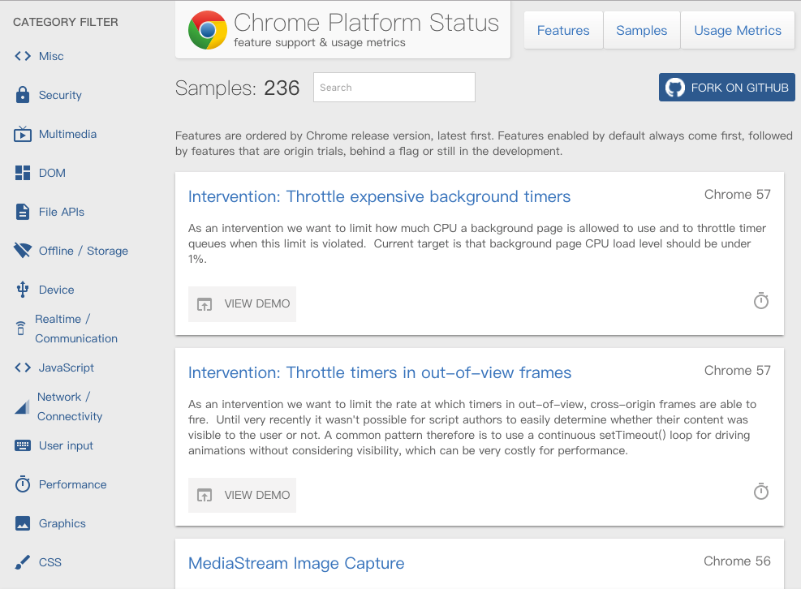

# chrome

> chrome相关信息及安装

## chrome升级信息

* `Chrome Platform Status`: <https://www.chromestatus.com/samples>

    
* `github: Google Chrome Samples`: <https://github.com/GoogleChrome/samples>
* Google将在Chrome56中停止支持SHA-1: <http://www.wosign.com/news/Google-Chrome-SHA1.htm>

## XP平台上的最后版本

> XP`2014-04-08`正式退役以后，Chrome随后推出XP平台上的`绝唱版本` -- Chrome 49.0.2623.112。

* <http://www.guancha.cn/Industry/2014_04_08_220443.shtml>

以下列出官方下载地址

### 32位版

<http://dl.google.com/release2/h8vnfiy7pvn3lxy9ehfsaxlrnnukgff8jnodrp0y21vrlem4x71lor5zzkliyh8fv3sryayu5uk5zi20ep7dwfnwr143dzxqijv/49.0.2623.112_chrome_installer.exe>

### 64位版

> 已不可用

<http://dl.google.com/release2/va5qxmf7d3oalefqdjoubnamxboyf9zt3o6zj33pzo2r3adq2cjea9an8hhc6tje8y4jiieqsruld9oyajv9i6atj40utl3hpl2/49.0.2623.112_chrome_installer_win64.exe>

靠谱的下载地址，可在`百度网盘`找到。

### 绿色版

可能有安全问题，官方站点慎用。

* 网盘下载：<https://pan.baidu.com/s/1boO9c5p>

## Win7及以上平台

### 百度下载

百度软件中心提供下载

### 绿色版

* Portablesoft：<http://www.portablesoft.org/down/339/>
* 网盘下载：<https://pan.baidu.com/s/1qY1yk4c>

## 早期的Chrome版本

* `40-46`: <https://pan.baidu.com/s/1o8e1Gue>
* `1-34`: <http://www.oldapps.com/google_chrome.php>

## net::xx错误汇总

> `net::ERR_CONTENT_LENGTH_MISMATCH`

> `net::ERR_EMPTY_RESPONSE`

* 并不是`Content-Length`为0，也就是Response body为空的情况
* 场景之一：`已建立`了socket连接，正在准备数据，`尚未开始`返回，服务出现了`异常`，Chrome浏览器会报该错误
* 直接通过浏览器地址栏进行请求，会在页面中展示该错误；使用`AJAX`请求，会在console中显示红色ERROR
* 以下代码能复现以上错误码：

        var http = require('http');
        http.createServer(function (req, res) {

                // net::ERR_EMPTY_RESPONSE
                // req.connection.end();

                res.writeHead(200, {'Content-Type': 'text/plain'});

                // also net::ERR_EMPTY_RESPONSE
                // req.connection.end();

                for ( var i in req ) {
                    res.write( i + '\r\n' );
                }

                // net::ERR_INCOMPLETE_CHUNKED_ENCODING
                // req.connection.end();

                res.end('Hello World\n');
            })
            .listen( 8087 )
            ;

> `net::ERR_INCOMPLETE_CHUNKED_ENCODING`

* 场景之一：`已建立`了socket连接，数据已经`部分返回`，服务出现了`异常`，Chrome浏览器会报该错误
* 以上`net::ERR_EMPTY_RESPONSE`相关复现代码的第二部分能复现该错误

> `net::ERR_INSECURE_RESPONSE`

* 一般与`HTTPS/SSL`相关
        

