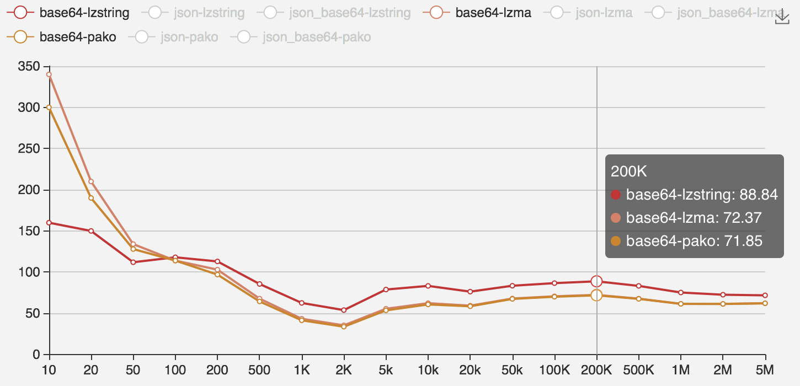
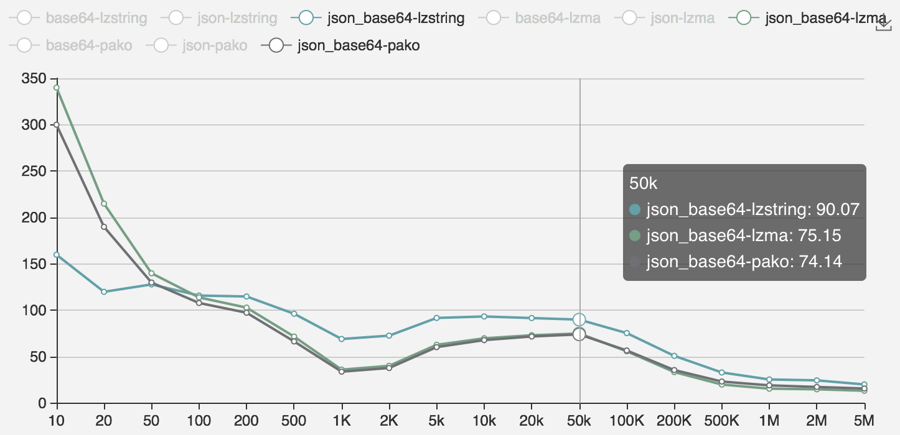

# compress-perf

> `前端（js）`压缩算法性能比较

## 目标
* 获得各算法的运行速度比较
* 获得各算法的压缩比率比较
* 提供算法选型标准

## 维度拆解

* `比较算法`：lz-string, pako, lzma
* `文件大小`：10B, 20B, 50B, 100B, 200B, 500B, 1KB, 2KB, 5KB, 10KB, 20KB, 50KB, 100KB, 200KB, 500KB, 1MB, 2MB, 5MB
* `文件内容`：json, base64, json+base64, article
* `文件字符集`：ascii, unicode [ 差异不大，故先不拆解 ]

## 数据准备

> 选取三类数据做比较，`base64、json、json+base64 ( 14:1 )`

    @[data-script="javascript editable"](function(){

        var s = fly.createShow('#test_prepare');

        var td_config = window.td_config = {
                type: [ 'base64', 'json', 'json_base64' ]
                , size: [ 10, 20, 50, 100, 200, 500, 1000, 2000, 5000, 10000
                        , 20000, 50000, 100000, 200000, 500000, 1000000, 2000000, 5000000
                    ]
            };
        var name, type, size, c = 1;

        s.show( 'preparing data ...' );

        for ( var i = 0, types = td_config.type; i < types.length; i++ ) {
            type = types[ i ];
            for ( var j = 0, sizes = td_config.size; j < sizes.length; j++ ) {
                size = sizes[ j ];
                name = type + '_' + size;
                window[ name ] = prepare( type, size );
                s.append_show( c++, name, window[ name ].length );        
            }
        }

        function prepare( type, size ) {
            var raw = window[ type + 'Raw' ];

            if ( raw.length < size ) {
                var count = Math.ceil( size / raw.length ), arr = [];
                while( count-- > 0 ) {
                    arr.push( raw );
                }
                raw = arr.join( '' );
            }

            return raw.substr( 0, size );
        }

    })();

## 性能比较

### 运行性能收集

    @[data-script="javascript editable"](function(){

        var s = fly.createShow('#test_running');

		if ( !window.runPerf ) {
			window.runPerf = 1;
            s.show( '点击以下按钮运行性能测试' );
			return;
		}
        s.show( 'start running ...' );

        var algorithms = {
                lzstring: {
                    compress: LZString.compressToUint8Array
                    , decompress: LZString.decompressFromUint8Array
                }
                , lzma: {
                    compress: function( data ) {
                        return LZMA.compress( data, 1 );
                    }
                    , decompress: LZMA.decompress
                }
                , pako: {
                    compress: pako.gzip
                    , decompress: pako.ungzip
                }
            };

        var td_config = window.td_config
            , types, sizes, name, type, size, info
            , taskQueue = []
            , chart = {
                xAxis: [ '10','20','50','100','200','500','1K','2K','5k','10k','20k','50k'
                    , '100K', '200K', '500K', '1M', '2M', '5M'
                ]
                , usedTimeSeries: []
                , ratioSeries: []
            }
            , cnt = 10
            ;

        for ( var i = 0, types = td_config.type; i < types.length; i++ ) {
            type = types[ i ];
            chart.usedTimeSeries.push( { name: type } );
            chart.ratioSeries.push( { name: type } );
            for ( var j = 0, sizes = td_config.size; j < sizes.length; j++ ) {
                size = sizes[ j ];
                name = type + '_' + size;
                for ( var k in algorithms ) {
                    taskQueue.push( { type: type, data_name: name, algorithm: k } );
                }
            }
        }
        doTask();

        function doTask() {
            var taskInfo, taskResult;
            if ( taskQueue.length > 0 && cnt-- > 0 ) {
                taskInfo = taskQueue.shift();
                taskResult = run( taskInfo.data_name, taskInfo.algorithm );
                s.append_show( taskInfo.data_name, taskInfo.algorithm
                    , taskResult.usedTime + 'ms' 
                    , Math.floor( taskResult.ratio * 10000 ) / 100 + '%'
                );
                for ( var m = 0; m < chart.usedTimeSeries.length; m++ ) {
                    if ( chart.usedTimeSeries[ m ].name == taskInfo.type ) {

                        chart.usedTimeSeries[ m ].data = chart.usedTimeSeries[ m ].data || {}; 
                        chart.usedTimeSeries[ m ].data[ taskInfo.algorithm ]
                            = chart.usedTimeSeries[ m ].data[ taskInfo.algorithm ] || [];
                        chart.usedTimeSeries[ m ].data[ taskInfo.algorithm ].push( 
                            taskResult.usedTime 
                        );

                        chart.ratioSeries[ m ].data = chart.ratioSeries[ m ].data || {}; 
                        chart.ratioSeries[ m ].data[ taskInfo.algorithm ]
                            = chart.ratioSeries[ m ].data[ taskInfo.algorithm ] || [];
                        chart.ratioSeries[ m ].data[ taskInfo.algorithm ].push( 
                            Math.floor( taskResult.ratio * 10000 ) / 100 
                        );

                    }
                }
                setTimeout( doTask, 500 );
            }
            else {
                if ( taskQueue.length ) {
                    s.append_show( 'tips', '调整cnt的值为1000，以便执行全部性能测试' );
                }
                s.append_show( chart );
            }
        }

        function run( data_name, algorithm ) {
            var content = window[ data_name ]
                , compressed
                , runner = algorithms[ algorithm ]
                , startTime = Date.now()
                , endTime
                , usedTime
                ;
            
            compressed = runner.compress( content );
            endTime = Date.now();
            usedTime = endTime - startTime;
            return {
                usedTime: usedTime
                , ratio: compressed.length / content.replace( /[^\u0000-\u00ff]/g, 'aa' ).length
            };
        }

    })();

### 运行时间性能分析

 

 

 

性能数据为执行完压缩所用的时间，用`ms（毫秒）`表示。

	option = {
		title: {
			text: ''
		},
		tooltip: {
			trigger: 'axis'
		},
		legend: {
			data:[ 
                'base64-lzstring', 'json-lzstring', 'json_base64-lzstring'
				, 'base64-lzma', 'json-lzma', 'json_base64-lzma'
				, 'base64-pako', 'json-pako', 'json_base64-pako'
			]
		},
		grid: {
			left: '3%',
			right: '4%',
			bottom: '3%',
			containLabel: true
		},
		toolbox: {
			feature: {
				saveAsImage: {}
			}
		},
		xAxis: {
			type: 'category',
			boundaryGap: false,
			data: [        
			"10", "20", "50", "100", "200", "500", "1K", "2K", "5k", "10k", "20k", "50k", "100K", "200K", "500K", "1M", "2M", "5M"
			]
		},
		yAxis: {
			type: 'value'
		},
		series: [
			{
				name:'base64-lzstring',
				type:'line',

				data:[ 0,1,0,0,0,0,1,1,2,5,10,28,49,115,313,647,1436,4008 ]
			},
			{
				name:'json-lzstring',
				type:'line',

				data:[ 0,0,2,1,0,2,2,3,5,9,15,30,63,107,281,590,1233,3448 ]
			},
			{
				name:'json_base64-lzstring',
				type:'line',

				data:[ 0,1,0,0,1,4,1,3,6,9,18,45,81,185,472,680,1808,3622 ]
			},
			{
				name:'base64-lzma',
				type:'line',

				data:[ 1,1,2,1,3,5,12,25,43,66,146,318,596,1263,3701,7738,16244,38054 ]
			},
			{
				name:'json-lzma',
				type:'line',

				data:[ 1,2,2,3,4,8,11,19,41,96,185,542,1173,2492,6035,12432,22399,55027 ]
			},
			{
				name:'json_base64-lzma',
				type:'line',

				data:[ 2,4,3,2,4,5,9,16,39,76,143,417,954,2174,5869,11721,21670,54865 ]
			},
			{
				name:'base64-pako',
				type:'line',

				data:[ 1,1,1,0,1,1,1,0,2,3,3,16,24,35,53,99,163,425 ]
			},
			{
				name:'json-pako',
				type:'line',

				data:[ 1,0,1,1,3,1,2,1,4,6,5,7,12,19,37,71,118,286 ]
			},
			{
				name:'json_base64-pako',
				type:'line',

				data:[ 2,0,0,0,1,1,3,2,3,2,6,13,30,32,52,87,158,352 ]
			},
		]
	};

### 压缩比数据分析 

 

 

 

 

`json_base64`类型数据，在不同长度情况下，其包含内容中json和base64的类型`占比并不一样`。`2K-100K`阶段base64的占比越来越大，且base64`占绝大多数`，`90%`以上，所以其压缩比同纯`base64`情况差不多；随着长度继续增长，json的内容占比增加，整体压缩比开始下降，接近`json`的表现。

`压缩比`为压缩输出的`字节数`与原始数据字节数的`比率`，用`百分比`表示。ECharts数据如下所示。

	option = {
		title: {
			text: ''
		},
		tooltip: {
			trigger: 'axis'
		},
		legend: {
			data:[
                'base64-lzstring', 'json-lzstring', 'json_base64-lzstring'
				, 'base64-lzma', 'json-lzma', 'json_base64-lzma'
				, 'base64-pako', 'json-pako', 'json_base64-pako'
			]
		},
		grid: {
			left: '3%',
			right: '4%',
			bottom: '3%',
			containLabel: true
		},
		toolbox: {
			feature: {
				saveAsImage: {}
			}
		},
		xAxis: {
			type: 'category',
			boundaryGap: false,
			data: [        
			"10", "20", "50", "100", "200", "500", "1K", "2K", "5k", "10k", "20k", "50k", "100K", "200K", "500K", "1M", "2M", "5M"
			]
		},
		yAxis: {
			type: 'value'
		},
		series: [
			{
				name:'base64-lzstring',
				type:'line',

				data:[ 160,150,112,118,112.99,85.6,62.6,53.9,78.87,83.28,76.32,83.46,86.64,88.84,83.28,75.25,72.57,71.81 ]
			},
			{
				name:'json-lzstring',
				type:'line',

				data:[ 160,120,108,113.99,98.52,93.77,79.64,64.7,52.54,45.6,39.42,32.74,28.57,25.12,21.72,19.7,18.49,16.16 ]
			},
			{
				name:'json_base64-lzstring',
				type:'line',

				data:[ 160,120,128,116,115,96.4,69.19,72.8,91.88,93.46,91.76,90.07,75.57,51.04,33.14,25.6,24.65,20.23 ]
			},
			{
				name:'base64-lzma',
				type:'line',

				data:[ 340,210,134,113.99,103,67.8,43.4,35.4,55.52,62.31,59.28,67.95,70.64,72.37,67.78,61.47,61.35,62.13 ]
			},
			{
				name:'json-lzma',
				type:'line',

				data:[ 340,215,136,113.99,96.05,82.49,60.95,37.05,24.24,19.77,16.21,13.58,12.58,11.93,11.49,11.37,9.76,8.81 ]
			},
			{
				name:'json_base64-lzma',
				type:'line',

				data:[ 340,215,140,113.99,103,71.8,36.2,40.3,62.94,69.95,73.24,75.15,55.97,33.56,20.13,15.69,15.02,13.42 ]
			},
			{
				name:'base64-pako',
				type:'line',

				data:[ 300,190,128,113.99,97,64.4,41.5,33.75,53.56,60.76,58.54,67.47,70.13,71.85,67.55,61.47,61.42,62.17 ]
			},
			{
				name:'json-pako',
				type:'line',

				data:[ 300,200,132,111,98.02,85.01,63.01,39.11,27.38,22.86,19.31,16.8,16.02,15.55,15.29,15.24,12.59,11.31 ]
			},
			{
				name:'json_base64-pako',
				type:'line',

				data:[ 300,190,130,108,97.5,66.6,34,37.95,60.44,68,71.91,74.14,56.83,35.74,23.37,19.25,17.54,15.87 ]
			}
		]
	};

## 结论

### 压缩速度分析结论

* `pako`速度快，且性能比较稳定，`5MB`的数据`平均600ms左右`的压缩时间 
* `lzstring`速度较`pako`慢，`2MB`的数据基本能保持在`1s左右`，`5MB`数据`平均2s`
* `lzma`性能很差，`100KB以上`的数据基本都在`1s以上`的压缩时间，`5MB`数据`高达80s`，无法在前端使用

### 压缩比分析结论

* `lzma`最优，`pako`次之，`lzstring`最差
* `base64`类型的数据压缩效果较差，压缩比`60%-70%`左右
* `200B以内`的数据，`不建议压缩`，反而越压越大；建议`大于1K`的数据才开启压缩传输，这时能达到`15%-70%`的压缩比

> 技术选型，可选择`pako`作为前端压缩的解决方案，实际上pako方案的后端支持也很成熟。

