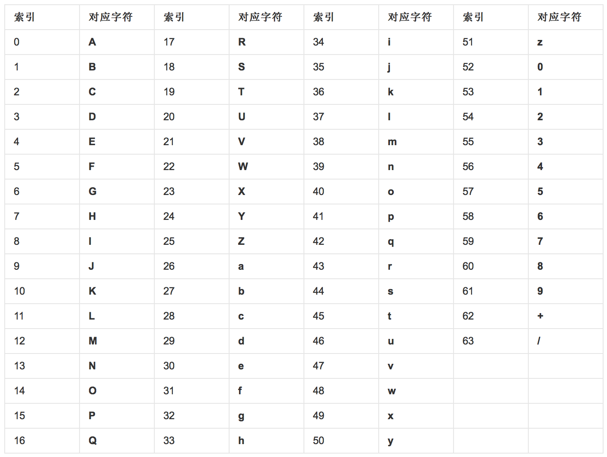

# base64编码

> 基于`64个可打印字符`来表示`二进制数据`的表示方法。

比如可以将`二进制`数据进行base64编码，从而可以在`URL`中传输。

* wikipedia: Base64 <https://en.wikipedia.org/wiki/Base64>
* 百度百科: Base64 <http://baike.baidu.com/link?url=5ic0OiXxTO5VgT0gRbw0VcDEj9NmNu6L4Ip1mEvmvAR24u1Fc1d4JHhSJsT9bOD1xdiwJznICl6FUtYLckU5jK>
* 从原理上搞定Base64编码 <http://www.cnblogs.com/luguo3000/p/3940197.html>

## 编码规则

* 把3个字节转成4个字节，`8 * 3 = 4 * 6`
* 最后多出来的字节有两种情况，多出来1个或2个字节，可以分别用`2个Base64字符`或`3个Base64字符`通过后面补0的方式来表示，没有码点的部分用`=`补齐

## Base64码表

 

* 非字母字符： `+` `/`
* 特殊字符，用于补全： `=`
* Base64带`+`和`/`，不能直接在URL中传播，所以存在一些`编码变种`，见文末

## 编码例子1

> 4个Base64字符表示3个字符

    转前：              s 1 3
    ASCII:              115 49 51
    二进制：            01110011 00110001 00110011
    6个一组（共4组）：  011100 110011 000100 110011
    高两位分别补0:      00011100 00110011 00000100 00110011
    对应索引：          28 51 4 51
    转后：              c z E z

## 编码例子2

> 2个Base64字符表示1个字符，无码点部分补2个=

    转前：              A
    ASCII:              65
    二进制：            01000001
    6个一组（共2组）：  010000 010000
    高两位分别补0:      00010000 00010000 
    对应索引：          16 16
    转后：              Q Q = = 

## 编码例子3

> 3个Base64字符表示2个字符，无码点部分补1个=

    转前：              B C
    ASCII:              66 67
    二进制：            01000010 01000011
    6个一组（共3组）：  010000 100100 001100
    高两位分别补0:      00010000 00100100 00001100
    对应索引：          16 36 12
    转后：              Q k M = 

## 编码变种

标准代码包含`+`和`/`，在一些场景下可能存在特殊含义，不能直接使用，从而衍生出一些编码变种。

### URL编码变种

将`+` `/`分别用`-` `_`替换

### 正则表达式编码变种

将`+` `/`分别用`!` `-`替换

