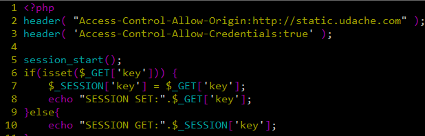
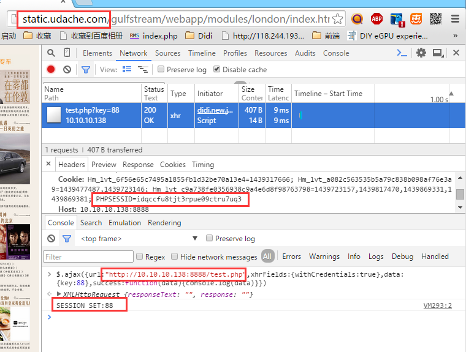
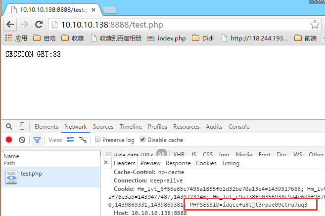

# Cookie

> Cookie使用需谨慎，保持短小精悍。<https://tools.ietf.org/html/rfc6265>

## 容量限制

`4k` Bytes

`ref`: <https://tools.ietf.org/html/rfc6265#section-6.1>

rfc对浏览器对`最低要求`：
* 每个cookie `4096`字节（`包含name，value以及属性`）
* 每个域名至少支持`50个`cookie
* 总共支持至少`3000`个cookie
具体浏览器的支持程度因厂商而异。

## 读取cookie

`document.cookie`，返回当前域名（包括父级域名）的cookie串。

cookie串由`'; '`分隔每个cookie，每个cookie按`name=value`的方式保存。如下格式：

    name1=value1; name2=value2; name3=value3

示例代码：

    var cookie = document.cookie;
    output: 
        name=test; name1=test1; name2=test2

读取时，只有`name=<value>`部分，不会包含其他cookie属性字段。每个cookie以`'; '`分隔。

### cookie的属性

通常为4个属性，格式如下：

    name=<value>[; expires=<date>][; domain=<domain>][; path=<path>][; secure] 

带有第五个属性`HttpOnly`的cookie，可以有效防止XSS攻击，阻止浏览器将cookie信息传送给第三方。

    name=<value>[; expires=<date>][; domain=<domain>][; path=<path>][; secure][; HttpOnly] 

### host-only-flag

以下情况之一满足时，`http-only-flag`被设置为true
* HttpOnly属性为true时
* domain属性为空、或者domain属性不合法时
由于`host-only-flag`的不同值，可能出来多个同名cookie，需要注意。

### 属性默认值

* `domain`，默认为`location.hostname`，而不是location.host，也即`默认不包含端口号`
* `path`，默认为当前路径，比如当前为`/static/abc/d.html`，则path为`/static/abc`。路径不存在，cookie设置不成功
* `expires`，默认为当前session有效

> 关于domain属性前导点号的解释：<https://tools.ietf.org/html/rfc6265#section-5.2.3>，处理过程中会`忽略前导点号`。

## 设置cookie

示例代码：

    document.cookie = 'name=test; expires=' + date.toGMTString() 
        + '; domain=' + domain
        + '; path=' + path
        + '; secure'
        ;

## 路径和域名属性

### 父路径

子路径能获取父路径下的cookie，比如`/static/abc`下，能获取path为`/static`的cookie。反之则不行

### 父域名

同父路径类似，子域名能获取父域名下的cookie，反之则不行

## 跨域cookie

Headers：

    Access-Control-Allow-Origin: http://static.udache.com
    Access-Control-Allow-Credentials: true

如下截图：

