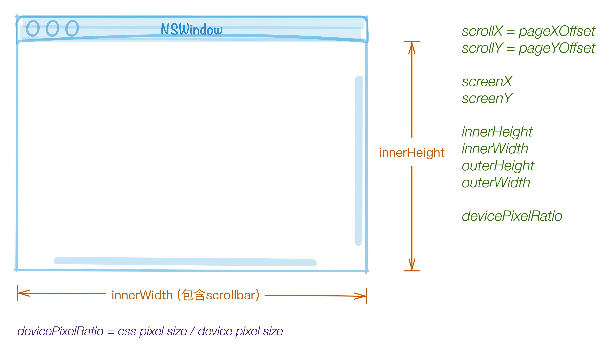

# js basics

## references

* ECMA-262: <ref://../ecma/ecma-262.md.html>
* MDN: <https://developer.mozilla.org/zh-CN/docs/Web/JavaScript/Guide>

## 算符优先级

`单乘加移小，等位与异或，与或三赋逗`

## typeof

`typeof`输出是`字符串`类型，输出为以下`7个`值之一：

* number
* string
* boolean
* object
* function
* undefined
* symbol

    @[data-script="javascript editable"](function(){

        var s = fly.createShow('#test_10');
        var items = [
            '1'
            , '"Hello, World!"'
            , 'true'
            , 'null'
            , 'undefined'
            , '[ 1, 2, 3]'
            , 'Array'
            , '{ name: "Michael" }'
            , 'new Object()'
            , 'function(){}'
            , 'new Number(1)'
            , 'new String("Hello")'
            , 'NaN'
            , 'Infinity'
        ];
        var str;
        s.show('typeofs: ');
        for(var i=0; i<items.length; i++){
            str = 'typeof ' + items[i]; 
            s.append_show(
                str
                , eval(str) 
            );
        }

    })();

## 一般等式

    null == undefined
    0 == ''
    false == 0
    false == ''
    true == 1
    true != 100
    NaN != NaN

`注意`：`NaN`不能做比较，需要判断一个数是否为NaN，使用`isNaN()`

    @[data-script="javascript editable"](function(){

        var s = fly.createShow('#test_20');
        var items = [
                [ 'null', 'undefined' ]
                , [ '0', '""' ]
                , [ 'false', '0' ]
                , [ 'false', '""' ]
                , [ '1', 'true' ]
                , [ '100', 'true' ]
                , [ 'NaN', 'NaN' ]
            ]
            , expr
            ;
        s.show('common equaltions test: \n');
        for(var i=0; i<items.length; i++){
            expr = items[i][0] + ' == ' + items[i][1]; 
            s.append_show(
                expr
                , eval(expr)
            );
        }

    })();

## 浮点计算性能

    @[data-script="javascript editable"](function(){

        var s = fly.createShow('#test_js_float');
        var count = 100;

        s.show( 'integer vs float: ' + count );
        s.append_show( computeInteger( count ) );
        s.append_show( computeFloat( count ) );

        function getIntegers( count ) {
            var arr = [];
            var a, b;

            while ( count-- > 0 ) {
                a = Math.random() * 10000 | 0; 
                b = Math.random() * 10000 | 0;
                arr.push( [ a, b ] );
            }
            return arr;
        }

        function computeInteger( count ) {
            var a, b, i, item;
            var _ts1 = +new Date();
            var arr = getIntegers( count );
            var _ts2 = +new Date();

            _ts1 = _ts2 - _ts1;
            for ( i = 0; i < count; i++ ) {
                item = arr[ i ]; 
                a = item[ 0 ];
                b = item[ 1 ];
                // c = Math.sqrt( Math.pow( a, 2 ) + Math.pow( b, 2 ) );
                c = Math.pow( a, 2 ) + Math.pow( b, 2 );
                // c = a + b;
            }
            return { 
                ts1: _ts1
                , ts2: +new Date() - _ts2
            };
        }

        function getFloats( count ) {
            var arr = [];
            var a, b;

            while ( count-- > 0 ) {
                a = Math.random(); 
                b = Math.random();
                arr.push( [ a, b ] );
            }
            return arr;
        }

        function computeFloat( count ) {
            var a, b, i, item;
            var _ts1 = +new Date();
            var arr = getFloats( count );
            var _ts2 = +new Date();

            _ts1 = _ts2 - _ts1;
            for ( i = 0; i < count; i++ ) {
                item = arr[ i ]; 
                a = item[ 0 ];
                b = item[ 1 ];
                c = Math.sqrt( Math.pow( a, 2 ) + Math.pow( b, 2 ) );
            }
            return { 
                ts1: _ts1
                , ts2: +new Date() - _ts2
            };
        }

    })();

## try-catch

### 语法

> <https://tc39.github.io/ecma262/#sec-try-statement>

* `catch( e ) { ... }` 部分，类似`callback`定义，e闭包在catch块内的参数

    @[data-script="javascript"](function(){

        var s = fly.createShow('#test_try_catch');

        var e = 123;
        try {
            e = 456;
            try {
                a.c
            }
            catch( e ) {
                s.append_show( 'inner error' );
                throw e;
            }
        }
        catch( e ) {
            s.append_show( 'outter error' );
        }
        s.append_show( e );

    })();

### try-catch性能

> 循环测试，降低`6%-10%`的性能，并不会大幅拉低性能，所以某些场景下，还是值得大范围使用的

* <https://jsperf.com/try-catch-performance-overhead>
* <https://jsperf.com/try-catch-performance-jls/1>
* <https://jsperf.com/try-catch-performance-jls/2> `提前判断错误性能优于捕获错误`

## window.onerror

处理`未被捕获`的异常，通过它可以设置一个异常处理函数。该函数接收`三个字符串类型`的参数。

    window.onerror = function( msg, url, line ) {
        console.log( 'ERROR: ' + msg + '\n' + url + ':" + line );
        return false;
    }

    // Mozilla firefox
    window.onerror = function( messageOrEvent, source, lineno, colno, error ) {
        ...
    }

`return false`告知浏览器已经处理完异常；但firefox是`return true`

三个参数的接口是全兼容的接口形式，新型浏览器实际上可以支持五个参数，新增`col`和`error`参数。
关于onerror的详细用法，可以参考<ref://./exception-report.md.html>

### Error

> ref: <http://www.ecma-international.org/ecma-262/6.0/index.html#sec-error-objects>

    Error( message )
        EvalError
        RangeError
        ReferenceError
        SyntaxError
        TypeError
        URIError

## 绝对等式

    typeof null === 'object'
    void 0 === undefined

数字判断：

    num === +num

IE9以下，`hasEnumBug`

    @[data-script="javascript editable"](function(){

        var s = fly.createShow('#test_25');
        var items = [
                [ 'typeof null', '"object"' ]
                , [ 'void 0', 'undefined' ]
                , [ '5', '+5' ]
                , [ '1', 'true' ]
                , [ 'Infinity', 'Infinity' ]
            ]
            , expr
            ;
        s.show('absolute equaltions test: \n');
        for(var i=0; i<items.length; i++){
            expr = items[i][0] + ' === ' + items[i][1]; 
            s.append_show(
                expr
                , eval(expr)
            );
        }

    })();

## TRUE表达式

    !null
    !void 0
    !undefined
    !0
    !''
    !NaN
    !!Infinity

## 位运算符

`~a`相当于

    var b = -a;
    b = b -1;

    @[data-script="javascript editable"](function(){

        var s = fly.createShow('#test_30');
        s.show('bit-wise operations: ');

        s.append_show(
            '~5'
            , ~5    
        );

        s.append_show(
            '~0'
            , ~0    
        );

        s.append_show(
            '~-1'
            , ~-1    
        );

        s.append_show(
            '( 3.1415 | 0 )'
            , 3.1415 | 0 
        );

        s.append_show(
            '( 3.1415 & 0 )'
            , 3.1415 & 0 
        );

    })();

## Object.prototype.toString.call(obj)

注意`不是Object.toString`，该toString来自`Function.prototype.toString`

    function(){}    [object Function]
    []              [object Array]
    10              [object Number]

## Object.assign

<https://developer.mozilla.org/zh-CN/docs/Web/JavaScript/Reference/Global_Objects/Object/assign>

    Object.assign( target, ...sources )

* `浅拷贝`
* 可能会有TypeError错误，比如目标对象同名属性是只读的

## Object.defineProperty

<https://developer.mozilla.org/zh-CN/docs/Web/JavaScript/Reference/Global_Objects/Object/defineProperty>

    Object.defineProperty( obj, prop, descriptor )

### 数据描述符与存取描述符

    公共：
    configurable enumerable

    数据描述符独有：
    value writable

    存取描述符独有：
    get set

### 示例 

* 设置`只读属性`的值，`非严格模式`下不会抛出异常，`严格模式`下则抛出异常

    @[data-script="javascript"](function(){

        var s = fly.createShow('#test_defineProperty');
        var obj = {};

        s.show( 'testing defineProperty ...' );

        Object.defineProperty( obj, 'id', { value: 37 } );
        s.append_show( '获取属性id', obj.id );
        obj.id = 2;
        s.append_show( '只读属性id不可改变，只能获取属性id的原值', obj.id );

        Object.defineProperty( obj, 'name', { value: 'Michael', writable: true } );
        s.append_show( '\n获取属性name', obj.name );
        obj.name = 'Even';
        s.append_show( '可写属性name可改变，获取到新值', obj.name );

        obj._age = 0;
        Object.defineProperty( obj, 'age', { 
            set: function( age ) {
                if ( age >=0 && age <= 150 ) {
                    this._age = age;
                }
            }
            , get: function( age ) {
                return this._age;
            }
        } );
        s.append_show( '\n获取属性age值', obj.age );
        obj.age = 35;
        s.append_show( '设置一个合理的值，获取属性age的新值', obj.age );
        obj.age = 350;
        s.append_show( '设置一个不合理的值，只能获取属性age的原值', obj.age );

    })();

## 匿名函数

> 以下a, b两种写法，目前来看是`等价的`。

    @[data-script="javascript"](function(){

        var s = fly.createShow('#test_anonymous_func');

        var tool = {
                a: function() {
                    return this.value;
                }
                , b: function b() {
                    return this.value;
                }
            }
            , obj = { value: 10 }  
            ;

        s.show( tool.a.apply( obj ) );
        s.append_show( tool.b.apply( obj ) );
        s.append_show( 'typeof b', typeof b );

    })();

## arguments是Array-like的

    (function(){
        console.log(arguments);
    })();

`output`:

    []

## 正则表达式之转义序列
> 详细查看：<ref://../encoding/character-escape.md.html>

1. `\ooo`: 八进制数ooo规定的字符
2. `\xhh`: 十六进制数hh规定的字符
3. `\uhhhh`:十六进制数hhhh规定的Unicode字符

## CSSOM部分相关扩展 

> <http://www.w3.org/TR/cssom-view-1/>

### 相关概念

* padding edge / padding area
* border edge / border area
* scrolling area
* css pixels / device pixels
* layout box: css layout box / svg layout box

### window扩展

 

1. [非CSSOM扩展] window.getComputedStyle(element)
2. [viewport] window.innerWidth
3. [viewport] window.innerHeight
4. [viewport scrolling] window.scrollX 
5. [viewport scrolling] window.scrollY 
6. [viewport scrolling] window.pageXOffset 
7. [viewport scrolling] window.pageYOffset 
11. [client] window.screenX
12. [client] window.screenY
13. [client] window.outerWidth
14. [client] window.outerHeight
15. [client] window.devicePixelRatio
8. [viewport scrolling] window.scroll() 
9. [viewport scrolling] window.scrollTo() 
10. [viewport scrolling] window.scrollBy() 

### element扩展

1. element.getClientRects()，返回`DOMRect`，包含`x`, `y`, `width`, `height`, `top`, `right`, `bottom`, `left`字段，与`clientArea`相关
2. element.getBoundingClientRect()，与`clientArea`相关
3. element.scrollIntoView()
7. element.scrollTop
8. element.scrollLeft
9. [readonly] element.scrollWidth
10. [readonly] element.scrollHeight，不包含border
11. [readonly] element.clientTop，`border-top-width`加上border-top和top padding edge之间可能存在的`scroll bar`的height。<http://www.w3.org/TR/cssom-view-1/#dom-element-clienttop>
12. [readonly] element.clientLeft
13. [readonly] element.clientWidth
14. [readonly] element.clientHeight，不包含border
4. element.scroll()
5. element.scrollTo()
6. element.scrollBy()

### HTMLElement扩展

1. [readonly] offsetParent
2. [readonly] offsetTop，与`offertParent`有关
3. [readonly] offsetLeft
4. [readonly] offsetWidth
5. [readonly] offsetHeight， `border edge height`，包含border

.test-panel

    @[data-script="javascript editable"](function(){

        setTimeout(function(){

            var s = fly.createShow('#test_60')
                , $element = $('#test_60 .test-panel')
                , element = $element[0]
                , st = window.getComputedStyle(element)
                , list
                , element
                ;
            s.show('getComputedStyle() with .test-panel: ');
            list = [
                'display'
                , 'box-sizing'
                , 'width'
                , 'height'
                , 'padding-left'
                , 'margin-left'
                , 'position'
                , 'left'
                , 'color'
                , 'background'
                , 'font'
            ];
            list.forEach(function(item){
                s.append_show('st["' + item + '"]', st[item]); 
            });

            s.append_show('\n.test-panel getClientRects() & getBoundingClientRect(): ');
            s.append_show(
                objectParse(element.getClientRects())
            );
            s.append_show(
                objectParse(element.getBoundingClientRect())
            );

            list = [
                'innerWidth'
                , 'innerHeight'
                , 'scrollX'
                , 'scrollY'
                , 'pageXOffset'
                , 'pageYOffset'
                , 'screenX'
                , 'screenY'
                , 'outerWidth'
                , 'outerHeight'
                , 'devicePixelRatio'
            ];

            s.append_show('\nwindow extensions: ');
            list.forEach(function(item){
                s.append_show('window.' + item, window[item]); 
            });

            list = [
                'scrollTop'
                , 'scrollLeft'
                , 'scrollWidth'
                , 'scrollHeight'
                , 'clientTop'
                , 'clientLeft'
                , 'clientWidth'
                , 'clientHeight'
            ];

            s.append_show('\n.test-panel element extensions: ');
            list.forEach(function(item){
                s.append_show('element.' + item, element[item]); 
            });

            list = [
                'offsetTop'
                , 'offsetLeft'
                , 'offsetWidth'
                , 'offsetHeight'
            ];

            s.append_show('\n.test-panel htmlelement extensions: ');
            list.forEach(function(item){
                s.append_show('element.' + item, element[item]); 
            });

            s.append_show('\n.test-panel jQuery offset() and position()');
            s.append_show('offset()', $element.offset());
            s.append_show('position()', $element.position());

            function objectParse(obj){
                var ret = {};
                if(typeof obj == 'object'){
                    for(var i in obj){
                        ret[i] = objectParse(obj[i]);
                    }
                }
                else {
                    ret = obj;
                }
                return ret;
            }

        }, 1000);

    })();

## JSON.stringify

    JSON.stringigy(document.body.getBoundingClientRect())

`Safari`能输出`ClientRect`类型对象的内部内容，而`Chrome`只输出空对象`"{}"`。
这也是上方`objectParse()`方法存在的原因，能保证`Chrome`能输出其内容。

## hasOwnProperty() 与 in 操作符

> <http://www.ecma-international.org/ecma-262/6.0/#sec-own-property>

### hasOwnProperty()

* `own property`: property that is directly contained by its object
* `inherited property`: property of an object that is not an own property but is a property (either own or inherited) of the object’s prototype

### in operator 

The production RelationalExpression : RelationalExpression in ShiftExpression is evaluated as follows:
1. Let `lref` be the result of evaluating RelationalExpression.
2. Let `lval` be GetValue(lref).
3. Let `rref` be the result of evaluating ShiftExpression.
4. Let `rval` be GetValue(rref).
5. If Type(rval) is not Object, throw a TypeError exception.
6. Return the result of calling the `[[HasProperty]]` `internal` method of rval with argument ToString(lval).

`in`使用的是内部方法`hasProperty()`，包含继承而来的属性。

    @[data-script="javascript editable"](function(){

        var s = fly.createShow('#test_90')
            , obj1 = {name: 'hudamin'}
            ;

        s.show('hasOwnProperty(): ');
        s.append_show(obj1.hasOwnProperty('name'));

        function Person(name, age, sex){
            this.name = name;
            this.age = age;
            this.sex = sex;
        }

        Person.prototype.sayHello = function(){
            s.append_show(this.name, this.age, this.sex);
        }

        function Student(name, age, sex, score){
            Person.call(this, name, age, sex);
            this.score = score;
        }

        Student.prototype = new Person();
        Student.prototype.constructor = Student;
        Student.prototype.sayHello = function(){
            Person.prototype.sayHello.apply(this);
            s.append_show(this.score);
        }

        var obj2 = new Student('hudamin', 20, 'male', 100)
            , list = ['name', 'sayHello', 'sayYes']
            , wrapper = {Person: Person, Student: Student}
            ;

        s.append_show('\nsayHello:');
        obj2.sayHello();
        obj2.sayYes = function(){
            s.append_show('YES!');
        };

        s.append_show('\n');
        list.forEach(function(key){
            s.append_show(
                'obj2.hasOwnProperty("' + key + '")'
                , obj2.hasOwnProperty(key)
            );
        });

        s.append_show('\nin operator:');

        var props = []
            , ownProps = [];
        for(var i in obj2){
            props.push(i); 
            if(obj2.hasOwnProperty(i)){
                ownProps.push(i);
            }
        }
        s.append_show('property', props);
        s.append_show('own property', ownProps);

        s.append_show('\ninstanceof operator');
        list = ['Student', 'Person'];
        list.forEach(function(item){
            s.append_show(
                'obj2 instanceof ' + item
                , obj2 instanceof wrapper[item]
            );
        });

    })();

## Fundamental Objects

<http://www.ecma-international.org/ecma-262/6.0/#sec-fundamental-objects>

    Object.assign(target, ...sources)
    Object.create(O [, Properties ])
    Object.defineProperties(O, Properties)
    Object.defineProperty(), P, Attributes)
    Object.freeze(O)
    Object.getOwnPropertyDescriptor(O, P)
    Object.getOwnPropertyNames(O)
    Object.getOwnPropertySymbols(O)
    Object.getPrototypeOf(O)
    Object.is(value1, value2)
    ...

## blob

    RenderingContext.toBlob()
    FileAPI

## Float32Array

