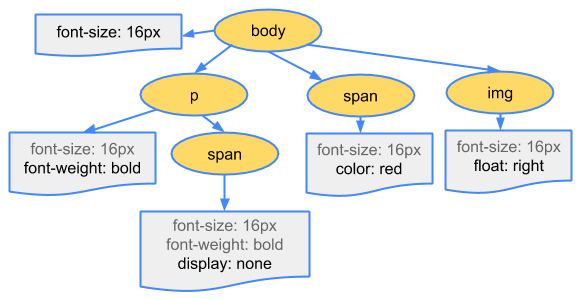

# performance

## Critical rendering path

> 关键渲染路径

Constructing the Object Model: <https://developers.google.com/web/fundamentals/performance/critical-rendering-path/constructing-the-object-model?hl=en>

### DOM parsing

 

### CSSOM parsing

 

 

### Render Tree Combination

 `Render Tree`: <https://developers.google.com/web/fundamentals/performance/critical-rendering-path/render-tree-construction?hl=en>

 

### Layout

### Paint

或称作`Raster`，栅格化

### Composite

层组合。

## Rendering performance

### jank

`jank`: <https://developers.google.com/web/fundamentals/performance/rendering/>

`60fps`, `16ms` per-frame. 浏览器还有其他事情需要完成，所以一帧最好在`10ms`内完成。如果不能完成，则会造成丢帧卡顿现象。 也即`jank`。

### 像素管道 

> the pixel pipeline

* 

    height, width, etc.

* 

    color, background, etc.

* 

    scroll, animations, etc.

### Optimize JS execution 

### 降低样式复杂度

### 避免复杂布局

### 简化绘制复杂度

### Stick to compositor-only properties and manage layer count

### Debounce your input handlers

## Chrome Devtools

