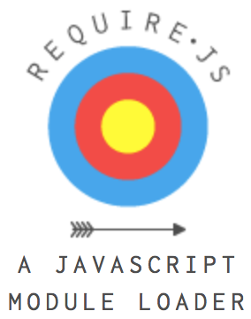

# requirejs

2016-07-04, 2014-09-30

> @[style="color:green;font-size:18px"]RequireJS implements the 
> `Asynchronous Module Definition` (formerly Transport/C) proposal.

 

* 官网：<http://requirejs.org>
* 中文网：<http://www.requirejs.cn>

针对`浏览器使用`做了优化，但也可以用于其他的JS运行环境，比如`Rhino`和`Node`。

## 使用方式

### data-main

    

以上适用于页面只有`一个`入口脚本的情况。否则使用`内联require`的方式。

### inline require

    
    

## 关于baseUrl

* 所有的脚本都按相对于`baseUrl`的路径进行加载。通常同设置为`data-main`的脚本所在路径。

* 也可以通过`require.config`进行设置：

        require.config({
            baseUrl: "/another/path",
            paths: {
                "some": "some/v1.0"
            },
            waitSeconds: 15
        });

* 例外情况，如果module id存在以下情况，则`baseUrl`不生效：
    * 以`.js`结束
    * 以`/`开始
    * 包含URL协议，比如`http:`或者`https:`
    当然，推荐使用baseUrl

## 关于require.config

> `完整配置说明：` <http://requirejs.org/docs/api.html#config>

1. `shim`配置，针对`非AMD`模块，比如`bootstrap`

        require.config({
            baseUrl: '.'
            , waitSeconds: 0 // disable timeout check
            , paths: {
                'jquery': '../bower_components/jquery/dist/jquery'
                , 'bootstrap': '../bower_components/bootstrap/dist/js/bootstrap'
                , 'underscore': '../bower_components/underscore/underscore'
                , 'rocket-p': '../bower_components/rocket-p/dist/rocket-p'
                , 'main': 'main'
            }       
            , shim: {
                // no exports, only supply deps
                'bootstrap': ['jquery']
                , 'backbone': {
                    deps: ['underscore', 'jquery']
                    , exports: 'Backbone'
                }
                , 'foo': {
                    deps: ['bar']
                    , exports: 'Foo'
                    , init: function (bar) {
                        return this.Foo.noConflict();
                    }
                }
            }
        }); 

    `例子：`提供jQuery插件的shim配置方式， <https://github.com/requirejs/example-jquery-shim>

    jQuery的特点是，不管是否运行AMD模式，都会注册`window.jQuery`和`window.$`

## 定义模块

1. 模块定义恰当处理了`作用域`，`避免污染`全局命名空间。
2. 显式列出依赖模块，并且能获得依赖模块的引用，而不需要通过全局对象的方式。使用了
    <a href="http://www.adequatelygood.com/JavaScript-Module-Pattern-In-Depth.html">
    模块模式（Module Pattern）</a>
3. 定义方式使得模块能尽可能快的加载，又能按依赖关系顺序执行。
4. 需要了解的Module格式：`CommonJS module`，`RequireJS module`

### 有哪些方式？

1. 简单`key/value`对象，没有依赖岂不更好

        // Inside file my/shirt.js:
        define({
            color: "black",
            size: "unisize"
        });

2. 定义函数

        // my/shirt.js now does setup work
        // before returning its module definition.
        define(function () {
            // Do setup work here

            return {
                color: "black",
                size: "unisize"
            }
        });

3. 带有依赖的定义函数

        // my/shirt.js now has some dependencies, a cart and inventory
        // module in the same directory as shirt.js
        define(["./cart", "./inventory"], function(cart, inventory) {
                // return an object to define the "my/shirt" module.
                return {
                    color: "blue",
                    size: "large",
                    addToCart: function() {
                        inventory.decrement(this);
                        cart.add(this);
                    }
                }
            }
        );

    `注意`：有依赖定义情况下，requirejs会认为`所有`的依赖已经`写明`在依赖列表中，`不会`再对
    factory函数进行`解析`，获取其中require行所标示的依赖模块进行提前加载。所以有依赖列表
    情况下，必须把`所有`依赖都写出来。有依赖列表的方式能省去factory函数的解析。

    
4. 定义一个模块为`函数`

    模块不一定必须返回一个对象，任何`有效返回值`都是可以的，比如函数。

        // A module definition inside foo/title.js. It uses
        // my/cart and my/inventory modules from before,
        // but since foo/title.js is in a different directory than
        // the "my" modules, it uses the "my" in the module dependency
        // name to find them. The "my" part of the name can be mapped
        // to any directory, but by default, it is assumed to be a
        // sibling to the "foo" directory.
        define(["my/cart", "my/inventory"],
            function(cart, inventory) {
                // return a function to define "foo/title".
                // It gets or sets the window title.
                return function(title) {
                    return title ? (window.title = title) :
                           inventory.storeName + ' ' + cart.name;
                }
            }
        );

5. 用简单`CommonJS`封装定义一个模块

    比如要复用`CommonJS`方式编写的模块，可以用这种方式封装。这种方式全依赖
    `Function.prototype.toString()`，使得requirejs可以通过解析require语句，分析出
    依赖关系。

        define(function(require, exports, module) {
                var a = require('a'),
                    b = require('b');

                // Return the module value
                return function () {};
            }
        );

6. 定义一个`带名字`的模块，打包的时候使用

        // Explicitly defines the "foo/title" module:
        define("foo/title",
            ["my/cart", "my/inventory"],
            function(cart, inventory) {
                // Define foo/title object in here.
           }
        );

7. `JSONP`的支持，需要返回的data是一个`JSON Object`，并将`define`作为callback

        require(['http://example.com/api/data.json?callback=define']
            , function(data){
                console.log(data);
            }
        );

    

### 模块定义注意

1. 开发过程中，一个`文件`只定义一个`模块`

2. 相对模块名的定义，务必将require作为依赖

        define(["require", "./relative/name"], function(require) {
            var mod = require("./relative/name");
        });
    
    或者更好的方式，可以`简写`成这样：

        define(function(require) {
            var mod = require("./relative/name");
        });

3. 如何生成相对于模块的路径：

        define(["require"], function(require) {
            var cssUrl = require.toUrl("./style.css");
        });

4. 对于已经通过`require(['module/name'], function(){})`加载了的模块，可以通过以下方式调用其内部函数：

        require("module/name").callSomeFunction()

## 多版本支持

通过`require.config`实现：

    
    

## 关于传统CommonJS模块

传统CommonJS模块转成requirejs支持的格式：

    define(function(require, exports, module) {
        // Put traditional CommonJS module content here
    });

另一种支持的格式，可以通过返回一个值作为module.exports：

    define(function (require) {
        var foo = require('foo');

        //Define this module as exporting a function
        return function () {
            foo.doSomething();
        };
    });

还有一种格式，直接在define函数的参数中提供依赖数组，上一种方式可以改成：

    define(['foo'], function (foo) {
        return function () {
            foo.doSomething();
        };
    });

## why AMD?

<http://requirejs.org/docs/whyamd.html>

### 模块的目的

### 今日的WEB

### CommonJS ( CJS )

#### 临时标准

stop-gap measures

#### 未充分考虑浏览器

* 网络加载
* 天生的异步特性

### AMD

#### 较之传统WEB

全局变量和script标签

#### 较之CJS模块

1. 对浏览器环境的强适应性。不受限于`调试`、`跨域/CDN使用`、`file://使用`，以及服务端工具。

2. 定义了在一个文件中包含多个模块的方式。虽然CJS中也用`传输格式`来表示这种方式，但是CJS工作组并未认可。

3. 允许`函数`作为模块`返回值`。这对于`构造函数`来说非常有用。CJS中比较不便的是，必须设置一个exports的属性才行。node道是支持`module.exports = function(){}`，但这也不属于CJS的规范。

### 模块定义

`共识`：拿到模块引用以后，需要立即可用。

#### 闭包模块的不足

用闭包返回js函数来封装模块的方式：

    (function(){
        this.myGlobal = function(){};
    })();

存在的`不足`：

1. 这种方式通过将属性绑定至一个`全局对象`，来将模块信息输出。
2. 声明模块依赖困难，依赖必须在函数执行时立即可用。
3. 限制了依赖模块的加载方式。

#### AMD的优势

1. 调用`define()`来注册一个`工厂函数`，而不是`立即执行`
2. 用`字符串ID`的数组作为`依赖传递`的载体，而不是`全局变量`
3. 当所有依赖可用以后，`仅执行`工厂函数`一次`
4. 将`依赖模块`作为`参数`传递给工厂函数

如下：

    define(['dep1', 'dep2'], function(dep1, dep2){
        return function(){};
    }); 

### 命名模块

`匿名`模块具有强大的`移植性`，可因不同的引用路径而具有不同的ID。在开发过程中，避免为模块指定ID，只需一个文件一个模块即可。

当然，为了工具或者优化的需要，`模块打包`需要在一个文件中输出多个模块，这时模块就需要显式指定ID了。这可以交给工具来完成。 

    define('myModule', ['dep1', 'dep2'], function(dep1, dep2){
            return function(){};
    });

### 语法糖

依赖列表很长的情况下，ID和函数参数的对应会变得复杂：

    define([ "require", "jquery", "blade/object", "blade/fn", "rdapi",
        "oauth", "blade/jig", "blade/url", "dispatch", "accounts",
        "storage", "services", "widgets/AccountPanel", "widgets/TabButton",
        "widgets/AddAccount", "less", "osTheme", "jquery-ui-1.8.7.min",
        "jquery.textOverflow"],
    function (require,   $,        object,         fn,         rdapi,
        oauth,   jig,         url,         dispatch,   accounts,
        storage,   services,   AccountPanel,           TabButton,
        AddAccount,           less,   osTheme) {

    });    

requirejs为你提供一块语法糖，这块儿糖同时也是对CJS模块的封装方式：

    define(function(require){
        var dep1 = require('dep1')
            , dep2 = require('dep2')
            ;
        return function(){};
    });

requirejs会自动将以上模块定义转换成：

    define(['require', 'dep1', 'dep2'], function(require){
        var dep1 = require('dep1')
            , dep2 = require('dep2')
            ;
        return function(){};
    });

### CJS兼容性

`95%`以上的CJS模块都可以用以上`语法糖`方式（简化版CJS模块封装）来封装。但也存在一些默认同步加载的CJS模块引用方式无法封装：

    var mod = require(someCondition ? 'a' : 'b');

    if(someCondition){
        require('a');
    }
    else {
        require('b');
    }

使用AMD，需要避免以上写法。

### 冗余与有用性的权衡

AMD模块相对于CJS模块需要多写一些代码：多一个缩进层级和函数封装。

但是，开发者在写代码时绝大部分的时间在与思考问题和读代码，区区多出来的几行代码只是占用极少一部分时间。

另外，函数封装的方式，对于JS开发者来说，本来就是司空见惯的存在，基本不会有任何违和感。

所以，为了AMD带来的有用性，区区的冗余是完全可以接受的。

## 高级用法

### 加载CJS packages

CJS packages内部由CJS模块目录来组织各个模块。

配置项`packages`，每个package支持`name`, `location`, `main`配置项。`location`是相对于`baseUrl`的磁盘路径。

可以在项目中支持多个版本的模块同时使用，但是尚不支持多个版本的package同时使用。

#### package目录

    project-directory/
        project.html
        scripts/
            cart/
                main.js
            store/
                main.js
                util.js
            main.js
            require.js

#### project.html

    

#### main.js

    require.config({
        packages: ['cart', 'store']
    });

    require(['cart', 'store', 'store/util']
        , function(cart, store, util){
            ...
        }
    );

`main`是requirejs的默认主模块名。如果目录中不包含`main.js`，则需要做`额外配置`。

### 多版本支持

### onError函数

    requirejs.onError = function (err) {
        console.log(err.requireType);
        if (err.requireType === 'timeout') {
            console.log('modules: ' + err.requireModules);
        }

        throw err;
    };

## 其他APIs

requirejs.undef()

## 加载器插件

### 文本依赖

text!

### onload以及domReady支持

    require(['domReady'], function(domReady){
        domReady(function(){
            ...
        });
    });

## r.js

> Runs RequireJS in Node and Rhino, and used to run the RequireJS optimizer

`两个功能`：

1. 在`Node`或`Rhino`等环境下运行`AMD规范`的项目
2. 优化器作用：`r.js`能对使用requirejs构建的前端项目进行部署优化，可将多个文件合并成单个文件，
    并进行压缩，从而避免大量对小文件的请求。

### 作为优化器的使用方法

1. 下载`r.js`至项目根目录，一般来说与源码目录和发布目录同级，其github地址为：

        https://github.com/jrburke/r.js

2. 可以有两种方法来调用`r.js`，第一种为纯命令行方式：

        node r.js -o baseUrl=. paths.jquey=some/other/jquery name=main out=main-build.js    

    第二种为使用配置文件的方式，例如build.js，与r.js同级目录：

        node r.js -o build.js

    使用`-o`开启优化模式。一般项目推荐使用第二种方式。

### build.js文件 

举例如下：

1. todo mvc的优化案例：

    可以在这里
    `
    http://www.webdeveasy.com/code/optimize-requirejs-projects/todo-mvc-optimized.zip
    `
    下载项目查看。

        ({
            appDir: './',
            baseUrl: './js',
            dir: './dist',
            modules: [
                {
                    name: 'main'
                }
            ],
            fileExclusionRegExp: /^(r|build)\.js$/,
            optimizeCss: 'standard',
            optimize: 'none',
            removeCombined: true,
            paths: {
                jquery: 'lib/jquery',
                underscore: 'lib/underscore',
                backbone: 'lib/backbone/backbone',
                backboneLocalstorage: 'lib/backbone/backbone.localStorage',
                text: 'lib/require/text'
            },
            shim: {
                underscore: {
                    exports: '_'
                },
                backbone: {
                    deps: [
                        'underscore',
                        'jquery'
                    ],
                    exports: 'Backbone'
                },
                backboneLocalstorage: {
                    deps: ['backbone'],
                    exports: 'Store'
                }
            }
        })

2. 其他案例： 

        {
            baseUrl: "../js",
            dir: "../dist",
            optimize: "uglify",
            optimizeCss: "standard.keepLines",
            mainConfigFile: "../js/main.js",
            removeCombined: true,
            fileExclusionRegExp: /^\./,
            modules: [
                {
                    name: "app/dispatcher",
                },
                {
                    name: "app/in-storage",
                    exclude: [
                        "jquery",
                        "app/common",
                        "pkg/DatePicker/app"
                    ]
                }
            ]
        }

3. 优化选项说明

所有选项说明可以从这里查看：<a href="
https://github.com/jrburke/r.js/blob/master/build/example.build.js
">
https://github.com/jrburke/r.js/blob/master/build/example.build.js
</a>

以下例举主要选项：

* appDir

    应用程序的最顶层目录。可选的，如果设置了的话，r.js 会认为脚本在这个路径的子目录中，应用程序的文件都会被拷贝到输出目录（dir 定义的路径）。如果不设置，则使用下面的 baseUrl 路径。

* baseUrl

    默认情况下，所有的模块都是相对于这个路径的。如果没有设置，则模块的加载是相对于 build 文件所在的目录。另外，如果设置了appDir，那么 baseUrl 应该定义为相对于 appDir 的路径。

* dir

    输出目录的路径。如果不设置，则默认为和 build 文件同级的 build 目录。

* optimize

    JavaScript 代码优化方式。可设置的值：

    * "uglify：使用 UglifyJS 压缩代码，默认值；
    * "uglify2"：使用 2.1.2+ 版本进行压缩；
    * "closure"： 使用 Google's Closure Compiler 进行压缩合并，需要 Java 环境；
    * "closure.keepLines"：使用 Closure Compiler 进行压缩合并并保留换行；
    * "none"：不做压缩合并；

* optimizeCss

    CSS 代码优化方式，可选的值有：

    * "standard"：标准的压缩方式；
    * "standard.keepLines"：保留换行；
    * "standard.keepComments"：保留注释；
    * "standard.keepComments.keepLines"：保留换行；
    * "none"：不压缩；

* mainConfigFile

    如果不想重复定义的话，可以使用这个参数配置 RequireJS 的配置文件路径。

* removeCombined

    删除之前压缩合并的文件，默认值 false。

* fileExclusionRegExp

    要排除的文件的正则匹配的表达式。

* modules

    定义要被优化的模块数组。每一项是模块优化的配置，常用的几个参数如下：

    * name：模块名；
    * create：如果不存在，是否创建。默认 false；
    * include：额外引入的模块，和 name 定义的模块一起压缩合并；
    * exclude：要排除的模块。有些模块有公共的依赖模块，在合并的时候每个都会压缩进去，
        例如一些基础库。使用 exclude 就可以把这些模块在压缩在一个更早之前加载的模块中，
        其它模块不用重复引入。`注意，其是一个数组类型`    

### 优化原理

多个文件合并成一个文件，文件内由多个define方法构成，使用模块ID的方式：

    define('ID', [...], function(){});

比如合并好的文件如下：

    ...
    // 第一部分
    define("backboneLocalstorage", ["backbone"], (function (global) {
        return function () {
            var ret, fn;
            return ret || global.Store;
        };    
    }(this)));

    // 第二部分
    define('models/todo',['require','underscore','backbone'],function(require) {

        var _ = require('underscore');
        var Backbone = require('backbone');
    ...

    // 第三部分
    define('collections/todos',[
        'underscore',
        'backbone',
        'backboneLocalstorage',
        'models/todo'
    ], function( _, Backbone, Store, Todo ) {
      
        var TodosCollection = Backbone.Collection.extend({
            // Reference to this collection's model.
            model: Todo, 
    ...

其中，第二部分的代码在合并前为：

    define(function(require) {          
                                        
        var _ = require('underscore');  
        var Backbone = require('backbone');  

        ...

第三部分代码在合并前为：

    define([
        'underscore',
        'backbone',
        'backboneLocalstorage',
        'models/todo'
    ], function( _, Backbone, Store, Todo ) { 

        var TodosCollection = Backbone.Collection.extend({
            // Reference to this collection's model.
            model: Todo,
    ...

第一部分代码是新生成的，由于backbone.Localstorage.js没有使用AMD方式编写，所以使用`shim`（垫片）方式。

### 参考资料

1. `前端优化：RequireJS Optimizer 的使用和配置方法`：
    http://www.cnblogs.com/lhb25/p/requirejs-ptimizer-using.html 

2. 翻译版：http://blog.jobbole.com/39205/

    原版： http://www.webdeveasy.com/optimize-requirejs-projects/

    
