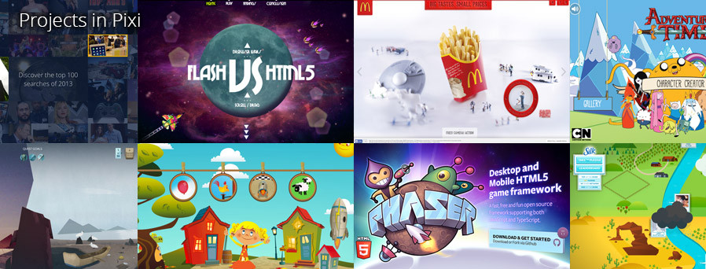
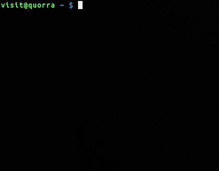

## 2D渲染引擎

* pixi.js
    2. JavaScript 2D Renderer: The aim of this project is to provide a fast lightweight 2D library that works across all devices. The Pixi renderer allows everyone to enjoy the power of hardware acceleration without prior knowledge of webGL. Also its fast.
    1. https://github.com/GoodBoyDigital/pixi.js
    3. 
    4. <a href="http://www.theleisuresociety.co.uk/fightforeveryone/">fight for everyone</a>

## slides
* mdp 
    1. A command-line based markdown presentation tool
    1. https://github.com/visit1985/mdp
    2.  

## 3D渲染引擎

* d3
    1. D3.js is a JavaScript library for manipulating documents based on data. D3 helps you bring data to life using HTML, SVG and CSS. D3’s emphasis on web standards gives you the full capabilities of modern browsers without tying yourself to a proprietary framework, combining powerful visualization components and a data-driven approach to DOM manipulation.
    2. https://github.com/mbostock/d3
    3. 来自纽约时报的`Mike Bostock`
    4. <a href="https://github.com/mbostock/d3/wiki/Gallery">Gallery</a>
        以及： <a href="http://bl.ocks.org/mbostock">http://bl.ocks.org/mbostock</a>
    4. show:
        * <a href="http://bl.ocks.org/mbostock/061b3929ba0f3964d335">Maze Tree</a>
        * http://www.findtheconversation.com/concept-map/

## webapp framework

* Knockout
    1. Knockout is a JavaScript MVVM (a modern variant of MVC) library that makes it easier to create rich, desktop-like user interfaces with JavaScript and HTML. It uses observers to make your UI automatically stay in sync with an underlying data model, along with a powerful and extensible set of declarative bindings to enable productive development.  
    2. https://github.com/knockout/knockout
    3. <a href="http://knockoutjs.com/examples/">examples</a>
