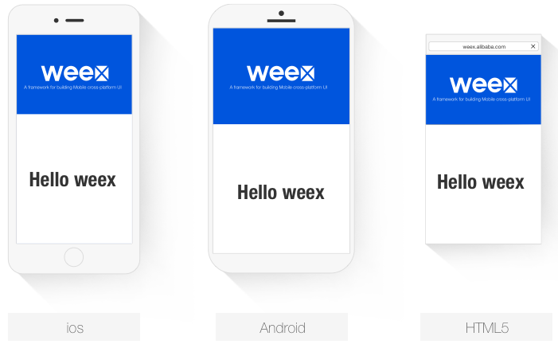

# weex

> A framework for building Mobile cross-platform UI

 

* site: <https://weex-project.io/>
* community: <http://www.weex.help>
* docs: <http://www.weex.help/topic/57792770eb60516a48db5485>
* `weex sdk`，使用前端语言来编写Native级别的页面
* 解决`频繁发版`和`多端研发`两大痛点
* 支持iOS、Android、YunOS以及Web
* `2016年12月15日`，阿里巴巴宣布将移动开源项目Weex捐赠给`Apache`基金会开始孵化，Weex有望成为中国移动领域的首个Apache顶级项目，这意味着中国移动技术开始反哺世界。据悉，这也是继`JStorm`、`RocketMQ`之后，阿里向Apache捐赠的第三个项目。
* 轻量、可扩展、高性能
* 跨平台，Native速度

## get started

	<template>
	  

		

		  
		  <text class="desc">...</text>
		

		

		  <text class="text">Hello weex</text>
		

	  

	</template>
	

三端展现效果：

 

## todo

 install
