# git

2017-02-04,
2017-01-19,
2017-01-18,
2017-01-11,
2016-12-02,
2016-11-05,
2016-07-28,
2016-03,
2015,
2014,
2013,
2012

* site: <https://git-scm.com>
* docs: <https://git-scm.com/doc>
* 参考图文教程： <http://pcottle.github.io/learnGitBranching/?demo>

    github: <https://github.com/pcottle/learnGitBranching>

    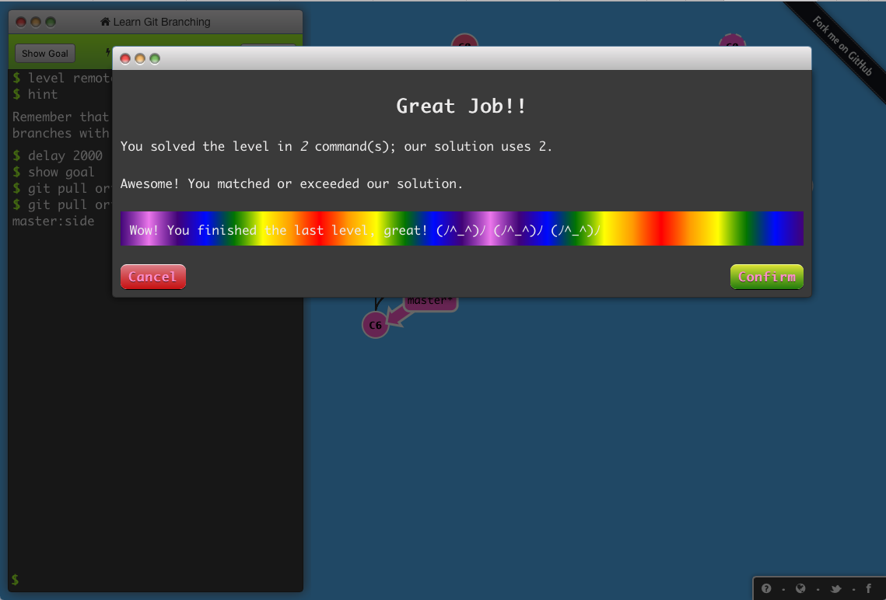

## Tips

* 使用`git rebase -i`或`git cherry-pick`，交换commit的顺序
* 使用`git branch -f`强制修改分支的指向
* `git reset <reset-to-target>`与`git revert <reverted-commit>`的区别之一，后者有log
* `origin/master`分支，仅在`远端master`分支更新时才会更新，`不作为本地的一个可更新分支`，本地checkout出来，只作为普通commit看待，HEAD指向`origin/master`时，处于`detached HEAD`状态。

        git checkout origin/master
        git commit

    此时，`origin/master`并不会更新。
* `git pull`与`git fetch`, `git merge`命令组合的`等价`关系
    * 理解`git pull origin master^:tmp`
    * `git pull`对当前分支的`副作用`
* 从remote同步的时候，使用`rebase`与`merge`，取决于喜好问题。
* `pull`与`push`之所以能够同步本地和远程对应的分支，原因在于`master`与`origin/master`分支的关系，也就是`upstream`

        git checkout -b abc origin/master

    或
        
        git branch -u origin/master abc
        git branch --set-upstream-to origin/master abc

    设置好track关系后，`git status`命令会有如下输出：

        hudamin@local SophonWeb $ git status
        On branch master
        Your branch is behind 'origin/master' by 4 commits, and can be fast-forwarded.
          (use "git pull" to update your local branch)

## Concepts

### Commit vs Branch

> 本质上是一致的

* lightweight branch
* branch is only a `pointer` to a commit

### HEAD

* 当前检出的commit的别名
* `通常指向`分支名，如果通过`git checkout`指向commit或者tag，则会变成detaching HEAD状态

### Detaching HEAD

> HEAD不指向分支名，而指向commit的状态

    git checkout -b bugFix  # commit c1
    git checkout c1         # detaching HEAD

`HEAD -> bugFix -> c1`  => `HEAD -> c1`

### Relative Refs

`fed2da64c0efc5293610bdd892f82a58e8cbc5d8a`  => `fed2`

#### ^ 操作符

    # checkout出 master的父commit，HEAD detached到父commit
    git checkout master^
    # checkout出 master的爷爷commit，HEAD detached到爷爷commit
    git checkout master^^

    git checkout C3
    git checkout HEAD^
    git checkout HEAD^
    git checkout HEAD^

`^num`，指明往上追溯时，parents中选择第几个parent，默认是第一个，可以指定第二个（merge时的merged分支）

    git checkout master^2
    git checkout HEAD^2

 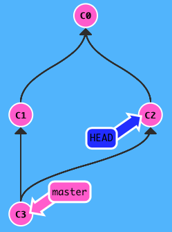

#### ~num 操作符

    git checkout bugFix
    git checkout HEAD~4
    git reset HEAD~1
    git branch -f master HEAD~3

`HEAD~`代表`HEAD~1`。`~num`指明往上追溯num个祖先commit。

#### 混用操作符

    git checkout HEAD~^2~2

达到如下效果：

 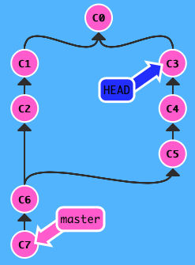

其他例子如：

    git branch bugWork HEAD^^2~

### TAG

> 不变的永久历史锚点。

添加后，可以像branch一样checkout出来，但是不能在它之上提交更新。

## git checkout

常用命令：

    git checkout -f <new_branch> [<start_point>]
    git checkout -b <new_branch> [<start_point>]
    git checkout -B <new_branch> [<start_point>]
    git checkout -- <filename> 
    git checkout <commit> -- <filename> 
    git checkout master^
    git checkout master^^

例子：

    # 即使map存在，也强行reset
    git checkout -B map 41e86dec9d37b74e12b234fa5b95c35943f52932

    # 从develop分支fork出功能分支
    git checkout -b some-feature develop

    # 恢复filename文件到当前工作目录的commit
    git checkout -- filename

    # 恢复filename文件到commit所指的状态
    git checkout 41e86dec9d37b74e12b234fa5b95c35943f52932 -- filename

## git diff

常用命令：

    # 当前文件与暂存区文件比较
    git diff <file>

    # 两次提交或两个分支HEAD之间的差异
    git diff <commit1> <commit2> <file>
    git diff <branch1> <branch2> <file>
    git diff <commit1>..<commit2> <file>
    git diff <branch1>..<branch2> <file>
    git diff <commit> -- <file>

    # 两次提交的公共merge祖先与commit2的比较，两次commit需遵从历史先后关系
    git diff <commit1>...<commit2> <file>
    git diff <branch1>...<branch2> <file>

    # 暂存区与版本库差异
    git diff --staged <file>
    git diff --cached <file>

其他options：

    --stat 显示统计信息

以上<file>可以是文件，也可以是目录。

## git log

    git log [<options>] [<revision range>] [[--] <path>...]

常用命令：

    # 最近n次修改日志
    git log -n <file>

    # 详细修改日志
    git log -p <file>

    # 包括文件更名情况下的日志 
    git log --follow <single-file>

    # 最近n次详细修改日志
    git log -p -n <file>

    # 修改日志统计信息，包含文件名和概要
    git log --stat <file>

`commit log`按时间先后逆序排布，但是最近的commit不一定比较远的commit对应的代码包新，比如下图，`hangzhou1229-newlogo`分支是第二个commit，但是该分支是基于半个月前的master分支进行的一个patch。

 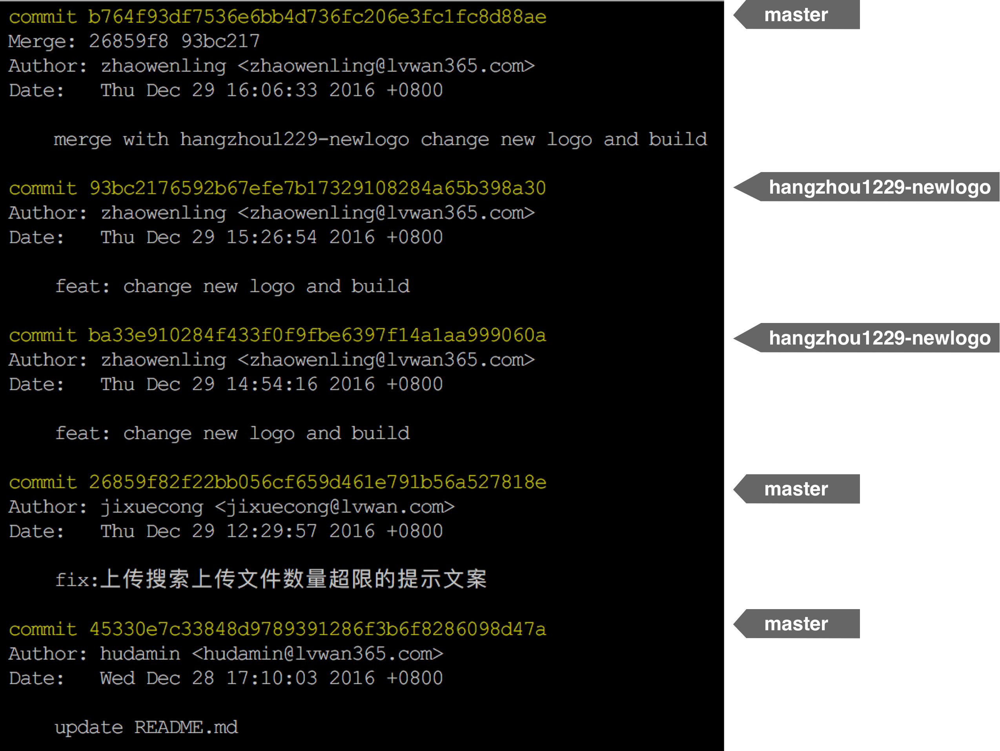

### 有用日志信息Merge

> `Merge字`段，提示该分支的merge信息，在分析日志的时候，可以追溯其合并的分支

如下命令输出的`Merge: 88e579f 04ece21`，表明了commit `314d8b0`合并了`88e579f`以及`04ece21 ( master分支 )`。

	git log

	commit 314d8b02b6525fd19e54fd8d87342c6003506630
	Merge: 88e579f 04ece21
	Author: hudamin <hdm258i@gmail.com>
	Date:   Wed Jan 18 15:33:20 2017 +0800

		Merge branch 'master' into feature

	commit 04ece21e5c768a2873872d6cb46f3fe1e3716cce
	Author: hudamin <hdm258i@gmail.com>
	Date:   Wed Jan 18 15:32:18 2017 +0800

		master: add package.json

	commit 88e579fceb709879649a900b7caf4f1fe30f7789
	Merge: 09b9c7b e248118
	Author: hudamin <hdm258i@gmail.com>
	Date:   Wed Jan 18 15:30:10 2017 +0800

		Merge branch 'master' into feature

## git add

常用命令：

    # 添加当前目录下的所有文件
    git add .

    # 添加当前目录下已有文件的更新
    git add -u .

    # 添加整个目录树下已有文件的更新 
    git add -u

    # 根据当前工作目录树来添加、修改或者移除索引 
    git add --all .

    # 根据整个工作目录树来添加、修改或者移除索引 
    git add --all

## git commit

    # 提交更新到本地仓库
    git commit -m "COMMENT MESSAGE"

    # 添加modifined的内容并提交到本地仓库
    git commit -am "COMMENT MESSAGE"

    # 更改上一次提交的日志
    git commit --amend -m "COMMENT MESSAGE"

## git push

常用命令：

    # 上传本地分支至远程分支
    git push origin master
    git push origin master:master

    # 删除远程分支abc
    git push origin :abc

    # 上传tags
    git push --tags

    # 上传git push本身包含的内容之外，还包含tags
    git push --follow-tags

    # 上传所有分支
    git push --all

    # 镜像同步远程仓库，包括branch、tag等，
    # 本地存在、远程不存在的会上传；本地删除、远程存在的会在远程删除
    git push --mirror

    # 设置upstream
    git push -u origin marys-feature
    git push --set-upstream origin marys-feature

todo: `git config --set push.default ...`

    git push origin master^:abc

## git init

    git init --bare /path/to/repo.git

## git reset

* 适用于本地分支的重置，可以重写本地历史，但`不能`记录到`log`中。
* 分支参数指定的是reset后的`新目标分支`

例如：

    git reset --hard <newbase>

`等同`于：

    git rebase --onto <newbase>

往后退一个commit：

    git reset HEAD^

或

    git reset HEAD~1

## git revert

回退`指定commit`，需要确保`当前工作目录是干净的`。

> 分支参数指定的是需要`被revert的commit`。

    git revert <commit>...
    git revert --continue
    git revert --quit
    git revert --abort

> 与reset不一样的是，revert`能记录到log中`，远程也能看到。

例如：

    git revert 38e35a630575d5412ce1c91de47f32455a52b1d6
    git log

	commit dfcecbd98f7040793fcb7d87c4044246da7a99ff
	Author: hudamin <hdm258i@gmail.com>
	Date:   Wed Jan 18 21:01:17 2017 +0800

		Revert "feature: update package.json"

		This reverts commit 38e35a630575d5412ce1c91de47f32455a52b1d6.

	commit 38e35a630575d5412ce1c91de47f32455a52b1d6
	Author: hudamin <hdm258i@gmail.com>
	Date:   Wed Jan 18 15:41:36 2017 +0800

		feature: update package.json

## git merge

### 命令

    $ git branch
      map
    * map-snapshot
    $ git checkout map
    $ git merge map-snapshot
    Merge made by the 'recursive' strategy.
     src/components/graphHistory/index.js | 8 ++++++++
      1 file changed, 8 insertions(+)

    # 不自动提交一个commit，或希望自己添加commit说明时
    $ git merge --no-commit maint

    # 放弃merge过程
    $ git merge --abort

    # 更新master分支
    git fetch
    git merge origin/master

`recursive` strategy

### 例子

> `merge`按`时间先后顺序`合并不同分支上的提交。注意与`rebase`的区别。

另外，merge如果不添加`--no-commit`选项的话，会出现一个没啥意义的`Merge branch ...` commit

	git checkout -b feature/watermark1
	# we now in feature/watermark1 branch
	git add
	git commit -m "feature/watermark1: just for test2"
	git log
	
		commit 15bc60a9f86c9f63baad9e8418c3b891a713ecb4
		Author: hudamin <hudamin@lvwan365.com>
		Date:   Thu Jan 12 16:24:38 2017 +0800
	
			feature/watermark1: just for test2
	
		commit 4ccc58d77f1c9d2d51d2e5278176edb756c00d8b
		Author: hudamin <hudamin@lvwan365.com>
		Date:   Thu Jan 12 16:05:40 2017 +0800
	
			....	
	
	
	git checkout feature-watermark-170107
	git add
	git commit -m "feature-watermark-170107: remove just for test"
	git log
	
		commit 30754f379de39fc9bee5d36279e61c6df54f8dc0
		Author: hudamin <hudamin@lvwan365.com>
		Date:   Thu Jan 12 16:25:36 2017 +0800
	
			feature-watermark-170107: remove just for test
	
		commit 4ccc58d77f1c9d2d51d2e5278176edb756c00d8b
		Author: hudamin <hudamin@lvwan365.com>
		Date:   Thu Jan 12 16:05:40 2017 +0800
	
			....	
	
	
	git checkout feature/watermark1
	git merge feature-watermark-170107
	git log
	
		commit 89b50bea2059c7c937557f934401d57d59277c2b
		Merge: 15bc60a 30754f3
		Author: hudamin <hudamin@lvwan365.com>
		Date:   Thu Jan 12 16:32:00 2017 +0800
	
			Merge branch 'feature-watermark-170107' into feature/watermark1
	
		commit 30754f379de39fc9bee5d36279e61c6df54f8dc0
		Author: hudamin <hudamin@lvwan365.com>
		Date:   Thu Jan 12 16:25:36 2017 +0800
	
			feature-watermark-170107: remove just for test
	
		commit 15bc60a9f86c9f63baad9e8418c3b891a713ecb4
		Author: hudamin <hudamin@lvwan365.com>
		Date:   Thu Jan 12 16:24:38 2017 +0800
	
			feature/watermark1: just for test2

## git rebase

The second way of combining work between branches is `rebasing`. Rebasing essentially `takes a set of commits, "copies" them, and plops them down somewhere else`.

While this sounds confusing, the advantage of rebasing is that it can be used to make a nice linear sequence of commits. `The commit log / history of the repository will be a lot cleaner if only rebasing is allowed`.

> 使不同功能的提交历史形成串式，通常在需要`往父分支合并前`进行rebase操作。

    git checkout master
    git commit
    git checkout -b bugFix
    git commit
    git rebase master
    git checkout master
    git rebase bugFix

 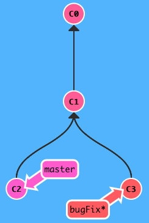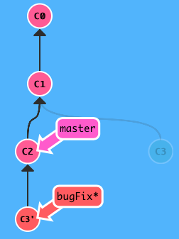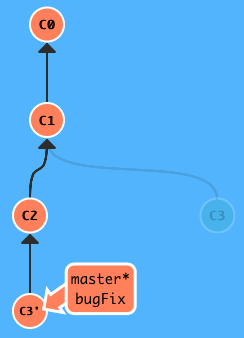

    # 从master fork出新分支
    git checkout -b some-feature master

    # 编辑提交
    git add
    git commit

    # 更新master
    git checkout master
    git pull origin master

    # some-feature的更新串接至master头部
    git rebase master topic

    # 合并some-feature分支，Fast-forward过程
    git merge topic

### 说明

> `git rebase master topic`

`普通rebase`，将topic分支的提交置于master分支顶部，形成串联提交。

          A---B---C topic                          A'--B'--C' topic
         /                   ->                   /
    D---E---F---G master             D---E---F---G master

若`master`分支中也有`同样`的历史`提交`，会进行`合并`。

         A---B---C topic                            B'---C' topic
        /                    ->                    /
    D---E---A'---F master            D---E---A'---F master       

对`topic`分支有`副作用`，执行rebase后，topic分支发生了变化，但是master没有变化。
这时可以`git rebase topic master`，完成topic到master的串行合并。

若项目中只允许rebase，而不允许merge的话，那么仓库历史总是串行而干净利落。

### 常用命令

    git rebase <upstream> <branch>
    git rebase master topic
    git rebase --continue
    git rebase --skip
    git rebase --abort

命令`git rebase master topic`等同于( `master头部`接上`topic`的改动)：

    git checkout topic
    git rebase master

相关命令：

    git pull --rebase origin master

### 交互式rebase

    git rebase -i <newbase>

会弹出选择框，`由你来决定哪些commit需要包含进来`。

### 例子

> rebase后，commit的`时间`保持`不变`，但是在`显示顺序`上发生`变化`

	git checkout -b feature/watermark feature-watermark-170107
	# now we in branch feature/watermark
	git log

		commit 04dc2acd30f848c90cc4c1340c6ff21bafa3e53d
		Author: jixuecong <jixuecong@lvwan.com>
		Date:   Wed Jan 11 15:20:47 2017 +0800

			修改水印位置

	git add
	git commit -m "feature/watermark: add searchSelectedItem markType"
	git log
		commit a088e00d2bc2b167f46f40078113f9b740c08749
		Author: hudamin <hudamin@lvwan365.com>
		Date:   Thu Jan 12 16:05:40 2017 +0800

			feature/watermark: add searchSelectedItem markType

		commit 04dc2acd30f848c90cc4c1340c6ff21bafa3e53d
		Author: jixuecong <jixuecong@lvwan.com>
		Date:   Wed Jan 11 15:20:47 2017 +0800

			修改水印位置

	git checkout feature-watermark-170107
	git log

		commit 04dc2acd30f848c90cc4c1340c6ff21bafa3e53d
		Author: jixuecong <jixuecong@lvwan.com>
		Date:   Wed Jan 11 15:20:47 2017 +0800

			修改水印位置

	git add
	git commit -m "feature-watermark-170107: just for test"
	git log

		commit 9b4d99d5a7bb7b939ded3de521b2ec971e4bc3cb
		Author: hudamin <hudamin@lvwan365.com>
		Date:   Thu Jan 12 16:07:03 2017 +0800

			feature-watermark-170107: just for test

		commit 04dc2acd30f848c90cc4c1340c6ff21bafa3e53d
		Author: jixuecong <jixuecong@lvwan.com>
		Date:   Wed Jan 11 15:20:47 2017 +0800

			修改水印位置

	git checkout feature/watermark
	git rebase feature-watermark-170107
	git log

		commit 4ccc58d77f1c9d2d51d2e5278176edb756c00d8b
		Author: hudamin <hudamin@lvwan365.com>
		Date:   Thu Jan 12 16:05:40 2017 +0800

			feature/watermark: add searchSelectedItem markType

		commit 9b4d99d5a7bb7b939ded3de521b2ec971e4bc3cb
		Author: hudamin <hudamin@lvwan365.com>
		Date:   Thu Jan 12 16:07:03 2017 +0800

			feature-watermark-170107: just for test

		commit 04dc2acd30f848c90cc4c1340c6ff21bafa3e53d
		Author: jixuecong <jixuecong@lvwan.com>
		Date:   Wed Jan 11 15:20:47 2017 +0800

			修改水印位置

## merge or rebase

There's a lot of debate about the tradeoffs between merging and rebasing in the development community. Here are the general `pros / cons of rebasing`:

Pros: Rebasing makes your commit tree look very clean since everything is in a straight line

Cons: Rebasing modifies the (apparent) history of the commit tree.

For example, commit C1 can be rebased past C3. It then appears that the work for C1' came after C3 when in reality it was completed beforehand.

> 取决与`个人喜好`，是喜欢提交树的清晰可见，还是喜欢保留原汁原味的提交历史。团队最好确定一种方式。

## git config

写在`.git/config`文件中：

    git config user.name MichaelHu
    git config user.email hdm258i@gmail.com

写在全局~/.gitconfig文件中：

    git config --global user.name MichaelHu
    git config --global user.email hdm258i@gmail.com

设置`ignorecase`选项，确保文件名大小写严格区分，`默认`的ignorecase是`true`，如果要区分大小写，需要显式设置：

    git config --get core.ignorecase
    git config core.ignorecase false

如果设置`全局`，则：

    git config --global core.ignorecase false

## git remote

### git remote add

添加`远程`origin`仓库`的`URL`：

    git remote add origin https://github.com/MichaelHu/fast-slides.git

### git remote rm

`删除`远程仓库`引用`：

    git remote rm origin

### push问题

问题解决：在某些机器（比如测试机或机房机器）使用git时，可以正常clone、fetch，但是`push`的时候出现以下错误提示：

    [irice@iZ25o3dvl9aZ fast-slides]$ git push origin master
    error: The requested URL returned error: 403 Forbidden while accessing https://MichaelHu@github.com/MichaelHu/fast-slides.git/info/refs

    fatal: HTTP request failed

命令过程也`没有`提示输入密码，所以有错误提示也是正常的。`靠谱`的解决办法是：

    git remote set-url origin https://MichaelHu@github.com/MichaelHu/fast-slides.git

关键在于`username@`这一部分的添加。设置好以后，再次push的时候，就会`提示输入密码`。

另外按网上的方案通过`git config [--global] user.name ...`和`git config [--global] user.email ...`来设置用户名和邮箱，也不行（至少我这里没有试成功）。

这时，运行`git remote show origin`，得到如下信息：

    [irice@iZ25o3dvl9aZ fast-slides]$ git remote show origin
    * remote origin
      Fetch URL: https://github.com/MichaelHu/fast-slides.git
      Push  URL: https://MichaelHu@github.com/MichaelHu/fast-slides.git
      HEAD branch: master
      Remote branch:
        master tracked
      Local branch configured for 'git pull':
        master merges with remote master
      Local ref configured for 'git push':
        master pushes to master (fast-forwardable)

Push URL需要`身份验证`。

以上通过`set-url`，在密码提示框输入密码的情况，还有可能会遇到以下问题：

    [hudamin@258i my-help]$ git push

    (gnome-ssh-askpass:19541): Gtk-WARNING **: cannot open display:

遇到这种情况，简单的处理办法是将环境变量`SSH_ASKPASS`去掉：

    $ unset SSH_ASKPASS

参考<http://blog.163.com/hevensun@126/blog/static/2015336320143413148101/>

## git fetch

    # 更新本地的远程分支，比如origin/master, origin/develop
    git fetch
    git fetch origin
    git fetch origin foo

* `只将`本地的远程分支，比如`origin/master`, `origin/develop`和远程的`对应分支`进行`同步`
* `绝对不会`更新本地分支`master`

以下命令：

    git fetch origin :bar

比较奇怪，git的行为是创建新分支`bar`

## git pull

### 常用命令

    git pull origin master
    git pull --rebase origin master

    git pull origin master^:bugfix

 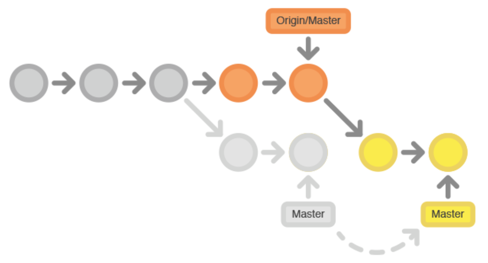

`rebase`过程中，出现`合并冲突`，如下图所示：

 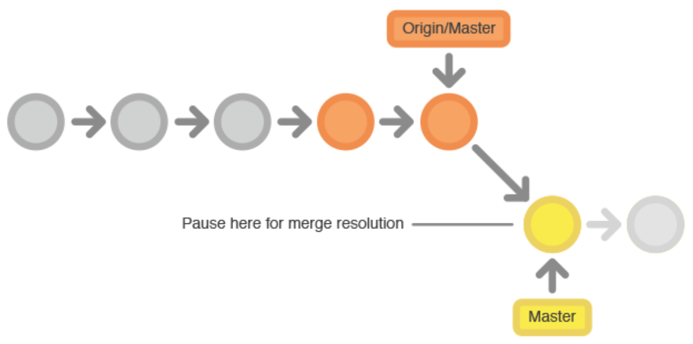

可以通过`git status`查看冲突文件，并编辑冲突文件，然后继续进行rebase:

    git add 
    git rebase --continue

如果发现冲突无法解决，则可以通过

    git rebase --abort

回到`git pull --rebase origin master`命令执行前的状态。

### 问题

#### refusing

    fatal: refusing to merge unrelated histories

遇到以上问题，可能由于你操作过`git commit --amend`，最终导致无法merge，后续的push/pull都无法继续。
查看stackoverflow（<http://stackoverflow.com/questions/37937984/git-refusing-to-merge-unrelated-histories>），`git merge`有这样的说明：

"git merge" used to allow merging two branches that have no common base by default, which led to a brand new history of an existing project created and then get pulled by an unsuspecting maintainer, which allowed an unnecessary parallel history merged into the existing project. The command has been taught not to allow this by default, with an escape hatch "--allow-unrelated-histories" option to be used in a rare event that merges histories of two projects that started their lives independently.

所以，使用`--allow-unrelated-histories`选项能解决问题，副作用就是两个不同历史的分支会合并。

#### rejected

	hudamin@local SophonWeb $ git pull origin master:release/watermark
	From 172.22.1.88:sophon/SophonWeb
	 ! [rejected]        master     -> release/watermark  (non-fast-forward)
	   b6a5fa3..43a1843  master     -> origin/master

`non-fast-forward`，master本来就是`release/watermark`已经合并过的。
另外，如果`develop`刚从`master` fork下来的时候，执行`git pull`，也会出同样的提示`![rejected]`。

## fetch & pull

`pull`是`fetch`与`merge`的等价方式：

    git pull origin foo

等价于：

    git fetch origin foo
    git merge origin/foo

再有：

    git pull origin bar~1:bugFix

等价于：

    git fetch origin bar~1:bugFix
    git merge bugFix

* 切记：`git pull`对`当前分支`有`副作用`

## git branch

Branches in Git are incredibly `lightweight` as well. They are simply `pointers to a specific commit` -- nothing more. This is why many Git enthusiasts chant the mantra:

> branch early, and branch often

Because there is `no storage / memory overhead` with making many branches, it's easier to logically divide up your work than have big beefy branches.

When we start mixing branches and commits, we will see how these two features combine. For now though, just remember that a branch essentially says `"I want to include the work of this commit and all parent commits."`

### 分支列表

    # 列出本地分支
    git branch

    # 列出远程分支
    git branch -r

    # 本地&远程都列出
    git branch -a

### 创建分支

    # 创建和当前分支一样的新分支
    git branch <branchname>

    # 创建和当前分支一样的新分支，新分支track当前分支
    git branch --track <branchname> 
    # 同上
    git branch --set-upstream <branchname> 

`<branchname>`所指分支是`新建`分支，当前不存在。

设置track后的`git status`:

    hudamin@local SophonWeb $ git status
    On branch ddd
    Your branch is up-to-date with 'map'.
    nothing to commit, working directory clean
    hudamin@local SophonWeb $ git status -sb
    ## ddd...map

### 更改分支upstream

    git branch -u <upstream> <branchname> 
    git branch --set-upstream-to <upstream> <branchname> 
    git branch --unset-upstream <branchname> 

`<branchname>`所指分支是`已存在`分支。

设置track后的`git status`:

    hudamin@local SophonWeb $ git checkout map
    Switched to branch 'map'
    Your branch is up-to-date with 'origin/master'.
    hudamin@local SophonWeb $ git status -sb
    ## map...origin/master

### 删除分支

    # 删除本地分支（不能是当前分支）
    git branch -d <branchname>
    # 同上，但支持强行删除
    git branch -D <branchname>

    # 删除远程分支
    git branch -rd <branchname>
    # 同上，但支持强行删除
    git branch -rD <branchname>

注：远程分支的删除属于`伪删除`，它的作用在于删除以后，通过`git branch -r`不再列出。
`真删除`远程分支，需要使用`git push <repo> :<branchname>`。

### 重命名分支

    git branch -m <oldbranch> <newbranch>
    git branch -M <oldbranch> <newbranch>

### 强制修改分支

    # master往后退3个commit
    git branch -f master HEAD~3

    # bugFix指向master分支的爷爷commit
    git branch -f bugFix master^^

## git tag

    # 在commit上打tag
    git tag <tagname> <commit>

    # 在HEAD上打tag
    git tag -a <tagname> -m <comment>

## git describe

    git describe <ref>

其中`<ref>`是任何能解析成commit的值。
以上命令的输出是:

    <tag>_<numCommits>_g<hash>

* `<tag>`: 最近的祖先tag，如果当前`ref同时指向一个tag`，则返回`当前tag`
* `<numCommits>`: 与那个tag相隔的commit数 
* `<hash>`：被描述的`<ref>`的commit hash

例如：

    hudamin@local SophonWeb $ git describe
    sophonweb_170112-2110_508f082_alpha-4-70-gc674fbe

## git stash

> 将针对当前工作目录的改动`暂存`，相比新建branch更加`轻量`。

### stash列表

    git stash list

### 创建stash

    git stash 
    git stash save <message>

### 应用stash

    git stash pop
    git stash apply

### 删除stash

    git stash drop <stashname>

## git rev-parse

    git rev-parse master
    802bc153526bdb7ab1aa07e5b8b694906d52e907

    git rev-parse HEAD
    802bc153526bdb7ab1aa07e5b8b694906d52e907

    git rev-parse --short HEAD
    802bc15

    git rev-parse --all
    c981e44a3eb090eb7f27504953733cb343f0800f
    802bc153526bdb7ab1aa07e5b8b694906d52e907
    c981e44a3eb090eb7f27504953733cb343f0800f
    eb9a30eafae1d9bb5b579460d326adaf2154c231
    33b0546012b182c2c8eccd6a89499975ab9f28a0

    git rev-parse --show-toplevel
    /home/Users/hudamin/git/mydocs

    git rev-parse --symbolic --all
    refs/heads/develop
    refs/heads/master

    git rev-parse --git-dir

## git rev-list

    git rev-list --all

    git rev-list --timestamp --max-count=5 --all
    1480420721 802bc153526bdb7ab1aa07e5b8b694906d52e907
    1480420243 c53d12cecddd194925dcba1d79fe4bf362a71a24
    1480419586 94a92415050bc95e3764e9b5dd80672784f00ac9
    1480419039 f9699aef7ec77a4ad3aa67ff0e4e49307074dadb
    1480418999 aeabcc2deca6e6f2a7608d1411d5a53565a5e328

## git file mode

* refer: <http://stackoverflow.com/questions/1580596/how-do-i-make-git-ignore-file-mode-chmod-changes>

文件内容未变，但是`pull`的时候发现以下`diff`信息：

	mode change 100644 => 100755 build/favicon.ico
	mode change 100644 => 100755 build/index.html
	mode change 100644 => 100755 build/js/1.7dfac55a.js
	mode change 100644 => 100755 build/js/10.9a21928a.js

原因是文件模式发生了变化。可以通过`git config`设置忽略此种信息。

	git config core.filemode false
	git config --global core.filemode false

但默认情况下，该配置是`true`。所以还是得尽量避免这种文件模式更新的改动。

### core.fileMode

	core.fileMode 

       If false, the executable bit differences between the index and the
       working copy are ignored; useful on broken filesystems like FAT.
       See git-update-index(1). True by default.

但实际上，这种`非常规变化`也是不能接受的，会给项目组其他成员带来困惑，最好恢复回去。

一个规避方法，`不要忽略提交前的diff信息`。

## git cherry-pick

It's a very straightforward way of saying that you would like to `copy a series of commits below your current location (HEAD)`. 

> 复制一系列的commit到当前的工作目录中。

    git cherry-pick <commit1> <commit2>...

 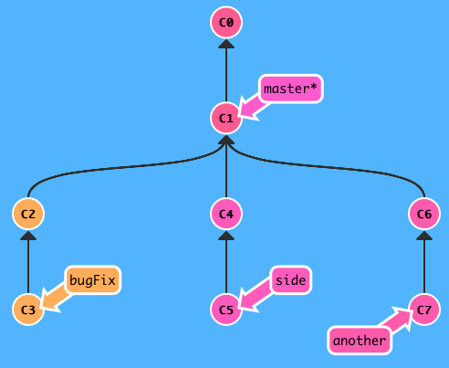

 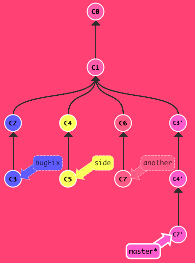

实现方式为：

    git checkout master
    git cherry-pick C3 C4 C7

相比rebase和merge，它的特殊之处在于：

* 可以`精确指定commit`
* 当然，它运行得好的前提也是，你必须精确知道你要哪个commit，但有时候你不一定知道。

另外，还有：

    git fetch
    git cherry-pick origin/master

## git submodule

博客参考：<http://www.tuicool.com/articles/jqiEJzU>

    git submodule add git@github.com:diguage/child.git

### 带子模块项目的clone

    git clone --recursive git@github.com:diguage/parent.git
    cd parent/child
    git status
    git checkout master

### 子模块删除

    git rm <submodulename>
    git status
    git commit
    git push

## ssh访问

1. 本地机器上生成SSH Key

    1. 先查看是否存在`~/.ssh`，该目录下存在两个文件
            
            id_rsa
            id_rsa.pub

        一个秘钥，一个公钥。如果已经存在，直接进入第二步，否则运行以下命令：

            $ ssh-keygen -t rsa

2. 将生成的公钥`id_rsa.pub`的内容复制到github上的用户设置之`SSH keys`
3. 测试是否添加成功：

        $ ssh -T git@github.com
        The authenticity of host 'github.com (192.30.252.128)' can't be established.
        RSA key fingerprint is 16:22:ac:a5:76:88:2d:36:63:1b:56:4d:eb:df:a2:48.
        Are you sure you want to continue connecting (yes/no)? yes
        Warning: Permanently added 'github.com,192.30.252.128' (RSA) to the list of known hosts.
        Hi MichaelHu! You've successfully authenticated, but GitHub does not provide shell access.

    以上显示已经添加成功

windows机器上添加sshkey，可以使用`git bash`来生成。

