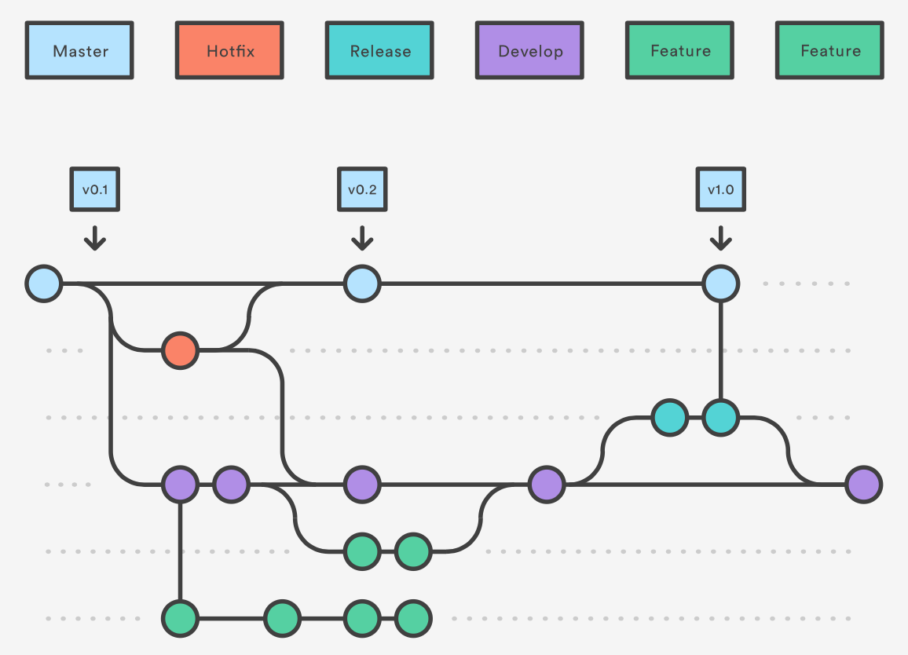

# gitflow

> git开发工作流

* Getting Git Right: <https://www.atlassian.com/git/>
* Learn git: <https://www.atlassian.com/git/tutorials/learn-git-with-bitbucket-cloud>
* gitflow: <https://www.atlassian.com/git/tutorials/comparing-workflows/gitflow-workflow>
* 译文： <http://blog.jobbole.com/76867/>

## Branches

 

## Atlassian

> Tools for teams, from startup to enterprise.

@[style="background-color:#205081; padding:5px;"] 

* site: <https://www.atlassian.com>
* JIRA, Bitbucket, HipChat, Bamboo, StatusPage, Confluence, SourceTree 
* 定位IT企业的各类工具

