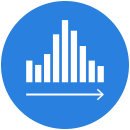
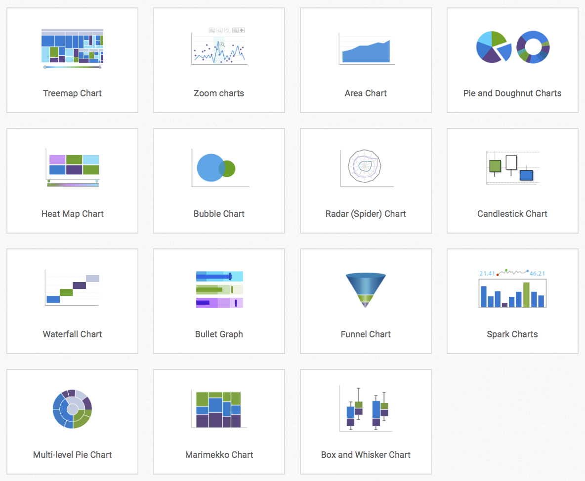

# bigdata-visualization

> 大数据可视化

## 概览

`数据可视化`，是关于数据视觉表现形式的科学技术研究。其中，这种数据的视觉表现形式被定义为，一种以某种概要形式抽取出来的信息，包括相应信息单位的各种属性和变量。

它是一个处于`不断演变`之中的概念，其边界在不断地扩大。主要指的是技术上较为高级的技术方法，而这些技术方法允许利用图形、图像处理、计算机视觉以及用户界面，通过表达、建模以及对立体、表面、属性以及动画的显示，对数据驾驭可视化解释。与立体建模之类的特殊方法相比，数据可视化所涵盖的技术方法要广泛得多。

数据可视化的研究起源于`二十世纪50年代`，至今经历了`三个阶段`：科学可视、信息可视、数据可视

### 基本思想

数据可视化技术的基本思想，是将数据库中每一个数据项作为单个图元元素表示，大量的数据集构成数据图像，同时将数据的各个属性值以多维数据的形式表示，可以`从不同的维度观察数据`，从而对数据进行更深入的观察和分析。

### 主要应用

* 报表类
* BI分析工具
* 指挥控制中心大屏

## 表现形式

* Arc Diagram  
* Area Graph  
* Bar Chart  
* Box & Whisker Plot  
* Brainstorm  
* Bubble Chart  
* Bubble Map  
* Bullet Graph  
* Calendar  
* Candlestick Chart  
* Chord Diagram  
* Choropleth Map - 分级统计图  
* Circle Packing  
* Connection Map  
* Density Plot - 密度图  
* Donut Chart - 圆环图  
* Dot Map - 点图  
* Dot Matrix Chart - 点矩阵图  
* Error Bars - 误差条  
* Flow Chart - 流程图  
* Flow Map  
* Gantt Chart - 甘特图  
* Heatmap - 热力图  
* Histogram - 柱状图  
* Illustration Diagram - 说明图  
* Kagi Chart - 卡吉图  
* Line Graph - 折线图  
* Marimekko Chart  
* Multi-set Bar Chart  
* Network Diagram - 网络图  
* Nightingale Rose Chart - 南丁格尔玫瑰图  
* Non-ribbon Chord Diagram - 非带状弦图  
Open-high-low-close Chart  
Parallel Coordinates Plot  
Parallel Sets  
Pictogram Chart  
Pie Chart  
Point & Figure Chart  
Population Pyramid  
Proportional Area Chart  
Radar Chart  
Radial Bar Chart  
Radial Column Chart  
Sankey Diagram  
Scatterplot  
Span Chart  
Spiral Plot  
Stacked Area Graph  
Stacked Bar Graph  
Stem & Leaf Plot  
Stream Graph  
Sunburst Diagram  
Tally Chart  
Timeline  
Timetable  
Tree Diagram  
Treemap  
Venn Diagram  
Violin Plot  
Word Cloud  

* 数据可视化图表分类 <https://datavizcatalogue.com/>，相关的icons可以从这里获取到<https://datavizcatalogue.com/store/product-category/icons/>
* Chart Primers - 图表基础介绍 <https://www.fusioncharts.com/chart-primers/>
    
    
    
* [ 171212 ] D3.js中Circle Packing详解 <https://blog.csdn.net/wan353694124/article/details/78778516>
* Marimekko Chart <https://www.fusioncharts.com/chart-primers/marimekko-chart/>

图表

    散点图
    折线图
    柱状图
    饼图
    雷达图
    K线图
    箱线图
    热力图
    关系图
    矩形树图
    平行坐标
    桑基图
    漏斗图
    仪表盘
    象形柱图
    主题河流图
    日历图

地图

    地理轨迹
    地理飞线
    热力分布
    地域区块
    3D地球
    地理数据多层叠加

3D图表

## 行业案例

### 阿里DataV

* 简介：`DataV`旨在让更多的人看到数据可视化的魅力，帮助非专业的工程师通过图形化的界面轻松搭建专业水准的可视化应用，满足您会议展览、业务监控、风险预警、地理信息分析等多种业务的展示需求。
* Site: <https://data.aliyun.com/visual/datav>

#### Features

* 通过模板快速配置，拖拽等简单操作
* 或自定义制作
* 大屏制作系统
* 制作过程和`百度图说`类似

#### 案例

* XX市双创数据大屏 <http://datav.aliyun.com/share/1598fb80658b9b656899c10338b6f1ac?spm=a2c0j.8903112.779858.1.436599ebZt7xb8>

    

* ET Brain - ET城市大脑 

    

### 百度图说

> 零编程玩转图表，大数据彰显魅力

* site: <http://tushuo.baidu.com>
* `ECharts`团队出品
* 提供：数据向导、图表向导、在线发布和分享
* 向粗糙图表 Say Goodbye!

以下为图说作品展示：

 

### 网易有数
> 网易大数据：企业级大数据可视化分析平台，具有全面的安全保障、强大的大数据计算性能、先进的智能分析、便捷的协作分享等特性。

site: <https://bigdata.163yun.com/youdata>

#### Features

* 数据报告在线生成
* 数据报表智能推荐，推荐使用何种适合的展现形式
* 大屏制作系统

以下为介绍视频<https://nos.netease.com/youdata/youdata3_introduce.mp4>：

 <video controls src="./video/youdata3_introduce.mp4" style="max-width: 100%;"></video>

### 数字冰雹

#### 简介

* 中国大数据可视化分析决策领导者，助您释放大数据价值最后一公里
* site: <http://www.digihail.com>

#### Features

* 多行业领域产品支持：`航天战场`、`智慧城市`、网络安全、商业智能、工业监控
* 某部对海作战指挥显示系统、某部海战场视景仿真系统、某部无人机操作控制平台等
* 公安厅指挥中心、应急管理指挥决策系统、城市交通智能化监控分析平台、智慧园区运行监控平台等等

### Tableau

> Tableau帮助大家`查看并理解`数据

* 客户端产品
* 连接数据库

<video controls src="https://secure.brightcove.com/services/mobile/streaming/index/master.m3u8?videoId=5115811843001&secure=true"></video>

## 相关技术资源

### Resources

* github - Data Visualization <https://github.com/showcases/data-visualization>
* 140626 `Visualizing Algorithms` 来自d3作者Mike Bostock，综述了各类可视化算法 <https://bost.ocks.org/mike/algorithms/>
* 常用`图谱库` <http://anvaka.github.io/graph-drawing-libraries/#/all>
* `百度地图`开放API示例：<http://lbsyun.baidu.com/jsdemo.htm>
* `Echarts`官方示例：<http://echarts.baidu.com/examples.html>
* `Echarts`三维展示：<http://gallery.echartsjs.com/editor.html?c=xryhZvyGr->
* `叙利亚`冲突地图：<https://www.cartercenter.org/syria-conflict-map/>
* `Echarts`地图迁徙应用：<http://echarts.baidu.com/demo.html#geo-lines>
* `NetLogo`：<http://ccl.northwestern.edu/netlogo/models/DLA> 有客户端以及Web版本，选择或上传各类模型进行可视化模拟

### JS Libraries

#### 开源免费

* D3.js IE9+ 6.6w Stars <ref://./d3.md.html>
* plottable, based on D3, 2k+ Stars <https://github.com/palantir/plottable>
* NVD3, based on D3,  6000+ Stars <http://nvd3.org/> <https://github.com/novus/nvd3>
* ECharts 1.9w Stars <http://echarts.baidu.com>
* Chart.js 3.1w Stars <http://www.chartjs.org/> <https://github.com/chartjs/Chart.js>
* Chartist.js 9.6k Stars<https://gionkunz.github.io/chartist-js/>
* Ember Charts 770 Stars <http://opensource.addepar.com/ember-charts/> <https://github.com/addepar/ember-charts>
* n3-charts for AngularJS , 1.2k Stars <https://github.com/n3-charts>
* Leaflet <ref://../map/leaflet.md.html>
* Sigma JS <ref://./sigmajs.md.html>
* Google Charts <https://developers.google.com/chart/>
* Polymaps <http://polymaps.org/> no github
* Processing.js <http://processingjs.org/> no github

#### 收费

* Highcharts <https://www.highcharts.com/> 收费
* FusionCharts <http://www.fusioncharts.com/> 收费

