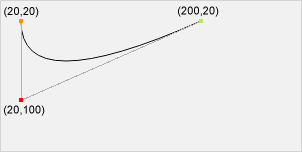

# Canvas

> The HTML5 `<canvas>` tag is used to draw graphics, on the fly, via scripting (usually JavaScript). 

* `W3C HTML5`: <https://www.w3.org/TR/2014/REC-html5-20141028/scripting-1.html#the-canvas-element>
* `W3C Docs about 2d context`: <http://www.w3.org/TR/2dcontext/>
* `W3C Schools Ref:` <http://www.w3schools.com/tags/ref_canvas.asp>
* `2015-11-19`成为推荐标准

## Canvas Element基础

> `HTML5`定义的canvas元素，也即`HTMLCanvasElement`支持的接口

* standards: <https://www.w3.org/TR/2014/REC-html5-20141028/scripting-1.html#the-canvas-element>

### IDL

	typedef (CanvasRenderingContext2D or WebGLRenderingContext) RenderingContext;

	interface HTMLCanvasElement : HTMLElement {
			   attribute unsigned long width;
			   attribute unsigned long height;

	  RenderingContext? getContext(DOMString contextId, any... arguments);

	  DOMString toDataURL(optional DOMString type, any... arguments);
	  void toBlob(FileCallback? _callback, optional DOMString type, any... arguments);
	};

`3`个主要接口：

* getContext()
* toDataURL()
    * default type - `image/png`，还支持`image/jpeg`
    * 分辨率 - `96dpi`
    * 宽高为0的图：`data:,`
* toBlob()

### 注意事项

通过Javascript API group制定的`HTML Canvas 2D Context`提供的2D上下文接口区别开来。后文着重介绍。

## 前置基本要点

### piexl adaptive

> 物理像素自适应，高分屏和普通屏的适应

`参数`说明：

    @param {dom} canvas
    @param {object} cssSize css尺寸（或逻辑尺寸）

    cssSize = { w: 300, h: 300 };

1. 逻辑尺寸（css尺寸）
2. 以2倍retina屏幕为例的适配过程：画布尺寸扩大一倍，canvas绘制通过scale也扩大一倍。

以下是`代码`实现：

    @[data-script="javascript"]function adaptDevice(canvas, cssSize){
        var ratio = window.devicePixelRatio
            , ctx = canvas.getContext('2d')
            ;
        canvas.width = cssSize.w * ratio;
        canvas.height = cssSize.h * ratio;
        ctx.scale(ratio, ratio);
    }

### canvas的尺寸限制

<http://fex.baidu.com/blog/2015/11/convert-svg-to-png-at-frontend/>

Canvas 的 W3C 的标准上没有提及 canvas 的最大高/宽度和面积，但是每个厂商的浏览器出于浏览器性能的考虑，在不同的平台上设置了最大的高/宽度或者是渲染面积，超过了这个阈值渲染的结果会是空白。测试了几种浏览器的 canvas 性能如下：

* chrome (版本 46.0.2490.80 (64-bit))
    * 最大面积：268, 435, 456 px^2 = 16, 384 px * 16, 384 px
    * 最大宽/高：32, 767 px

* firefox (版本 42.0)
    * 最大面积：32, 767 px * 16, 384 px
    * 最大宽/高：32, 767px

* safari (版本 9.0.1 (11601.2.7.2))
    * 最大面积： 268, 435, 456 px^2 = 16, 384 px * 16, 384 px

* ie 10(版本 10.0.9200.17414)
    * 最大宽/高： 8, 192px * 8, 192px

在一般的 web 应用中，可能很少会超过这些限制。但是，如果超过了这些限制，则会导致导出为空白或者由于内存泄露造成浏览器崩溃。

而且从另一方面来说，导出 png 也是一项很消耗内存的操作，粗略估算一下，导出 16, 384 px * 16, 384 px 的 svg 会消耗 16384 * 16384 * 4 / 1024 / 1024 = 1024 M 的内存。所以，在接近这些极限值的时候，浏览器也会反应变慢，能否导出成功也跟系统的可用内存大小等等都有关系。

对于这个问题，有如下两种解决方法：

    1. 将数据发送给后端，在后端完成转换；
    2. 前端将 svg 切分成多个图片导出；

第一种方法可以使用 PhantomJS、inkscape、ImageMagick 等工具，相对来说比较简单，这里我们主要探讨第二种解决方法。

## Canvas Context基础

### drawing state 

context维护一个绘制`状态栈`，该状态栈包含：

1. 当前`变换矩阵`(tranforming matrix)
2. 当前`剪辑区`(clipping region)
3. 以下`属性`(attributes)的当前值：
    * strokeStyle
    * fillStyle
    * globalAlpha
    * lineWidth
    * lineCap
    * lineJoin
    * miterLimit
    * shadowOffsetX
    * shadowOffsetY
    * shadowBlur
    * shadowColor
    * globalCompositeOperation
    * font
    * textAlign
    * textBaseline

注意，`path`和`bitmap`不属于绘制状态栈的一部分。
* `path`只能通过`beginPath()`来重置；
* `bitmap`是属于`canvas`的一个property，而不属于context。

APIs:

    context.save()
    context.restore()

### line styles

#### lineWidth
#### lineCap

线帽样式。取值`butt`, `round`, `square`之一

#### lineJoin

线接样式。取值`bevel`, `round`, `miter`之一

#### miterLimit
#### setLineDash()
#### getLineDash()
#### lineDashOffset

### text styles

#### font

取值同CSS font

#### textAlign

文本水平排列。取值`start`, `end`, `left`, `right`, `center`，默认值`start`。
其中`start`, `end`与文本`direction`有关。

#### textBaseline 

文本基线（竖直排列）。
取值`top`, `hanging`, `middle`, `alphabetic`, `ideographic`, `bottom`，默认值`alphabetic`

 

### building paths

构建路径。

#### beginPath

`context.beginPath()`
清空当前路径的`子路径列表`(subpath list)，使得`当前路径`(context's current path)重新从0条子路径开始。

#### moveTo

`context.moveTo(x, y)`
新启一条子路径，子路径以`x, y`为起点。

#### closePath

`context.closePath()`
关闭当前`子路径`，新启一条子路径，新的子路径的`起点`与当前关闭的子路径的起点`一致`。
closePath()并`不会清空`当前路径的子路径列表。

#### lineTo

`context.lineTo(x, y)`
添加一个新点至当前子路径，新点于上一点用直线相连。

#### quadraticCurveTo

`context.quadraticCurveTo(cpx, cpy, x, y)`

#### bezierCurveTo

`context.bezierCurveTo(cp1x, cp1y, cp2x, cp2y, x, y)`

#### arcTo

`context.arcTo(x1, y1, x2, y2, radius)`
添加一条弧线至当前子路径。

子路径的最后一个点`x0, y0`（记为A）开始，
控制点1为`x1, y1`（记为B）， 控制点2为`x2, y2`（记为C）。绘制一条半径为`radius`的圆弧，
该圆弧与AB和BC`相切`。第一个切点用直线与A相连。第二个切点若与C不重合，也不会自动相连。

`A`必须存在，若不存在，则不绘制。

<canvas></canvas>

    @[data-script="javascript editable"](function(){

        var wrapperId = 'test_arcTo'
            , sharpWrapperId = '#' + wrapperId
            ;

        var s = fly.createShow(sharpWrapperId);
        var $wrapper = $(sharpWrapperId);
        var canvas = $wrapper.find('canvas')[0]
            , ctx = canvas.getContext('2d')
            ;

        function point(ctx, center, options){
            var opt = options || {}
                , r = opt.radius || 3
                ;

            ctx.beginPath();
            ctx.rect(center.x - r, center.y - r, 2 * r + 1, 2 * r + 1);

            ctx.save();
            ctx.fillStyle = opt.fillStyle || '#ff7f0e';
            ctx.fill();
            ctx.strokeStyle = opt.strokeStyle || '#e377c2';
            ctx.stroke()
            ctx.restore();
        }
        function line(ctx, from, to, options){
            var opt = options || {};

            ctx.beginPath();
            ctx.moveTo(from.x, from.y);
            ctx.lineTo(to.x, to.y);

            ctx.save();
            ctx.strokeStyle = opt.strokeStyle || '#000';
            ctx.strokeWidth = opt.strokeWidth || 1;
            ctx.stroke();
            ctx.restore();
        }
        function arcTo(ctx, from, cp1, cp2, radius, options){
            var opt = options || {};

            if(from){
                ctx.beginPath();
                ctx.moveTo(from.x, from.y);
            }
            ctx.arcTo(cp1.x, cp1.y, cp2.x, cp2.y, radius);

            ctx.save();
            ctx.strokeStyle = opt.strokeStyle || '#000';
            ctx.stroke();
            ctx.restore();
        }

        adaptDevice(canvas, {w: $wrapper.find('.test-container').width(), h: 300});

        line(ctx, {x:10, y:10}, {x:80, y:80});
        line(ctx, {x:80, y:80}, {x:180, y:180}, {strokeStyle:'#aaa', strokeWidth:0.1});
        line(ctx, {x:100, y:150}, {x:200, y:150}, {strokeStyle:'#aaa', strokeWidth:0.1});
        line(ctx, {x:200, y:150}, {x:330, y:150}, {strokeStyle:'#aaa', strokeWidth:0.1});
        line(ctx, {x:280, y:100}, {x:280, y:280}, {strokeStyle:'#aaa', strokeWidth:0.1});

        arcTo(ctx, {x:80, y:80}, {x:150, y:150}, {x:200, y:150}, 100, {strokeStyle:'#1f77b4'});
        arcTo(ctx, {x:200, y:150}, {x:280, y:150}, {x:280, y:210}, 80, {strokeStyle:'#ff0'});

        point(ctx, {x:80, y:80}, {fillStyle: '#0f0', strokeStyle: '#0f0'});
        point(ctx, {x:150, y:150}, {fillStyle: '#00f', strokeStyle: '#00f'});
        point(ctx, {x:200, y:150});
        point(ctx, {x:280, y:150}, {fillStyle: '#00f', strokeStyle: '#00f'});
        point(ctx, {x:280, y:210}, {fillStyle: '#00f', strokeStyle: '#00f'});

    })();

#### arc

`context.arc(x, y, radius, startAngle, endAngle [, counterclockwise ])`

#### rect

`context.rect(x, y, w, h)`

## IDL

    typedef (HTMLImageElement or
             HTMLVideoElement or
             HTMLCanvasElement) CanvasImageSource;

    interface CanvasRenderingContext2D {

      // back-reference to the canvas
      readonly attribute HTMLCanvasElement canvas;

      // state
      void save(); // push state on state stack
      void restore(); // pop state stack and restore state

      // transformations (default: transform is the identity matrix)
      void scale(unrestricted double x, unrestricted double y);
      void rotate(unrestricted double angle);
      void translate(unrestricted double x, unrestricted double y);
      void transform(unrestricted double a, unrestricted double b, unrestricted double c, unrestricted double d, unrestricted double e, unrestricted double f);
      void setTransform(unrestricted double a, unrestricted double b, unrestricted double c, unrestricted double d, unrestricted double e, unrestricted double f);

      // compositing
               attribute unrestricted double globalAlpha; // (default: 1.0)
               attribute DOMString globalCompositeOperation; // (default: "source-over")

      // colors and styles (see also the CanvasDrawingStyles interface)
               attribute (DOMString or CanvasGradient or CanvasPattern) strokeStyle; // (default: "black")
               attribute (DOMString or CanvasGradient or CanvasPattern) fillStyle; // (default: "black")
      CanvasGradient createLinearGradient(double x0, double y0, double x1, double y1);
      CanvasGradient createRadialGradient(double x0, double y0, double r0, double x1, double y1, double r1);
      CanvasPattern createPattern(CanvasImageSource image, [TreatNullAs=EmptyString] DOMString repetition);

      // shadows
               attribute unrestricted double shadowOffsetX; // (default: 0)
               attribute unrestricted double shadowOffsetY; // (default: 0)
               attribute unrestricted double shadowBlur; // (default: 0)
               attribute DOMString shadowColor; // (default: "transparent black")

      // rects
      void clearRect(unrestricted double x, unrestricted double y, unrestricted double w, unrestricted double h);
      void fillRect(unrestricted double x, unrestricted double y, unrestricted double w, unrestricted double h);
      void strokeRect(unrestricted double x, unrestricted double y, unrestricted double w, unrestricted double h);

      // path API (see also CanvasPathMethods)
      void beginPath();
      void fill();
      void stroke();
      void drawFocusIfNeeded(Element element);
      void clip();
      boolean isPointInPath(unrestricted double x, unrestricted double y);

      // text (see also the CanvasDrawingStyles interface)
      void fillText(DOMString text, unrestricted double x, unrestricted double y, optional unrestricted double maxWidth);
      void strokeText(DOMString text, unrestricted double x, unrestricted double y, optional unrestricted double maxWidth);
      TextMetrics measureText(DOMString text);

      // drawing images
      void drawImage(CanvasImageSource image, unrestricted double dx, unrestricted double dy);
      void drawImage(CanvasImageSource image, unrestricted double dx, unrestricted double dy, unrestricted double dw, unrestricted double dh);
      void drawImage(CanvasImageSource image, unrestricted double sx, unrestricted double sy, unrestricted double sw, unrestricted double sh, unrestricted double dx, unrestricted double dy, unrestricted double dw, unrestricted double dh);

      // hit regions
      void addHitRegion(HitRegionOptions options);
      void removeHitRegion(DOMString id);
      void clearHitRegions();

      // pixel manipulation
      ImageData createImageData(unrestricted double sw, unrestricted double sh);
      ImageData createImageData(ImageData imagedata);
      ImageData getImageData(double sx, double sy, double sw, double sh);
      void putImageData(ImageData imagedata, double dx, double dy);
      void putImageData(ImageData imagedata, double dx, double dy, double dirtyX, double dirtyY, double dirtyWidth, double dirtyHeight);
    };
    CanvasRenderingContext2D implements CanvasDrawingStyles;
    CanvasRenderingContext2D implements CanvasPathMethods;

    [NoInterfaceObject]
    interface CanvasDrawingStyles {
      // line caps/joins
               attribute unrestricted double lineWidth; // (default: 1)
               attribute DOMString lineCap; // "butt", "round", "square" (default: "butt")
               attribute DOMString lineJoin; // "round", "bevel", "miter" (default: "miter")
               attribute unrestricted double miterLimit; // (default: 10)

      // dashed lines
      void setLineDash(sequence<unrestricted double> segments); // (default: empty)
      sequence<unrestricted double> getLineDash();
               attribute unrestricted double lineDashOffset;

      // text
               attribute DOMString font; // (default: "10px sans-serif")
               attribute DOMString textAlign; // "start", "end", "left", "right", "center" (default: "start")
               attribute DOMString textBaseline; // "top", "hanging", "middle", "alphabetic", "ideographic", "bottom" (default: "alphabetic")
    };

    [NoInterfaceObject]
    interface CanvasPathMethods {
      // shared path API methods
      void closePath();
      void moveTo(unrestricted double x, unrestricted double y);
      void lineTo(unrestricted double x, unrestricted double y);
      void quadraticCurveTo(unrestricted double cpx, unrestricted double cpy, unrestricted double x, unrestricted double y);
      void bezierCurveTo(unrestricted double cp1x, unrestricted double cp1y, unrestricted double cp2x, unrestricted double cp2y, unrestricted double x, unrestricted double y);
      void arcTo(unrestricted double x1, unrestricted double y1, unrestricted double x2, unrestricted double y2, unrestricted double radius); 
      void rect(unrestricted double x, unrestricted double y, unrestricted double w, unrestricted double h);
      void arc(unrestricted double x, unrestricted double y, unrestricted double radius, unrestricted double startAngle, unrestricted double endAngle, optional boolean counterclockwise = false); 

      };

    interface CanvasGradient {
      // opaque object
      void addColorStop(double offset, DOMString color);
    };

    interface CanvasPattern {
      // opaque object
    };

    interface TextMetrics {
      readonly attribute double width;
    };

    dictionary HitRegionOptions {
      // dictionary to allow expansion on Hit Regions in Canvas Context 2D Level 2
      DOMString id = "";
      // for control-backed regions:
      Element? control = null;
    };

    interface ImageData {
      readonly attribute unsigned long width;
      readonly attribute unsigned long height;
      readonly attribute Uint8ClampedArray data;
    };

## 有用的属性

`devicePixelRatio`：<http://www.html5rocks.com/en/tutorials/canvas/hidpi/>

a window extension by `CSSOM`:

1. If there is no output device, return 1 and abort these steps.
2. Let `CSS pixel size` be the size of a CSS pixel at the current `page zoom` scale factor and at a `pinch zoom` scale factor of 1.0.
3. Let `device pixel size` be the vertical size of a device pixel of the output device.
4. Return the result of dividing `CSS pixel size` by `device pixel size`.

绘制不失真的Canvas： High DPI Canvas

    @[data-script="javascript"]/**
     * Writes an image into a canvas taking into
     * account the backing store pixel ratio and
     * the device pixel ratio.
     *
     * @author Paul Lewis
     * @param {Object} opts The params for drawing an image to the canvas
     */
    function drawImage(opts) {

        if(!opts.canvas) {
            throw("A canvas is required");
        }
        if(!opts.image) {
            throw("Image is required");
        }

        // get the canvas and context
        var canvas = opts.canvas,
            context = canvas.getContext('2d'),
            image = opts.image,

        // now default all the dimension info
            srcx = opts.srcx || 0,
            srcy = opts.srcy || 0,
            srcw = opts.srcw || image.naturalWidth,
            srch = opts.srch || image.naturalHeight,
            desx = opts.desx || srcx,
            desy = opts.desy || srcy,
            desw = opts.desw || srcw,
            desh = opts.desh || srch,
            auto = opts.auto,

        // finally query the various pixel ratios
            devicePixelRatio = window.devicePixelRatio || 1,
            backingStoreRatio = context.webkitBackingStorePixelRatio ||
                                context.mozBackingStorePixelRatio ||
                                context.msBackingStorePixelRatio ||
                                context.oBackingStorePixelRatio ||
                                context.backingStorePixelRatio || 1,

            ratio = devicePixelRatio / backingStoreRatio;

        // ensure we have a value set for auto.
        // If auto is set to false then we
        // will simply not upscale the canvas
        // and the default behaviour will be maintained
        if (typeof auto === 'undefined') {
            auto = true;
        }

        // upscale the canvas if the two ratios don't match
        if (auto && devicePixelRatio !== backingStoreRatio) {

            var oldWidth = canvas.width;
            var oldHeight = canvas.height;

            canvas.width = oldWidth * ratio;
            canvas.height = oldHeight * ratio;

            canvas.style.width = oldWidth + 'px';
            canvas.style.height = oldHeight + 'px';

            // now scale the context to counter
            // the fact that we've manually scaled
            // our canvas element
            context.scale(ratio, ratio);

        }

        context.drawImage(image, srcx, srcy, srcw, srch, desx, desy, desw, desh);
    }

<canvas width="200" height="200" style="display:block;"></canvas>

    @[data-script="javascript editable"](function(){

        var s = fly.createShow('#test_10');
        var canvas = $('#test_10 canvas').get(0);
        canvas.width = 200;
        canvas.height = 200;
        canvas.style.width = 200 + 'px';
        canvas.style.height = 200 + 'px';

        var image = new Image();
        image.src = './img/arcto_radius-100.png';
        image.onload = function(){
            drawImage({
                canvas: canvas 
                , image: image 
                , srcw: 192
                , srch: 190
            });
        };

    })();

Android 4.1.x Stock Browser Canvas Solution

https://medium.com/@dhashvir/android-4-1-x-stock-browser-canvas-solution-ffcb939af758

    canvas.width = canvas.width;

    canvas.clearRect(0, 0, w, h);
    canvas.style.visibility = ‘hidden’; // Force a change in DOM
    canvas.offsetHeight; // Cause a repaint to take play
    canvas.style.visibility = ‘inherit’; // Make visible again

    canvas.clearRect(0, 0, w, h);
    canvas.style.display = ‘none’;// Detach from DOM
    canvas.offsetHeight; // Force the detach
    canvas.style.display = ‘inherit’; // Reattach to DOM

CORS与Canvas图片toDataURL

http://www.web-tinker.com/article/20687.html

WebView: animation issues with Java Script, JQuery Mobile and Phonegap

https://code.google.com/p/android/issues/detail?id=35474

context.toDataURL() only support on android 3.2 or above version.

http://stackoverflow.com/questions/10488033/todataurl-not-working-on-android-browsers

android 2.3.3的原生浏览器是不支持的，虽然该函数可以正常调用。但不代表该平台上其他浏览器不支持，实际上该平台上
安装的UC浏览器都支持。

不过可以认为webview是不支持的。

## Small Canvas Lib below

* `getContext`: function()
* `getTextWidth`: function(text)

    底层使用`context.measureText( text )`，返回的值是一个`TextMetrics`类型的对象。有一个`width`属性。

* `getWidth`: function()
* `getHeight`: function()

* `strokeStyle`: function(s)

    属性，设置或者返回用于笔触的颜色、渐变或模式。

        context.strokeStyle=color|gradient|pattern;

    `color:`

        var c=document.getElementById("myCanvas");
        var ctx=c.getContext("2d");
        ctx.strokeStyle="#0000ff";
        ctx.strokeRect(20,20,150,100); 

    `gradient:`

        var c=document.getElementById("myCanvas");
        var ctx=c.getContext("2d");

        var gradient=ctx.createLinearGradient(0,0,170,0);
        gradient.addColorStop("0","magenta");
        gradient.addColorStop("0.5","blue");
        gradient.addColorStop("1.0","red");

        // 用渐变进行填充
        ctx.strokeStyle=gradient;
        ctx.lineWidth=5;
        ctx.strokeRect(20,20,150,100);

* `fillStyle`: function(s)
    
    设置或返回用于填充绘画的颜色、渐变或模式。

        context.fillStyle = color | gradient | pattern;

    1. `color`：css颜色值，默认#000000
    2. `gradient`: 渐变对象（linear or radial） 
    3. `pattern`: pattern对象 

* `lineCap`: function(lc)
* `lineJoin`: function(lj)
* `lineWidth`: function(lw)

* `rect`: function(x, y, width, height)
* `fillRect`: function(x, y, width, height)
* `strokeRect`: function(x, y, width, height)
* `clearRect`: function(x, y, width, height)

* `fill`: function()
* `stroke`: function()
* `beginPath`: function()
* `closePath`: function()
* `moveTo`: function(x, y)
* `lineTo`: function(x, y)
* `clip`: function()
* `arc`: function(x, y, r, sAngle, eAngle, counterclickwise)

    `圆弧绘制`

    

    * Center: arc(`100, 75`, 50, 0*Math.PI, 1.5*Math.PI)
    * Radius: arc(100, 75, `50`, 0*Math.PI, 1.5*Math.PI)
    * Start angle:  arc(100, 75, 50, `0*Math.PI`, 1.5*Math.PI)
    * End angle:  arc(100, 75, 50, 0*Math.PI, `1.5*Math.PI`) 

* `quadraticCurveTo`: function(cpx, cpy, x, y)

    `1个控制点`

    

    * Start point: moveTo(`20, 20`) 
    * Control point: quadraticCurveTo(`20, 100`, 200, 20)
    * End point: quadraticCurveTo(20, 100, `200, 20`)

* `bezierCurveTo`: function(cp1x, cp1y, cp2x, cp2y, x, y)

    `2个控制点`

    

    * Start point: moveTo(`20, 20`) 
    * Control point 1: bezierCurveTo(`20, 100`, 200, 100, 200, 20)
    * Control point 2: bezierCurveTo(20, 100, `200, 100`, 200, 20)
    * End point: bezierCurveTo(20, 100, 200, 100, `200, 20`)

* `arcTo`: function(x1, y1, x2, y2, r)
    
    `两条切线间绘制圆弧：`
    The arcTo() method creates an arc/curve between two tangents(切线) on the canvas.

    以`@[style="color:#ff0; background:#000"](200, 100)`为控制点，
    从`@[style="color:#0f0; background:#000"](100, 100)`
    到`@[style="color:#0f0; background:#000"](200, 200)`绘制一条圆弧，半径分别为100，50， 150，
    如下图所示：

    1. 目标点刚好为切点 

        

    2. 半径太小，圆弧不过目标点 

        

    3. 半径太大，圆弧不过目标点 

        

* `isPointInPath`: function(x, y)

    如果指定点位于当前路径中，返回true，否则false：

        var c=document.getElementById("myCanvas");
        var ctx=c.getContext("2d");
        ctx.rect(20,20,150,100);
        if (ctx.isPointInPath(20,50)){
            ctx.stroke();
        }

* `scale`: function(scaleWidth, scaleHeight)

    

    `例子：`绘制一个矩形；放大到 200%，再次绘制矩形；放大到 200%，
    然后再次绘制矩形；放大到 200%，再次绘制矩形：

        var c=document.getElementById("myCanvas");
        var ctx=c.getContext("2d");
        ctx.strokeRect(5,5,25,15);
        ctx.scale(2,2);
        ctx.strokeRect(5,5,25,15);
        ctx.scale(2,2);
        ctx.strokeRect(5,5,25,15);
        ctx.scale(2,2);
        ctx.strokeRect(5,5,25,15);

* `rotate`: function(angle)

    * `angle`是`顺时针``弧度数`，`负弧度`为`逆时针`。
    * 旋转以`( 0, 0 )`为中心
    * `坐标系转换`函数，`在绘制前调用`，才能影响绘制函数。

    

    旋转坐标系，比如旋转20度：

        var c = document.getElementById( "myCanvas" );
        var ctx = c.getContext( "2d" );
        ctx.rotate( 20 * Math.PI/180 );
        ctx.fillRect( 50, 20, 100, 50 );        

    * `宽`度为`120`, `高`度为`20`的文本，`顺时针`旋转`45度`，需要绘制在`宽高`为`200 * 200`的正方形内，且水平、垂直居中。

        

        做法为（以下代码可以`参数化`）：

            context.textBaseline = 'middle';
            context.textAlign = 'start';
            context.rotate( 45 * Math.PI / 180 );
            context.translate( 200 / 2, 200 / 2 );
            context.strokeText( text, -120 / 2, -20 / 2, 200 );

* `translate`: function(tx, ty)
    
    平移

* `transform`: function(a, b, c, d, e, f)
    ，见`变换矩阵( transform matrix )`部分。

* `setTransform`: function(a, b, c, d, e, f)

    重置并重新创建新的变换矩阵

* `font`: function(cssFont)

    `CSS Font:` 

        font-style font-variant font-weight font-size/line-height font-family

    `举例：`

        italic small-caps bold 12px arial,sans-serif
        normal normal normal  

    `关于font-variant：`

    设置小型大写字母的字体显示文本，所有小写字母会被转换为大写，但是相比其余字幕，尺寸更小。

        normal | small-caps | inherit

    `关于font-style：`

        normal | italic | oblique | inherit

    `关于font-weight：`

        normal | bold | bolder | lighter | inherit | 100 - 900

        400 = normal
        700 = bold

* `textAlign`: function(align)
* `textBaseline`: function(align)
* `fillText`: function(text, x, y, maxWidth)
* `strokeText`: function(text, x, y, maxWidth)
* `globalAlpha`: function(alpha)

    alpha = 0.0 ~ 1.0

* `globalCompositeOperation`: function(gco)

    `refer`: <https://www.w3.org/TR/2dcontext/#compositing>，11种类型，外加一种扩展类型。

    * source-atop
    * source-in
    * srouce-out
    * source-over ( default )
    * destination-atop
    * destination-in
    * destination-out
    * destination-over
    * lighter
    * copy
    * xor
    * vendorName-operationName

* `save`: function()
* `restore`: function()
* `width`: function(w)
* `height`: function(h)
* `css`: function()

## transform matrix

> 变换矩阵

### 齐次坐标

将一个原本是`n`维的向量用一个`n+1`维向量来表示。如向量：

    ( x1, x2, x3, ..., xn )

的其次坐标表示为：

    [ hx1, hx2, hx3, ..., hxn ]

其中`h`是一个实数。

`todo`：二维齐次坐标变换。

### transform( a, b, c, d, e, f )

 

变换矩阵会叠加，不同于`setTransform`的重置

参考： <http://sumsung753.blog.163.com/blog/static/146364501201281311522752/>

<http://shawphy.com/2011/01/transformation-matrix-in-front-end.html>

`平移`：

    matrix(1, 0, 0, 1, tx, ty)

    x' = 1x + 0y + tx = x + tx
    y' = 0x + 1y + ty = y + ty 

等价于：

    translate(tx, ty)

`缩放`：

    matrix(sx, 0, 0, sy, 0, 0)

    x' = sx * x + 0 * y + 0 = sx * x
    y' = 0 * x + sy * y + 0 = sy * y

等价于：

    scale(sx, sy)

`旋转`：

    matrix(cosθ, sinθ, -sinθ, cosθ, 0, 0)

    x' = x * cosθ - y * sinθ + 0 = x * cosθ - y * sinθ
    y' = x * sinθ + y * cosθ + 0 = x * sinθ + y * cosθ

等价于：

    rotate(θ)

`切变`：

    matrix(1, tan(θy), tan(θx), 1, 0, 0)

    x' = x + y * tan(θx)
    y' = x * tan(θy) + y

θx和θy分别代表往x轴正方向和往y轴正方向倾斜的角度，两者是相互独立的。

比如：

    matrix(1, 0, tan(45deg), 1, 0, 0)

    x' = x + y * tan(45deg)
    y' = y

表示向x轴倾斜45度。

`镜像反射`：todo

## createPattern

`语法：`

    context.createPattern(image,"repeat|repeat-x|repeat-y|no-repeat");

`例子：`

    var c=document.getElementById("myCanvas");
    var ctx=c.getContext("2d");
    var img=document.getElementById("lamp");
    var pat=ctx.createPattern(img,"repeat");
    ctx.rect(0,0,150,100);
    ctx.fillStyle=pat;
    ctx.fill();

## createLinearGradient

`语法：`

    context.createLinearGradient(x0,y0,x1,y1);

x0,y0为渐变起始点，x1,y1为渐变结束点。

`例子：`

    var c=document.getElementById("myCanvas");
    var ctx=c.getContext("2d");
    var my_gradient=ctx.createLinearGradient(0,0,0,170);
    my_gradient.addColorStop(0,"black");
    my_gradient.addColorStop(1,"white");
    ctx.fillStyle=my_gradient;
    ctx.fillRect(20,20,150,100);

## createRadialGradient 

`语法：`

    context.createRadialGradient(x0,y0,r0,x1,y1,r1);

## drawImage

> `s`代表`source`，`d`代表`destination`

1. 画布上定位( dx, dy )图像

        context.drawImage( img, dx, dy );

2. 画布上定位图像( dx, dy )，并规定图像的宽度和高度( dw, dh )

        context.drawImage( img, dx, dy, dw, dh );

3. 剪切图像( sx, sy, sw, sh )，并在画布上定位( dx, dy )被剪切的部分，并规定图像的宽度和高度( dw, dh )

        context.drawImage( img, sx, sy, sw, sh, dx, dy, dw, dh );

 

### Image Sources

> 2d context能处理的来源，也即`img`对应的对象

* HTMLImageElement对象，也即``对应的DOM对象
* HTMLVideoElement对象，也即`<video>`对应的DOM对象
* HTMLCanvasElement对象，也即`<canvas>`对应的DOM对象

## Shadows

> 4个全局阴影属性。

1. 不能被转换成CSS值的value将被忽略

### shaowColor
### shadowOffsetX
### shadowOffsetY
### shadowBlur

## 紧贴直线的文本

todo

## globalCompositeOperation

该属性设置或返回如何将一个源（新的）图像绘制到目标（已有）的图像上。

可取以下值：

* source-over
* source-atop
* source-in
* source-out
* destination-over
* destination-atop
* destination-in
* destination-out
* lighter
* darker
* copy
* xor

对应效果如下：

