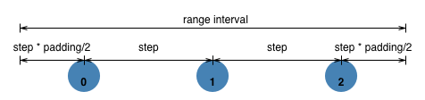
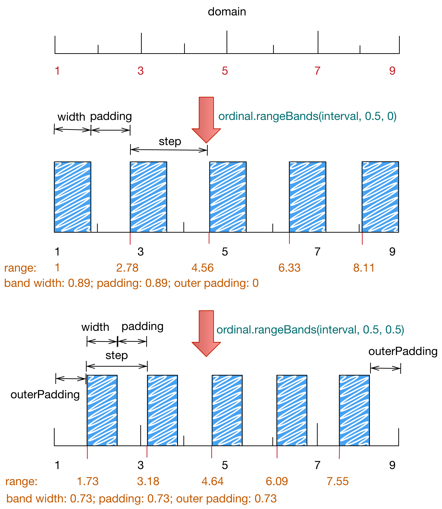

# D3.js API

> <https://github.com/mbostock/d3/wiki/API-Reference>

### 选择器

    d3.select(selector)
    d3.select(node)
    d3.selectAll(selector)
    d3.selectAll(nodes)

值得注意的用法：

    d3.selectAll(this.childNodes)
    d3.selectAll(document.links)

123

<button id="test_1_btn_1">sel.attr('className', 'abc')</button>
<button id="test_1_btn_2">sel.property('className', 'abc')</button>
<button id="test_1_btn_3">sel.style('color', 'blue')</button>
 
<button id="test_1_btn_4">sel.classed('def', 1)</button>
<button id="test_1_btn_5">sel.classed('def', 0)</button>
<button id="test_1_btn_6">sel.classed('def abc': true)</button>
<button id="test_1_btn_7">sel.classed({ 'def': false, 'ghi': true })</button>
 
<button id="test_1_btn_10">sel.append('span')</button>
<button id="test_1_btn_11">sel.append(function(d,i){...})</button>
 
<button id="test_1_btn_15">sel.insert('span', ':first-child')</button>
<button id="test_1_btn_16">sel.insert('span')</button>
 
<button id="test_1_btn_20">sel.remove()</button>

123

<button id="test_2_btn_1">sel.datum()</button>
<button id="test_2_btn_2">sel.data([...]).datum()</button>
<button id="test_2_btn_3">sel.data('string').datum()</button>
<button id="test_2_btn_4">sel.data(function(){return arr;}).datum()</button>
<button id="test_2_btn_5">sel.data(values, function(d){...}).datum()</button>
<button id="test_2_btn_6">sel.data([...]).datum(function(){...})</button>

### selection.data()

    selection.data([values [, key ]])

比较不好理解的是key函数和values配合使用的时候，

    selection.data(values, function(d, i){...})

以下是API文档摘抄的：

A key function `key([ d [, i ]])` may be specified to `control how data is joined to elements (this replaces the default by-index behavior)`. The key function returns a string which is used to join a datum with its corresponding element, based on the previously-bound data. For example, if each datum has a unique field name, the join might be specified as .data(data, function(d) { return d.name; })

The key function is `called twice` during the data binding process, which proceeds in `two phases`.

1. The key function is evaluated on the nodes to form `nodeByKeyValue` (an associative array of nodes) with the this context as the node, d as the node __data__ member and the second argument i as the selection group index.

2. The key function is evaluated on `each element of the values array` - this time with values as the this context, values[i] as the first argument d and the values index i as the second argument - and the results are then used to attempt to `look up` the nodes in the nodeByKeyValue collection. If the lookup is successful, the node is added to the `update selection`, any nodes not queried are added to the exit selection. Any data elements that failed to find a matching node are used to form the enter selection.

If a key function is specified, the data operator also affects the index of nodes; this index is passed as the second argument i to any operator function arguments. However, note that existing DOM elements are not automatically reordered; use `sort` or `order` as needed. For a more detailed example of how the key function affects the data join, see the tutorial `A Bar Chart, Part 2` (<https://bost.ocks.org/mike/bar/2/>.

概括一下：

* key函数决定数据如何绑定到选择区的节点
* key函数会被调用两次
    1. 第一次针对已有节点及其已绑定数据： `key(nodes[i].__data__, i)`，结果形成一个关联数组`nodeByKeyValue`，key是key()函数的计算结果，value是对应的节点对象
    2. 第二次针对新绑定数据： `key(data[i], i)`，拿该计算结果去查找`nodeByKeyValue`，命中的节点将会被绑定数据data[i]
* 进入新选择区的节点顺序可能与现有节点不一致，需要主动调用`order`或`sort`重新排序

以下是代码例子：

    d3.select('#test_2_btn_5').on('click', function(){

        var selection = $cont.selectAll('span')
                    .data(
                        [
                            { name: 'hudamin', value: 2 }
                            , { name: 'michael', value: 1 }
                            , { name: 'even', value: 3 }
                        ]
                    )
                    .text(function(d, i){
                        return d.name + ': ' + d.value;
                    })
                    ;

        console.log(selection);

        selection = selection.data(
                        [
                            { name: 'hudamin', value: 20 }
                            , { name: 'even', value: 30 }
                        ]
                        , function(d){
                            return d.name;
                        }
                    )
                    .text(function(d, i){
                        return d.name + ': ' + d.value;
                    })
                    .sort()
                    ;

        selection.exit().remove();

        console.log(selection);
        var data = selection.datum();
        show(JSON.stringify(data || []) );
    });

### 二维数据绑定

二维数据绑定，一个典型的例子是Table的创建。

<button id="test_3_btn_1">Create Table</button>
<button id="test_3_btn_2">Roll Table</button>
<button id="test_3_btn_3">Change BGColor</button>

代码如下：

    (function(){

    var matrix = [
        [11975,  5871, 8916, 2868],
        [ 1951, 10048, 2060, 6171],
        [ 8010, 16145, 8090, 8045],
        [ 1013,   990,  940, 6907]
    ];

    var initial = 1;

    d3.select('#test_3_btn_1').on('click', function(){

        if( !initial ) return;
        initial = 0;

        var tr = d3.select('#test_3 .test-container').append('table')
            .selectAll('tr').data(matrix)
            .enter()
            .append('tr');

        var td = tr.selectAll('td')
            .data(function(d){ return d; })
            .enter()
            .append('td')
            .text(function(d){ return d; })
            .style('background-color', function(){ return randomColor(1); })
            .style('color', function(){ return randomColor(1); })
            ;

    });

    d3.select('#test_3_btn_2').on('click', function(){

        if(initial) return;

        var table = d3.select('#test_3 table');

        var old_matrix = matrix;

        matrix = old_matrix.slice(1);
        matrix.push(old_matrix[0]);

        var tr = table.selectAll('tr')
            ;

        tr.data(matrix);

        // update
        tr.selectAll('td')
            .data(function(d, i){return d;}) 
            .text(function(d, i){return d;}) 
            .classed('animated jello', 1)
            ;

        setTimeout(function(){
            tr.selectAll('td')
                .classed('animated jello', 0)
                ;
        }, 1000);

    });

    })();

### Transitions

## Ordinal Scales （。。）

> d3.scale.ordinal

辅助数据可视化的相关计算，输入域和输出范围的映射。

<button id="test_40_btn_1">ordinal.domain(), ordinal.range()</button>
<button id="test_40_btn_2">ordinal.domain(values)</button>
<button id="test_40_btn_3">ordinal.range(values)</button>
<button id="test_40_btn_4">ordinal.rangePoints(interval)</button>
<button id="test_40_btn_5">ordinal.rangePoints(interval, padding)</button>
<button id="test_40_btn_6">ordinal(x)</button>
<button id="test_40_btn_7">ordinal.rangeRoundPoints(interval)</button>
<button id="test_40_btn_8">ordinal.rangeRoundPoints(interval, padding)</button>
<button id="test_40_btn_9">ordinal.rangeBands(interval)</button>
<button id="test_40_btn_10">ordinal.rangeBands(interval, padding)</button>
<button id="test_40_btn_11">ordinal.rangeBands(interval, padding, outerPadding)</button>
<button id="test_40_btn_12">ordinal.rangeRoundBands(interval)</button>
<button id="test_40_btn_13">ordinal.rangeRoundBands(interval, padding)</button>
<button id="test_40_btn_14">ordinal.rangeRoundBands(interval, padding, outerPadding)</button>

### ordinal.range([interval[, padding]])

其中padding的含义为首尾节点距离区间的最大值和最小值之间的距离之和，计算公式：首尾节点距边界的距离为`step * padding / 2`，step为节点两两之间的距离。比如padding为1，则首尾节点距边界距离为`step/2`

### ordinal.rangeBands([interval[, padding[, outerPadding]]])

将range去除首尾的`step*outerPadding`后，剩余部分为：`step*(n-padding)`

公式为： 

* `step * outerPadding * 2 + step * (n - padding) = interval.max - interval.min`
* `width = step * (1 - padding)`

padding取值区间为`[0, 1]`

    ordinal.domain([1, 3, 5, 7, 9]);
    ordinal.rangeBands([1, 9], 0.5, 0);

    ordinal.domain([1, 3, 5, 7, 9]);
    ordinal.rangeBands([1, 9], 0.5, 0.5);

实际发现以下两种方式是等价的：

    ordinal.rangeBands([1, 9], 0.5);
    ordinal.rangeBands([1, 9], 0.5, 0.5);

也即outerPadding如果没有指定，`默认值为0.5`。

### Categorical Colors

分类颜色API：

    d3.scale.category10()
    d3.scale.category20()
    d3.scale.category20b()
    d3.scale.category20c()

注意，以上API生成新的scale对象。

<button id="test_50_btn_1">d3.scale.category10().range()</button>
<button id="test_50_btn_2">d3.scale.category20().range()</button>
<button id="test_50_btn_3">d3.scale.category20b().range()</button>
<button id="test_50_btn_4">d3.scale.category20c().range()</button>

## SVG

参考：<a href="./svg.md.preview.html">SVG</a>

path的d属性生成比较麻烦，需要各类构造器。

### d3.svg.line

line构造器：

    // 默认构造器
    var line = d3.svg.line();
    var def = line([ [20, 50] ]);

    // 自定义存取器的构造器
    var line = d3.svg.line()
            .x(function(d){ return d.x; })
            .y(function(d){ return d.y; })
            ;
    var def = line([ {x:20, y:50} ]);

<button id="test_60_btn_1">line([ [20,50] ])</button>
<button id="test_60_btn_2">line([ {x:20,y:50} ])</button>

### line.interpolate([interpolate])

插值模式，预定义的有13种：

linear, linear-closed, step, step-before, step-after, basis, basis-open, basis-closed,
bundle, cardinal, cardinal-open, cardinal-closed, monotone

可以通过字符串方式指定插值模式：

    line.interpolate('linear-closed');

如果interpolate为函数，则该函数作为构建路径字符串的接口函数，也即自定义interpolate函数。

    var line = d3.svg.line()
            .interpolate(interpolate)
        , data = [
            [20,50]
            , [100,130]
            , [220,200]
            , [400,80]
            , [350,180]
        ]
        ;

    var svg = d3.select('#test_70_svg')
        , upSel = svg.selectAll('path')
            .data([ data ])
            ; 

    if(initial) {
        upSel
            .enter()
            .append('path')
            ;
        initial = 0;
    }

    upSel.exit().remove();

    upSel
        .attr('d', function(d){ return line(d); })
        .style({
            'fill': '#fff'
            , 'stroke': 'red'
        })
        ;

以下Demo展示这13种插值函数的表现：

<select id="test_70_select" class="form-control">
<option value="linear">linear</option>
<option value="linear-closed">linear-closed</option>
<option value="step">step</option>
<option value="step-before">step-before</option>
<option value="step-after">step-after</option>
<option value="basis">basis</option>
<option value="basis-open">basis-open</option>
<option value="basis-closed">basis-closed</option>
<option value="bundle">bundle</option>
<option value="cardinal">cardinal</option>
<option value="cardinal-open">cardinal-open</option>
<option value="cardinal-closed">cardinal-closed</option>
<option value="monotone">monotone</option>
</select>

<svg id="test_70_svg" width="100%" height="300"></svg>

### other

