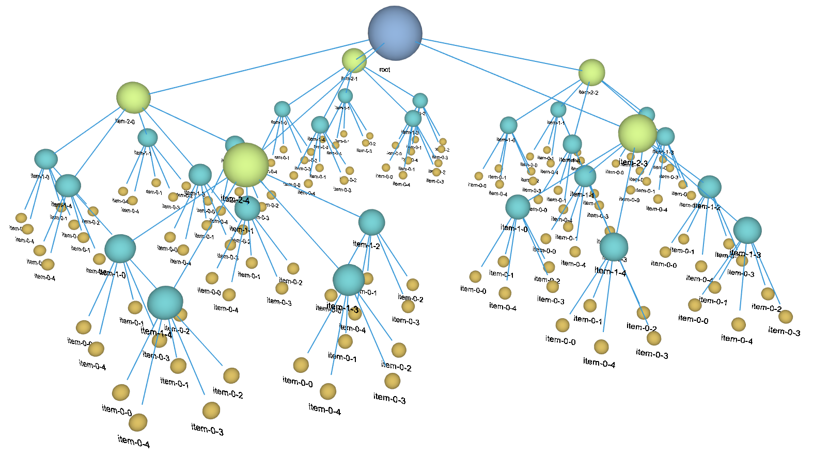
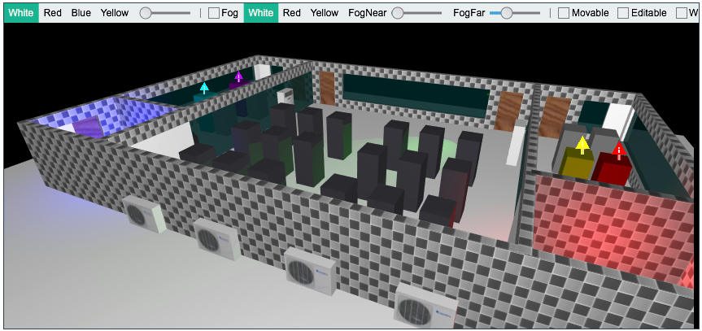

# htweb

> `hightopo`: <http://www.hightopo.com>

## 简介

* `demos`: <http://www.hightopo.com/demos/index.html>
* `3D树`: <http://www.hightopo.com/demo/blog_3dtree_20150908/3D-tree.html>

    

    貌似`3d`方式的关系图谱反而增加了理解的复杂度，还不如`2d`清晰。

* `HTML5 网络拓扑图性能优化`: <https://segmentfault.com/a/1190000005805736>
* `数百个 HTML5 例子学习 HT 图形组件 – WebGL 3D 篇`: <https://segmentfault.com/a/1190000006721762>
* 电信网络拓扑图自动布局: <https://segmentfault.com/a/1190000006673877>
* `HT for Web 3D手册`: <http://www.hightopo.com/guide/guide/core/3d/ht-3d-guide.html>
* 3D拓扑：<http://www.hightopo.com/guide/guide/plugin/forcelayout/ht-forcelayout-guide.html>
* 机房模型：

    
