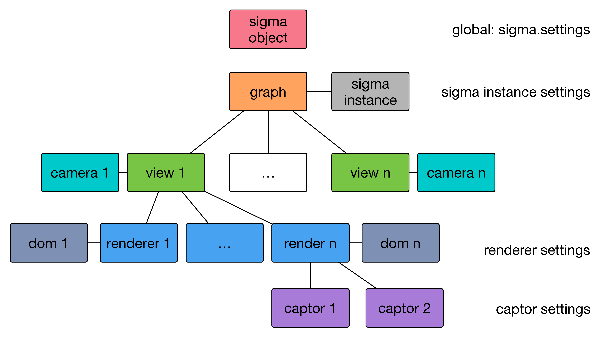
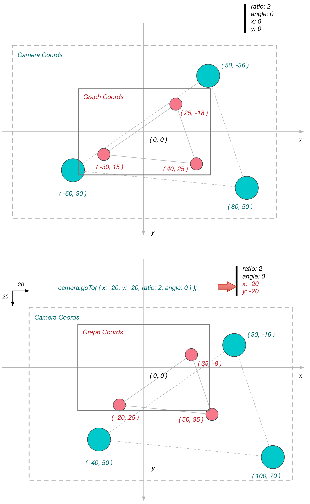

# sigmajs

> 致力于在网页中绘制`网状图形`，提供交互接口。图形技术支持`Canvas`、`WebGL`和`SVG`。

## Resources

* site: <http://sigmajs.org>
* github: <https://github.com/jacomyal/sigma.js>
* wiki: <https://github.com/jacomyal/sigma.js/wiki>

## Versions

* `lateset`: 2016-11-03 `1.2.0`
* 2016-02-17 `1.1.0`
* 2014-08-22 `1.0.3`
* 2014-04-02 `1.0.2`
* 2014-02-26 `1.0.1`
* 2014-01-30 `1.0.0` release
* 2013-11-27 `1.0.0` draft

## Misc

* 需要注意并理解其`插件机制`，有些时候配置了，没有效果，甚至代码报错，可能是插件没有加载，需要`显式引入`插件代码，比如：<http://258i.com/static/build/sigma/plugins/sigma.renderers.edgeLabels.js>
* 显示`边的label`，必须注意其`类型`必须为`string`，否则不展示 

## 工具函数

### getUniqueSigmaInstance()

以下代码提供`sigma`实例的生成器，根据`实例ID`在上下文中只保持一个实例，即使`多次调用`也是如此。

    @[data-script="javascript"]function getUniqueSigmaInstance( instId, config, isSearch ){

        var instances = (
                arguments.callee.__instances
                    || ( arguments.callee.__instances = [] )
            )
            ;

        if( !instances[ instId ] ) {
            if( isSearch ){
                return false;
            }

            if( !config ) {
                instances[ instId ] = new sigma();
            }
            else {
                instances[ instId ] = new sigma(
                    $.extend(
                        {}
                        , config
                    ) 
                );
            }
        }
        else {
            if( isSearch == 2 ) {
                var ret = instances[ instId ];
                delete instances[ instId ];
                return ret;
            }
        }

        return instances[ instId ];
    }

    function isSigmaInstanceExisted( instId ){
        return getUniqueSigmaInstance( instId, null, 2 );
    }

    function getRandomGraph( numOfNodes, numOfEdges, isFixSize ){

        var i
            , s
            , N = numOfNodes
            , E = numOfEdges
            , g = { nodes: [], edges: [] }
            ;

        for( i = 0; i < N; i++ ) {
            g.nodes.push( {
                id: 'n' + i
                , label: '' + i
                , x: Math.random()
                , y: Math.random()
                , size: isFixSize ? 0.05 : Math.random()
                , color: fly.randomColor() 
            } );
        }

        for( i = 0; i < E; i++ ) {
            g.edges.push( {
                id: 'e' + i
                , source: 'n' + ( Math.random() * N | 0 ) 
                , target: 'n' + ( Math.random() * N | 0 ) 
                , size: isFixSize ? 0.01 : Math.random()
                // , type: 'curve'
                // , color: fly.randomColor() 
                , color: '#ccc'
                , hover_color: '#f00'
                , label: 'aaa'
            } );
        }

        return g;
    }

### TickEaseIn

再提供一个`脉搏`模拟器`TickEaseIn`：

    @[data-script="javascript"]function TickEaseIn(begin, end, steps, type){
        var me = this;

        me.begin = begin;
        me.end = end;
        me.steps = steps;

        // type: 'quadratic|cubic'
        me.type = type || 'quadratic';
        me._currentStep = 1;
        me._currentValue = me.begin;
        me.initial = false;
    }

    TickEaseIn.prototype.step = function(){
        var me = this
            , delta
            , ret
            , begin = me.begin
            , end = me.end
            , _curStep = me._currentStep
            , steps = me.steps
            ; 

        if(!me.initial){
            me.initial = true;
            return me.begin;
        }

        if(me.isFinished()) {
            ret = null;
        }
        else {
            if('cubic' == me.type){
                delta = ( end - begin )
                    * ( 3 * Math.pow(_curStep, 2) - 3 * _curStep + 1 )
                    / Math.pow(steps, 3)
                    ;
            }
            else {
                delta = ( end - begin ) 
                    * ( 2 * _curStep - 1 ) 
                    / Math.pow(steps, 2);
            }
            if(me._currentStep == me.steps){
                me._currentValue = me.end;
            }
            else {
                me._currentValue += delta;
            }
            ret = me._currentValue;
        }
        me._currentStep++;
        return ret;
    };

    TickEaseIn.prototype.isFinished = function(){
        var me = this;
        if(me._currentStep > me.steps) {
            return true;
        }
        return false;
    };  

## 网络图的例子

### 自适应尺寸

该例子展示包含两个节点和一条边的`简单网络`。
* 图谱尺寸参数未根据renderer视图适配（标准化），`尺寸跨度`为0.3
* 使用`autoRescale配置项`由Sigma引擎进行适配，先生成标准化后的Graph坐标，以`read_cam0:`为前缀
* 标准化后，Camera参数为`{x: 0, y: 0, angle: 0, ratio: 1}`

    @[data-script="javascript editable"]
    (function(){

        var s = fly.createShow('#test_simple_network');
        
        var sm = getUniqueSigmaInstance(
                    'test_simple_network'
                    , {
                        settings: {
                            mouseWheelEnabled: false
                            , drawEdgeLabels: true
                            , autoRescale: true
                        }
                        , renderers: [
                            {
                                container: 'test_simple_network_graph'
                                , type: 'canvas'
                            }
                        ]
                    }
                ); 

        sm.graph
            .clear()
            .addNode({
                id: 'n0'
                , label: 'Person 1'
                , x: 0.5
                , y: 0.5
                , size: 1
                , color: '#f00'
            }) 
            .addNode({
                id: 'n1'
                , label: 'Person 2'
                , x: 0.8
                , y: 0.8
                , size: 1
                , color: '#00f'
            }) 
            .addEdge({
                id: 'e0'
                , source: 'n0' 
                , target: 'n1'
                , label: 'relation'
                , color: '#ccc'
            }) 
            ;

        sm.refresh();

        s.show( 1, sm.graph.nodes() );
        s.append_show( 2, sm.graph.edges() );
        s.append_show( 3, sm.camera.x, sm.camera.y, sm.camera.angle, sm.camera.ratio );
        s.append_show( 4, sm.camera.getMatrix() );
        s.append_show( 5, sm.camera.getRectangle( 500, 200 ) );
        s.append_show( 6, sm.camera.cameraPosition( 0.5, 0.6 ) );

    })();

### 标准化尺寸

该例子展示包含两个节点和一条边的`简单网络`，坐标已经`标准化`（`重心`坐标为`0,0`）。
* 图谱尺寸参数已根据renderer视图适配（标准化）
* 不使用`autoRescale`配置项，将其设置为`false`关闭自适应功能
* 使用`camera.goTo()`方法设置合适的camera参数

    @[data-script="javascript editable"]
    (function(){

        var s = fly.createShow('#test_normalized_network');
        
        var sm = getUniqueSigmaInstance(
                    'test_normalized_network'
                    , {
                        settings: {
                            mouseWheelEnabled: false
                            , drawEdgeLabels: true
                            , autoRescale: false
                        }
                        , renderers: [
                            {
                                container: 'test_normalized_network_graph'
                                , type: 'canvas'
                            }
                        ]
                    }
                ); 

        sm.graph
            .clear()
            .addNode({
                id: 'n0'
                , label: 'Person 1'
                , x: -60
                , y: -60
                , size: 10
                , color: '#f00'
            }) 
            .addNode({
                id: 'n1'
                , label: 'Person 2'
                , x: 70 
                , y: 65
                , size: 10
                , color: '#00f'
            }) 
            .addEdge({
                id: 'e0'
                , source: 'n0' 
                , target: 'n1'
                , label: 'relation'
                , color: '#ccc'
            }) 
            ;

        sm.refresh();

        s.show( 1, sm.graph.nodes() );
        s.append_show( 2, sm.graph.edges() );
        s.append_show( 3, sm.camera.x, sm.camera.y, sm.camera.angle, sm.camera.ratio );
        s.append_show( 4, sm.camera.getMatrix() );
        s.append_show( 5, sm.camera.getRectangle( 500, 200 ) );
        s.append_show( 6, sm.camera.cameraPosition( 0.5, 0.6 ) );

    })();

@[style="text-align:center"]

## Renderers

目前支持Canvas、WebGL、SVG。

canvas绘制，`5`个`layer`：node、edge、labels、捕获鼠标事件层以及显示hover对象层。

### 自定义renderer插件

自定义节点渲染插件，比如`sigma.canvas.nodes.squares：`

    sigma.canvas.nodes.square = function(node, context, settings) {
        var prefix = settings('prefix') || '',
            size = node[prefix + 'size'];

        context.fillStyle = node.color || settings('defaultNodeColor');
        context.beginPath();
        context.rect(
            node[prefix + 'x'] - size,
            node[prefix + 'y'] - size,
            size * 2,
            size * 2
        );

        context.closePath();
        context.fill();
    };

### sigma实例的创建

不带任何参数，只创建graph，不绑定renderer：

    var sm = new sigma();

如果只提供container，会绑定renderer：

    var sm = new sigma(containerId);
    var sm = new sigma(containerDom);

## Settings

非常类似javascript的`prototype chain`。

`三个`层次的settings，组件本身的配置、sigma实例的配置以及全局默认配置，也按照这个顺序逐次往上获取。

三条`规则`：

1. It must be possible to have two running instances of sigma with different parameters.
2. It must be possible to have two running renderers of the same sigma instance with different parameters.
3. The settings of each renderer, of each instance, and the global settings must be modifiable at any time.

    @[data-script="javascript editable"]
    (function(){

        var s = fly.createShow('#test_20');
        var g = getRandomGraph(10, 20, true);
        var containerId = 'test_20_graph';

        var sm = getUniqueSigmaInstance(
                    'test_20'
                    , {
                        settings: { 
                            // rescale settings 
                            sideMargin: 0.1 

                            // instance global settings
                            , enableEdgeHovering: true
                            , edgeHoverPrecision: 5
                        }
                        , renderers: [
                            {
                                type: 'canvas' 
                                , container: containerId 
                                , settings: {
                                    // captors settings
                                    doubleClickEnabled: true
                                    , mouseWheelEnabled: false

                                    // rescale settings
                                    , minEdgeSize: 0.5
                                    , maxEdgeSize: 1
                                    , minNodeSize: 1 
                                    , maxNodeSize: 5

                                    // renderer settings
                                    , edgeHoverColor: fly.randomColor() 
                                    , edgeHoverSizeRatio: 1
                                    , edgeHoverExtremities: true
                                }
                            }
                        ]
                    }
                ); 

        sm
            .graph
            .clear()
            .read(g)
            ;

        sm.refresh();

    })();

## 事件绑定

    @[data-script="javascript editable"]
    (function(){

        var s = fly.createShow('#test_30');
        var g = getRandomGraph(3, 15, true);
        var containerId = 'test_30_graph';

        var sm = getUniqueSigmaInstance(
                    'test_30'
                    , {
                        settings: { 
                            sideMargin: 0.05 

                            // instance global settings
                            , enableEdgeHovering: true
                            , edgeHoverPrecision: 5
                        }
                        , renderers: [
                            {
                                type: 'canvas' 
                                , container: containerId 
                                , settings: {
                                    // captors settings
                                    doubleClickEnabled: true
                                    , mouseWheelEnabled: false

                                    // rescale settings
                                    , minEdgeSize: 0.5
                                    , maxEdgeSize: 1
                                    , minNodeSize: 1 
                                    , maxNodeSize: 5

                                    // renderer settings
                                    , edgeHoverColor: fly.randomColor() 
                                    , edgeHoverSizeRatio: 1
                                    , edgeHoverExtremities: true
                                }
                            }
                        ]
                    }
                ); 

        sm
            .graph
            .clear()
            .read(g)
            ;

        var m = 1
            , isSimpleMode = $('#test_30_checkbox').is(':checked')
            ;

        s.show('starting ...');
        sm
            .unbind()
            .bind(
                'click doubleClick'
                , function(e) {
                    s.append_show(m++, e.type, e.data.captor);
                }
            )
            .bind(
                'overNode outNode clickNode doubleClickNode rightClickNode'
                , function(e) {
                    if(isSimpleMode){
                        s.append_show(m++, e.type);
                    }
                    else {
                        s.append_show(m++, e.type, e.data.node.label, e.data.captor);
                    }
                }
            )
            .bind(
                'overEdge outEdge clickEdge doubleClickEdge rightClickEdge'
                , function(e) {
                    if(isSimpleMode){
                        s.append_show(m++, e.type);
                    }
                    else {
                        s.append_show(m++, e.type, e.data.edge, e.data.captor);
                    }
                }
            )
            .bind(
                'clickStage doubleClickStage rightClickStage'
                , function(e) {
                    if(isSimpleMode){
                        s.append_show(m++, e.type);
                    }
                    else {
                        s.append_show(m++, e.type, e.data.captor);
                    }
                }
            )
            .bind(
                'clickNodes clickEdges doubleClickNodes doubleClickEdges rightClickNodes rightClickEdges overNodes overEdges outNodes outEdges'
                , function(e) {
                    if(isSimpleMode){
                        s.append_show(m++, e.type);
                    }
                    else {
                        s.append_show(m++, e.type, e.data.edges || e.data.nodes, e.data.captor);
                    }
                }
            )
            .bind(
                'render'
                , function(e) {
                    s.append_show(m++, e.type);
                }
            )
            ;

        // s.show(sm.renderers);
        // s.show('sm.camaras', sm.cameras);

        sm.refresh();

    })();

<label><input type="checkbox" checked id="test_30_checkbox">精简模式</label>

## Cameras

### 坐标空间

> `Graph坐标、Camera坐标、Renderer坐标`三类。

参考：<ref://./sigmajs-insights.md.html>

`Camera`可以理解为往`Screen（Renderer）`投射图形的`摄像机`，它有`视角`、`比例`、`投射中心`等投射参数，而Graph坐标可以理解为胶带，也就是原始坐标，它可能被摄像机`标准化`过。

> Todo: 下方论述可能存在错误，需要重新修正。

坐标空间`示意图`如下所示：

 

1. 可以认为在`ratio`为`1`的情况下，三者的`比例`是`1:1:1`，关系为：

        camera.x = graph.x * ratio

2. 将图形居中，可先获得`graph坐标`空间中其图形中点的位置，记为`graph.x`, `graph.y`，再通过`camera.cameraPosition()`转换成`Camera坐标`，最后调用`camera.goTo()`

        cam1.goTo({
            x: graph.x
            , y: graph.y
        });

    `不受`当前`ratio`以及`angle`的`影响`。

3. `全局居中`展示。理论上可行，实践中发现，`仅使用`缩放来达到`居中`展示效果的方式`存在`一些问题。
    比如，它总是对`所有元素`都做`比例`缩放，这样就`无法`满足特定需求，比如希望在`全局`展示情况下，
    节点`尺寸`保持`固定`大小。`靠谱`方案还是得使用`rescale`，直接调整`坐标`。

        ratio = graph.w / screen.w; 
        cam1.goTo({
            x: graph.x
            , y: graph.y
            , ratio: ratio
        });

### 坐标系理解

坐标系转换常用方法：

    camera.cameraPosition( x, y )
    camera.graphPosition( x, y )

    @[data-script="javascript editable"]
    (function(){

        var s = fly.createShow('#test_coords');
        var g = getRandomGraph(3, 15, true);
        var g = {
            nodes: [
                {id: 'n0', x: 25, y: -18, size: 5, label: '(25, -18)', color: '#f33'}
                , {id: 'n1', x: -30, y: 15, size: 5, label: '(-30, 15)', color: '#f33'}
                , {id: 'n2', x: 40, y: 25, size: 5, label: '(40, 25)', color: '#f33'}
            ]
            , edges: [
            ]
        };
        var rendererSettings = {
                // captors settings
                doubleClickEnabled: true
                , mouseWheelEnabled: false

                // rescale settings
                , minEdgeSize: 0.5
                , maxEdgeSize: 1
                , minNodeSize: 1 
                , maxNodeSize: 5

                // renderer settings
                , edgeHoverColor: fly.randomColor() 
                , edgeHoverSizeRatio: 1
                , edgeHoverExtremities: true
                , drawLabels: true
            };
        var sigmaSettings = {
                // rescale settings 
                sideMargin: 10 

                // instance global settings
                , enableEdgeHovering: true
                , edgeHoverPrecision: 5

                , autoRescale: 0
            };
        var containerId = 'test_coords_graph';
        var sm, cam, renderer;

        if((sm = isSigmaInstanceExisted('test_coords'))){
            sm.kill();
        };

        sm = getUniqueSigmaInstance(
                'test_coords'
                , {
                    settings: sigmaSettings
                    , graph: g
                    , renderers: [
                        {
                            type: 'canvas'
                            , container: $('#' + containerId)[0]
                            , settings: rendererSettings
                        }
                    ]
                }
            )
            ; 

        sm.refresh();
        cam = sm.camera;
        renderer = sm.renderersPerCamera[ cam.id ][ 0 ];

        var camConfig = { x:0, y:0, ratio:1, angle:0 };

        function showInfo( phaseName ) {
            s.append_show( '## ' + phaseName, camConfig );
            s.append_show(
                'camera.x: ' + cam.x
                , 'camera.y: ' + cam.y
                , 'camera.ratio: ' + cam.ratio
                , 'camera.angle: ' + cam.angle
            );
            s.append_show(
                'renderer.width: ' + renderer.width
                , 'renderer.height: ' + renderer.height
            );
            g.nodes.forEach( function( node ) {
                var cPos = cam.cameraPosition( node.x, node.y );
                s.append_show(
                    'graph coords: ( ' + node.x + ', ' + node.y + ' )'
                    , 'camera coords: ' + cPos.x + ', ' + cPos.y + ' )'
                );
            } );
            s.append_show( '\n' );
        }

        showInfo( 'initial' );

        camConfig.ratio = 2;
        cam.goTo( camConfig );
        showInfo( 'goTo' );

        camConfig.ratio = 2;
        camConfig.x = -20;
        camConfig.y = -20;
        cam.goTo( camConfig );
        showInfo( 'goTo' );

    })();

### camera.goTo

在下方代码编辑区中的`cam1.goTo(...)`中填入`合适`的`(x, y)`坐标，使得四个彩色球的图形在画布`居中`显示。

    @[data-script="javascript editable"]
    (function(){

        var s = fly.createShow('#test_39');
        var g = getRandomGraph(3, 15, true);
        var color = fly.randomColor();
        var g = {
            nodes: [
                {id: 'n2', x: 1000, y: -1000, size: 10, label: '(1000, -1000)', color: color}
                , {id: 'n0', x: 0, y: 0, size: 10, label: '(0, 0)', color: color}
                , {id: 'n1', x: 1000, y: 1000, size: 10, label: '(1000, 1000)', color: color}
                , {id: 'n3', x: 2000, y: 0, size: 10, label: '(2000, 0)', color: color}
                , {id: 'n4', x: 1000, y: 0, size: 20, label: '(1000, 0)', color: color}
            ]
            , edges: []
        };
        var g2 = {
            nodes: [
                {id: 'n0', x: 0, y: -100, size: 1, label: '(0, -100)', color: '#666'}
                , {id: 'n1', x: 100, y: 0, size: 1, label: '(100, 0)', color: '#666'}
                , {id: 'n2', x: 0, y: 100, size: 1, label: '(0, 100)', color: '#666'}
                , {id: 'n3', x: -100, y: 0, size: 1, label: '(-100, 0)', color: '#666'}
            ]
            , edges: [
                {id: 'e0', source: 'n0', target: 'n2', color: '#666'}
                , {id: 'e1', source: 'n1', target: 'n3', color: '#666'}
            ]
        };
        var containerId = 'test_39_graph';

        var sm = getUniqueSigmaInstance(
                'test_39'
                , {
                    settings: {
                        autoRescale: 0
                    }
                }
            )
            , sm2 = getUniqueSigmaInstance(
                'test_39_2'
                , {
                    graph: g2
                    , settings: {
                        autoRescale: 0
                    }
                    , renderers: [
                        {
                            type: 'canvas'
                            , container: containerId
                            , settings: {
                                mouseWheelEnabled: false
                            }
                        }    
                    ]
                }
            )
            , renderer1
            , cam1
            ; 

        if(!sm.rendererAdded){
            cam1 = sm.addCamera('cam1');

            renderer1 = sm.addRenderer({
                id: 'renderer1'
                , type: 'canvas' 
                , container: containerId
                , camera: cam1
                , settings: {
                    autoRescale: 0
                    , mouseWheelEnabled: false
                }
            });

            sm.rendererAdded = 1;
        }
        else {
            cam1 = sm.cameras['cam1'];
            renderer1 = sm.renderers['renderer1'];
        }

        sm
            .graph
            .clear()
            .read(g)
            ;

        sm.refresh();
        sm2.refresh();

        s.show(
            'camera.x', cam1.x
            , 'camera.y', cam1.y
            , 'camera.ratio', cam1.ratio
            , 'camera.angle', cam1.angle
        );
        s.append_show(
            'renderer.width', renderer1.width
            , 'renderer.height', renderer1.height
        );

        cam1.goTo({x:0, y:0, ratio:1, angle: Math.PI/4});

        s.append_show(
            'camera.x', cam1.x
            , 'camera.y', cam1.y
            , 'camera.ratio', cam1.ratio
            , 'camera.angle', cam1.angle
        );
        s.append_show(
            'renderer.width', renderer1.width
            , 'renderer.height', renderer1.height
        );

        var node = {x: 0, y:0}; 
        var pos = cam1.cameraPosition(node.x, node.y);
        s.append_show(
            '\ngraph space: (' + node.x + ', ' + node.y + ')'
        );
        s.append_show(
            'camera space: (' + pos.x + ', ' + pos.y + ')\n'
        );
        node = {x: 10, y:10}; 
        pos = cam1.cameraPosition(node.x, node.y);
        s.append_show(
            'graph space: (' + node.x + ', ' + node.y + ')'
        );
        s.append_show(
            'camera space: (' + pos.x + ', ' + pos.y + ')\n'
        );
        var rect = {w: 10, h: 10};
        s.append_show(
            'screen (w,h) = (' + rect.w + ', ' + rect.h + ')'
            , 'camera rect'
            , cam1.getRectangle(rect.w, rect.h)
        );

        function animate(){
            var fps = 20
                , xTick = new TickEaseIn(0, 1000, fps * 1, 'cubic')
                , ratioTick = new TickEaseIn(1, 10, fps * 1, 'cubic')
                , angleTick = new TickEaseIn(Math.PI / 4, Math.PI, fps * 1, 'cubic')
                ;

            _animate();

            function _animate(){
                if(!xTick.isFinished()){
                    cam1.goTo({
                        x: xTick.step()
                        , y: 0
                        , ratio: ratioTick.step() 
                        , angle: angleTick.step()
                    });
                    setTimeout(_animate, 1000 / fps);
                }
            }
        }

        setTimeout(function(){
            animate();
        }, 1000);

    })();

### Camera与Renderer

    @[data-script="javascript editable"]
    (function(){

        var s = fly.createShow('#test_40');
        var g = getRandomGraph(3, 15, true);
        var containerId1 = 'test_40_graph_1';
        var containerId2 = 'test_40_graph_2';

        var sm = getUniqueSigmaInstance(
                'test_40'
            )
            , cam1
            , cam2
            ; 

        if(!sm.rendererAdded){
            cam1 = sm.addCamera('cam1');
            cam2 = sm.addCamera('cam2');

            sm.addRenderer({
                type: 'canvas' 
                , container: containerId1
                , camera: cam1
            });

            sm.addRenderer({
                type: 'canvas' 
                , container: containerId2 
                , camera: cam2
            });
            sm.rendererAdded = 1;
        }
        else {
            cam1 = sm.cameras['cam1'];
            cam2 = sm.cameras['cam2'];
        }

        sm
            .graph
            .clear()
            .read(g)
            ;

        var m = 1
            , isSimpleMode = $('#test_40_checkbox').is(':checked')
            ;

        s.show('camera1', cam1.x, cam1.y, cam1.ratio, cam1.angle);
        s.append_show('camera2', cam2.x, cam2.y, cam2.ratio, cam2.angle);

        var node = sm.graph.nodes()[0]; 
        var pos = cam1.cameraPosition(node.x, node.y);
        s.append_show(
            'cam1'
            , 'graph space: (' + node.x + ', ' + node.y + ')'
            , 'camera space: (' + pos.x + ', ' + pos.y + ')'
        );
        pos = cam2.cameraPosition(node.x, node.y);
        s.append_show(
            'cam2'
            , 'graph space: (' + node.x + ', ' + node.y + ')'
            , 'camera space: (' + pos.x + ', ' + pos.y + ')'
        );
        s.append_show(
            'screen (w,h) = (100, 100)'
            , 'cam1 rect'
            , cam1.getRectangle(100, 100)
        );
        s.append_show(
            'screen (w,h) = (100, 100)'
            , 'cam2 rect'
            , cam2.getRectangle(100, 100)
        );

        cam1.goTo({
            x: Math.random()
            , y: Math.random()
            , ratio: 1.5 
            // , angle: Math.PI / 2
            , angle: Math.PI 
        });

        cam2.goTo({
            x: 0
            , y: 0
            , ratio: 1
            , angle: 0
        });
        s.append_show('\nafter goTo() invoked...');
        s.append_show('camera1', cam1.x, cam1.y, cam1.ratio, cam1.angle);
        s.append_show('camera2', cam2.x, cam2.y, cam2.ratio, cam2.angle);

        $('#test_10_clear')
            .off()
            .on('click', function(){
                sm.graph.clear();
                sm.refresh();
            });

        sm.refresh();

        node = sm.graph.nodes()[0]; 
        pos = cam1.cameraPosition(node.x, node.y);
        s.append_show(
            'cam1'
            , 'graph space: (' + node.x + ', ' + node.y + ')'
            , 'camera space: (' + pos.x + ', ' + pos.y + ')'
        );
        pos = cam2.cameraPosition(node.x, node.y);
        s.append_show(
            'cam2'
            , 'graph space: (' + node.x + ', ' + node.y + ')'
            , 'camera space: (' + pos.x + ', ' + pos.y + ')'
        );

    })();

<button id="test_10_clear">sm.clear()</button>

## 滑块控制缩放

todo

