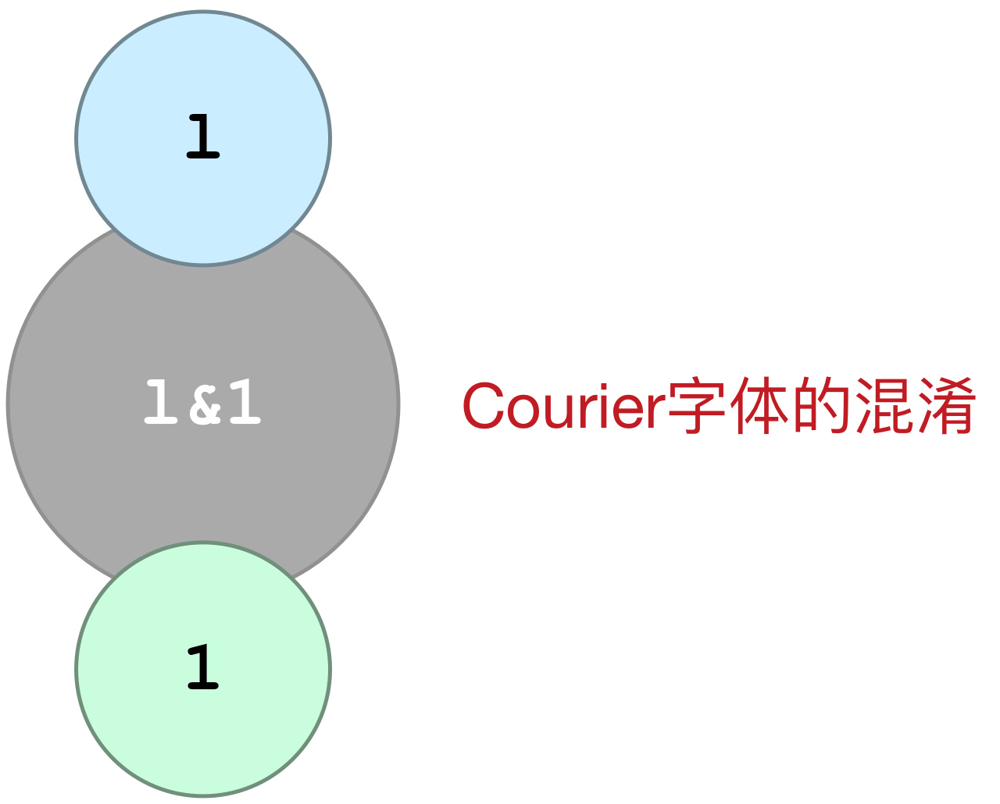

# SVG

> SVG 意为可缩放矢量图形（Scalable Vector Graphics）。

> <https://www.w3.org/TR/SVG11/Overview.html>

## 一、前言

SVG 于 2003 年 1 月 14 日成为 W3C 推荐标准。

参与定义 SVG 的组织有：太阳微系统、Adobe、苹果公司、IBM 以及柯达。

与其他图像格式相比，使用 SVG 的优势在于：

* SVG 可被非常多的工具读取和修改（比如记事本）
* SVG 与 JPEG 和 GIF 图像比起来，尺寸更小，且可压缩性更强。
* SVG 是可伸缩的
* SVG 图像可在任何的分辨率下被高质量地打印
* SVG 可在图像质量不下降的情况下被放大
* SVG 图像中的`文本是可选的`，同时`也是可搜索的`（很适合制作地图）
* SVG 可以与 Java 技术一起运行
* SVG 是开放的标准
* SVG 文件是纯粹的 XML

SVG 的主要竞争者是 Flash。
与 Flash 相比，SVG 最大的优势是与其他标准（比如 XSL 和 DOM）相兼容。而 Flash 则是未开源的私有技术。

## 二、简单例子

svg文件，以下文本内容保存成文件名为`circle.svg`的文件，就成为svg文件，可以直接打开预览了：

    <?xml version="1.0" standalone="no"?>

    <!DOCTYPE svg PUBLIC "-//W3C//DTD SVG 1.1//EN" 
    "http://www.w3.org/Graphics/SVG/1.1/DTD/svg11.dtd">

    <svg width="100%" height="100%" version="1.1"
    xmlns="http://www.w3.org/2000/svg">

    <circle cx="100" cy="50" r="40" stroke="black"
    stroke-width="2" fill="red"/>

    </svg>

浏览器中展示圆形的svg：

<svg width="100%" height="100%">
<circle 
    cx="100" 
    cy="50" 
    r="40" 
    stroke="#ff7f0e" 
    stroke-width="5" 
    fill="#2ca02c"
    />
</svg>

代码如下：

    <svg width="100%" height="100%">
    <circle 
        cx="100" 
        cy="50" 
        r="40" 
        stroke="#ff7f0e" 
        stroke-width="5" 
        fill="#2ca02c"
        />
    </svg>

## 三、预定义形状（shapes）

SVG 有一些预定义的形状元素，可被开发者使用和操作：

* 矩形 rect
* 圆形 circle
* 椭圆 ellipse
* 线 line
* 折线 polyline
* 多边形 polygon
* 路径 path

### 3.1 矩形

<svg width="100%" height="100%">
<rect width="300" height="100" x="200" y="20"
    style="
        fill: #8c564b;
        fill-opacity: 0.5;
        stroke-width: 1;
        stroke: rgb(0,0,0);
        stroke-opacity: 0.5;
    " />
</svg>

代码如下：

    <svg width="100%" height="100%">
    <rect width="300" height="100" x="200" y="20"
        style="
            fill: #8c564b;
            fill-opacity: 0.5;
            stroke-width: 1;
            stroke: rgb(0,0,0);
            stroke-opacity: 0.5;
        " />
    </svg>

`带圆角的矩形`

<svg width="100%" height="100%">
<rect width="300" height="100" x="200" y="20"
    rx="50" ry="20"
    style="
        fill: #8c564b;
        fill-opacity: 0.5;
        stroke-width: 1;
        stroke: rgb(0,0,0);
        stroke-opacity: 0.5;
    " />
</svg>

代码如下：

    <svg width="100%" height="100%">
    <rect width="300" height="100" x="200" y="20"
        rx="50" ry="20"
        style="
            fill: #8c564b;
            fill-opacity: 0.5;
            stroke-width: 1;
            stroke: rgb(0,0,0);
            stroke-opacity: 0.5;
        " />
    </svg>

### 3.2 圆形

<svg width="100%" height="100%">
<circle 
    r="80" 
    stroke="#ff7f0e" 
    stroke-width="5" 
    fill="#2ca02c"
    />
</svg>

代码如下：

cx，cy的值默认为0。

    <svg width="100%" height="100%">
    <circle 
        r="100" 
        stroke="#ff7f0e" 
        stroke-width="5" 
        fill="#2ca02c"
        />
    </svg>

### 3.3 椭圆

<svg width="100%" height="200">
<ellipse 
    cx="300" 
    cy="100" 
    rx="200" 
    ry="80"
    style="
        fill:#74c476;
        stroke:rgb(0,0,100);
        stroke-width:1;
    "/>
</svg>

代码：

    <svg width="100%" height="200">
    <ellipse 
        cx="300" 
        cy="100" 
        rx="200" 
        ry="80"
        style="
            fill:#74c476;
            stroke:rgb(0,0,100);
            stroke-width:1;
        "/>
    </svg>

`三个叠加的椭圆`：

<svg width="100%" height="100%">
<ellipse cx="240" cy="100" rx="220" ry="30" style="fill:#9ecae1"/>
<ellipse cx="220" cy="70" rx="190" ry="20" style="fill:#fdae6b"/>
<ellipse cx="210" cy="45" rx="170" ry="15" style="fill:#9e9ac8"/>
</svg>

    <svg width="100%" height="100%">
    <ellipse cx="240" cy="100" rx="220" ry="30" style="fill:#9ecae1"/>
    <ellipse cx="220" cy="70" rx="190" ry="20" style="fill:#fdae6b"/>
    <ellipse cx="210" cy="45" rx="170" ry="15" style="fill:#9e9ac8"/>
    </svg>

`两个组合的椭圆`：

<svg width="100%" height="100%">
<ellipse cx="240" cy="100" rx="220" ry="30" style="fill:#7b4173"/>
<ellipse cx="220" cy="100" rx="190" ry="20" style="fill:white"/>
</svg>

### 3.4 线条

<svg width="100%" height="100%">
<line 
    x1="30" y1="10" 
    x2="300" y2="100"
    style="
        stroke: #1f77b4;
        stroke-width: 4;
        stroke-opacity: 0.7;
    "/>
</svg>

    <svg width="100%" height="100%">
    <line 
        x1="30" y1="10" 
        x2="300" y2="100"
        style="
            stroke: #1f77b4;
            stroke-width: 4;
            stroke-opacity: 0.7;
        "/>
    </svg>

### 3.5 折线

<svg width="100%" height="100%">
<polyline 
    points="5,0 5,20 25,20 25,40 45,40 45,60"
    style="
        fill:transparent;
        stroke:#637939;
        stroke-width:2;
    "/>
<polyline 
    points="20,0 100,10 200,40 150,70"
    style="
        fill:transparent;
        stroke:#a55194;
        stroke-width:2;
    "/>
</svg>

### 3.6 多边形

<svg width="100%" height="300">

<polygon 
    points="220,100 300,210 170,250 120,120"
    style="
        fill:#cccccc;
        stroke:#000000;
        stroke-width:1;
    "/>

</svg>

    <svg width="100%" height="300">

    <polygon 
        points="220,100 300,210 170,250 120,120"
        style="
            fill:#cccccc;
            stroke:#000000;
            stroke-width:1;
        "/>

    </svg>

### 3.7 文本

> <https://www.w3.org/TR/SVG11/text.html>

<svg width="100%" height="200" style="border: 1px dashed #bbb;">

<text 
    x="100"
    y="10"
    dx="10"
    dy="60"
    rotate="15"
    textLength="600"
    lengthAdjust="spacing"
    style="
        fill:#ff7f0e;
        stroke:#1f77b4;
        stroke-width:1;
        font-size:60px;
    ">SVG text
</text>

<text 
    x="100"
    y="80"
    dx="10"
    dy="60"
    rotate="15"
    textLength="600"
    lengthAdjust="spacingAndGlyphs"
    style="
        fill:#ff7f0e;
        stroke:#1f77b4;
        stroke-width:1;
        font-size:60px;
    ">SVG text
</text>

<rect
    x="97"
    y="7"
    width="7"
    height="7"
    style="
        fill: #8c564b;
        cursor: move;
        fill-opacity: 1;
        stroke-width: 1;
        stroke: rgb(0,0,0);
        stroke-opacity: 1;
    " />

</svg>

代码如下：

    <text 
        x="100"
        y="10"
        dx="10"
        dy="60"
        rotate="15"
        textLength="600"
        lengthAdjust="spacing"
        style="
            fill:#ff7f0e;
            stroke:#1f77b4;
            stroke-width:1;
            font-size:60px;
        ">SVG text
    </text>

关键属性：
* textLength：文本长度
* lengthAdjust属性取值：`spacing|spacingAndGlyphs`，以上Demo正是展示了两种的不同。
* x, y： `(left, bottom)`的坐标
* dx, dy：偏移量

svg的text标签没有以下类似的属性（<http://stackoverflow.com/questions/15500894/background-color-of-text-in-svg>）：

    border:1px solid #c5b0d5;
    background-color:red;

如果确实需要，只能模拟。比如绘制一个下层的矩形，并填充颜色。

### 3.8 路径

> <http://www.w3.org/TR/SVG11/paths.html>

指令：

* M = moveto
* L = lineto
* H = horizontal lineto
* V = vertical lineto
* C = curveto，三次贝塞尔曲线到
* S = smooth curveto，光滑三次贝塞尔曲线到
* Q = quadratic Belzier curve，二次贝塞尔曲线到
* T = smooth quadratic Belzier curveto，光滑二次贝塞尔曲线到
* A = elliptical Arc
* Z = closepath

`指令大写表示绝对定位，小写表示相对定位`

#### 3.6.1 M指令、H指令和h指令

<svg width="100%" height="100">
<path d="M30 30
    H300
    h2.786l8.179,7.089l9.633,4.544l8.725,2.182l9.814-0.909
        l1.636,1.091
    "
    style="
        fill:#eee;
        stroke:green;
        stroke-width:1
        "
    />
</svg>

以下是代码，`注意L的小写l与1的区别`，仔细看是`横勾(l)与斜勾(1)的区别`。自动生成工具使用精简方式，容易造成误解。

    <svg width="100%" height="300">
    <path d="M30 30
        H300
        h2.786l8.179,7.089l9.633,4.544l8.725,2.182l9.814-0.909
            l1.636,1.091
        "
        style="
            fill:#eee;
            stroke:green;
            stroke-width:1
            "
        />
    </svg>

#### 3.6.2 C指令

从当前点绘制三次贝塞尔曲线到节点(x, y)。起点控制点为(x1, y1)，终点控制点为(x2, y2)。

参数： 

    x1 y1 x2 y2 x y

以下例子展示了三阶贝塞尔曲线，可以拖动起终点和控制点改变曲线形状。

<svg id="test_50_svg" width="100%" height="200"></svg>

#### 3.6.3 S指令

从当前点绘制一条三次贝塞尔曲线至指定点，使用上一节点的控制点的`镜像节点`作为控制点。参数为：

    x2 y2 x y

将以上的Demo再扩展一下，允许常规编辑功能：

* 添加新点（`按住win-Alt或mac-option点击空白处`）
* 删除点（`按住shift点击指定点`）

<svg id="test_60_svg" width="100%" height="400"></svg>

<label><input type="checkbox" id="test_60_checkbox_1" checked="checked"> 显示辅助线</label>
<label><input type="checkbox" id="test_60_checkbox_2"> 显示坐标</label>
<label><input type="checkbox" id="test_60_checkbox_3" checked> 平滑模式</label>

#### 3.6.4 Q指令

从当前点绘制`二次贝塞尔曲线`至目标点(x, y)，使用(x1, y1)为控制点。参数为：

    x1 y1 x y

以下例子展示了二阶贝塞尔曲线，可以拖动起终点和控制点改变曲线形状。

<svg id="test_65_svg" width="100%" height="200"></svg>

#### 3.6.5 T指令

从当前节点绘制`二次贝塞尔曲线`至目标点(x, y)，使用上一节点控制点的`镜像节点`作为控制点。

以下展示二次贝塞尔曲线，支持编辑操作同上：

<svg id="test_70_svg" width="100%" height="400"></svg>

<label><input type="checkbox" id="test_70_checkbox_1" checked> 显示辅助线</label>
<label><input type="checkbox" id="test_70_checkbox_2"> 显示坐标</label>
<label><input type="checkbox" id="test_70_checkbox_3" checked> 平滑模式</label>

gun

<svg width="100%" height="300">
<path 
    stroke="#EFF4F1" stroke-miterlimit="10" d="
        M53.861,99.117h2.786l8.179,7.089l9.633,4.544l8.725,2.182l9.814-0.909
        l1.636,1.091c0,0,2-3.817,5.09-4.908c3.09-1.09,8.542-5.997,10.542-8.724c2-2.727,2.729-20.063,2.729-20.063l-14.723-9.27
        l-4.727-8.472c0,0-1.451-5.412,1.456-9.522s11.085-4.11,11.085-4.11L117.9,54.88l3.271-5.998l-1.273-6.473l0.181-25.264
        l6.583,0.459l2.143,7.286l18.54,0.545l4.907,3.817l55.072,0.545l8.725,6.543v2.726l45.803,0.545l8.179,1.091l3.271,5.998
        l56.709,1.091l8.179-7.089l178.304,1.091l3.271-8.725l20.175,3.817v1.636l2.727,3.817l4.361,8.179l2.727,0.545l4.362,12.269v14.995
        l-2.727,18.539l-1.636,20.175l-0.545,3.271h-3.816l-2.727,6.544l-88.879,2.727l-2.727,4.907l-95.789-0.837
        c0,0-7.634,1.817-11.269,4.726s-8.543,12.177-8.543,12.177l-0.975,21.271c0,0-4.477,10.719-7.568,14.898
        c-3.089,4.181-12.723,9.998-17.631,11.634c-4.906,1.635-49.071-0.618-49.071-0.618c-28.9,0.546-32.717,5.998-32.717,5.998
        l-43.621,135.772l1.09,23.447l-7.634,4.907l-82.881-10.905l-3.271-6.543l-29.99-8.18l0.545-14.178l-5.453-7.088l42.348-99.531
        l1.272-3.091c0,0-3.272,0.364-5.453-0.363c-2.181-0.727-4.905-4.141-4.906-6.614c-0.002-2.475,8.724-17.994,8.724-17.994
        s4.633-0.335,7.087-3.2c2.106-2.46,3.297-7.322,5.816-12.359c5.453-10.905-1.998-24.79-1.998-24.79l-11.088-9.198l-16.175-7.705
        c0,0-20.175-7.089-25.628-19.63S53.861,99.117,53.861,99.117z"/>
</svg>

## 滤镜

高斯模糊的椭圆形：

<svg width="100%" height="160">
<defs>
<filter id="Gaussian_Blur">
<feGaussianBlur in="SourceGraphic" stdDeviation="3" />
</filter>
</defs>
<ellipse 
    cx="100" cy="80" rx="70" ry="40"
    style="
        fill:#8ca252;
        stroke:#8ca252;
        stroke-width:1;
        filter:url(#Gaussian_Blur)
    "/>
</svg>

代码如下：

    <svg width="100%" height="160">
    <defs>
    <filter id="Gaussian_Blur">
    <feGaussianBlur in="SourceGraphic" stdDeviation="3" />
    </filter>
    </defs>
    <ellipse 
        cx="100" cy="80" rx="70" ry="40"
        style="
            fill:#8ca252;
            stroke:#8ca252;
            stroke-width:1;
            filter:url(#Gaussian_Blur)
        "/>
    </svg>

