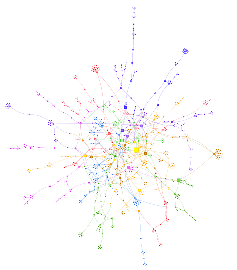

# visjs

> 网络图谱、时间线、2D图形、3D图形的js库

## Resources

* site: <http://visjs.org>
* github: <https://github.com/almende/vis> <iframe src="http://258i.com/gbtn.html?user=almende&repo=vis&type=star&count=true" frameborder="0" scrolling="0" width="105px" height="20px"></iframe>
* docs: <http://visjs.org/docs/network/>
* showcases: <http://visjs.org/showcase/index.html>

## Features
* 提供五大门类的图形处理库，网络图、时间线、数据集（DataSet，可增删改，支持数据变动事件订阅）、2D图形库、3D图形库。
* `层次布局`算法的差异：孩子节点的计算受`hierarchical.sortMethod`取值的影响，取值`directed`则按广度优先选取，默认按深度优先选取。无最小交叉算法。
* 节点形状原生支持`ellipse, circle, database, box, text`，以及标签在下方的`image, circularImage, diamond, dot, star, triangle, triangleDown, square, icon`
* 节点原生支持图片、fallback图片
* 支持`编辑态`

  

## 安装

    npm install --save vis
    npm install --save-dev babel-plugin-transform-runtime \
        babel-plugin-transform-es3-property-literals \
        babel-plugin-transform-es3-member-expression-literals

    bower install vis

## Tips

### 更新API

    network.setOptions( options );
    network.setData( data ); // 其中data.options 将会作为 network.setOpions()的参数

### 布局切换

> 带physics的层次布局，切换到不带physics的普通布局过程中，需要`两次调用network.setOptions( options )`

    {
        layout: {
            hierarchical: {
                enabled: true
            }
        }
        , physics: {
            enabled: true
        }
    } 

到达：

    {
        layout: {
            hierarchical: {
                enabled: false
            }
        }
        , physics: {
            enabled: false
        }
    } 

`不能`通过调用network.setOptions( options )`一步到位`，需要分别设置，总共调用`两次`。

    network.setOptions( { layout: { hierarchical: { enabled: false } } );
    network.setOptions( { physics: { enabled: false } );

## Examples

<http://visjs.org/network_examples.html>

 

