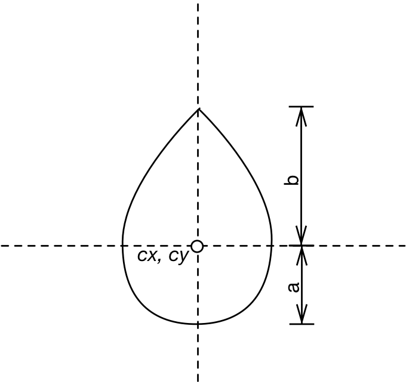

# zrender-insights

> A light-weight canvas library which provides 2d draw for `ECharts`.

## Resources

* github: <https://github.com/ecomfe/zrender>
* `v3.5.2`: <https://github.com/ecomfe/zrender/tree/3.5.2>

## Features

* 分层渲染的思想
* MVC驱动模型
* 使用`AMD`风格编写，使用`r.js`导出
* 代码风格简洁易懂
* 文档没有及时更新

## 相关算法和数学知识

> 一些基础的算法和数学知识

* `矩阵`知识 <ref://../math/matrix.md.html>
* `向量`知识 <ref://../math/vector.md.html>
* 曲线插值算法`catmull-rom` <ref://../algorithm/catmull-rom.md.html>
* 点和多边形相对位置的算法等 <ref://../algorithm/point-in-polygon.md.html>
* 其他`包含`算法
* 贝塞尔曲线详解 <ref://../math/bezier-curve.md.html>
* 动画缓动效果`easing`

## top level 

### zrender

    zrender.js
        VML or canvas
        zrender
            version
            // factory pattern
            init( dom, opts )
            dispose( zr )
            getInstance( id )
            registerPainter( name, Ctor )
        ZRender( id, dom, opts )
            properties:
                dom
                id
                storage
                painter
                handler
                animation
                _needsRefresh
            methods:
                getId()
                add( el )
                remove( el )
                configLayer( zLevel, config )
                refresh()
                flush()
                addHover( el, style )
                removeHover( el )
                clearHover( el )
                refreshHover()
                resize( opts )
                clearAnimation()
                getWidth()
                getHeight()
                pathToImage( e, dpr )
                setCursorStyle( cursorStyle )
                findHover( x, y )
                on( eventName, eventHandler, context )
                off( eventName, eventHandler )
                trigger( eventName, event )
                clear()
                dispose()
                

### config

    config.js
        properties:
            debugMode: 0
            devicePixelRatio: dpr

### Storage

    Storage.js
        图形绘制队列管理     
        Storage()
            properties:
                _roots
                _displayList
                _displayListLen
            methods:
                traverse( cb, context )
                getDisplayList( update, includeIgnore )
                updateDisplayList( includeIgnore )
                _updateAndAddDisplayable( el, clipPaths, includeIgnore )
                addRoot( el )
                delRoot( el )
                addToStorage( el )
                delFromStorage( el )
                dispose()

### Painter

    Painter.js
        MAX_PROGRESSIVE_LAYER_NUMBER
        parseInt10( val )
        isLayerValid( layer )
        preProcessLayer( layer )
        postProcessLayer( layer )
        isDisplayableCulled( el, width, height )
        isClipPathChanged( clipPaths, prevClipPaths )
        doClip( clipPaths, ctx )
        createRoot( width, height )
        Painter( root, storage, opts )
            properties:
                _opts
                dpr
                _singleCanvas
                root
                storage
                _zlevelList
                _layers
                _layerConfig
                _width
                _height
                _domRoot
                _progressiveLayers
                _hoverLayer
                _hoverElements
            methods:
                isSingleCanvas()
                getViewportRoot()
                getViewportRootOffset()
                refresh( paintAll )
                addHover( el, hoverStyle )
                removeHover( el )
                clearHover( el )
                refreshHover()
                _startProgressive()
                _clearProgressive()
                _paintList( list, paintAll )
                _doPaintList( list, paintAll )
                _doPaintEl( el, currentLayer, forcePaint, scope )
                getLayer( zlevel )
                insertLayer( zlevel, layer )
                eachLayer( cb, context )
                eachBuiltinLayer( cb, context )
                eachOtherLayer( cb, context )
                getLayers()
                _updateLayerStatus( list )
                clear()
                _clearLayer( layer )
                configLayer( zlevel, config )
                delLayer( zlevel )
                resize( width, height )
                clearLayer( zlevel )
                dispose()
                getRenderedCanvas( opts )
                getWidth()
                getHeight()
                _getSize( whIdx )
                pathToImage( path, dpr )

### Layer

    Layer.js
        createDom( id, type, painter, dpr )
        Layer( id, painter, dpr )
            properties:
                id
                dom
                domBack
                ctxBack
                painter
                config
                clearColor
                motionBlur
                lastFrameAlpha
                dpr
            prototype:
                elCount
                __dirty
                initContext()
                createBackBuffer()
                resize( width, height )
                clear( clearAll )

### Handler

    Handler.js
        makeEventPacket( eveType, targetInfo, event )
        isHover( displayable, x, y )
        EmptyProxy()
            prototype:
                dispose()
        Handler( storage, painter, proxy, painterRoot )
            Eventful.call( this )        
            Draggable.call( this )
            properties:
                storage
                painter
                painterRoot
                proxy
                _hovered
                _lastTouchMoment
                _lastX
                _lastY
            prototype:
                mousemove( event )
                mouseout( event )
                resize( event )
                dispatch( eventName, eventArgs )
                dispose()
                setCursorStyle( cursorStyle )
                dispatchToElement( targetInfo, eventName, event )
                findHover( x, y, exclude )
                click( event )
                mousedown( event )
                mouseup( event )
                mousewheel( event )
                dblclick( event )
                contextmenu( event )
        util.mixin( Handler, Eventful );
        util.mixin( Handler, Draggable );
        

### Element

    Element.js 
        Element( opts )
            Transformable.call( this, opts )
            Eventful.call( this, opts )
            Animatable.call( this, opts )
            properties:
                id
            prototype:
                type
                name
                __zr
                ignore
                clipPath
                drift( dx, dy ) // 漂移
                beforeUpdate()
                afterUpdate()
                update()
                traverse( cb, context )
                attrKV( key, value )
                hide()
                show()
                attr( key, value )
                setClipPath( clipPath )
                removeClipPath()
                addSelfToZr( zr )
                removeSelfFromZr( zr )

        zrUtil.mixin( Element, Animatable )
        zrUtil.mixin( Element, Transformable )
        zrUtil.mixin( Element, Eventful )
        

## core/

### env

    env.js
        env
            browser
                firefox
                ie
                edge
                weChat
                version
            os
            node
            canvasSupported
            touchEventsSupported
            pointerEventsSupported

### event

    event.js
        getBoundingClientRect( el )
        defaultGetZrXY( el, e, out )
        @return {
            clientToLocal( el, e, out, calculate )
            , normalizeEvent( el, e, calculate )
            , addEventListener( el, name, handler )
            , removeEventListener( el, name, handler )
            , stop( e )
            , Dispatcher: Eventful
        }

### guid

    guid.js
        idStart = 0x0907; // 为什么从0x0907开始？
        function() { return idStart++; }

### log

    log.js
        config.debugMode
            0       return
            1       throw new Error()
            > 1     console.log()

### matrix

    matrix.js
        matrix
            fields:
                // 创建一个单位矩阵
                create()
                identity( out )
                copy( out, m )
                mul( out, m1, m2 )
                translate( out, a, v )
                rotate( out, a, rad )
                scale( out, a, v )
                invert( out, a ) // 逆矩阵

    
### timsort

    timsort.js
        // <https://github.com/mziccard/node-timsort>

### utils

    utils.js
        HashMap( obj )
            prototype:
                get( key )
                set( key, value )
                each( cb, context )
                removeKey( key )
        @return {
            clone( source )
            merge( target, source, overwrite )
            mergeAll( targetAndSources, overwrite )
            extend( target, source )
            defaults( target, source, overlay )
            createCanvas()
            getContext()
            indexOf( array, value )
            inherits( clazz, baseClazz )
            mixin( target, source, overlay )
            isArrayLike( data )
            each( obj, cb, context )
            map( obj, cb, context )
            reduce( obj, cb, memo, context )
            filter( obj, cb, context )
            find( obj, cb, context )
            bind( func, context )
            curry( func )
            isArray( value )
            isFunction( value )
            isString( value )
            isObject
            isBuiltInObject( value )
            isDom( value )
            eqNaN( value ) { return value !== value; }
            retrieve( values )
            slice()
            assert( condition, message )
            setAsPrimitive( obj )
            isPrimitive( obj )
            createHashMap( obj )
            noop
        }

### vector

    vector.js
        ArrayCtor
        vector
            create( x, y )
            copy( out, v )
            clone( v )
            set( out, a, b )
            add( out, v1, v2 )
            scaleAndAdd( out, v1, v2, a )
            sub( out, v1, v2 )
            len( v )
            lenSquare( v )
            mul( out, v1, v2 )
            div( out, v1, v2 )
            // 向量点积
            dot( v1, v2 )
            scale( out, v, s )
            normalize( out, v )
            // 向量间距离
            distance( v1, v2 )
            // 向量间距离平方
            distanceSquare( v1, v2 )
            negate( out, v )
            // 插值两个点
            lerp( out, v1, v2, t )
            applyTransform( out, v, m )
            min( out, v1, v2 )
            max( out, v1, v2 )

### curve

    curve.js
        isAroundZero( val )
        isNotAroundZero( val )
        cubicAt( p0, p1, p2, p3, t )
        cubicDerivativeAt( p0, p1, p2, p3, t )
        cubicRootAt( p0, p1, p2, p3, val, roots )
        cubicExtrema( p0, p1, p2, p3, extrema )
        cubicSubdivide( p0, p1, p2, p3, t, out )
        cubicProjectPoint( x0, y0, x1, y1, x2, y2, x3, y3, x, y, out )
        quadraticAt( p0, p1, p2, t )
        quadraticDerivativeAt( p0, p1, p2, t )
        quadraticRootAt( p0, p1, p2, val, roots )
        quadraticExtremum( p0, p1, p2 )
        quadraticSubdivide( p0, p1, p2, t, out )
        quadraticProjectPoint( x0, y0, x1, y1, x2, y2, x, y, out )

### bbox

    bbox.js
        fromPoints( points, min, max )
        fromLine( x0, y0, x1, y1, min, max )
        fromCubic( x0, y0, x1, y1, x2, y2, x3, y3, min, max )
        fromQuadratic( x0, y0, x1, y1, x2, y2, min, max )
        fromArc( x, y, rx, ry, startAngle, endAngle, anticlockwise, min, max )

### arrayDiff

    arrayDiff.js
        arrayDiff( arr0, arr1, equal )

### PathProxy

    // 抹平canvas和svg的差异
    PathProxy.js
        PathProxy( notSaveData )
            properties:
                _saveData
                data
                _ctx
            prototype:
                _xi
                _yi
                _x0
                _y0
                _ux
                _uy
                _len
                _lineDash
                _dashOffset
                _dashIdx
                _dashSum
                setScale( sx, sy )
                getContext()
                beginPath( ctx )
                moveTo( x, y )
                lineTo( x, y )
                bezierCurveTo( x1, y1, x2, y2, x3, y3 )
                quadraticCurveTo( x1, y1, x2, y2 )
                arc( cx, cy, r, startAngle, endAngle, anticlockwise )
                arcTo( x1, y1, x2, y2, radius )
                rect( x, y, w, h )
                closePath()
                fill( ctx )
                stroke( ctx )
                setLineDash( lineDash )
                setLineDashOffset( offset )
                len()
                setData( data )
                appendPath( path )
                addData( cmd )
                _expandData()
                _needsDash()
                _dashedLineTo( x1, y1 )
                _dashedBezierTo( x1, y1, x2, y2, x3, y3 )
                _dashedQuadraticTo( x1, y1, x2, y2 )
                // 转成静态的Float32Array，减少堆内存占用
                toStatic()
                getBoundingRect()
                rebuildPath( ctx )

### LRU

    // Simple LRU ( Least Recently Used ) cache using doubly linked list
    // 双向链表缓存机制
    LRU.js
        LinkedList()
            properties:
                head
                tail
                _len
            prototype:
                insert( val )
                insertEntry( entry )
                remove( entry )
                len()
                clear()
        Entry( val )
            properties:
                value
                next
                prev
        LRU( maxSize )
            properties:
                _list
                _map
                _maxSize
                _lastRemovedEntry
            prototype:
                put( key, value )
                get( key )
                clear()

### GestureMgr

    // 主要用于mobile端支持
    GestureMgr.js
        GestureMgr()
            properties:
                _track
            prototype:
                recognize( event, target, root )
                clear()
                _doTrack( event, target, root )
                _recognize( event )
        dist( pointPair )
        center( pointPair )
        recognizers
            pinch( track, event )

### BoundingRect

    BoundingRect.js
        BoundingRect( x, y, width, height )
            properties:
                x
                y
                width
                height
            prototype:
                union( other )
                applyTransform( m )
                calculateTransform( b )
                intersect( b )
                contain( x, y )
                clone()
                copy( other )
                plain()
            static:
                create( rect )

## graphic/

### Displayable

    // Base class of all displayable graphic objects
    Displayable.js
        Displayable( opts )
            Element.call( this, opts )
            properties:
                style
                _rect
                __clipPaths
            prototype:
                type: 'displayable'
                __dirty
                invisible
                z
                z2
                zlevel
                draggable
                dragging
                silent
                culling
                cursor
                rectHover
                progressive
                beforeBrush( ctx )
                afterBrush( ctx )
                brush( ctx, prevEl )
                getBoundingRect()
                contain( x, y )
                traverse( cb, context )
                rectContain( x, y )
                // Mark dirty and refresh within next frame
                dirty()
                animateStyle( loop )
                attrKV( key, value )
                setStyle( key, value )
                useStyle( obj )

### Path

    // Path element
    Path.js
        Path( opts )
            properties:
                path
            prototype:
                type
                __dirtyPath
                strokeContainThreshold
                brush( ctx, prevEl )
                buildPath( ctx, shapeCfg, inBundle )
                createPathProxy()
                getBoundingRect()
                contain( x, y )
                dirty( dirtyPath )
                animateShape( loop )
                attrKV( key, value )
                setShape( key, value )
                getLineScale()
            static:
                extend( defaults )

### CompoundPath

    // CompoundPath to improve performance
    CompoundPath.js
        // 通过`Path.extend()`扩展
        CompoundPath
            properties:
                type: 'compound'
                shape
            prototype:
                _updatePathDirty()
                beforeBrush()
                buildPath( ctx, shape )
                afterBrush()
                getBoundingRect()

### States

    // State machine for managing graphic states
    States.js
        TransitionObject( opts )
            properties:
                property
            prototype:
                property: '*'
                easing
                duration: 500
                delay: 0
                _fromStr( str )

        GraphicStates( opts )
            properties:
                _states
                _el
                _subStates
                _transitionAnimators
                _initialState
            prototype:
                _initialState: 'normal'
                _currentState
                _addState( name, state )
                _extendFromInitial( state )
                setState( name, silent )
                getState()
                transitionState( target, done )
                _animProp( state, subPropKey, key, transitionCfg, done )
                _stopTransition()
                transiting()
                addSubStates( states )
                removeSubStates( states )

### Gradient

    Gradient.js
        Gradient( colorStops )
            properties:
                colorStops
            prototype:
                addColorStop( offset, color )

    
### LinearGradient

    LinearGradient.js
        LinearGradient( x, y, x2, y2, colorStops, globalCoord )
            Gradient.call( this, colorStops )
            properties:
                x
                y
                x2
                y2
                type
                global
        zrUtil.inherits( LinearGradient, Gradient )

### RadialGradient

    RadialGradient.js
        RadialGradient( x, y, r, colorStops, globalCoord )
            Gradient.call( this, colorStops )
            properties:
                x
                y
                r
                type
                global
        zrUtil.inherits( RadialGradient, Gradient )

### Image

    Image.js
        ZImage( opts )
            Displayable.call( this, opts )
            prototype:
                type: 'image'
                brush( ctx, prevEl )
                getBoundingRect()
        zrUtil.inherits( ZImage, Displayable )

### Pattern

    Pattern.js
        Pattern( image, repeat )
            properties:
                image
                repeat
                type
            prototype:
                getCanvasPattern( ctx )

### Style

    Style.js
        STYLE_COMMON_PROPS
            shadowBlur: 0
            shadowOffsetX: 0
            shadowOffsetY: 0
            shadowColor: '#000'
            lineCap: 'butt'
            lineJoin: 'miter'
            miterLimit: 10
        createLinearGradient( ctx, obj, rect )
        createRadialGradient( ctx, obj, rect )
        Style( opts )
            prototype:
                fill: '#000000'
                stroke
                opacity: 1
                lineDash: null
                lineDashOffset: 0
                shadowBlur: 0
                shadowOffsetX: 0
                shadowOffsetY: 0
                lineWidth: 1
                strokeNoScale: false
                text: null
                textFill: '#000'
                textStroke: null
                textPosition: 'inside'
                textPositionRect: null
                textOffset: null
                textBaseline: null
                textAlign: null
                textVerticalAlign: null
                textDistance: 5
                textShadowBlur: 0
                textShadowOffsetX: 0
                textShadowOffsetY: 0
                textTransform: false
                textRotation: 0
                blend: null
                bind( ctx, el, prevEl )
                hasFill()
                hasStroke()
                extendFrom( otherStyle, overwrite )
                set( obj, value )
                clone()
                getGradient( ctx, obj, rect )

### Text

    Text.js
        Text( opts )
            Displayable.call( this, opts )
            prototype:
                type: 'text'
                brush( ctx, prevEl )
                getBoundingRect()
        zrUtil.inherits( Text, Displayable )

## graphic/shape/

### Line

    Line.js
        // 通过`Path.extend()`扩展
        Line()
            prototype:
                type: 'line'
                shape: { x1: 0, y1: 0, x2: 0, y2: 0, percent: 1 }
                style: { stroke: '#000', fill: null }
                buildPath( ctx, shape )
                pointAt( p )
        

### Circle

    Circle.js
        // 通过`Path.extend()`扩展
        Circle()
            prototype:
                type: 'circle'
                shape: { cx: 0, cy: 0, r: 0 }
                buildPath( ctx, shape, inBundle )

### Rect

    Rect.js
        // 通过`Path.extend()`扩展
        Rect()
            prototype:
                // 左上、右上、右下、左下角的半径依次为r1、r2、r3、r4
                // r缩写为1         相当于 [1, 1, 1, 1]
                // r缩写为[1]       相当于 [1, 1, 1, 1]
                // r缩写为[1, 2]    相当于 [1, 2, 1, 2]
                // r缩写为[1, 2, 3] 相当于 [1, 2, 3, 2]
                type: 'rect'
                shape: {
                    r: 0
                    x: 0
                    y: 0
                    width: 0
                    height: 0
                }
                buildPath( ctx, shape )
        

### Star

    // n角星（n>=3)
    Star.js
        Rect()
            prototype:
                type: 'star'
                shape: { cx: 0, cy: 0, n: 3
                    , r0: null // 内部顶点外接圆半径
                    , r: 0 }
                buildPath( ctx, shape )

### Arc

    Arc.js
        Arc()
            prototype: 
                type: 'arc'
                shape: { cx: 0, cy: 0, r: 0, startAngle: 0, endAngle: Math.PI * 2, clockwise: true }
                style: { stroke: '#000', fill: null }
                buildPath( ctx, shape )

### Ployline

    Polyline.js
        Polyline()
            prototype:
                type: 'polyline'
                shape: { points: null, smooth: false, smoothConstraint: null }
                style: { stroke: '#000', fill: null }
                buildPath( ctx, shape )
                    polyHelper.buildPath( ctx, shape, false )

### Ellipse

    Ellipse.js
        Ellipse()
            prototype:
                type: 'ellipse'
                shape: { cx: 0, cy: 0, rx: 0, ry: 0 }
                buildPath( ctx, shape )
                    var k = 0.5522848;
                    // 从椭圆的左端点开始顺时针绘制四条三次贝塞尔曲线

### Heart

    Heart.js
        Heart()
            prototype:
                type: 'heart'
                shape: { cx: 0, cy: 0, width: 0, height: 0 }
                buildPath( ctx, shape )
                    // 移动到cx, cy，再绘制两条三次贝塞尔曲线

### Ring

    Ring.js
        Ring()
            prototype:
                type: 'ring'
                shape: { cx: 0, cy: 0, r: 0, r0: 0 }
                buildPath( ctx, shape )

### BezierCurve

    BezierCurve.js
        BezierCurve()
            prototype:
                type: 'bezier-curve'
                shape: {
                    x1: 0, y1: 0
                    x2: 0, y2: 0
                    cpx1: 0, cpx2: 0
                    percent: 1
                }
                style: { stroke: '#000', fill: null }
                buildPath( ctx, shape )
                // get point at percent t
                pointerAt( t )
                // get tangent(切线) at percent t
                tangentAt( t )

### Droplet

    Droplet.js
        Droplet()
            prototype:
                type: 'droplet'
                shape: { cx: 0, cy: 0, width: 0, height: 0 }
                buildPath( ctx, shape )

### Other

    Isogon.js
    Polygon.js
    Rose.js
    Sector.js
    Trochoid.js

## contain/

### utils

    utils.js
        normalizeRadian( angle )

### line

    line.js
        containStroke( x0, y0, x1, y1, lineWidth, x, y )

### path

    path.js
        isAroundEqual( a, b )
        swapExtrema()
        windingCubic( x0, y0, x1, y1, x2, y2, x3, y3, x, y )
        windingQuadratic( x0, y0, x1, y1, x2, y2, x, y )
        windingArc( cx, cy, r, startAngle, endAngle, anticlockwise, x, y )
        containPath( data, lineWidth, isStroke, x, y )
        contain( pathData, x, y )
        containStroke( pathData, lineWidth, x, y )

### arc

    arc.js
        containStroke( cx, cy, r, startAngle, endAngle, anticlockwise, lineWidth, x, y )

### cubic

    cubic.js
        // 点(x,y)到其在三阶贝塞尔曲线的投影的距离小于一半的曲线宽度
        containStroke( x0, y0, x1, y1, x2, y2, x3, y3, lineWidth, x, y )

### quadratic

    quadratic.js
        // 点(x,y)到其在二阶贝塞尔曲线的投影的距离小于一半的曲线宽度
        containStroke( x0, y0, x1, y1, x2, y2, lineWidth, x, y )

### widingLine

    // utils函数，用于判断多边形包含
    windingLine.js
        // 边对节点的绕数（wn）
        windingLine( x0, y0, x1, y1, x, y )

### ploygon

    polygon.js
        // 计算点是否被多边形里面
        contain( points, x, y )

### text

    text.js
        getTextWidth( text, textFont )
        getTextRect( text, textFont, textAlign, textBaseline )
        adjustTextPositionOnRect( textPosition, rect, textRect, distance )
        truncateText( text, containerWidth, textFont, ellipsis, options )
        estimateLength( text, contentWidth, ascCharWidth, cnCharWidth )

## mixin/

### Eventful

    Eventful.js
        Eventful()
            properties:
                _$handlers
            prototype:
                one( event, handler, context )
                on( event, handler, context )
                isSilent( event )
                off( event, handler )
                trigger( type )
                triggerWithContext( type )

### Draggable

    Draggable.js
        Draggable()
            this.on( 'mousedown', this._dragStart, this )
            this.on( 'mousemove', this._drag, this )
            this.on( 'mouseup', this._dragEnd, this )
            this.on( 'globalout', this._dragEnd, this )
            properties:
                _x
                _y
            prototype:
                _dragStart( e )
                _drag( e )
                _dragEnd( e )

### Animatable

    Animatable.js
        Animatable()
            properties:
                animators
            prototype:
                animate( path, loop )
                stopAnimation( forwardToLast )
                animateTo( target, time, delay, easing, callback )
                _animateToShallow( path, source, target, time, delay )

### Transformable

    Transformable.js
        Transformable( opts )
            properties:
                position
                rotation
                scale
                origin
            prototype:
                updateTransform()
                getLocalTransform( ctx )
                setTransform( ctx )
                restoreTransform( ctx )
                decomposeTransform()
                getGlobalScale()
                transformCoordToLocal( x, y )
                transformCoordToGlobal( x, y )
            static:
                getLocalTransform( target, m )

## animation/

### Animation

    // 动画主类, 调度和管理所有动画控制器
    Animation.js
        Animation( options )
            Dispatcher.call( this )
            properties:
                stage
                onframe
                _clips
                _running
                _pausedTime
                _pauseStart
                _paused
            prototype:
                addClip( clip )
                addAnimator( animator )
                removeClip( clip )
                removeAnimator( animator )
                _update()
                _startLoop()
                start()
                stop()
                pause()
                resume()
                clear()
                animate( target, options )
        util.mixin( Animation, Dispatcher )

### Animator

    Animator.js
        defaultGetter( target, key )
        defaultSetter( target, key, value )
        interpolateNumber( p0, p1, percent )
        interpolateString( p0, p1, percent )
        interpolateArray( p0, p1, percent, out, arrDim )
        fillArr( arr0, arr1, arrDim )
        isArraySame( arr0, arr1, arrDim )
        catmullRomInterpolateArray( p0, p1, p2, p3, t, t2, t3, out arrDim )
        // 平滑曲线插值实现
        catmullRomInterpolate( p0, p1, p2, p3, t, t2, t3 )
        cloneValue( value )
        rgba2String( rgba )
        getArrayDim( keyframes )
        createTrackClip( animator, easing, oneTrackDone, keyframes, propName )
        Animator()
            properties:
                _tracks
                _target
                _loop
                _getter
                _setter
                _clipCount
                _delay
                _doneList
                _onframeList
                _clipList
            prototype:
                // 设置动画关键帧
                when( time, props )
                during( callback )
                pause()
                resume()
                isPaused()
                _doneCallback()
                start( easing )
                stop( forwardToLast )
                delay( time )
                done( cb )
                getClips()

### Clip

    // 动画主控制器
    Clip.js
        Clip( options )
            properties:
                _target
                _life
                _delay
                _initialized
                loop
                gap
                easing
                onframe
                ondestroy
                onrestart
                _pausedTime
                _paused
            prototype:
                step( globalTime, deltaTime )
                restart( globalTime )
                fire( eventType, arg )
                pause()
                resume()

### easing

    // https://github.com/sole/tween.js/blob/master/src/Tween.js
    // 0 <= k <= 1
    easing.js
        linear( k )
        // t^2
        quadraticIn( k )
        quadraticOut( k )
        quadraticInOut( k )
        // t^3
        cubicIn( k )
        cubicOut( k )
        cubicInOut( k )
        // t^4
        quarticIn( k )
        quarticOut( k )
        quarticInOut( k )
        // t^5
        quinticIn( k )
        quinticOut( k )
        quinticInOut( k )
        // sin(t)
        sinusoidalIn( k )
        sinusoidalOut( k )
        sinusoidalInOut( k )
        // 2^t
        exponentialIn( k )
        exponentialOut( k )
        exponentialInOut( k )
        // 圆形曲线缓动 sqrt(1-t^2)
        circularIn( k )
        circularOut( k )
        circularInOut( k )
        // 创建类似于弹簧在停止前来回振荡的动画
        elasticIn( k )
        elasticOut( k )
        elasticInOut( k )
        // 在某一动画开始沿指示的路径进行动画处理前稍稍收回该动画的移动
        backIn( k )
        backOut( k )
        backInOut( k )
        // 创建弹跳效果
        bounceIn( k )
        bounceOut( k )
        bounceInOut( k )

### requestAnimationFrame

    requestAnimationFrame.js
        return (typeof window !== 'undefined' &&
                    ((window.requestAnimationFrame && window.requestAnimationFrame.bind(window))
                    // https://github.com/ecomfe/zrender/issues/189#issuecomment-224919809
                    || (window.msRequestAnimationFrame && window.msRequestAnimationFrame.bind(window))
                    || window.mozRequestAnimationFrame
                    || window.webkitRequestAnimationFrame)
                )
                || function (func) {
                    setTimeout(func, 16);
                }; 

