# box2dweb

> 大名鼎鼎的物理引擎box2d基本上大家都听说过，网上有两个javascript版本的box2d库，
> 一个是`box2djs`，已经停止维护，一个是`box2dweb`。 

在Google Code上维护：
`Source URL:` <a href="https://code.google.com/p/box2dweb/">box2dweb</a>

`Slide URL:` <a href="http://www.slideshare.net/szafranek/slides-en">Box2D</a>

`box2dflash实现的游戏：`<a href="http://www.gibbetsgame.com">Gibbets</a>

## box2d

> 多平台支持的2d物理引擎

1. multiplatform：c++, c#, ActionScript, Java
2. 2D: x, y
3. physics engine: gravity, friction, collision detection, motion simulation

> Box2D library is agnostic about rendering.

Box2D库独立于渲染，只做计算。

## 关键字

* rigid body - 刚体
* shape - 形状
* fixture
* constraint - 约束
* contact constraint - 接触约束
* joint - 关节
* joint limit - 关节限制
* joint motor - 关节马达
* world - 世界
* friction - 摩擦
* restitution - 恢复
* body - 物体
* collision geometry - 碰撞几何结构
* damping - 阻尼
* body definition - 物体定义
* solver
* kinematic - 运动学的
* torque - 扭力，扭矩
* inertia - 惯性
* discrete simulation - 分立式模拟 
* tunneling - 穿透
* CCD - continuous collision detection 
* oscillations - 震动
* Nyquist frequency - 奈奎斯特频率
* hinge point - 铰链点
* eternal - 永恒的，没完没了的
* axis - 轴，轴线
* pulley - 滑轮
* contraption - 新发明，奇妙的装置
* AABBs (axis-aligned bounding boxes)

## 模块

三个模块:

* Common
    * code for allocation, math and settings
* Collision
    * define shapes, a broad-phase, andcollision functions/queries
* Dynamics
    * provides the simulation world, bodies, fixtures, and joints

`Module Hierarchy：`

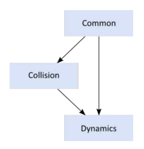

## 一、Collision Module

### b2Shape

* 测试点与shape是否重叠
* 处理灯光投射
* 计算AABB
* 计算质量属性

Note: Keep in mind that a shape does not know about bodies and stand apart from the dynamics system.

* When a shape is not attached to a body, you can view it’s vertices as being expressed in world- space.
* When a shape is attached to a body, you can view it’s vertices as being expressed in local coordinates.

1. Circle Shapes

2. Polygon Shapes

    Convex and Concave

    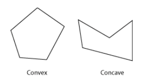

    多边形是Convex，而不是Concave。Convex的任意两个顶点的连线不会与任何一条边相交。

    多边形的顶点必须以CCW(Counter Clockwise Winding)顺序给出，这与右手坐标系统相适应。

    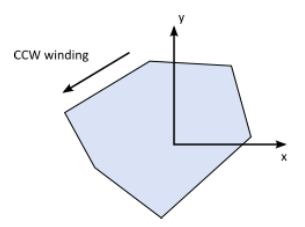

    Convex hull computation

    默认最大顶点数为8，满足大部分需求，也保证了计算性能

    从shape中继承了radius属性，形成polygon skin：

    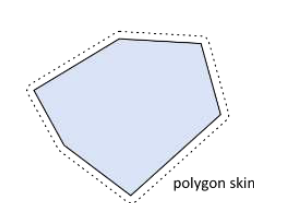

3. Edge Shapes

    即线段。辅助创建静态环境，无体积，可以与circle或polygon碰撞，但不会与自身碰撞。

    碰撞算法要求碰撞的两者至少有一个是有体积的，所以Edge－Edge都无体积，所以无法碰撞

        // This an edge shape. 
        b2Vec2 v1(0.0f, 0.0f); 
        b2Vec2 v2(1.0f, 0.0f);
        b2EdgeShape edge;
        edge.Set(v1, v2);

    注意`ghost collision`，可以使用chain shapes

4. Chain Shapes

    多个Edge连接成。

    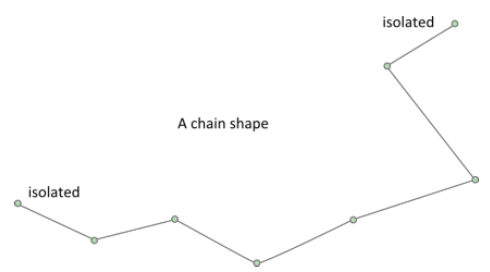

    self-intersection不支持，顶点很接近也可能会出问题，Edge长于b2_linearSlop(5mm)

    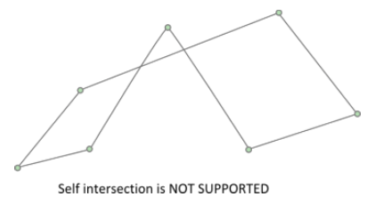

`一元几何查询`

1. 点测试，Shape Point Test

        b2Transfrom transform; 
        transform.SetIdentity(); 
        b2Vec2 point(5.0f, 2.0f);
        bool hit = shape->TestPoint(transform, point);

    Edge和Chain总是返回false，即使chain是闭合的。

2. 光测试

        b2Transfrom transform; 
        transform.SetIdentity(); 
        b2RayCastInput input; 
        input.p1.Set(0.0f, 0.0f, 0.0f); 
        input.p2.Set(1.0f, 0.0f, 0.0f); 
        input.maxFraction = 1.0f; 
        int32 childIndex = 0; 
        b2RayCastOutput output;
        bool hit = shape->RayCast(&output, input, transform, childIndex); 
        if (hit)
        {
            b2Vec2 hitPoint = input.p1 + output.fraction * (input.p2 – input.p1);
            ... 
        }  

`二元函数`

1. Overlap

        b2Transform xfA = ..., xfB = ...;
        bool overlap = b2TestOverlap(shapeA, indexA, shapeB, indexB, xfA, xfB);

2. Contact Manifolds

    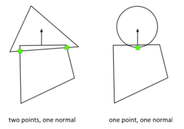

3. Distance

    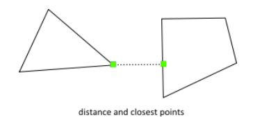

4. Time of Impact
    `b2TimeOfImpact`用于计算两个移动物体发生碰撞的时间，称为`TOI(time of impact)`，该函数的主要
    目的就是穿透避免（tunnel prevention）

    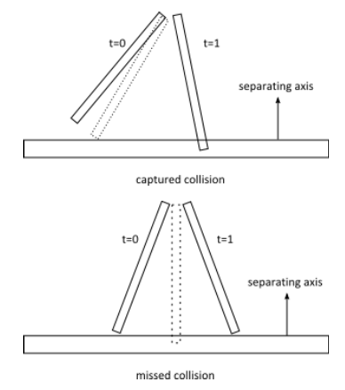

`动态树 Dynamic Tree`

类b2DynamicTree用于有效组织大量shapes，其不关心也不知道shapes，

而是操作AABBs (axis-aligned bounding boxes)

`广义碰撞检测－Broad-phase`

碰撞处理有狭义和广义之分，狭义方式两两进行交点计算，N个Shape，需要执行N * N / 2次。

`b2BroadPhase`类使用动态树，大大减少狭义方式的计算量

## 二、Dynamics Module

最复杂的部分，包含以下类：

* fixture class
* rigid body class
* contact class
* joint classes
* world class
* listener classes

### 2.1 Bodies

> Bodies have position and velocity. You can apply forces, torques, and impulses to bodies. 
> Bodies can be static, kinematic, or dynamic.

位置和加速度，可应用力、扭力和脉冲于其上。

`类型`：
b2_staticBody
b2_kinematicBody
b2_dynamicBody

> Box2D使用CCD碰撞检测，避免物体穿透。计算碰撞的第一次TOI，物体会被先移动到该TOI，
> 再行计算剩余sub step。一个step可能会分为多个sub step

不过CCD耗损性能，dynamic物体的默认是不启用的。没有CCD，高速射击的子弹可能会穿透砖墙。

    bodyDef.bullet = true;

以上开启dynamic body的CCD属性。只对dynamic body有效。

`Position and Angle`

`Activation`

    bodyDef.active = true;

希望物体创建以后，但不参与碰撞。可以先创建一个inactive的物体，然后再激活之，用以上方法。

`User Data`

用户hook，可以自己设定数据。C++里面，它是一个void型指针。

    b2BodyDef bodyDef;
    bodyDef.userData = &myActor;

`Body Factory - 工厂`

物体的创建和销毁都有b2World来完成，如下：

    b2Body * dynamicBody = myWorld -> CreateBody(&bodyDef);
    ... do stuff ...
    myWorld -> Destroy(dynamicBody);
    dynamicBody = NULL;

避免使用new或者malloc创建body，那样不work

body销毁时，依附其上的fixtures和joints自动销毁。

`使用物体`

> After creating a body, there are many operations you can perform on the body. These include setting 
> mass properties, accessing position and velocity, applying forces, and transforming points and vectors.

1. mass properties:
    
    mass ( scalar ), center of mass ( 2-vector ), rotational inertia ( scalar )

    质量，中心，旋转惯性

    静态物体，质量和转动惯性设置为0.

        void SetMassData(const b2MassData * data);

        void ResetMassData();

        float32 GetMass() const;
        float32 GetInertia() const;
        const b2Vec2& GetLocalCenter() const; 
        void GetMassData(b2MassData* data) const;

2. 状态信息

        void SetType(b2BodyType type);
        b2BodyType GetType();

        void SetBullet(bool flag); 
        bool IsBullet() const;

        void SetSleepingAllowed(bool flag); 
        bool IsSleepingAllowed() const;

        void SetAwake(bool flag); 
        bool IsAwake() const;

        void SetActive(bool flag); 
        bool IsActive() const;

        void SetFixedRotation(bool flag); 
        bool IsFixedRotation() const;

3. 位置与速度

        bool SetTransform(const b2Vec2& position, float32 angle);
        const b2Transform& GetTransform() const; 
        const b2Vec2& GetPosition() const; 
        float32 GetAngle() const;

        const b2Vec2& GetWorldCenter() const; 
        const b2Vec2& GetLocalCenter() const;

### 2.2 Fixtures

> Box2D provides the b2Fixture class to attach shapes to bodies

一个物体拥有零个或多个装置，拥有多个装置的物体叫做组合物体。

fixture包含以下内容：
* a single shape
* broad-phase proxies
* density, friction, and restitution
* collision filtering flags
* back pointer to the parent body
* user data
* sensor flag

`fixture创建：`

    b2FixtureDef fixtureDef; 
    fixtureDef.shape = &myShape;
    fixtureDef.density = 1.0f;
    b2Fixture* myFixture = myBody->CreateFixture(&fixtureDef);

> the fixture will automatically be destroyed when the parent body is destroyed.
> You can destroy a fixture on the parent body. You may do this to model a breakable object. 

    myBody->DestroyFixture(myFixture);

`Density－密度：`

> The fixture density is used to `compute the mass properties` of the parent body. 
> The density can be zero or positive. You should generally use similar densities for 
> all your fixtures. This will improve stacking stability.

    fixture->SetDensity(5.0f);
    body->ResetMassData();
   
物体质量不会改变，必须调用ResetMassData()。 

`Friction - 摩擦力：`

模拟现实中的相对滑动，支持静摩擦和滑动摩擦。

> Friction is simulated accurately in Box2D and the friction strength is proportional 
> to the normal force (this is called Coulomb friction). 

Coulomb friction - 库仑摩擦

一般为`[0, 1]`

计算两个shape之间的摩擦力时，Box2D会综合考虑两者的父fixture的摩擦系数，按以下方式计算：

    float32 friction;
    friction = sqrtf( fixtureA->friction * fixtureB->friction );

如果一个表面的摩擦系数为0，则它们之间没有摩擦力。

可以覆盖该默认计算方式，通常在`b2ContactListener回调`中，使用`b2Contact::SetFriction`来改变。

`Restitution`

用于对象反弹。通常取值[0, 1]，取值0，为非弹性碰撞（inelastic collision），取值大于0，为弹性碰撞。

restitution使用以下公式计算：

    float32 restitution;
    restitution = b2Max( fixtureA->restitution, fixtureB->restitution );

覆盖方式类似friction，使用`b2Contact::SetRestitution`

当速度很小的情况，会进行非弹性碰撞，这个取决于`b2_velocityThreshold`

`Filtering`

> Collision filtering allows you to prevent collision between fixtures.

支持`16种碰撞类型`。

可以设置fixture属于哪种类型的碰撞，也可以设置fixture可以与哪些类型的对象产生碰撞。

比如多人游戏里，玩者之间，怪兽之间不会碰撞，玩者和怪兽之间会产生碰撞。

    playerFixtureDef.filter.categoryBits = 0x0002;
    monsterFixtureDef.filter.categoryBits = 0x0004; 
    playerFixtureDef.filter.maskBits = 0x0004; 
    monsterFixtureDef.filter.maskBits = 0x0002;

    uint16 catA = fixtureA.filter.categoryBits; 
    uint16 maskA = fixtureA.filter.maskBits; 
    uint16 catB = fixtureB.filter.categoryBits; 
    uint16 maskB = fixtureB.filter.maskBits;

    if ((catA & maskB) != 0 && (catB & maskA) != 0) {
      // fixtures can collide
    }

碰撞组，正数组索引的fixture总是碰撞，负数组索引的总是不碰撞。
碰撞组索引用于一些相关的物体，比如自行车部件。

    fixture1Def.filter.groupIndex = 2; 
    fixture2Def.filter.groupIndex = 2; 
    fixture3Def.filter.groupIndex = -8; 
    fixture4Def.filter.groupIndex = -8

以上例子，fixture1和fixture2碰撞，fixture3和fixture4不碰撞。

组索引不一致的对象间按照碰撞类型和mask bits进行碰撞。换句话说，组索引的优先级
高于碰撞类型和mask bits。

其他一些需要引起注意的碰撞过滤，列出如下：

* 静态物体的fixture只能与动态物体碰撞
* kinematic物体的fixture只能与动态物体碰撞
* 同一物体上的fixture不碰撞
* 可以选择开启／关闭关节点相连的物体之间的fixture的碰撞

    b2Fixture::GetFilterData()
    b2Fixture::SetFilterData()

`Sensors - 感应器`

> A sensor is a fixture that detects collision but does not produce a response.

比如有时我们需要知道两个不产生碰撞的fixture什么时候重叠。

可讲任何fixture标示为sensor，sensor可以是static, kinematic, or dynamic的。

和Contact(接触)有关，感应器仅当至少有一个动态物体才会生成contact，所以当kinematic-kinematic,
kinematic-static, static-static情况下，我们获取不到contact。

获取感应器状态的方法：

    b2Contact::IsTouching()
    b2ContactListener::BeginContact()
    b2ContactListener::EndContact()
    

### 2.3 Joints

`Joint Factory`

使用world提供的方法创建和销毁，不要自己new或者malloc

    b2RevoluteJointDef jointDef; 
    jointDef.bodyA = myBodyA; 
    jointDef.bodyB = myBodyB;
    jointDef.anchorPoint = myBodyA->GetCenterPosition();

    b2RevoluteJoint* joint = (b2RevoluteJoint*)myWorld->CreateJoint(&jointDef); 

    ... do stuff ...

    myWorld->DestroyJoint(joint);
    joint = NULL;

> Caution: Joints are destroyed when an attached body is destroyed.

`使用Joint`

模拟过程中可能joint创建以后，到被销毁，都不再被使用，但是其包含很多有用数据，帮助
完成更丰富的模拟过程。

首先，可以获取bodies， anchor points，以及user data

    b2Body* GetBodyA();
    b2Body* GetBodyB();
    b2Vec2 GetAnchorA();
    b2Vec2 GetAnchorB();
    void* GetUserData();

> You can use reaction forces to break joints or trigger other game events. 

    b2Vec2 GetReactionForce(); 
    float32 GetReactionTorque();

`Distance Joint`

距离关节

> One of the simplest joint is a distance joint which says that the distance between 
> two points on two bodies must be constant. 

分别存在于两个物体上的两个点之间的距离是定值。

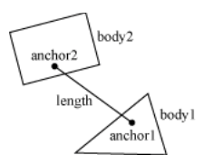

    b2DistanceJointDef jointDef;
    jointDef.Initialize(myBodyA, myBodyB, worldAnchorOnBodyA, worldAnchorOnBodyB); 
    jointDef.collideConnected = true;

通过改变频率（frequency）和阻尼率（damping ratio），可以讲距离关节变成
软关节，就像`spring-damper(弹簧阻尼)`

    jointDef.frequencyHz = 4.0f; 
    jointDef.dampingRatio = 0.5f;

注意：
1. frequency < step frequency / 2，比如step frequency为60Hz，那么需要小于30Hz。
    原因是Nyquist frequency，奈奎斯特频率
2. 阻尼率一般取值[0,1]，当然可以大于1。当1的时候，是一个关键值，所有的震动都消失了(all oscillations
    should vanish)。

`Revolute joint`

旋转关节让两个物体共享一个锚点（anchor point），通常叫做hinge point

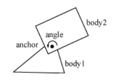

两个物体只有单一的角度自由。

需要提供两个物体和一个锚点，初始化函数默认物体已经在正确的位置。

    b2RevoluteJointDef jointDef;
    jointDef.Initialize(myBodyA, myBodyB, myBodyA->GetWorldCenter());

以上代码将两个物体用其中一个物体的重心作为铰链点连接起来。

如果bodyB按CCW旋转，那么关节角度（joint angle）就是正的，关节角度如果Box2D规定，都是按
弧度为单位，关节角度使用`Initialize()`创建时，默认为1，不管两个物体当前的旋转位置。

通过设置关节角度限制，来控制关节角度，限制范围应该包含0值，否则关节会lurch（摇晃）。

关节马达允许我们设置关节速度（角度的时间衍生品），可以正数也可以负数。马达可以有
无穷大力，但通常不取无穷大力，原因是：

> "What happens when an irresistible force meets an immovable object?"

所以，可以提供一个最大扭力值。关节马达可以保持某个速度，除非需要的扭力超过马达的最大扭力。
如果超过了，那么关节会慢下来，甚至反转。

可以使用关节马达来模拟`关节摩擦力`，只需将关节速度设置为0，将最大扭力设置为一个有意义的较小的值。
看以下例子：

    b2RevoluteJointDef jointDef;

    jointDef.Initialize(bodyA, bodyB, myBodyA->GetWorldCenter()); 
    jointDef.lowerAngle = -0.5f * b2_pi; 
    // -90 degrees jointDef.upperAngle = 0.25f * b2_pi; 
    // 45 degrees jointDef.enableLimit = true;

    jointDef.maxMotorTorque = 10.0f;
    jointDef.motorSpeed = 0.0f;
    jointDef.enableMotor = true;

获取关节的角度、速度和马达扭力等参数：

    float32 GetJointAngle() const; 
    float32 GetJointSpeed() const; 
    float32 GetMotorTorque() const;

更新关节马达参数：

    void SetMotorSpeed(float32 speed); 
    void SetMaxMotorTorque(float32 torque);

有趣的能力，让关节速度按正弦波变化，来回移动，或者任何你需要的函数改变其关节速度：

    ... Game Loop Begin ... 
    myJoint->SetMotorSpeed(cosf(0.5f * time));
    ... Game Loop End ...

> You can also use joint motors to track a desired joint angle

    ... Game Loop Begin ...
    float32 angleError = myJoint->GetJointAngle() - angleTarget; 
    float32 gain = 0.1f;
    myJoint->SetMotorSpeed(-gain * angleError);
    ... Game Loop End ...

`Prismatic joint`

移动关节允许两个物体沿着指定轴线(axis)相对移动，它不允许相对转动。

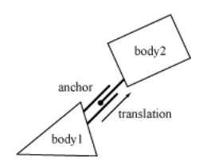

移动关节的定义与转动关节类似，只需用移动(translation)替换角度(angle)，
用力(force)替换扭力(torque)。

    b2PrismaticJointDef jointDef;
    b2Vec2 worldAxis(1.0f, 0.0f);
    jointDef.Initialize(myBodyA, myBodyB, myBodyA->GetWorldCenter(), worldAxis); 
    jointDef.lowerTranslation = -5.0f;
    jointDef.upperTranslation = 2.5f;
    jointDef.enableLimit = true;
    jointDef.maxMotorForce = 1.0f;
    jointDef.motorSpeed = 0.0f;
    jointDef.enableMotor = true;

旋转关节的轴线从屏幕穿出，是隐式的；而移动关节的轴线需要显式给出，平行于屏幕，固定于两个
物体，沿着它们的移动方向。

与旋转关节类似，创建时，其translation为0，需要确保translation的范围包含0值。

以下是使用移动关节的一些方法：

    float32 GetJointTranslation() const;
    float32 GetJointSpeed() const; 
    float32 GetMotorForce() const; 
    void SetMotorSpeed(float32 speed); 
    void SetMotorForce(float32 force);

`Pulley Joint`

> 滑轮关节用于创建一个理想化滑轮。

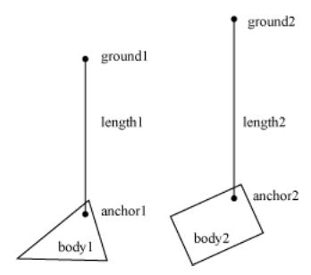

滑轮关节将两个物体连接到ground，同时相互连接，一个上去，另一个下来。滑轮线长度保持初始设置，如：

    length1 + length2 == constant

可以提供比率来模拟滑轮索具，这会使的一边的绳子比另一边伸展得快，同时一边的受力比另一边的受力小。
用这种方式，可以创建机械杠杆（mechanical leverage）。

    length1 + ratio * length2 == constant

当一边的绳索`长度为0时`，绳长公式就出问题了，需要配置碰撞形状避免这种情况。

    b2Vec2 anchor1 = myBody1->GetWorldCenter(); 
    b2Vec2 anchor2 = myBody2->GetWorldCenter(); 
    b2Vec2 groundAnchor1(p1.x, p1.y + 10.0f); 
    b2Vec2 groundAnchor2(p2.x, p2.y + 12.0f); 
    float32 ratio = 1.0f;

    b2PulleyJointDef jointDef;
    jointDef.Initialize(myBody1, myBody2, groundAnchor1, groundAnchor2, anchor1,
    anchor2, ratio);

以下方法可获取状态：

    float32 GetLengthA() const; 
    float32 GetLengthB() const;

`Gear Joint`

齿轮关节`只能`连接旋转和（或）移动关节。

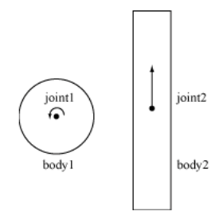

同样有比率，但该比率可以为负数。

需要记住的是，

> Also keep in mind that when one joint is a revolute joint (angular) and the other joint  
> is prismatic (translation), and then the gear ratio will have units of length or one over length.

    coordinate1 + ratio * coordinate2 == constant

以下代码定义一个齿轮关节：

    b2GearJointDef jointDef;
    jointDef.bodyA = myBodyA;
    jointDef.bodyB = myBodyB; 
    jointDef.joint1 = myRevoluteJoint; 
    jointDef.joint2 = myPrismaticJoint; 
    jointDef.ratio = 2.0f * b2_pi / myLength;

另，必须在转动或移动关节销毁前将齿轮关节销毁，否则程序可能crash。

`Mouse Joint`

鼠标关节用于测试床上用鼠标操作物体。

有以下定义属性：
* a target point
* maximum force: 用于避免多个动态物体互动时出现violent reactions
* frequency
* damping ratio
后两者用于创建弹簧阻尼效果

在游戏中用鼠标控制物体的精确定位，比较困难，这时还是使用kinematic bodies比较好。

`Wheel Joint`

轮子关节将bodyB的一个点限制在bodyA的一条线上，常用于汽车轮子模拟。

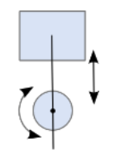

`Weld Joint`

...

`Rope Joint`

...

`Friction Joint`

...

`Motor Joint`

...

### 2.4 Contacts

todo

## 三、Wrold Class

大部分与Box2D的交互都是通过b2World类

    b2World* myWorld = new b2World(gravity, doSleep);
    ... do stuff ...
    delete myWorld;

`模拟`

    float32 timeStep = 1.0f / 60.f;
    int32 velocityIterations = 10;
    int32 positionIterations = 8;
    myWorld->Step(timeStep, velocityIterations, positionIterations);

> The iteration count controls how many times the constraint solver sweeps over all the 
> contacts and joints in the world. More iteration always yields a better simulation. 
> But don't trade a small time step for a large iteration count. 60Hz and 10 iterations 
> is far better than 30Hz and 20 iterations.

`b2World::ClearForces()`

    myWorld->ClearForces();

> This lets you take multiple sub-steps with the same force field

`Exploring the world`

如何安全删除body：

    b2Body* node = myWorld->GetBodyList(); 
    while (node)
    {
        b2Body* b = node;
        node = node->GetNext();
        GameActor* myActor = (GameActor*)b->GetUserData(); 
        if (myActor->IsDead())
        {
            myWorld->DestroyBody(b);
        } 
    }

解决同时删除多个body的问题：

    b2Body* node = myWorld->GetBodyList(); 
    while (node)
    {
        b2Body* b = node;
        node = node->GetNext();
        GameActor* myActor = (GameActor*)b->GetUserData(); 
        if (myActor->IsDead())
        {
            bool otherBodiesDestroyed = GameCrazyBodyDestroyer(b); 
            if (otherBodiesDestroyed)
            {
                node = myWorld->GetBodyList(); 
            }
        } 
    }

`AABB Queries`

以下代码找出会与指定AABB相交的所有fixtures，并唤醒与这些fixture关联的body：

    class MyQueryCallback : public b2QueryCallback
    { 
    public:
        bool ReportFixture(b2Fixture* fixture)
        {
            b2Body* body = fixture->GetBody(); 
            body->SetAwake(true);

            // Return true to continue the query.
            return true;
        }
    }; 

    ...

    MyQueryCallback callback;
    b2AABB aabb;
    aabb.lowerBound.Set(-1.0f, -1.0f); 
    aabb.upperBound.Set(1.0f, 1.0f); 
    myWorld->Query(&callback, aabb);

`Ray Casts`

> You control the continuation of the ray cast by returning a fraction. Returning a 
> fraction of zero indicates the ray cast should be terminated. A fraction of one indicates 
> the ray cast should continue as if no hit occurred. 

    // This class captures the closest hit shape.
    class MyRayCastCallback : public b2RayCastCallback {

    public:

        MyRayCastCallback()
        {
            m_fixture = NULL;
        }

        float32 ReportFixture(b2Fixture* fixture, const b2Vec2& point,
            const b2Vec2& normal, float32 fraction)
        {
            m_fixture = fixture;
            m_point = point; 
            m_normal = normal; 
            m_fraction = fraction; 
            return fraction;
        }

        b2Fixture* m_fixture;
        b2Vec2 m_point;
        b2Vec2 m_normal;
        float32 m_fraction;
    };

    MyRayCastCallback callback;

    b2Vec2 point1(-1.0f, 0.0f);
    b2Vec2 point2(3.0f, 1.0f); 
    myWorld->RayCast(&callback, point1, point2);

> You may also return of fraction of -1 to filter the fixture. Then the ray 
> cast will proceed as if the fixture does not exist.

todo
