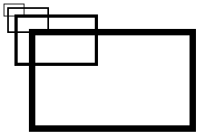
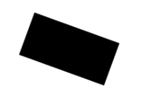

# Canvas

> The HTML5 `<canvas>` tag is used to draw graphics, on the fly, via scripting (usually JavaScript). 

`W3C Schools Ref:` http://www.w3schools.com/tags/ref_canvas.asp

## Small Canvas Lib below

* `getContext`: function()
* `getTextWidth`: function(text)
* `getWidth`: function()
* `getHeight`: function()

* `strokeStyle`: function(s)

    属性，设置或者返回用于笔触的颜色、渐变或模式。

        context.strokeStyle=color|gradient|pattern;

    `color:`

        var c=document.getElementById("myCanvas");
        var ctx=c.getContext("2d");
        ctx.strokeStyle="#0000ff";
        ctx.strokeRect(20,20,150,100); 

    `gradient:`

        var c=document.getElementById("myCanvas");
        var ctx=c.getContext("2d");

        var gradient=ctx.createLinearGradient(0,0,170,0);
        gradient.addColorStop("0","magenta");
        gradient.addColorStop("0.5","blue");
        gradient.addColorStop("1.0","red");

        // 用渐变进行填充
        ctx.strokeStyle=gradient;
        ctx.lineWidth=5;
        ctx.strokeRect(20,20,150,100);

* `fillStyle`: function(s)
    
    设置或返回用于填充绘画的颜色、渐变或模式。

        context.fillStyle = color | gradient | pattern;

    1. `color`：css颜色值，默认#000000
    2. `gradient`: 渐变对象（linear or radial） 
    3. `pattern`: pattern对象 

* `lineCap`: function(lc)
* `lineJoin`: function(lj)
* `lineWidth`: function(lw)

* `rect`: function(x, y, width, height)
* `fillRect`: function(x, y, width, height)
* `strokeRect`: function(x, y, width, height)
* `clearRect`: function(x, y, width, height)

* `fill`: function()
* `stroke`: function()
* `beginPath`: function()
* `closePath`: function()
* `moveTo`: function(x, y)
* `lineTo`: function(x, y)
* `clip`: function()
* `arc`: function(x, y, r, sAngle, eAngle, counterclickwise)

    `圆弧绘制`

    

    * Center: arc(`100, 75`, 50, 0*Math.PI, 1.5*Math.PI)
    * Radius: arc(100, 75, `50`, 0*Math.PI, 1.5*Math.PI)
    * Start angle:  arc(100, 75, 50, `0*Math.PI`, 1.5*Math.PI)
    * End angle:  arc(100, 75, 50, 0*Math.PI, `1.5*Math.PI`) 

* `quadraticCurveTo`: function(cpx, cpy, x, y)

    `1个控制点`

    

    * Start point: moveTo(`20, 20`) 
    * Control point: quadraticCurveTo(`20, 100`, 200, 20)
    * End point: quadraticCurveTo(20, 100, `200, 20`)

* `bezierCurveTo`: function(cp1x, cp1y, cp2x, cp2y, x, y)

    `2个控制点`

    

    * Start point: moveTo(`20, 20`) 
    * Control point 1: bezierCurveTo(`20, 100`, 200, 100, 200, 20)
    * Control point 2: bezierCurveTo(20, 100, `200, 100`, 200, 20)
    * End point: bezierCurveTo(20, 100, 200, 100, `200, 20`)

* `arcTo`: function(x1, y1, x2, y2, r)
    
    `两条切线间绘制圆弧：`
    The arcTo() method creates an arc/curve between two tangents(切线) on the canvas.

    以`@[style="color:#ff0; background:#000"](200, 100)`为控制点，
    从`@[style="color:#0f0; background:#000"](100, 100)`
    到`@[style="color:#0f0; background:#000"](200, 200)`绘制一条圆弧，半径分别为100，50， 150，
    如下图所示：

    1. 目标点刚好为切点 

        

    2. 半径太小，圆弧不过目标点 

        

    3. 半径太大，圆弧不过目标点 

        

* `isPointInPath`: function(x, y)

    如果指定点位于当前路径中，返回true，否则false：

        var c=document.getElementById("myCanvas");
        var ctx=c.getContext("2d");
        ctx.rect(20,20,150,100);
        if (ctx.isPointInPath(20,50)){
            ctx.stroke();
        }

* `scale`: function(scaleWidth, scaleHeight)

    

    `例子：`绘制一个矩形；放大到 200%，再次绘制矩形；放大到 200%，
    然后再次绘制矩形；放大到 200%，再次绘制矩形：

        var c=document.getElementById("myCanvas");
        var ctx=c.getContext("2d");
        ctx.strokeRect(5,5,25,15);
        ctx.scale(2,2);
        ctx.strokeRect(5,5,25,15);
        ctx.scale(2,2);
        ctx.strokeRect(5,5,25,15);
        ctx.scale(2,2);
        ctx.strokeRect(5,5,25,15);

* `rotate`: function(angle)

    

    旋转坐标系，比如旋转20度：

        var c=document.getElementById("myCanvas");
        var ctx=c.getContext("2d");
        ctx.rotate(20*Math.PI/180);
        ctx.fillRect(50,20,100,50);        

* `translate`: function(tx, ty)
    
    平移

* `transform`: function(a, b, c, d, e, f)

    

    变换矩阵会叠加，不同于`setTransform`的重置

    参考： http://sumsung753.blog.163.com/blog/static/146364501201281311522752/

    http://shawphy.com/2011/01/transformation-matrix-in-front-end.html

    `平移`：

        matrix(1, 0, 0, 1, tx, ty)

        x' = 1x + 0y + tx = x + tx
        y' = 0x + 1y + ty = x + ty 

    等价于：
    
        translate(tx, ty)

    `缩放`：

        matrix(sx, 0, 0, sy, 0, 0)

        x' = sx * x + 0 * y + 0 = sx * x
        y' = 0 * x + sy * y + 0 = sy * y

    等价于：
    
        scale(sx, sy)

    `旋转`：

        matrix(cosθ, sinθ, -sinθ, cosθ, 0, 0)

        x' = x * cosθ - y * sinθ + 0 = x * cosθ - y * sinθ
        y' = x * sinθ + y * cosθ + 0 = x * sinθ + y * cosθ
    
    等价于：
    
        rotate(θ)

    `切变`：

        matrix(1, tan(θy), tan(θx), 1, 0, 0)

        x' = x + y * tan(θx)
        y' = x * tan(θy) + y

    θx和θy分别代表往x轴正方向和往y轴正方向倾斜的角度，两者是相互独立的。

    比如：

        matrix(1, 0, tan(45deg), 1, 0, 0)

        x' = x + y * tan(45deg)
        y' = y

    表示向x轴倾斜45度。

    `镜像反射`：todo

* `setTransform`: function(a, b, c, d, e, f)

    重置并重新创建新的变换矩阵

* `font`: function(cssFont)

    `CSS Font:` 

        font-style font-variant font-weight font-size/line-height font-family

    `举例：`

        italic small-caps bold 12px arial,sans-serif
        normal normal normal  

    `关于font-variant：`

    设置小型大写字母的字体显示文本，所有小写字母会被转换为答谢，但是相比其余字幕，尺寸更小。

        normal | small-caps | inherit

    `关于font-style：`

        normal | italic | oblique | inherit

    `关于font-weight：`

        normal | bold | bolder | lighter | inherit | 100 - 900

        400 = normal
        700 = bold

* `textAlign`: function(align)
* `textBaseline`: function(align)
* `fillText`: function(text, x, y, maxWidth)
* `strokeText`: function(text, x, y, maxWidth)
* `globalAlpha`: function(alpha)
* `globalCompositeOperation`: function(gco)

* `save`: function()
* `restore`: function()
* `width`: function(w)
* `height`: function(h)
* `css`: function()

## createPattern

`语法：`

    context.createPattern(image,"repeat|repeat-x|repeat-y|no-repeat");

`例子：`

    var c=document.getElementById("myCanvas");
    var ctx=c.getContext("2d");
    var img=document.getElementById("lamp");
    var pat=ctx.createPattern(img,"repeat");
    ctx.rect(0,0,150,100);
    ctx.fillStyle=pat;
    ctx.fill();

## createLinearGradient

`语法：`

    context.createLinearGradient(x0,y0,x1,y1);

x0,y0为渐变起始点，x1,y1为渐变结束点。

`例子：`

    var c=document.getElementById("myCanvas");
    var ctx=c.getContext("2d");
    var my_gradient=ctx.createLinearGradient(0,0,0,170);
    my_gradient.addColorStop(0,"black");
    my_gradient.addColorStop(1,"white");
    ctx.fillStyle=my_gradient;
    ctx.fillRect(20,20,150,100);

## createRadialGradient 

`语法：`

    context.createRadialGradient(x0,y0,r0,x1,y1,r1);

## drawImage

1. 画布上定位图像

        context.drawImage(img,x,y);

2. 画布上定位图像，并规定图像的宽度和高度

        context.drawImage(img,x,y,width,height);

3. 剪切图像，并在画布上定位被剪切的部分

        context.drawImage(img,sx,sy,swidth,sheight,x,y,width,height);

## globalCompositeOperation

该属性设置或返回如何将一个源（新的）图像绘制到目标（已有）的图像上。

可取以下值：

* source-over
* source-atop
* source-in
* source-out
* destination-over
* destination-atop
* destination-in
* destination-out
* lighter
* darker
* copy
* xor

对应效果如下：

