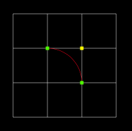
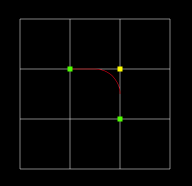
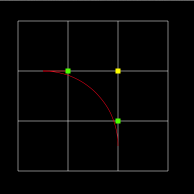

# Canvas

> The HTML5 `<canvas>` tag is used to draw graphics, on the fly, via scripting (usually JavaScript). 

`W3C Schools Ref:` http://www.w3schools.com/tags/ref_canvas.asp

## Small Canvas Lib below

* getContext: function()
* getTextWidth: function(text)
* getWidth: function()
* getHeight: function()

* strokeStyle: function(s)
* fillStyle: function(s)
* lineCap: function(lc)
* lineJoin: function(lj)
* lineWidth: function(lw)

* rect: function(x, y, width, height)
* fillRect: function(x, y, width, height)
* strokeRect: function(x, y, width, height)
* clearRect: function(x, y, width, height)

* fill: function()
* stroke: function()
* beginPath: function()
* closePath: function()
* moveTo: function(x, y)
* lineTo: function(x, y)
* clip: function()
* arc: function(x, y, r, sAngle, eAngle, counterclickwise)

    `圆弧绘制`

    

    * Center: arc(`100, 75`, 50, 0*Math.PI, 1.5*Math.PI)
    * Radius: arc(100, 75, `50`, 0*Math.PI, 1.5*Math.PI)
    * Start angle:  arc(100, 75, 50, `0*Math.PI`, 1.5*Math.PI)
    * End angle:  arc(100, 75, 50, 0*Math.PI, `1.5*Math.PI`) 

* quadraticCurveTo: function(cpx, cpy, x, y)

    `1个控制点`

    

    * Start point: moveTo(`20, 20`) 
    * Control point: quadraticCurveTo(`20, 100`, 200, 20)
    * End point: quadraticCurveTo(20, 100, `200, 20`)

* bezierCurveTo: function(cp1x, cp1y, cp2x, cp2y, x, y)

    `2个控制点`

    

    * Start point: moveTo(`20, 20`) 
    * Control point 1: bezierCurveTo(`20, 100`, 200, 100, 200, 20)
    * Control point 2: bezierCurveTo(20, 100, `200, 100`, 200, 20)
    * End point: bezierCurveTo(20, 100, 200, 100, `200, 20`)

* arcTo: function(x1, y1, x2, y2, r)
    
    `两条切线间绘制圆弧：`
    The arcTo() method creates an arc/curve between two tangents(切线) on the canvas.

    以`@[style="color:#ff0; background:#000"](200, 100)`为控制点，
    从`@[style="color:#0f0; background:#000"](100, 100)`
    到`@[style="color:#0f0; background:#000"](200, 200)`绘制一条圆弧，半径分别为100，50， 150，
    如下图所示：

    1. 目标点刚好为切点 

        

    2. 半径太小，圆弧不过目标点 

        

    3. 半径太大，圆弧不过目标点 

        

* isPointInPath: function(x, y)

* scale: function(scaleWidth, scaleHeight)
* rotate: function(angle)
* translate: function(x, y)
* transform: function(a, b, c, d, e, f)
* setTransform: function(a, b, c, d, e, f)

* font: function(cssFont)
* textAlign: function(align)
* textBaseline: function(align)
* fillText: function(text, x, y, maxWidth)
* strokeText: function(text, x, y, maxWidth)
* globalAlpha: function(alpha)
* globalCompositeOperation: function(gco)

* save: function()
* restore: function()
* width: function(w)
* height: function(h)
* css: function()
