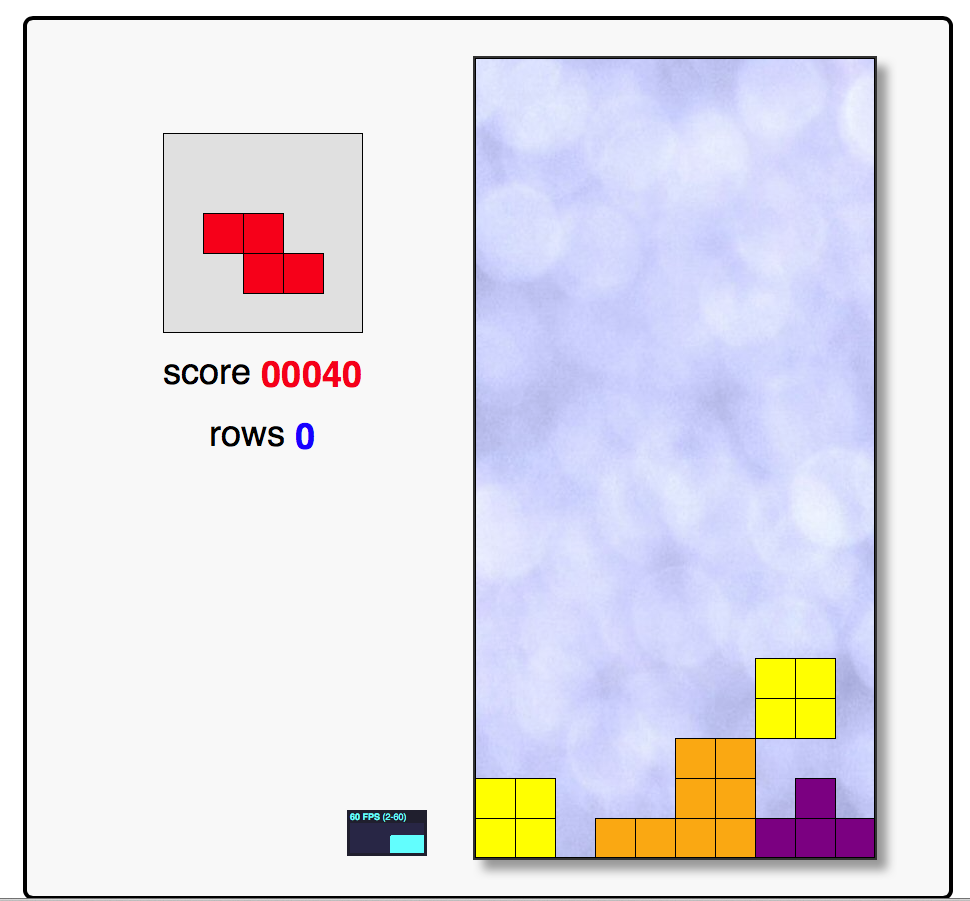
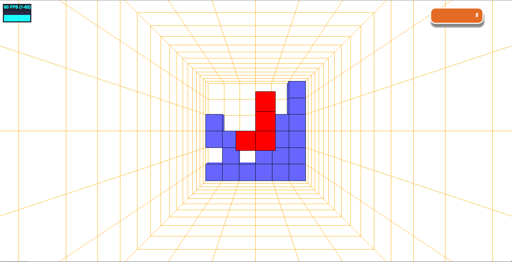
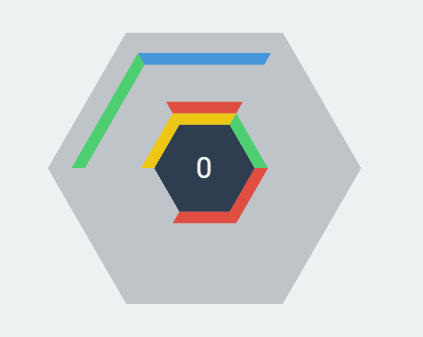

# h5 games

## Tetris

### Jake版本

> 2D Tetris implementation in Canvas 

`试玩URL:` <a href="http://codeincomplete.com/projects/tetris">Tetris</a>

`GITHUB:` <a href="https://github.com/jakesgordon/javascript-tetris">javascript-tetris</a>

### Fredek版本

> 3D Tetris implementation in WebGL 

`试玩URL:` <a href="http://fridek.github.io/Threejs-Tetris/">Tetris</a>

`GITHUB:` <a href="https://github.com/fridek/Threejs-Tetris">Threejs-Tetris</a>

## hextris

> 受Tetris启发，开发的六边形消除游戏

`试玩URL:` <a href="http://hextris.io">http://hextris.io</a>

`GITHUB:` <a href="https://github.com/Hextris/hextris">https://github.com/Hextris/hextris</a>

## 全民寻找北京城

`试玩URL:` <a href="http://file1.wisetravel.cn/file/games/find_bj/?from=timeline&isappinstalled=0">`打开`</a>

