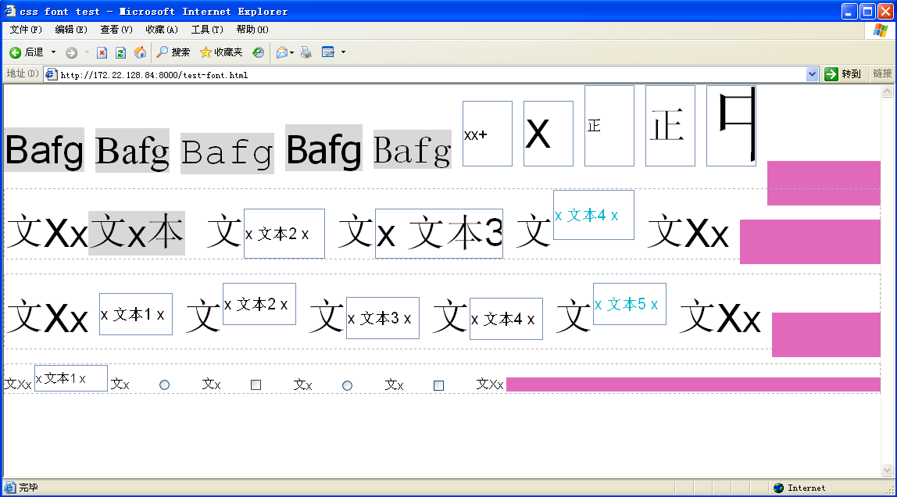

# css fonts

> css字体

## Resources

* fonts.css: <http://zenozeng.github.io/fonts.css/>
* fontmin: <http://ecomfe.github.io/fontmin/>
* css-font-stack: <http://www.cssfontstack.com> 提供不同`英文字体`的安装比率，提出`web-safe-font`的概念
    * Sans-serif: `Arial`
    * Serif: `Times New Roman, Georgia`
    * Monospaced: `Courier New`
* List of typefaces included with Microsoft Windows: <https://en.wikipedia.org/wiki/List_of_typefaces_included_with_Microsoft_Windows>
* `Icon-font`图标字体的四类制作方法 <http://www.jianshu.com/p/095eb298ed18>
* `百度图标库` <http://fontstore.baidu.com>
* 阿里妈妈矢量图标库 <http://www.iconfont.cn/plus>
* 170403 消灭豆腐块！谷歌联合Adobe发布全新开源汉字字体 <https://github.com/googlei18n/noto-fonts>
* 170625 给自己的Fonts教程 <https://segmentfault.com/a/1190000009920615>

## tips

* 字体选择
    1. 先选择`字体风格`：`衬线字体／非衬线字体／cursive／fantasy`
    2. `优先`声明`英文字体`，因为绝大部分中文字体都包含英文字母和数字，但是大多数中文字体中英文和数字部分都不是特别漂亮，所以先声明英文字体
    3. 再列出中文字体
* `font-family`兼容性写法

    * 最安全：

            font-family: arial, sans-serif;

    * `加粗雅黑`，兼容PC各OS的一种优化字体（xp下黑体加粗效果不好，反而SimSun-宋体效果更好）：

            font-family: Helvetica, Arial, "Microsoft YaHei", SimSun, sans-serif;

    * PC端常用字体fallback的例子：

            font-family: -apple-system, BlinkMacSystemFont, "San Francisco", "Helvetica Neue", Helvetica, Arial, "PingFang SC", "Hiragino Sans GB", "Microsoft YaHei", "WenQuanYi Microhei", sans-serif;

    * 移动端常用字符fallback的例子：

            font-family: "\5FAE\8F6F\96C5\9ED1", Helvetica; /* 手机腾讯 */
            font-family: 'STHeiti','Microsoft YaHei',Helvetica,Arial,sans-serif; /* 手机网易 */

* font-variant

## css-font

### shortcut

> `SVW-SHF`

    font-style font-variant font-weight font-size/line-height font-family

`举例：`

    italic small-caps bold 12px arial,sans-serif
    normal normal normal  

### font-variant

设置小型大写字母的字体显示文本，所有小写字母会被转换为大写，但是相比其余字幕，尺寸更小。

    normal | small-caps | inherit

### font-style

    normal | italic | oblique | inherit

### font-weight

    normal | bold | bolder | lighter | inherit | 100 - 900

    400 = normal
    700 = bold

### font-family

    Arial,Times,San-Serif
    SimHei,SimSun,Courier-New

## @font-face

> `css2`定义，可以在浏览器中使用自定义字体

### 语法

语法：

    @font-face { 
        font-family: <a-remote-font-name>; 
        src: <source> [,<source>]*; 
        [font-weight: <weight>]; 
        [font-style: 
    

        Bafg
        Bafg
        Bafg
        Bafg
        Bafg
        <input class="input-a" type="text" value="xx+">
        <input class="input-b" type="text" value="X">
        <input class="input-c" type="text" value="正">
        <input class="input-d" type="text" value="正">
        <input class="input-e" type="text" value="中">
        
    

### 对齐文本框与文本

> `vertical-align: middle` : Align the vertical midpoint of the box with the baseline of the parent box plus half the x-height of the parent.

* `vertical-align`应用于`inline`或`inline-block`的元素，以及`table-cell`元素
* `vertical-align: middle;`的含义是`子元素`box的垂直方向`中线`与`父元素基线 + 父元素x-height / 2` 对齐，该线穿过`父容器小写x`的中心，如下图所示的紫色线条
* `x-height`表示`小写x`的高度，`父`容器`font-size`决定`x-height`
* 子元素box的`高度不足`以容纳内部文本时（子元素高度`小于`line-height为normal时的自然高度），对齐文本无从谈起
* `vertical-align: baseline;` 等价于 `vertical-align: 0px;`，支持正负值，可进行`基于baseline`的上下`微调整`。
* 只通过设置`vertical-align: middle;`很难使input文本框与父容器文本对齐，比如`x 文本2 x`与其左右的`文`就上下不对齐，而`@[style="color:#17becf;"]x 文本4 x`通过设置`vertical-align: 13px;`达到了与父容器文本的对齐
* 我们要求的是子元素的`文本边框`（而不是`文本`）与父容器的文本对齐，从视觉上来说也是有这个倾向
* `span元素`的边框及文本与父容器文本`默认情况`下( baseline )就有不错的`对齐`效果，如下红色文本`文x本`

    @[data-script="html editable"]
    

        文Xx文x本
        文<input class="input-a" type="text" value="x 文本2 x">
        文<input class="input-b" type="text" value="x 文本3 x">
        文<input class="input-c" type="text" value="x 文本4 x">
        文Xx
        
    

### 各类对齐效果

* top对齐，是按照子元素的文本top边框与父容器的文本top边框对齐
* bottom对齐，是按照子元素的文本bottom边框与父容器的文本bottom边框对齐
* 随着`font-size`的变化，不同对齐方式的效果也会发生变化。比如把父容器的font-size改成`20px`，对齐效果会发生变化

    @[data-script="html editable"]
    

        文Xx
        <input class="input-a" type="text" value="x 文本1 x">
        文<input class="input-b" type="text" value="x 文本2 x">
        文<input class="input-c" type="text" value="x 文本3 x">
        文<input class="input-d" type="text" value="x 文本4 x">
        文<input class="input-e" type="text" value="x 文本5 x">
        文Xx
        
    

### 对齐单、复选框与文本

* 使用`vertical-align: middle;`基本上能做到较好的对齐

    @[data-script="html editable"]
    

        文Xx
        <input class="input-a" type="text" value="x 文本1 x">
        文x<input class="input-b" type="radio">
        文x<input class="input-c" type="checkbox">
        <label>文x<input class="input-d" type="radio"></label>
        <label>文x<input class="input-e" type="checkbox"></label>
        文Xx
        
    

### ie6下的效果

* 不支持`inline-block`
* input文本与父容器文本的对齐方式，使用`input的下边框`与父容器文本基线对齐
* 反正`IE6`是一场`噩梦`，幸好现在已经不用考虑它了

见识一下ie6下的效果：
 

## Mac Font

### /System/Library/Fonts

    Apple Braille Outline 6 Dot.ttf
    PingFang.ttc
    SFNSDisplayCondensed-Heavy.otf
    Apple Braille Outline 8 Dot.ttf
    SFCompactDisplay-Black.otf
    SFNSDisplayCondensed-Light.otf
    Apple Braille Pinpoint 6 Dot.ttf
    SFCompactDisplay-Bold.otf
    SFNSDisplayCondensed-Medium.otf
    Apple Braille Pinpoint 8 Dot.ttf
    SFCompactDisplay-Heavy.otf
    SFNSDisplayCondensed-Regular.otf
    Apple Braille.ttf
    SFCompactDisplay-Light.otf
    SFNSDisplayCondensed-Semibold.otf
    Apple Color Emoji.ttc
    SFCompactDisplay-Medium.otf
    SFNSDisplayCondensed-Thin.otf
    Apple Symbols.ttf
    SFCompactDisplay-Regular.otf
    SFNSDisplayCondensed-Ultralight.otf
    AppleSDGothicNeo.ttc
    SFCompactDisplay-Semibold.otf
    SFNSText.ttf
    AquaKana.ttc
    SFCompactDisplay-Thin.otf
    SFNSTextCondensed-Bold.otf
    ArialHB.ttc
    SFCompactDisplay-Ultralight.otf
    SFNSTextCondensed-Heavy.otf
    Avenir Next Condensed.ttc
    SFCompactRounded-Black.otf
    SFNSTextCondensed-Light.otf
    Avenir Next.ttc
    SFCompactRounded-Bold.otf
    SFNSTextCondensed-Medium.otf
    Avenir.ttc
    SFCompactRounded-Heavy.otf
    SFNSTextCondensed-Regular.otf
    Courier.dfont
    SFCompactRounded-Light.otf
    SFNSTextCondensed-Semibold.otf
    GeezaPro.ttc
    SFCompactRounded-Medium.otf
    SFNSTextItalic.ttf
    Geneva.dfont
    SFCompactRounded-Regular.otf
    STHeiti Light.ttc
    HelveLTMM
    SFCompactRounded-Semibold.otf
    STHeiti Medium.ttc
    Helvetica.dfont
    SFCompactRounded-Thin.otf
    Symbol.ttf
    HelveticaNeue.dfont
    SFCompactRounded-Ultralight.otf
    Thonburi.ttc
    HelveticaNeueDeskInterface.ttc
    SFCompactText-Bold.otf
    Times.dfont
    Hiragino Sans GB W3.ttc
    SFCompactText-BoldItalic.otf
    TimesLTMM
    Hiragino Sans GB W6.ttc
    SFCompactText-Heavy.otf
    ZapfDingbats.ttf
    Keyboard.ttf
    SFCompactText-HeavyItalic.otf
    ヒラギノ明朝 ProN W3.ttc
    Kohinoor.ttc
    SFCompactText-Light.otf
    ヒラギノ明朝 ProN W6.ttc
    KohinoorBangla.ttc
    SFCompactText-LightItalic.otf
    ヒラギノ角ゴシック W0.ttc
    KohinoorTelugu.ttc
    SFCompactText-Medium.otf
    ヒラギノ角ゴシック W1.ttc
    LastResort.ttf
    SFCompactText-MediumItalic.otf
    ヒラギノ角ゴシック W2.ttc
    LucidaGrande.ttc
    SFCompactText-Regular.otf
    ヒラギノ角ゴシック W3.ttc
    MarkerFelt.ttc
    SFCompactText-RegularItalic.otf
    ヒラギノ角ゴシック W4.ttc
    Menlo.ttc
    SFCompactText-Semibold.otf
    ヒラギノ角ゴシック W5.ttc
    Monaco.dfont
    SFCompactText-SemiboldItalic.otf
    ヒラギノ角ゴシック W6.ttc
    Noteworthy.ttc
    SFNSDisplay.ttf
    ヒラギノ角ゴシック W7.ttc
    Optima.ttc
    SFNSDisplayCondensed-Black.otf
    ヒラギノ角ゴシック W8.ttc
    Palatino.ttc
    SFNSDisplayCondensed-Bold.otf
    ヒラギノ角ゴシック W9.ttc

### /Library/Fonts

    ACaslonPro-Bold.otf
    Georgia Bold Italic.ttf
    NISC18030.ttf
    ACaslonPro-BoldItalic.otf
    Georgia Bold.ttf
    Nadeem.ttc
    ACaslonPro-Italic.otf
    Georgia Italic.ttf
    NewPeninimMT.ttc
    ACaslonPro-Regular.otf
    Georgia.ttf
    NuevaStd-Bold.otf
    ACaslonPro-Semibold.otf
    GiddyupStd.otf
    NuevaStd-BoldCond.otf
    ACaslonPro-SemiboldItalic.otf
    GillSans.ttc
    NuevaStd-BoldCondItalic.otf
    AGaramondPro-Bold.otf
    Gujarati Sangam MN.ttc
    NuevaStd-Cond.otf
    AGaramondPro-BoldItalic.otf
    GujaratiMT.ttc
    NuevaStd-CondItalic.otf
    AGaramondPro-Italic.otf
    Gurmukhi MN.ttc
    NuevaStd-Italic.otf
    AGaramondPro-Regular.otf
    Gurmukhi Sangam MN.ttc
    OCRAStd.otf
    AdobeArabic-Bold.otf
    Gurmukhi.ttf
    OratorStd-Slanted.otf
    AdobeArabic-BoldItalic.otf
    Herculanum.ttf
    OratorStd.otf
    AdobeArabic-Italic.otf
    HoboStd.otf
    Oriya MN.ttc
    AdobeArabic-Regular.otf
    Hoefler Text Ornaments.ttf
    Oriya Sangam MN.ttc
    AdobeDevanagari-Bold.otf
    Hoefler Text.ttc
    PTMono.ttc
    AdobeDevanagari-BoldItalic.otf
    ITFDevanagari.ttc
    PTSans.ttc
    AdobeDevanagari-Italic.otf
    Impact.ttf
    PTSerif.ttc
    AdobeDevanagari-Regular.otf
    InaiMathi.ttf
    PTSerifCaption.ttc
    AdobeFanHeitiStd-Bold.otf
    Iowan Old Style.ttc
    Papyrus.ttc
    AdobeFangsongStd-Regular.otf
    Kailasa.ttc
    Phosphate.ttc
    AdobeGothicStd-Bold.otf
    Kannada MN.ttc
    PlantagenetCherokee.ttf
    AdobeHebrew-Bold.otf
    Kannada Sangam MN.ttc
    PoplarStd.otf
    AdobeHebrew-BoldItalic.otf
    Kefa.ttc
    PrestigeEliteStd-Bd.otf
    AdobeHebrew-Italic.otf
    Khmer MN.ttc
    Raanana.ttc
    AdobeHebrew-Regular.otf
    Khmer Sangam MN.ttf
    RosewoodStd-Regular.otf
    AdobeHeitiStd-Regular.otf
    Kokonor.ttf
    STIXGeneral.otf
    AdobeKaitiStd-Regular.otf
    KozGoPr6N-Bold.otf
    STIXGeneralBol.otf
    AdobeMingStd-Light.otf
    KozGoPr6N-ExtraLight.otf
    STIXGeneralBolIta.otf
    AdobeMyungjoStd-Medium.otf
    KozGoPr6N-Heavy.otf
    STIXGeneralItalic.otf
    AdobeNaskh-Medium.otf
    KozGoPr6N-Light.otf
    STIXIntDBol.otf
    AdobeSongStd-Light.otf
    KozGoPr6N-Medium.otf
    STIXIntDReg.otf
    Al Nile.ttc
    KozGoPr6N-Regular.otf
    STIXIntSmBol.otf
    Al Tarikh.ttc
    KozGoPro-Bold.otf
    STIXIntSmReg.otf
    AlBayan.ttc
    KozGoPro-ExtraLight.otf
    STIXIntUpBol.otf
    AmericanTypewriter.ttc
    KozGoPro-Heavy.otf
    STIXIntUpDBol.otf
    Andale Mono.ttf
    KozGoPro-Light.otf
    STIXIntUpDReg.otf
    Apple Chancery.ttf
    KozGoPro-Medium.otf
    STIXIntUpReg.otf
    AppleGothic.ttf
    KozGoPro-Regular.otf
    STIXIntUpSmBol.otf
    AppleMyungjo.ttf
    KozMinPr6N-Bold.otf
    STIXIntUpSmReg.otf
    Arial Black.ttf
    KozMinPr6N-ExtraLight.otf
    STIXNonUni.otf
    Arial Bold Italic.ttf
    KozMinPr6N-Heavy.otf
    STIXNonUniBol.otf
    Arial Bold.ttf
    KozMinPr6N-Light.otf
    STIXNonUniBolIta.otf
    Arial Italic.ttf
    KozMinPr6N-Medium.otf
    STIXNonUniIta.otf
    Arial Narrow Bold Italic.ttf
    KozMinPr6N-Regular.otf
    STIXSizFiveSymReg.otf
    Arial Narrow Bold.ttf
    KozMinPro-Bold.otf
    STIXSizFourSymBol.otf
    Arial Narrow Italic.ttf
    KozMinPro-ExtraLight.otf
    STIXSizFourSymReg.otf
    Arial Narrow.ttf
    KozMinPro-Heavy.otf
    STIXSizOneSymBol.otf
    Arial Rounded Bold.ttf
    KozMinPro-Light.otf
    STIXSizOneSymReg.otf
    Arial Unicode.ttf
    KozMinPro-Medium.otf
    STIXSizThreeSymBol.otf
    Arial.ttf
    KozMinPro-Regular.otf
    STIXSizThreeSymReg.otf
    Athelas.ttc
    Krungthep.ttf
    STIXSizTwoSymBol.otf
    Ayuthaya.ttf
    KufiStandardGK.ttc
    STIXSizTwoSymReg.otf
    Baghdad.ttc
    Lao MN.ttc
    STIXVar.otf
    Bangla MN.ttc
    Lao Sangam MN.ttf
    STIXVarBol.otf
    Bangla Sangam MN.ttc
    LetterGothicStd-Bold.otf
    Sana.ttc
    Baskerville.ttc
    LetterGothicStd-BoldSlanted.otf
    Sathu.ttf
    Beirut.ttc
    LetterGothicStd-Slanted.otf
    Savoye LET.ttc
    BigCaslon.ttf
    LetterGothicStd.otf
    Seravek.ttc
    BirchStd.otf
    LithosPro-Black.otf
    Shree714.ttc
    BlackoakStd.otf
    LithosPro-Regular.otf
    SignPainter.ttc
    Bodoni 72 OS.ttc
    Luminari.ttf
    Silom.ttf
    Bodoni 72 Smallcaps Book.ttf
    Malayalam MN.ttc
    Sinhala MN.ttc
    Bodoni 72.ttc
    Malayalam Sangam MN.ttc
    Sinhala Sangam MN.ttc
    Bodoni Ornaments.ttf
    Marion.ttc
    Skia.ttf
    Bradley Hand Bold.ttf
    MesquiteStd.otf
    SnellRoundhand.ttc
    Brush Script.ttf
    Microsoft
    Songti.ttc
    BrushScriptStd.otf
    Microsoft Sans Serif.ttf
    StencilStd.otf
    Chalkboard.ttc
    MinionPro-Bold.otf
    SukhumvitSet.ttc
    ChalkboardSE.ttc
    MinionPro-BoldCn.otf
    SuperClarendon.ttc
    Chalkduster.ttf
    MinionPro-BoldCnIt.otf
    Tahoma Bold.ttf
    ChaparralPro-Bold.otf
    MinionPro-BoldIt.otf
    Tahoma.ttf
    ChaparralPro-BoldIt.otf
    MinionPro-It.otf
    Tamil MN.ttc
    ChaparralPro-Italic.otf
    MinionPro-Medium.otf
    Tamil Sangam MN.ttc
    ChaparralPro-LightIt.otf
    MinionPro-MediumIt.otf
    TektonPro-Bold.otf
    ChaparralPro-Regular.otf
    MinionPro-Regular.otf
    TektonPro-BoldCond.otf
    CharlemagneStd-Bold.otf
    MinionPro-Semibold.otf
    TektonPro-BoldExt.otf
    Charter.ttc
    MinionPro-SemiboldIt.otf
    TektonPro-BoldObl.otf
    Cochin.ttc
    Mishafi Gold.ttf
    Telugu MN.ttc
    Comic Sans MS Bold.ttf
    Mishafi.ttf
    Telugu Sangam MN.ttc
    Comic Sans MS.ttf
    Mshtakan.ttc
    Times New Roman Bold Italic.ttf
    CooperBlackStd-Italic.otf
    Muna.ttc
    Times New Roman Bold.ttf
    CooperBlackStd.otf
    Myanmar MN.ttc
    Times New Roman Italic.ttf
    Copperplate.ttc
    Myanmar Sangam MN.ttc
    Times New Roman.ttf
    Corsiva.ttc
    MyriadArabic-Bold.otf
    TrajanPro-Bold.otf
    Courier New Bold Italic.ttf
    MyriadArabic-BoldIt.otf
    TrajanPro-Regular.otf
    Courier New Bold.ttf
    MyriadArabic-It.otf
    Trattatello.ttf
    Courier New Italic.ttf
    MyriadArabic-Regular.otf
    Trebuchet MS Bold Italic.ttf
    Courier New.ttf
    MyriadHebrew-Bold.otf
    Trebuchet MS Bold.ttf
    DIN Alternate Bold.ttf
    MyriadHebrew-BoldIt.otf
    Trebuchet MS Italic.ttf
    DIN Condensed Bold.ttf
    MyriadHebrew-It.otf
    Trebuchet MS.ttf
    Damascus.ttc
    MyriadHebrew-Regular.otf
    Verdana Bold Italic.ttf
    DecoTypeNaskh.ttc
    MyriadPro-Bold.otf
    Verdana Bold.ttf
    Devanagari Sangam MN.ttc
    MyriadPro-BoldCond.otf
    Verdana Italic.ttf
    DevanagariMT.ttc
    MyriadPro-BoldCondIt.otf
    Verdana.ttf
    Didot.ttc
    MyriadPro-BoldIt.otf
    Waseem.ttc
    Diwan Kufi.ttc
    MyriadPro-Cond.otf
    Webdings.ttf
    Diwan Thuluth.ttf
    MyriadPro-CondIt.otf
    Wingdings 2.ttf
    EuphemiaCAS.ttc
    MyriadPro-It.otf
    Wingdings 3.ttf
    Farah.ttc
    MyriadPro-Regular.otf
    Wingdings.ttf
    Farisi.ttf
    MyriadPro-Semibold.otf
    Zapfino.ttf
    Futura.ttc
    MyriadPro-SemiboldIt.otf
    ヒラギノ丸ゴ ProN W4.ttc

## Win Font

### Default (待确认)

    新細明體：PMingLiU
    細明體：MingLiU
    標楷體：DFKai-SB
    黑体：SimHei
    宋体：SimSun
    新宋体：NSimSun
    仿宋：FangSong
    楷体：KaiTi
    仿宋_GB2312：FangSong_GB2312
    楷体_GB2312：KaiTi_GB2312
    微軟正黑體：Microsoft JhengHei
    微软雅黑体：Microsoft YaHei

### Office

    隶书：LiSu
    幼圆：YouYuan
    华文细黑：STXihei
    华文楷体：STKaiti
    华文宋体：STSong
    华文中宋：STZhongsong
    华文仿宋：STFangsong
    方正舒体：FZShuTi
    方正姚体：FZYaoti
    华文彩云：STCaiyun
    华文琥珀：STHupo
    华文隶书：STLiti
    华文行楷：STXingkai
    华文新魏：STXinwei

