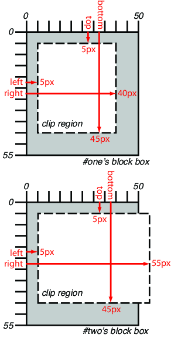
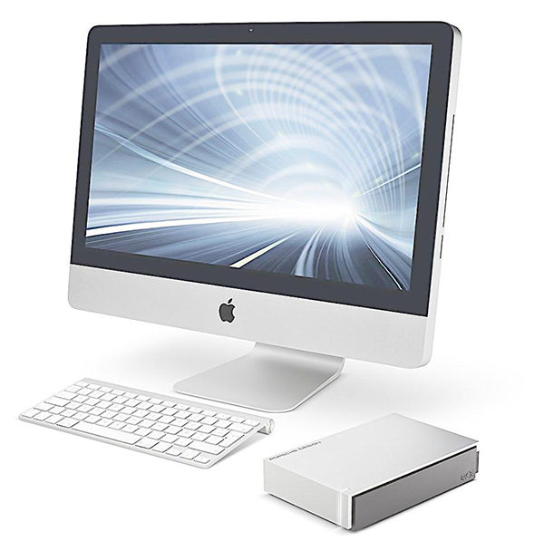
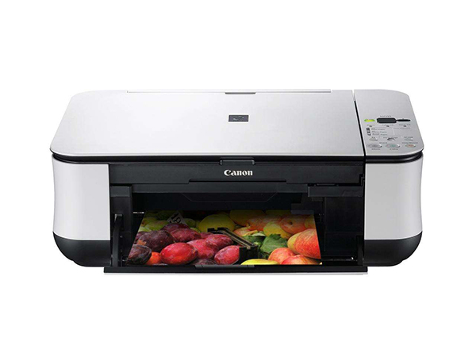
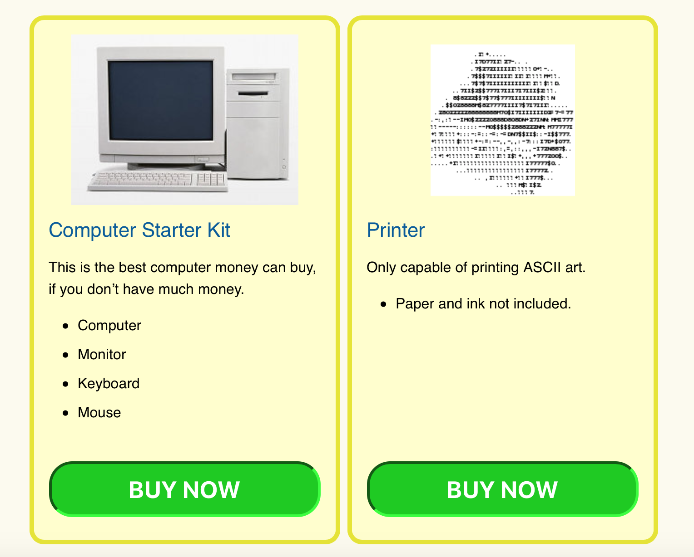
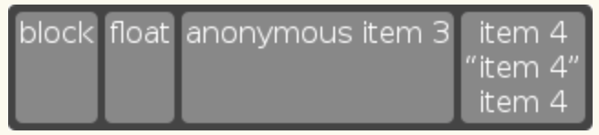
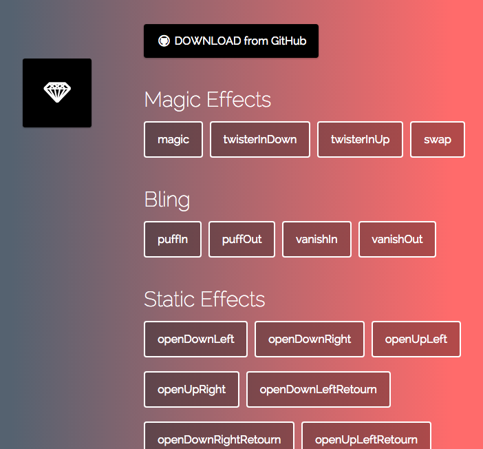

# css3 

## Resources

* w3c css [ `the latest` ]: <https://www.w3.org/TR/CSS/>
* CSS1 <https://www.w3.org/TR/CSS1/>
* CSS2.1 <https://www.w3.org/TR/CSS2/>
* CSS2.2 <https://www.w3.org/TR/CSS22/>
* CSS3 <https://www.w3.org/TR/CSS/>

## rem

## vertical-align

> Align the vertical midpoint of the box with the baseline of the parent box plus half the x-height of the parent.

* 深度参考：<ref://./css-fonts.md.html>
* <https://www.w3.org/TR/CSS2/visudet.html#propdef-vertical-align>
* Deep dive CSS: font metrics, line-height and vertical-align <http://iamvdo.me/en/blog/css-font-metrics-line-height-and-vertical-align>
* 深入了解CSS字体度量，行高和vertical-align <https://www.w3cplus.com/css/css-font-metrics-line-height-and-vertical-align.html>

## 水平垂直居中

* CSS未知宽高元素水平垂直居中 <https://www.cnblogs.com/jogen/p/5213566.html> 有`四种方式`

## border-edge & padding-edge

* `static`定位的内容从`padding-edge-inner`开始排布
* `absolute`定位的内容从`border-edge-inner`开始排布

代码验证如下：

    @[data-script="html editable"]
    

        这里是文本内容
        

    

## 文本处理相关

### white-space

> w3 css 2: <https://www.w3.org/TR/CSS22/text.html#white-space-prop>

    值              描述
    ==============================================================================
    normal          默认，合并空白，word边界到达容器宽度会换行
    nowrap          合并空白，文本不换行，即使word边界达到容器宽度也不会换行
    inherit
    pre             保留空白，遇到换行符才换行
    pre-wrap        保留空白，word边界到达容器宽度或遇到换行符会换行
    pre-line        合并空白，word边界到达容器宽度或遇到换行符会换行

举例如下：

    @[data-script="html editable"]

    normal          默认，合并空白，word边界到达容器宽度会换行
    nowrap          合并空白，文本不换行，即是word边界达到容器宽度也不会换行
    inherit
    pre             保留空白，遇到换行符才换行
    pre-wrap        保留空白，word边界到达容器宽度或遇到换行符会换行
    pre-line        合并空白，word边界到达容器宽度或遇到换行符会换行

    

### word-wrap

> 各类浏览器都支持，连`IE 5.5`都支持，兼容性非常好。

描述`是否允许`浏览器在word内断句换行。

    值              描述
    ==============================================================================
    normal          默认
    break-word      允许在长单词或url等长词内换行

* 在w3c上并没有关于`word-wrap`以及`word-break`的相关规范文档，它们属于浏览器厂商间的约定，很早期的浏览器就已经有了
* 注意：`word-wrap`并不是`word-break`的开关
* 参考：<http://www.cnblogs.com/2050/archive/2012/08/10/2632256.html>

### word-break

> 除了Opera的早期版本不支持，其他基本都支持，兼容性非常好，连`IE 5.5`都支持。

描述`如何`在word内断句换行。

    值              描述
    ==============================================================================
    normal          默认
    break-all       允许在单词内换行，比word-wrap: break-word;更进一步，节省空间
    keep-all        只能在半角空格或连字符处换行

举例如下：

    @[data-script="html editable"]

        

    简单文本：ok normal
    loooooooooooooooooooooooooooooooooo-ooooooooooooooooooooooooooong
        

        

        

    简单文本：ok normal
    loooooooooooooooooooooooooooooooooo-ooooooooooooooooooooooooooong
        

        

        

    简单文本：ok normal
    loooooooooooooooooooooooooooooooooo-ooooooooooooooooooooooooooong
        

        

        

    简单文本：ok normal
    loooooooooooooooooooooooooooooooooo-ooooooooooooooooooooooooooong
        

        

        

    简单文本：ok normal
    loooooooooooooooooooooooooooooooooo-ooooooooooooooooooooooooooong
        

    

### word-spacing & letter-spacing

> w3 ref: <https://www.w3.org/TR/CSS22/text.html#spacing-props>

todo

### text-overflow

todo

    .suggestion > div{
        width: 100%;
        height: 20px;
        white-space: nowrap;
        overflow: hidden;
        text-overflow: ellipsis;
    }

## 伪元素&伪类

> <https://www.w3.org/TR/CSS2/selector.html#before-and-after> 

### Tips

* `input`, `img`, `iframe`等元素不能设置`伪元素`，因为其不能插入内容。
* `伪元素`不是真正的DOM元素，无法通过`document.querySelector( selector )`或`$( selector )`获取到

### 伪元素

    ::first-letter
    ::first-line
    ::before
    ::after

### 伪类

    :active
    :focus
    :hover
    :link
    :visited
    :first-child
    :lang

### first-letter & first-child

todo

### Resources

* 为什么input不支持伪元素(:after,:before)？ <https://www.zhihu.com/question/21296044>
* 170918 你所不知的 CSS ::before 和 ::after `伪元素`用法 <http://blog.dimpurr.com/css-before-after/>

### Examples

    @media print a[href]::after {
        content: " (" attr(href) ")";
    }

以上样式设置，将会在打印的时候，为`存在href属性`( 只有hash不算 )的链接，在其文本后面添加` (链接地址)`。`bootstrap.css`正是这么做的。但有时候，我们希望打印到PDF的时候，这种样式有点冗余，则可以自行添加print样式表，覆盖该设置：

    @media print a[href]::after {
        content: "" ! important;
    }

    

## 打印属性( print )

### 属性说明

> @media print的样式属性值，最好都添加`! important`，确保覆盖优先级。

    orphans                 设置当元素内部发生分页时必须在页面底部保留的最少行数
    page-break-after        设置元素后的分页行为，取值: auto, always, avoid, left, right, inherit
    page-break-before       设置元素前的分页行为，取值: auto, always, avoid, left, right, inherit
    page-break-inside       设置元素内部的分页行为，取值: auto, avoid, inherit
    windows                 设置当元素内部发生分页时必须在页面顶部保留的最少行数

### Resources

* CSS print 样式 css控制打印样式 分页 页面大小 <http://www.lrxin.com/archives-1093.html>
* CSS打印属性：<http://www.w3school.com.cn/cssref/#print>

### Examples

    @media print table {
        page-break-before: always;
        page-break-inside: avoid;
    }

## clip

> A clipping region defines what portion of an element's border box is `visible`. 定义元素的可见部分。

### Resources

* w3c: <https://www.w3.org/TR/2011/REC-CSS2-20110607/visufx.html#overflow-clipping>
* 博客介绍：<http://www.zhangxinxu.com/wordpress/2011/04/css-clip-rect/>
* 用css的clip属性制作环形进度条: <http://www.toutiao.com/a6459677884238791181>

### 格式

	clip: auto;
	clip: inherit;
	clip: ( <top>, <right>, <bottom>, <left> );

### 特点

* √ 只针对`绝对定位`的元素
* 目前仅支持`rect` shape

 

* `兼容`写法

        .hidden{
            position: absolute;
            clip: rect(1px 1px 1px 1px); /* IE6, IE7 */
            clip: rect(1px, 1px, 1px, 1px);
        }

### 定义图片可见部分的例子

    @[data-script="html" style="margin-top:10px"]
    

        
        
    

### 进度圆环例子

实现`圆环`进度条。存在问题：`50%`交界处有卡顿，效果不流畅。推荐还是用svg或者canvas实现比较好。

    @[data-script="html editable"]
    

        

            

        

        

            

        

    

    

        

            

        

        

            

        

    

    

        

            

        

        

            

        

    

    

        

            

        

        

            

        

    

    

        

            

        

        

            

        

    

    

        

            

        

        

            

        

    

    

## css grid layout

<https://developer.mozilla.org/en-US/docs/Web/CSS/CSS_Grid_Layout>

## flexible box layout

> `弹性`布局

### Resources

* Level 1: <http://www.w3.org/TR/css-flexbox-1/>
*  A Complete Guide to Flexbox ( css-tricks ): <https://css-tricks.com/snippets/css/a-guide-to-flexbox/>
* `flex-cheatsheet`: <http://yoksel.github.io/flex-cheatsheet/>
* `Flexbox布局的正确使用姿势`: <https://segmentfault.com/a/1190000009932882> 
* simple history:
    1. `css2.1`定义了`4种`布局模式: `block`, `inline`, `table`, `positioned`
    2. `css3`新引入了一种布局: `flex`

            display: flex | inline-flex;

### Tips

* flex是`一维`的，css grid是`二维`的
* `flex`属性的理解是关键
* 个人理解，flex是更`强大版本`的`float`，比如float实现的瀑布流，可用flex简单实现。当然flex功能不止这个。

        /* item */
        float: left;
        width: 100px;
        height: 200px;
        overflow: hidden;

    用`flex实现`如下：

        /* container */
        display: flex;
        flex-flow: row wrap;
        justify-content: flex-start;

        /* item */
        flex: 0 0 100px;
        height: 200px;
        overflow: hidden;

* flex alignment，有三种方式：
    1. `auto margin`，能方便实现水平垂直居中

        Note: If free space is distributed to auto margins, the alignment properties will have no effect in that dimension because the margins will have stolen all the free space left over after flexing.

    2. 在flex container上使用`justify-content`, `align-items`
    3. 在flex item上使用`align-self`

* `flex-flow`如果是row，那么默认在高度上是占满的，如果是column，则默认在宽度上是占满的

### 可用属性

> 注意`flex container`与`flex item`的区别，`flex属性`的理解很关键

    /* 设定其内容元素使用flex布局 */
    display: flex | inline-flex;

    flex-flow: <flex-direction> || <flex-wrap>
        flex-flow: row wrap;

    flex-direction: row | row-reverse | column | column-reverse;

    flex-wrap: nowrap | wrap | wrap-reverse;
    
    /* 设定axis上子元素排布规则，此时text-align不生效 */
    justify-content: flex-start | flex-end | center | space-between | space-around;

    /* 设定cross-axis上子元素排布规则 */
    align-items: flex-start | flex-end | center | baseline | stretch
    align-self: auto | flex-start | flex-end | center | baseline | stretch

    / * packing flex lines */
    align-content: flex-start | flex-end | center | space-between | space-around | stretch
    

    /* 设定flex元素本身的自适应布局配置 */
    flex: none | [<flex-grow> <flex-shrink>? || <flex-basis>]
        /* 等价于  flex: 0 0 auto; */
        flex: none;   
        /* 等价于  flex: 0 1 auto; */
        flex: initial;
        /* 等价于  flex: 1 1 auto; */
        flex: auto;
        /* 等价于  flex: <positive-number> 1 0; 此种情况完全按照指定值按比例分配空间*/
        flex: <positive-number>;
        /* 综合考虑元素内容及额外空间，并在此基础上grow */
        flex: 1 0 auto;
        /* 考虑元素宽或高为200px，并在此基础上grow */
        flex: 1 0 200px;
        /* 考虑元素宽或高为300px，并在此基础上shrink */
        flex: 0 1 300px;

    /* 其接收值等同于：width或height接收值 + 'content' */
    /* flex简写方式中，忽略<flex-basis>，相当于设置了0 */
    flex-basis: auto | content | <width>
        /* 综合考虑内容宽度或高度、额外空间等因素 */
        flex-basis: auto;
        /* 根据内容宽度或高度，浏览器不一定支持，可用auto代替 */
        flex-basis: content;
        /* 根据所提供的值设置宽度或高度 */
        flex-basis: <width>;

    order: <integer>
        /* 正向 */
        order: 0;
        /* 逆向 */
        order: -1;

### 例子 1

    @[data-script="html editable"]

    <section id="deals">
      <section class="sale-item">
        <h1>Computer Starter Kit</h1>
        
This is the best computer money can buy, if you don’t have much money.
        <ul>
          <li>Computer
          <li>Monitor
          <li>Keyboard
          <li>Mouse
        </ul>
        
        <button>BUY NOW</button>
      </section>
      <section class="sale-item">
        <h1>Printer</h1>
        
Capabel of printing colorful images
        <ul>
          <li>Paper and ink not included
        </ul>
        
        <button>BUY NOW</button>
      </section>
    </section>
    

 

### 例子 2

* float儿子，float行为会被`忽略`
* inline内容会被匿名块状盒子包围
* inline儿子也会成为一个块状盒子

 

具体代码如下：

	

		<!-- flex item: block child -->
		
block

		<!-- flex item: floated element; floating is ignored -->
		
float

		<!-- flex item: anonymous block box around inline content -->
		anonymous item 3

		<!-- flex item: inline child -->
		
			item 4
			<!-- flex items do not split around blocks -->
			<q style="display: block" id=not-an-item>item 4</q>
			item 4
		
	

### 例子 3

* `flex`是一个`简写属性`，本例子可以测试以下值的布局表现，尝试修改后点击`Restart`按钮：

        flex: 1 1 0;
        flex: 0 1 0;
        flex: 1 1 auto;
        flex: 0 1 auto;
        order: 0;
        order: -1;
        order: 1;
        justify-content: flex-end;
        justify-content: flex-start;
        justify-content: space-between;
        justify-content: space-around;

    目前flex第三个字段尚不支持`content`。

代码如下：

    @[data-script="html editable"]

        
1

        
2

        
3

    

    

### 例子 4

> 关于flex布局中的alignment 1

* flex元素的auto margin，与block元素的auto margin效果类似
    1. 计算`flex bases`和`flexible lengths`，auto margin被视为0
    2. 优先于`justify-content`和`align-self`，任何正的空闲空间都会分配给该方向上的auto margins，如下方例子的Login元素，其`margin-left: auto`
    3. 溢出box的auto margin会被忽略，而`向end端溢出`

案例代码如下，重点为`.login元素`的`margin-left: auto`：

    @[data-script="html editable"]<nav class="flex-layout-container-alignment">
        <ul>
            <li><a href=/about>About</a>
            <li><a href=/projects>Projects</a>
            <li><a href=/interact>Interact</a>
            <li class="login"><a href=/login>Login</a> 
        </ul>
    </nav>
    

### 例子 5

> 关于flex布局中的alignment 2

案例代码如下，`flex container`使用`justify-content`与`align-items`实现未知宽高的元素的`水平垂直居中`：

    @[data-script="html editable"]

        
未知宽高的块元素

    

    

> 关于flex布局中的alignment 3

案例代码如下，`flex元素`使用`auto margin`实现自身的`水平垂直居中`：

    @[data-script="html editable"]

        
未知宽高块元素

    

    

## 滚动条样式

### Resources

* div隐藏滚动条仍保留滚动效果，兼容IE，FF，Webkit 和 O <https://blog.csdn.net/qq_2842405070/article/details/70238829>
* Demo - CSS3自定义滚动条 <http://www.xuanfengge.com/demo/201311/scroll/css3-scroll.html>
* [ 131103 ] CSS3自定义滚动条样式 -webkit-scrollbar <https://www.xuanfengge.com/css3-webkit-scrollbar.html>

### Examples

#### 隐藏滚动条

    /* Webkit */
    .scroll-container::-webkit-scrollbar {
        width: 0;
        height: 0;
    }

    /* Opera */
    .scroll-containter .-o-scrollbar{
        -moz-appearance: none !important;
        background: rgba(0,255,0,0) !important;
    }

    /* IE10, IE11, IE12 */
    .scroll-container {
        -ms-scroll-chaining: chained;
        -ms-overflow-style: none;
        -ms-content-zooming: zoom;
        -ms-scroll-rails: none;
        -ms-content-zoom-limit-min: 100%;
        -ms-content-zoom-limit-max: 500%;
        -ms-scroll-snap-type: proximity;
        -ms-scroll-snap-points-x: snapList(100%, 200%, 300%, 400%, 500%);
        -ms-overflow-style: none;
        overflow: auto;
    }

FF下，用JS实现：

    
    
    

#### 自定义滚动条

    /*定义滚动条高宽及背景 高宽分别对应横竖滚动条的尺寸*/
    ::-webkit-scrollbar
    {
        width: 16px;
        height: 16px;
        background-color: #F5F5F5;
    }
     
    /*定义滚动条轨道 内阴影+圆角*/
    ::-webkit-scrollbar-track
    {
        -webkit-box-shadow: inset 0 0 6px rgba(0,0,0,0.3);
        border-radius: 10px;
        background-color: #F5F5F5;
    }
     
    /*定义滑块 内阴影+圆角*/
    ::-webkit-scrollbar-thumb
    {
        border-radius: 10px;
        -webkit-box-shadow: inset 0 0 6px rgba(0,0,0,.3);
        background-color: #555;
    }

## CSS3 case

1. animation的@keyframes，每帧的工作是进行背景图片切换的情况下，如下：

        #wrapper.scene_2 .bombing {
            -webkit-animation-name: bomb;
            animation-name: bomb;
            -webkit-animation-duration: 2s;
            animation-duration: 2s;
            -webkit-animation-timing-function: ease-out;
            animation-timing-function: ease-out;
        }

        @-webkit-keyframes bomb {
            0% {
                background-image: url("../../img/bomb-f1.png");
            }
            20% {
                background-image: url("../../img/bomb-f2.png");
            }
            40% {
                background-image: url("../../img/bomb-f3.png");
            }
            60% {
                background-image: url("../../img/bomb-f4.png");
            }
            80% {
                background-image: url("../../img/bomb-f5.png");
            }
            100% {
                background-image: none;
            }
        }

        

    在某些Android机器下，动画特效不展示。比如Lenovo A360t。再比如：

        #wrapper.scene_5.scene_5_1 .coin-1-layer {
            /* 标记1 */
            background-image: url("/static/pinche/oneyuan/img/coin-fri_4311eed.png");
        }

        #wrapper.scene_5.scene_5_1 .coin-1-layer.goDown {
            -webkit-animation-name: coin-1-godown;
            animation-name: coin-1-godown;
            -webkit-animation-duration: 0.75s;
            animation-duration: 0.75s;
            -webkit-animation-timing-function: ease-out;
            animation-timing-function: ease-out;
            -webkit-animation-iteration-count: 1;
            animation-iteration-count: 1;
            -webkit-animation-fill-mode: forwards;
            animation-fill-mode: forwards;
        }

        @-webkit-keyframes coin-1-godown {
            0% {
                background-image: url("/static/pinche/oneyuan/img/coin_23f44b5.png");
            }
            100% {
                top: 47%;
                left: 80%;
                background-image: url("/static/pinche/oneyuan/img/coin-fri_4311eed.png");
            }
        }

    .coin-1-layer添加`标记1`的规则，很有可能在A360t上不显示背景变化。当然其他大部分手机即使不加，也是正常显示的。

    第一个例子，A360t还是无法直接解决，只能用js动画，`setInterval`了。

2. Animation动画的@keyframs，在css压缩情况下，可能导致出错。但这种出错很不容易察觉，最好的规避办法就是不压缩。

3. 有时制作满屏应用，`#wrapper`样式为

        {
            position: absolute;
            top: 0;
            left: 0;
            right: 0;
            bottom: 0;
        }

    如果内容不足以撑开整屏高度，可能底部会空出一截，特别是`#wrapper`有背景色的情况下尤为明显。
    这时使用： 

        html, body {  
            height: 100%; 
        ｝

    能保证即使内容不够撑开整屏高度，底部也不会出来颜色不一的一截。但是这种情况`也有bug`。
    如果页面布局尺寸全部使用`百分比`尺寸，即子元素的尺寸都按父元素的尺寸的百分比来计算的时候，
    在小米手机中，如果点击页面内的编辑框，弹出输入键盘，整体往上移，可能把整屏压缩在剩余的可视空间内。

    这种情况的解决办法是，强制动态给`body`设置高度：

        $('body').css('height', $(window).height() + 'px');

4. 也是一个性能解决方案。图片切换动画中，有时出现图片空白，比如低端一点的iPhone4S等手机。可能
    问题是图片资源在短时间内（动画时长短），来不及加载至内存，导致渲染不及。可用的方法是：`图片
    预加载`和`动画预渲染`。

    * 图片预加载原理比较简单，不多说
    * 动画预渲染，方法就是提供一个不在可视区出现的容器，将需要进行的动画在这个容器里面预先渲染一下，比如：
            

                

                

                

                

                

                

                

                

            

        提供一个预渲染容器，该容器的样式为：

            .prerender-layer {          
                position: absolute;     
                width: 100%;            
                height: 100%;           
                left: -200%; 
            }

        将其移出显示区，进行预渲染。后续用到的同样的动画，就会变得流畅，不会出现白色图片。
    * 在动画开始前，先将目标设置为`visibility:hidden`，触发强制渲染。这种方式在`1块钱上下班`项目中使用

## CSS3 Effects

1. `animate.css`: <https://daneden.github.io/animate.css/> github: <https://github.com/daneden/animate.css> <iframe src="http://258i.com/gbtn.html?user=daneden&repo=animate.css&type=star&count=true" frameborder="0" scrolling="0" width="170px" height="20px"></iframe>  

2. `miniMAC/magic` : <http://minimamente.com/example/magic_animations/> github: <https://github.com/miniMAC/magic> <iframe src="http://258i.com/gbtn.html?user=miniMAC&repo=magic&type=star&count=true" frameborder="0" scrolling="0" width="170px" height="20px"></iframe>  
   
    

3. `Flux Slider`，基于图片的动画特效：<http://www.joelambert.co.uk/flux/> github: <https://github.com/joelambert/Flux-Slider> <iframe src="http://258i.com/gbtn.html?user=joelambert&repo=Flux-Slider&type=star&count=true" frameborder="0" scrolling="0" width="170px" height="20px"></iframe>  

    <video width="837" height="480" controls><source src="./video/flux-slider.mp4"></video>

4. `textillate`: <http://textillate.js.org> github: <https://github.com/jschr/textillate> <iframe src="http://258i.com/gbtn.html?user=jschr&repo=textillate&type=star&count=true" frameborder="0" scrolling="0" width="170px" height="20px"></iframe>   

    基于`文本`的动画效果，是一个`jquery`插件，需要引入自带的`animation.css`文件

5. `vivify`: <http://vivify.mkcreative.cz> 支持`67种`动画类  github: <https://github.com/Martz90/vivify> <iframe src="http://258i.com/gbtn.html?user=Martz90&repo=vivify&type=star&count=true" frameborder="0" scrolling="0" width="170px" height="20px"></iframe>  

6. `css effects`: Image Effects with `CSS` <http://bennettfeely.com/image-effects/> 各类CSS实现的图片效果，支持多种特效：Pencil, Emboss, Watercolor, Colored Pencil, Chalkboard, Colored Chalkboard, Airbrush, Hallucination, Flannel, Low Ink, Collage, Mosaic, Infrared等

## 属性拾遗

1. `-webkit-font-smoothing`，网页字体反锯齿设置

        -webkit-font-smoothing: none;
        -webkit-font-smoothing: subpixel-antialiased;
        -webkit-font-smoothing: antialiased;

    `subpixel-antialiased`为浏览器默认，`antialiased`为反锯齿效果

2. `-webkit-touch-callout`，Disables the default callout shown when you touch and hold a touch target.
    在iOS上可用，阻止用户按住某些元素（图片、链接）时弹出信息窗口。

        -webkit-touch-callout: none;

    iOS下，应用于图片元素，可阻止图片复制、保存等；应用于link，可阻止链接信息弹出窗口。

3. `user-select`，阻止文本选择，以下给出比较通用的阻止文本选择的代码。 

        *.unselectable {
            -moz-user-select: -moz-none;
            -khtml-user-select: none;
            -webkit-user-select: none;

            /**
             *   Introduced in IE 10.
             *   See http://ie.microsoft.com/testdrive/HTML5/msUserSelect/
             */
            -ms-user-select: none;
            user-select: none;
        }

4. 去默认边框： 

    去除Android， iOS上元素click时默认出现的边框：

        -webkit-tap-hightlight-color: rgba(0,0,0,0);

    iOS下移除按钮原生样式：

        -webkit-appearance: none;

    PC下移除a标签等元素点击时的虚线框：

        outline: none;

### 参考网站

1. <http://css-infos.net/>
2. <http://css-infos.net/properties/webkit>，包含非官方的webkit css属性

## 3D CSS Tester

<http://thewebrocks.com/demos/3D-css-tester/>

## 3D CSS 说明

    rotateX(angel)
    rotateY(angel)
    rotateZ(angel)

    -webkit-transform: matrix3d(0.9993908270190958, 0, -0.03489949670250097, 0, 0, 1, 0, 0, 0.03489949670250097, 0, 0.9993908270190958, 0, 0, 0, 0, 1);
    -webkit-transform: matrix3d(0.984807753012208, 0, 0.17364817766693033, 0, 0, 1, 0, 0, -0.17364817766693033, 0, 0.984807753012208, 0, 0, 0, 0, 1);
    -webkit-transform: matrix3d(0.984807753012208, 0, 0.17364817766693, 0, 0, 1, 0, 0, -0.17364817766693, 0, 0.984807753012208, 0, 0, 0, 0, 1);

## JSAPI: RequestAnimationFrame

最早由Mozilla的Reboert O'Callahan提出，他指出CSS transitions和animation的优势
在于浏览器知道哪些动画将会发生，所以得到正确的间隔来刷新UI。

而javascript动画，浏览器不知道动画正在发生，通过setTimeout或者setInterval定期操作DOM样式，js的这种
操作只是将渲染要求添加到UI渲染队列，并不保证立即渲染，UI渲染线程可能因为其他绘制
或者用户操作，延迟渲染，甚至出现丢帧现象。

他的解决方案是创建一个`mozRequestAnimationFrame()`方法，接收
一个参数，该参数是一个屏幕重绘前调用的函数，该函数对DOM进行样式改变，这些改变用在下一次重绘中。

    window.requestAnimFrame = ( function(){  
        return  window.requestAnimationFrame
            || window.webkitRequestAnimationFrame 
            || window.mozRequestAnimationFrame    
            || window.oRequestAnimationFrame      
            || window.msRequestAnimationFrame     
            || function( callback ){  
                window.setTimeout(callback, 1000/60);  
            };  
    })();  

    // 调用  
    function animationLoop(elem){  
        requestAnimFrame(animationLoop);  
        // logic  
        performStyleUpdate();
    } 

只执行一次，再次动画需要自行再调用requestAnimFrame。

这种方式，让浏览器知道Javascript何时尝试动画，利于浏览器做更多的优化处理。

优化在于，这种方式对于一个帧中对DOM的所有操作，只进行一次Layout和Paint，如果发生动画
的元素被隐藏了，那么就不再Paint。

## DOM-Event: transitionend 

> 该事件在transition完成时触发。如果在完成前，transition被移除，该事件不会被触发。

`事件特性：`

* bubbles: yes
* cancelable: yes
* context info: propertyName, elapsedTime, pseudoElement

`跨浏览器事件名：`

* Android and Safari: `webkitTransitionEnd`
* Opera: 10 as `oTransitionEnd`, 12 as `otransitionend`, 12.10 as `transitionend`

`Example:`

    function showMessage() {
        alert('Transition has finished');
    }

    var element = document.getElementById("slidingMenu");
    element.addEventListener("transitionend", showMessage, false);

## DOM-Event: Animation Events

> 关键帧动画开始、结束，以及每次循环结束都会触发DOM事件。

1. `animationstart`

    属性： animationName, pseudoElement

2. `animationend`

    属性： animationName, elapsedTime, pseudoElement

3. `animationiteration`

    属性： animationName, elapsedTime, pseudoElement

`事件特性：`

* bubbles: yes
* cancelable: no

`跨浏览器事件名：`
1. `webkitAnimationEnd`
2. `oAnimationEnd`
3. `MSAnimationEnd`

## min-device-pixel-ratio

移动系统支持情况：
* iOS3.2 +
* Android 2.1+

`检测页面：` <http://bjango.com/articles/min-device-pixel-ratio/>

例如，针对3倍设备像素比的设备，使用`@3x`图片，可使用以下代码：

    @media only screen and (-webkit-min-device-pixel-ratio: 3) {
        selector {
            ...
        }
        ...
    }

`js API`：

    ratio = window.devicePixelRatio;

## Media Queries

### Resources

1. `W3C：`<http://www.w3.org/TR/css3-mediaqueries/>
2. `参考页面：`<http://www.cnblogs.com/asqq/archive/2012/04/13/2445912.html>

### Syntax

    /* media query */
    @media [not|only] media-type and ( media-feature-expression ) {
        ...
    } 

    /* media queries */
    @media screen and ( color ), projection and ( color ) {
        ...
    }

    /* @import statement */
    @import url( color.css ) screen and ( color );

    <!-- link media query -->
    <link rel="stylesheet" media="[not|only] media-type and ( media-feature-expression )" href="mystylesheet.css">

* `media-type media-feature-expression`是一个group，它们之间用`and`连接，是`与`的关系
* 逻辑操作符`not`和`only`只出现在media-type前，作用于`当前group的逻辑`
* 多个group使用`逗号","`分隔
* `link标签`的media属性，`@import语句`的media表达式，都`不包含@media`

### Media Types

> 不包含已废弃的媒体类型，目前可用4种

    all
    print
    screen
    speech

### Media Features

> 31种
    
    aspect-ratio
    color
    color-index
    device-aspect-ratio
    device-height
    device-width
    grid
    height
    max-aspect-ratio
    max-color
    max-color-index
    max-device-aspect-ratio
    max-device-height
    max-device-width
    max-height
    max-monochrome
    max-resolution
    max-width
    min-aspect-ratio
    min-color
    min-color-index
    min-device-aspect-ratio
    min-device-width
    min-device-height
    min-height
    min-resolution
    min-width
    monochrome
    orientation
    scan
    width

### Examples

    @media print {
        .nav {
            display: none;
        }
    }

    <link rel="stylesheet" media="screen and (max-width:600px)" href="small.css" type="text/css" />
    <link rel="stylesheet" media="screen and (min-width:900px)" href="big.css" type="text/css"  />
    <link rel="stylesheet" media="screen and (max-device-width: 480px)" href="iphone.css" type="text/css" />
    <link rel="stylesheet" media="only screen and (-webkit-min-device-pixel-ratio: 2)" type="text/css" href="iphone4.css" />
    <link rel="stylesheet" media="all and (orientation:portrait)" href="portrait.css" type="text/css" /> 
    <link rel="stylesheet" media="all and (orientation:landscape)" href="landscape.css"  type="text/css" />
    <link rel="stylesheet" media="not print and (max-width: 1200px)" href="print.css" type="text/css" />
    <link rel="stylesheet" media="only screen and (max-device-width:240px)" href="android240.css" type="text/css" />

## pointer-events

### Resources

* mdn: <https://developer.mozilla.org/en-US/docs/Web/CSS/pointer-events>
* caniuse: <https://caniuse.com/#search=pointer-events>

### Property Values

> The CSS property `pointer-events` allows authors to control under what circumstances (if any) a particular graphic element can become the target of mouse events. 

    /* Keyword values */
    pointer-events: auto;
    pointer-events: none;
    pointer-events: visiblePainted;
    pointer-events: visibleFill;
    pointer-events: visibleStroke;
    pointer-events: visible;
    pointer-events: painted;
    pointer-events: fill;
    pointer-events: stroke;
    pointer-events: all;

    /* Global values */
    pointer-events: inherit;
    pointer-events: initial;
    pointer-events: unset;

### Tips

* `visible`前缀的属性值, `visible`, `painted`, `fill`, `stroke`, `all`只用于`SVG`。
* `auto`对于非SVG元素来说，相当于该属性未设置一样；对于SVG元素而言，相当于设置了`visiblePainted`。
* `none`不响应任何鼠标事件。但若其`子孙元素`设置了响应鼠标事件，则其也`不会阻止`子孙元素对鼠标事件的响应。
* `JS`设置方式：

        elements.style.pointerEvents = 'none';

> 不要把`一知半解`当作你的认知成就。 —— iRice
