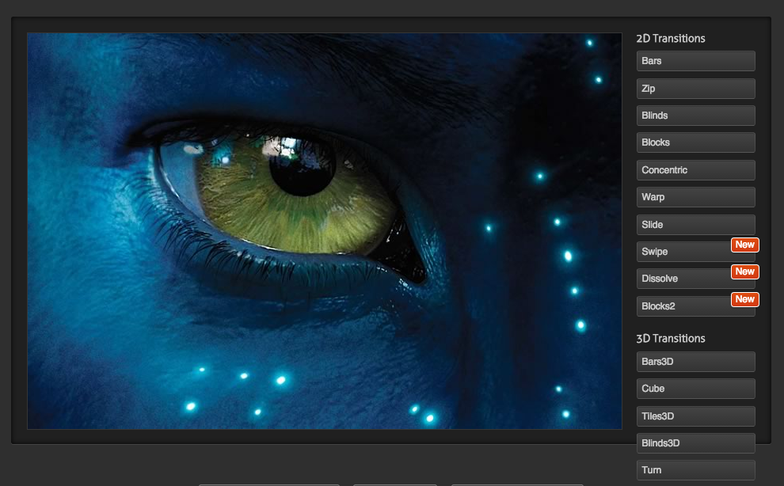

# CSS3 Memo

## CSS3 case

1. animation的@keyframes，每帧的工作是进行背景图片切换的情况下，如下：

        #wrapper.scene_2 .bombing {
            -webkit-animation-name: bomb;
            animation-name: bomb;
            -webkit-animation-duration: 2s;
            animation-duration: 2s;
            -webkit-animation-timing-function: ease-out;
            animation-timing-function: ease-out;
        }

        @-webkit-keyframes bomb {
            0% {
                background-image: url("../../img/bomb-f1.png");
            }
            20% {
                background-image: url("../../img/bomb-f2.png");
            }
            40% {
                background-image: url("../../img/bomb-f3.png");
            }
            60% {
                background-image: url("../../img/bomb-f4.png");
            }
            80% {
                background-image: url("../../img/bomb-f5.png");
            }
            100% {
                background-image: none;
            }
        }

        

    在某些Android机器下，动画特效不展示。比如Lenovo A360t。再比如：

        #wrapper.scene_5.scene_5_1 .coin-1-layer {
            /* 标记1 */
            background-image: url("/static/pinche/oneyuan/img/coin-fri_4311eed.png");
        }

        #wrapper.scene_5.scene_5_1 .coin-1-layer.goDown {
            -webkit-animation-name: coin-1-godown;
            animation-name: coin-1-godown;
            -webkit-animation-duration: 0.75s;
            animation-duration: 0.75s;
            -webkit-animation-timing-function: ease-out;
            animation-timing-function: ease-out;
            -webkit-animation-iteration-count: 1;
            animation-iteration-count: 1;
            -webkit-animation-fill-mode: forwards;
            animation-fill-mode: forwards;
        }

        @-webkit-keyframes coin-1-godown {
            0% {
                background-image: url("/static/pinche/oneyuan/img/coin_23f44b5.png");
            }
            100% {
                top: 47%;
                left: 80%;
                background-image: url("/static/pinche/oneyuan/img/coin-fri_4311eed.png");
            }
        }

    .coin-1-layer添加`标记1`的规则，很有可能在A360t上不显示背景变化。当然其他大部分手机即使不加，也是正常显示的。

    第一个例子，A360t还是无法直接解决，只能用js动画，`setInterval`了。

2. Animation动画的@keyframs，在css压缩情况下，可能导致出错。但这种出错很不容易察觉，最好的规避办法就是不压缩。

3. 有时制作满屏应用，`#wrapper`样式为

        {
            position: absolute;
            top: 0;
            left: 0;
            right: 0;
            bottom: 0;
        }

    如果内容不足以撑开整屏高度，可能底部会空出一截，特别是`#wrapper`有背景色的情况下尤为明显。
    这时使用： 

        html, body {  
            height: 100%; 
        ｝

    能保证即使内容不够撑开整屏高度，底部也不会出来颜色不一的一截。但是这种情况`也有bug`。
    如果页面布局尺寸全部使用`百分比`尺寸，即子元素的尺寸都按父元素的尺寸的百分比来计算的时候，
    在小米手机中，如果点击页面内的编辑框，弹出输入键盘，整体往上移，可能把整屏压缩在剩余的可视空间内。

    这种情况的解决办法是，强制动态给`body`设置高度：

        $('body').css('height', $(window).height() + 'px');

4. 也是一个性能解决方案。图片切换动画中，有时出现图片空白，比如低端一点的iPhone4S等手机。可能
    问题是图片资源在短时间内（动画时长短），来不及加载至内存，导致渲染不及。可用的方法是：`图片
    预加载`和`动画预渲染`。

    * 图片预加载原理比较简单，不多说
    * 动画预渲染，方法就是提供一个不在可视区出现的容器，将需要进行的动画在这个容器里面预先渲染一下，比如：
            

                

                

                

                

                

                

                

                

            

        提供一个预渲染容器，该容器的样式为：

            .prerender-layer {          
                position: absolute;     
                width: 100%;            
                height: 100%;           
                left: -200%; 
            }

        将其移出显示区，进行预渲染。后续用到的同样的动画，就会变得流畅，不会出现白色图片。

## CSS3特效

1. `miniMAC/magic (3299 stars)` : 

    <a target="_blank" href="
    http://minimamente.com/example/magic_animations/
    ">
    http://minimamente.com/example/magic_animations/
    </a>
   
    

2. `joemottershaw/animations (338 stars)`: 

    <a target="_blank" href="
    http://www.cloud-eight.com/github/animations/ 
    ">
    http://www.cloud-eight.com/github/animations/ 
    </a>

3. `Flux Slider (1214 stars)`: 

    基于图片的动画特效

    <a target="_blank" href="
    http://www.joelambert.co.uk/flux/ 
    ">
    http://www.joelambert.co.uk/flux/ 
    </a>

    

4. `textillate (2065 stars)`: 

    <a target="_blank" href="
    http://textillate.js.org
    ">
    http://textillate.js.org
    </a>

    基于文本的动画效果，是一个jquery插件，需要引入自带的`animation.css`文件

## 属性拾遗

1. `-webkit-font-smoothing`，网页字体反锯齿设置

        -webkit-font-smoothing: none;
        -webkit-font-smoothing: subpixel-antialiased;
        -webkit-font-smoothing: antialiased;

    `subpixel-antialiased`为浏览器默认，`antialiased`为反锯齿效果

2. `-webkit-touch-callout`，Disables the default callout shown when you touch and hold a touch target.
    在iOS上可用，阻止用户按住某些元素（图片、链接）时弹出信息窗口。

        -webkit-touch-callout: none;

    iOS下，应用于图片元素，可阻止图片复制、保存等；应用于link，可阻止链接信息弹出窗口。

3. `user-select`，阻止文本选择，以下给出比较通用的阻止文本选择的代码。 

        *.unselectable {
            -moz-user-select: -moz-none;
            -khtml-user-select: none;
            -webkit-user-select: none;

            /**
             *   Introduced in IE 10.
             *   See http://ie.microsoft.com/testdrive/HTML5/msUserSelect/
             */
            -ms-user-select: none;
            user-select: none;
        }

### 参考网站

1. http://css-infos.net/
2. http://css-infos.net/properties/webkit，包含非官方的webkit css属性

## 3D CSS Tester

<a href="http://thewebrocks.com/demos/3D-css-tester/">3D-CSS-Tester</a>

## 3D CSS 说明

    rotateX(angel)
    rotateY(angel)
    rotateZ(angel)

    -webkit-transform: matrix3d(0.9993908270190958, 0, -0.03489949670250097, 0, 0, 1, 0, 0, 0.03489949670250097, 0, 0.9993908270190958, 0, 0, 0, 0, 1);
    -webkit-transform: matrix3d(0.984807753012208, 0, 0.17364817766693033, 0, 0, 1, 0, 0, -0.17364817766693033, 0, 0.984807753012208, 0, 0, 0, 0, 1);
    -webkit-transform: matrix3d(0.984807753012208, 0, 0.17364817766693, 0, 0, 1, 0, 0, -0.17364817766693, 0, 0.984807753012208, 0, 0, 0, 0, 1);

## JSAPI: RequestAnimationFrame

最早由Mozilla的Reboert O'Callahan提出，他指出CSS transitions和animation的优势
在于浏览器知道哪些动画将会发生，所以得到正确的间隔来刷新UI。

而javascript动画，浏览器不知道动画正在发生，通过setTimeout或者setInterval定期操作DOM样式，js的这种
操作只是将渲染要求添加到UI渲染队列，并不保证立即渲染，UI渲染线程可能因为其他绘制
或者用户操作，延迟渲染，甚至出现丢帧现象。

他的解决方案是创建一个`mozRequestAnimationFrame()`方法，接收
一个参数，该参数是一个屏幕重绘前调用的函数，该函数对DOM进行样式改变，这些改变用在下一次重绘中。

    window.requestAnimFrame = ( function(){  
        return  window.requestAnimationFrame
            || window.webkitRequestAnimationFrame 
            || window.mozRequestAnimationFrame    
            || window.oRequestAnimationFrame      
            || window.msRequestAnimationFrame     
            || function( callback ){  
                window.setTimeout(callback, 1000/60);  
            };  
    })();  

    // 调用  
    function animationLoop(elem){  
        requestAnimFrame(animationLoop);  
        // logic  
        performStyleUpdate();
    } 

只执行一次，再次动画需要自行再调用requestAnimFrame。

这种方式，让浏览器知道Javascript何时尝试动画，利于浏览器做更多的优化处理。

优化在于，这种方式对于一个帧中对DOM的所有操作，只进行一次Layout和Paint，如果发生动画
的元素被隐藏了，那么就不再Paint。

## DOM-Event: transitionend 

> 该事件在transition完成时触发。如果在完成前，transition被移除，该事件不会被触发。

`事件特性：`

* bubbles: yes
* cancelable: yes
* context info: propertyName, elapsedTime, pseudoElement

`跨浏览器事件名：`

* Android and Safari: `webkitTransitionEnd`
* Opera: 10 as `oTransitionEnd`, 12 as `otransitionend`, 12.10 as `transitionend`

`Example:`

    function showMessage() {
        alert('Transition has finished');
    }

    var element = document.getElementById("slidingMenu");
    element.addEventListener("transitionend", showMessage, false);

## DOM-Event: Animation Events

> 关键帧动画开始、结束，以及每次循环结束都会触发DOM事件。

1. `animationstart`

    属性： animationName, pseudoElement

2. `animationend`

    属性： animationName, elapsedTime, pseudoElement

3. `animationiteration`

    属性： animationName, elapsedTime, pseudoElement

`事件特性：`

* bubbles: yes
* cancelable: no

`跨浏览器事件名：`
1. `webkitAnimationEnd`
2. `oAnimationEnd`
3. `MSAnimationEnd`

## min-device-pixel-ratio

移动系统支持情况：
* iOS3.2 +
* Android 2.1+

`检测页面：` <a href="http://bjango.com/articles/min-device-pixel-ratio/">min-device-pixel-ratio</a>

例如，针对3倍设备像素比的设备，使用`@3x`图片，可使用以下代码：

    @media only screen and (-webkit-min-device-pixel-ratio: 3) {
        selector {
            ...
        }
        ...
    }

`js API`：

    ratio = window.devicePixelRatio;

## Media Queries

1. `W3C：`
2. `参考页面：`<a href="http://www.cnblogs.com/asqq/archive/2012/04/13/2445912.html">Media Queries详解</a>

    <link rel="stylesheet" media="screen and (max-width:600px)" href="small.css" type="text/css" />
    <link rel="stylesheet" media="screen and (min-width:900px)" href="big.css" type="text/css"  />
    <link rel="stylesheet" media="screen and (max-device-width: 480px)" href="iphone.css" type="text/css" />
    <link rel="stylesheet" media="only screen and (-webkit-min-device-pixel-ratio: 2)" type="text/css" href="iphone4.css" />
    <link rel="stylesheet" media="all and (orientation:portrait)" href="portrait.css" type="text/css" /> 
    <link rel="stylesheet" media="all and (orientation:landscape)" href="landscape.css"  type="text/css" />
    <link rel="stylesheet" media="not print and (max-width: 1200px)" href="print.css" type="text/css" />
    <link rel="stylesheet" media="only screen and (max-device-width:240px)" href="android240.css" type="text/css" />

