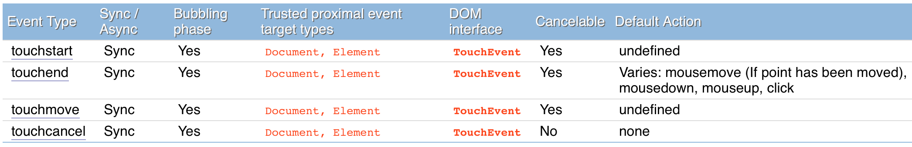

# DOM Events

> changelog: 1706, 1607, 1412

## DOM Event Level 0

> The term `"DOM Level 0"` refers to a mix (not formally specified) of HTML document functionalities offered by `Netscape` Navigator version `3.0` and Microsoft `Internet Explorer` version `3.0`. In some cases, attributes or methods have been included for reasons of `backward compatibility` with "DOM Level 0".

`Level 0`，浏览器直接将事件派发给`target`，如果该target有handler，则执行之，仅此而已，别再无它。

## DOM Event Level 2
1. <http://www.w3.org/TR/DOM-Level-2-Events/> 2000-11-13成为`REC`

### 术语

* `UI events`: 用户界面事件，由`外设`触发，比如`mouse, keyboard`等
* `UI Logical events`: `独立于设备`的用户界面事件，比如`focus`改变事件或元素触发通知事件
* `Mutation events`: `文档结构`发生变化触发的事件
* `Capturing`: 事件target处理前，target的祖先节点能先处理该事件的过程
* `Bubbling`: 事件target处理完事件，该事件沿着祖先`由下至上`的传递过程
* `Cancelable`: 一种事件设计机制，允许事件处理者选择`阻止`与事件绑定的`默认`操作

### 基本事件流

事件target的任何一个事件监听器发生异常，都会停止事件继续传播(propagation)。但仍然会执行该事件的其他事件监听器

事件处理过程中可能还会触发其他事件的发生，其他事件的处理须以`同步`方式进行

### 事件3阶段

`Level 2`，事件传播有`三个`阶段：

* `capturing phase`，从document向下往target走，比如`[document - html - body - section.slide - h2]`
* `target phase`，target本身
* `bubbling phase`，从target向上往document走，比如`[h2 - section.slide - body - html - document]`

所以父节点`可能有1到2次机会`响应事件，不过一般情况不需要在capturing phase响应。

这体现在使用addEventListener时，第三个参数`useCapture`为false

### Event capture

`stopPropagation`的执行只需一次，就能阻止继续往下传递。多次调用和一次调用的效果是一样的。

### Event bubble

`stopPropagation`的执行只需一次，就能阻止继续往上传递。

bubble链是在事件派发前确定的，如果事件处理过程中DOM结构发生变化，bubble链仍然以派发前的为准。

### Event cancelation

有些事件可以cancel。对于这些事件，在DOM实现上会有一些默认行为与之绑定。比如超链接，点击会跳转。

## Hierarchy

### Event注册接口

* EventTarget
* EventListener

`HTML 4.0`的事件处理器是作为元素属性添加的，不支持多个监听器同时存在。而`DOM Event Model`允许多个事件处理器同时存在于一个`EventTarget`。

### Event接口

* Event

### Document Event接口

* DocumentEvent

### UIEvent

* Event
    * UIEvent
        * MouseEvent
        * TouchEvent

## EventTarget IDL

    // Introduced in DOM Level 2:
    interface EventTarget {
      void               addEventListener(in DOMString type, 
                                          in EventListener listener, 
                                          in boolean useCapture);
      void               removeEventListener(in DOMString type, 
                                             in EventListener listener, 
                                             in boolean useCapture);
      boolean            dispatchEvent(in Event evt)
                                            raises(EventException);
    };

其中`dispatchEvent`方法的返回值：

The return value of `dispatchEvent` indicates whether any of the listeners which handled the event called `preventDefault`. If preventDefault was called the value is `false`, else the value is `true`.

## EventListener IDL

    // Introduced in DOM Level 2:
    interface EventListener {
      void               handleEvent(in Event evt);
    };

## Event

### Event IDL

    // Introduced in DOM Level 2:
    interface Event {

      // PhaseType
      const unsigned short      CAPTURING_PHASE                = 1;
      const unsigned short      AT_TARGET                      = 2;
      const unsigned short      BUBBLING_PHASE                 = 3;

      readonly attribute DOMString        type;
      readonly attribute EventTarget      target;
      readonly attribute EventTarget      currentTarget;
      readonly attribute unsigned short   eventPhase;
      readonly attribute boolean          bubbles;
      readonly attribute boolean          cancelable;
      readonly attribute DOMTimeStamp     timeStamp;
      void               stopPropagation();
      void               preventDefault();
      void               initEvent(in DOMString eventTypeArg, 
                                   in boolean canBubbleArg, 
                                   in boolean cancelableArg);
    };

`定义的接口方法：`

* initEvent
* preventDefault
* stopPropagation
* stopImmediatePropagation

## DocumentEvent IDL

    // Introduced in DOM Level 2:
    interface DocumentEvent {
      Event              createEvent(in DOMString eventType)
                                            raises(DOMException);
    };

## Event module定义

### UIEvent IDL

    // Introduced in DOM Level 2:
    interface UIEvent : Event {
      readonly attribute views::AbstractView  view;
      readonly attribute long             detail;
      void               initUIEvent(in DOMString typeArg, 
                                     in boolean canBubbleArg, 
                                     in boolean cancelableArg, 
                                     in views::AbstractView viewArg, 
                                     in long detailArg);
    };

* DOMFocusIn
* DOMFocusOut
* DOMActivate

### MouseEvent IDL

    // Introduced in DOM Level 2:
    interface MouseEvent : UIEvent {
      readonly attribute long             screenX;
      readonly attribute long             screenY;
      readonly attribute long             clientX;
      readonly attribute long             clientY;
      readonly attribute boolean          ctrlKey;
      readonly attribute boolean          shiftKey;
      readonly attribute boolean          altKey;
      readonly attribute boolean          metaKey;
      readonly attribute unsigned short   button;
      readonly attribute EventTarget      relatedTarget;
      void               initMouseEvent(in DOMString typeArg, 
                                        in boolean canBubbleArg, 
                                        in boolean cancelableArg, 
                                        in views::AbstractView viewArg, 
                                        in long detailArg, 
                                        in long screenXArg, 
                                        in long screenYArg, 
                                        in long clientXArg, 
                                        in long clientYArg, 
                                        in boolean ctrlKeyArg, 
                                        in boolean altKeyArg, 
                                        in boolean shiftKeyArg, 
                                        in boolean metaKeyArg, 
                                        in unsigned short buttonArg, 
                                        in EventTarget relatedTargetArg);
    };

* click: 鼠标在同一屏幕位置触发了mousedown, mouseup事件，则会后续触发click事件。    
    
    序列为： mousedown mouseup click

* mousedown
* mouseup
* mouseover
* mousemove
* mouseout

#### MouseEvent - click

所属类：`MouseEvent`

1. 重要属性

    * type
    * srcElement
    * target
    * clientX
    * clientY
    * offsetX
    * offsetY
    * pageX
    * pageY
    * x
    * y
    * screenX
    * screenY
    * fromElement
    * toElement
    * altKey
    * ctrlKey
    * shiftKey
    * metaKey
    * detail
    * timeStamp

2. 其他属性

    * bubbles： 标识`是否冒泡类型`事件，click事件为true
    * button
    * cancelBubble
    * cancelable
    * charCode
    * clipboardData
    * currentTarget
    * dataTransfer
    * defaultPrevented
    * eventPhase
    * keyCode
    * layerX
    * layerY
    * movementX
    * movementY
    * path
    * relatedTarget
    * returnValue
    * view
    * webkitMovementX
    * webkitMovementY
    * which

3. 方法

    * initMouseEvent

## 例子：事件派发顺序

验证目的：

1. `DOM-Level2`事件的先后顺序
2. `HTML4.0`事件的先后顺序
3. `DOM-Level2`与`HTML4.0`事件的先后顺序

    @[data-script="javascript editable"](function(){

        var s = fly.createShow('#test_event_priority');
        s.show('click to test ...');

        var $wrapper = $('#test_event_priority');
        var $btnInner = $wrapper.find('.bg-color-2'); 
        var $btnOutter = $wrapper.find('.bg-color-1'); 
        var $btnClear = $wrapper.find('button'); 

        $wrapper.onclick = function(e) {
            s.show();
        };

        $btnInner[0].onclick = function(e) {
            s.append_show('html4', 'inner button');
            // document.body.click();
        };

        $btnInner[0].addEventListener('click', function(e) {
            s.append_show('dom level 2', 'inner button');
        }, false);

        $btnOutter[0].onclick = function(e) {
            s.append_show('html4', 'outter button');
        };

        $btnOutter[0].addEventListener('click', function(e) {
            s.append_show('dom level 2', 'outter button');
        }, false);

        document.body.onclick = function(e) {
            s.append_show('html4', 'body');
        };

        document.body.addEventListener('click', function(e) {
            s.append_show('dom level 2', 'body');
        }, false);

        $btnClear[0].onclick = function(e) {
            s.show('click to test ...');
            e.stopPropagation();
        }

    })();

<button> Clear </button>

## Key events

> The DOM Level 2 Event specification does not provide a key event module. An event module designed for use with keyboard input devices will be included in a later version of the DOM specification.

## Mutation events IDL

    // Introduced in DOM Level 2:
    interface MutationEvent : Event {

      // attrChangeType
      const unsigned short      MODIFICATION                   = 1;
      const unsigned short      ADDITION                       = 2;
      const unsigned short      REMOVAL                        = 3;

      readonly attribute Node             relatedNode;
      readonly attribute DOMString        prevValue;
      readonly attribute DOMString        newValue;
      readonly attribute DOMString        attrName;
      readonly attribute unsigned short   attrChange;
      void               initMutationEvent(in DOMString typeArg, 
                                           in boolean canBubbleArg, 
                                           in boolean cancelableArg, 
                                           in Node relatedNodeArg, 
                                           in DOMString prevValueArg, 
                                           in DOMString newValueArg, 
                                           in DOMString attrNameArg, 
                                           in unsigned short attrChangeArg);
    };

* DOMSubtreeModified
* DOMNodeInserted
* DomNodeRemoved
* DOMNodeRemovedFromDocument
* DOMNodeInsertedIntoDocument
* DOMAttrModified
* DOMCharacterDataModified

## HTML events

来自HTML4.0， DOM Level 0浏览器就开始支持。

* load
* unload
* abort
* error
* select
* change
* submit
* reset
* focus
* blur
* resize
* scroll

## TouchEvent - touchstart

* 2013-10-10, <http://www.w3.org/TR/touch-events/>, [Rec Nightly Draft]
* <http://www.w3.org/TR/touch-events-extensions/>, [Retired]

### Touch IDL

    interface Touch {
          readonly    attribute long        identifier;
          readonly    attribute EventTarget target;
          readonly    attribute long        screenX;
          readonly    attribute long        screenY;
          readonly    attribute long        clientX;
          readonly    attribute long        clientY;
          readonly    attribute long        pageX;
          readonly    attribute long        pageY;
      };

### TouchList IDL

    interface TouchList {
          readonly    attribute unsigned long length;
          getter Touch? item (unsigned long index);
      };

### TouchEvent IDL

    interface TouchEvent : UIEvent {
          readonly    attribute TouchList touches;
          readonly    attribute TouchList targetTouches;
          readonly    attribute TouchList changedTouches;
          readonly    attribute boolean   altKey;
          readonly    attribute boolean   metaKey;
          readonly    attribute boolean   ctrlKey;
          readonly    attribute boolean   shiftKey;
      };

## ToucheEvents

`types`:

* touchstart
* touchend
* touchmove
* touchcancel

 

所属类：`TouchEvent`

### 重要属性

* type: `touchstart`
* changedTouches
* targetTouches
* touches
    
    是一个`TouchList`，举一个Chrome下Phone模式一个`touchstart`事件的touches内容，
    该事件的changedTouches, targetTouches, touches一致，其`touches[0]`如下：

        clientX
        clientY
        pageX
        pageY
        screenX
        screenY
        radiusX
        radiusY
        force
        identifier
        target
        webkitForce
        webkitRadiusX
        webkitRadiusY
        webkitRotationAngle

* srcElement
* target

    事件target，srcElement同target

* currentTarget

### 其他属性

* pageX
* pageY

    对于touchstart事件来说，一级属性的pageX和pageY没意义。

* altKey
* shiftKey
* ctrlKey
* metaKey
* keyCode
* charCode
* which
* detail

* timeStamp
* returnValue
* eventPhase
* defaultPrevented
* cancelBubble
* cancelable

* bubbles： 标识`是否冒泡类型`事件，touchstart事件为true
* clipboardData
* data
* layerX
* layerY
* path

    冒泡路径，类型为`NodeList`：
    
        0: section.slide
        1: body
        2: html
        3: document
* view

### 方法

* isDefaultPrevented
* isPropagationStopped
* isImmediatePropagationStopped
* stopPropagation
* preventDefault
* stopImmediatePropagation

### 与MouseEvents的关系

1. 浏览器可能两种类型的事件`都`会`触发`（MouseEvents和TouchEvents），这种情况需要确保`touchstart`事件总在任何`mouse`事件`派发前`派发

2. 若`touchstart`或`touchmove`事件的`preventDefault()`方法被调用，则浏览器不应再派发任何`相关`的mouse事件。

## Zepto - swipeUp

所属类：`Event`

### 1. 重要属性

* type
* srcElement
* target

    事件target，srcElement同target

* `_args`

### 2. 其他属性 

* bubbles： 标识`是否冒泡类型`事件，swipeUp事件为true
* cancelBubble
* cancelable
* returnValue
* timeStamp
* clipboardData
* currentTarget
* data
* defaultPrevented
* eventPhase
* path

    同touchstart
        

### 3. 方法

同touchstart事件

## compositionstart事件
> The compositionstart event is fired when the composition of a passage of text is prepared.
todo <https://developer.mozilla.org/en-US/docs/Web/Events/compositionstart>

    compositionstart
    compositionend
    compositionupdate

