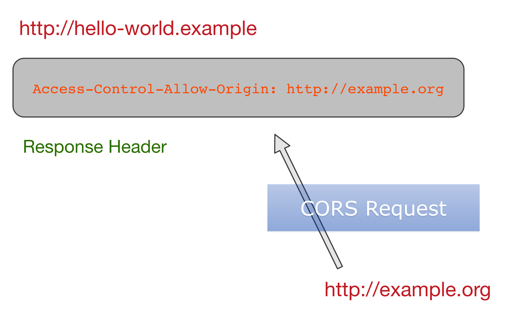

# html5

> 广义上，html5是`新一代Web技术`的`统称`，包括HTML5、CSS3、New JS APIs。

## Overview

w3c html5 标准文档: <https://www.w3.org/TR/html/>

* 非常全面的文档，可当reference
* 值得全面通读一下

## ARIA Role attribute

> Accessible Rich Internet Applications ( WAI-ARIA )

    <li role="menuitem">Open file…</li>

* wai-aria: <https://www.w3.org/TR/wai-aria/>
* role attribute: <https://www.w3.org/TR/2011/WD-role-attribute-20110113/>
* HTML allowed roles: <https://www.w3.org/TR/2016/REC-html51-20161101/dom.html#allowed-aria-roles-states-and-properties>
* XHTML role Vocabulary: <https://www.w3.org/1999/xhtml/vocab>

Every HTML element `may` have an `ARIA role attribute` specified. This is an ARIA Role attribute as defined by [WAI-ARIA].

The attribute, `if specified`, must have a value that is a set of `space-separated tokens`; each token must be a non-abstract role defined in the WAI-ARIA specification [WAI-ARIA].

The `WAI-ARIA role` that an HTML element has assigned to it is `the first non-abstract role` found in the list of values generated when the role attribute is split on spaces.

## Form

`ref`: <https://www.w3.org/TR/html/sec-forms.html>

    <form method="post" action="/post-message.cgi"
        enctype="multipart/form-data">
        
<label>Message: <input type=text name=m></label>

        
<input type=submit value="Submit message">

    </form>

### input types

> `22种`type

* hidden
* text
* checkbox
* radio
* file
* button
* search
* tel
* url
* email
* password
* date
* month
* week
* time
* datetime-local
* number
* range
* color
* submit
* image
* reset

### input common attributes

#### multiple

> The `multiple` attribute is a `boolean attribute` that indicates whether the user is to be allowed to specify `more than one` value.

`支持多个值`

    <label>Cc: <input type=email multiple name=cc></label>

`提供选项数据`

    <label>Cc: <input type=email multiple name=cc list=contacts></label>
    ...
    <datalist id="contacts">
      <option value="hedral@damowmow.com">
      <option value="pillar@example.com">
      <option value="astrophy@cute.example">
      <option value="astronomy@science.example.org">
    </datalist>

`支持多文件上传`

    <label>Attachments: <input type=file multiple name=att></label>

### form enctype

提交的编码类型，可取以下`3种`类型：

* `application/x-www-form-urlencoded`，默认取值
* `multipart/form-data`
* `text/plain`

有一种类型曾经提出来过，但是相关标准已经不再维护，所以慎用。那就是`application/json`

    <form enctype='application/json'>
      <input name='name' value='Bender'>
      <select name='hind'>
        <option selected>Bitable</option>
        <option>Kickable</option>
      </select>
      <input type='checkbox' name='shiny' checked>
    </form>

    // produces
    {
      "name":   "Bender"
    , "hind":   "Bitable"
    , "shiny":  true
    }

相关标准文档在：<https://www.w3.org/TR/2015/NOTE-html-json-forms-20150929/>

## CORS 

> Cross-Origin Resource Sharing，跨域（跨源）资源共享。

* `同源策略`，限制`脚本`发起的请求，比如XMLHttpRequest、Fetch请求
* 定义一种使`客户端`可以`跨域`请求的机制
* W3 REC文档：<http://www.w3.org/TR/cors/>
* `2014-01-16`成为`REC`文档
* MDN文档：HTTP访问控制（CORS）<https://developer.mozilla.org/zh-CN/docs/Web/HTTP/Access_control_CORS>

### 场景

* XMLHttpRequest/Fetch跨域请求
* web字体，通过`@font-face`使用跨域字体资源
* `WebGL`贴图
* 使用`drawImage`将images/video绘制到canvas
* 样式表（CSSOM）
* Scripts（未处理的异常）

### 原理简介

 

站点A`http://hello-world.example`的Server在Response Header中包含：

    Access-Control-Allow-Origin: http://example.org

站点B`http://example.org`的页面就可以不受同域限制，向站点A发起跨域请求。

#### 简单请求

1. 站点B页面发起AJAX请求：

        var client = new XMLHttpRequest()
        client.open("GET", "http://hello-world.example/hello")
        client.onreadystatechange = function() { /* do something */ }
        client.send()

2. 站点A返回Headers：

        Access-Control-Allow-Origin: http://example.org

#### 复杂请求

1. 站点B页面发起`preflight`请求，是一个`OPTIONS`请求
2. 站点A返回的Headers：

        Access-Control-Allow-Origin: http://example.org
        Access-Control-Max-Age: 3628800
        Access-Control-Allow-Methods: PUT, DELETE

3. 站点B页面发起AJAX请求：

        function deleteItem(itemId, updateUI) {
            var client = new XMLHttpRequest()
            client.open("DELETE", "http://calendar.example/app")
            client.onload = updateUI
            client.onerror = updateUI
            client.onabort = updateUI
            client.send("id=" + itemId)
        }

4. 站点A返回Headers：

        Access-Control-Allow-Origin: http://example.org

### Simple Things

#### Simple Method

* GET
* HEAD
* POST

#### Simple Header

* Accept
* Accept-Language
* Content-Language
* Content-Type: application/x-www-form-urlencoded
* Content-Type: multipart/form-data 
* Content-Type: text/plain

#### Simple Response Header

* Cache-Control
* Content-Language
* Content-Type
* Expires
* Last-Modified
* Pragma

### 字段格式

#### Response Headers

* Access-Control-Allow-Origin
* Access-Control-Allow-Credentials
* Access-Control-Expose-Headers
* Access-Control-Max-Age
* Access-Control-Allow-Methods
* Access-Control-Allow-Headers

#### Request Headers

* Origin
* Access-Control-Request-Method
* Access-Control-Request-Headers

### 服务器支持CORS

MDN: <https://developer.mozilla.org/zh-CN/docs/Web/HTTP/Server-Side_Access_Control>

## Fetch API

> 引入两个更通用的概念：Request, Response。

Support: Chrome 42+, Safari 10.1+

    @[data-script="javascript"](function(){

        var s = fly.createShow('#test_PH');
        s.show( '检测fetch API...' );

        if ( !window.fetch ) {
            s.append_show( 'fetch API尚不支持' );
            return;
        }

        fetch( 'http://258i.com/phpapp/cors.php' )
            .then( function( resp ) {
                resp.body.getReader()
                    .read()
                    .then( function ( result ) {
                        // A gbk-encoded stream
                        var uint8arr = result.value;
                        s.append_show( new TextDecoder( 'gb2312' ).decode( uint8arr ) );
                    } )
                    ;
                // console.log( resp.body );
            } );

    })();

## Base64 Utils

> atob(), btoa()

todo: `escape, unescape`

* <https://developer.mozilla.org/en-US/docs/Web/API/WindowOrWorkerGlobalScope/btoa>
* <https://developer.mozilla.org/en-US/docs/Web/API/WindowOrWorkerGlobalScope/atob>
* 编码只针对`字节流`字符串

1. The `WindowOrWorkerGlobalScope.btoa()` method creates a base-64 encoded ASCII string `from a String object in which each character in the string is treated as a byte of binary data`.
2. The `WindowOrWorkerGlobalScope.atob()` function decodes a string of data which has been encoded using base-64 encoding. You can use the btoa() method to encode and transmit data which may otherwise cause communication problems, then transmit it and use the atob() method to decode the data again.
3. In most browsers, `calling btoa() on a Unicode string` will cause an `InvalidCharacterError` exception. One option is to `escape any extended characters` so that the string you actually encode is an ASCII representation of the original. -- 比如unicode字符串需要特殊处理

<input type="file"><button>get</button>

    @[data-script="javascript"](function(){

        var s = fly.createShow('#test_base64');
        var str = 'Hello';
        var encodeStr = btoa( str );

        s.show( 'encode ascii...' );
        s.append_show( encodeStr );
        s.append_show( 'decode to ascii ...' );
        s.append_show( atob( encodeStr ) );

        var ustr = 'Hello, 胡大民';
        var encodeUStr = utoa( ustr );

        s.append_show( 'encode unicode ...' );
        s.append_show( encodeUStr );
        s.append_show( 'decode to unicode ...' );
        s.append_show( atou( encodeUStr ) );

        $( '#test_base64 button' ).on( 'click', function( e ) {
            var file = $( '#test_base64 input[type="file"]' )[ 0 ].files[ 0 ];
            if ( file ) {
                s.append_show( btoa ( file ) );
            }
        } );

        function utoa ( str ) {
            return btoa( unescape( encodeURIComponent( str ) ) );
        }

        function atou ( str ) {
            return decodeURIComponent( escape( atob( str ) ) );
        }

    })();

## Blob

## service workers
todo

## Cache API
todo

