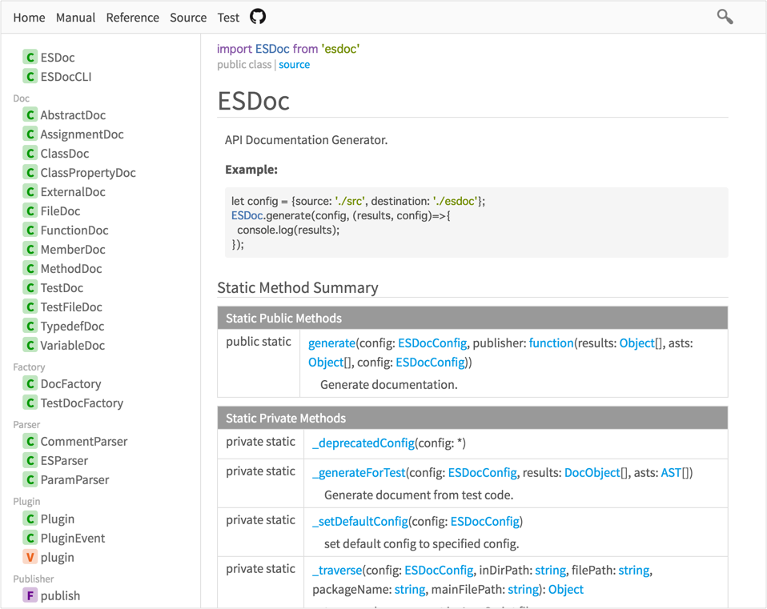

# esdoc

> 新一代JS代码（特别针对ES2015+）文档生成器

## Resources
* site: <https://esdoc.org>
* github: <https://github.com/esdoc/esdoc>
* tags: <https://esdoc.org/manual/tags.html>
* jsdoc: <ref://./jsdoc.md.html>

## Features
> <https://esdoc.org/manual/feature.html>

* 更清晰直观的ES代码文档
* 整合`源码查看`，可通过`source`按钮查看
* 计算文档覆盖率
* 整合测试代码
* 整合手册
* 提供ESDoc文档宿主服务 <https://doc.esdoc.org>

## Snapshot
 

## Usage
> <https://esdoc.org/manual/usage.html>

### Installations
    npm install --save-dev esdoc
    ./node_modules/.bin/esdoc -h

### Configuration

`.esdoc.json`：

    {
      "source": "./src",
      "destination": "./doc"
    }

