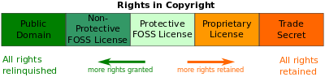

# software license

> A software license is a legal instrument (usually by way of contract law, with or without printed material) governing the use or redistribution of software.  

* 软件许可证
* 一种`法律文件`，通常以契约法的形式，打印材料可有可无
* 约束软件的`使用`和`分发`

wikipedia: <https://en.wikipedia.org/wiki/Software_license>

## 许可证赋予的权限

 

五个等级：

* Public Domain
* Non-Protective FOSS License
* Protective FOSS License
* Proprietary License
* Trade Secret

## 软件许可证和版权法

## 所有权和许可证

## 专利软件许可证

> Proprietary software licenses

## 免费开源软件许可证

* Free Software Foundation
* GNU General Public License
* Open Source Initiative
* Debian Free Software Guidelines

* permissive free software license
    * BSD license
    * MIT license

* ISC ( Internet Systems COnsortium )：一种`开放源代码`许可证。

## 许可证例子

### react

    /**
     * Copyright 2013-present, Facebook, Inc.
     * All rights reserved.
     *
     * This source code is licensed under the BSD-style license found in the
     * LICENSE file in the root directory of this source tree. An additional grant
     * of patent rights can be found in the PATENTS file in the same directory.
     *
     * @providesModule ReactVersion
     */

### jQuery

    /**
     * jQuery JavaScript Library v@VERSION
     * https://jquery.com/
     *
     * Includes Sizzle.js
     * https://sizzlejs.com/
     *
     * Copyright JS Foundation and other contributors
     * Released under the MIT license
     * https://jquery.org/license
     *
     * Date: @DATE
     */

### ISC

    /**
     * Copyright (c) 4-digit year, Company or Person's Name <E-mail address>
     * Permission to use, copy, modify, and distribute this software for any
     * purpose with or without fee is hereby granted, provided that the above
     * copyright notice and this permission notice appear in all copies.
     * THE SOFTWARE IS PROVIDED "AS IS" AND THE AUTHOR DISCLAIMS ALL WARRANTIES
     * WITH REGARD TO THIS SOFTWARE INCLUDING ALL IMPLIED WARRANTIES OF
     * MERCHANTABILITY AND FITNESS. IN NO EVENT SHALL THE AUTHOR BE LIABLE FOR
     * ANY SPECIAL, DIRECT, INDIRECT, OR CONSEQUENTIAL DAMAGES OR ANY DAMAGES
     * WHATSOEVER RESULTING FROM LOSS OF USE, DATA OR PROFITS, WHETHER IN AN
     * ACTION OF CONTRACT, NEGLIGENCE OR OTHER TORTIOUS ACTION, ARISING OUT OF
     * OR IN CONNECTION WITH THE USE OR PERFORMANCE OF THIS SOFTWARE.
     */

