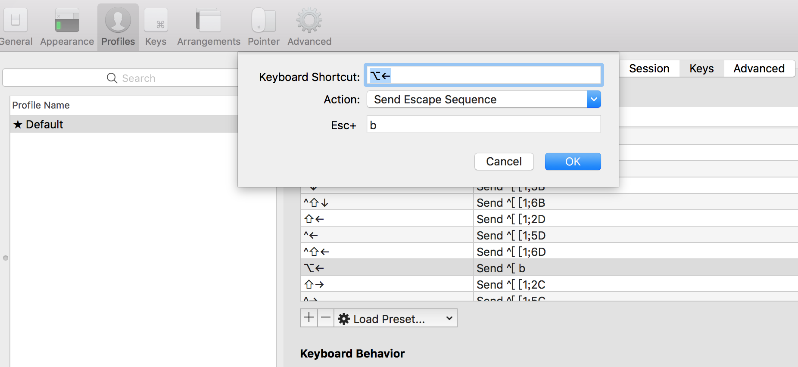

# iTerm2

## Features

* macos上取代`Terminal`的一个利器
* Terminal上跑`vim`时存在严重`性能`问题，使用iTerm2能解决性能问题
* 相比`oh my zsh`，更加简洁

## tips

* iTerm2的`smart cursor color`选项，能让cursor下的文本颜色更具可读性
* 提供脚本扩展机制，比如`imgcat`、`imgls`，可在iterm2里面`展示图片`
* mac下，按住`Command`点击文件，可以open之
* 支持给tab设置颜色 
* `Command + K`清理屏幕
* `Command + D`分屏
* `Option + Left`快速左移光标，默认不支持，需要如下设置。具体可以参考mac默认的Terminal的keys的配置。
    
    
    
* 按住`Option + Command`同时鼠标选择，可以按矩形选择
* 按住`Command`，支持多段文本的选择
* 按住`Command`，`指针`下方文本会进行创建`智能链接`，比如url、本地目录或文件等，能快捷打开

